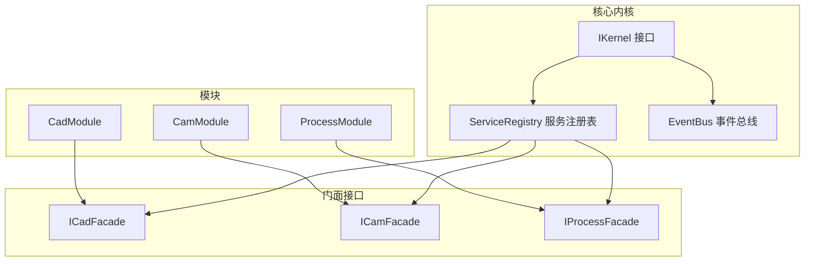
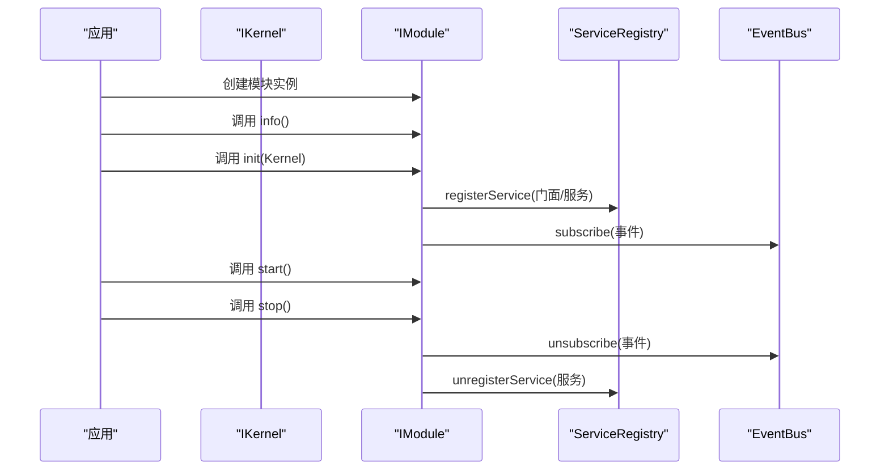
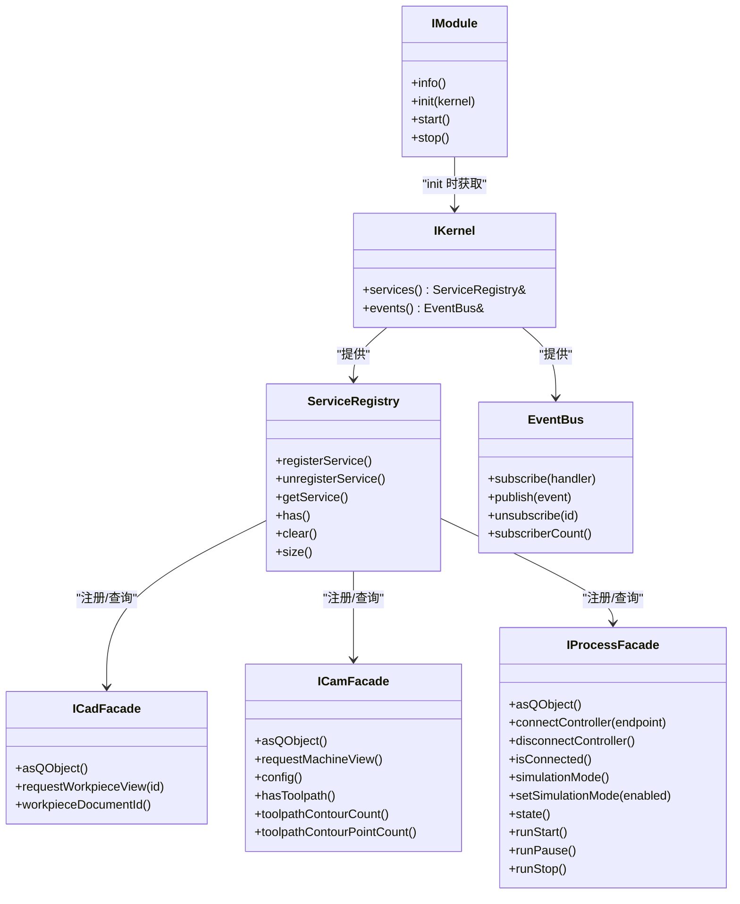

# API参考

<cite>
**本文档引用的文件**
- [i_cad_facade.h](file://src/modules/cad/i_cad_facade.h)
- [i_cam_facade.h](file://src/modules/cam/i_cam_facade.h)
- [i_process_facade.h](file://src/modules/process/i_process_facade.h)
- [i_module.h](file://src/core/kernel/i_module.h)
- [i_kernel.h](file://src/core/kernel/i_kernel.h)
- [service_registry.h](file://src/core/kernel/service_registry.h)
- [event_bus.h](file://src/core/kernel/event_bus.h)
- [event_bus.cpp](file://src/core/kernel/event_bus.cpp)
- [cam_module.h](file://src/modules/cam/cam_module.h)
- [process_execution_service.h](file://src/modules/process/execution/process_execution_service.h)
- [commands_api.h](file://src/core/command/commands_api.h)
</cite>

## 目录
1. [简介](#简介)
2. [项目结构](#项目结构)
3. [核心组件](#核心组件)
4. [架构总览](#架构总览)
5. [详细组件分析](#详细组件分析)
6. [依赖关系分析](#依赖关系分析)
7. [性能考虑](#性能考虑)
8. [故障排查指南](#故障排查指南)
9. [结论](#结论)
10. [附录](#附录)

## 简介
本文件为 LaserCNC 的 API 参考文档，聚焦于微内核框架中的公共接口、服务接口与扩展点，重点覆盖以下内容：
- 门面接口：ICadFacade、ICamFacade、IProcessFacade 的方法签名、参数说明与返回值语义
- 服务注册与事件机制：ServiceRegistry、EventBus 的使用方式与生命周期
- 模块接口：IModule 的生命周期与职责边界
- 扩展点与最佳实践：如何正确注册服务、订阅事件、实现模块与门面
- 使用示例与错误处理：基于现有实现的调用流程与常见问题定位

本参考面向第三方开发者，帮助其快速理解并集成 LaserCNC 的扩展机制。

## 项目结构
LaserCNC 采用微内核架构，模块通过 IModule 接口注册，服务通过 ServiceRegistry 统一管理，事件通过 EventBus 实现松耦合通信。CAD/CAM/Process 等功能模块通过各自的门面接口对外暴露能力，避免上层直接依赖模块内部实现。

图表来源
- [i_kernel.h:26-34](file://src/core/kernel/i_kernel.h#L26-L34)
- [service_registry.h:33-64](file://src/core/kernel/service_registry.h#L33-L64)
- [event_bus.h:87-125](file://src/core/kernel/event_bus.h#L87-L125)
- [i_cad_facade.h:24-37](file://src/modules/cad/i_cad_facade.h#L24-L37)
- [i_cam_facade.h:18-37](file://src/modules/cam/i_cam_facade.h#L18-L37)
- [i_process_facade.h:25-47](file://src/modules/process/i_process_facade.h#L25-L47)

章节来源
- [i_kernel.h:10-34](file://src/core/kernel/i_kernel.h#L10-L34)
- [i_module.h:10-73](file://src/core/kernel/i_module.h#L10-L73)

## 核心组件
本节概述关键接口与职责：
- IKernel：模块在 init 阶段获得的唯一句柄，提供服务注册表与事件总线访问
- ServiceRegistry：统一注册、查询与注销服务实例
- EventBus：类型化事件发布/订阅，支持订阅与退订
- IModule：模块生命周期契约（info/init/start/stop）
- 门面接口：ICadFacade、ICamFacade、IProcessFacade，封装模块对外能力

章节来源
- [i_kernel.h:10-34](file://src/core/kernel/i_kernel.h#L10-L34)
- [service_registry.h:33-137](file://src/core/kernel/service_registry.h#L33-L137)
- [event_bus.h:87-125](file://src/core/kernel/event_bus.h#L87-L125)
- [i_module.h:28-73](file://src/core/kernel/i_module.h#L28-L73)

## 架构总览
LaserCNC 的扩展架构围绕“内核 + 模块 + 服务 + 事件”展开。模块在 init 阶段通过 IKernel 获取服务注册表与事件总线，注册自身服务与订阅事件；start 阶段激活业务；stop 阶段反向释放。

图表来源
- [i_kernel.h:26-34](file://src/core/kernel/i_kernel.h#L26-L34)
- [service_registry.h:72-137](file://src/core/kernel/service_registry.h#L72-L137)
- [event_bus.h:93-125](file://src/core/kernel/event_bus.h#L93-L125)
- [i_module.h:54-73](file://src/core/kernel/i_module.h#L54-L73)

## 详细组件分析

### 门面接口 API 规范

#### ICadFacade（CAD 模块门面）
- 作用：为 UI/命令提供最小化、稳定的 CAD 能力入口，避免直接依赖模块实现
- 继承：IService
- 关键方法
  - asQObject(): 将门面转换为 QObject，便于信号槽连接
  - requestWorkpieceView(DocumentId id = kInvalidDocumentId): 切换 3D 视图至工件工作区；缺省使用当前项目文档
  - workpieceDocumentId(): 当前项目的工件文档 ID；无项目时返回无效 ID
- 参数与返回
  - id：文档标识符；缺省表示使用当前项目文档
  - 返回：void 或 DocumentId（根据方法）

章节来源
- [i_cad_facade.h:12-37](file://src/modules/cad/i_cad_facade.h#L12-L37)

#### ICamFacade（CAM 模块门面）
- 作用：暴露 CAM 最常用动作（切换机台视图、读取/修改 CAM 配置），并提供工具路径查询的只读接口
- 继承：IService
- 关键方法
  - asQObject(): 将门面转换为 QObject，便于信号槽连接
  - requestMachineView(): 切换 3D 视图至机台工作区（载入并定位）
  - config()/config() const: 获取 CAM 持久化配置对象的读写/只读引用
  - hasToolpath()/toolpathContourCount()/toolpathContourPointCount(index): 工具路径只读查询（默认实现返回“无可用工具路径”的语义）
- 参数与返回
  - index：轮廓索引；默认实现忽略该参数
  - 返回：布尔值或整数计数

章节来源
- [i_cam_facade.h:12-37](file://src/modules/cam/i_cam_facade.h#L12-L37)

#### IProcessFacade（Process 模块门面）
- 作用：封装控制器连接、仿真模式、运行控制与状态查询等 UI 常见动作
- 继承：IService
- 关键枚举
  - ProcessRunState：Idle、Running、Paused、Error、EmergencyStop
- 关键方法
  - asQObject(): 将门面转换为 QObject，便于信号槽连接
  - connectController(endpoint): 连接到指定控制器端点（如 tcp://127.0.0.1:5000），返回是否成功
  - disconnectController(): 断开当前控制器连接
  - isConnected(): 查询当前是否已连接
  - simulationMode()/setSimulationMode(enabled): 读取/设置仿真模式（true 表示纯软件仿真）
  - state(): 读取当前运行状态
  - runStart()/runPause()/runStop(): 开始/暂停/停止加工流程
- 参数与返回
  - endpoint：控制器端点字符串
  - enabled：布尔值
  - 返回：布尔值或 ProcessRunState

章节来源
- [i_process_facade.h:11-47](file://src/modules/process/i_process_facade.h#L11-L47)

### 服务注册接口 API 规范

#### ServiceRegistry
- 作用：统一注册、查询与注销服务实例，类型安全
- 关键模板方法
  - registerService<T>(std::shared_ptr<T> svc): 注册服务；若同类型已存在则覆盖并发出警告
  - unregisterService<T>(): 取消注册指定类型的唯一服务
  - getService<T>(): 获取服务实例；未注册返回空智能指针
  - has<T>(): 判断某类型服务是否存在
  - clear(): 清空所有服务（需确保无模块持有）
  - size(): 返回当前注册服务数量
- 注意事项
  - T 必须继承自 IService
  - 注册/注销/查询均基于类型索引，避免重复注册导致的资源泄漏

章节来源
- [service_registry.h:33-137](file://src/core/kernel/service_registry.h#L33-L137)

### 事件接口 API 规范

#### EventBus
- 作用：类型化事件发布/订阅，支持线程安全订阅与退订
- 关键方法
  - subscribe(handler): 订阅事件，返回订阅 ID；空处理器将被拒绝并返回无效 ID
  - publish(event): 发布事件；内部对桶进行快照，避免订阅列表在回调中被修改
  - unsubscribe(id): 按订阅 ID 退订
  - subscriberCount(): 返回当前总订阅数（调试用途）
- 线程模型
  - 内部使用互斥锁保护订阅桶
  - 发布时复制订阅列表快照，避免回调中修改订阅列表造成竞态

章节来源
- [event_bus.h:87-125](file://src/core/kernel/event_bus.h#L87-L125)
- [event_bus.cpp:1-37](file://src/core/kernel/event_bus.cpp#L1-L37)

### 模块接口 API 规范

#### IModule
- 作用：定义模块生命周期与职责边界
- 关键方法
  - info(): 返回模块元信息（id/displayName/version/dependencies）
  - init(kernel): 初始化阶段，注册服务、命令与事件订阅；不应主动操作其他模块服务
  - start(): 激活阶段，全部依赖已完成 init；可发布“ModuleReady”事件或加载默认数据
  - stop(): 反向释放阶段，取消订阅、注销服务、释放资源
- 错误处理
  - 任一阶段返回 false 或抛出异常将导致整体启动回滚

章节来源
- [i_module.h:10-73](file://src/core/kernel/i_module.h#L10-L73)

### 扩展点与实现示例

#### 如何注册门面服务
- 在模块 init 阶段，通过 IKernel.services() 获取 ServiceRegistry，并调用 registerService 注册门面实例
- 门面同时作为 IService 暴露给上层调用方

章节来源
- [i_kernel.h:31-33](file://src/core/kernel/i_kernel.h#L31-L33)
- [service_registry.h:72-97](file://src/core/kernel/service_registry.h#L72-L97)

#### 如何订阅模块事件
- 在模块 init 阶段，通过 IKernel.events() 获取 EventBus，并调用 subscribe 订阅感兴趣的事件类型
- 在 stop 阶段调用 unsubscribe 退订

章节来源
- [i_kernel.h:32-33](file://src/core/kernel/i_kernel.h#L32-L33)
- [event_bus.h:93-116](file://src/core/kernel/event_bus.h#L93-L116)

#### 门面到模块实现的桥接（以 CamModule 为例）
- CamModule 实现 ICamFacade，并通过 asQObject() 将自身暴露为 QObject，便于信号槽连接
- CamModule 暴露请求机台视图、配置访问等能力

章节来源
- [cam_module.h:109-134](file://src/modules/cam/cam_module.h#L109-L134)
- [i_cam_facade.h:18-37](file://src/modules/cam/i_cam_facade.h#L18-L37)

#### Process 模块执行服务（Dry-run）
- ProcessExecutionService 提供简单干跑执行能力，不依赖设备协调器
- 支持执行命令缓冲区并发出执行消息/错误信号

章节来源
- [process_execution_service.h:14-31](file://src/modules/process/execution/process_execution_service.h#L14-L31)

#### 命令容器与动作绑定
- CommandContainer 提供命令注册、查找与状态刷新能力，便于 UI 动作与命令绑定

章节来源
- [commands_api.h:52-76](file://src/core/command/commands_api.h#L52-L76)

## 依赖关系分析

图表来源
- [i_kernel.h:26-34](file://src/core/kernel/i_kernel.h#L26-L34)
- [service_registry.h:33-137](file://src/core/kernel/service_registry.h#L33-L137)
- [event_bus.h:87-125](file://src/core/kernel/event_bus.h#L87-L125)
- [i_module.h:49-73](file://src/core/kernel/i_module.h#L49-L73)
- [i_cad_facade.h:24-37](file://src/modules/cad/i_cad_facade.h#L24-L37)
- [i_cam_facade.h:18-37](file://src/modules/cam/i_cam_facade.h#L18-L37)
- [i_process_facade.h:25-47](file://src/modules/process/i_process_facade.h#L25-L47)

## 性能考虑
- 事件发布
  - 发布时对订阅桶做快照，避免回调中修改订阅列表引发竞态；适合高频事件场景
  - 订阅数量过多可能影响发布性能，建议按事件类型拆分或合并订阅
- 服务注册
  - 注册/查询为哈希表操作，复杂度 O(1)；避免在热路径频繁注册/注销
  - 同类型重复注册会覆盖旧实例，注意资源释放与弱引用管理
- 模块生命周期
  - init 阶段不应依赖其他模块业务状态；start 阶段再进行跨模块协作，降低启动时间与耦合

## 故障排查指南
- 无法获取服务
  - 检查服务是否已在模块 init 阶段注册；确认 getService<T>() 返回非空
  - 确认类型 T 继承自 IService
- 订阅无效或未收到事件
  - 确认 subscribe 返回的订阅 ID 有效；检查处理器是否为空
  - 发布前确保订阅尚未退订；避免在回调中修改订阅列表
- 模块启动失败
  - 检查 init/start 是否返回 false 或抛出异常；查看内核日志
  - 确认依赖模块已正确注册并完成 init
- Process 执行异常
  - 使用 ProcessExecutionService 的 dry-run 执行命令缓冲区，关注 executionError 信号
  - 校验命令序列与参数合法性

章节来源
- [service_registry.h:72-137](file://src/core/kernel/service_registry.h#L72-L137)
- [event_bus.h:93-125](file://src/core/kernel/event_bus.h#L93-L125)
- [event_bus.cpp:1-37](file://src/core/kernel/event_bus.cpp#L1-L37)
- [process_execution_service.h:14-31](file://src/modules/process/execution/process_execution_service.h#L14-L31)

## 结论
LaserCNC 的微内核架构通过 IKernel、ServiceRegistry、EventBus 与 IModule 形成清晰的扩展边界。门面接口（ICadFacade、ICamFacade、IProcessFacade）进一步降低了上层对模块内部的耦合。遵循本文档的接口规范与最佳实践，第三方开发者可以稳定地集成与扩展系统功能。

## 附录
- 常用调用流程
  - 获取门面：通过 IKernel.services().getService<IFace>() 获取实例
  - 订阅事件：通过 IKernel.events().subscribe(handler) 订阅
  - 模块注册：在模块 init 中 registerService 并订阅事件
- 最佳实践
  - 门面方法保持轻量，复杂逻辑下沉至模块内部
  - 使用弱引用或服务接口替代持有 IKernel*
  - 事件处理器避免长时间阻塞，必要时异步处理