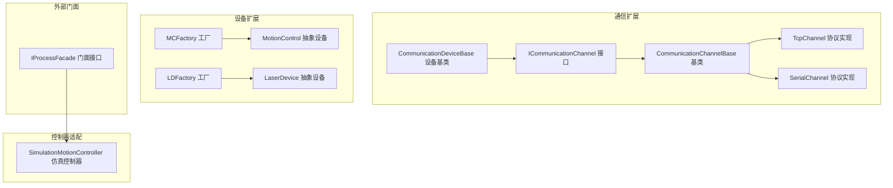
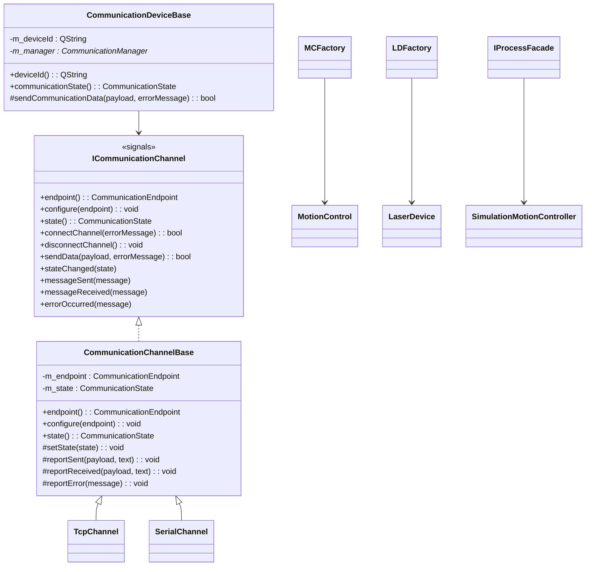
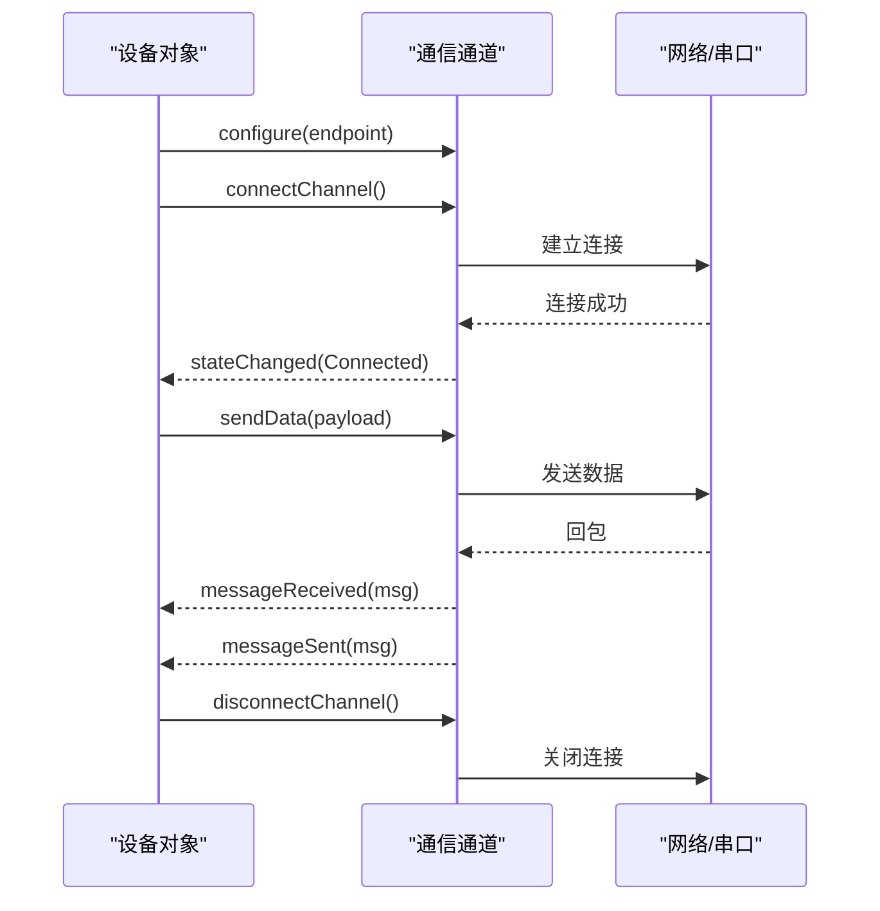
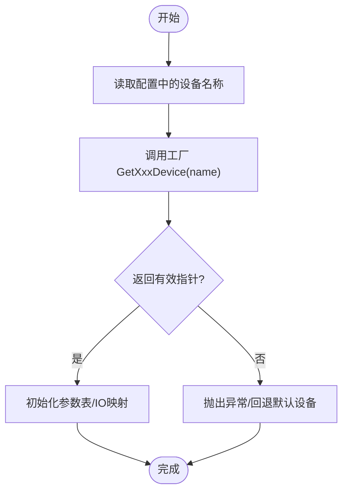
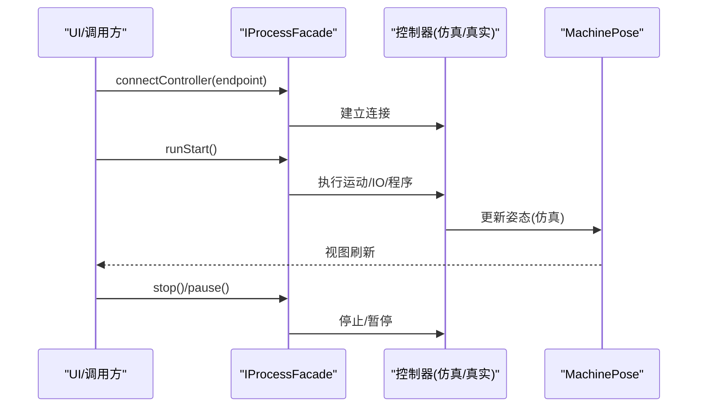
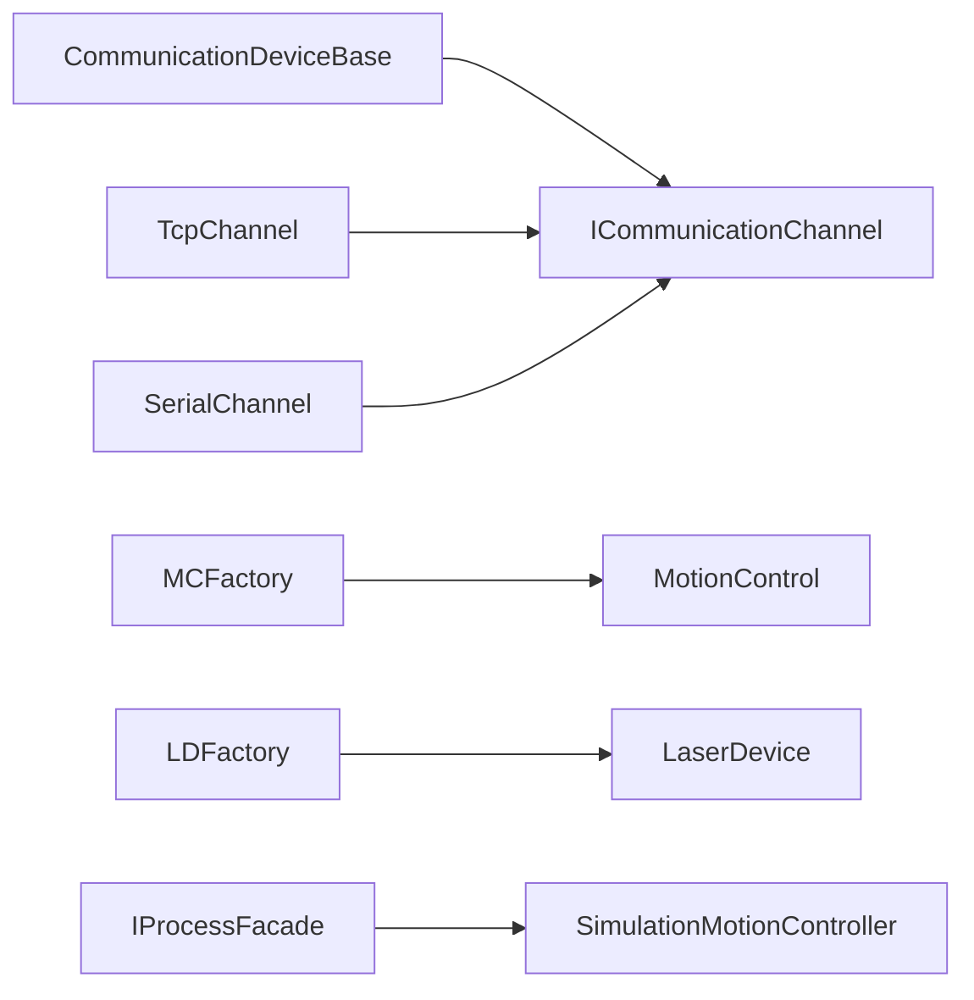

# 扩展点接口

<cite>
**本文引用的文件**
- [i_communication_channel.h](file://src/modules/process/communication/i_communication_channel.h)
- [communication_channel_base.h](file://src/modules/process/communication/communication_channel_base.h)
- [communication_device_base.h](file://src/modules/process/communication/communication_device_base.h)
- [tcp_channel.h](file://src/modules/process/communication/protocols/tcp_channel.h)
- [serial_channel.h](file://src/modules/process/communication/protocols/serial_channel.h)
- [MCFactory.h](file://src/modules/process/device/MotionControl/MCFactory.h)
- [MotionControl.h](file://src/modules/process/device/MotionControl/MotionControl.h)
- [LDFactory.h](file://src/modules/process/device/Laser/LDFactory.h)
- [LaserDevice.h](file://src/modules/process/device/Laser/LaserDevice.h)
- [simulation_motion_controller.h](file://src/modules/process/controllers/simulation_motion_controller.h)
- [i_process_facade.h](file://src/modules/process/i_process_facade.h)
</cite>

## 目录
1. [简介](#简介)
2. [项目结构](#项目结构)
3. [核心组件](#核心组件)
4. [架构总览](#架构总览)
5. [详细组件分析](#详细组件分析)
6. [依赖关系分析](#依赖关系分析)
7. [性能考量](#性能考量)
8. [故障排查指南](#故障排查指南)
9. [结论](#结论)
10. [附录](#附录)

## 简介
本文件为 LaserCNC 扩展点系统的 API 参考与实现指南，聚焦以下三类扩展点：
- 设备工厂接口：用于按名称选择并实例化具体设备（如激光器、运动控制器）
- 控制器适配器接口：统一运动控制与 IO 接口，支持真实硬件与仿真模式
- 通信通道接口：抽象网络/串口等底层通信，提供连接、收发与状态事件

文档将系统阐述各接口的职责边界、设计模式、实现规范与集成示例，并给出最佳实践、性能建议与兼容性保障策略，帮助第三方开发者正确扩展系统功能。

## 项目结构
围绕扩展点的关键目录与文件如下：
- 通信扩展：communication 子模块提供通用接口与基础实现，以及 TCP/串口协议实现
- 设备扩展：device 子模块包含运动控制与激光器两类设备及其工厂
- 控制器适配：controllers 子模块提供仿真控制器适配器
- 外部门面：i_process_facade.h 提供上层 UI/模块交互的统一入口

**图表来源**
- [i_communication_channel.h:11-32](file://src/modules/process/communication/i_communication_channel.h#L11-L32)
- [communication_channel_base.h:7-27](file://src/modules/process/communication/communication_channel_base.h#L7-L27)
- [communication_device_base.h:12-30](file://src/modules/process/communication/communication_device_base.h#L12-L30)
- [tcp_channel.h:9-24](file://src/modules/process/communication/protocols/tcp_channel.h#L9-L24)
- [serial_channel.h:9-24](file://src/modules/process/communication/protocols/serial_channel.h#L9-L24)
- [MCFactory.h:9-20](file://src/modules/process/device/MotionControl/MCFactory.h#L9-L20)
- [MotionControl.h:33-537](file://src/modules/process/device/MotionControl/MotionControl.h#L33-L537)
- [LDFactory.h:14-31](file://src/modules/process/device/Laser/LDFactory.h#L14-L31)
- [LaserDevice.h:70-131](file://src/modules/process/device/Laser/LaserDevice.h#L70-L131)
- [simulation_motion_controller.h:27-80](file://src/modules/process/controllers/simulation_motion_controller.h#L27-L80)
- [i_process_facade.h:25-47](file://src/modules/process/i_process_facade.h#L25-L47)

**章节来源**
- [i_communication_channel.h:1-32](file://src/modules/process/communication/i_communication_channel.h#L1-L32)
- [communication_channel_base.h:1-27](file://src/modules/process/communication/communication_channel_base.h#L1-L27)
- [communication_device_base.h:1-30](file://src/modules/process/communication/communication_device_base.h#L1-L30)
- [tcp_channel.h:1-24](file://src/modules/process/communication/protocols/tcp_channel.h#L1-L24)
- [serial_channel.h:1-24](file://src/modules/process/communication/protocols/serial_channel.h#L1-L24)
- [MCFactory.h:1-20](file://src/modules/process/device/MotionControl/MCFactory.h#L1-L20)
- [MotionControl.h:1-537](file://src/modules/process/device/MotionControl/MotionControl.h#L1-L537)
- [LDFactory.h:1-31](file://src/modules/process/device/Laser/LDFactory.h#L1-L31)
- [LaserDevice.h:1-131](file://src/modules/process/device/Laser/LaserDevice.h#L1-L131)
- [simulation_motion_controller.h:1-80](file://src/modules/process/controllers/simulation_motion_controller.h#L1-L80)
- [i_process_facade.h:1-47](file://src/modules/process/i_process_facade.h#L1-L47)

## 核心组件
本节概述三类扩展点的公共方法与职责，便于快速定位实现入口。

- 通信通道接口 ICommunicationChannel
  - 关键方法：endpoint()/configure()/state()/connectChannel()/disconnectChannel()/sendData()
  - 事件信号：stateChanged/messageSent/messageReceived/errorOccurred
  - 用途：抽象底层通信，屏蔽 TCP/串口等差异
  - 参考路径：[通信通道接口:11-32](file://src/modules/process/communication/i_communication_channel.h#L11-L32)

- 通信通道基类 CommunicationChannelBase
  - 职责：维护 endpoint/state，封装 setState/report* 辅助函数
  - 参考路径：[通信通道基类:7-27](file://src/modules/process/communication/communication_channel_base.h#L7-L27)

- 设备基类 CommunicationDeviceBase
  - 职责：以设备 ID 角色参与通信管理，提供 sendCommunicationData 封装
  - 参考路径：[设备基类:12-30](file://src/modules/process/communication/communication_device_base.h#L12-L30)

- 运动控制器抽象 MotionControl
  - 关键能力：连接/断开、回零/使能、Jog/相对/绝对移动、IO 读写、缓冲区/程序控制、参数表配置等
  - 参考路径：[运动控制器抽象:33-537](file://src/modules/process/device/MotionControl/MotionControl.h#L33-L537)

- 激光器抽象 LaserDevice
  - 关键能力：启动/停止激光、设置能量/频率/脉宽、参数表下发、IPG 特性查询等
  - 参考路径：[激光器抽象:70-131](file://src/modules/process/device/Laser/LaserDevice.h#L70-L131)

- 仿真控制器 SimulationMotionController
  - 关键能力：jog/moveTo/home/emergencyStop、IO 设置/读取、程序加载/暂停/恢复
  - 参考路径：[仿真控制器:27-80](file://src/modules/process/controllers/simulation_motion_controller.h#L27-L80)

- 进程门面 IProcessFacade
  - 关键能力：连接控制器端点、切换仿真模式、运行/暂停/停止、状态查询
  - 参考路径：[进程门面:25-47](file://src/modules/process/i_process_facade.h#L25-L47)

**章节来源**
- [i_communication_channel.h:11-32](file://src/modules/process/communication/i_communication_channel.h#L11-L32)
- [communication_channel_base.h:7-27](file://src/modules/process/communication/communication_channel_base.h#L7-L27)
- [communication_device_base.h:12-30](file://src/modules/process/communication/communication_device_base.h#L12-L30)
- [MotionControl.h:33-537](file://src/modules/process/device/MotionControl/MotionControl.h#L33-L537)
- [LaserDevice.h:70-131](file://src/modules/process/device/Laser/LaserDevice.h#L70-L131)
- [simulation_motion_controller.h:27-80](file://src/modules/process/controllers/simulation_motion_controller.h#L27-L80)
- [i_process_facade.h:25-47](file://src/modules/process/i_process_facade.h#L25-L47)

## 架构总览
扩展点遵循“接口 + 工厂 + 基类 + 具体实现”的分层设计，确保可替换性与可测试性。

**图表来源**
- [i_communication_channel.h:11-32](file://src/modules/process/communication/i_communication_channel.h#L11-L32)
- [communication_channel_base.h:7-27](file://src/modules/process/communication/communication_channel_base.h#L7-L27)
- [communication_device_base.h:12-30](file://src/modules/process/communication/communication_device_base.h#L12-L30)
- [tcp_channel.h:9-24](file://src/modules/process/communication/protocols/tcp_channel.h#L9-L24)
- [serial_channel.h:9-24](file://src/modules/process/communication/protocols/serial_channel.h#L9-L24)
- [MCFactory.h:9-20](file://src/modules/process/device/MotionControl/MCFactory.h#L9-L20)
- [MotionControl.h:33-537](file://src/modules/process/device/MotionControl/MotionControl.h#L33-L537)
- [LDFactory.h:14-31](file://src/modules/process/device/Laser/LDFactory.h#L14-L31)
- [LaserDevice.h:70-131](file://src/modules/process/device/Laser/LaserDevice.h#L70-L131)
- [simulation_motion_controller.h:27-80](file://src/modules/process/controllers/simulation_motion_controller.h#L27-L80)
- [i_process_facade.h:25-47](file://src/modules/process/i_process_facade.h#L25-L47)

## 详细组件分析

### 通信通道扩展点
- 设计模式
  - 接口隔离：ICommunicationChannel 定义最小可用契约
  - 组合优先：CommunicationChannelBase 提供通用状态与事件上报逻辑
  - 多态实现：TcpChannel/SerialChannel 分别覆盖 connect/sendData
- 实现规范
  - 必须在构造/配置阶段设置 endpoint
  - 连接成功后触发 stateChanged/消息事件
  - 发生错误时通过 errorOccurred 上报
- 集成示例（步骤）
  - 通过工厂或直接构造 TcpChannel/SerialChannel
  - 调用 configure(endpoint) 后 connectChannel()
  - 使用 sendData 发送数据，监听 messageReceived
  - 异常时处理 errorOccurred 并调用 disconnectChannel 清理
- 参考路径
  - [通信通道接口:11-32](file://src/modules/process/communication/i_communication_channel.h#L11-L32)
  - [通信通道基类:7-27](file://src/modules/process/communication/communication_channel_base.h#L7-L27)
  - [TCP 通道实现:9-24](file://src/modules/process/communication/protocols/tcp_channel.h#L9-L24)
  - [串口通道实现:9-24](file://src/modules/process/communication/protocols/serial_channel.h#L9-L24)

**图表来源**
- [i_communication_channel.h:18-30](file://src/modules/process/communication/i_communication_channel.h#L18-L30)
- [communication_channel_base.h:13-21](file://src/modules/process/communication/communication_channel_base.h#L13-L21)
- [tcp_channel.h:16-18](file://src/modules/process/communication/protocols/tcp_channel.h#L16-L18)
- [serial_channel.h:16-18](file://src/modules/process/communication/protocols/serial_channel.h#L16-L18)

**章节来源**
- [i_communication_channel.h:11-32](file://src/modules/process/communication/i_communication_channel.h#L11-L32)
- [communication_channel_base.h:7-27](file://src/modules/process/communication/communication_channel_base.h#L7-L27)
- [tcp_channel.h:1-24](file://src/modules/process/communication/protocols/tcp_channel.h#L1-L24)
- [serial_channel.h:1-24](file://src/modules/process/communication/protocols/serial_channel.h#L1-L24)

### 设备工厂扩展点
- 设计模式
  - 工厂模式：通过名称映射到具体设备实例，隐藏构造细节
  - 单例/静态缓存：部分工厂使用静态实例减少重复创建
- 实现规范
  - GetXxxDevice(name) 返回非空指针或抛出异常
  - GetAllXxxName(vec) 填充可用设备列表
- 集成示例（步骤）
  - 从配置读取设备名称
  - 调用 MCFactory::GetMotionController(name) 或 LDFactory::GetLaserDevice(name)
  - 初始化设备参数表与 IO 映射
- 参考路径
  - [运动控制工厂:9-20](file://src/modules/process/device/MotionControl/MCFactory.h#L9-L20)
  - [运动控制抽象:33-537](file://src/modules/process/device/MotionControl/MotionControl.h#L33-L537)
  - [激光器工厂:14-31](file://src/modules/process/device/Laser/LDFactory.h#L14-L31)
  - [激光器抽象:70-131](file://src/modules/process/device/Laser/LaserDevice.h#L70-L131)

**图表来源**
- [MCFactory.h:12-13](file://src/modules/process/device/MotionControl/MCFactory.h#L12-L13)
- [LDFactory.h:17-18](file://src/modules/process/device/Laser/LDFactory.h#L17-L18)

**章节来源**
- [MCFactory.h:1-20](file://src/modules/process/device/MotionControl/MCFactory.h#L1-L20)
- [MotionControl.h:1-537](file://src/modules/process/device/MotionControl/MotionControl.h#L1-L537)
- [LDFactory.h:1-31](file://src/modules/process/device/Laser/LDFactory.h#L1-L31)
- [LaserDevice.h:1-131](file://src/modules/process/device/Laser/LaserDevice.h#L1-L131)

### 控制器适配器扩展点
- 设计模式
  - 适配器模式：将上层命令统一转换为具体控制器指令
  - 仿真优先：仿真控制器在无硬件时提供一致行为
- 实现规范
  - 支持轴级 jog/moveTo/home/emergencyStop
  - 支持 IO 设置/读取（数字/模拟）
  - 支持程序加载/运行/暂停/恢复
- 集成示例（步骤）
  - 通过 IProcessFacade.connectController(endpoint) 建立连接
  - 在仿真模式下使用 SimulationMotionController
  - 通过门面 runStart()/pause()/stop() 控制流程
- 参考路径
  - [仿真控制器:27-80](file://src/modules/process/controllers/simulation_motion_controller.h#L27-L80)
  - [进程门面:25-47](file://src/modules/process/i_process_facade.h#L25-L47)

**图表来源**
- [i_process_facade.h:33-47](file://src/modules/process/i_process_facade.h#L33-L47)
- [simulation_motion_controller.h:34-60](file://src/modules/process/controllers/simulation_motion_controller.h#L34-L60)

**章节来源**
- [simulation_motion_controller.h:1-80](file://src/modules/process/controllers/simulation_motion_controller.h#L1-L80)
- [i_process_facade.h:1-47](file://src/modules/process/i_process_facade.h#L1-L47)

## 依赖关系分析
- 低耦合高内聚
  - 通信通道与设备解耦：设备仅依赖通信通道接口
  - 工厂与具体设备解耦：通过名称映射，新增设备无需修改调用方
- 可观测性
  - 通信通道基类集中处理状态与事件上报，便于统一日志与 UI 更新
- 可测试性
  - 仿真控制器提供与真实硬件一致的行为契约，便于单元测试与 UI 测试

**图表来源**
- [communication_device_base.h:12-30](file://src/modules/process/communication/communication_device_base.h#L12-L30)
- [i_communication_channel.h:11-32](file://src/modules/process/communication/i_communication_channel.h#L11-L32)
- [tcp_channel.h:9-24](file://src/modules/process/communication/protocols/tcp_channel.h#L9-L24)
- [serial_channel.h:9-24](file://src/modules/process/communication/protocols/serial_channel.h#L9-L24)
- [MCFactory.h:9-20](file://src/modules/process/device/MotionControl/MCFactory.h#L9-L20)
- [MotionControl.h:33-537](file://src/modules/process/device/MotionControl/MotionControl.h#L33-L537)
- [LDFactory.h:14-31](file://src/modules/process/device/Laser/LDFactory.h#L14-L31)
- [LaserDevice.h:70-131](file://src/modules/process/device/Laser/LaserDevice.h#L70-L131)
- [i_process_facade.h:25-47](file://src/modules/process/i_process_facade.h#L25-L47)

**章节来源**
- [communication_device_base.h:1-30](file://src/modules/process/communication/communication_device_base.h#L1-L30)
- [i_communication_channel.h:1-32](file://src/modules/process/communication/i_communication_channel.h#L1-L32)
- [tcp_channel.h:1-24](file://src/modules/process/communication/protocols/tcp_channel.h#L1-L24)
- [serial_channel.h:1-24](file://src/modules/process/communication/protocols/serial_channel.h#L1-L24)
- [MCFactory.h:1-20](file://src/modules/process/device/MotionControl/MCFactory.h#L1-L20)
- [MotionControl.h:1-537](file://src/modules/process/device/MotionControl/MotionControl.h#L1-L537)
- [LDFactory.h:1-31](file://src/modules/process/device/Laser/LDFactory.h#L1-L31)
- [LaserDevice.h:1-131](file://src/modules/process/device/Laser/LaserDevice.h#L1-L131)
- [i_process_facade.h:1-47](file://src/modules/process/i_process_facade.h#L1-L47)

## 性能考量
- 通信层
  - 批量发送与事件合并：在基类中统一处理上报，避免频繁 UI 刷新
  - 超时与重试：根据协议特性设置合理超时与重试策略
- 设备层
  - 参数表缓存：运动控制与激光器参数表尽量批量下发，减少往返
  - IO 读写批量化：数字/模拟 IO 读写合并，降低通信频次
- 控制器层
  - 仿真模式：避免不必要的物理 I/O，保持姿态更新与 UI 刷新的节拍一致
  - 程序缓冲：程序加载/运行/暂停/恢复采用缓冲索引，减少阻塞

[本节为通用指导，无需列出具体文件来源]

## 故障排查指南
- 通信通道
  - 症状：无法连接/频繁断开
  - 排查：检查 endpoint 配置、网络连通性、权限；关注 errorOccurred 事件
  - 参考路径：[通信通道接口:18-30](file://src/modules/process/communication/i_communication_channel.h#L18-L30)
- 设备工厂
  - 症状：设备名称无效/返回空指针
  - 排查：确认名称存在于 GetAllXxxName 列表；检查工厂静态实例初始化
  - 参考路径：[运动控制工厂:12-13](file://src/modules/process/device/MotionControl/MCFactory.h#L12-L13)
- 控制器适配
  - 症状：仿真模式下动作无效
  - 排查：确认 SimulationMotionController.start() 已调用；检查 m_running/m_estop 状态
  - 参考路径：[仿真控制器:34-40](file://src/modules/process/controllers/simulation_motion_controller.h#L34-L40)

**章节来源**
- [i_communication_channel.h:18-30](file://src/modules/process/communication/i_communication_channel.h#L18-L30)
- [MCFactory.h:12-13](file://src/modules/process/device/MotionControl/MCFactory.h#L12-L13)
- [simulation_motion_controller.h:34-40](file://src/modules/process/controllers/simulation_motion_controller.h#L34-L40)

## 结论
LaserCNC 的扩展点体系通过清晰的接口、工厂与基类设计，实现了通信、设备与控制器的高可扩展性。遵循本文的设计模式与实现规范，第三方开发者可以稳定地扩展新的通信协议、设备类型与控制器适配器，同时保持与现有系统的兼容性与一致性。

[本节为总结性内容，无需列出具体文件来源]

## 附录
- 最佳实践
  - 新增通信协议：继承 CommunicationChannelBase，实现 connect/sendData，复用基类状态与事件上报
  - 新增设备：实现 MotionControl/LaserDevice 抽象，注册到对应工厂，提供完整参数表与 IO 映射
  - 新增控制器适配：实现与仿真控制器一致的 API，确保仿真模式下的行为正确
- 兼容性保证
  - 保持接口签名稳定，避免破坏性变更
  - 通过工厂名称映射与配置文件实现运行时替换
  - 对外暴露的门面接口（如 IProcessFacade）应保持向后兼容

[本节为通用指导，无需列出具体文件来源]