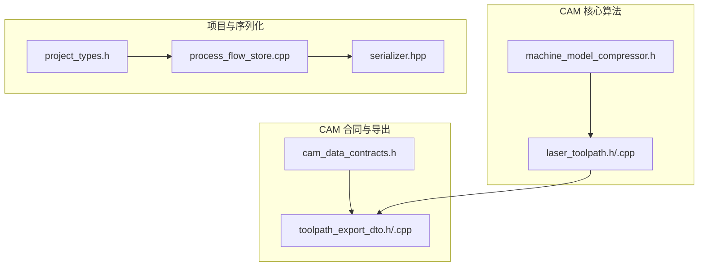
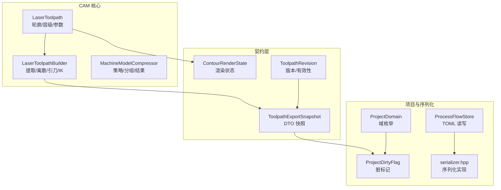
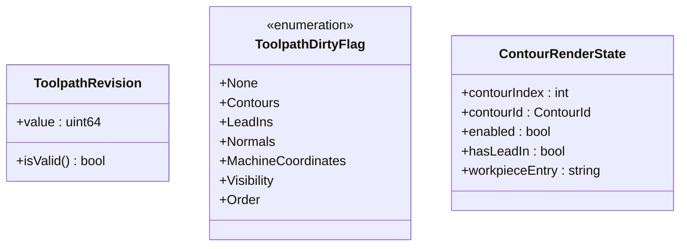
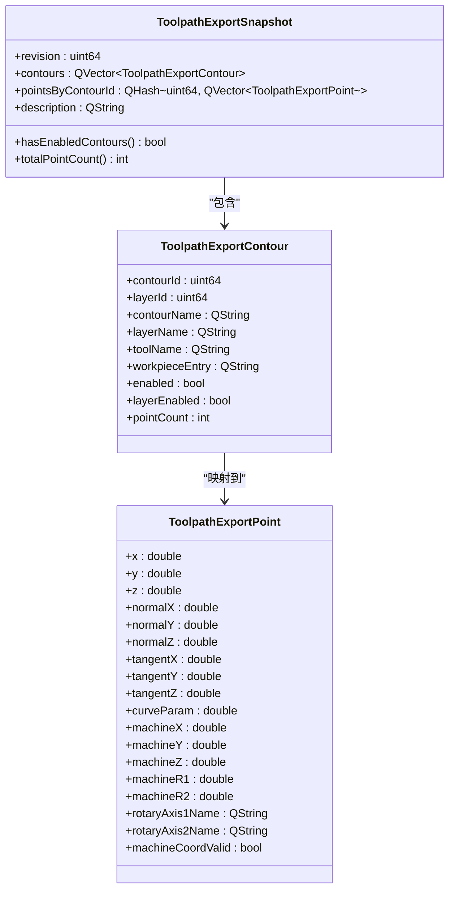
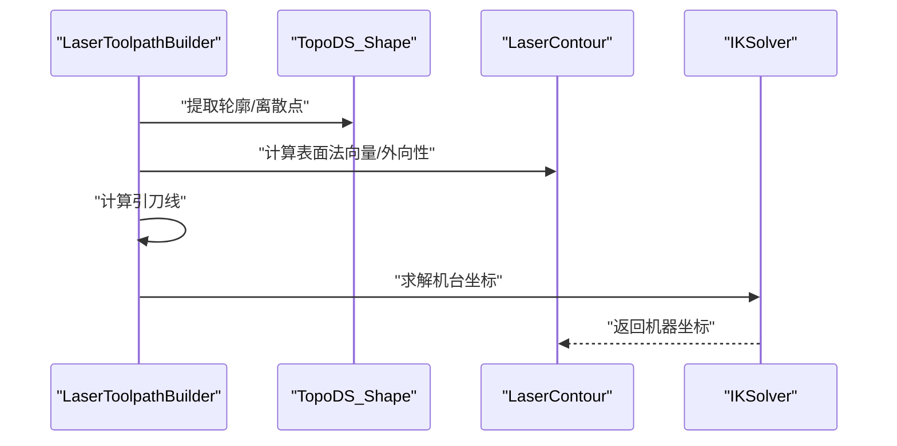
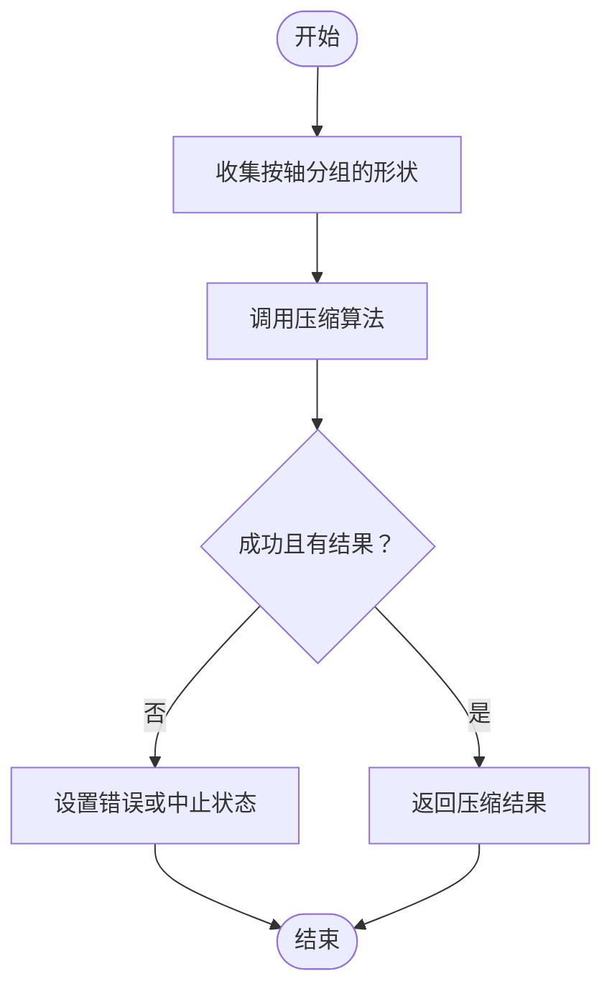
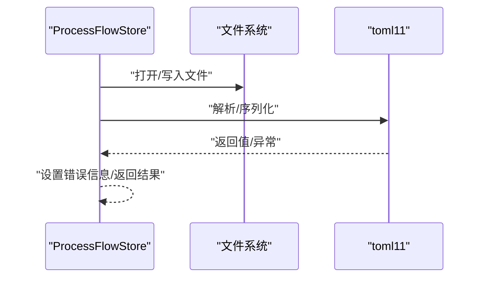
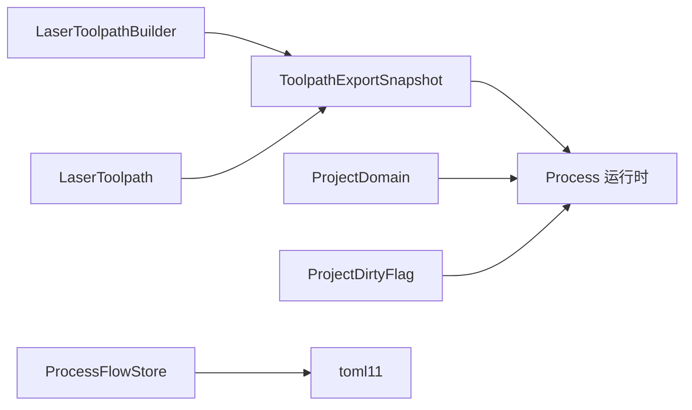

# 数据契约

<cite>
**本文引用的文件**
- [cam_data_contracts.h](file://src/modules/cam/contracts/cam_data_contracts.h)
- [toolpath_export_dto.h](file://src/modules/cam/contracts/toolpath_export_dto.h)
- [toolpath_export_dto.cpp](file://src/modules/cam/contracts/toolpath_export_dto.cpp)
- [laser_toolpath.h](file://src/core/algorithms/cam/laser_toolpath.h)
- [laser_toolpath.cpp](file://src/core/algorithms/cam/laser_toolpath.cpp)
- [machine_model_compressor.h](file://src/core/algorithms/cam/machine_model_compressor.h)
- [project_types.h](file://src/core/project/project_types.h)
- [process_flow_store.cpp](file://src/modules/process/workflow/process_flow_store.cpp)
- [serializer.hpp](file://3rd/toml11/toml11/serializer.hpp)
</cite>

## 目录
1. [简介](#简介)
2. [项目结构](#项目结构)
3. [核心组件](#核心组件)
4. [架构总览](#架构总览)
5. [详细组件分析](#详细组件分析)
6. [依赖关系分析](#依赖关系分析)
7. [性能考量](#性能考量)
8. [故障排查指南](#故障排查指南)
9. [结论](#结论)
10. [附录](#附录)

## 简介
本文件为 LaserCNC 的数据契约层 API 文档，聚焦 CAM 数据契约、工具路径导出 DTO 与项目数据类型，系统性描述数据传输对象（DTO）、数据模型与契约接口的字段定义、验证规则与序列化格式。文档旨在确保不同模块间的数据交换一致性与完整性，并提供数据转换、验证与错误处理的实现参考。

## 项目结构
数据契约层主要分布在以下位置：
- CAM 合同与导出 DTO：src/modules/cam/contracts
- CAM 工具路径核心算法与数据模型：src/core/algorithms/cam
- 项目域与脏标记：src/core/project
- TOML 序列化支持：3rd/toml11/toml11

图表来源
- [cam_data_contracts.h:1-42](file://src/modules/cam/contracts/cam_data_contracts.h#L1-L42)
- [toolpath_export_dto.h:1-66](file://src/modules/cam/contracts/toolpath_export_dto.h#L1-L66)
- [toolpath_export_dto.cpp:1-22](file://src/modules/cam/contracts/toolpath_export_dto.cpp#L1-L22)
- [laser_toolpath.h:1-165](file://src/core/algorithms/cam/laser_toolpath.h#L1-L165)
- [machine_model_compressor.h:1-50](file://src/core/algorithms/cam/machine_model_compressor.h#L1-L50)
- [project_types.h:1-39](file://src/core/project/project_types.h#L1-L39)
- [process_flow_store.cpp:148-252](file://src/modules/process/workflow/process_flow_store.cpp#L148-L252)
- [serializer.hpp:40-83](file://3rd/toml11/toml11/serializer.hpp#L40-L83)

章节来源
- [cam_data_contracts.h:1-42](file://src/modules/cam/contracts/cam_data_contracts.h#L1-L42)
- [toolpath_export_dto.h:1-66](file://src/modules/cam/contracts/toolpath_export_dto.h#L1-L66)
- [toolpath_export_dto.cpp:1-22](file://src/modules/cam/contracts/toolpath_export_dto.cpp#L1-L22)
- [laser_toolpath.h:1-165](file://src/core/algorithms/cam/laser_toolpath.h#L1-L165)
- [machine_model_compressor.h:1-50](file://src/core/algorithms/cam/machine_model_compressor.h#L1-L50)
- [project_types.h:1-39](file://src/core/project/project_types.h#L1-L39)
- [process_flow_store.cpp:148-252](file://src/modules/process/workflow/process_flow_store.cpp#L148-L252)
- [serializer.hpp:40-83](file://3rd/toml11/toml11/serializer.hpp#L40-L83)

## 核心组件
- CAM 工具路径标识与状态
  - ToolpathId、ContourId：无符号整数类型别名，用于稳定标识工具路径与轮廓。
  - ToolpathRevision：版本号，值为 0 表示无效。
  - ToolpathDirtyFlag：位标志枚举，指示轮廓、引刀线、法向量、机台坐标、可见性、顺序等子系统的脏状态。
  - ContourRenderState：渲染状态，包含轮廓索引、ID、启用状态、是否含引刀线及工件入口等。
- 工具路径导出 DTO
  - ToolpathExportPoint：导出点，包含笛卡尔坐标、法向量、切向量、曲线参数、机台坐标与旋转轴名称、有效性标记。
  - ToolpathExportContour：导出轮廓元数据，包含轮廓 ID、图层 ID、名称、图层名、刀具名、工件入口、启用状态、图层启用状态与点数。
  - ToolpathExportSnapshot：不可变快照，包含修订号、轮廓列表、按轮廓 ID 分组的点集、描述；并提供“是否存在启用轮廓”和“总点数”的查询方法。
- 项目域与脏标记
  - ProjectDomain：项目会话内的稳定数据域枚举（工程、工件、机台、CAM）。
  - ProjectDirtyFlag：项目管理器跟踪的脏区域标志，使用 QFlags 组合。
- 工具路径核心模型
  - LaserContour：从工件提取的单个轮廓，包含拓扑线、源形状、离散点、引刀参数、启用状态、名称、工件入口、面分类元数据。
  - ToolpathLayer：工具路径分层，包含层 ID、名称、颜色、刀具名、启用状态与轮廓 ID 列表。
  - LaserToolpath：工具路径集合，提供全局引刀长度与法向角度参数，以及轮廓与层级的访问接口。
  - ContourExtractionParams：基于面分类的轮廓提取参数，包括平滑角阈值、弦长偏差、是否使用面分类。
- 机台模型压缩
  - Strategy：压缩策略枚举（实体填充、外表面壳、缝合壳、边界框代理）。
  - Options/GroupInput/GroupOutput/Result：压缩输入、输出与结果结构体。

章节来源
- [cam_data_contracts.h:8-41](file://src/modules/cam/contracts/cam_data_contracts.h#L8-L41)
- [toolpath_export_dto.h:14-64](file://src/modules/cam/contracts/toolpath_export_dto.h#L14-L64)
- [toolpath_export_dto.cpp:5-21](file://src/modules/cam/contracts/toolpath_export_dto.cpp#L5-L21)
- [project_types.h:15-39](file://src/core/project/project_types.h#L15-L39)
- [laser_toolpath.h:48-121](file://src/core/algorithms/cam/laser_toolpath.h#L48-L121)
- [laser_toolpath.h:134-165](file://src/core/algorithms/cam/laser_toolpath.h#L134-L165)
- [machine_model_compressor.h:13-49](file://src/core/algorithms/cam/machine_model_compressor.h#L13-L49)

## 架构总览
数据契约层通过清晰的 DTO 与模型边界，将 CAM 计算结果以不可变快照形式传递给 Process 运行时服务，同时保留必要的元信息以便渲染与执行。项目域与脏标记用于跨模块的状态同步，TOML 序列化用于流程文档的持久化。

图表来源
- [laser_toolpath.h:91-121](file://src/core/algorithms/cam/laser_toolpath.h#L91-L121)
- [laser_toolpath.h:141-165](file://src/core/algorithms/cam/laser_toolpath.h#L141-L165)
- [machine_model_compressor.h:10-49](file://src/core/algorithms/cam/machine_model_compressor.h#L10-L49)
- [toolpath_export_dto.h:55-64](file://src/modules/cam/contracts/toolpath_export_dto.h#L55-L64)
- [cam_data_contracts.h:11-41](file://src/modules/cam/contracts/cam_data_contracts.h#L11-L41)
- [project_types.h:15-39](file://src/core/project/project_types.h#L15-L39)
- [process_flow_store.cpp:169-203](file://src/modules/process/workflow/process_flow_store.cpp#L169-L203)
- [serializer.hpp:40-83](file://3rd/toml11/toml11/serializer.hpp#L40-L83)

## 详细组件分析

### CAM 数据契约与渲染状态
- 类型别名与标志
  - 使用无符号整数作为稳定 ID，避免负值带来的歧义。
  - 脏标志采用位掩码组合，便于增量更新与局部刷新。
- 渲染状态
  - ContourRenderState 提供渲染所需的关键元信息，如启用状态、引刀线存在性与工件入口，便于 UI 与渲染管线快速判断。

图表来源
- [cam_data_contracts.h:11-41](file://src/modules/cam/contracts/cam_data_contracts.h#L11-L41)

章节来源
- [cam_data_contracts.h:8-41](file://src/modules/cam/contracts/cam_data_contracts.h#L8-L41)

### 工具路径导出 DTO
- 数据结构
  - ToolpathExportPoint：包含空间坐标、法向量、切向量、曲线参数与机台坐标，以及旋转轴名称与有效性标记，适配 Process 运行时对几何与运动学的需求。
  - ToolpathExportContour：包含轮廓与图层元信息、启用状态与点数，便于运行时选择与统计。
  - ToolpathExportSnapshot：不可变快照，提供查询方法以快速判断是否存在有效轮廓与总点数。
- 验证与序列化
  - 建议在生成快照时进行基本校验：启用轮廓的启用状态、图层启用状态与点数大于零。
  - 快照可作为后续序列化与传输的基础单元。

图表来源
- [toolpath_export_dto.h:14-64](file://src/modules/cam/contracts/toolpath_export_dto.h#L14-L64)
- [toolpath_export_dto.cpp:5-21](file://src/modules/cam/contracts/toolpath_export_dto.cpp#L5-L21)

章节来源
- [toolpath_export_dto.h:14-64](file://src/modules/cam/contracts/toolpath_export_dto.h#L14-L64)
- [toolpath_export_dto.cpp:5-21](file://src/modules/cam/contracts/toolpath_export_dto.cpp#L5-L21)

### 工具路径核心模型与算法
- 模型
  - LaserContour：承载轮廓拓扑、离散点、引刀参数与面分类元数据，支持启用状态与调试信息。
  - ToolpathLayer：分层组织轮廓，便于批量控制与渲染。
  - LaserToolpath：提供全局参数与容器访问接口，便于统一管理。
- 算法
  - 提取：从工件形状提取轮廓线，支持传统边链与面分类两种方式。
  - 离散：基于弦长偏差均匀采样，计算表面法向量并保证外向性。
  - 引刀：计算从非垂直方向进入的引刀线，避免自切。
  - 机台坐标：通过逆解求解将世界坐标转换为机台坐标。

图表来源
- [laser_toolpath.h:141-165](file://src/core/algorithms/cam/laser_toolpath.h#L141-L165)
- [laser_toolpath.cpp:353-383](file://src/core/algorithms/cam/laser_toolpath.cpp#L353-L383)
- [laser_toolpath.cpp:600-621](file://src/core/algorithms/cam/laser_toolpath.cpp#L600-L621)
- [laser_toolpath.cpp:627-640](file://src/core/algorithms/cam/laser_toolpath.cpp#L627-L640)

章节来源
- [laser_toolpath.h:48-121](file://src/core/algorithms/cam/laser_toolpath.h#L48-L121)
- [laser_toolpath.h:134-165](file://src/core/algorithms/cam/laser_toolpath.h#L134-L165)
- [laser_toolpath.cpp:353-383](file://src/core/algorithms/cam/laser_toolpath.cpp#L353-L383)
- [laser_toolpath.cpp:600-621](file://src/core/algorithms/cam/laser_toolpath.cpp#L600-L621)
- [laser_toolpath.cpp:627-640](file://src/core/algorithms/cam/laser_toolpath.cpp#L627-L640)

### 机台模型压缩
- 策略与结果
  - 支持多种压缩策略，按轴分组输入，输出合并后的形状与错误信息。
  - 结果结构体提供成功判定与中止状态，便于上层流程控制。

图表来源
- [machine_model_compressor.h:24-49](file://src/core/algorithms/cam/machine_model_compressor.h#L24-L49)

章节来源
- [machine_model_compressor.h:13-49](file://src/core/algorithms/cam/machine_model_compressor.h#L13-L49)

### 项目数据类型与序列化契约
- 项目域与脏标记
  - ProjectDomain 定义工程会话内的稳定数据域，便于模块间职责划分。
  - ProjectDirtyFlag 使用 QFlags 组合，支持多域联合标记。
- TOML 序列化
  - 流程文档通过 TOML 存储，包含节点数组与兼容项，序列化由 toml11 提供。
  - 读写流程包含路径校验、异常捕获与错误信息设置。

图表来源
- [process_flow_store.cpp:169-203](file://src/modules/process/workflow/process_flow_store.cpp#L169-L203)
- [serializer.hpp:40-83](file://3rd/toml11/toml11/serializer.hpp#L40-L83)

章节来源
- [project_types.h:15-39](file://src/core/project/project_types.h#L15-L39)
- [process_flow_store.cpp:148-252](file://src/modules/process/workflow/process_flow_store.cpp#L148-L252)
- [serializer.hpp:40-83](file://3rd/toml11/toml11/serializer.hpp#L40-L83)

## 依赖关系分析
- 内聚与耦合
  - CAM 合同层与算法层通过 ToolpathExportSnapshot 解耦，前者负责契约与 DTO，后者负责几何与运动学计算。
  - 项目域与脏标记为跨模块状态同步提供统一契约。
  - TOML 序列化独立于核心算法，仅在持久化阶段参与。
- 外部依赖
  - Qt 容器与字符串类型用于 DTO 字段与键值映射。
  - toml11 提供 TOML 解析与序列化能力。

图表来源
- [laser_toolpath.h:91-121](file://src/core/algorithms/cam/laser_toolpath.h#L91-L121)
- [toolpath_export_dto.h:55-64](file://src/modules/cam/contracts/toolpath_export_dto.h#L55-L64)
- [project_types.h:15-39](file://src/core/project/project_types.h#L15-L39)
- [process_flow_store.cpp:169-203](file://src/modules/process/workflow/process_flow_store.cpp#L169-L203)

章节来源
- [laser_toolpath.h:91-121](file://src/core/algorithms/cam/laser_toolpath.h#L91-L121)
- [toolpath_export_dto.h:55-64](file://src/modules/cam/contracts/toolpath_export_dto.h#L55-L64)
- [project_types.h:15-39](file://src/core/project/project_types.h#L15-L39)
- [process_flow_store.cpp:169-203](file://src/modules/process/workflow/process_flow_store.cpp#L169-L203)

## 性能考量
- 快照不可变性
  - ToolpathExportSnapshot 作为不可变快照，有利于并发安全与缓存复用，减少重复计算。
- 离散密度控制
  - 通过 ContourExtractionParams 中的弦长偏差控制采样密度，平衡精度与性能。
- 分层与选择
  - ToolpathLayer 与 ContourRenderState 支持按层与轮廓启用状态进行选择性渲染与执行，降低无效工作量。
- 压缩策略
  - 机台模型压缩策略影响几何复杂度与后续计算成本，应根据场景选择合适策略。

## 故障排查指南
- 快照有效性
  - 若 hasEnabledContours 返回 false 或 totalPointCount 为 0，检查轮廓启用状态、图层启用状态与离散化过程。
- 引刀线计算
  - 引刀线为空表示入口点或方向计算失败，需检查 Contour 与入口参数。
- 机台坐标求解
  - 机台坐标无效可能源于 IK 求解失败或变换矩阵问题，需确认工作坐标系与姿态。
- 序列化错误
  - TOML 读写失败时，检查文件路径、权限与异常信息；确保根表与节点数组存在。

章节来源
- [toolpath_export_dto.cpp:5-21](file://src/modules/cam/contracts/toolpath_export_dto.cpp#L5-L21)
- [laser_toolpath.cpp:600-621](file://src/core/algorithms/cam/laser_toolpath.cpp#L600-L621)
- [laser_toolpath.cpp:627-640](file://src/core/algorithms/cam/laser_toolpath.cpp#L627-L640)
- [process_flow_store.cpp:169-203](file://src/modules/process/workflow/process_flow_store.cpp#L169-L203)

## 结论
数据契约层通过明确的 DTO、模型与序列化契约，实现了 CAM 与 Process 模块间的数据一致性与可扩展性。借助不可变快照、分层组织与策略化的压缩机制，系统在保证精度的同时兼顾性能与可维护性。

## 附录
- 字段与验证建议
  - ToolpathExportPoint：机台坐标有效性标记用于运行时校验；坐标与法向量应满足物理约束。
  - ToolpathExportContour：启用状态与点数应与实际离散结果一致。
  - ToolpathExportSnapshot：生成前进行启用轮廓与点数校验，确保运行时可用性。
- 序列化格式
  - TOML 表结构包含 schemaVersion、nodes 与 items，兼容旧版 items 字段，便于迁移。

章节来源
- [toolpath_export_dto.h:14-64](file://src/modules/cam/contracts/toolpath_export_dto.h#L14-L64)
- [process_flow_store.cpp:233-250](file://src/modules/process/workflow/process_flow_store.cpp#L233-L250)