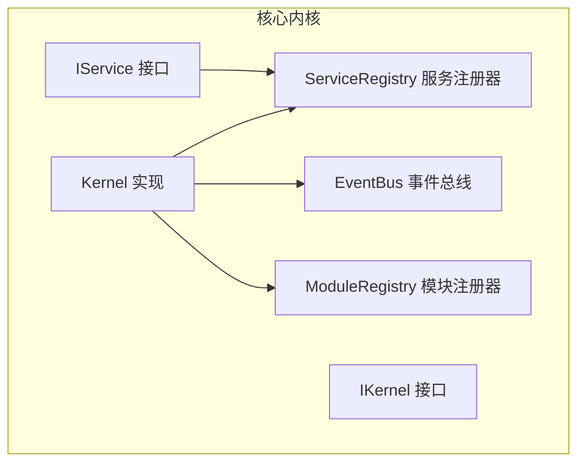
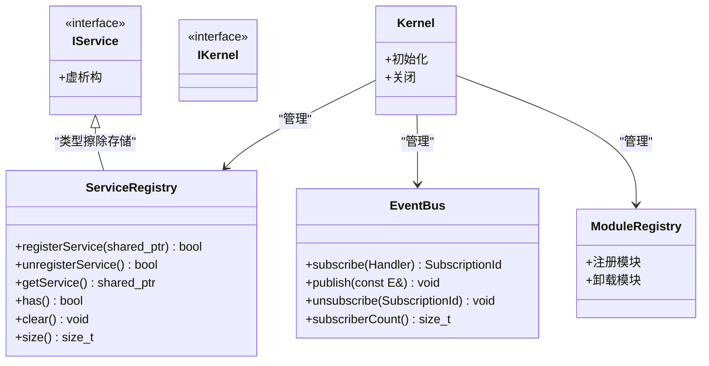
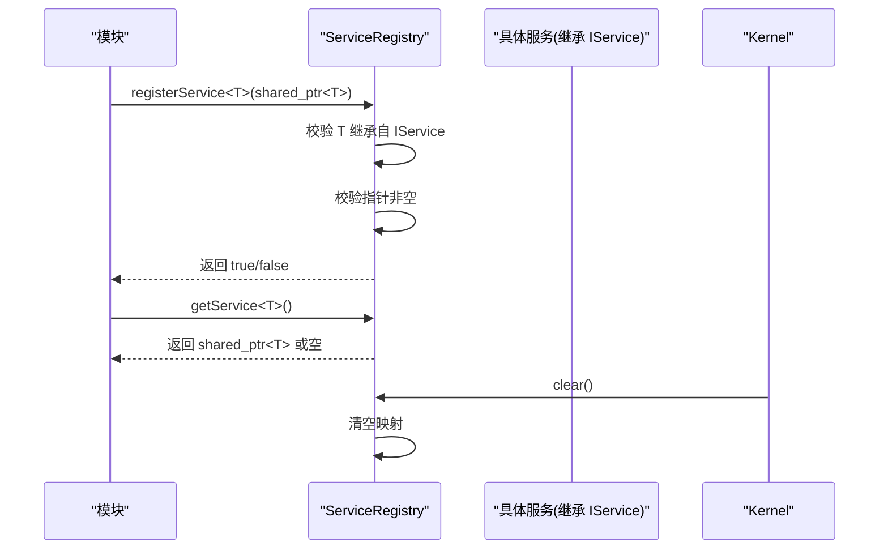
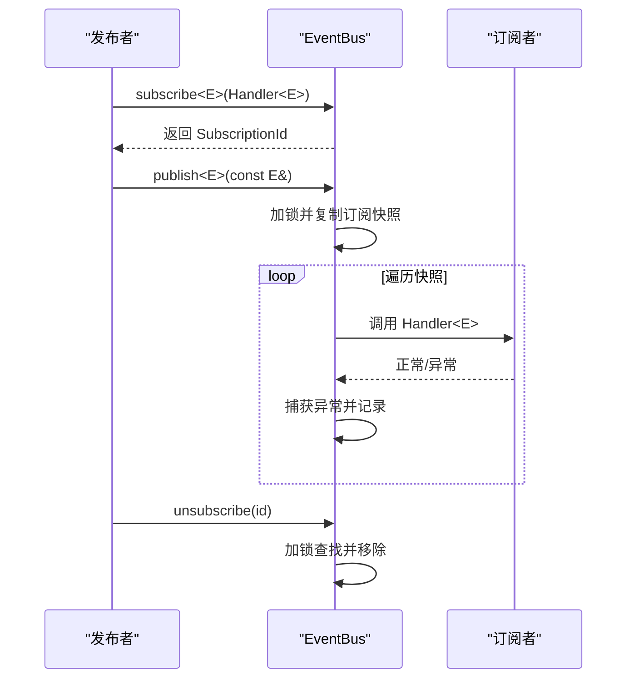
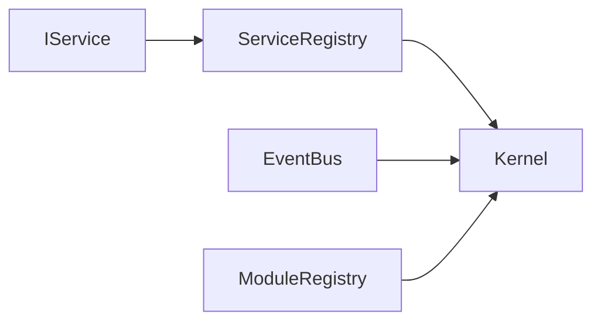

# 服务接口

<cite>
**本文引用的文件**
- [i_service.h](file://src/core/kernel/i_service.h)
- [service_registry.h](file://src/core/kernel/service_registry.h)
- [service_registry.cpp](file://src/core/kernel/service_registry.cpp)
- [event_bus.h](file://src/core/kernel/event_bus.h)
- [event_bus.cpp](file://src/core/kernel/event_bus.cpp)
- [i_kernel.h](file://src/core/kernel/i_kernel.h)
- [kernel.h](file://src/core/kernel/kernel.h)
- [module_registry.h](file://src/core/kernel/module_registry.h)
- [module_registry.cpp](file://src/core/kernel/module_registry.cpp)
</cite>

## 目录
1. [简介](#简介)
2. [项目结构](#项目结构)
3. [核心组件](#核心组件)
4. [架构总览](#架构总览)
5. [详细组件分析](#详细组件分析)
6. [依赖关系分析](#依赖关系分析)
7. [性能考量](#性能考量)
8. [故障排查指南](#故障排查指南)
9. [结论](#结论)
10. [附录](#附录)

## 简介
本文件为 LaserCNC 微内核服务接口系统的完整 API 参考与设计说明，聚焦以下主题：
- IService 接口定义与实现规范
- ServiceRegistry 服务注册机制与生命周期管理
- EventBus 事件总线的订阅/发布模型与线程安全策略
- 服务间通信最佳实践与性能优化建议
- 依赖注入与模块化集成思路

该系统采用“服务定位器 + 发布/订阅”的组合模式，既满足跨模块共享能力的解耦，又提供低延迟、强一致性的事件通信通道。

## 项目结构
围绕服务接口系统的核心文件位于 src/core/kernel 目录，主要包含：
- 服务接口基类：IService
- 服务注册中心：ServiceRegistry
- 事件总线：EventBus
- 内核与模块注册：IKernel、Kernel、ModuleRegistry

图表来源
- [i_service.h:19-23](file://src/core/kernel/i_service.h#L19-L23)
- [service_registry.h:26-68](file://src/core/kernel/service_registry.h#L26-L68)
- [event_bus.h:46-89](file://src/core/kernel/event_bus.h#L46-L89)
- [i_kernel.h:1-200](file://src/core/kernel/i_kernel.h#L1-L200)
- [kernel.h:1-200](file://src/core/kernel/kernel.h#L1-L200)
- [module_registry.h:1-200](file://src/core/kernel/module_registry.h#L1-L200)

章节来源
- [i_service.h:1-26](file://src/core/kernel/i_service.h#L1-L26)
- [service_registry.h:1-138](file://src/core/kernel/service_registry.h#L1-L138)
- [event_bus.h:1-158](file://src/core/kernel/event_bus.h#L1-L158)
- [module_registry.h:1-200](file://src/core/kernel/module_registry.h#L1-L200)
- [module_registry.cpp:1-200](file://src/core/kernel/module_registry.cpp#L1-L200)
- [i_kernel.h:1-200](file://src/core/kernel/i_kernel.h#L1-L200)
- [kernel.h:1-200](file://src/core/kernel/kernel.h#L1-L200)

## 核心组件
本节从 API 角度梳理各组件的公共方法、行为约束与使用边界。

- IService 接口
  - 定位：所有“跨模块共享能力对象”的统一标记基类
  - 约束：仅声明纯虚方法与信号（如有），不包含实现细节
  - 作用：通过 ServiceRegistry 以统一的 std::shared_ptr<IService> 进行类型擦除存储与按类型查找

- ServiceRegistry 服务注册器
  - 注册 registerService<T>(shared_ptr<T>)
    - 参数要求：T 必须继承自 IService；指针非空
    - 返回值：首次注册返回 true，重复注册会覆盖并记录警告
  - 取消注册 unregisterService<T>()
    - 返回值：存在并成功移除返回 true
  - 获取服务 getService<T>()
    - 返回值：未注册返回空 shared_ptr，调用方必须进行空检查
  - 查询 has<T>()
    - 返回值：是否存在已注册的服务
  - 清空 clear()
    - 用途：Kernel 关闭时反序释放服务；需确保无模块仍在持有这些服务

- EventBus 事件总线
  - 订阅 subscribe<E>(Handler<E>)
    - 返回值：SubscriptionId；空 handler 将返回无效句柄
  - 发布 publish<E>(const E&)
    - 行为：在发布线程同步回调，按订阅顺序依次调用
  - 取消订阅 unsubscribe(SubscriptionId)
    - 行为：无效或已取消的句柄被静默忽略
  - 订阅统计 subscriberCount()
    - 用途：调试/监控

章节来源
- [i_service.h:19-23](file://src/core/kernel/i_service.h#L19-L23)
- [service_registry.h:26-68](file://src/core/kernel/service_registry.h#L26-L68)
- [service_registry.cpp:7-15](file://src/core/kernel/service_registry.cpp#L7-L15)
- [event_bus.h:46-89](file://src/core/kernel/event_bus.h#L46-L89)
- [event_bus.cpp:5-35](file://src/core/kernel/event_bus.cpp#L5-L35)

## 架构总览
下图展示服务接口系统在微内核中的角色与交互：

图表来源
- [i_service.h:19-23](file://src/core/kernel/i_service.h#L19-L23)
- [service_registry.h:26-68](file://src/core/kernel/service_registry.h#L26-L68)
- [event_bus.h:46-89](file://src/core/kernel/event_bus.h#L46-L89)
- [i_kernel.h:1-200](file://src/core/kernel/i_kernel.h#L1-L200)
- [kernel.h:1-200](file://src/core/kernel/kernel.h#L1-L200)
- [module_registry.h:1-200](file://src/core/kernel/module_registry.h#L1-L200)

## 详细组件分析

### IService 接口
- 设计意图
  - 作为“跨模块共享能力对象”的标记基类，确保所有服务接口具备统一的生命周期与类型识别能力
  - 通过继承 IService，服务可被 ServiceRegistry 以类型擦除的方式存储与检索
- 实现规范
  - 仅声明纯虚方法与信号（如有）
  - 不包含任何实现细节，便于模块仅包含接口头文件，避免对实现的硬依赖
  - 便于测试注入 mock 实现

章节来源
- [i_service.h:3-23](file://src/core/kernel/i_service.h#L3-L23)

### ServiceRegistry 服务注册机制
- 注册流程
  - 使用 registerService<T>(shared_ptr<T>) 完成注册
  - 模板静态断言确保 T 继承自 IService
  - 对空指针进行校验并记录警告
  - 重复注册会覆盖旧实例并记录警告
- 查询与存在性判断
  - getService<T>() 返回空 shared_ptr 时需调用方自行处理
  - has<T>() 提供快速存在性检查
- 取消注册与清理
  - unregisterService<T>() 移除指定类型的注册项
  - clear() 在 Kernel 关闭时调用，清空所有服务映射
- 生命周期管理
  - ServiceRegistry 仅为容器，不负责服务的创建与销毁
  - Kernel 负责在关闭阶段以反序销毁服务，避免依赖倒置

图表来源
- [service_registry.h:72-135](file://src/core/kernel/service_registry.h#L72-L135)
- [service_registry.cpp:7-15](file://src/core/kernel/service_registry.cpp#L7-L15)

章节来源
- [service_registry.h:26-68](file://src/core/kernel/service_registry.h#L26-L68)
- [service_registry.h:72-135](file://src/core/kernel/service_registry.h#L72-L135)
- [service_registry.cpp:7-15](file://src/core/kernel/service_registry.cpp#L7-L15)

### EventBus 事件总线
- 订阅/发布模型
  - subscribe<E>(Handler<E>) 返回 SubscriptionId，用于后续取消订阅
  - publish<E>(const E&) 在发布线程同步回调，按订阅顺序调用
  - unsubscribe(SubscriptionId) 支持在生命周期结束时主动取消
- 线程安全与性能
  - 注册、发布、取消订阅均受同一互斥锁保护
  - 发布时复制订阅快照，避免回调期间订阅/取消导致的迭代器失效
  - 回调异常被捕获并记录，不影响其他订阅者
- 使用建议
  - 事件类型应为轻量值类型，拷贝/移动廉价
  - UI 模块如需切换到 GUI 线程，请在订阅者内部使用队列方式的线程切换

图表来源
- [event_bus.h:94-155](file://src/core/kernel/event_bus.h#L94-L155)
- [event_bus.cpp:5-35](file://src/core/kernel/event_bus.cpp#L5-L35)

章节来源
- [event_bus.h:46-89](file://src/core/kernel/event_bus.h#L46-L89)
- [event_bus.h:94-155](file://src/core/kernel/event_bus.h#L94-L155)
- [event_bus.cpp:5-35](file://src/core/kernel/event_bus.cpp#L5-L35)

### 依赖注入与模块化集成
- 依赖注入
  - 通过 ServiceRegistry 注入服务实例，模块仅依赖接口头文件
  - 测试场景可用 mock 实现替换真实服务
- 模块注册
  - ModuleRegistry 负责模块的注册与卸载
  - Kernel 在启动阶段完成模块初始化，在关闭阶段反序卸载模块，确保服务生命周期一致性

章节来源
- [module_registry.h:1-200](file://src/core/kernel/module_registry.h#L1-L200)
- [module_registry.cpp:1-200](file://src/core/kernel/module_registry.cpp#L1-L200)
- [i_kernel.h:1-200](file://src/core/kernel/i_kernel.h#L1-L200)
- [kernel.h:1-200](file://src/core/kernel/kernel.h#L1-L200)

## 依赖关系分析
- 组件耦合
  - ServiceRegistry 与 IService 强耦合（类型擦除存储）
  - EventBus 与事件类型 E 强耦合（模板化回调）
  - Kernel 与 ServiceRegistry、EventBus、ModuleRegistry 弱耦合（组合关系）
- 外部依赖
  - 日志系统：LCNC_DEBUG/LCNC_WARN/LCNC_ERR 用于运行时诊断
  - 标准库：std::shared_ptr、std::unordered_map、std::type_index、std::mutex 等

图表来源
- [i_service.h:19-23](file://src/core/kernel/i_service.h#L19-L23)
- [service_registry.h:26-68](file://src/core/kernel/service_registry.h#L26-L68)
- [event_bus.h:46-89](file://src/core/kernel/event_bus.h#L46-L89)
- [module_registry.h:1-200](file://src/core/kernel/module_registry.h#L1-L200)
- [kernel.h:1-200](file://src/core/kernel/kernel.h#L1-L200)

章节来源
- [service_registry.h:66-68](file://src/core/kernel/service_registry.h#L66-L68)
- [event_bus.h:86-88](file://src/core/kernel/event_bus.h#L86-L88)
- [module_registry.h:1-200](file://src/core/kernel/module_registry.h#L1-L200)

## 性能考量
- ServiceRegistry
  - 注册/查询基于 std::unordered_map，平均 O(1) 复杂度
  - 建议：避免频繁重复注册同一服务；在模块初始化阶段集中完成注册
- EventBus
  - 订阅/取消订阅与发布均受同一互斥锁保护，适合中小规模订阅者
  - 发布时复制快照，避免回调期间迭代器失效，但会带来一次额外拷贝
  - 建议：事件类型保持轻量；回调逻辑尽量短小；复杂 UI 更新使用队列方式切换线程
- Kernel 生命周期
  - 关闭阶段以反序销毁服务，减少依赖破坏风险
  - 建议：在 clear() 前确保无模块仍在持有服务引用

[本节为通用性能指导，无需特定文件来源]

## 故障排查指南
- 服务注册问题
  - 症状：registerService<T>() 返回 false
  - 可能原因：T 未继承自 IService、传入空指针、重复注册被覆盖
  - 排查：检查模板参数与指针有效性；关注日志中的警告信息
- 服务获取问题
  - 症状：getService<T>() 返回空 shared_ptr
  - 可能原因：尚未注册或已被注销
  - 排查：确认注册顺序与生命周期；使用 has<T>() 进行预检查
- 事件订阅问题
  - 症状：subscribe<E>() 返回无效句柄
  - 可能原因：handler 为空
  - 排查：确保回调有效；关注日志中的警告
- 事件发布问题
  - 症状：部分订阅者未收到消息或异常
  - 可能原因：回调抛出异常
  - 排查：捕获并记录异常；确认订阅者生命周期覆盖发布期
- 订阅清理问题
  - 症状：unsubscribe(id) 无效
  - 可能原因：id 无效或已取消
  - 排查：确认返回值与日志输出；在模块销毁时主动调用取消订阅

章节来源
- [service_registry.h:72-97](file://src/core/kernel/service_registry.h#L72-L97)
- [service_registry.h:118-129](file://src/core/kernel/service_registry.h#L118-L129)
- [event_bus.h:94-116](file://src/core/kernel/event_bus.h#L94-L116)
- [event_bus.h:119-155](file://src/core/kernel/event_bus.h#L119-L155)
- [event_bus.cpp:5-24](file://src/core/kernel/event_bus.cpp#L5-L24)

## 结论
LaserCNC 的服务接口系统以 IService 为统一入口，结合 ServiceRegistry 的类型擦除存储与 EventBus 的同步发布/订阅，构建了简洁、可测试且易于扩展的微内核基础设施。遵循本文的实现规范与最佳实践，可在保证性能的同时提升系统的可维护性与可靠性。

[本节为总结性内容，无需特定文件来源]

## 附录

### API 方法速查表
- IService
  - 虚析构（默认实现）

- ServiceRegistry
  - registerService<T>(shared_ptr<T>) -> bool
  - unregisterService<T>() -> bool
  - getService<T>() -> shared_ptr<T>
  - has<T>() -> bool
  - clear() -> void
  - size() -> size_t

- EventBus
  - subscribe<E>(Handler<E>) -> SubscriptionId
  - publish<E>(const E&) -> void
  - unsubscribe(SubscriptionId) -> void
  - subscriberCount() -> size_t

章节来源
- [i_service.h:19-23](file://src/core/kernel/i_service.h#L19-L23)
- [service_registry.h:26-68](file://src/core/kernel/service_registry.h#L26-L68)
- [event_bus.h:46-89](file://src/core/kernel/event_bus.h#L46-L89)