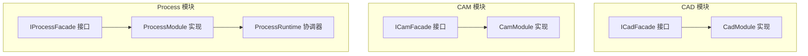
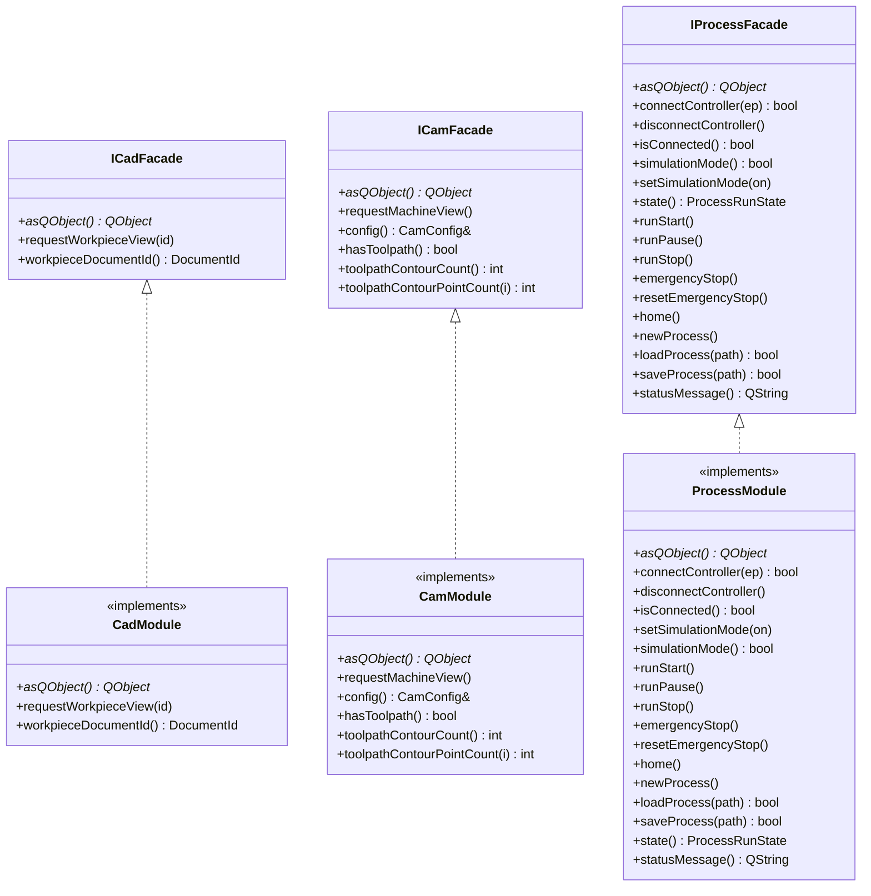
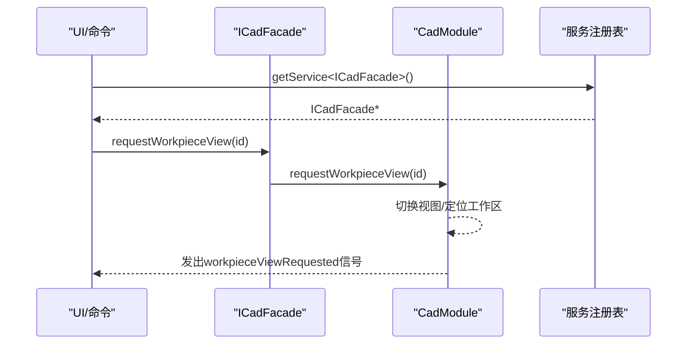
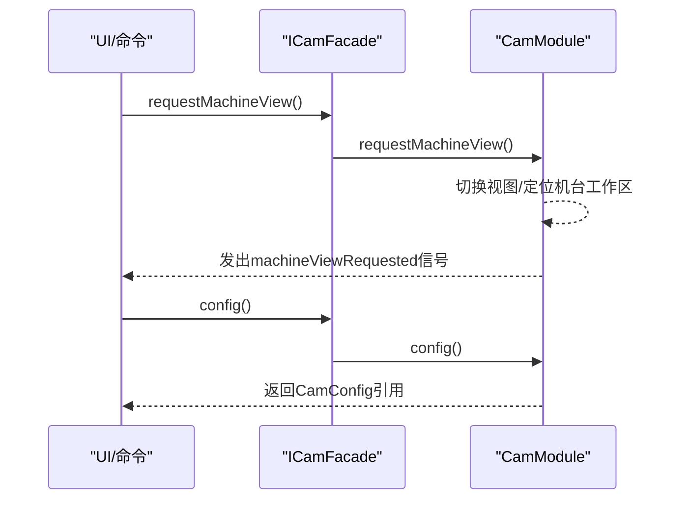
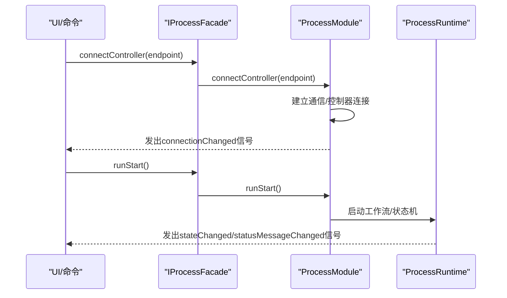
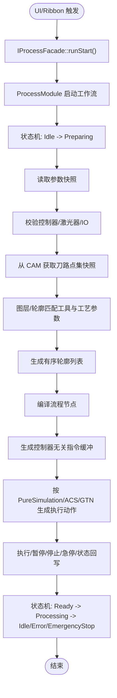
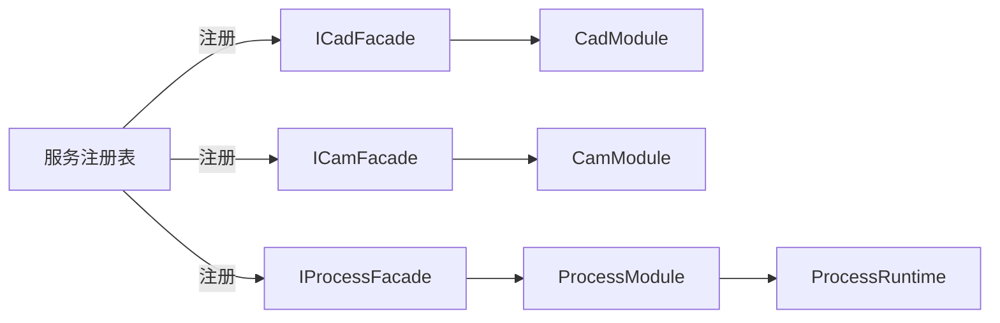

# 核心接口

<cite>
**本文引用的文件**
- [i_cad_facade.h](file://src/modules/cad/i_cad_facade.h)
- [cad_module.h](file://src/modules/cad/cad_module.h)
- [cad_module.cpp](file://src/modules/cad/cad_module.cpp)
- [i_cam_facade.h](file://src/modules/cam/i_cam_facade.h)
- [cam_module.h](file://src/modules/cam/cam_module.h)
- [i_process_facade.h](file://src/modules/process/i_process_facade.h)
- [process_module.h](file://src/modules/process/process_module.h)
- [process_runtime.h](file://src/modules/process/runtime/process_runtime.h)
- [process模块框架.md](file://process模块框架.md)
- [process模块重构计划.md](file://process模块重构计划.md)
</cite>

## 目录
1. [简介](#简介)
2. [项目结构](#项目结构)
3. [核心组件](#核心组件)
4. [架构总览](#架构总览)
5. [详细组件分析](#详细组件分析)
6. [依赖分析](#依赖分析)
7. [性能考虑](#性能考虑)
8. [故障排查指南](#故障排查指南)
9. [结论](#结论)
10. [附录](#附录)

## 简介
本文件面向LaserCNC的开发者，系统化梳理并记录三大核心门面接口：ICadFacade、ICamFacade、IProcessFacade。内容涵盖接口职责、方法签名与行为、异常与错误处理策略、调用场景、接口版本与兼容性、迁移指南，以及与实现类之间的关系与依赖。目标是帮助开发者正确理解并扩展这些接口，安全地进行功能扩展与模块集成。

## 项目结构
围绕核心接口，相关代码分布在以下模块：
- CAD模块：对外门面接口为ICadFacade，实现类为CadModule
- CAM模块：对外门面接口为ICamFacade，实现类为CamModule
- Process模块：对外门面接口为IProcessFacade，实现类为ProcessModule，内部运行协调由ProcessRuntime负责

图表来源
- [i_cad_facade.h:24-37](file://src/modules/cad/i_cad_facade.h#L24-L37)
- [cad_module.h:45](file://src/modules/cad/cad_module.h#L45)
- [i_cam_facade.h:18-37](file://src/modules/cam/i_cam_facade.h#L18-L37)
- [cam_module.h:64](file://src/modules/cam/cam_module.h#L64)
- [i_process_facade.h:25-60](file://src/modules/process/i_process_facade.h#L25-L60)
- [process_module.h:35](file://src/modules/process/process_module.h#L35)
- [process_runtime.h:15-35](file://src/modules/process/runtime/process_runtime.h#L15-L35)

章节来源
- [i_cad_facade.h:12-37](file://src/modules/cad/i_cad_facade.h#L12-L37)
- [i_cam_facade.h:12-37](file://src/modules/cam/i_cam_facade.h#L12-L37)
- [i_process_facade.h:19-60](file://src/modules/process/i_process_facade.h#L19-L60)

## 核心组件
本节对三大门面接口进行逐项说明，包括职责、方法、参数、返回值、异常与错误处理策略、使用场景与最佳实践。

### ICadFacade（CAD门面）
- 职责
  - 将UI/命令对CAD子系统的依赖收敛为一组语义接口，避免直接持有CadModule指针与包含内部头文件
  - 提供CAD工作区视图切换、当前工件文档ID查询等常用动作
- 方法清单
  - asQObject(): QObject*
    - 用途：让调用方挂接CadModule的Qt信号槽
    - 返回：指向实现对象的QObject基类指针
    - 异常：无抛出约定；返回this
  - requestWorkpieceView(id): void
    - 用途：切换3D视图至工件工作区
    - 参数：id（可选，默认使用当前项目文档）
    - 返回：无
    - 异常：无抛出约定；内部可能发出workpieceViewRequested信号
  - workpieceDocumentId(): DocumentId
    - 用途：查询当前项目的工件文档ID
    - 参数：无
    - 返回：DocumentId（无项目时返回kInvalidDocumentId）
    - 异常：无抛出约定
- 使用场景
  - UI在Ribbon或Task面板触发“查看工件”等动作
  - 命令系统在执行建模/选择/变换前确保视图定位到正确工作区
- 错误处理
  - 无显式异常；当无项目或无效文档ID时，返回kInvalidDocumentId
- 版本与兼容性
  - 当前接口仅覆盖高频动作，未来按需扩展；接口继承自IService，避免多重继承歧义
- 迁移指南
  - 旧代码直接依赖CadModule的UI/命令层应改为通过服务注册表获取ICadFacade
  - 通过asQObject()挂接信号槽，避免直接include模块内部头

章节来源
- [i_cad_facade.h:12-37](file://src/modules/cad/i_cad_facade.h#L12-L37)
- [cad_module.h:147](file://src/modules/cad/cad_module.h#L147)
- [cad_module.h:143](file://src/modules/cad/cad_module.h#L143)
- [cad_module.cpp:439-453](file://src/modules/cad/cad_module.cpp#L439-L453)

### ICamFacade（CAM门面）
- 职责
  - 暴露UI/命令最常用动作：切换至机台视图、读取/修改CAM配置
  - 作为只读查询接口，提供干跑（dry-run）刀路信息（默认实现表示当前无可用刀路）
- 方法清单
  - asQObject(): QObject*
    - 用途：让调用方挂接CamModule的Qt信号槽
    - 返回：指向实现对象的QObject基类指针
  - requestMachineView(): void
    - 用途：切换3D视图至机台工作区（载入并定位）
    - 返回：无
  - config()/config() const: CamConfig&
    - 用途：访问模块持有的持久化配置（cam.toml）
    - 返回：引用或const引用
  - hasToolpath()/toolpathContourCount()/toolpathContourPointCount(): bool/int
    - 用途：只读查询当前是否存在可用刀路及轮廓数量与点数
    - 默认实现：当前无可用刀路，返回0
- 使用场景
  - UI在Ribbon点击“机台视图”或“准备”标签页
  - 设置页读取/写入cam.toml配置
  - Process模块在运行前进行干跑检查
- 错误处理
  - 默认实现返回0/false，不抛异常；实际实现可通过信号operationFailed上报错误
- 版本与兼容性
  - 接口稳定，未来扩展将保持向后兼容；默认实现提供安全退化
- 迁移指南
  - 旧代码直接include CamModule头改为通过服务注册表获取ICamFacade
  - 通过config()访问配置，避免直接读写文件

章节来源
- [i_cam_facade.h:12-37](file://src/modules/cam/i_cam_facade.h#L12-L37)
- [cam_module.h:119](file://src/modules/cam/cam_module.h#L119)
- [cam_module.h:129](file://src/modules/cam/cam_module.h#L129)
- [cam_module.h:232-234](file://src/modules/cam/cam_module.h#L232-L234)

### IProcessFacade（Process门面）
- 职责
  - 暴露控制器连接、仿真模式开关、运行/暂停/停止、状态信息读取等UI实际触达的动作
  - 通过ProcessModule实现，内部运行协调由ProcessRuntime负责
- 方法清单
  - asQObject(): QObject*
    - 用途：让调用方挂接ProcessModule的Qt信号槽（如statusMessageChanged）
    - 返回：指向实现对象的QObject基类指针
  - connectController(endpoint)/disconnectController()/isConnected(): bool
    - 用途：连接/断开控制器端点（形如"tcp://127.0.0.1:5000"），查询连接状态
    - 返回：连接成功/断开/连接状态
  - simulationMode()/setSimulationMode(enabled): bool
    - 用途：查询/设置仿真模式（true表示纯软件仿真，不发送下位机指令）
  - state(): ProcessRunState
    - 用途：查询当前运行状态（Idle/Running/Paused/Error/EmergencyStop）
  - runStart()/runPause()/runStop()/emergencyStop()/resetEmergencyStop()/home(): void
    - 用途：开始/暂停/停止/急停/复位急停/回零
  - newProcess()/loadProcess(filePath)/saveProcess(filePath): void/bool
    - 用途：新建/加载/保存加工流程
    - 返回：加载/保存结果（布尔）
  - statusMessage(): QString
    - 用途：当前状态描述（用于状态栏）
- 使用场景
  - UI在Ribbon点击“连接控制器”“运行/暂停/停止”
  - 设置页切换仿真模式
  - 状态栏显示实时状态消息
- 错误处理
  - 连接失败、运行异常通过信号（如connectionChanged、stateChanged、statusMessageChanged）与状态枚举反馈
- 版本与兼容性
  - 接口稳定；状态枚举新增值需向后兼容
- 迁移指南
  - 旧代码直接依赖ProcessModule的UI/命令层改为通过服务注册表获取IProcessFacade
  - 通过ProcessRuntime协调内部状态机与执行服务

章节来源
- [i_process_facade.h:19-60](file://src/modules/process/i_process_facade.h#L19-L60)
- [process_module.h:41](file://src/modules/process/process_module.h#L41)
- [process_module.h:52-57](file://src/modules/process/process_module.h#L52-L57)
- [process_module.h:68-76](file://src/modules/process/process_module.h#L68-L76)
- [process_module.h:78](file://src/modules/process/process_module.h#L78)
- [process_module.h:90](file://src/modules/process/process_module.h#L90)
- [process_runtime.h:15-35](file://src/modules/process/runtime/process_runtime.h#L15-L35)

## 架构总览
三大门面接口通过微内核的服务注册机制对外暴露，实现类分别承载业务逻辑与UI信号。Process模块引入运行时协调器，将状态机、设备、参数、刀路、工作流与指令服务解耦。

图表来源
- [i_cad_facade.h:24-37](file://src/modules/cad/i_cad_facade.h#L24-L37)
- [cad_module.h:45](file://src/modules/cad/cad_module.h#L45)
- [i_cam_facade.h:18-37](file://src/modules/cam/i_cam_facade.h#L18-L37)
- [cam_module.h:64](file://src/modules/cam/cam_module.h#L64)
- [i_process_facade.h:25-60](file://src/modules/process/i_process_facade.h#L25-L60)
- [process_module.h:35](file://src/modules/process/process_module.h#L35)

## 详细组件分析

### CAD门面调用序列
展示UI请求切换工件视图的典型流程。

图表来源
- [i_cad_facade.h:32-33](file://src/modules/cad/i_cad_facade.h#L32-L33)
- [cad_module.h:147](file://src/modules/cad/cad_module.h#L147)
- [cad_module.cpp:439-453](file://src/modules/cad/cad_module.cpp#L439-L453)

章节来源
- [i_cad_facade.h:29-36](file://src/modules/cad/i_cad_facade.h#L29-L36)
- [cad_module.h:143](file://src/modules/cad/cad_module.h#L143)

### CAM门面调用序列
展示UI请求切换机台视图并读取配置的典型流程。

图表来源
- [i_cam_facade.h:26-31](file://src/modules/cam/i_cam_facade.h#L26-L31)
- [cam_module.h:129](file://src/modules/cam/cam_module.h#L129)
- [cam_module.h:115-117](file://src/modules/cam/cam_module.h#L115-L117)

章节来源
- [i_cam_facade.h:23-31](file://src/modules/cam/i_cam_facade.h#L23-L31)
- [cam_module.h:119](file://src/modules/cam/cam_module.h#L119)

### Process门面调用序列
展示UI发起连接控制器与运行加工的典型流程。

图表来源
- [i_process_facade.h:33-38](file://src/modules/process/i_process_facade.h#L33-L38)
- [i_process_facade.h:46-51](file://src/modules/process/i_process_facade.h#L46-L51)
- [process_module.h:52-57](file://src/modules/process/process_module.h#L52-L57)
- [process_module.h:68-76](file://src/modules/process/process_module.h#L68-L76)
- [process_runtime.h:21-26](file://src/modules/process/runtime/process_runtime.h#L21-L26)

章节来源
- [i_process_facade.h:30-60](file://src/modules/process/i_process_facade.h#L30-L60)
- [process_module.h:41](file://src/modules/process/process_module.h#L41)

### Process运行流程（概念性）
典型加工启动流程（概念性示意）：

图表来源
- [process模块框架.md:299-317](file://process模块框架.md#L299-L317)

章节来源
- [process模块框架.md:6-16](file://process模块框架.md#L6-L16)
- [process模块框架.md:321-327](file://process模块框架.md#L321-L327)

## 依赖分析
- 接口与实现
  - ICadFacade → CadModule：实现门面接口，提供CAD域动作与信号
  - ICamFacade → CamModule：实现门面接口，提供CAM域动作与配置访问
  - IProcessFacade → ProcessModule：实现门面接口，提供Process域动作与状态
  - ProcessModule → ProcessRuntime：内部协调器，管理状态机与执行上下文
- 服务注册与生命周期
  - CadModule在init()中同时注册ICadFacade与具体类型，避免多重继承IService不明确
  - CamModule/CadModule均通过kernel.services().registerService注册为服务
- 跨模块依赖
  - Process通过ICamFacade或后续ICamToolpathProvider获取CAM输出的纯数据快照，不依赖OCC/CAM几何

图表来源
- [cad_module.cpp:444-448](file://src/modules/cad/cad_module.cpp#L444-L448)
- [cam_module.h:115-117](file://src/modules/cam/cam_module.h#L115-L117)
- [process_module.h:35](file://src/modules/process/process_module.h#L35)
- [process_runtime.h:21-26](file://src/modules/process/runtime/process_runtime.h#L21-L26)

章节来源
- [cad_module.cpp:439-453](file://src/modules/cad/cad_module.cpp#L439-L453)
- [cam_module.h:109-117](file://src/modules/cam/cam_module.h#L109-L117)
- [process_module.h:46-50](file://src/modules/process/process_module.h#L46-L50)

## 性能考虑
- 仿真模式
  - Process模块支持纯软件仿真（不发送下位机指令），便于快速验证流程与参数，降低硬件依赖
- 局部刷新
  - CamModule支持按脏轴集合局部刷新机台变换，避免整体重绘，提升交互流畅度
- 状态机与事件合并
  - ProcessModule通过定时器合并连续pose变化，限制刷新频率，避免过度刷新

章节来源
- [i_process_facade.h:40-42](file://src/modules/process/i_process_facade.h#L40-L42)
- [cam_module.h:293-295](file://src/modules/cam/cam_module.h#L293-L295)
- [process_module.h:104-105](file://src/modules/process/process_module.h#L104-L105)

## 故障排查指南
- 连接问题
  - IProcessFacade::connectController返回false或isConnected为false：检查endpoint格式与网络连通性；关注connectionChanged信号
- 运行异常
  - ProcessRunState进入Error/EmergencyStop：读取statusMessage获取提示；检查设备状态与参数配置
- CAM干跑
  - ICamFacade::hasToolpath返回false：确认已生成刀路；检查toolpathContourCount/pointCount
- CAD视图
  - requestWorkpieceView无效：确认当前项目存在有效工件文档；检查workpieceDocumentId返回值

章节来源
- [i_process_facade.h:33-38](file://src/modules/process/i_process_facade.h#L33-L38)
- [i_process_facade.h:44](file://src/modules/process/i_process_facade.h#L44)
- [i_process_facade.h:58-59](file://src/modules/process/i_process_facade.h#L58-L59)
- [i_cam_facade.h:33-36](file://src/modules/cam/i_cam_facade.h#L33-L36)
- [i_cad_facade.h:32-36](file://src/modules/cad/i_cad_facade.h#L32-L36)

## 结论
ICadFacade、ICamFacade、IProcessFacade构成LaserCNC微内核框架下三大核心门面，分别封装CAD、CAM、Process域的对外动作与状态。通过服务注册与实现类分离，接口具备良好的可扩展性与向后兼容性。建议开发者在扩展功能时遵循：
- 通过服务注册表获取门面接口，避免直接include实现头
- 严格区分只读查询与可变操作，合理使用默认实现与信号反馈
- 在Process域坚持OCC-free数据契约，确保跨模块解耦

## 附录
- 版本与兼容性
  - 三大门面接口均为稳定契约；新增方法应保持向后兼容
  - Process域建议通过ICamToolpathProvider扩展只读数据契约，避免直接依赖OCC
- 迁移建议
  - 从旧式全局单例迁移到门面接口与服务注册表
  - 将UI/命令层对模块内部头的依赖替换为门面接口调用
- 参考文档
  - Process模块框架与重构计划明确了运行闭环、状态机与子模块职责

章节来源
- [process模块框架.md:6-16](file://process模块框架.md#L6-L16)
- [process模块框架.md:329-334](file://process模块框架.md#L329-L334)
- [process模块重构计划.md:1-93](file://process模块重构计划.md#L1-L93)