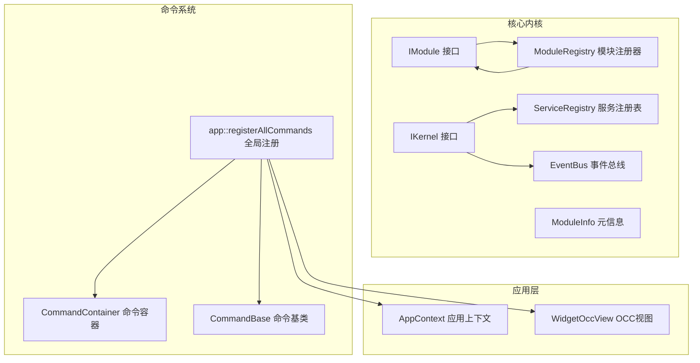
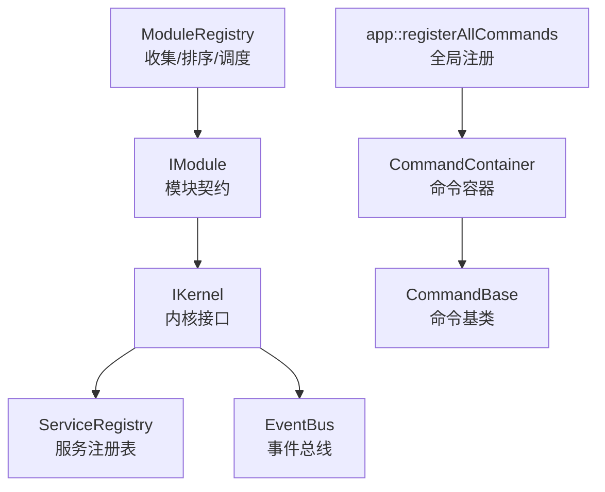
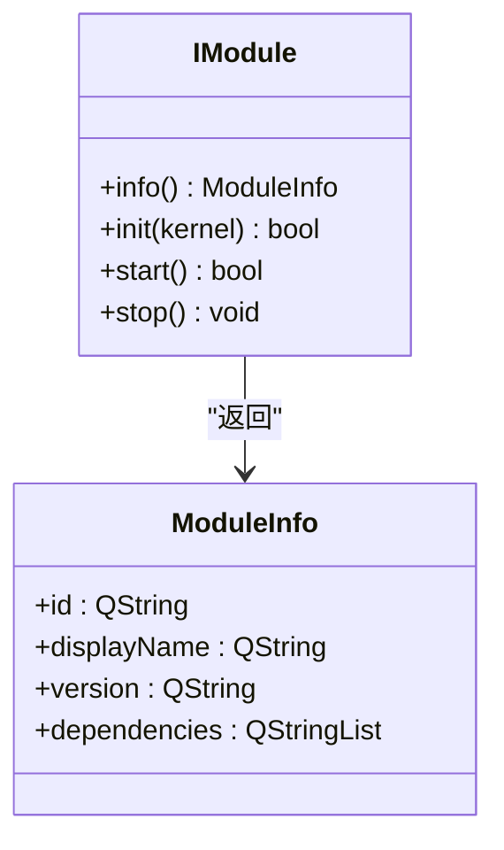
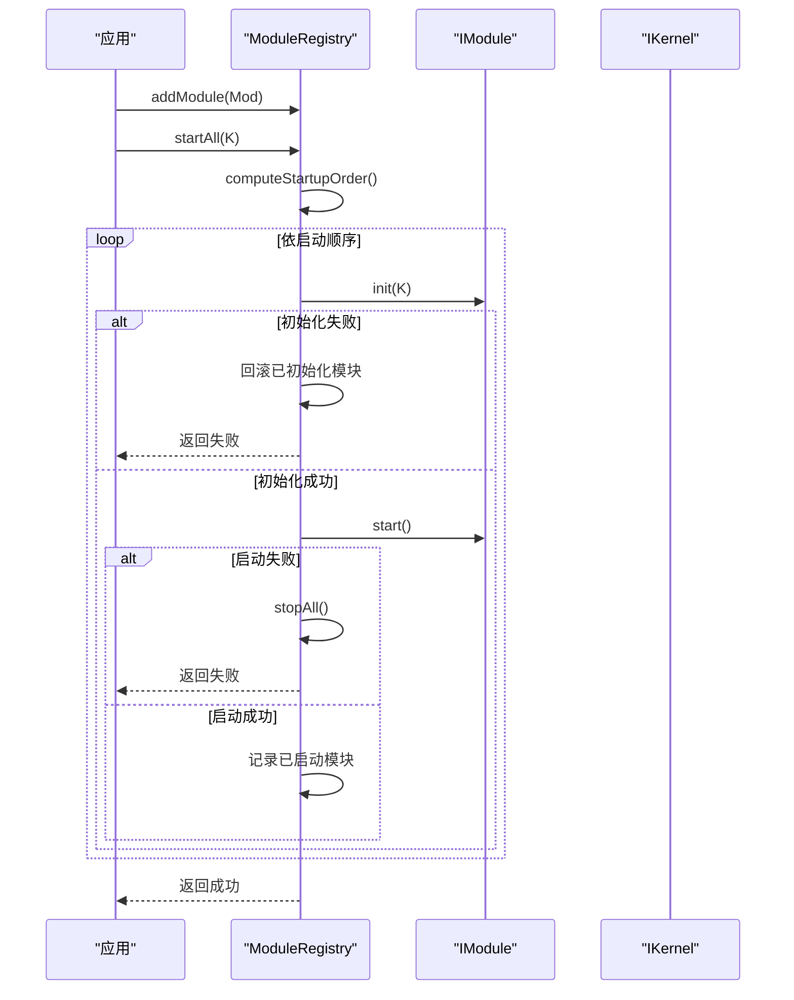
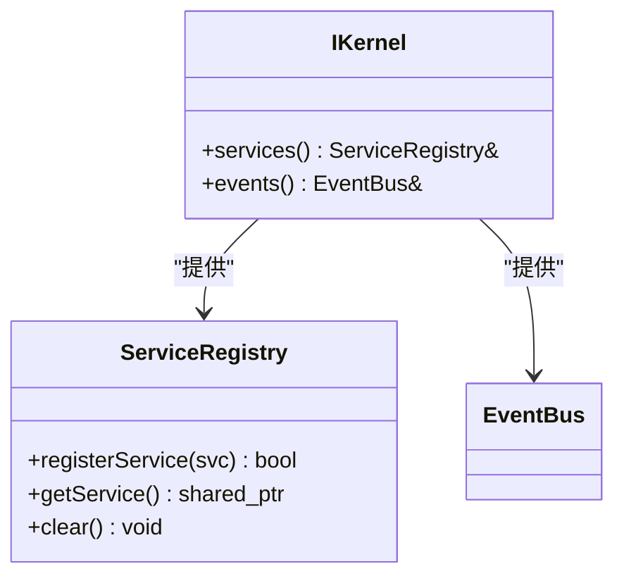
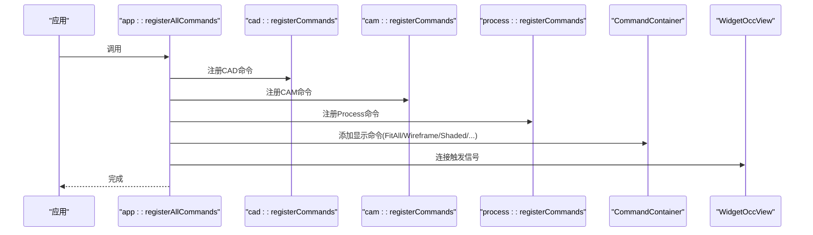
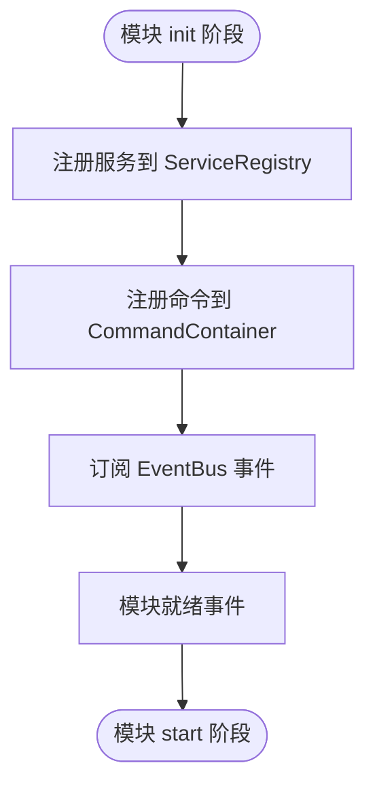
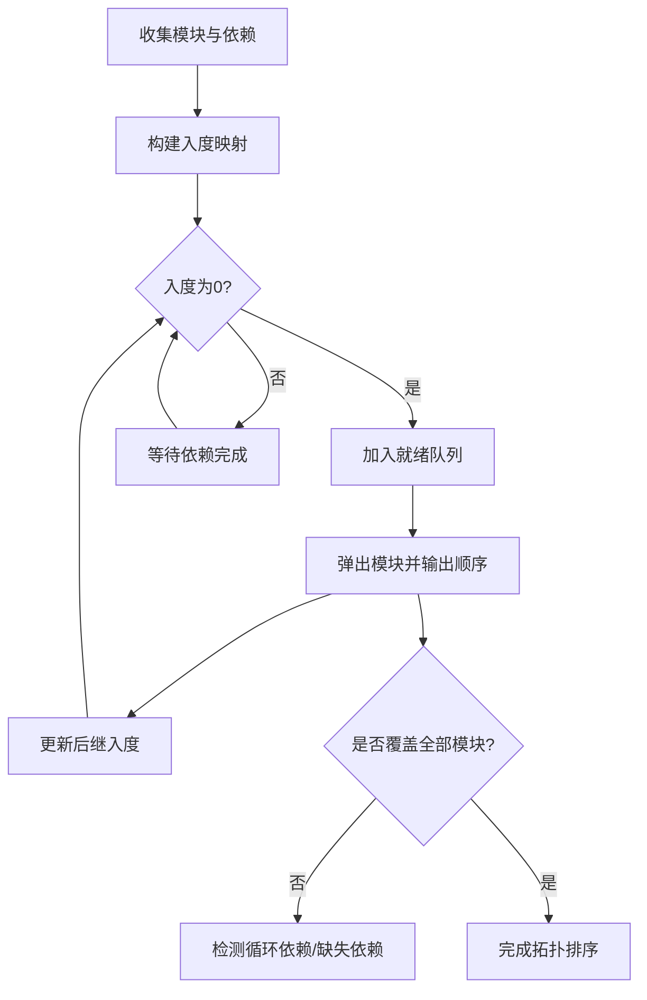

# 模块接口

<cite>
**本文档引用的文件**
- [i_module.h](file://src/core/kernel/i_module.h)
- [module_registry.h](file://src/core/kernel/module_registry.h)
- [module_registry.cpp](file://src/core/kernel/module_registry.cpp)
- [i_kernel.h](file://src/core/kernel/i_kernel.h)
- [service_registry.h](file://src/core/kernel/service_registry.h)
- [event_bus.h](file://src/core/kernel/event_bus.h)
- [command_registry.h](file://src/app/command_registry.h)
- [command_registry.cpp](file://src/app/command_registry.cpp)
- [commands_api.h](file://src/core/command/commands_api.h)
- [commands_api.cpp](file://src/core/command/commands_api.cpp)
</cite>

## 目录
1. [简介](#简介)
2. [项目结构](#项目结构)
3. [核心组件](#核心组件)
4. [架构总览](#架构总览)
5. [详细组件分析](#详细组件分析)
6. [依赖关系分析](#依赖关系分析)
7. [性能考虑](#性能考虑)
8. [故障排查指南](#故障排查指南)
9. [结论](#结论)
10. [附录](#附录)

## 简介
本文件为 LaserCNC 微内核模块化系统的 API 参考文档，聚焦以下关键接口与机制：
- IModule 模块契约：模块生命周期、元信息与职责边界
- ModuleRegistry 模块注册与启动调度：拓扑排序、启动/停止流程与错误回滚
- CommandRegistry 命令注册系统：命令容器、命令基类与全局注册流程
- 模块间通信：通过 IKernel 提供的服务注册表与事件总线
- 模块热插拔与动态加载：基于现有接口的扩展思路
- 版本管理与依赖声明：语义化版本与依赖图构建
- 自定义模块开发指南：接口规范、实现步骤与最佳实践

## 项目结构
围绕模块化系统的关键文件组织如下：
- 核心内核接口与注册表：i_module.h、module_registry.h/.cpp、i_kernel.h、service_registry.h、event_bus.h
- 命令系统：command_registry.h/.cpp、commands_api.h/.cpp
- 应用层命令注册入口：app 命名空间下的 registerAllCommands

**图表来源**
- [i_module.h:10-76](file://src/core/kernel/i_module.h#L10-L76)
- [module_registry.h:15-64](file://src/core/kernel/module_registry.h#L15-L64)
- [i_kernel.h:10-36](file://src/core/kernel/i_kernel.h#L10-L36)
- [service_registry.h:12-35](file://src/core/kernel/service_registry.h#L12-L35)
- [event_bus.h](file://src/core/kernel/event_bus.h)
- [command_registry.h:10-32](file://src/app/command_registry.h#L10-L32)
- [command_registry.cpp:55-79](file://src/app/command_registry.cpp#L55-L79)
- [commands_api.h:52-76](file://src/core/command/commands_api.h#L52-L76)
- [commands_api.cpp:4-46](file://src/core/command/commands_api.cpp#L4-L46)

**章节来源**
- [i_module.h:10-76](file://src/core/kernel/i_module.h#L10-L76)
- [module_registry.h:15-64](file://src/core/kernel/module_registry.h#L15-L64)
- [i_kernel.h:10-36](file://src/core/kernel/i_kernel.h#L10-L36)
- [service_registry.h:12-35](file://src/core/kernel/service_registry.h#L12-L35)
- [event_bus.h](file://src/core/kernel/event_bus.h)
- [command_registry.h:10-32](file://src/app/command_registry.h#L10-L32)
- [command_registry.cpp:55-79](file://src/app/command_registry.cpp#L55-L79)
- [commands_api.h:52-76](file://src/core/command/commands_api.h#L52-L76)
- [commands_api.cpp:4-46](file://src/core/command/commands_api.cpp#L4-L46)

## 核心组件
本节对模块化系统的关键接口进行深入解析，涵盖接口定义、职责边界、调用约定与错误处理策略。

- IModule 模块契约
  - 元信息 ModuleInfo：包含模块 id、显示名、版本与依赖列表
  - 生命周期方法：info()、init(kernel)、start()、stop()
  - 生命周期管理：由 ModuleRegistry 统一调度，失败即回滚
  - 实现要点：不持有 IKernel 指针，必要时保存弱引用或具体服务接口

- ModuleRegistry 模块注册与启动调度
  - 职责：收集模块、拓扑排序、顺序 init/start、反向 stop/释放
  - 错误处理：检测空 id、重复 id、缺失依赖、循环依赖、异常抛出
  - 启动流程：computeStartupOrder → init 阶段 → start 阶段
  - 停止流程：反序调用 stop 并清空状态

- IKernel 内核接口
  - 提供服务注册表与事件总线访问
  - 模块 init 阶段持有引用，后续通过弱引用或具体服务接口访问

- ServiceRegistry 服务注册表
  - 按类型索引注册与查找服务实例
  - 不抛异常，失败返回空指针并记录日志

- EventBus 事件总线
  - 类型化发布/订阅，模块可在 init 阶段订阅感兴趣事件

- CommandContainer 命令容器
  - 以名称索引命令实例，支持查找与批量状态刷新
  - 与 QAction 绑定，触发时执行命令

- CommandBase 命令基类
  - 将 QAction::triggered 与 execute() 绑定
  - 支持启用状态判断与执行

- app::registerAllCommands 全局命令注册
  - 调用各模块 registerCommands，注册显示类命令并连接 OCC 视图

**章节来源**
- [i_module.h:10-76](file://src/core/kernel/i_module.h#L10-L76)
- [module_registry.h:15-64](file://src/core/kernel/module_registry.h#L15-L64)
- [module_registry.cpp:33-188](file://src/core/kernel/module_registry.cpp#L33-L188)
- [i_kernel.h:10-36](file://src/core/kernel/i_kernel.h#L10-L36)
- [service_registry.h:12-35](file://src/core/kernel/service_registry.h#L12-L35)
- [event_bus.h](file://src/core/kernel/event_bus.h)
- [commands_api.h:52-76](file://src/core/command/commands_api.h#L52-L76)
- [commands_api.cpp:4-46](file://src/core/command/commands_api.cpp#L4-L46)
- [command_registry.h:10-32](file://src/app/command_registry.h#L10-L32)
- [command_registry.cpp:55-79](file://src/app/command_registry.cpp#L55-L79)

## 架构总览
下图展示了模块化系统的核心交互：模块通过 IModule 契约接入，由 ModuleRegistry 统一调度；模块在 init 阶段通过 IKernel 获取服务注册表与事件总线；命令系统通过 CommandContainer 集中管理命令并与 UI 组件绑定。

**图表来源**
- [module_registry.h:15-64](file://src/core/kernel/module_registry.h#L15-L64)
- [i_module.h:28-76](file://src/core/kernel/i_module.h#L28-L76)
- [i_kernel.h:10-36](file://src/core/kernel/i_kernel.h#L10-L36)
- [service_registry.h:12-35](file://src/core/kernel/service_registry.h#L12-L35)
- [event_bus.h](file://src/core/kernel/event_bus.h)
- [command_registry.h:10-32](file://src/app/command_registry.h#L10-L32)
- [commands_api.h:52-76](file://src/core/command/commands_api.h#L52-L76)

## 详细组件分析

### IModule 接口与生命周期
- 接口职责
  - info()：返回模块元信息（id、displayName、version、dependencies）
  - init(kernel)：注册服务、命令与事件订阅；不应主动操作其他模块服务
  - start()：依赖已初始化后，可发布“模块就绪”事件或加载默认数据
  - stop()：取消订阅、注销服务、释放资源
- 生命周期管理
  - 由 ModuleRegistry 统一管理，失败即回滚
  - 建议在 init 中保存弱引用或具体服务接口，避免持有 IKernel 指针

**图表来源**
- [i_module.h:20-76](file://src/core/kernel/i_module.h#L20-L76)

**章节来源**
- [i_module.h:28-76](file://src/core/kernel/i_module.h#L28-L76)

### ModuleRegistry 模块注册与启动调度
- 主要职责
  - addModule：收集模块实例（所有权由注册表持有）
  - startAll：拓扑排序后顺序执行 init/start
  - stopAll：反序调用 stop 并清理状态
  - find：按 id 查找模块
- 启动流程与错误回滚
  - computeStartupOrder：构建依赖图，检测空 id、重复 id、缺失依赖与循环依赖
  - init 阶段：捕获异常并回滚已初始化模块
  - start 阶段：失败则停止已启动模块
- 数据结构
  - m_modules：模块所有权容器
  - m_startupOrder：拓扑排序结果
  - m_started：已成功启动模块，用于反向停止

**图表来源**
- [module_registry.cpp:110-188](file://src/core/kernel/module_registry.cpp#L110-L188)

**章节来源**
- [module_registry.h:15-64](file://src/core/kernel/module_registry.h#L15-L64)
- [module_registry.cpp:33-188](file://src/core/kernel/module_registry.cpp#L33-L188)

### IKernel 与服务注册表
- IKernel
  - 提供 services() 与 events() 访问点
  - 模块 init 阶段持有引用，后续通过弱引用或具体服务接口访问
- ServiceRegistry
  - 模板化注册与查找，同一接口类型重复注册会覆盖并记录警告
  - 清空由 Kernel 在关闭时调用
- EventBus
  - 类型化发布/订阅，模块可在 init 阶段订阅感兴趣事件

**图表来源**
- [i_kernel.h:10-36](file://src/core/kernel/i_kernel.h#L10-L36)
- [service_registry.h:12-35](file://src/core/kernel/service_registry.h#L12-L35)
- [event_bus.h](file://src/core/kernel/event_bus.h)

**章节来源**
- [i_kernel.h:10-36](file://src/core/kernel/i_kernel.h#L10-L36)
- [service_registry.h:12-35](file://src/core/kernel/service_registry.h#L12-L35)
- [event_bus.h](file://src/core/kernel/event_bus.h)

### 命令系统：CommandContainer 与 CommandBase
- CommandContainer
  - 以名称索引命令实例，支持添加、查找与批量状态刷新
  - 与 AppContext 关联，作为命令执行上下文
- CommandBase
  - 将 QAction::triggered 与 execute() 绑定
  - 支持启用状态判断与执行
- app::registerAllCommands
  - 调用各模块 registerCommands
  - 注册显示类命令（FitAll、Wireframe、Shaded 等）并连接 OCC 视图
  - 使用 QActionGroup 维护显示模式互斥状态

**图表来源**
- [command_registry.cpp:55-79](file://src/app/command_registry.cpp#L55-L79)
- [commands_api.h:52-76](file://src/core/command/commands_api.h#L52-L76)
- [commands_api.cpp:4-46](file://src/core/command/commands_api.cpp#L4-L46)

**章节来源**
- [command_registry.h:10-32](file://src/app/command_registry.h#L10-L32)
- [command_registry.cpp:16-79](file://src/app/command_registry.cpp#L16-L79)
- [commands_api.h:52-76](file://src/core/command/commands_api.h#L52-L76)
- [commands_api.cpp:4-46](file://src/core/command/commands_api.cpp#L4-L46)

### 模块间通信与扩展点
- 服务注入：模块通过 IKernel.services() 注册与获取服务，实现松耦合通信
- 事件驱动：模块通过 IKernel.events() 发布/订阅事件，实现跨模块解耦
- 依赖声明：ModuleInfo.dependencies 用于构建依赖图，确保启动顺序正确
- 扩展点：模块可在 init 阶段注册服务、命令与事件订阅；在 start 阶段发布“模块就绪”事件

**图表来源**
- [i_kernel.h:10-36](file://src/core/kernel/i_kernel.h#L10-L36)
- [service_registry.h:12-35](file://src/core/kernel/service_registry.h#L12-L35)
- [event_bus.h](file://src/core/kernel/event_bus.h)
- [i_module.h:28-76](file://src/core/kernel/i_module.h#L28-L76)

**章节来源**
- [i_kernel.h:10-36](file://src/core/kernel/i_kernel.h#L10-L36)
- [service_registry.h:12-35](file://src/core/kernel/service_registry.h#L12-L35)
- [event_bus.h](file://src/core/kernel/event_bus.h)
- [i_module.h:28-76](file://src/core/kernel/i_module.h#L28-L76)

## 依赖关系分析
- 模块依赖图构建
  - 依据 ModuleInfo.dependencies 构建邻接表与入度映射
  - 使用 Kahn 拓扑算法生成稳定启动顺序
  - 检测空 id、重复 id、缺失依赖与循环依赖
- 启动顺序与回滚
  - init 阶段失败：反向 stop 已初始化模块
  - start 阶段失败：停止已启动模块并保留 init 状态
- 服务与事件依赖
  - 模块通过 IKernel 访问服务与事件，避免直接耦合

**图表来源**
- [module_registry.cpp:33-108](file://src/core/kernel/module_registry.cpp#L33-L108)

**章节来源**
- [module_registry.cpp:33-108](file://src/core/kernel/module_registry.cpp#L33-L108)

## 性能考虑
- 拓扑排序复杂度
  - 时间复杂度：O(V+E)，其中 V 为模块数，E 为依赖边数
  - 空间复杂度：O(V+E)，用于存储依赖图与队列
- 启动阶段开销
  - 每个模块的 init/start 均为 O(1) 调用，总体 O(V)
- 命令容器查找
  - CommandContainer 使用 QMap 以名称索引，查找为 O(log N)
- 建议
  - 控制模块数量与依赖深度，避免过长启动链
  - 将重任务延迟到 start 阶段或异步执行

[本节为通用性能讨论，无需特定文件来源]

## 故障排查指南
- 启动失败排查
  - 检查模块 id 是否为空或重复
  - 核对依赖声明是否存在拼写错误或缺失
  - 查看日志中关于“init 抛出异常”“start 抛出异常”的回滚信息
- 依赖问题
  - 循环依赖：拓扑排序无法覆盖全部模块
  - 缺失依赖：依赖模块未注册或 id 不匹配
- 服务与事件
  - 服务未找到：确认模块是否在 init 阶段正确注册
  - 事件未触发：确认订阅与发布类型一致且生命周期正确

**章节来源**
- [module_registry.cpp:110-188](file://src/core/kernel/module_registry.cpp#L110-L188)
- [module_registry.cpp:33-108](file://src/core/kernel/module_registry.cpp#L33-L108)

## 结论
LaserCNC 的模块化系统通过清晰的接口契约与严格的启动调度，实现了模块的可组合、可扩展与可维护。IModule 提供了稳定的生命周期模型；ModuleRegistry 保障了依赖与启动顺序；IKernel 为模块提供了服务与事件的统一访问点；CommandContainer 与 CommandBase 则将 UI 与命令逻辑解耦。结合本文档的接口规范与实现指南，开发者可以快速构建符合系统要求的模块，并在需要时扩展热插拔与动态加载能力。

[本节为总结性内容，无需特定文件来源]

## 附录

### 自定义模块开发接口规范与实现指南
- 模块接口实现
  - 实现 IModule：提供 info() 返回 ModuleInfo；在 init(kernel) 中注册服务、命令与事件；在 start() 发布“模块就绪”事件；在 stop() 清理资源
  - 使用 IKernel.services() 与 IKernel.events() 访问内核能力
- 依赖声明
  - 在 ModuleInfo.dependencies 中声明依赖模块 id，确保启动顺序正确
- 命令集成
  - 在模块内实现 registerCommands，将命令注册到 CommandContainer
  - 命令与 QAction 绑定，利用 CommandBase 的执行机制
- 生命周期与错误处理
  - init/start 返回 false 或抛出异常将导致整体启动回滚
  - 建议在 init 中保存弱引用或具体服务接口，避免持有 IKernel 指针

**章节来源**
- [i_module.h:28-76](file://src/core/kernel/i_module.h#L28-L76)
- [i_kernel.h:10-36](file://src/core/kernel/i_kernel.h#L10-L36)
- [command_registry.h:10-32](file://src/app/command_registry.h#L10-L32)
- [commands_api.h:52-76](file://src/core/command/commands_api.h#L52-L76)

### 模块热插拔与动态加载技术细节
- 现状与建议
  - 当前接口未提供 removeModule/dynamicLoad 等动态卸载能力
  - 可通过扩展 ModuleRegistry 增加模块移除与重新加载逻辑
  - 动态加载需结合平台库加载机制与符号导出约定
- 实现要点
  - 保持模块生命周期一致性：stop → 卸载 → 重新 addModule → startAll
  - 服务与事件的幂等处理：避免重复注册与悬挂订阅
  - 版本兼容性：通过 ModuleInfo.version 与依赖声明控制升级路径

[本节为概念性扩展说明，无需特定文件来源]

### 版本管理与语义化版本
- 版本字段
  - ModuleInfo.version 采用语义化版本号（如 "1.0.0"），用于模块标识与兼容性检查
- 依赖与升级
  - 通过 ModuleInfo.dependencies 与版本号共同决定依赖关系与升级策略
  - 建议在升级时保持向后兼容或明确破坏性变更

**章节来源**
- [i_module.h:10-26](file://src/core/kernel/i_module.h#L10-L26)