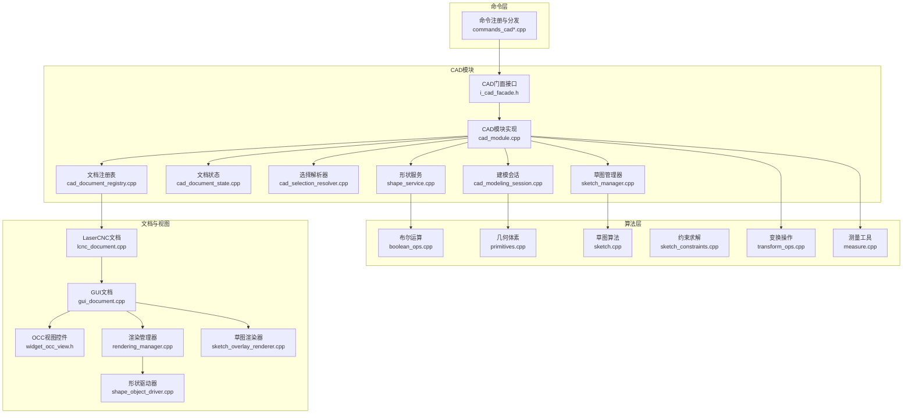
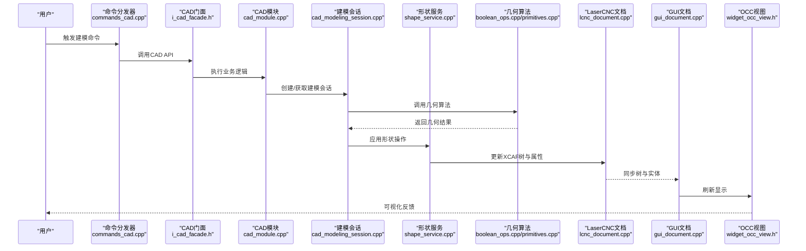
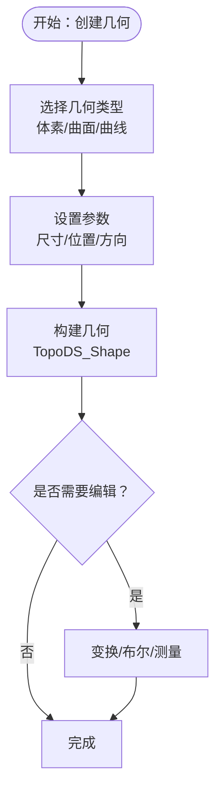
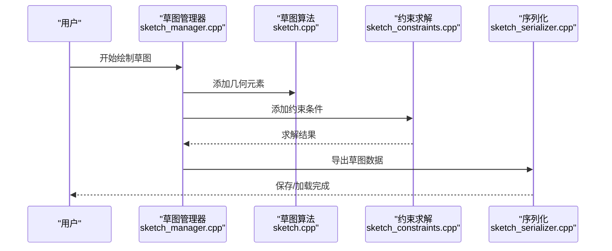
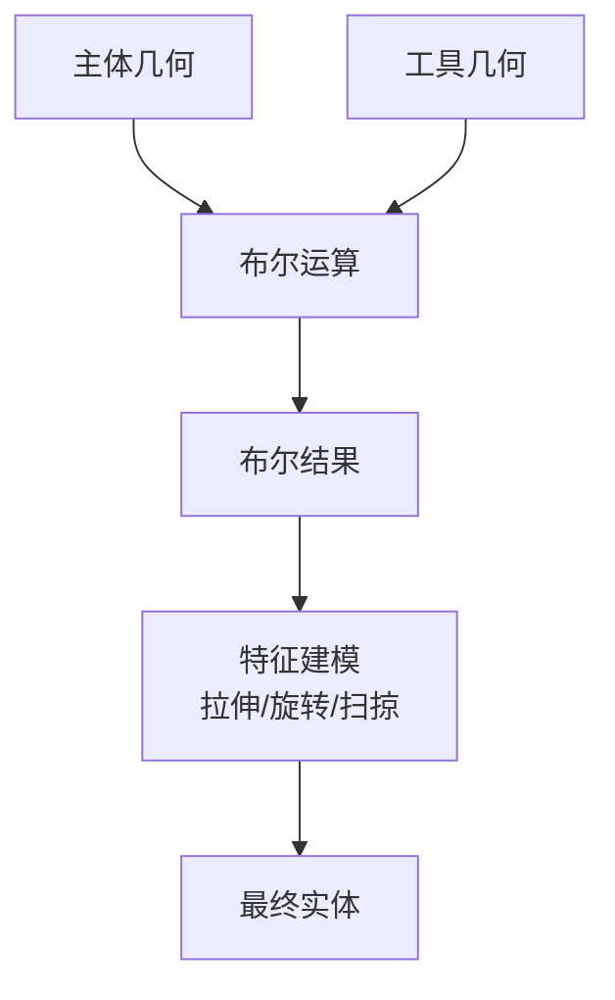
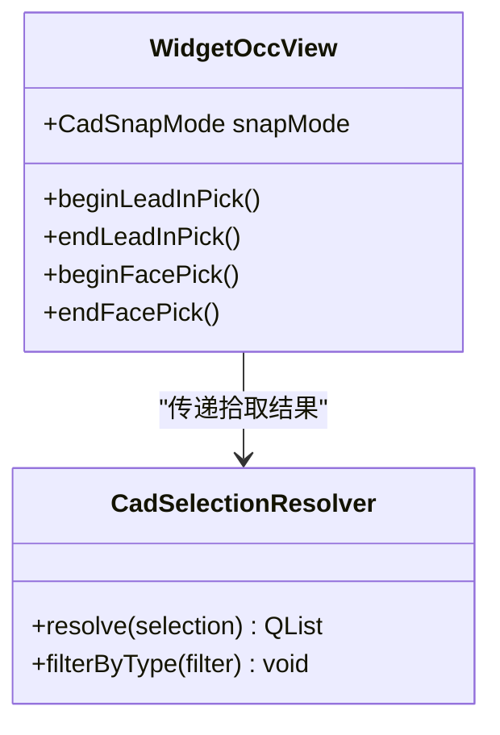
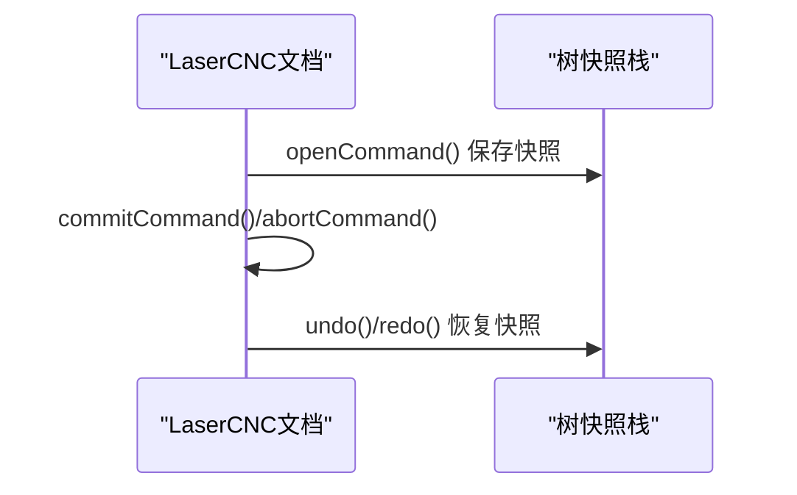
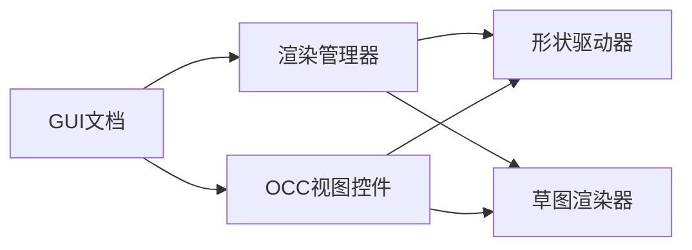
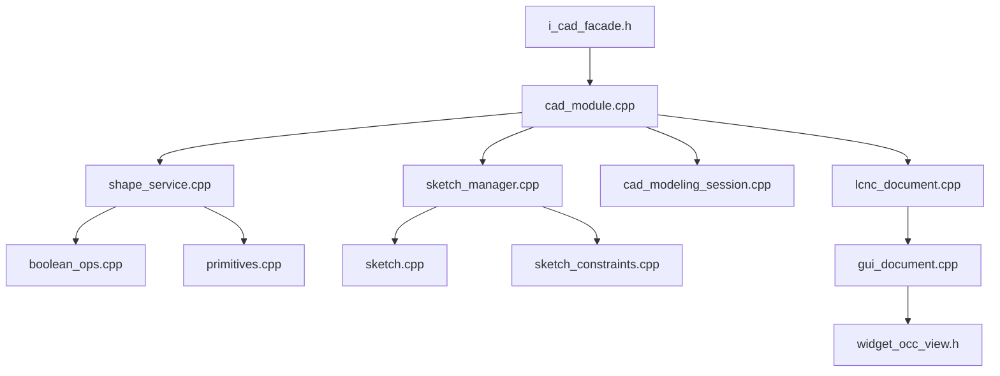

# CAD模块

<cite>
**本文引用的文件**
- [cad_module.cpp](file://src/modules/cad/cad_module.cpp)
- [i_cad_facade.h](file://src/modules/cad/i_cad_facade.h)
- [cad_document_registry.cpp](file://src/modules/cad/document/cad_document_registry.cpp)
- [cad_document_state.cpp](file://src/modules/cad/document/cad_document_state.cpp)
- [cad_selection_resolver.cpp](file://src/modules/cad/selection/cad_selection_resolver.cpp)
- [sketch_manager.cpp](file://src/modules/cad/services/sketch_manager.cpp)
- [shape_service.cpp](file://src/modules/cad/services/shape_service.cpp)
- [cad_modeling_session.cpp](file://src/modules/cad/services/cad_modeling_session.cpp)
- [sketch_serializer.cpp](file://src/modules/cad/sketch/sketch_serializer.cpp)
- [commands_cad.cpp](file://src/modules/cad/commands/commands_cad.cpp)
- [commands_cad_primitives.cpp](file://src/modules/cad/commands/commands_cad_primitives.cpp)
- [commands_cad_sketch.cpp](file://src/modules/cad/commands/commands_cad_sketch.cpp)
- [commands_cad_boolean.cpp](file://src/modules/cad/commands/commands_cad_boolean.cpp)
- [commands_cad_transform.cpp](file://src/modules/cad/commands/commands_cad_transform.cpp)
- [commands_cad_delete.cpp](file://src/modules/cad/commands/commands_cad_delete.cpp)
- [commands_cad_measure.cpp](file://src/modules/cad/commands/commands_cad_measure.cpp)
- [commands_cad_view.cpp](file://src/modules/cad/commands/commands_cad_view.cpp)
- [commands_edit.cpp](file://src/modules/cad/commands/commands_edit.cpp)
- [boolean_ops.cpp](file://src/core/algorithms/cad/boolean_ops.cpp)
- [primitives.cpp](file://src/core/algorithms/cad/primitives.cpp)
- [sketch.cpp](file://src/core/algorithms/cad/sketch.cpp)
- [sketch_constraints.cpp](file://src/core/algorithms/cad/sketch_constraints.cpp)
- [transform_ops.cpp](file://src/core/algorithms/cad/transform_ops.cpp)
- [measure.cpp](file://src/core/algorithms/cad/measure.cpp)
- [lcnc_document.cpp](file://src/core/document/lcnc_document.cpp)
- [widget_occ_view.h](file://src/view/widget_occ_view.h)
- [gui_document.cpp](file://src/view/gui_document.cpp)
- [rendering_manager.cpp](file://src/view/rendering_manager.cpp)
- [shape_object_driver.cpp](file://src/view/shape_object_driver.cpp)
- [sketch_overlay_renderer.cpp](file://src/view/sketch_overlay_renderer.cpp)
</cite>

## 目录
1. [简介](#简介)
2. [项目结构](#项目结构)
3. [核心组件](#核心组件)
4. [架构总览](#架构总览)
5. [详细组件分析](#详细组件分析)
6. [依赖关系分析](#依赖关系分析)
7. [性能考虑](#性能考虑)
8. [故障排查指南](#故障排查指南)
9. [结论](#结论)
10. [附录](#附录)

## 简介
本技术文档面向LaserCNC的CAD模块，系统阐述基于OpenCASCADE的几何建模体系。文档覆盖几何体创建（实体与曲面）、草图绘制与约束求解、布尔运算、变换与测量、选择机制、文档模型与渲染管线，并给出API使用路径与最佳实践。读者可据此理解从命令到几何内核的完整调用链路，以及如何扩展新的建模工具与编辑功能。

## 项目结构
CAD模块采用“微内核+模块化”组织方式：核心服务位于src/modules/cad下，几何算法位于src/core/algorithms/cad，视图层位于src/view。模块通过任务分发器接收命令请求，经由建模会话与形状服务执行具体操作，最终更新GUI文档与渲染。

图表来源
- [cad_module.cpp:1-1159](file://src/modules/cad/cad_module.cpp#L1-L1159)
- [i_cad_facade.h:1-200](file://src/modules/cad/i_cad_facade.h#L1-L200)
- [cad_document_registry.cpp:1-200](file://src/modules/cad/document/cad_document_registry.cpp#L1-L200)
- [cad_document_state.cpp:1-200](file://src/modules/cad/document/cad_document_state.cpp#L1-L200)
- [cad_selection_resolver.cpp:1-200](file://src/modules/cad/selection/cad_selection_resolver.cpp#L1-L200)
- [sketch_manager.cpp:1-200](file://src/modules/cad/services/sketch_manager.cpp#L1-L200)
- [shape_service.cpp:1-200](file://src/modules/cad/services/shape_service.cpp#L1-L200)
- [cad_modeling_session.cpp:1-200](file://src/modules/cad/services/cad_modeling_session.cpp#L1-L200)
- [boolean_ops.cpp:1-200](file://src/core/algorithms/cad/boolean_ops.cpp#L1-L200)
- [primitives.cpp:1-200](file://src/core/algorithms/cad/primitives.cpp#L1-L200)
- [sketch.cpp:1-200](file://src/core/algorithms/cad/sketch.cpp#L1-L200)
- [sketch_constraints.cpp:1-200](file://src/core/algorithms/cad/sketch_constraints.cpp#L1-L200)
- [transform_ops.cpp:1-200](file://src/core/algorithms/cad/transform_ops.cpp#L1-L200)
- [measure.cpp:1-200](file://src/core/algorithms/cad/measure.cpp#L1-L200)
- [lcnc_document.cpp:1-200](file://src/core/document/lcnc_document.cpp#L1-L200)
- [widget_occ_view.h:1-120](file://src/view/widget_occ_view.h#L1-L120)
- [gui_document.cpp:1-200](file://src/view/gui_document.cpp#L1-L200)
- [rendering_manager.cpp:1-200](file://src/view/rendering_manager.cpp#L1-L200)
- [shape_object_driver.cpp:1-200](file://src/view/shape_object_driver.cpp#L1-L200)
- [sketch_overlay_renderer.cpp:1-200](file://src/view/sketch_overlay_renderer.cpp#L1-L200)

章节来源
- [cad_module.cpp:1-1159](file://src/modules/cad/cad_module.cpp#L1-L1159)
- [i_cad_facade.h:1-200](file://src/modules/cad/i_cad_facade.h#L1-L200)

## 核心组件
- CAD门面接口：统一对外暴露CAD能力，封装底层OpenCASCADE细节，提供稳定的API入口。
- 文档与会话：通过LaserCNC文档与GUI文档协调XCAF树与可视化对象，支持撤销/重做与树快照。
- 形状服务：封装对TopoDS_Shape的操作，包括创建、删除、爆炸、布尔与变换。
- 草图管理：提供草图绘制、约束求解与序列化，支撑二维草图到三维特征的生成。
- 建模会话：协调命令执行、参数收集与几何生成，保证操作的一致性与可恢复性。
- 视图与渲染：OCC视图控件、渲染管理器与形状/草图驱动器共同完成几何的显示与交互。

章节来源
- [i_cad_facade.h:1-200](file://src/modules/cad/i_cad_facade.h#L1-L200)
- [lcnc_document.cpp:1-200](file://src/core/document/lcnc_document.cpp#L1-L200)
- [gui_document.cpp:1-200](file://src/view/gui_document.cpp#L1-L200)
- [shape_service.cpp:1-200](file://src/modules/cad/services/shape_service.cpp#L1-L200)
- [sketch_manager.cpp:1-200](file://src/modules/cad/services/sketch_manager.cpp#L1-L200)
- [cad_modeling_session.cpp:1-200](file://src/modules/cad/services/cad_modeling_session.cpp#L1-L200)
- [rendering_manager.cpp:1-200](file://src/view/rendering_manager.cpp#L1-L200)

## 架构总览
CAD模块以“命令-会话-服务-算法-文档/视图”的分层架构运行。命令层负责用户输入与工具激活；会话层协调参数与上下文；服务层对接OpenCASCADE几何内核；算法层提供几何计算；文档与视图层负责持久化与可视化。

图表来源
- [commands_cad.cpp:1-200](file://src/modules/cad/commands/commands_cad.cpp#L1-L200)
- [i_cad_facade.h:1-200](file://src/modules/cad/i_cad_facade.h#L1-L200)
- [cad_module.cpp:1-1159](file://src/modules/cad/cad_module.cpp#L1-L1159)
- [cad_modeling_session.cpp:1-200](file://src/modules/cad/services/cad_modeling_session.cpp#L1-L200)
- [shape_service.cpp:1-200](file://src/modules/cad/services/shape_service.cpp#L1-L200)
- [boolean_ops.cpp:1-200](file://src/core/algorithms/cad/boolean_ops.cpp#L1-L200)
- [primitives.cpp:1-200](file://src/core/algorithms/cad/primitives.cpp#L1-L200)
- [lcnc_document.cpp:1-200](file://src/core/document/lcnc_document.cpp#L1-L200)
- [gui_document.cpp:1-200](file://src/view/gui_document.cpp#L1-L200)
- [widget_occ_view.h:1-120](file://src/view/widget_occ_view.h#L1-L120)

## 详细组件分析

### 几何体创建与编辑（实体与曲面）
- 体素与基础几何：提供圆柱、圆锥、长方体、球等基本体素的构造，作为建模起点。
- 形状操作：支持创建、删除、爆炸（分解复合体）等基础编辑。
- 变换操作：平移、旋转、缩放、镜像等刚体变换，支持阵列与自定义矩阵。
- 测量工具：距离、角度、面积、体积等几何度量，用于尺寸标注与校验。

图表来源
- [primitives.cpp:1-200](file://src/core/algorithms/cad/primitives.cpp#L1-L200)
- [transform_ops.cpp:1-200](file://src/core/algorithms/cad/transform_ops.cpp#L1-L200)
- [measure.cpp:1-200](file://src/core/algorithms/cad/measure.cpp#L1-L200)
- [shape_service.cpp:1-200](file://src/modules/cad/services/shape_service.cpp#L1-L200)

章节来源
- [primitives.cpp:1-200](file://src/core/algorithms/cad/primitives.cpp#L1-L200)
- [transform_ops.cpp:1-200](file://src/core/algorithms/cad/transform_ops.cpp#L1-L200)
- [measure.cpp:1-200](file://src/core/algorithms/cad/measure.cpp#L1-L200)
- [shape_service.cpp:1-200](file://src/modules/cad/services/shape_service.cpp#L1-L200)

### 草图绘制与约束系统
- 草图绘制：在工作平面或选定面上创建二维曲线（直线、圆弧、样条等），支持端点、中点、垂线、平行等几何关系。
- 约束求解：自动标注尺寸与几何约束，求解未知参数，确保草图完全约束且可解。
- 草图序列化：保存草图数据结构以便后续重建与版本控制。

图表来源
- [sketch_manager.cpp:1-200](file://src/modules/cad/services/sketch_manager.cpp#L1-L200)
- [sketch.cpp:1-200](file://src/core/algorithms/cad/sketch.cpp#L1-L200)
- [sketch_constraints.cpp:1-200](file://src/core/algorithms/cad/sketch_constraints.cpp#L1-L200)
- [sketch_serializer.cpp:1-200](file://src/modules/cad/sketch/sketch_serializer.cpp#L1-L200)

章节来源
- [sketch_manager.cpp:1-200](file://src/modules/cad/services/sketch_manager.cpp#L1-L200)
- [sketch.cpp:1-200](file://src/core/algorithms/cad/sketch.cpp#L1-L200)
- [sketch_constraints.cpp:1-200](file://src/core/algorithms/cad/sketch_constraints.cpp#L1-L200)
- [sketch_serializer.cpp:1-200](file://src/modules/cad/sketch/sketch_serializer.cpp#L1-L200)

### 布尔运算与特征建模
- 支持并集、交集、差集等布尔运算，处理复杂拓扑组合。
- 特征建模：拉伸、旋转、扫掠、倒角、抽壳等特征生成，连接草图与实体。

图表来源
- [boolean_ops.cpp:1-200](file://src/core/algorithms/cad/boolean_ops.cpp#L1-L200)
- [features.cpp:1-200](file://src/core/algorithms/cad/features.cpp#L1-L200)

章节来源
- [boolean_ops.cpp:1-200](file://src/core/algorithms/cad/boolean_ops.cpp#L1-L200)
- [features.cpp:1-200](file://src/core/algorithms/cad/features.cpp#L1-L200)

### 选择机制与拾取
- 拾取模式：顶点、边、面三种精度级别，支持预览与容差控制。
- 选择解析：将OCC选择结果映射为文档中的标签与实体，支持多选与过滤。

图表来源
- [widget_occ_view.h:1-120](file://src/view/widget_occ_view.h#L1-L120)
- [cad_selection_resolver.cpp:1-200](file://src/modules/cad/selection/cad_selection_resolver.cpp#L1-L200)

章节来源
- [widget_occ_view.h:1-120](file://src/view/widget_occ_view.h#L1-L120)
- [cad_selection_resolver.cpp:1-200](file://src/modules/cad/selection/cad_selection_resolver.cpp#L1-L200)

### 文档模型与撤销/重做
- XCAF树：以标签层次组织几何与属性，支持元数据与历史记录。
- 树快照：在命令开始时保存树状态，实现内存树的撤销/重做恢复。
- 实体擦除与提交：命令块内批量操作，成功后提交，失败回滚。

图表来源
- [lcnc_document.cpp:1-200](file://src/core/document/lcnc_document.cpp#L1-L200)

章节来源
- [lcnc_document.cpp:1-200](file://src/core/document/lcnc_document.cpp#L1-L200)

### 渲染与可视化
- OCC视图控件：提供导航、显示模式切换、拾取模式切换。
- 渲染管理器：协调形状与草图的绘制，支持线框/实体着色。
- 形状驱动器与草图渲染器：将XCAF实体映射为AIS对象，实现高亮、选择反馈与草图覆盖层。

图表来源
- [gui_document.cpp:1-200](file://src/view/gui_document.cpp#L1-L200)
- [widget_occ_view.h:1-120](file://src/view/widget_occ_view.h#L1-L120)
- [rendering_manager.cpp:1-200](file://src/view/rendering_manager.cpp#L1-L200)
- [shape_object_driver.cpp:1-200](file://src/view/shape_object_driver.cpp#L1-L200)
- [sketch_overlay_renderer.cpp:1-200](file://src/view/sketch_overlay_renderer.cpp#L1-L200)

章节来源
- [gui_document.cpp:1-200](file://src/view/gui_document.cpp#L1-L200)
- [widget_occ_view.h:1-120](file://src/view/widget_occ_view.h#L1-L120)
- [rendering_manager.cpp:1-200](file://src/view/rendering_manager.cpp#L1-L200)
- [shape_object_driver.cpp:1-200](file://src/view/shape_object_driver.cpp#L1-L200)
- [sketch_overlay_renderer.cpp:1-200](file://src/view/sketch_overlay_renderer.cpp#L1-L200)

## 依赖关系分析
- 组件耦合：CAD模块通过门面接口与命令层解耦；服务层与算法层通过明确的输入输出接口耦合。
- 外部依赖：OpenCASCADE（BRep、XCAF、AIS、V3d）为核心几何与可视化库。
- 潜在环依赖：文档与视图通过回调与事件总线交互，需避免双向强引用。

图表来源
- [i_cad_facade.h:1-200](file://src/modules/cad/i_cad_facade.h#L1-L200)
- [cad_module.cpp:1-1159](file://src/modules/cad/cad_module.cpp#L1-L1159)
- [shape_service.cpp:1-200](file://src/modules/cad/services/shape_service.cpp#L1-L200)
- [sketch_manager.cpp:1-200](file://src/modules/cad/services/sketch_manager.cpp#L1-L200)
- [cad_modeling_session.cpp:1-200](file://src/modules/cad/services/cad_modeling_session.cpp#L1-L200)
- [boolean_ops.cpp:1-200](file://src/core/algorithms/cad/boolean_ops.cpp#L1-L200)
- [primitives.cpp:1-200](file://src/core/algorithms/cad/primitives.cpp#L1-L200)
- [sketch.cpp:1-200](file://src/core/algorithms/cad/sketch.cpp#L1-L200)
- [sketch_constraints.cpp:1-200](file://src/core/algorithms/cad/sketch_constraints.cpp#L1-L200)
- [lcnc_document.cpp:1-200](file://src/core/document/lcnc_document.cpp#L1-L200)
- [gui_document.cpp:1-200](file://src/view/gui_document.cpp#L1-L200)
- [widget_occ_view.h:1-120](file://src/view/widget_occ_view.h#L1-L120)

章节来源
- [cad_module.cpp:1-1159](file://src/modules/cad/cad_module.cpp#L1-L1159)
- [i_cad_facade.h:1-200](file://src/modules/cad/i_cad_facade.h#L1-L200)

## 性能考虑
- 操作批量化：命令块内合并多次几何修改，减少XCAF树频繁变更带来的开销。
- 拾取与渲染：根据场景复杂度动态切换显示模式（线框/实体），降低渲染压力。
- 内存管理：及时释放临时几何对象，避免长时间持有大拓扑导致内存膨胀。
- 并行化：布尔运算与特征建模可并行化处理独立几何体，但需注意共享拓扑的同步。

## 故障排查指南
- 布尔运算失败：检查工具几何与主体几何的拓扑兼容性，确认无空几何或无效面。
- 草图不封闭：约束求解前确保所有曲线首尾相连，必要时启用自动闭合。
- 选择失效：确认拾取模式与当前视图方向匹配，适当调整容差。
- 渲染异常：切换显示模式或禁用某些覆盖层，定位问题实体后清理缓存。

章节来源
- [boolean_ops.cpp:1-200](file://src/core/algorithms/cad/boolean_ops.cpp#L1-L200)
- [sketch_constraints.cpp:1-200](file://src/core/algorithms/cad/sketch_constraints.cpp#L1-L200)
- [widget_occ_view.h:1-120](file://src/view/widget_occ_view.h#L1-L120)

## 结论
LaserCNC的CAD模块以OpenCASCADE为核心，结合模块化的服务与算法层，提供了从草图到实体的完整建模能力。通过清晰的命令-会话-服务-算法-文档/视图分层，系统具备良好的扩展性与可维护性。建议在新功能开发中遵循现有接口契约，优先使用服务层封装的几何操作，确保一致性与性能。

## 附录
- API使用路径参考（示例）
  - 创建体素：[primitives.cpp:1-200](file://src/core/algorithms/cad/primitives.cpp#L1-L200)
  - 删除形体：[shape_service.cpp:1-200](file://src/modules/cad/services/shape_service.cpp#L1-L200)
  - 布尔运算：[boolean_ops.cpp:1-200](file://src/core/algorithms/cad/boolean_ops.cpp#L1-L200)
  - 草图绘制与约束：[sketch_manager.cpp:1-200](file://src/modules/cad/services/sketch_manager.cpp#L1-L200)、[sketch_constraints.cpp:1-200](file://src/core/algorithms/cad/sketch_constraints.cpp#L1-L200)
  - 变换操作：[transform_ops.cpp:1-200](file://src/core/algorithms/cad/transform_ops.cpp#L1-L200)
  - 测量工具：[measure.cpp:1-200](file://src/core/algorithms/cad/measure.cpp#L1-L200)
  - 文档与撤销/重做：[lcnc_document.cpp:1-200](file://src/core/document/lcnc_document.cpp#L1-L200)
  - 视图与渲染：[widget_occ_view.h:1-120](file://src/view/widget_occ_view.h#L1-L120)、[rendering_manager.cpp:1-200](file://src/view/rendering_manager.cpp#L1-L200)