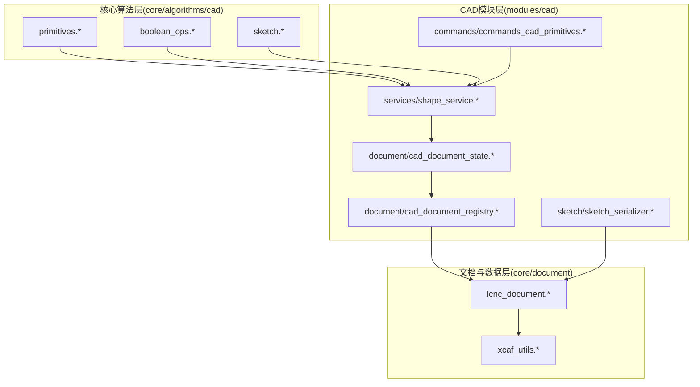
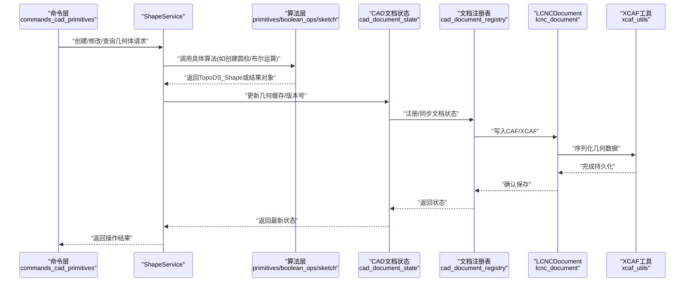
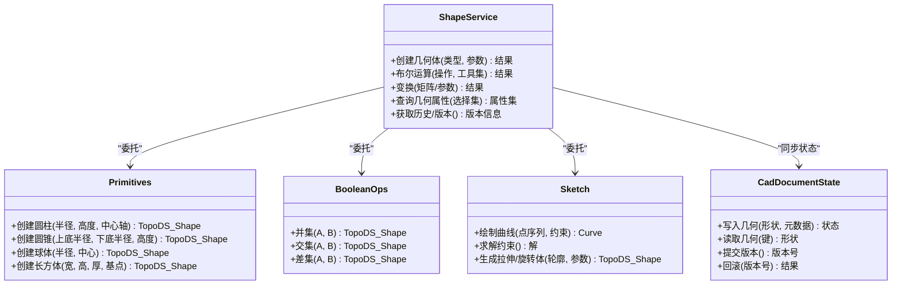
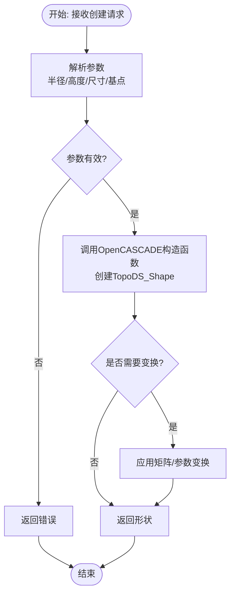
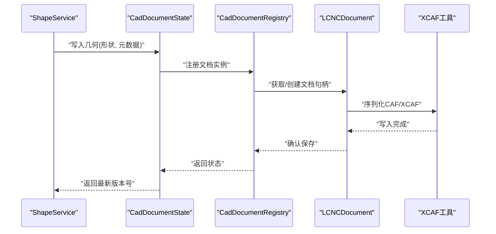
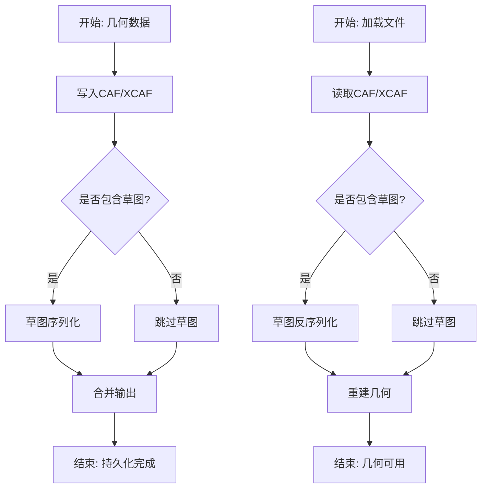
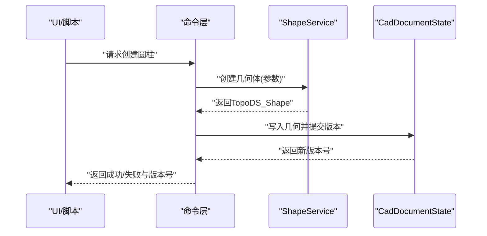
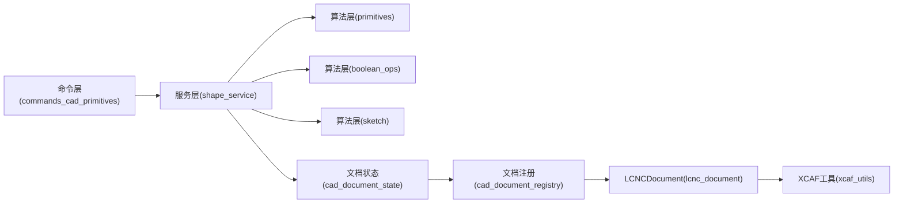

# 几何建模

<cite>
**本文引用的文件**
- [shape_service.h](file://src/modules/cad/services/shape_service.h)
- [shape_service.cpp](file://src/modules/cad/services/shape_service.cpp)
- [primitives.h](file://src/core/algorithms/cad/primitives.h)
- [primitives.cpp](file://src/core/algorithms/cad/primitives.cpp)
- [cad_document_state.h](file://src/modules/cad/document/cad_document_state.h)
- [cad_document_state.cpp](file://src/modules/cad/document/cad_document_state.cpp)
- [cad_document_registry.h](file://src/modules/cad/document/cad_document_registry.h)
- [cad_document_registry.cpp](file://src/modules/cad/document/cad_document_registry.cpp)
- [commands_cad_primitives.cpp](file://src/modules/cad/commands/commands_cad_primitives.cpp)
- [boolean_ops.h](file://src/core/algorithms/cad/boolean_ops.h)
- [boolean_ops.cpp](file://src/core/algorithms/cad/boolean_ops.cpp)
- [sketch.h](file://src/core/algorithms/cad/sketch.h)
- [sketch.cpp](file://src/core/algorithms/cad/sketch.cpp)
- [sketch_serializer.h](file://src/modules/cad/sketch/sketch_serializer.h)
- [sketch_serializer.cpp](file://src/modules/cad/sketch/sketch_serializer.cpp)
- [lcnc_document.h](file://src/core/document/lcnc_document.h)
- [lcnc_document.cpp](file://src/core/document/lcnc_document.cpp)
- [xcaf_utils.h](file://src/core/document/xcaf_utils.h)
- [xcaf_utils.cpp](file://src/core/document/xcaf_utils.cpp)
</cite>

## 目录
1. [引言](#引言)
2. [项目结构](#项目结构)
3. [核心组件](#核心组件)
4. [架构总览](#架构总览)
5. [详细组件分析](#详细组件分析)
6. [依赖关系分析](#依赖关系分析)
7. [性能考虑](#性能考虑)
8. [故障排查指南](#故障排查指南)
9. [结论](#结论)
10. [附录](#附录)

## 引言
本文件面向LaserCNC的几何建模能力，聚焦于基于OpenCASCADE的几何建模算法与服务架构。内容涵盖：基础几何体（圆柱、圆锥、球体、长方体等）的创建流程与参数配置；ShapeService服务层的职责边界与接口设计；CAD文档状态管理机制（几何数据存储、同步与版本控制）；以及几何数据的序列化与反序列化策略。文档以循序渐进的方式组织，既满足技术深度要求，也兼顾非专业读者的理解需求。

## 项目结构
LaserCNC采用模块化微内核架构，几何建模能力主要分布在以下模块与层次：
- 核心算法层：位于core/algorithms/cad，包含基础几何体生成、布尔运算、草图与测量等算法实现。
- CAD模块层：位于modules/cad，包含服务层（services）、文档状态（document）、命令层（commands）、草图序列化（sketch）等。
- 文档与数据层：位于core/document，封装XCAF/CAF数据模型与几何数据的持久化工具。

图表来源
- [primitives.cpp:1-200](file://src/core/algorithms/cad/primitives.cpp#L1-L200)
- [boolean_ops.cpp:1-200](file://src/core/algorithms/cad/boolean_ops.cpp#L1-L200)
- [sketch.cpp:1-200](file://src/core/algorithms/cad/sketch.cpp#L1-L200)
- [shape_service.cpp:1-300](file://src/modules/cad/services/shape_service.cpp#L1-L300)
- [cad_document_state.cpp:1-300](file://src/modules/cad/document/cad_document_state.cpp#L1-L300)
- [cad_document_registry.cpp:1-200](file://src/modules/cad/document/cad_document_registry.cpp#L1-L200)
- [lcnc_document.cpp:1-300](file://src/core/document/lcnc_document.cpp#L1-L300)
- [xcaf_utils.cpp:1-200](file://src/core/document/xcaf_utils.cpp#L1-L200)
- [sketch_serializer.cpp:1-200](file://src/modules/cad/sketch/sketch_serializer.cpp#L1-L200)
- [commands_cad_primitives.cpp:1-200](file://src/modules/cad/commands/commands_cad_primitives.cpp#L1-L200)

章节来源
- [primitives.h:1-200](file://src/core/algorithms/cad/primitives.h#L1-L200)
- [primitives.cpp:1-300](file://src/core/algorithms/cad/primitives.cpp#L1-L300)
- [shape_service.h:1-200](file://src/modules/cad/services/shape_service.h#L1-L200)
- [shape_service.cpp:1-300](file://src/modules/cad/services/shape_service.cpp#L1-L300)
- [cad_document_state.h:1-200](file://src/modules/cad/document/cad_document_state.h#L1-L200)
- [cad_document_state.cpp:1-300](file://src/modules/cad/document/cad_document_state.cpp#L1-L300)
- [cad_document_registry.h:1-200](file://src/modules/cad/document/cad_document_registry.h#L1-L200)
- [cad_document_registry.cpp:1-200](file://src/modules/cad/document/cad_document_registry.cpp#L1-L200)
- [lcnc_document.h:1-200](file://src/core/document/lcnc_document.h#L1-L200)
- [lcnc_document.cpp:1-300](file://src/core/document/lcnc_document.cpp#L1-L300)
- [xcaf_utils.h:1-200](file://src/core/document/xcaf_utils.h#L1-L200)
- [xcaf_utils.cpp:1-200](file://src/core/document/xcaf_utils.cpp#L1-L200)
- [sketch_serializer.h:1-200](file://src/modules/cad/sketch/sketch_serializer.h#L1-L200)
- [sketch_serializer.cpp:1-200](file://src/modules/cad/sketch/sketch_serializer.cpp#L1-L200)
- [commands_cad_primitives.cpp:1-200](file://src/modules/cad/commands/commands_cad_primitives.cpp#L1-L200)

## 核心组件
本节从系统视角梳理几何建模的关键构件及其职责：
- 基础几何体生成器：负责创建圆柱、圆锥、球体、长方体等标准实体，并支持参数化与变换。
- 布尔运算引擎：提供并、交、差等布尔运算，支撑复杂形状的组合与减材。
- 草图与约束：提供二维草图绘制与几何约束求解，作为三维特征的基础。
- ShapeService：几何建模服务的统一入口，协调算法层与文档层，提供创建、修改、查询与管理接口。
- CAD文档状态：维护几何数据的存储、同步与版本控制，确保多用户/多线程场景下的数据一致性。
- 序列化与持久化：将几何数据与草图序列化到CAF/XCAF，支持跨会话加载与编辑。

章节来源
- [primitives.h:1-200](file://src/core/algorithms/cad/primitives.h#L1-L200)
- [primitives.cpp:1-300](file://src/core/algorithms/cad/primitives.cpp#L1-L300)
- [boolean_ops.h:1-200](file://src/core/algorithms/cad/boolean_ops.h#L1-L200)
- [boolean_ops.cpp:1-200](file://src/core/algorithms/cad/boolean_ops.cpp#L1-L200)
- [sketch.h:1-200](file://src/core/algorithms/cad/sketch.h#L1-L200)
- [sketch.cpp:1-200](file://src/core/algorithms/cad/sketch.cpp#L1-L200)
- [shape_service.h:1-200](file://src/modules/cad/services/shape_service.h#L1-L200)
- [shape_service.cpp:1-300](file://src/modules/cad/services/shape_service.cpp#L1-L300)
- [cad_document_state.h:1-200](file://src/modules/cad/document/cad_document_state.h#L1-L200)
- [cad_document_state.cpp:1-300](file://src/modules/cad/document/cad_document_state.cpp#L1-L300)
- [cad_document_registry.h:1-200](file://src/modules/cad/document/cad_document_registry.h#L1-L200)
- [cad_document_registry.cpp:1-200](file://src/modules/cad/document/cad_document_registry.cpp#L1-L200)
- [lcnc_document.h:1-200](file://src/core/document/lcnc_document.h#L1-L200)
- [lcnc_document.cpp:1-300](file://src/core/document/lcnc_document.cpp#L1-L300)
- [xcaf_utils.h:1-200](file://src/core/document/xcaf_utils.h#L1-L200)
- [xcaf_utils.cpp:1-200](file://src/core/document/xcaf_utils.cpp#L1-L200)
- [sketch_serializer.h:1-200](file://src/modules/cad/sketch/sketch_serializer.h#L1-L200)
- [sketch_serializer.cpp:1-200](file://src/modules/cad/sketch/sketch_serializer.cpp#L1-L200)

## 架构总览
下图展示了从命令到服务再到文档与数据层的整体调用链路，体现几何建模的端到端流程。

图表来源
- [commands_cad_primitives.cpp:1-200](file://src/modules/cad/commands/commands_cad_primitives.cpp#L1-L200)
- [shape_service.cpp:1-300](file://src/modules/cad/services/shape_service.cpp#L1-L300)
- [primitives.cpp:1-300](file://src/core/algorithms/cad/primitives.cpp#L1-L300)
- [boolean_ops.cpp:1-200](file://src/core/algorithms/cad/boolean_ops.cpp#L1-L200)
- [sketch.cpp:1-200](file://src/core/algorithms/cad/sketch.cpp#L1-L200)
- [cad_document_state.cpp:1-300](file://src/modules/cad/document/cad_document_state.cpp#L1-L300)
- [cad_document_registry.cpp:1-200](file://src/modules/cad/document/cad_document_registry.cpp#L1-L200)
- [lcnc_document.cpp:1-300](file://src/core/document/lcnc_document.cpp#L1-L300)
- [xcaf_utils.cpp:1-200](file://src/core/document/xcaf_utils.cpp#L1-L200)

## 详细组件分析

### ShapeService服务架构
ShapeService是几何建模的核心服务，承担以下职责：
- 几何体创建：委托基础几何体生成器创建圆柱、圆锥、球体、长方体等。
- 几何体修改：通过布尔运算与变换操作对已有几何进行组合与形变。
- 几何查询：提供拓扑与几何信息查询接口，供UI与命令层使用。
- 状态管理：与CAD文档状态协作，保证几何数据在内存与持久化之间的同步。

图表来源
- [shape_service.h:1-200](file://src/modules/cad/services/shape_service.h#L1-L200)
- [shape_service.cpp:1-300](file://src/modules/cad/services/shape_service.cpp#L1-L300)
- [primitives.h:1-200](file://src/core/algorithms/cad/primitives.h#L1-L200)
- [primitives.cpp:1-300](file://src/core/algorithms/cad/primitives.cpp#L1-L300)
- [boolean_ops.h:1-200](file://src/core/algorithms/cad/boolean_ops.h#L1-L200)
- [boolean_ops.cpp:1-200](file://src/core/algorithms/cad/boolean_ops.cpp#L1-L200)
- [sketch.h:1-200](file://src/core/algorithms/cad/sketch.h#L1-L200)
- [sketch.cpp:1-200](file://src/core/algorithms/cad/sketch.cpp#L1-L200)
- [cad_document_state.h:1-200](file://src/modules/cad/document/cad_document_state.h#L1-L200)
- [cad_document_state.cpp:1-300](file://src/modules/cad/document/cad_document_state.cpp#L1-L300)

章节来源
- [shape_service.h:1-200](file://src/modules/cad/services/shape_service.h#L1-L200)
- [shape_service.cpp:1-300](file://src/modules/cad/services/shape_service.cpp#L1-L300)

### 基础几何体创建与参数设置
基础几何体创建由算法层Primitives提供，典型流程如下：
- 输入参数：半径、高度、尺寸、基点、方向向量等。
- 输出结果：TopoDS_Shape对象，可直接用于布尔运算或显示。
- 参数校验：对非法输入进行快速失败，避免后续计算开销。
- 变换集成：支持平移、旋转、缩放等矩阵变换，便于装配与定位。

图表来源
- [primitives.cpp:1-300](file://src/core/algorithms/cad/primitives.cpp#L1-L300)

章节来源
- [primitives.h:1-200](file://src/core/algorithms/cad/primitives.h#L1-L200)
- [primitives.cpp:1-300](file://src/core/algorithms/cad/primitives.cpp#L1-L300)

### CAD文档状态管理机制
CAD文档状态管理贯穿几何数据的生命周期，包含以下关键环节：
- 存储：将TopoDS_Shape与元数据写入CAF/XCAF，确保可持久化。
- 同步：在内存中的几何缓存与持久化存储之间保持一致。
- 版本控制：记录每次变更的版本号，支持撤销/重做与并发冲突检测。
- 注册与路由：通过文档注册表统一管理打开的CAD文档实例。

图表来源
- [cad_document_state.cpp:1-300](file://src/modules/cad/document/cad_document_state.cpp#L1-L300)
- [cad_document_registry.cpp:1-200](file://src/modules/cad/document/cad_document_registry.cpp#L1-L200)
- [lcnc_document.cpp:1-300](file://src/core/document/lcnc_document.cpp#L1-L300)
- [xcaf_utils.cpp:1-200](file://src/core/document/xcaf_utils.cpp#L1-L200)

章节来源
- [cad_document_state.h:1-200](file://src/modules/cad/document/cad_document_state.h#L1-L200)
- [cad_document_state.cpp:1-300](file://src/modules/cad/document/cad_document_state.cpp#L1-L300)
- [cad_document_registry.h:1-200](file://src/modules/cad/document/cad_document_registry.h#L1-L200)
- [cad_document_registry.cpp:1-200](file://src/modules/cad/document/cad_document_registry.cpp#L1-L200)
- [lcnc_document.h:1-200](file://src/core/document/lcnc_document.h#L1-L200)
- [lcnc_document.cpp:1-300](file://src/core/document/lcnc_document.cpp#L1-L300)
- [xcaf_utils.h:1-200](file://src/core/document/xcaf_utils.h#L1-L200)
- [xcaf_utils.cpp:1-200](file://src/core/document/xcaf_utils.cpp#L1-L200)

### 几何数据序列化与反序列化
几何数据的序列化与反序列化通过LCNCDocument与XCAF工具协同完成：
- 序列化：将TopoDS_Shape与属性映射到CAF/XCAF结构，写入文件或内存缓冲区。
- 反序列化：从CAF/XCAF中重建几何对象，恢复拓扑与属性。
- 草图序列化：草图数据独立序列化，与三维几何分离，便于增量更新与版本管理。

图表来源
- [lcnc_document.cpp:1-300](file://src/core/document/lcnc_document.cpp#L1-L300)
- [xcaf_utils.cpp:1-200](file://src/core/document/xcaf_utils.cpp#L1-L200)
- [sketch_serializer.cpp:1-200](file://src/modules/cad/sketch/sketch_serializer.cpp#L1-L200)

章节来源
- [lcnc_document.h:1-200](file://src/core/document/lcnc_document.h#L1-L200)
- [lcnc_document.cpp:1-300](file://src/core/document/lcnc_document.cpp#L1-L300)
- [xcaf_utils.h:1-200](file://src/core/document/xcaf_utils.h#L1-L200)
- [xcaf_utils.cpp:1-200](file://src/core/document/xcaf_utils.cpp#L1-L200)
- [sketch_serializer.h:1-200](file://src/modules/cad/sketch/sketch_serializer.h#L1-L200)
- [sketch_serializer.cpp:1-200](file://src/modules/cad/sketch/sketch_serializer.cpp#L1-L200)

### 命令层与API使用示例
命令层通过ShapeService暴露几何建模API，典型调用流程如下：
- 创建命令：接收用户输入（如圆柱参数），构建请求对象。
- 调用服务：调用ShapeService的创建/修改接口。
- 更新状态：触发文档状态更新与版本号递增。
- 反馈结果：返回操作结果给UI或脚本执行器。

图表来源
- [commands_cad_primitives.cpp:1-200](file://src/modules/cad/commands/commands_cad_primitives.cpp#L1-L200)
- [shape_service.cpp:1-300](file://src/modules/cad/services/shape_service.cpp#L1-L300)
- [cad_document_state.cpp:1-300](file://src/modules/cad/document/cad_document_state.cpp#L1-L300)

章节来源
- [commands_cad_primitives.cpp:1-200](file://src/modules/cad/commands/commands_cad_primitives.cpp#L1-L200)

## 依赖关系分析
几何建模模块的依赖关系呈现“命令层 → 服务层 → 算法层 → 文档层”的分层结构，耦合度低、内聚性高，便于扩展与测试。

图表来源
- [commands_cad_primitives.cpp:1-200](file://src/modules/cad/commands/commands_cad_primitives.cpp#L1-L200)
- [shape_service.cpp:1-300](file://src/modules/cad/services/shape_service.cpp#L1-L300)
- [primitives.cpp:1-300](file://src/core/algorithms/cad/primitives.cpp#L1-L300)
- [boolean_ops.cpp:1-200](file://src/core/algorithms/cad/boolean_ops.cpp#L1-L200)
- [sketch.cpp:1-200](file://src/core/algorithms/cad/sketch.cpp#L1-L200)
- [cad_document_state.cpp:1-300](file://src/modules/cad/document/cad_document_state.cpp#L1-L300)
- [cad_document_registry.cpp:1-200](file://src/modules/cad/document/cad_document_registry.cpp#L1-L200)
- [lcnc_document.cpp:1-300](file://src/core/document/lcnc_document.cpp#L1-L300)
- [xcaf_utils.cpp:1-200](file://src/core/document/xcaf_utils.cpp#L1-L200)

章节来源
- [shape_service.h:1-200](file://src/modules/cad/services/shape_service.h#L1-L200)
- [shape_service.cpp:1-300](file://src/modules/cad/services/shape_service.cpp#L1-L300)
- [primitives.h:1-200](file://src/core/algorithms/cad/primitives.h#L1-L200)
- [primitives.cpp:1-300](file://src/core/algorithms/cad/primitives.cpp#L1-L300)
- [boolean_ops.h:1-200](file://src/core/algorithms/cad/boolean_ops.h#L1-L200)
- [boolean_ops.cpp:1-200](file://src/core/algorithms/cad/boolean_ops.cpp#L1-L200)
- [sketch.h:1-200](file://src/core/algorithms/cad/sketch.h#L1-L200)
- [sketch.cpp:1-200](file://src/core/algorithms/cad/sketch.cpp#L1-L200)
- [cad_document_state.h:1-200](file://src/modules/cad/document/cad_document_state.h#L1-L200)
- [cad_document_state.cpp:1-300](file://src/modules/cad/document/cad_document_state.cpp#L1-L300)
- [cad_document_registry.h:1-200](file://src/modules/cad/document/cad_document_registry.h#L1-L200)
- [cad_document_registry.cpp:1-200](file://src/modules/cad/document/cad_document_registry.cpp#L1-L200)
- [lcnc_document.h:1-200](file://src/core/document/lcnc_document.h#L1-L200)
- [lcnc_document.cpp:1-300](file://src/core/document/lcnc_document.cpp#L1-L300)
- [xcaf_utils.h:1-200](file://src/core/document/xcaf_utils.h#L1-L200)
- [xcaf_utils.cpp:1-200](file://src/core/document/xcaf_utils.cpp#L1-L200)

## 性能考虑
- 算法优化：基础几何体创建与布尔运算应尽量减少中间拓扑对象的生成，优先使用高效构造器与原生布尔算子。
- 内存管理：TopoDS_Shape的生命周期管理至关重要，避免悬挂引用与重复拷贝。
- 批量操作：对于批量创建/修改，建议合并为单次事务，降低文档状态写入频率。
- 并发控制：在多线程环境下，文档状态的读写需加锁保护，必要时引入读写锁或无锁队列。
- 序列化成本：大体量几何的序列化/反序列化可能成为瓶颈，建议采用增量序列化与懒加载策略。

## 故障排查指南
- 创建失败：检查参数合法性与坐标系一致性，确认OpenCASCADE构造函数调用路径。
- 布尔运算异常：验证输入形状的有效性与方向一致性，必要时先执行修复与清理。
- 文档写入失败：检查CAF/XCAF写入权限与磁盘空间，确认序列化过程无异常。
- 版本冲突：当多人编辑同一文档时，出现版本号不一致，需回滚或合并后再试。
- 草图不同步：确认草图序列化/反序列化流程完整，避免遗漏关键约束或几何元素。

章节来源
- [primitives.cpp:1-300](file://src/core/algorithms/cad/primitives.cpp#L1-L300)
- [boolean_ops.cpp:1-200](file://src/core/algorithms/cad/boolean_ops.cpp#L1-L200)
- [cad_document_state.cpp:1-300](file://src/modules/cad/document/cad_document_state.cpp#L1-L300)
- [cad_document_registry.cpp:1-200](file://src/modules/cad/document/cad_document_registry.cpp#L1-L200)
- [lcnc_document.cpp:1-300](file://src/core/document/lcnc_document.cpp#L1-L300)
- [xcaf_utils.cpp:1-200](file://src/core/document/xcaf_utils.cpp#L1-L200)
- [sketch_serializer.cpp:1-200](file://src/modules/cad/sketch/sketch_serializer.cpp#L1-L200)

## 结论
LaserCNC的几何建模体系以OpenCASCADE为核心，结合分层架构实现了从命令到服务再到文档与数据的完整闭环。ShapeService作为统一入口，将基础几何体、布尔运算与草图能力整合，配合CAD文档状态与CAF/XCAF持久化，提供了稳定、可扩展且高性能的几何建模能力。未来可在增量序列化、并发控制与可视化反馈方面进一步增强。

## 附录
- 常用几何体参数建议：半径与高度应与单位制一致；基点与方向向量需符合右手定则；布尔运算前建议进行预处理（去重、修复）。
- API参考路径：命令层调用示例见[commands_cad_primitives.cpp:1-200](file://src/modules/cad/commands/commands_cad_primitives.cpp#L1-L200)，服务层接口定义见[shape_service.h:1-200](file://src/modules/cad/services/shape_service.h#L1-L200)。