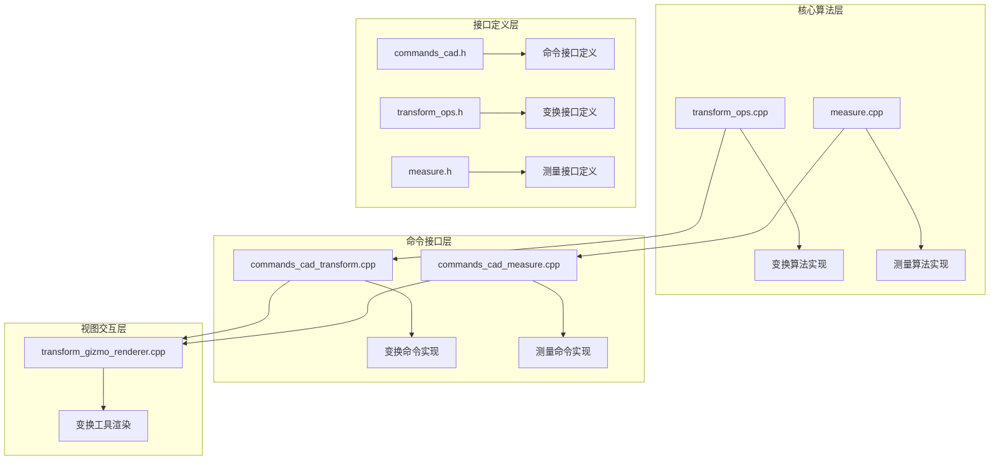
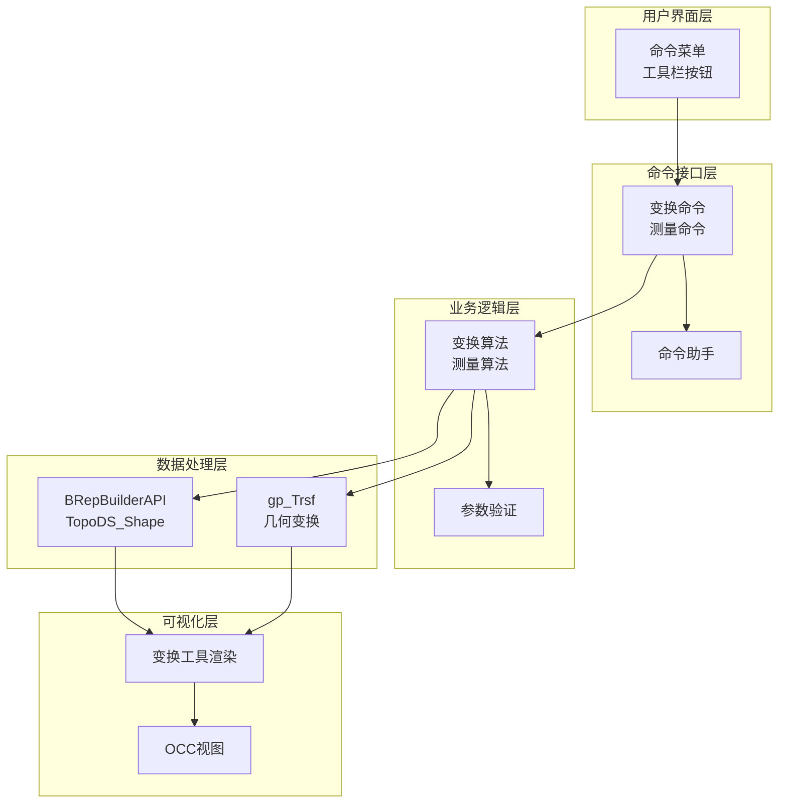
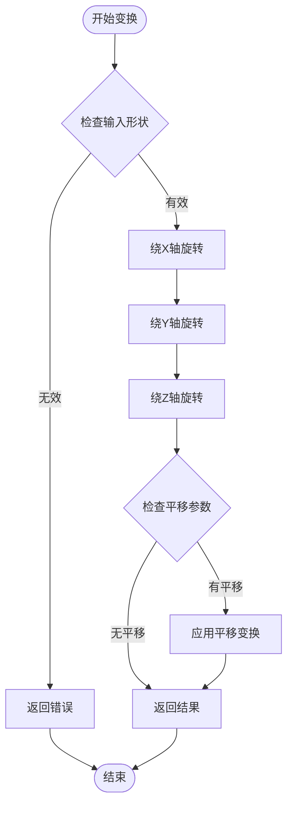
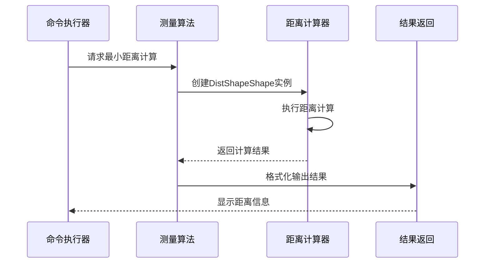
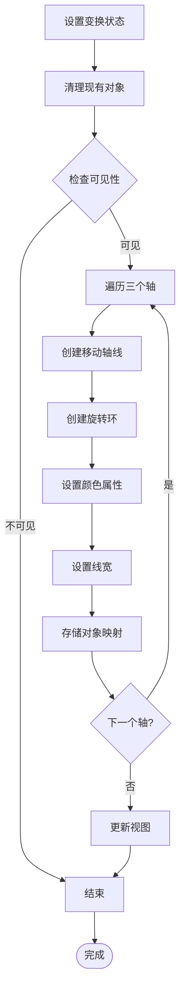
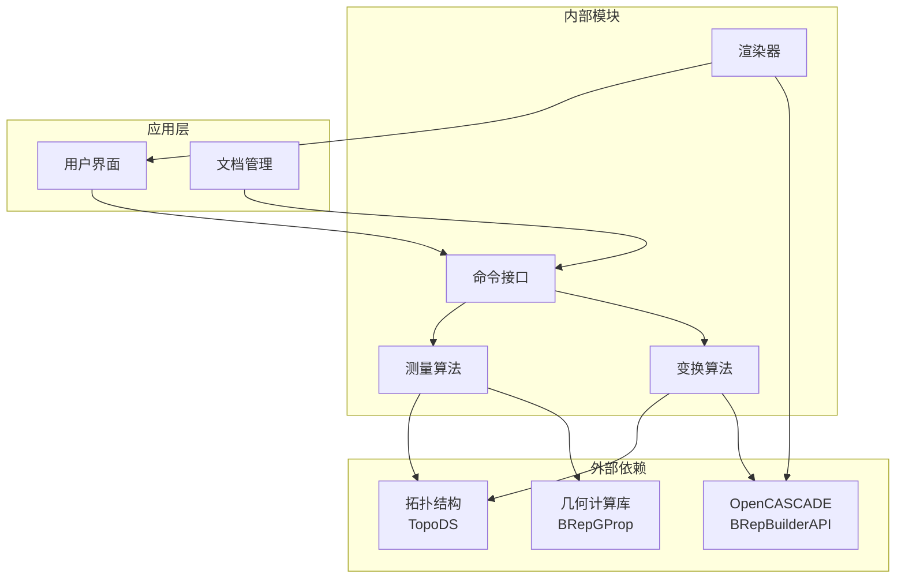

# 变换操作

<cite>
**本文引用的文件**
- [transform_ops.cpp](file://src/core/algorithms/cad/transform_ops.cpp)
- [transform_ops.h](file://src/core/algorithms/cad/transform_ops.h)
- [measure.cpp](file://src/core/algorithms/cad/measure.cpp)
- [measure.h](file://src/core/algorithms/cad/measure.h)
- [commands_cad_transform.cpp](file://src/modules/cad/commands/commands_cad_transform.cpp)
- [commands_cad_measure.cpp](file://src/modules/cad/commands/commands_cad_measure.cpp)
- [transform_gizmo_renderer.cpp](file://src/view/transform_gizmo_renderer.cpp)
- [commands_cad.h](file://src/modules/cad/commands/commands_cad.h)
</cite>

## 目录
1. [简介](#简介)
2. [项目结构](#项目结构)
3. [核心组件](#核心组件)
4. [架构概览](#架构概览)
5. [详细组件分析](#详细组件分析)
6. [依赖分析](#依赖分析)
7. [性能考虑](#性能考虑)
8. [故障排除指南](#故障排除指南)
9. [结论](#结论)

## 简介

LaserCNC的变换操作功能提供了完整的几何体变换和测量能力。该系统支持基本变换操作（平移、旋转、缩放、投影）和复合变换，能够精确计算几何量（距离、角度、面积、体积），并提供直观的可视化交互界面。

本技术文档将深入解析变换算法的实现原理，包括变换矩阵计算、变换顺序影响和组合优化策略，同时详细介绍测量功能的精确计算方法和实际应用场景。

## 项目结构

变换操作功能在LaserCNC项目中的组织结构如下：

**图表来源**
- [transform_ops.cpp:1-80](file://src/core/algorithms/cad/transform_ops.cpp#L1-L80)
- [measure.cpp:1-47](file://src/core/algorithms/cad/measure.cpp#L1-L47)
- [commands_cad_transform.cpp](file://src/modules/cad/commands/commands_cad_transform.cpp)
- [commands_cad_measure.cpp:1-165](file://src/modules/cad/commands/commands_cad_measure.cpp#L1-L165)
- [transform_gizmo_renderer.cpp:1-193](file://src/view/transform_gizmo_renderer.cpp#L1-L193)

**章节来源**
- [transform_ops.cpp:1-80](file://src/core/algorithms/cad/transform_ops.cpp#L1-L80)
- [measure.cpp:1-47](file://src/core/algorithms/cad/measure.cpp#L1-L47)
- [commands_cad_transform.cpp](file://src/modules/cad/commands/commands_cad_transform.cpp)
- [commands_cad_measure.cpp:1-165](file://src/modules/cad/commands/commands_cad_measure.cpp#L1-L165)
- [transform_gizmo_renderer.cpp:1-193](file://src/view/transform_gizmo_renderer.cpp#L1-L193)

## 核心组件

### 变换算法核心

变换算法基于OpenCASCADE的BRepBuilderAPI_Transform实现，支持以下基本变换操作：

- **平移变换**：沿三维空间任意方向移动几何体
- **旋转变换**：绕指定轴旋转指定角度
- **缩放变换**：按比例放大或缩小几何体
- **投影变换**：将三维几何体投影到二维平面

### 测量算法核心

测量算法提供多种几何量计算功能：

- **距离测量**：计算两个几何体间的最小距离
- **角度测量**：测量两个几何体表面法向量夹角
- **面积计算**：计算几何体表面积
- **体积计算**：计算几何体体积

### 视觉化交互组件

变换工具渲染器提供直观的变换操作界面，包括：

- **移动轴线**：显示三个坐标轴的移动方向
- **旋转环**：显示围绕各轴的旋转轨迹
- **颜色编码**：通过RGB颜色区分不同轴向

**章节来源**
- [transform_ops.cpp:10-80](file://src/core/algorithms/cad/transform_ops.cpp#L10-L80)
- [measure.cpp:22-47](file://src/core/algorithms/cad/measure.cpp#L22-L47)
- [transform_gizmo_renderer.cpp:20-193](file://src/view/transform_gizmo_renderer.cpp#L20-L193)

## 架构概览

变换操作系统的整体架构采用分层设计，确保功能模块的独立性和可维护性：

**图表来源**
- [commands_cad_transform.cpp](file://src/modules/cad/commands/commands_cad_transform.cpp)
- [commands_cad_measure.cpp:1-165](file://src/modules/cad/commands/commands_cad_measure.cpp#L1-L165)
- [transform_ops.cpp:1-80](file://src/core/algorithms/cad/transform_ops.cpp#L1-L80)
- [measure.cpp:1-47](file://src/core/algorithms/cad/measure.cpp#L1-L47)
- [transform_gizmo_renderer.cpp:1-193](file://src/view/transform_gizmo_renderer.cpp#L1-L193)

## 详细组件分析

### 变换算法实现

变换算法采用链式调用的方式实现复合变换，确保变换顺序的正确性和效率。

#### 变换矩阵计算

**图表来源**
- [transform_ops.cpp:53-78](file://src/core/algorithms/cad/transform_ops.cpp#L53-L78)

#### 复合变换实现

复合变换通过以下步骤实现：

1. **旋转变换**：按XYZ轴顺序依次应用旋转
2. **平移变换**：最后应用平移变换
3. **变换验证**：确保变换结果有效

**章节来源**
- [transform_ops.cpp:10-80](file://src/core/algorithms/cad/transform_ops.cpp#L10-L80)

### 测量算法实现

测量算法基于OpenCASCADE的几何计算库，提供高精度的几何量计算。

#### 距离测量算法

**图表来源**
- [commands_cad_measure.cpp:34-57](file://src/modules/cad/commands/commands_cad_measure.cpp#L34-L57)
- [measure.cpp:24-35](file://src/core/algorithms/cad/measure.cpp#L24-L35)

#### 角度测量算法

角度测量通过计算两个几何体表面法向量的夹角实现：

1. **法向量提取**：获取每个几何体的第一个表面法向量
2. **夹角计算**：使用向量点积公式计算夹角
3. **结果转换**：将弧度转换为角度值

**章节来源**
- [commands_cad_measure.cpp:59-97](file://src/modules/cad/commands/commands_cad_measure.cpp#L59-L97)
- [measure.cpp:37-47](file://src/core/algorithms/cad/measure.cpp#L37-L47)

### 视觉化交互组件

变换工具渲染器提供直观的用户交互界面：

#### 变换工具渲染流程

**图表来源**
- [transform_gizmo_renderer.cpp:93-127](file://src/view/transform_gizmo_renderer.cpp#L93-L127)

#### 轴向识别机制

变换工具通过键值对机制识别不同的操作部件：

- **键格式**：`operation:axis`
- **操作类型**：0=移动, 1=旋转
- **轴标识**：0=X轴, 1=Y轴, 2=Z轴

**章节来源**
- [transform_gizmo_renderer.cpp:20-193](file://src/view/transform_gizmo_renderer.cpp#L20-L193)

## 依赖分析

变换操作功能的依赖关系体现了清晰的分层架构：

**图表来源**
- [transform_ops.cpp:1-10](file://src/core/algorithms/cad/transform_ops.cpp#L1-L10)
- [measure.cpp:1-17](file://src/core/algorithms/cad/measure.cpp#L1-L17)
- [commands_cad_transform.cpp](file://src/modules/cad/commands/commands_cad_transform.cpp)
- [commands_cad_measure.cpp:1-20](file://src/modules/cad/commands/commands_cad_measure.cpp#L1-L20)

**章节来源**
- [transform_ops.cpp:1-10](file://src/core/algorithms/cad/transform_ops.cpp#L1-L10)
- [measure.cpp:1-17](file://src/core/algorithms/cad/measure.cpp#L1-L17)

## 性能考虑

### 变换操作性能优化

1. **零角度旋转优化**：当旋转角度接近零时直接跳过变换
2. **空变换检测**：检查平移向量的平方幅度避免无效操作
3. **内存管理**：使用BRepBuilderAPI_Transform的缓存机制

### 测量操作性能优化

1. **异常处理**：使用try-catch机制捕获几何计算异常
2. **参数验证**：在计算前验证输入参数的有效性
3. **精度控制**：合理设置数值计算的精度阈值

### 内存使用优化

- **形状复制**：仅在必要时复制几何形状
- **临时对象**：及时释放中间计算结果
- **批量处理**：支持多个几何体的批量测量

## 故障排除指南

### 常见问题及解决方案

#### 变换失败问题

**问题现象**：变换操作返回失败

**可能原因**：
- 输入几何体为空
- 变换参数无效
- 几何形状不完整

**解决方法**：
1. 检查几何体是否有效
2. 验证变换参数范围
3. 确认几何形状完整性

#### 测量计算失败

**问题现象**：测量结果为负值或异常

**可能原因**：
- 几何体表面法向量计算失败
- 距离计算算法异常
- 输入参数不合法

**解决方法**：
1. 检查几何体表面完整性
2. 验证测量对象的有效性
3. 重新选择测量目标

#### 视觉化显示问题

**问题现象**：变换工具显示异常

**可能原因**：
- 视图上下文为空
- 变换状态配置错误
- 渲染参数设置不当

**解决方法**：
1. 确保视图上下文有效
2. 检查变换状态参数
3. 验证渲染配置

**章节来源**
- [transform_ops.cpp:15-35](file://src/core/algorithms/cad/transform_ops.cpp#L15-L35)
- [measure.cpp:24-35](file://src/core/algorithms/cad/measure.cpp#L24-L35)
- [commands_cad_measure.cpp:48-51](file://src/modules/cad/commands/commands_cad_measure.cpp#L48-L51)

## 结论

LaserCNC的变换操作功能通过精心设计的分层架构实现了高效、精确的几何变换和测量能力。系统的主要优势包括：

1. **算法完整性**：支持完整的几何变换操作和多种测量功能
2. **用户体验**：提供直观的可视化交互界面
3. **性能优化**：通过多种优化策略确保操作效率
4. **错误处理**：完善的异常处理机制保证系统稳定性

该系统为激光加工和CAD/CAM应用提供了强大的几何处理基础，支持从简单的位置调整到复杂的几何分析任务。通过合理的架构设计和算法实现，为后续的功能扩展和性能优化奠定了坚实基础。