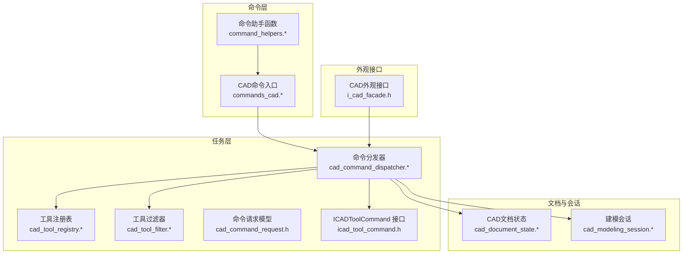
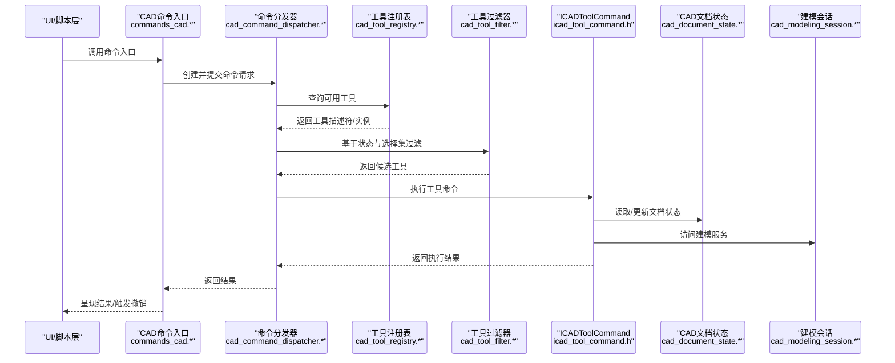
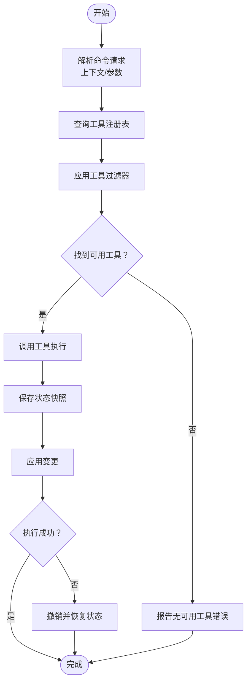
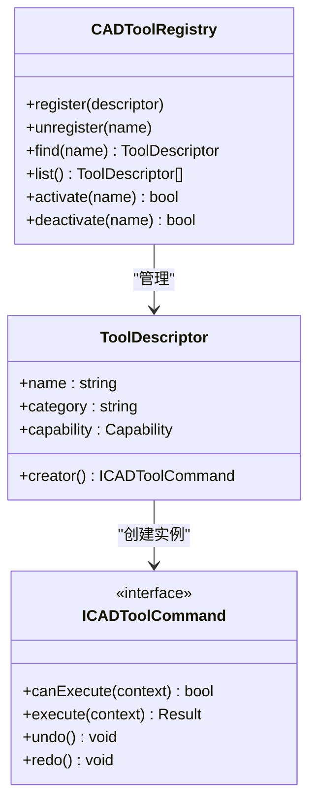
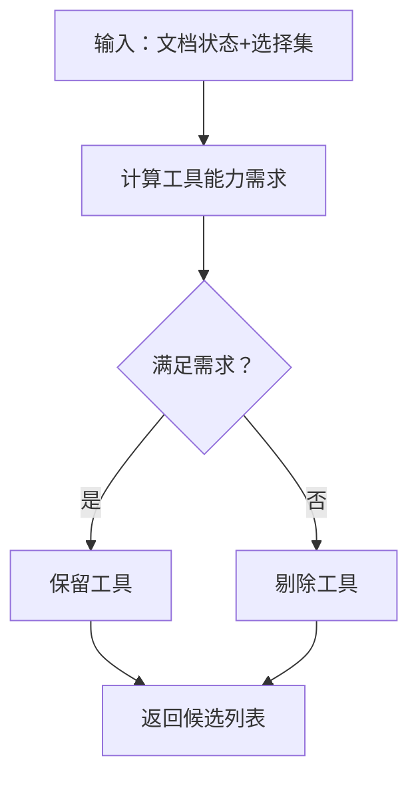
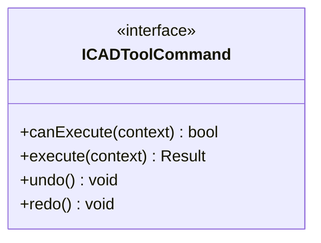
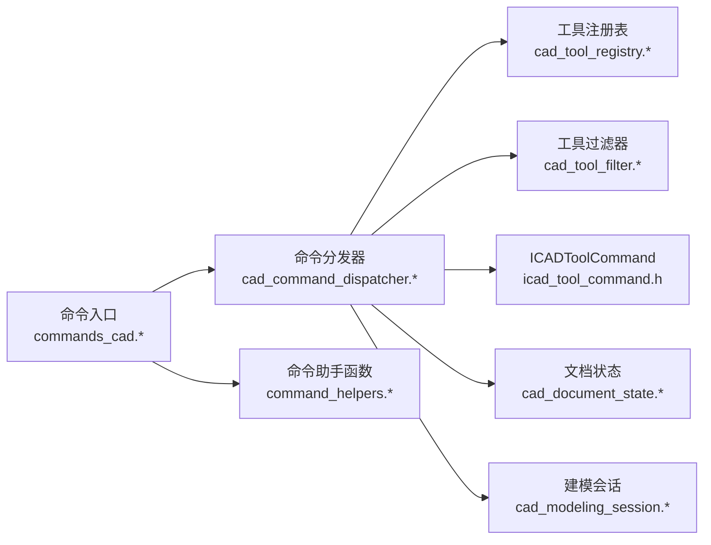

# 命令系统

<cite>
**本文引用的文件**
- [cad_command_dispatcher.h](file://src/modules/cad/task/cad_command_dispatcher.h)
- [cad_command_dispatcher.cpp](file://src/modules/cad/task/cad_command_dispatcher.cpp)
- [icad_tool_command.h](file://src/modules/cad/task/icad_tool_command.h)
- [cad_tool_registry.h](file://src/modules/cad/task/cad_tool_registry.h)
- [cad_tool_registry.cpp](file://src/modules/cad/task/cad_tool_registry.cpp)
- [cad_tool_filter.h](file://src/modules/cad/task/cad_tool_filter.h)
- [cad_tool_filter.cpp](file://src/modules/cad/task/cad_tool_filter.cpp)
- [command_helpers.h](file://src/modules/cad/commands/command_helpers.h)
- [command_helpers.cpp](file://src/modules/cad/commands/command_helpers.cpp)
- [commands_cad.h](file://src/modules/cad/commands/commands_cad.h)
- [commands_cad.cpp](file://src/modules/cad/commands/commands_cad.cpp)
- [cad_document_state.h](file://src/modules/cad/document/cad_document_state.h)
- [cad_document_state.cpp](file://src/modules/cad/document/cad_document_state.cpp)
- [cad_modeling_session.h](file://src/modules/cad/services/cad_modeling_session.h)
- [cad_modeling_session.cpp](file://src/modules/cad/services/cad_modeling_session.cpp)
- [i_cad_facade.h](file://src/modules/cad/i_cad_facade.h)
</cite>

## 目录
1. [简介](#简介)
2. [项目结构](#项目结构)
3. [核心组件](#核心组件)
4. [架构总览](#架构总览)
5. [详细组件分析](#详细组件分析)
6. [依赖关系分析](#依赖关系分析)
7. [性能考量](#性能考量)
8. [故障排查指南](#故障排查指南)
9. [结论](#结论)
10. [附录：开发新CAD工具命令指南](#附录开发新cad工具命令指南)

## 简介
本文件面向LaserCNC的CAD命令系统，系统性阐述命令分发器的架构设计与实现，包括命令注册、调度、执行与撤销机制；工具注册表的动态加载与生命周期管理；ICADToolCommand接口的设计理念与扩展性；以及命令助手函数在参数验证、状态检查与错误处理方面的最佳实践。同时提供完整开发流程与参考路径，帮助开发者快速上手并正确集成新的CAD工具命令。

## 项目结构
CAD命令系统主要分布在以下模块与目录中：
- 任务层（task）：命令分发器、工具注册表、工具过滤器、工具描述符与请求模型
- 命令层（commands）：命令助手函数与各类CAD命令入口
- 文档状态（document）：CAD文档状态管理
- 建模会话（services）：建模会话与服务交互
- 外观接口（i_cad_facade.h）：对外统一接口

图表来源
- [cad_command_dispatcher.h](file://src/modules/cad/task/cad_command_dispatcher.h)
- [cad_tool_registry.h](file://src/modules/cad/task/cad_tool_registry.h)
- [cad_tool_filter.h](file://src/modules/cad/task/cad_tool_filter.h)
- [icad_tool_command.h](file://src/modules/cad/task/icad_tool_command.h)
- [command_helpers.h](file://src/modules/cad/commands/command_helpers.h)
- [commands_cad.h](file://src/modules/cad/commands/commands_cad.h)
- [cad_document_state.h](file://src/modules/cad/document/cad_document_state.h)
- [cad_modeling_session.h](file://src/modules/cad/services/cad_modeling_session.h)
- [i_cad_facade.h](file://src/modules/cad/i_cad_facade.h)

章节来源
- [cad_command_dispatcher.h](file://src/modules/cad/task/cad_command_dispatcher.h)
- [cad_tool_registry.h](file://src/modules/cad/task/cad_tool_registry.h)
- [command_helpers.h](file://src/modules/cad/commands/command_helpers.h)
- [commands_cad.h](file://src/modules/cad/commands/commands_cad.h)
- [cad_document_state.h](file://src/modules/cad/document/cad_document_state.h)
- [cad_modeling_session.h](file://src/modules/cad/services/cad_modeling_session.h)
- [i_cad_facade.h](file://src/modules/cad/i_cad_facade.h)

## 核心组件
- 命令分发器：负责接收命令请求、解析上下文、选择合适工具、执行与撤销、并与文档状态和建模会话交互
- 工具注册表：维护可用CAD工具的元数据与实例，支持动态发现与生命周期管理
- 工具过滤器：根据当前文档状态与选择集筛选可执行工具
- ICADToolCommand接口：定义工具命令的标准行为，确保扩展性与一致性
- 命令助手函数：封装通用的参数校验、状态检查与错误处理逻辑
- CAD命令入口：集中暴露命令到UI或脚本层，协调分发器与工具

章节来源
- [cad_command_dispatcher.h](file://src/modules/cad/task/cad_command_dispatcher.h)
- [cad_command_dispatcher.cpp](file://src/modules/cad/task/cad_command_dispatcher.cpp)
- [cad_tool_registry.h](file://src/modules/cad/task/cad_tool_registry.h)
- [cad_tool_registry.cpp](file://src/modules/cad/task/cad_tool_registry.cpp)
- [cad_tool_filter.h](file://src/modules/cad/task/cad_tool_filter.h)
- [cad_tool_filter.cpp](file://src/modules/cad/task/cad_tool_filter.cpp)
- [icad_tool_command.h](file://src/modules/cad/task/icad_tool_command.h)
- [command_helpers.h](file://src/modules/cad/commands/command_helpers.h)
- [command_helpers.cpp](file://src/modules/cad/commands/command_helpers.cpp)
- [commands_cad.h](file://src/modules/cad/commands/commands_cad.h)
- [commands_cad.cpp](file://src/modules/cad/commands/commands_cad.cpp)
- [cad_document_state.h](file://src/modules/cad/document/cad_document_state.h)
- [cad_document_state.cpp](file://src/modules/cad/document/cad_document_state.cpp)
- [cad_modeling_session.h](file://src/modules/cad/services/cad_modeling_session.h)
- [cad_modeling_session.cpp](file://src/modules/cad/services/cad_modeling_session.cpp)

## 架构总览
下图展示了从命令入口到工具执行与撤销的端到端流程，以及与文档状态和建模会话的交互关系。

图表来源
- [commands_cad.cpp](file://src/modules/cad/commands/commands_cad.cpp)
- [cad_command_dispatcher.cpp](file://src/modules/cad/task/cad_command_dispatcher.cpp)
- [cad_tool_registry.cpp](file://src/modules/cad/task/cad_tool_registry.cpp)
- [cad_tool_filter.cpp](file://src/modules/cad/task/cad_tool_filter.cpp)
- [icad_tool_command.h](file://src/modules/cad/task/icad_tool_command.h)
- [cad_document_state.cpp](file://src/modules/cad/document/cad_document_state.cpp)
- [cad_modeling_session.cpp](file://src/modules/cad/services/cad_modeling_session.cpp)

## 详细组件分析

### 命令分发器（CAD Command Dispatcher）
职责与流程
- 接收命令请求，解析上下文（如当前文档、选择集、用户输入）
- 查询工具注册表，结合工具过滤器进行候选筛选
- 选择合适的工具实例，调用其执行方法
- 支持撤销/重做：记录可逆操作，必要时回滚状态
- 与CAD文档状态与建模会话交互，保证一致性

关键点
- 解耦命令入口与具体工具实现，通过接口与描述符驱动
- 统一错误处理与状态检查，避免重复逻辑
- 撤销栈管理：在执行前保存状态快照，失败时恢复

图表来源
- [cad_command_dispatcher.cpp](file://src/modules/cad/task/cad_command_dispatcher.cpp)
- [cad_tool_registry.cpp](file://src/modules/cad/task/cad_tool_registry.cpp)
- [cad_tool_filter.cpp](file://src/modules/cad/task/cad_tool_filter.cpp)
- [cad_document_state.cpp](file://src/modules/cad/document/cad_document_state.cpp)

章节来源
- [cad_command_dispatcher.h](file://src/modules/cad/task/cad_command_dispatcher.h)
- [cad_command_dispatcher.cpp](file://src/modules/cad/task/cad_command_dispatcher.cpp)

### 工具注册表（CAD Tool Registry）
职责与特性
- 维护工具描述符与实例映射
- 支持动态注册/注销，便于插件化扩展
- 生命周期管理：初始化、激活、停用、销毁
- 提供查询接口：按类型、名称、能力等检索工具

图表来源
- [cad_tool_registry.h](file://src/modules/cad/task/cad_tool_registry.h)
- [cad_tool_registry.cpp](file://src/modules/cad/task/cad_tool_registry.cpp)
- [icad_tool_command.h](file://src/modules/cad/task/icad_tool_command.h)

章节来源
- [cad_tool_registry.h](file://src/modules/cad/task/cad_tool_registry.h)
- [cad_tool_registry.cpp](file://src/modules/cad/task/cad_tool_registry.cpp)

### 工具过滤器（CAD Tool Filter）
职责与策略
- 基于当前文档状态与选择集，过滤不可用工具
- 支持能力匹配（如是否需要选中元素、是否需要编辑态）
- 可配置优先级与可见性规则

图表来源
- [cad_tool_filter.cpp](file://src/modules/cad/task/cad_tool_filter.cpp)
- [cad_document_state.cpp](file://src/modules/cad/document/cad_document_state.cpp)

章节来源
- [cad_tool_filter.h](file://src/modules/cad/task/cad_tool_filter.h)
- [cad_tool_filter.cpp](file://src/modules/cad/task/cad_tool_filter.cpp)

### ICADToolCommand 接口
设计理念
- 标准化：统一的canExecute/execute/undo/redo契约，确保所有工具行为一致
- 可撤销：强制实现撤销/重做，保障用户操作安全
- 上下文感知：通过context传递文档、选择集、参数等信息
- 可组合：工具间可通过会话与文档状态协作，形成复杂工作流

图表来源
- [icad_tool_command.h](file://src/modules/cad/task/icad_tool_command.h)

章节来源
- [icad_tool_command.h](file://src/modules/cad/task/icad_tool_command.h)

### 命令助手函数（Command Helpers）
实用功能
- 参数验证：类型检查、范围校验、必填项确认
- 状态检查：当前文档是否打开、是否处于可编辑状态、选择集是否满足要求
- 错误处理：统一错误码、消息格式化、异常转换
- 用户反馈：提示信息、进度上报、取消检测

章节来源
- [command_helpers.h](file://src/modules/cad/commands/command_helpers.h)
- [command_helpers.cpp](file://src/modules/cad/commands/command_helpers.cpp)

### CAD命令入口（commands_cad）
职责
- 将UI/脚本层的调用映射为命令请求
- 协调分发器与工具，处理返回结果与错误
- 集成撤销/重做按钮与快捷键

章节来源
- [commands_cad.h](file://src/modules/cad/commands/commands_cad.h)
- [commands_cad.cpp](file://src/modules/cad/commands/commands_cad.cpp)

### 文档状态与建模会话
- 文档状态：维护当前CAD文档的几何、属性、历史等信息，为工具提供只读/可写访问
- 建模会话：封装建模服务（如布尔运算、草图、变换等），作为工具执行的后端支撑

章节来源
- [cad_document_state.h](file://src/modules/cad/document/cad_document_state.h)
- [cad_document_state.cpp](file://src/modules/cad/document/cad_document_state.cpp)
- [cad_modeling_session.h](file://src/modules/cad/services/cad_modeling_session.h)
- [cad_modeling_session.cpp](file://src/modules/cad/services/cad_modeling_session.cpp)

## 依赖关系分析
- 命令入口依赖分发器；分发器依赖注册表、过滤器与工具接口
- 分发器与文档状态、建模会话存在双向交互：工具读取状态、更新状态；会话提供服务
- 工具过滤器依赖文档状态以判断可用性
- 命令助手函数被命令入口与工具共同使用，提升一致性与可维护性

图表来源
- [commands_cad.cpp](file://src/modules/cad/commands/commands_cad.cpp)
- [cad_command_dispatcher.cpp](file://src/modules/cad/task/cad_command_dispatcher.cpp)
- [cad_tool_registry.cpp](file://src/modules/cad/task/cad_tool_registry.cpp)
- [cad_tool_filter.cpp](file://src/modules/cad/task/cad_tool_filter.cpp)
- [icad_tool_command.h](file://src/modules/cad/task/icad_tool_command.h)
- [cad_document_state.cpp](file://src/modules/cad/document/cad_document_state.cpp)
- [cad_modeling_session.cpp](file://src/modules/cad/services/cad_modeling_session.cpp)
- [command_helpers.cpp](file://src/modules/cad/commands/command_helpers.cpp)

章节来源
- [commands_cad.h](file://src/modules/cad/commands/commands_cad.h)
- [cad_command_dispatcher.h](file://src/modules/cad/task/cad_command_dispatcher.h)
- [cad_tool_registry.h](file://src/modules/cad/task/cad_tool_registry.h)
- [cad_tool_filter.h](file://src/modules/cad/task/cad_tool_filter.h)
- [icad_tool_command.h](file://src/modules/cad/task/icad_tool_command.h)
- [cad_document_state.h](file://src/modules/cad/document/cad_document_state.h)
- [cad_modeling_session.h](file://src/modules/cad/services/cad_modeling_session.h)
- [command_helpers.h](file://src/modules/cad/commands/command_helpers.h)

## 性能考量
- 工具注册与查询：采用轻量级描述符与延迟实例化，减少启动开销
- 过滤器缓存：对常用过滤条件进行缓存，避免重复计算
- 撤销栈管理：限制撤销深度，定期清理不可达的历史快照
- 并发安全：在多线程场景下，确保文档状态与工具执行的原子性与一致性
- UI响应：长耗时操作异步执行，配合进度条与取消机制

## 故障排查指南
常见问题与定位建议
- 工具未显示：检查工具是否已注册、过滤器是否排除、能力是否匹配
- 执行失败：查看命令助手的错误码与消息，确认参数与状态检查是否通过
- 撤销无效：确认工具实现了撤销逻辑，且分发器正确保存了状态快照
- 文档状态不一致：检查工具是否正确读写文档状态，是否存在并发冲突

章节来源
- [command_helpers.cpp](file://src/modules/cad/commands/command_helpers.cpp)
- [cad_command_dispatcher.cpp](file://src/modules/cad/task/cad_command_dispatcher.cpp)
- [cad_tool_registry.cpp](file://src/modules/cad/task/cad_tool_registry.cpp)
- [cad_tool_filter.cpp](file://src/modules/cad/task/cad_tool_filter.cpp)

## 结论
LaserCNC的CAD命令系统通过清晰的分层与标准化接口，实现了命令的可扩展、可维护与可撤销。工具注册表与过滤器提供了灵活的动态加载与协作机制，命令助手函数统一了参数与状态管理，确保了良好的用户体验与稳定性。遵循本文的开发流程与最佳实践，可以高效地集成新的CAD工具命令，并与其他模块无缝协作。

## 附录：开发新CAD工具命令指南
步骤概览
- 定义工具类并实现ICADToolCommand接口
- 在工具注册表中注册工具描述符
- 在命令入口中添加命令映射
- 使用命令助手函数进行参数与状态检查
- 在UI中绑定命令入口与撤销/重做
- 编写单元测试与集成测试

参考路径
- 工具接口定义：[icad_tool_command.h](file://src/modules/cad/task/icad_tool_command.h)
- 工具注册与查询：[cad_tool_registry.h](file://src/modules/cad/task/cad_tool_registry.h), [cad_tool_registry.cpp](file://src/modules/cad/task/cad_tool_registry.cpp)
- 命令入口与分发：[commands_cad.h](file://src/modules/cad/commands/commands_cad.h), [commands_cad.cpp](file://src/modules/cad/commands/commands_cad.cpp), [cad_command_dispatcher.h](file://src/modules/cad/task/cad_command_dispatcher.h), [cad_command_dispatcher.cpp](file://src/modules/cad/task/cad_command_dispatcher.cpp)
- 命令助手函数：[command_helpers.h](file://src/modules/cad/commands/command_helpers.h), [command_helpers.cpp](file://src/modules/cad/commands/command_helpers.cpp)
- 文档状态与建模会话：[cad_document_state.h](file://src/modules/cad/document/cad_document_state.h), [cad_document_state.cpp](file://src/modules/cad/document/cad_document_state.cpp), [cad_modeling_session.h](file://src/modules/cad/services/cad_modeling_session.h), [cad_modeling_session.cpp](file://src/modules/cad/services/cad_modeling_session.cpp)
- 外观接口：[i_cad_facade.h](file://src/modules/cad/i_cad_facade.h)