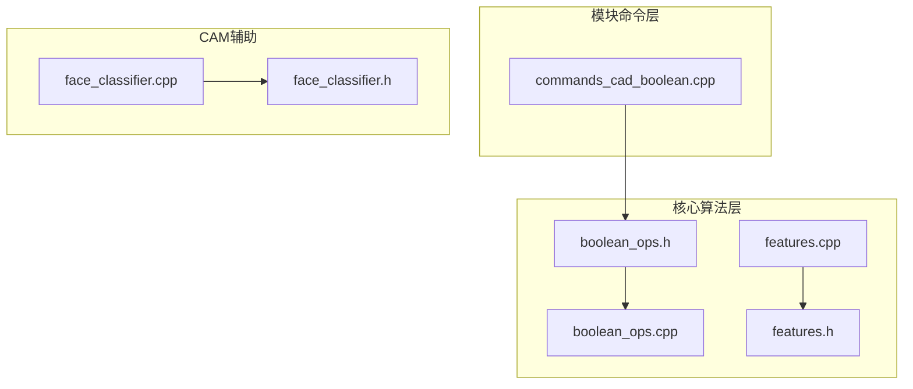
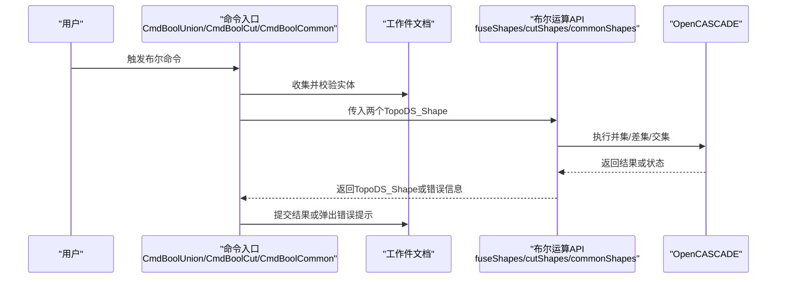
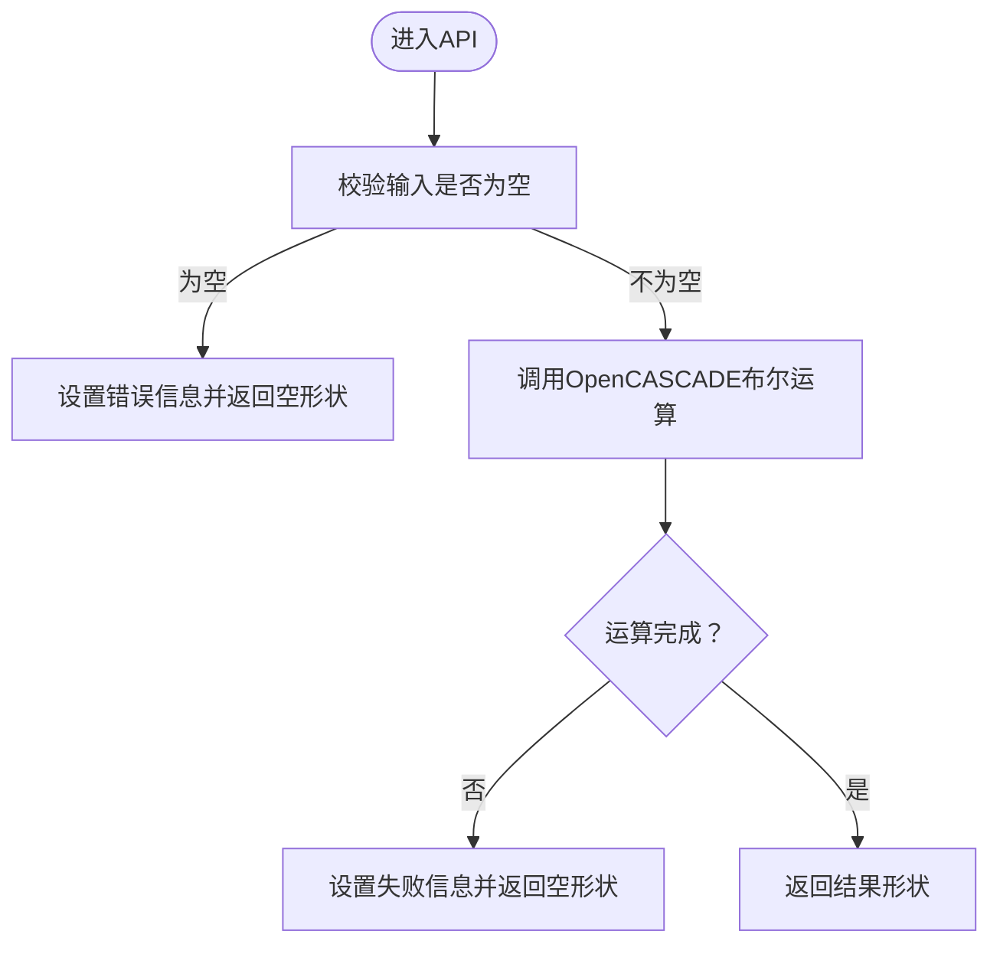
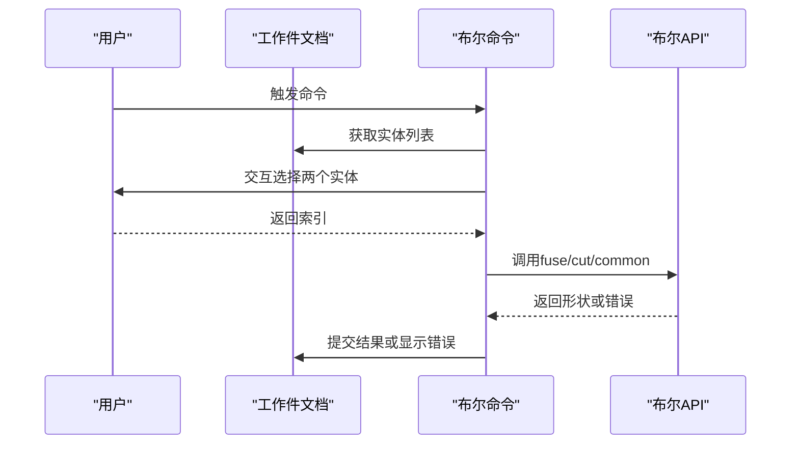
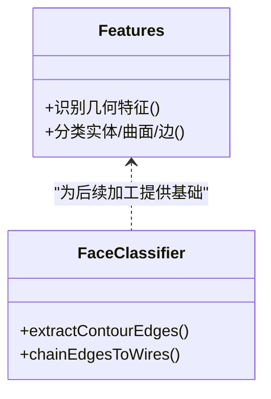
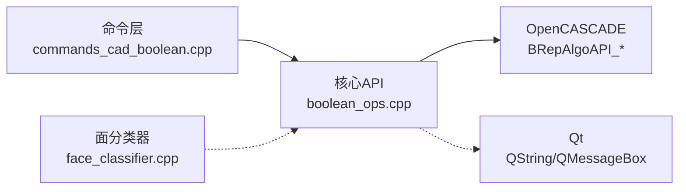

# 布尔运算

<cite>
**本文引用的文件**
- [boolean_ops.h](file://src/core/algorithms/cad/boolean_ops.h)
- [boolean_ops.cpp](file://src/core/algorithms/cad/boolean_ops.cpp)
- [commands_cad_boolean.cpp](file://src/modules/cad/commands/commands_cad_boolean.cpp)
- [features.h](file://src/core/algorithms/cad/features.h)
- [features.cpp](file://src/core/algorithms/cad/features.cpp)
- [face_classifier.h](file://src/core/algorithms/cam/face_classifier.h)
- [face_classifier.cpp](file://src/core/algorithms/cam/face_classifier.cpp)
</cite>

## 目录
1. [引言](#引言)
2. [项目结构](#项目结构)
3. [核心组件](#核心组件)
4. [架构总览](#架构总览)
5. [详细组件分析](#详细组件分析)
6. [依赖关系分析](#依赖关系分析)
7. [性能考虑](#性能考虑)
8. [故障排查指南](#故障排查指南)
9. [结论](#结论)
10. [附录](#附录)

## 引言
本文件面向LaserCNC中“布尔运算”功能的技术文档，聚焦于基于OpenCASCADE的几何布尔运算实现（并集、交集、差集），以及与之配套的特征识别与分类体系。文档旨在帮助开发者与高级用户理解算法原理、数据流、稳定性保障机制，并提供可直接参考的代码位置与调用路径，以便在复杂几何体组合与减材操作中正确使用布尔运算API。

## 项目结构
布尔运算能力由两层协作构成：
- 核心算法层：封装OpenCASCADE布尔运算接口，提供统一的失败回退与错误信息输出。
- 模块命令层：在CAD模块中暴露交互式命令入口，收集用户选择的两个实体，调用核心算法并提交结果。

此外，CAM侧的“面分类器”用于从复杂几何中提取轮廓边与线串，为后续加工路径规划提供基础。

**图表来源**
- [boolean_ops.h:1-24](file://src/core/algorithms/cad/boolean_ops.h#L1-L24)
- [boolean_ops.cpp:1-71](file://src/core/algorithms/cad/boolean_ops.cpp#L1-L71)
- [commands_cad_boolean.cpp:1-116](file://src/modules/cad/commands/commands_cad_boolean.cpp#L1-L116)
- [features.h](file://src/core/algorithms/cad/features.h)
- [features.cpp](file://src/core/algorithms/cad/features.cpp)
- [face_classifier.h](file://src/core/algorithms/cam/face_classifier.h)
- [face_classifier.cpp:297-367](file://src/core/algorithms/cam/face_classifier.cpp#L297-L367)

**章节来源**
- [boolean_ops.h:1-24](file://src/core/algorithms/cad/boolean_ops.h#L1-L24)
- [boolean_ops.cpp:1-71](file://src/core/algorithms/cad/boolean_ops.cpp#L1-L71)
- [commands_cad_boolean.cpp:1-116](file://src/modules/cad/commands/commands_cad_boolean.cpp#L1-L116)
- [features.h](file://src/core/algorithms/cad/features.h)
- [features.cpp](file://src/core/algorithms/cad/features.cpp)
- [face_classifier.h](file://src/core/algorithms/cam/face_classifier.h)
- [face_classifier.cpp:297-367](file://src/core/algorithms/cam/face_classifier.cpp#L297-L367)

## 核心组件
- 布尔运算核心API
  - 并集（A ∪ B）：[fuseShapes:23-37](file://src/core/algorithms/cad/boolean_ops.cpp#L23-L37)
  - 差集（A − B）：[cutShapes:39-53](file://src/core/algorithms/cad/boolean_ops.cpp#L39-L53)
  - 交集（A ∩ B）：[commonShapes:55-69](file://src/core/algorithms/cad/boolean_ops.cpp#L55-L69)
- 命令入口
  - 并集命令：[CmdBoolUnion:13-46](file://src/modules/cad/commands/commands_cad_boolean.cpp#L13-L46)
  - 差集命令：[CmdBoolCut:48-81](file://src/modules/cad/commands/commands_cad_boolean.cpp#L48-L81)
  - 交集命令：[CmdBoolCommon:83-116](file://src/modules/cad/commands/commands_cad_boolean.cpp#L83-L116)
- 特征识别与分类
  - 特征类型与识别：[features.h](file://src/core/algorithms/cad/features.h)，[features.cpp](file://src/core/algorithms/cad/features.cpp)
- CAM面分类与轮廓提取
  - 轮廓边提取：[extractContourEdges:297-345](file://src/core/algorithms/cam/face_classifier.cpp#L297-L345)
  - 边链到线串：[chainEdgesToWires:351-367](file://src/core/algorithms/cam/face_classifier.cpp#L351-L367)

**章节来源**
- [boolean_ops.h:9-23](file://src/core/algorithms/cad/boolean_ops.h#L9-L23)
- [boolean_ops.cpp:23-69](file://src/core/algorithms/cad/boolean_ops.cpp#L23-L69)
- [commands_cad_boolean.cpp:13-116](file://src/modules/cad/commands/commands_cad_boolean.cpp#L13-L116)
- [features.h](file://src/core/algorithms/cad/features.h)
- [features.cpp](file://src/core/algorithms/cad/features.cpp)
- [face_classifier.cpp:297-367](file://src/core/algorithms/cam/face_classifier.cpp#L297-L367)

## 架构总览
布尔运算的端到端流程如下：
- 用户在CAD界面选择两个实体
- 命令层收集实体并调用核心算法
- 核心算法通过OpenCASCADE执行布尔运算
- 若成功，将结果提交到文档；若失败，返回错误信息

**图表来源**
- [commands_cad_boolean.cpp:25-46](file://src/modules/cad/commands/commands_cad_boolean.cpp#L25-L46)
- [commands_cad_boolean.cpp:60-81](file://src/modules/cad/commands/commands_cad_boolean.cpp#L60-L81)
- [commands_cad_boolean.cpp:95-116](file://src/modules/cad/commands/commands_cad_boolean.cpp#L95-L116)
- [boolean_ops.cpp:23-69](file://src/core/algorithms/cad/boolean_ops.cpp#L23-L69)

## 详细组件分析

### 组件A：布尔运算核心API
- 设计要点
  - 输入参数：两个TopoDS_Shape，失败时通过QString*回写错误信息
  - 失败策略：返回空形状并设置错误信息，调用方无需处理异常对象
  - 稳定性：对空输入进行前置校验，避免无效调用导致未定义行为
- 数学与算法
  - 并集：将两个实体合并，去除重叠部分的内部表面
  - 差集：从第一个实体中“挖去”第二个实体的体积
  - 交集：仅保留两个实体共同包含的体积
- 错误处理
  - OpenCASCADE抛出的Standard_Failure会被捕获并转换为UTF-8字符串
  - 运算未完成（IsDone为false）时返回失败
- 性能与复杂度
  - 时间复杂度近似与实体表面三角化/四面体化的规模成正比
  - 空间复杂度与结果拓扑复杂度相关
- 使用建议
  - 在调用前确保实体非空且为有效实体（非空洞、非退化）
  - 对于高复杂度模型，建议先进行预清理（如修复、简化）

**图表来源**
- [boolean_ops.cpp:12-21](file://src/core/algorithms/cad/boolean_ops.cpp#L12-L21)
- [boolean_ops.cpp:23-69](file://src/core/algorithms/cad/boolean_ops.cpp#L23-L69)

**章节来源**
- [boolean_ops.h:9-23](file://src/core/algorithms/cad/boolean_ops.h#L9-L23)
- [boolean_ops.cpp:12-69](file://src/core/algorithms/cad/boolean_ops.cpp#L12-L69)

### 组件B：布尔运算命令入口
- 功能职责
  - 并集命令：选择两个实体后执行并集，提交结果
  - 差集命令：选择两个实体后执行差集，提交结果
  - 交集命令：选择两个实体后执行交集，提交结果
- 交互流程
  - 校验文档与实体数量
  - 交互式选择两个实体
  - 调用对应API执行布尔运算
  - 成功则提交新形状，失败则弹出错误对话框
- 安全性
  - 命令启用条件要求至少两个实体
  - 选择过程支持二次确认，避免误操作

**图表来源**
- [commands_cad_boolean.cpp:20-46](file://src/modules/cad/commands/commands_cad_boolean.cpp#L20-L46)
- [commands_cad_boolean.cpp:55-81](file://src/modules/cad/commands/commands_cad_boolean.cpp#L55-L81)
- [commands_cad_boolean.cpp:90-116](file://src/modules/cad/commands/commands_cad_boolean.cpp#L90-L116)

**章节来源**
- [commands_cad_boolean.cpp:13-116](file://src/modules/cad/commands/commands_cad_boolean.cpp#L13-L116)

### 组件C：特征识别与分类系统
- 目标
  - 将几何体分解为实体、曲面、边等不同层级的特征，便于后续建模与加工处理
- 关键点
  - 特征类型定义与识别逻辑位于features模块
  - 面分类器（CAM侧）用于从实体中提取外轮廓与截面轮廓边，形成线串以指导工具路径生成
- 与布尔运算的关系
  - 布尔运算后的复杂拓扑需要进一步的特征识别与分类，以支持后续编辑与加工
  - 轮廓边提取与链化是CAM路径规划的基础

**图表来源**
- [features.h](file://src/core/algorithms/cad/features.h)
- [features.cpp](file://src/core/algorithms/cad/features.cpp)
- [face_classifier.cpp:297-367](file://src/core/algorithms/cam/face_classifier.cpp#L297-L367)

**章节来源**
- [features.h](file://src/core/algorithms/cad/features.h)
- [features.cpp](file://src/core/algorithms/cad/features.cpp)
- [face_classifier.cpp:297-367](file://src/core/algorithms/cam/face_classifier.cpp#L297-L367)

## 依赖关系分析
- 模块耦合
  - 命令层依赖核心算法层提供的布尔运算API
  - 核心算法层依赖OpenCASCADE库（BRepAlgoAPI_*）
  - CAM面分类器独立于布尔运算，但与最终几何形态密切相关
- 外部依赖
  - OpenCASCADE：提供BRepAlgoAPI_Fuse/Cut/Common等布尔运算实现
  - Qt：用于UI交互与错误提示（QMessageBox）

**图表来源**
- [commands_cad_boolean.cpp:1-116](file://src/modules/cad/commands/commands_cad_boolean.cpp#L1-L116)
- [boolean_ops.cpp:1-71](file://src/core/algorithms/cad/boolean_ops.cpp#L1-L71)
- [face_classifier.cpp:297-367](file://src/core/algorithms/cam/face_classifier.cpp#L297-L367)

**章节来源**
- [commands_cad_boolean.cpp:1-116](file://src/modules/cad/commands/commands_cad_boolean.cpp#L1-L116)
- [boolean_ops.cpp:1-71](file://src/core/algorithms/cad/boolean_ops.cpp#L1-L71)
- [face_classifier.cpp:297-367](file://src/core/algorithms/cam/face_classifier.cpp#L297-L367)

## 性能考虑
- 复杂度与规模
  - 布尔运算的时间复杂度与实体表面的三角化/四面体化规模相关，复杂实体可能导致显著计算开销
- 建议
  - 在执行布尔运算前，尽量减少实体数量与面片数量
  - 对于高复杂度模型，优先采用简化的几何表示或分步布尔
  - 合理设置容差与网格密度，平衡精度与性能
- 稳定性
  - 保持输入实体的有效性（非空洞、非退化），避免无效运算导致崩溃或异常结果

## 故障排查指南
- 常见问题与定位
  - 输入为空：检查命令执行前的实体数量与有效性
  - 运算未完成：确认两个实体存在合理相交/包含关系
  - OpenCASCADE异常：查看错误信息字符串，定位具体失败原因
- 排查步骤
  - 确认文档已加载且包含实体
  - 重新选择两个实体，确保它们不是同一对象
  - 对简单模型先验证布尔运算是否正常
  - 如失败，记录错误信息并反馈给日志系统
- 相关实现位置
  - 输入校验与错误回写：[checkInputs:12-21](file://src/core/algorithms/cad/boolean_ops.cpp#L12-L21)
  - 失败返回与异常捕获：[fuseShapes/cutShapes/commonShapes:23-69](file://src/core/algorithms/cad/boolean_ops.cpp#L23-L69)
  - UI错误提示：[CmdBoolUnion/CmdBoolCut/CmdBoolCommon:38-45](file://src/modules/cad/commands/commands_cad_boolean.cpp#L38-L45)

**章节来源**
- [boolean_ops.cpp:12-69](file://src/core/algorithms/cad/boolean_ops.cpp#L12-L69)
- [commands_cad_boolean.cpp:38-45](file://src/modules/cad/commands/commands_cad_boolean.cpp#L38-L45)

## 结论
LaserCNC的布尔运算以OpenCASCADE为核心，提供了简洁稳定的API与直观的命令入口。通过严格的输入校验、失败回退与错误信息输出，系统在复杂几何体组合与减材操作中具备良好的可用性与可靠性。配合特征识别与面分类器，布尔运算的结果可进一步支撑后续的建模与加工流程。

## 附录
- 快速上手
  - 选择两个实体 → 触发布尔命令 → 查看结果或错误提示
- 参考实现位置
  - 并集：[fuseShapes:23-37](file://src/core/algorithms/cad/boolean_ops.cpp#L23-L37)，[CmdBoolUnion:25-46](file://src/modules/cad/commands/commands_cad_boolean.cpp#L25-L46)
  - 差集：[cutShapes:39-53](file://src/core/algorithms/cad/boolean_ops.cpp#L39-L53)，[CmdBoolCut:60-81](file://src/modules/cad/commands/commands_cad_boolean.cpp#L60-L81)
  - 交集：[commonShapes:55-69](file://src/core/algorithms/cad/boolean_ops.cpp#L55-L69)，[CmdBoolCommon:95-116](file://src/modules/cad/commands/commands_cad_boolean.cpp#L95-L116)
- CAM辅助
  - 轮廓边提取：[extractContourEdges:297-345](file://src/core/algorithms/cam/face_classifier.cpp#L297-L345)
  - 边链到线串：[chainEdgesToWires:351-367](file://src/core/algorithms/cam/face_classifier.cpp#L351-L367)