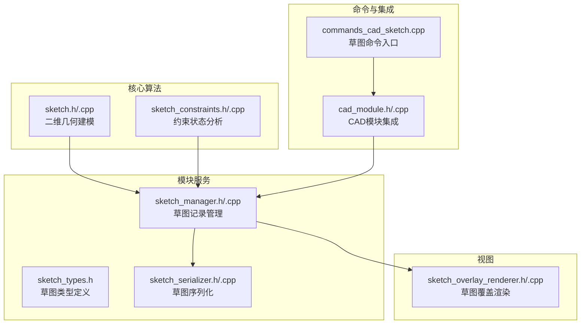
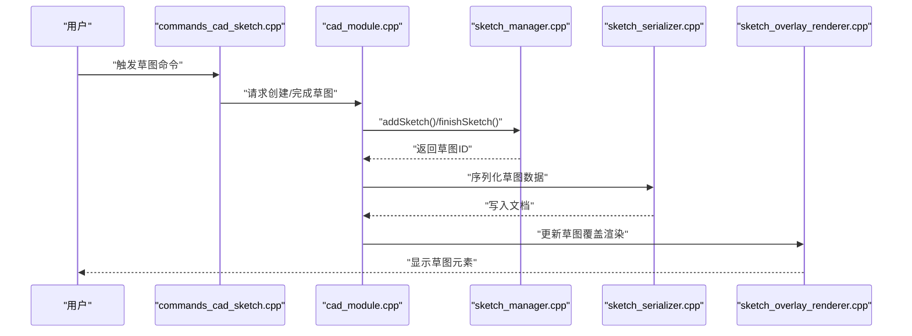
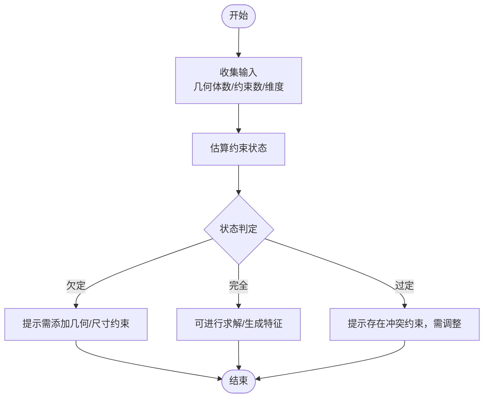
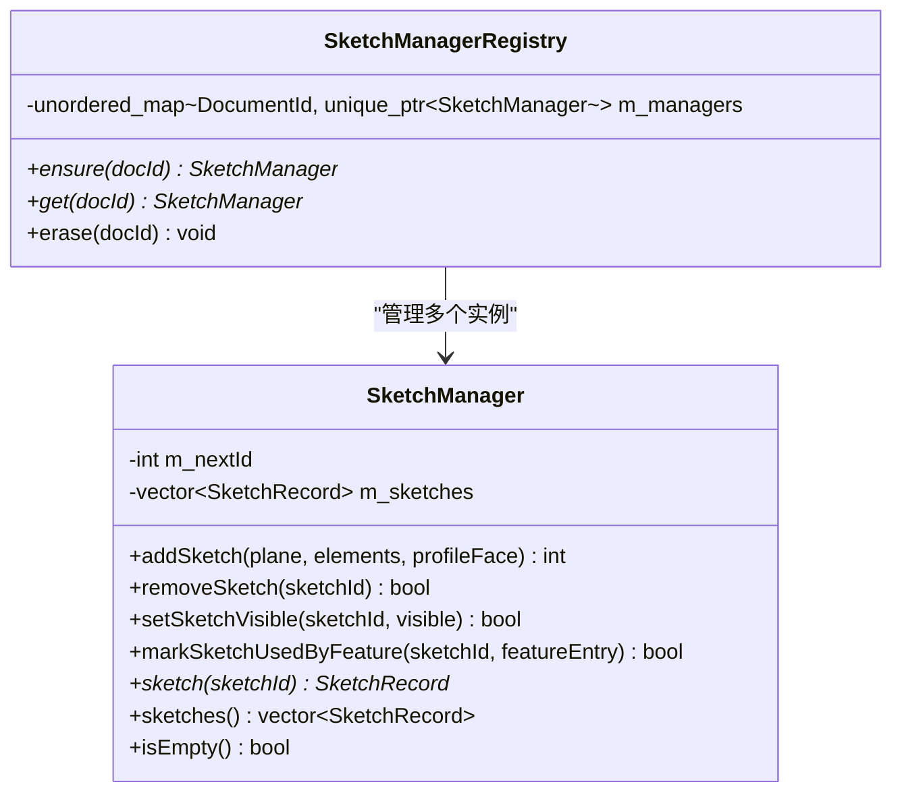
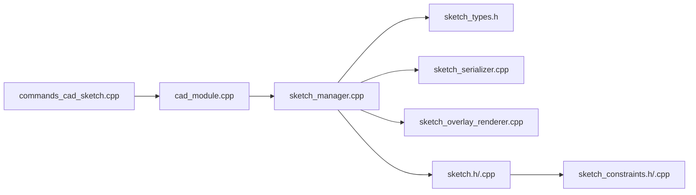

# 草图绘制

<cite>
**本文引用的文件**
- [sketch.h](file://src/core/algorithms/cad/sketch.h)
- [sketch.cpp](file://src/core/algorithms/cad/sketch.cpp)
- [sketch_constraints.h](file://src/core/algorithms/cad/sketch_constraints.h)
- [sketch_constraints.cpp](file://src/core/algorithms/cad/sketch_constraints.cpp)
- [sketch_manager.h](file://src/modules/cad/services/sketch_manager.h)
- [sketch_manager.cpp](file://src/modules/cad/services/sketch_manager.cpp)
- [sketch_types.h](file://src/modules/cad/services/sketch_types.h)
- [sketch_serializer.h](file://src/modules/cad/sketch/sketch_serializer.h)
- [sketch_serializer.cpp](file://src/modules/cad/sketch/sketch_serializer.cpp)
- [sketch_overlay_renderer.h](file://src/view/sketch_overlay_renderer.h)
- [sketch_overlay_renderer.cpp](file://src/view/sketch_overlay_renderer.cpp)
- [commands_cad_sketch.cpp](file://src/modules/cad/commands/commands_cad_sketch.cpp)
- [cad_module.h](file://src/modules/cad/cad_module.h)
- [cad_module.cpp](file://src/modules/cad/cad_module.cpp)
</cite>

## 目录
1. [引言](#引言)
2. [项目结构](#项目结构)
3. [核心组件](#核心组件)
4. [架构总览](#架构总览)
5. [详细组件分析](#详细组件分析)
6. [依赖关系分析](#依赖关系分析)
7. [性能考虑](#性能考虑)
8. [故障排查指南](#故障排查指南)
9. [结论](#结论)
10. [附录](#附录)

## 引言
本技术文档围绕LaserCNC的二维草图绘制能力展开，重点覆盖以下方面：
- 二维几何元素（直线、圆弧、圆等）的建模与编辑
- 草图约束系统的粗略分析与状态评估（几何约束与尺寸约束）
- SketchManager的管理架构：草图的创建、修改、验证与“求解”流程
- 草图序列化与反序列化，以及在CAD文档中的存储与检索
- 基于现有代码的草图API使用示例路径，帮助开发者快速上手

文档力求以循序渐进的方式呈现，既适合初学者理解整体流程，也为高级开发者提供深入的实现细节与优化建议。

## 项目结构
与草图绘制直接相关的代码主要分布在如下模块：
- 核心算法层：提供二维几何与约束的粗略分析能力
- 模块服务层：提供草图记录管理、序列化与渲染
- 视图层：负责草图覆盖渲染
- 命令层：提供草图相关命令入口
- CAD模块：作为上层集成点，协调草图生命周期事件

图表来源
- [sketch.h:1-200](file://src/core/algorithms/cad/sketch.h#L1-L200)
- [sketch.cpp:1-200](file://src/core/algorithms/cad/sketch.cpp#L1-L200)
- [sketch_constraints.h:1-25](file://src/core/algorithms/cad/sketch_constraints.h#L1-L25)
- [sketch_constraints.cpp:1-200](file://src/core/algorithms/cad/sketch_constraints.cpp#L1-L200)
- [sketch_manager.h:1-75](file://src/modules/cad/services/sketch_manager.h#L1-L75)
- [sketch_manager.cpp:1-115](file://src/modules/cad/services/sketch_manager.cpp#L1-L115)
- [sketch_types.h:1-200](file://src/modules/cad/services/sketch_types.h#L1-L200)
- [sketch_serializer.h:1-200](file://src/modules/cad/sketch/sketch_serializer.h#L1-L200)
- [sketch_serializer.cpp:1-200](file://src/modules/cad/sketch/sketch_serializer.cpp#L1-L200)
- [sketch_overlay_renderer.h:1-200](file://src/view/sketch_overlay_renderer.h#L1-L200)
- [sketch_overlay_renderer.cpp:1-200](file://src/view/sketch_overlay_renderer.cpp#L1-L200)
- [commands_cad_sketch.cpp:1-200](file://src/modules/cad/commands/commands_cad_sketch.cpp#L1-L200)
- [cad_module.h:280-310](file://src/modules/cad/cad_module.h#L280-L310)
- [cad_module.cpp:1-200](file://src/modules/cad/cad_module.cpp#L1-L200)

章节来源
- [sketch.h:1-200](file://src/core/algorithms/cad/sketch.h#L1-L200)
- [sketch_manager.h:1-75](file://src/modules/cad/services/sketch_manager.h#L1-L75)
- [sketch_serializer.h:1-200](file://src/modules/cad/sketch/sketch_serializer.h#L1-L200)
- [sketch_overlay_renderer.h:1-200](file://src/view/sketch_overlay_renderer.h#L1-L200)
- [commands_cad_sketch.cpp:1-200](file://src/modules/cad/commands/commands_cad_sketch.cpp#L1-L200)
- [cad_module.h:280-310](file://src/modules/cad/cad_module.h#L280-L310)

## 核心组件
本节概述草图系统的关键构件及其职责：
- 几何建模与编辑：提供二维几何元素的表示与基本编辑操作
- 约束分析：对草图的几何与尺寸约束进行粗略的状态评估（欠定/完全/过定）
- 草图记录管理：维护每个文档内的已完成草图记录，支持可见性与使用状态管理
- 序列化：将草图数据持久化到CAD文档中，并支持反序列化恢复
- 渲染：在视图层叠加显示草图元素
- 命令入口：提供草图相关命令的调用接口

章节来源
- [sketch.h:1-200](file://src/core/algorithms/cad/sketch.h#L1-L200)
- [sketch_constraints.h:1-25](file://src/core/algorithms/cad/sketch_constraints.h#L1-L25)
- [sketch_manager.h:1-75](file://src/modules/cad/services/sketch_manager.h#L1-L75)
- [sketch_serializer.h:1-200](file://src/modules/cad/sketch/sketch_serializer.h#L1-L200)
- [sketch_overlay_renderer.h:1-200](file://src/view/sketch_overlay_renderer.h#L1-L200)
- [commands_cad_sketch.cpp:1-200](file://src/modules/cad/commands/commands_cad_sketch.cpp#L1-L200)

## 架构总览
下图展示了从命令入口到草图记录管理与渲染的整体流程，以及与CAD模块的集成关系：

图表来源
- [commands_cad_sketch.cpp:1-200](file://src/modules/cad/commands/commands_cad_sketch.cpp#L1-L200)
- [cad_module.cpp:1-200](file://src/modules/cad/cad_module.cpp#L1-L200)
- [sketch_manager.cpp:1-115](file://src/modules/cad/services/sketch_manager.cpp#L1-L115)
- [sketch_serializer.cpp:1-200](file://src/modules/cad/sketch/sketch_serializer.cpp#L1-L200)
- [sketch_overlay_renderer.cpp:1-200](file://src/view/sketch_overlay_renderer.cpp#L1-L200)

## 详细组件分析

### 几何建模与编辑（sketch.h/.cpp）
- 功能定位：提供二维几何元素的建模与编辑能力，是草图绘制的基础数据结构与算法支撑
- 关键点：
  - 定义二维几何元素的表示方式
  - 提供元素的创建、修改与删除等基础操作
  - 为后续约束求解提供几何拓扑与参数化基础

章节来源
- [sketch.h:1-200](file://src/core/algorithms/cad/sketch.h#L1-L200)
- [sketch.cpp:1-200](file://src/core/algorithms/cad/sketch.cpp#L1-L200)

### 约束分析（sketch_constraints.h/.cpp）
- 功能定位：对草图的几何与尺寸约束进行粗略的状态评估，判断草图是否欠定、完全或过定
- 关键点：
  - 输入：几何体数量、约束数量、自由度维度
  - 输出：草图约束状态（UnderDefined/FullyDefined/OverDefined）
  - 作用：为草图编辑与求解提供状态参考，指导用户添加必要的约束

图表来源
- [sketch_constraints.h:1-25](file://src/core/algorithms/cad/sketch_constraints.h#L1-L25)
- [sketch_constraints.cpp:1-200](file://src/core/algorithms/cad/sketch_constraints.cpp#L1-L200)

章节来源
- [sketch_constraints.h:1-25](file://src/core/algorithms/cad/sketch_constraints.h#L1-L25)
- [sketch_constraints.cpp:1-200](file://src/core/algorithms/cad/sketch_constraints.cpp#L1-L200)

### 草图记录管理（sketch_manager.h/.cpp）
- 功能定位：文档级草图记录管理器，负责草图的创建、可见性控制、使用状态标记与查询
- 关键点：
  - addSketch：接收草图平面、元素列表与轮廓面，生成草图记录并分配唯一ID
  - removeSketch：按ID移除草图记录
  - setSketchVisible：切换草图可见性（仅影响显示，不改变数据）
  - markSketchUsedByFeature：标记草图被特征使用，自动隐藏
  - SketchManagerRegistry：按文档ID管理多个草图管理器实例

图表来源
- [sketch_manager.h:1-75](file://src/modules/cad/services/sketch_manager.h#L1-L75)
- [sketch_manager.cpp:1-115](file://src/modules/cad/services/sketch_manager.cpp#L1-L115)

章节来源
- [sketch_manager.h:1-75](file://src/modules/cad/services/sketch_manager.h#L1-L75)
- [sketch_manager.cpp:1-115](file://src/modules/cad/services/sketch_manager.cpp#L1-L115)

### 草图类型定义（sketch_types.h）
- 功能定位：定义草图相关的数据结构与枚举，如草图平面类型、元素类型、记录字段等
- 关键点：
  - 为草图管理器与序列化提供统一的数据契约
  - 支持草图元素的扩展与版本兼容

章节来源
- [sketch_types.h:1-200](file://src/modules/cad/services/sketch_types.h#L1-L200)

### 序列化与反序列化（sketch_serializer.h/.cpp）
- 功能定位：将草图数据持久化到CAD文档中，并在加载时恢复
- 关键点：
  - 支持草图元素、约束、可见性等信息的序列化
  - 与CAD文档系统集成，确保草图数据随文档保存与加载
  - 为草图的跨会话复用提供基础

章节来源
- [sketch_serializer.h:1-200](file://src/modules/cad/sketch/sketch_serializer.h#L1-L200)
- [sketch_serializer.cpp:1-200](file://src/modules/cad/sketch/sketch_serializer.cpp#L1-L200)

### 草图渲染（sketch_overlay_renderer.h/.cpp）
- 功能定位：在视图层叠加渲染草图元素，支持实时预览与编辑反馈
- 关键点：
  - 接收草图元素与当前编辑状态，绘制到图形场景
  - 与SketchManager协作，根据可见性与选择状态更新渲染

章节来源
- [sketch_overlay_renderer.h:1-200](file://src/view/sketch_overlay_renderer.h#L1-L200)
- [sketch_overlay_renderer.cpp:1-200](file://src/view/sketch_overlay_renderer.cpp#L1-L200)

### 草图命令入口（commands_cad_sketch.cpp）
- 功能定位：提供草图相关命令的调用接口，连接UI与后端逻辑
- 关键点：
  - 封装草图创建、编辑、完成等命令
  - 与CAD模块协同，触发草图记录管理与渲染更新

章节来源
- [commands_cad_sketch.cpp:1-200](file://src/modules/cad/commands/commands_cad_sketch.cpp#L1-L200)

### CAD模块集成（cad_module.h/.cpp）
- 功能定位：作为上层集成点，协调草图生命周期事件与UI交互
- 关键点：
  - 发出草图工具变更、元素变化、选择变化等信号
  - 协调草图记录管理、序列化与渲染更新

章节来源
- [cad_module.h:280-310](file://src/modules/cad/cad_module.h#L280-L310)
- [cad_module.cpp:1-200](file://src/modules/cad/cad_module.cpp#L1-L200)

## 依赖关系分析
草图系统内部各组件之间的依赖关系如下：

图表来源
- [commands_cad_sketch.cpp:1-200](file://src/modules/cad/commands/commands_cad_sketch.cpp#L1-L200)
- [cad_module.cpp:1-200](file://src/modules/cad/cad_module.cpp#L1-L200)
- [sketch_manager.cpp:1-115](file://src/modules/cad/services/sketch_manager.cpp#L1-L115)
- [sketch_types.h:1-200](file://src/modules/cad/services/sketch_types.h#L1-L200)
- [sketch_serializer.cpp:1-200](file://src/modules/cad/sketch/sketch_serializer.cpp#L1-L200)
- [sketch_overlay_renderer.cpp:1-200](file://src/view/sketch_overlay_renderer.cpp#L1-L200)
- [sketch.h:1-200](file://src/core/algorithms/cad/sketch.h#L1-L200)
- [sketch_constraints.h:1-25](file://src/core/algorithms/cad/sketch_constraints.h#L1-L25)

章节来源
- [sketch_manager.h:1-75](file://src/modules/cad/services/sketch_manager.h#L1-L75)
- [sketch_manager.cpp:1-115](file://src/modules/cad/services/sketch_manager.cpp#L1-L115)
- [sketch_serializer.h:1-200](file://src/modules/cad/sketch/sketch_serializer.h#L1-L200)
- [sketch_serializer.cpp:1-200](file://src/modules/cad/sketch/sketch_serializer.cpp#L1-L200)
- [sketch_overlay_renderer.h:1-200](file://src/view/sketch_overlay_renderer.h#L1-L200)
- [sketch_overlay_renderer.cpp:1-200](file://src/view/sketch_overlay_renderer.cpp#L1-L200)
- [sketch.h:1-200](file://src/core/algorithms/cad/sketch.h#L1-L200)
- [sketch_constraints.h:1-25](file://src/core/algorithms/cad/sketch_constraints.h#L1-L25)

## 性能考虑
- 约束分析复杂度：当前采用基于计数的粗略分析，时间复杂度低，适合交互式草图编辑的快速反馈
- 数据结构选择：草图记录使用向量存储，便于顺序遍历；若未来需要频繁按ID查找，可引入哈希表优化
- 渲染开销：覆盖渲染应尽量减少不必要的重绘，结合选择与可见性状态进行增量更新
- 序列化策略：建议采用分块写入与延迟加载，避免大草图导致的I/O阻塞

## 故障排查指南
- 草图不可见：检查SketchManager的可见性标志与渲染器的绘制条件
- 草图被自动隐藏：确认是否被标记为“被特征使用”
- 约束状态异常：通过约束分析函数输出的错误信息定位问题
- 序列化失败：检查序列化器的写入路径与文档上下文

章节来源
- [sketch_manager.cpp:1-115](file://src/modules/cad/services/sketch_manager.cpp#L1-L115)
- [sketch_constraints.h:1-25](file://src/core/algorithms/cad/sketch_constraints.h#L1-L25)
- [sketch_serializer.cpp:1-200](file://src/modules/cad/sketch/sketch_serializer.cpp#L1-L200)
- [sketch_overlay_renderer.cpp:1-200](file://src/view/sketch_overlay_renderer.cpp#L1-L200)

## 结论
LaserCNC的草图绘制系统以“粗约束分析+记录管理+序列化+渲染”的架构实现了从草图创建到持久化的完整闭环。当前实现侧重交互效率与可扩展性，为后续引入更完善的约束求解器奠定了坚实基础。通过本文档提供的组件分析与示例路径，开发者可以快速理解并扩展草图功能。

## 附录

### 草图API使用示例（示例路径）
以下示例均以“文件路径:行号范围”形式给出，请在对应源码中查看具体实现与调用方式：
- 创建草图并添加元素
  - [commands_cad_sketch.cpp:1-200](file://src/modules/cad/commands/commands_cad_sketch.cpp#L1-L200)
  - [sketch_manager.cpp:1-115](file://src/modules/cad/services/sketch_manager.cpp#L1-L115)
- 切换草图可见性
  - [sketch_manager.cpp:41-51](file://src/modules/cad/services/sketch_manager.cpp#L41-L51)
- 标记草图被特征使用并自动隐藏
  - [sketch_manager.cpp:53-65](file://src/modules/cad/services/sketch_manager.cpp#L53-L65)
- 估算约束状态
  - [sketch_constraints.h:1-25](file://src/core/algorithms/cad/sketch_constraints.h#L1-L25)
  - [sketch_constraints.cpp:1-200](file://src/core/algorithms/cad/sketch_constraints.cpp#L1-L200)
- 序列化草图数据
  - [sketch_serializer.h:1-200](file://src/modules/cad/sketch/sketch_serializer.h#L1-L200)
  - [sketch_serializer.cpp:1-200](file://src/modules/cad/sketch/sketch_serializer.cpp#L1-L200)
- 更新草图覆盖渲染
  - [sketch_overlay_renderer.h:1-200](file://src/view/sketch_overlay_renderer.h#L1-L200)
  - [sketch_overlay_renderer.cpp:1-200](file://src/view/sketch_overlay_renderer.cpp#L1-L200)