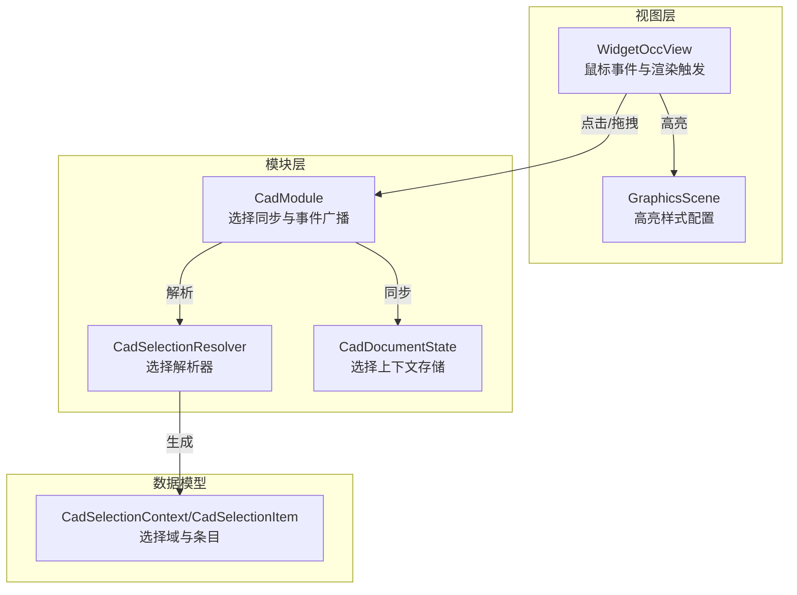
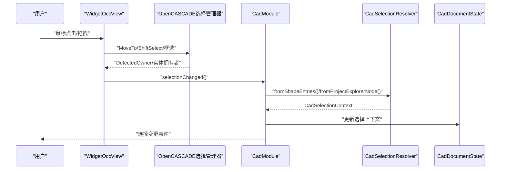
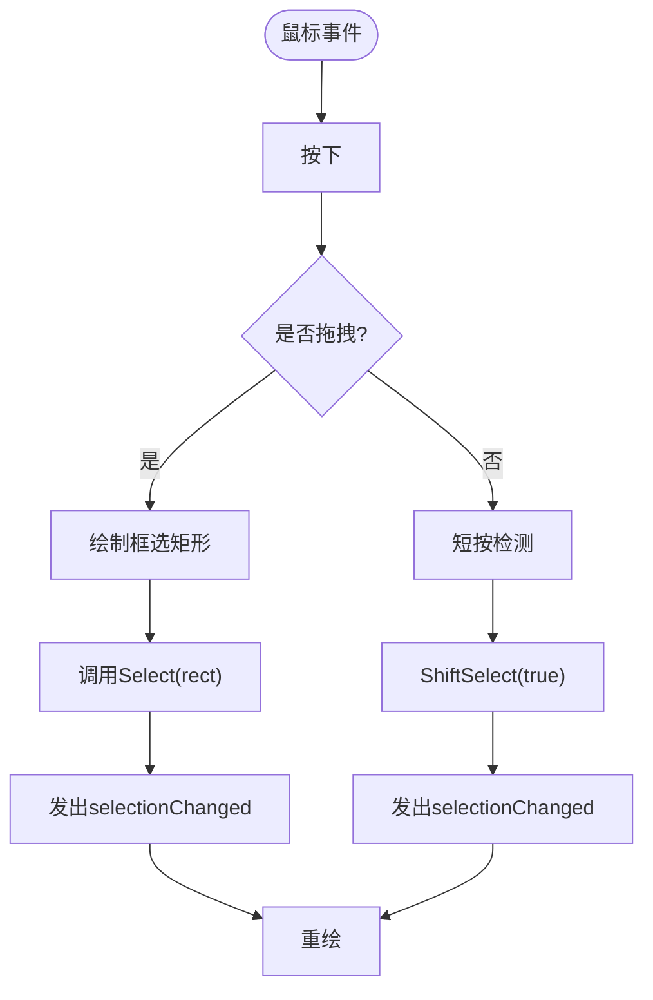
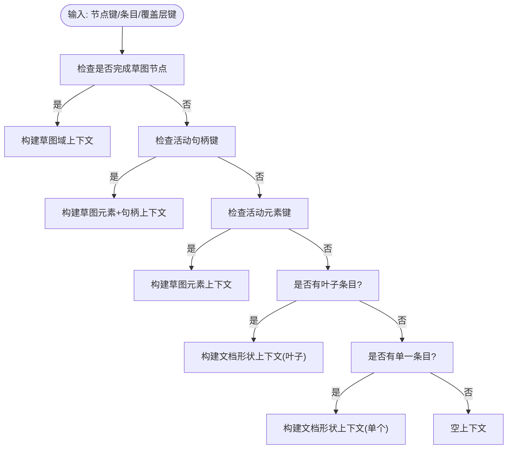
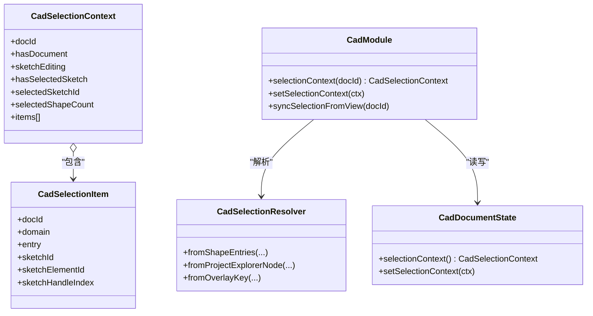
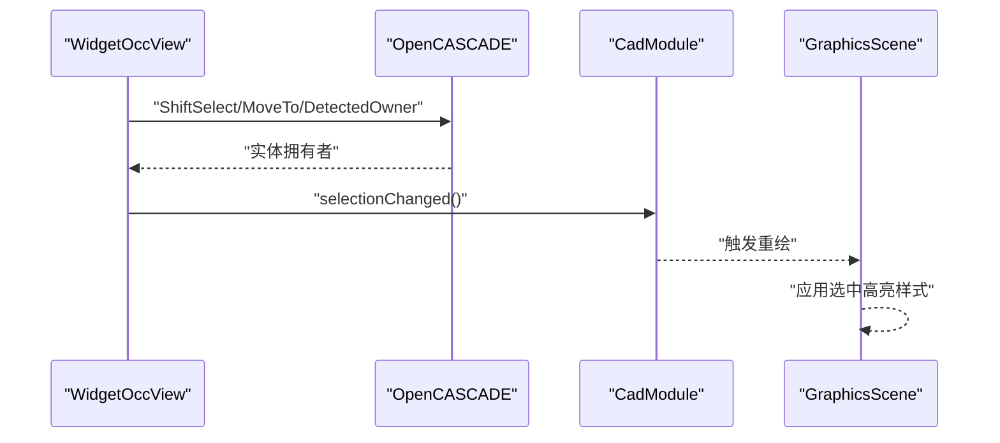
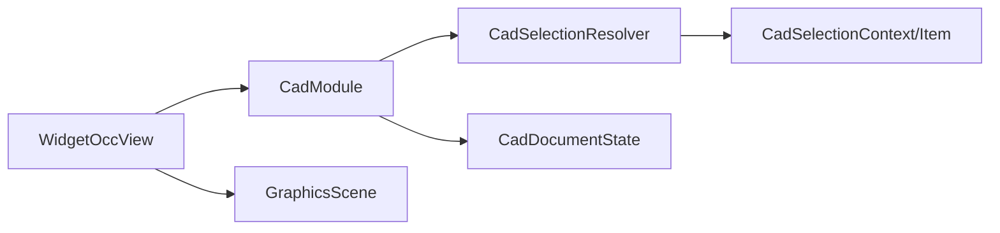

# 选择系统

<cite>
**本文引用的文件**
- [cad_selection_resolver.cpp](file://src/modules/cad/selection/cad_selection_resolver.cpp)
- [cad_selection_resolver.h](file://src/modules/cad/selection/cad_selection_resolver.h)
- [cad_selection.h](file://src/modules/cad/selection/cad_selection.h)
- [widget_occ_view.cpp](file://src/view/widget_occ_view.cpp)
- [widget_occ_view.h](file://src/view/widget_occ_view.h)
- [graphics_scene.cpp](file://src/view/graphics_scene.cpp)
- [graphics_scene.h](file://src/view/graphics_scene.h)
- [cad_module.cpp](file://src/modules/cad/cad_module.cpp)
- [cad_document_state.h](file://src/modules/cad/document/cad_document_state.h)
</cite>

## 目录
1. [引言](#引言)
2. [项目结构](#项目结构)
3. [核心组件](#核心组件)
4. [架构总览](#架构总览)
5. [详细组件分析](#详细组件分析)
6. [依赖关系分析](#依赖关系分析)
7. [性能考虑](#性能考虑)
8. [故障排除指南](#故障排除指南)
9. [结论](#结论)
10. [附录](#附录)

## 引言
本文件面向LaserCNC的CAD界面选择系统，系统性阐述几何元素的选择机制与实现细节，覆盖点选、框选、多选等交互模式，解析选择解析器的命中测试、层次遍历与优先级判定算法，说明选择状态管理（当前选择、历史选择、选择过滤器），并给出扩展接口与自定义选择行为的方法。文档同时提供可视化图示与代码片段路径，帮助开发者快速理解并扩展选择系统。

## 项目结构
选择系统主要分布在以下模块与视图层：
- CAD选择解析与上下文：位于模块层的selection目录，负责从不同来源（图形实体、项目树节点、草图覆盖层）生成统一的选择上下文。
- 视图交互与渲染：位于view目录，负责鼠标事件捕获、框选、高亮样式配置与渲染刷新。
- 模块集成：位于CAD模块层，负责将视图层的选择结果同步到文档状态，并广播选择变更事件。

**图表来源**
- [widget_occ_view.cpp:618-863](file://src/view/widget_occ_view.cpp#L618-L863)
- [graphics_scene.cpp:77-102](file://src/view/graphics_scene.cpp#L77-L102)
- [cad_module.cpp:958-1038](file://src/modules/cad/cad_module.cpp#L958-L1038)
- [cad_selection_resolver.cpp:48-166](file://src/modules/cad/selection/cad_selection_resolver.cpp#L48-L166)
- [cad_document_state.h](file://src/modules/cad/document/cad_document_state.h)

**章节来源**
- [widget_occ_view.cpp:618-863](file://src/view/widget_occ_view.cpp#L618-L863)
- [graphics_scene.cpp:77-102](file://src/view/graphics_scene.cpp#L77-L102)
- [cad_module.cpp:958-1038](file://src/modules/cad/cad_module.cpp#L958-L1038)
- [cad_selection_resolver.cpp:48-166](file://src/modules/cad/selection/cad_selection_resolver.cpp#L48-L166)

## 核心组件
- 选择解析器（CadSelectionResolver）
  - 负责从多种输入源（图形实体条目、项目树节点键、草图覆盖层键）构建统一的选择上下文。
  - 支持草图完成元素、活动元素与活动句柄的识别与映射。
- 视图交互（WidgetOccView）
  - 处理鼠标按下/释放、拖拽、框选等事件，调用OpenCASCADE选择管理器进行命中测试与多选切换。
  - 将选择结果通过信号通知模块层。
- 选择状态管理（CadModule + CadDocumentState）
  - 同步视图层选择到文档状态，维护当前选择上下文，并在需要时清空或重置草图选择。
- 渲染高亮（GraphicsScene）
  - 配置选中与悬停高亮样式，确保视觉反馈一致。

**章节来源**
- [cad_selection_resolver.cpp:48-166](file://src/modules/cad/selection/cad_selection_resolver.cpp#L48-L166)
- [widget_occ_view.cpp:829-863](file://src/view/widget_occ_view.cpp#L829-L863)
- [cad_module.cpp:958-1038](file://src/modules/cad/cad_module.cpp#L958-L1038)
- [graphics_scene.cpp:77-102](file://src/view/graphics_scene.cpp#L77-L102)

## 架构总览
选择系统采用“视图事件驱动 + 解析器统一上下文 + 模块状态同步”的分层设计。视图层负责用户交互与命中测试，解析器负责语义化抽象，模块层负责状态持久化与事件传播，渲染层负责高亮反馈。

**图表来源**
- [widget_occ_view.cpp:618-863](file://src/view/widget_occ_view.cpp#L618-L863)
- [cad_module.cpp:958-1038](file://src/modules/cad/cad_module.cpp#L958-L1038)
- [cad_selection_resolver.cpp:48-166](file://src/modules/cad/selection/cad_selection_resolver.cpp#L48-L166)
- [cad_document_state.h](file://src/modules/cad/document/cad_document_state.h)

## 详细组件分析

### 1) 几何元素选择与交互模式
- 点选（单击）
  - 视图层在鼠标释放且无拖拽时调用选择处理函数，设置ShiftSelect以支持多选切换。
  - 命中测试由OpenCASCADE选择管理器执行，返回DetectedOwner用于进一步判断。
- 框选（拖拽）
  - 鼠标拖拽形成矩形区域，调用Select(rect)完成批量选择，随后触发selectionChanged并重绘。
- 多选（Shift）
  - ShiftSelect启用后，点击未选中元素将其加入，已选中元素移除，空区域点击不改变现有选择。

**图表来源**
- [widget_occ_view.cpp:618-650](file://src/view/widget_occ_view.cpp#L618-L650)
- [widget_occ_view.cpp:829-863](file://src/view/widget_occ_view.cpp#L829-L863)

**章节来源**
- [widget_occ_view.cpp:618-650](file://src/view/widget_occ_view.cpp#L618-L650)
- [widget_occ_view.cpp:829-863](file://src/view/widget_occ_view.cpp#L829-L863)

### 2) 选择解析器：命中测试、层次遍历与优先级判定
- 输入来源
  - 图形实体条目列表：直接映射为文档形状域的多个选择项。
  - 项目树节点键：根据键前缀识别草图域、完成元素域或叶子条目集合。
  - 草图覆盖层键：识别活动元素与活动句柄，映射为草图元素域。
- 关键算法
  - 键解析：通过固定前缀与分隔符解析出草图ID、元素ID、句柄索引等。
  - 层次判定：优先识别完成草图节点与活动句柄，其次处理完成元素节点，最后回退到叶子条目或单一条目。
  - 上下文组装：填充文档ID、编辑状态、选中草图信息与计数，生成统一的CadSelectionContext。

**图表来源**
- [cad_selection_resolver.cpp:74-166](file://src/modules/cad/selection/cad_selection_resolver.cpp#L74-L166)

**章节来源**
- [cad_selection_resolver.cpp:48-166](file://src/modules/cad/selection/cad_selection_resolver.cpp#L48-L166)

### 3) 选择状态管理：当前选择、历史选择与过滤器
- 当前选择
  - 由模块层维护的CadSelectionContext表示，包含文档ID、编辑状态、选中草图ID及条目列表。
- 历史选择
  - 通过模块层的selectionChanged事件广播，UI与工具可订阅以记录历史。
- 选择过滤器
  - 可在解析器阶段对条目进行过滤（如仅允许特定域或类型），或在模块层对上下文进行二次筛选后再应用。

**图表来源**
- [cad_selection.h](file://src/modules/cad/selection/cad_selection.h)
- [cad_selection_resolver.h](file://src/modules/cad/selection/cad_selection_resolver.h)
- [cad_document_state.h](file://src/modules/cad/document/cad_document_state.h)
- [cad_module.cpp:958-1038](file://src/modules/cad/cad_module.cpp#L958-L1038)

**章节来源**
- [cad_module.cpp:958-1038](file://src/modules/cad/cad_module.cpp#L958-L1038)
- [cad_document_state.h](file://src/modules/cad/document/cad_document_state.h)

### 4) 扩展接口与自定义选择行为
- 新增选择域
  - 在CadSelectionDomain枚举中添加新域，并在解析器中增加对应键解析分支。
- 自定义命中测试
  - 在视图层扩展命中测试逻辑（如自定义覆盖层键），并在解析器中映射到新域。
- 选择过滤器
  - 在模块层对CadSelectionContext.items进行过滤，或在解析器阶段直接丢弃不符合条件的条目。
- 事件扩展
  - 订阅selectionChanged事件，实现自定义行为（如自动高亮、联动工具面板）。

**章节来源**
- [cad_selection_resolver.cpp:74-166](file://src/modules/cad/selection/cad_selection_resolver.cpp#L74-L166)
- [cad_module.cpp:958-1038](file://src/modules/cad/cad_module.cpp#L958-L1038)

### 5) UI交互中的智能选择与高亮显示
- 智能选择
  - 结合ShiftSelect实现多选切换，结合框选实现批量选择；在草图覆盖层命中时优先处理句柄与元素选择。
- 高亮显示
  - GraphicsScene配置选中高亮颜色与线宽，确保着色与线框模式下的一致视觉反馈；悬停高亮使用不同颜色避免混淆。

**图表来源**
- [widget_occ_view.cpp:829-863](file://src/view/widget_occ_view.cpp#L829-L863)
- [graphics_scene.cpp:77-102](file://src/view/graphics_scene.cpp#L77-L102)
- [cad_module.cpp:958-969](file://src/modules/cad/cad_module.cpp#L958-L969)

**章节来源**
- [widget_occ_view.cpp:829-863](file://src/view/widget_occ_view.cpp#L829-L863)
- [graphics_scene.cpp:77-102](file://src/view/graphics_scene.cpp#L77-L102)

## 依赖关系分析
- 视图层依赖模块层提供的选择上下文与事件接口。
- 模块层依赖解析器生成统一上下文，并与文档状态进行读写。
- 解析器依赖键命名约定与域枚举，保证跨来源一致性。
- 渲染层独立于解析与模块，仅消费选择上下文并应用样式。

**图表来源**
- [widget_occ_view.cpp:618-863](file://src/view/widget_occ_view.cpp#L618-L863)
- [cad_module.cpp:958-1038](file://src/modules/cad/cad_module.cpp#L958-L1038)
- [cad_selection_resolver.cpp:48-166](file://src/modules/cad/selection/cad_selection_resolver.cpp#L48-L166)
- [graphics_scene.cpp:77-102](file://src/view/graphics_scene.cpp#L77-L102)

**章节来源**
- [widget_occ_view.cpp:618-863](file://src/view/widget_occ_view.cpp#L618-L863)
- [cad_module.cpp:958-1038](file://src/modules/cad/cad_module.cpp#L958-L1038)
- [cad_selection_resolver.cpp:48-166](file://src/modules/cad/selection/cad_selection_resolver.cpp#L48-L166)

## 性能考虑
- 选择解析器应尽量避免重复解析与字符串操作，可在上层缓存键值与解析结果。
- 框选时建议限制矩形范围与重绘频率，必要时延迟重绘。
- 高亮样式配置应复用对象而非频繁创建，减少渲染开销。
- 对大量实体的多选场景，优先使用ShiftSelect的增量更新策略。

## 故障排除指南
- 无法框选
  - 检查鼠标释放事件是否正确触发Select(rect)，确认rubberband绘制与清除逻辑。
- 选择切换异常
  - 确认ShiftSelect调用时机与DetectedOwner是否为空，避免误判。
- 草图元素未选中
  - 检查覆盖层键格式与解析器分支，确保活动句柄与活动元素键前缀匹配。
- 高亮颜色不一致
  - 核对GraphicsScene中的高亮样式配置，确保着色与线框模式均生效。

**章节来源**
- [widget_occ_view.cpp:618-650](file://src/view/widget_occ_view.cpp#L618-L650)
- [widget_occ_view.cpp:829-863](file://src/view/widget_occ_view.cpp#L829-L863)
- [graphics_scene.cpp:77-102](file://src/view/graphics_scene.cpp#L77-L102)
- [cad_selection_resolver.cpp:125-166](file://src/modules/cad/selection/cad_selection_resolver.cpp#L125-L166)

## 结论
LaserCNC的选择系统通过清晰的分层设计实现了从用户交互到状态管理再到渲染反馈的完整闭环。解析器统一了来自不同来源的选择输入，模块层负责状态同步与事件广播，视图层提供直观的交互与高亮体验。该架构既满足当前需求，也为扩展新域、自定义规则与优化性能提供了良好基础。

## 附录
- 代码片段路径参考
  - [点选与框选处理:618-650](file://src/view/widget_occ_view.cpp#L618-L650)
  - [ShiftSelect与DetectedOwner:829-863](file://src/view/widget_occ_view.cpp#L829-L863)
  - [选择解析器入口:48-166](file://src/modules/cad/selection/cad_selection_resolver.cpp#L48-L166)
  - [模块层选择同步:958-1038](file://src/modules/cad/cad_module.cpp#L958-L1038)
  - [高亮样式配置:77-102](file://src/view/graphics_scene.cpp#L77-L102)