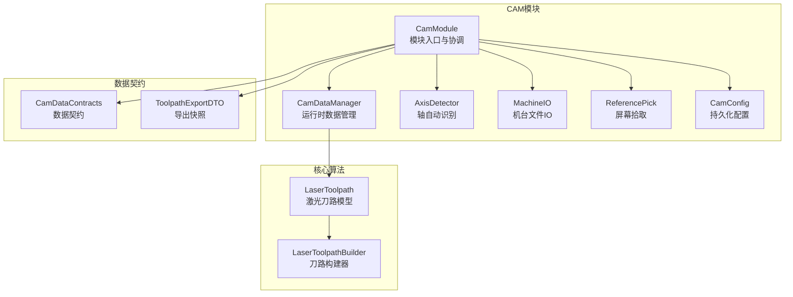
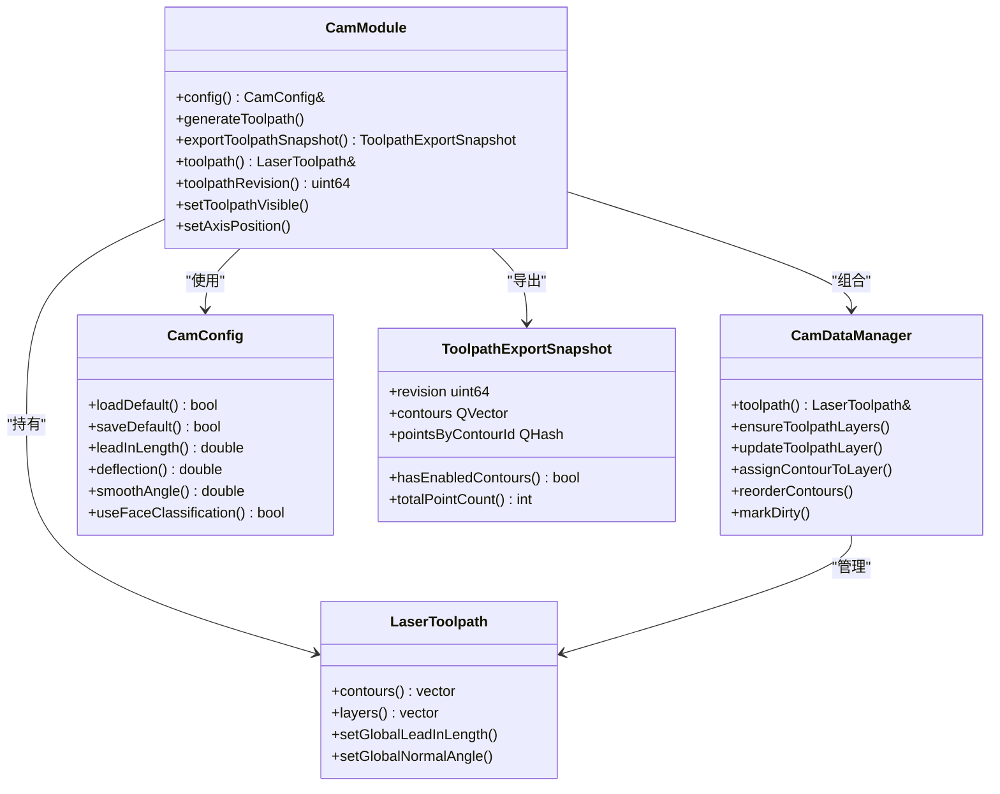
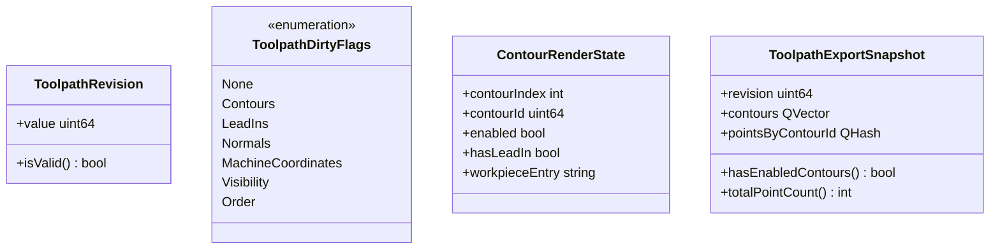
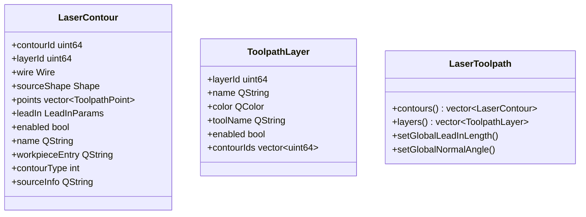
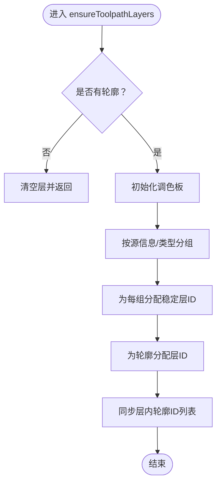
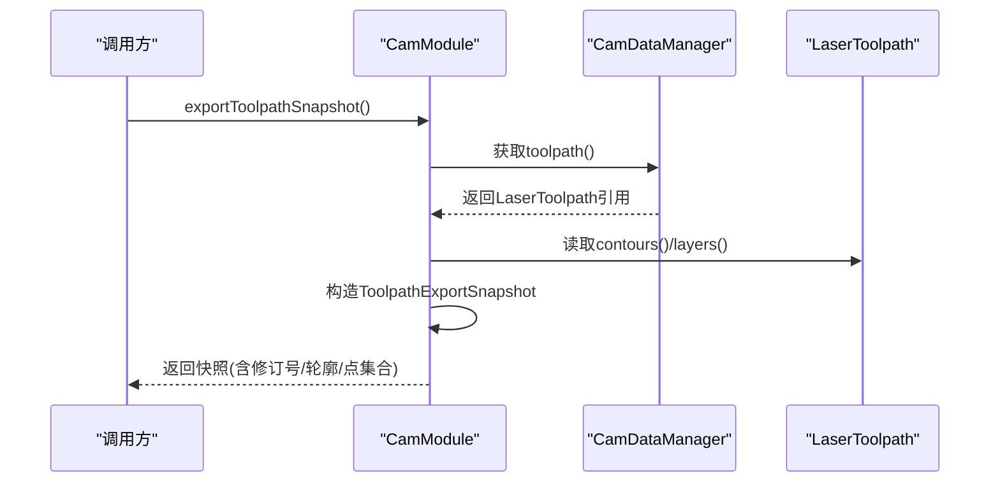
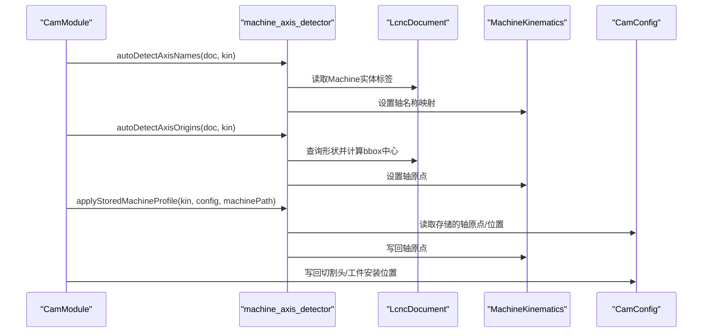
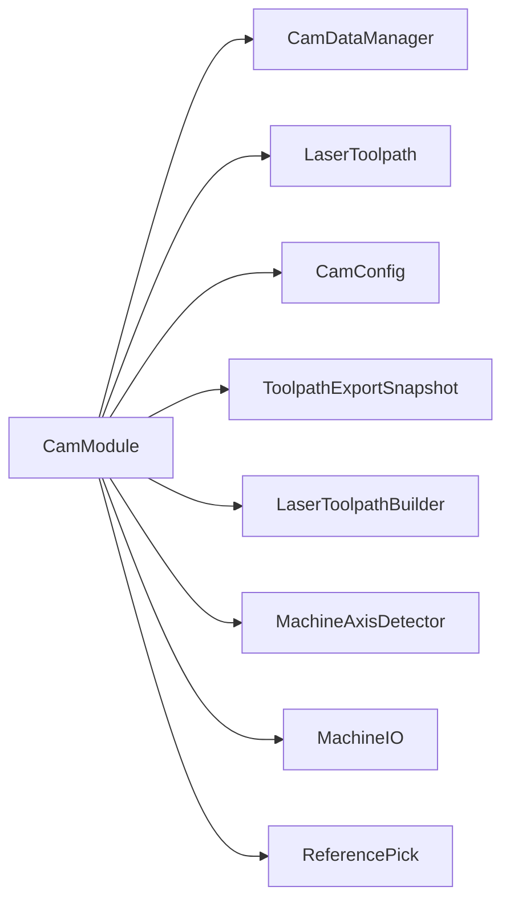

# CAM数据管理

<cite>
**本文档引用的文件**
- [cam_module.h](file://src/modules/cam/cam_module.h)
- [cam_module.cpp](file://src/modules/cam/cam_module.cpp)
- [cam_data_manager.h](file://src/modules/cam/services/cam_data_manager.h)
- [cam_data_manager.cpp](file://src/modules/cam/services/cam_data_manager.cpp)
- [laser_toolpath.h](file://src/core/algorithms/cam/laser_toolpath.h)
- [cam_data_contracts.h](file://src/modules/cam/contracts/cam_data_contracts.h)
- [toolpath_export_dto.h](file://src/modules/cam/contracts/toolpath_export_dto.h)
- [cam_config.h](file://src/modules/cam/settings/cam_config.h)
- [machine_axis_detector.h](file://src/modules/cam/services/machine_axis_detector.h)
- [machine_axis_detector.cpp](file://src/modules/cam/services/machine_axis_detector.cpp)
- [machine_io.h](file://src/modules/cam/services/machine_io.h)
- [reference_pick.h](file://src/modules/cam/services/reference_pick.h)
- [widget_toolpath_panel.h](file://src/modules/cam/ui/widget_toolpath_panel.h)
- [widget_machine_panel.h](file://src/modules/cam/ui/widget_machine_panel.h)
</cite>

## 目录
1. [简介](#简介)
2. [项目结构](#项目结构)
3. [核心组件](#核心组件)
4. [架构总览](#架构总览)
5. [详细组件分析](#详细组件分析)
6. [依赖关系分析](#依赖关系分析)
7. [性能考虑](#性能考虑)
8. [故障排除指南](#故障排除指南)
9. [结论](#结论)
10. [附录](#附录)

## 简介
本文件面向CAM模块数据管理系统，系统性阐述CAM数据管理器的架构设计与核心功能，涵盖数据存储、缓存机制、版本控制与数据同步等关键组件。文档解释CAM数据契约的设计理念与数据模型定义，确保数据一致性与完整性；覆盖从数据输入、处理到输出的完整生命周期；提供数据结构设计、API接口定义与性能优化策略；并给出最佳实践与故障排除指南，帮助开发者高效管理CAM系统中的各类数据。

## 项目结构
CAM模块位于src/modules/cam目录下，采用按功能域划分的层次化组织方式：
- services：运行时数据管理与纯算法服务（如数据管理器、轴检测、IO、拾取）
- contracts：数据契约与导出DTO
- settings：持久化配置（cam.toml）
- ui：右侧面板与交互控件
- 算法与数据模型：位于core/algorithms/cam，提供激光刀路建模与采样

**图表来源**
- [cam_module.h:1-422](file://src/modules/cam/cam_module.h#L1-L422)
- [cam_data_manager.h:1-59](file://src/modules/cam/services/cam_data_manager.h#L1-L59)
- [laser_toolpath.h:1-208](file://src/core/algorithms/cam/laser_toolpath.h#L1-L208)
- [cam_data_contracts.h:1-42](file://src/modules/cam/contracts/cam_data_contracts.h#L1-L42)
- [toolpath_export_dto.h:1-66](file://src/modules/cam/contracts/toolpath_export_dto.h#L1-L66)
- [cam_config.h:1-157](file://src/modules/cam/settings/cam_config.h#L1-L157)
- [machine_axis_detector.h:1-46](file://src/modules/cam/services/machine_axis_detector.h#L1-L46)
- [machine_io.h:1-35](file://src/modules/cam/services/machine_io.h#L1-L35)
- [reference_pick.h:1-37](file://src/modules/cam/services/reference_pick.h#L1-L37)

**章节来源**
- [cam_module.h:1-422](file://src/modules/cam/cam_module.h#L1-L422)
- [cam_module.cpp:1-800](file://src/modules/cam/cam_module.cpp#L1-L800)

## 核心组件
- CamDataManager：项目级CAM运行时数据所有者，管理密集/稀疏数据（采样点、引刀线、机器坐标、参数），镜像稀疏OCC几何到CAM文档，避免OCAF膨胀。
- LaserToolpath/LaserContour/ToolpathLayer：激光刀路数据模型，包含轮廓、采样点、引刀参数、层管理与全局参数。
- CamModule：模块入口，协调机器、工件、刀路与视图，暴露统一API。
- CamConfig：cam.toml持久化配置，管理机台模型路径、预设、刀路参数与机台配置档案。
- Contracts/DTO：ToolpathRevision、ToolpathDirtyFlags、ToolpathExportSnapshot等契约，确保跨模块数据一致性与导出稳定性。

**章节来源**
- [cam_data_manager.h:19-59](file://src/modules/cam/services/cam_data_manager.h#L19-L59)
- [laser_toolpath.h:61-121](file://src/core/algorithms/cam/laser_toolpath.h#L61-L121)
- [cam_module.h:64-422](file://src/modules/cam/cam_module.h#L64-L422)
- [cam_config.h:29-157](file://src/modules/cam/settings/cam_config.h#L29-L157)
- [cam_data_contracts.h:11-42](file://src/modules/cam/contracts/cam_data_contracts.h#L11-L42)
- [toolpath_export_dto.h:55-66](file://src/modules/cam/contracts/toolpath_export_dto.h#L55-L66)

## 架构总览
CAM模块采用微内核集成模式，CamModule作为单例，统一管理机器、工件与刀路数据；CamDataManager专注运行时数据管理；LaserToolpath作为核心数据容器，承载密集数据；Contracts确保跨模块契约稳定；CamConfig提供持久化配置；UI面板通过信号与模块交互。

**图表来源**
- [cam_module.h:64-422](file://src/modules/cam/cam_module.h#L64-L422)
- [cam_data_manager.h:19-59](file://src/modules/cam/services/cam_data_manager.h#L19-L59)
- [laser_toolpath.h:91-121](file://src/core/algorithms/cam/laser_toolpath.h#L91-L121)
- [cam_config.h:29-157](file://src/modules/cam/settings/cam_config.h#L29-L157)
- [toolpath_export_dto.h:55-66](file://src/modules/cam/contracts/toolpath_export_dto.h#L55-L66)

## 详细组件分析

### 数据契约与版本控制
- ToolpathRevision：版本号字段，isValid()判断有效性，用于导出快照版本跟踪。
- ToolpathDirtyFlags：脏标记位掩码，区分轮廓、引刀线、法向、机器坐标、可见性、顺序等变化，便于增量刷新与同步。
- ContourRenderState：渲染状态，包含轮廓索引、稳定ID、启用状态、引刀存在性与工件入口信息。
- ToolpathExportSnapshot：不可变刀路快照，包含修订号、轮廓元数据、按轮廓ID分组的采样点集合、描述信息；提供启用轮廓检查与总点数统计。

**图表来源**
- [cam_data_contracts.h:11-42](file://src/modules/cam/contracts/cam_data_contracts.h#L11-L42)
- [toolpath_export_dto.h:14-66](file://src/modules/cam/contracts/toolpath_export_dto.h#L14-L66)

**章节来源**
- [cam_data_contracts.h:11-42](file://src/modules/cam/contracts/cam_data_contracts.h#L11-L42)
- [toolpath_export_dto.h:55-66](file://src/modules/cam/contracts/toolpath_export_dto.h#L55-L66)

### 数据模型与存储
- LaserContour：包含稳定轮廓ID、层ID、原始拓扑Wire、源形状、采样点数组、引刀参数、启用状态、名称、工件入口、面分类元数据（类型与源信息）。
- ToolpathLayer：包含稳定层ID、名称、颜色、刀具名称、启用状态、轮廓ID列表。
- LaserToolpath：管理轮廓数组与层数组，提供全局引刀长度与法向角度参数设置。

**图表来源**
- [laser_toolpath.h:61-121](file://src/core/algorithms/cam/laser_toolpath.h#L61-L121)

**章节来源**
- [laser_toolpath.h:61-121](file://src/core/algorithms/cam/laser_toolpath.h#L61-L121)

### 数据管理器（CamDataManager）
职责与能力：
- 提供对LaserToolpath的访问与清空、轮廓ID映射、层管理、轮廓重排、脏标记维护。
- 自动生成稳定轮廓ID与层ID，确保跨操作保持一致性。
- 自动分配与同步层内轮廓ID列表，保证层-轮廓关联正确。
- 更新层属性（名称、颜色、刀具）、启用状态传播至对应轮廓。
- 重排轮廓（基于索引或ID序列），同步层内ID列表并标记脏状态。

**图表来源**
- [cam_data_manager.cpp:47-98](file://src/modules/cam/services/cam_data_manager.cpp#L47-L98)

**章节来源**
- [cam_data_manager.h:19-59](file://src/modules/cam/services/cam_data_manager.h#L19-L59)
- [cam_data_manager.cpp:9-241](file://src/modules/cam/services/cam_data_manager.cpp#L9-L241)

### 导出快照与数据同步
- CamModule.exportToolpathSnapshot()：导出不可变快照，包含修订号、轮廓元数据与按轮廓ID分组的采样点，供Process运行时消费。
- CamModule.toolpathRevision()：提供当前刀路修订号，配合ToolpathRevision进行版本控制。
- CamModule.refreshMachineTransforms(dirtyAxes)：局部刷新机台变换链，避免全量重绘，提升性能。

**图表来源**
- [cam_module.h:236-236](file://src/modules/cam/cam_module.h#L236-L236)
- [cam_data_manager.h:22-23](file://src/modules/cam/services/cam_data_manager.h#L22-L23)
- [toolpath_export_dto.h:55-66](file://src/modules/cam/contracts/toolpath_export_dto.h#L55-L66)

**章节来源**
- [cam_module.h:227-286](file://src/modules/cam/cam_module.h#L227-L286)
- [cam_module.cpp:140-165](file://src/modules/cam/cam_module.cpp#L140-L165)

### 机台轴自动识别与配置回填
- machine_axis_detector：提供轴名称自动检测、轴原点自动检测、已存配置回填（轴原点、切割头模型/物理位置、工件安装位置）。
- CamModule在加载机台、自动检测轴时调用上述算法，写回MachineKinematics与CamConfig，不触碰GUI。

**图表来源**
- [machine_axis_detector.h:21-44](file://src/modules/cam/services/machine_axis_detector.h#L21-L44)
- [machine_axis_detector.cpp:16-102](file://src/modules/cam/services/machine_axis_detector.cpp#L16-L102)
- [cam_module.cpp:438-527](file://src/modules/cam/cam_module.cpp#L438-L527)

**章节来源**
- [machine_axis_detector.h:14-46](file://src/modules/cam/services/machine_axis_detector.h#L14-L46)
- [machine_axis_detector.cpp:16-102](file://src/modules/cam/services/machine_axis_detector.cpp#L16-L102)
- [cam_module.cpp:438-527](file://src/modules/cam/cam_module.cpp#L438-L527)

### 机台文件IO与拾取工具
- machine_io：STEP/STL/BREP读写与XCAF装配，不触发任务、不emit信号、不写模块状态。
- reference_pick：屏幕拾取参考面中心与引刀命中点，仅读取不修改外部状态。

**章节来源**
- [machine_io.h:13-35](file://src/modules/cam/services/machine_io.h#L13-L35)
- [reference_pick.h:12-37](file://src/modules/cam/services/reference_pick.h#L12-L37)

### UI面板与交互
- WidgetToolpathPanel：刀路参数面板，绑定LaserToolpath，提供引刀长度、法向角度、离散化间隔、面分类参数与坐标表展示。
- WidgetMachinePanel：机台配置面板，提供预设、模型路径、轴原点编辑、校准与工件安装位置设置。

**章节来源**
- [widget_toolpath_panel.h:22-91](file://src/modules/cam/ui/widget_toolpath_panel.h#L22-L91)
- [widget_machine_panel.h:28-125](file://src/modules/cam/ui/widget_machine_panel.h#L28-L125)

## 依赖关系分析
- CamModule依赖CamDataManager管理运行时数据；依赖LaserToolpathBuilder进行刀路提取与采样；依赖MachineKinematics进行逆解与机器坐标计算。
- CamModule通过CamConfig读写cam.toml；通过ToolpathExportSnapshot向Process模块提供不可变快照。
- Services层（AxisDetector、MachineIO、ReferencePick）为纯算法/IO工具，无状态，被CamModule在特定流程中调用。

**图表来源**
- [cam_module.h:64-422](file://src/modules/cam/cam_module.h#L64-L422)
- [cam_data_manager.h:19-59](file://src/modules/cam/services/cam_data_manager.h#L19-L59)
- [laser_toolpath.h:141-208](file://src/core/algorithms/cam/laser_toolpath.h#L141-L208)
- [cam_config.h:29-157](file://src/modules/cam/settings/cam_config.h#L29-L157)
- [toolpath_export_dto.h:55-66](file://src/modules/cam/contracts/toolpath_export_dto.h#L55-L66)
- [machine_axis_detector.h:21-44](file://src/modules/cam/services/machine_axis_detector.h#L21-L44)
- [machine_io.h:20-32](file://src/modules/cam/services/machine_io.h#L20-L32)
- [reference_pick.h:20-35](file://src/modules/cam/services/reference_pick.h#L20-L35)

**章节来源**
- [cam_module.cpp:1-800](file://src/modules/cam/cam_module.cpp#L1-L800)

## 性能考虑
- 局部刷新：CamModule.refreshMachineTransforms(dirtyAxes)合并连续姿态变化，16ms定时器限制刷新频率，避免全量重绘。
- 增量脏标记：ToolpathDirtyFlags区分不同维度的脏状态，便于精确更新渲染与导出。
- 数据结构优化：LaserToolpath使用vector存储轮廓与层，支持就地重排与快速同步层内ID列表。
- 导出快照：ToolpathExportSnapshot为不可变结构，避免并发修改带来的复杂性与拷贝成本。

**章节来源**
- [cam_module.cpp:302-323](file://src/modules/cam/cam_module.cpp#L302-L323)
- [cam_data_contracts.h:17-32](file://src/modules/cam/contracts/cam_data_contracts.h#L17-L32)
- [laser_toolpath.h:91-121](file://src/core/algorithms/cam/laser_toolpath.h#L91-L121)
- [toolpath_export_dto.h:55-66](file://src/modules/cam/contracts/toolpath_export_dto.h#L55-L66)

## 故障排除指南
- 刀路生成失败：检查CamConfig中的引刀长度、法向角度、离散化步长与面分类开关；确认LaserToolpathBuilder参数与工件形状。
- 层管理异常：调用CamDataManager.ensureToolpathLayers()自动分配层ID；使用updateToolpathLayer()与assignContourToLayer()修复层属性与归属。
- 机台轴配置错误：使用machine_axis_detector自动检测轴名称与原点；必要时回填CamConfig中的存储档案。
- 导出快照为空：确认CamModule.hasToolpath()为真；检查toolpathRevision()是否递增；验证ToolpathExportSnapshot构造逻辑。
- UI交互问题：WidgetToolpathPanel与WidgetMachinePanel通过信号与模块交互，检查信号连接与参数同步。

**章节来源**
- [cam_module.cpp:438-527](file://src/modules/cam/cam_module.cpp#L438-L527)
- [cam_data_manager.cpp:47-98](file://src/modules/cam/services/cam_data_manager.cpp#L47-L98)
- [widget_toolpath_panel.h:48-90](file://src/modules/cam/ui/widget_toolpath_panel.h#L48-L90)
- [widget_machine_panel.h:46-125](file://src/modules/cam/ui/widget_machine_panel.h#L46-L125)

## 结论
CAM数据管理系统通过CamDataManager集中管理运行时密集数据，结合LaserToolpath数据模型与Contracts契约，实现了从数据输入、处理到输出的完整生命周期管理。CamModule作为协调者，提供稳定的API与导出快照，支持局部刷新与增量更新，确保系统在复杂加工场景下的性能与一致性。CamConfig提供持久化配置，machine_axis_detector与machine_io保障机台配置与文件IO的可靠性。建议在实际开发中遵循数据契约、使用稳定ID、合理利用脏标记与局部刷新策略，以获得最佳的系统表现。

## 附录
- 数据契约与API参考：参见cam_data_contracts.h、toolpath_export_dto.h、cam_module.h中的接口定义。
- 配置文件：cam.toml由CamConfig管理，支持机台模型路径、预设、刀路参数与机台档案。
- UI交互：WidgetToolpathPanel与WidgetMachinePanel提供参数设置与操作入口。

**章节来源**
- [cam_data_contracts.h:11-42](file://src/modules/cam/contracts/cam_data_contracts.h#L11-L42)
- [toolpath_export_dto.h:55-66](file://src/modules/cam/contracts/toolpath_export_dto.h#L55-L66)
- [cam_module.h:227-286](file://src/modules/cam/cam_module.h#L227-L286)
- [cam_config.h:29-157](file://src/modules/cam/settings/cam_config.h#L29-L157)
- [widget_toolpath_panel.h:22-91](file://src/modules/cam/ui/widget_toolpath_panel.h#L22-L91)
- [widget_machine_panel.h:28-125](file://src/modules/cam/ui/widget_machine_panel.h#L28-L125)