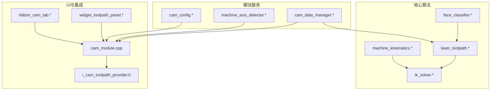
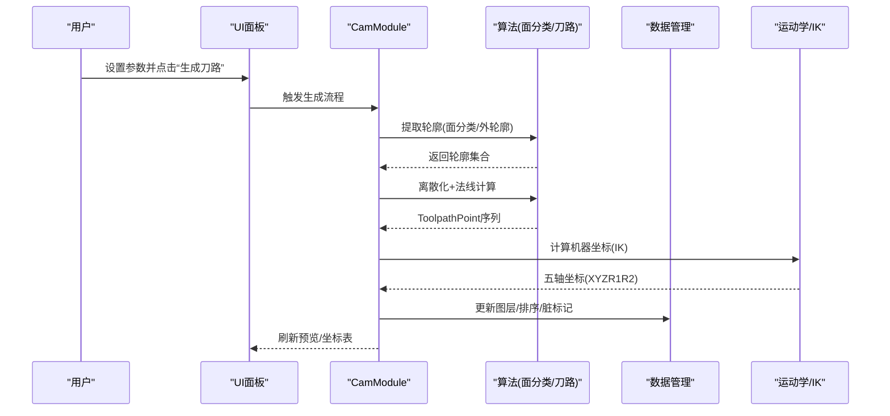
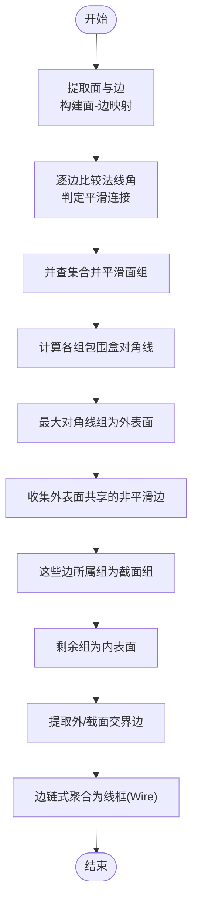
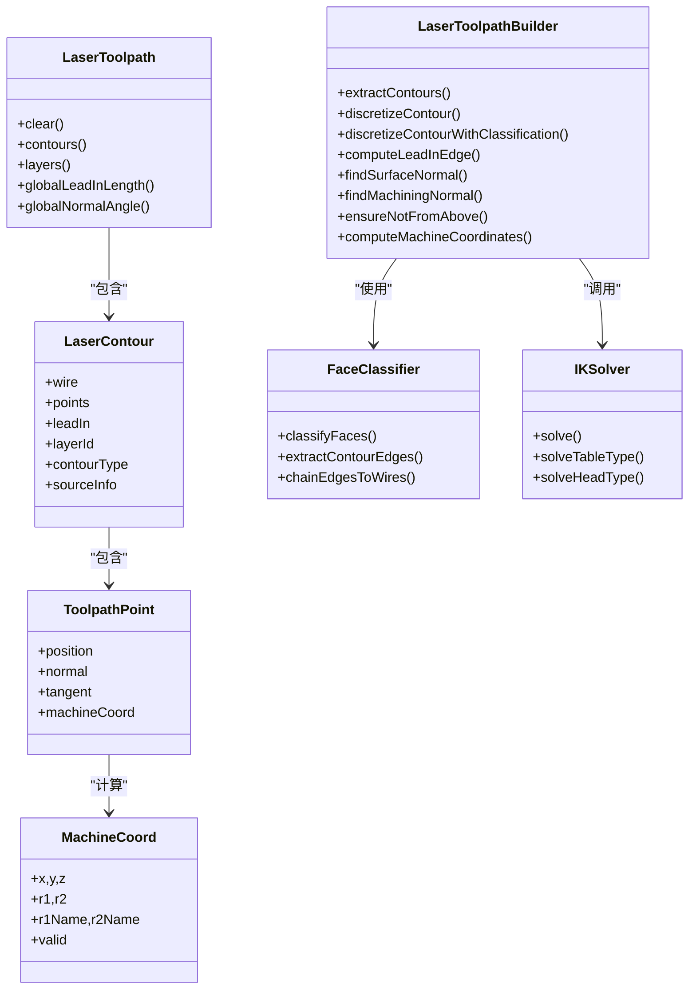
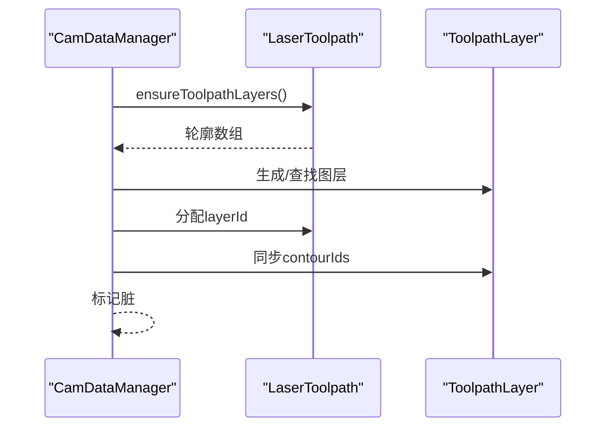
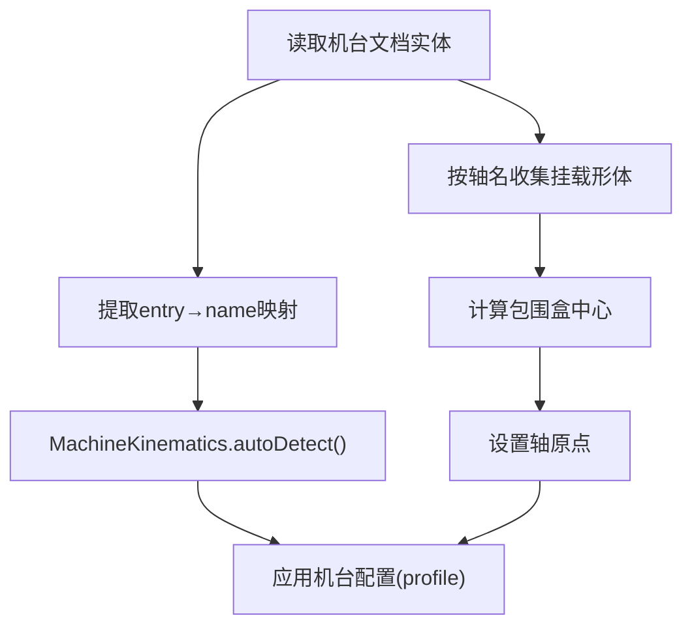
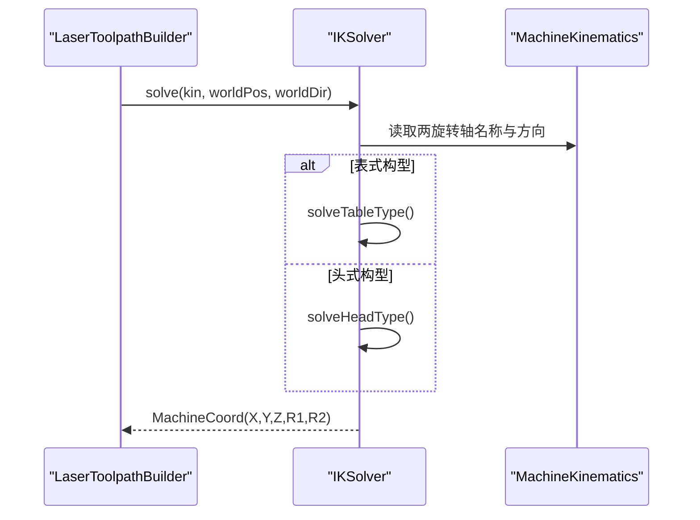
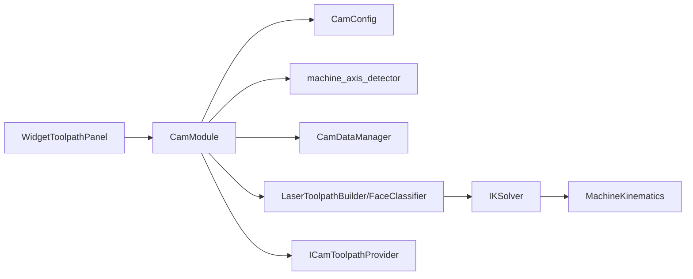
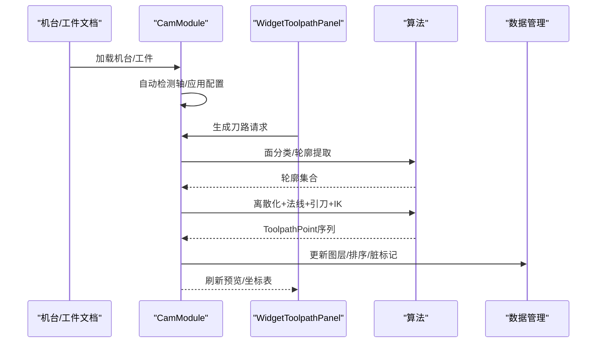

# CAM模块

<cite>
**本文档引用的文件**
- [face_classifier.cpp](file://src/core/algorithms/cam/face_classifier.cpp)
- [face_classifier.h](file://src/core/algorithms/cam/face_classifier.h)
- [laser_toolpath.cpp](file://src/core/algorithms/cam/laser_toolpath.cpp)
- [laser_toolpath.h](file://src/core/algorithms/cam/laser_toolpath.h)
- [machine_axis_detector.cpp](file://src/modules/cam/services/machine_axis_detector.cpp)
- [machine_axis_detector.h](file://src/modules/cam/services/machine_axis_detector.h)
- [cam_data_manager.cpp](file://src/modules/cam/services/cam_data_manager.cpp)
- [cam_data_manager.h](file://src/modules/cam/services/cam_data_manager.h)
- [cam_config.cpp](file://src/modules/cam/settings/cam_config.cpp)
- [cam_config.h](file://src/modules/cam/settings/cam_config.h)
- [machine_kinematics.h](file://src/core/kinematics/machine_kinematics.h)
- [ik_solver.cpp](file://src/core/kinematics/ik_solver.cpp)
- [widget_toolpath_panel.cpp](file://src/modules/cam/ui/widget_toolpath_panel.cpp)
- [ribbon_cam_tab.cpp](file://src/modules/cam/ui/ribbon_cam_tab.cpp)
- [cam_module.cpp](file://src/modules/cam/cam_module.cpp)
- [i_cam_toolpath_provider.h](file://src/modules/cam/i_cam_toolpath_provider.h)
</cite>

## 目录
1. [简介](#简介)
2. [项目结构](#项目结构)
3. [核心组件](#核心组件)
4. [架构总览](#架构总览)
5. [详细组件分析](#详细组件分析)
6. [依赖关系分析](#依赖关系分析)
7. [性能考虑](#性能考虑)
8. [故障排除指南](#故障排除指南)
9. [结论](#结论)
10. [附录](#附录)

## 简介
本文件为LaserCNC的CAM模块技术文档，聚焦五轴激光加工的刀具路径生成与管理能力。文档系统阐述以下内容：
- 面分类器与轴检测器的算法原理与实现细节
- 激光刀路算法、离散化策略与法线方向控制
- CAM数据管理、图层组织与工具路径优化
- 切削参数设置与后处理器对接机制
- 从几何模型到可执行刀路的完整工作流示例

## 项目结构
CAM模块位于src/modules/cam目录，围绕“几何→路径→坐标→可视化/导出”的流水线组织，核心算法位于src/core/algorithms/cam，服务与配置位于src/modules/cam。

**图表来源**
- [face_classifier.cpp:1-451](file://src/core/algorithms/cam/face_classifier.cpp#L1-L451)
- [laser_toolpath.cpp:1-641](file://src/core/algorithms/cam/laser_toolpath.cpp#L1-L641)
- [ik_solver.cpp:1-402](file://src/core/kinematics/ik_solver.cpp#L1-L402)
- [machine_kinematics.h:1-107](file://src/core/kinematics/machine_kinematics.h#L1-L107)
- [cam_data_manager.cpp:1-241](file://src/modules/cam/services/cam_data_manager.cpp#L1-L241)
- [machine_axis_detector.cpp:1-105](file://src/modules/cam/services/machine_axis_detector.cpp#L1-L105)
- [cam_config.cpp:1-530](file://src/modules/cam/settings/cam_config.cpp#L1-L530)
- [widget_toolpath_panel.cpp:1-326](file://src/modules/cam/ui/widget_toolpath_panel.cpp#L1-L326)
- [ribbon_cam_tab.cpp:1-70](file://src/modules/cam/ui/ribbon_cam_tab.cpp#L1-L70)
- [cam_module.cpp:1-800](file://src/modules/cam/cam_module.cpp#L1-L800)
- [i_cam_toolpath_provider.h:1-21](file://src/modules/cam/i_cam_toolpath_provider.h#L1-L21)

**章节来源**
- [cam_module.cpp:254-323](file://src/modules/cam/cam_module.cpp#L254-L323)

## 核心组件
- 面分类器（FaceClassifier）：基于相邻面法线平滑度进行连通域聚类，识别外表面、截面与内表面，并提取边界轮廓线。
- 激光刀路生成器（LaserToolpathBuilder）：从工件几何提取外轮廓/截面轮廓，离散化为ToolpathPoint序列，计算法线与切线方向，生成引刀线并求解五轴IK。
- 数据管理器（CamDataManager）：维护LaserToolpath及其图层，提供重排、分配、脏标记等管理能力。
- 机台轴检测（machine_axis_detector）：自动识别轴名称与旋转原点，应用已存配置。
- 配置中心（CamConfig）：持久化CAM参数（引刀长度、法线角度、离散间隔、面分类阈值等）。
- 机台运动学（MachineKinematics）：轴定义、形状挂载、变换计算与自动检测。
- 逆解器（IKSolver）：根据表面法线与机台构型求解五轴姿态（X/Y/Z/R1/R2）。

**章节来源**
- [face_classifier.h:1-93](file://src/core/algorithms/cam/face_classifier.h#L1-L93)
- [laser_toolpath.h:1-208](file://src/core/algorithms/cam/laser_toolpath.h#L1-L208)
- [cam_data_manager.h:1-59](file://src/modules/cam/services/cam_data_manager.h#L1-L59)
- [machine_axis_detector.h:1-46](file://src/modules/cam/services/machine_axis_detector.h#L1-L46)
- [cam_config.h:1-157](file://src/modules/cam/settings/cam_config.h#L1-L157)
- [machine_kinematics.h:1-107](file://src/core/kinematics/machine_kinematics.h#L1-L107)
- [ik_solver.cpp:1-402](file://src/core/kinematics/ik_solver.cpp#L1-L402)

## 架构总览
CAM模块采用“算法层-服务层-UI层-集成层”分层设计：
- 算法层：面分类、轮廓提取、离散化、IK求解
- 服务层：数据管理、轴检测、配置持久化
- UI层：参数面板、命令入口、可视化渲染
- 集成层：模块注册、任务调度、文档与项目域联动

**图表来源**
- [cam_module.cpp:438-527](file://src/modules/cam/cam_module.cpp#L438-L527)
- [laser_toolpath.cpp:177-342](file://src/core/algorithms/cam/laser_toolpath.cpp#L177-L342)
- [ik_solver.cpp:15-53](file://src/core/kinematics/ik_solver.cpp#L15-L53)
- [cam_data_manager.cpp:9-241](file://src/modules/cam/services/cam_data_manager.cpp#L9-L241)

**章节来源**
- [cam_module.cpp:221-323](file://src/modules/cam/cam_module.cpp#L221-L323)

## 详细组件分析

### 面分类器（FaceClassifier）
- 功能要点
  - 基于相邻面法线夹角阈值判断“平滑连接”，使用并查集（Union-Find）合并连通面组
  - 以包围盒对角线长度确定“外表面”组
  - 与外表面共享非平滑边界的组识别为“截面”，其余为“内表面”
  - 提取外表面与截面交界处的轮廓边，链式聚合为闭合/开放线框
- 关键数据结构
  - FaceGroup：一组平滑连接的面、包围盒与类型
  - FaceClassification：所有组及外表面索引
- 复杂度
  - 面/边遍历O(F+E)，并查集近似O(F+α(F))，整体线性到准线性

**图表来源**
- [face_classifier.cpp:162-292](file://src/core/algorithms/cam/face_classifier.cpp#L162-L292)
- [face_classifier.cpp:298-345](file://src/core/algorithms/cam/face_classifier.cpp#L298-L345)
- [face_classifier.cpp:351-450](file://src/core/algorithms/cam/face_classifier.cpp#L351-L450)

**章节来源**
- [face_classifier.h:11-93](file://src/core/algorithms/cam/face_classifier.h#L11-L93)
- [face_classifier.cpp:162-292](file://src/core/algorithms/cam/face_classifier.cpp#L162-L292)

### 激光刀路生成器（LaserToolpathBuilder）
- 轮廓提取
  - 传统模式：遍历面的外边界线框，去重后作为轮廓
  - 面分类模式：基于FaceClassifier结果，提取外表面与截面交界边，链式聚合为线框
- 离散化与法线
  - 使用弦长偏差采样（GCPnts_UniformDeflection）生成ToolpathPoint
  - 法线计算：优先使用面分类得到的外表面法线，避免进入内表面区域
  - 引刀方向调整：确保不从正上方接近，必要时投影到XY平面偏移
- 五轴IK
  - 根据机台构型（表式/头式）与两旋转轴分解求解
  - 表式：工作台旋转，使法线对齐-Z；头式：激光头旋转对齐法线反向
  - 将世界坐标转换到机架坐标系，输出X/Y/Z/R1/R2

**图表来源**
- [laser_toolpath.h:22-208](file://src/core/algorithms/cam/laser_toolpath.h#L22-L208)
- [laser_toolpath.cpp:177-641](file://src/core/algorithms/cam/laser_toolpath.cpp#L177-L641)
- [face_classifier.h:68-93](file://src/core/algorithms/cam/face_classifier.h#L68-L93)
- [ik_solver.cpp:15-402](file://src/core/kinematics/ik_solver.cpp#L15-L402)

**章节来源**
- [laser_toolpath.h:123-208](file://src/core/algorithms/cam/laser_toolpath.h#L123-L208)
- [laser_toolpath.cpp:177-641](file://src/core/algorithms/cam/laser_toolpath.cpp#L177-L641)

### CAM数据管理（CamDataManager）
- 职责
  - 维护LaserToolpath（轮廓与图层）、运行期稳定ID、脏标记
  - 自动生成/同步图层，按sourceInfo或类型分组，颜色轮换
  - 支持轮廓重排、分配到指定图层、启用状态批量同步
- 关键流程
  - ensureToolpathLayers：从轮廓元数据生成图层，同步图层内轮廓ID列表
  - reorderContours：保持轮廓ID稳定，更新图层关联

**图表来源**
- [cam_data_manager.cpp:47-98](file://src/modules/cam/services/cam_data_manager.cpp#L47-L98)
- [cam_data_manager.cpp:227-241](file://src/modules/cam/services/cam_data_manager.cpp#L227-L241)

**章节来源**
- [cam_data_manager.h:11-59](file://src/modules/cam/services/cam_data_manager.h#L11-L59)
- [cam_data_manager.cpp:9-241](file://src/modules/cam/services/cam_data_manager.cpp#L9-L241)

### 机台轴检测（machine_axis_detector）
- 自动识别轴名称：从文档中读取实体entry→name映射，交由MachineKinematics自动分配
- 自动识别轴原点：按挂载形体包围盒中心设定旋转原点
- 应用已存配置：从CamConfig读取机台路径下的轴原点、切割头/工件安装位置并写回

**图表来源**
- [machine_axis_detector.cpp:16-72](file://src/modules/cam/services/machine_axis_detector.cpp#L16-L72)
- [machine_axis_detector.h:21-46](file://src/modules/cam/services/machine_axis_detector.h#L21-L46)

**章节来源**
- [machine_axis_detector.h:12-46](file://src/modules/cam/services/machine_axis_detector.h#L12-L46)
- [machine_axis_detector.cpp:16-105](file://src/modules/cam/services/machine_axis_detector.cpp#L16-L105)

### 配置中心（CamConfig）
- 持久化字段
  - 全局：机台模型路径、预设、渲染质量
  - toolpath：引刀长度、法线角度、离散间隔、面分类阈值、是否使用面分类、法线显示、法线抽样步长
  - machineProfile：按机台绝对路径分组，记录轴原点、切割头/工件安装位置、AC角度偏移、物理AC中心
- 迁移策略：首次加载自动从旧JSON迁移到新TOML

**章节来源**
- [cam_config.h:11-157](file://src/modules/cam/settings/cam_config.h#L11-L157)
- [cam_config.cpp:77-190](file://src/modules/cam/settings/cam_config.cpp#L77-L190)

### 机台运动学与IK（MachineKinematics + IKSolver）
- MachineKinematics
  - 轴定义、形状挂载、变换计算、自动检测
- IKSolver
  - 表式（AC/BC工作台）：工作台旋转使法线对-Z；线性轴取旋转后的点
  - 头式（AB/AC激光头）：激光头旋转使-Z对齐法线反向；线性轴固定

**图表来源**
- [ik_solver.cpp:15-53](file://src/core/kinematics/ik_solver.cpp#L15-L53)
- [ik_solver.cpp:90-239](file://src/core/kinematics/ik_solver.cpp#L90-L239)
- [ik_solver.cpp:258-401](file://src/core/kinematics/ik_solver.cpp#L258-L401)

**章节来源**
- [machine_kinematics.h:12-107](file://src/core/kinematics/machine_kinematics.h#L12-L107)
- [ik_solver.cpp:1-402](file://src/core/kinematics/ik_solver.cpp#L1-L402)

### UI与命令（WidgetToolpathPanel + Ribbon）
- WidgetToolpathPanel
  - 参数：引刀长度、法线角度、离散间隔、光滑阈值、提取模式、法线显示与抽样步长
  - 操作：生成刀路、选择引刀位置、重新计算、刀路预览
  - 坐标表：显示选中轮廓的机器坐标
- Ribbon
  - 机台与刀路命令入口，统一注册与布局

**章节来源**
- [widget_toolpath_panel.cpp:15-326](file://src/modules/cam/ui/widget_toolpath_panel.cpp#L15-L326)
- [ribbon_cam_tab.cpp:14-70](file://src/modules/cam/ui/ribbon_cam_tab.cpp#L14-L70)

## 依赖关系分析
- 算法依赖
  - LaserToolpathBuilder依赖FaceClassifier进行面分类与轮廓提取
  - LaserToolpathBuilder依赖IKSolver进行五轴坐标计算
  - IKSolver依赖MachineKinematics提供的轴定义与构型
- 服务依赖
  - CamModule负责加载配置、机台文档、轴检测与变换刷新
  - CamDataManager与CamModule协作维护工具路径与图层
- UI依赖
  - WidgetToolpathPanel与CamModule交互，驱动生成/预览/重算流程

**图表来源**
- [cam_module.cpp:261-323](file://src/modules/cam/cam_module.cpp#L261-L323)
- [cam_data_manager.cpp:1-241](file://src/modules/cam/services/cam_data_manager.cpp#L1-L241)
- [machine_axis_detector.cpp:1-105](file://src/modules/cam/services/machine_axis_detector.cpp#L1-L105)
- [cam_config.cpp:1-530](file://src/modules/cam/settings/cam_config.cpp#L1-L530)
- [laser_toolpath.cpp:177-641](file://src/core/algorithms/cam/laser_toolpath.cpp#L177-L641)
- [ik_solver.cpp:1-402](file://src/core/kinematics/ik_solver.cpp#L1-L402)
- [i_cam_toolpath_provider.h:1-21](file://src/modules/cam/i_cam_toolpath_provider.h#L1-L21)

**章节来源**
- [cam_module.cpp:254-323](file://src/modules/cam/cam_module.cpp#L254-L323)

## 性能考虑
- 面分类
  - 并查集路径压缩与按秩合并，查询/合并近似常数时间
  - 边界条件过滤（退化边、非流形边）减少无效连接
- 离散化
  - 弦长偏差采样密度直接影响点数与IK计算量，建议按精度需求折中
- IK求解
  - 三角函数求解与数值稳定性，注意轴限幅与多解选择
- 可视化
  - 法线抽样步长与渲染质量预设降低实时开销

[本节为通用指导，无需特定文件引用]

## 故障排除指南
- 生成刀路无结果
  - 检查面分类是否成功：smoothAngle阈值过高导致无外表面/截面交界
  - 回退到“全部外轮廓”模式验证几何有效性
- 引刀方向异常
  - 确认法线角度偏移与ensureNotFromAbove逻辑
- IK失败
  - 检查机台构型与两旋转轴定义，确认轴限幅与姿态可达性
- 图层错乱
  - 手动重排或清空后重新生成图层，检查sourceInfo一致性

**章节来源**
- [laser_toolpath.cpp:529-621](file://src/core/algorithms/cam/laser_toolpath.cpp#L529-L621)
- [cam_data_manager.cpp:173-215](file://src/modules/cam/services/cam_data_manager.cpp#L173-L215)

## 结论
CAM模块通过“面分类+轮廓提取+离散化+IK求解”的流水线，实现了从复杂几何到五轴激光加工刀路的自动化生成。配合数据管理与配置持久化，提供了稳定的图层组织与参数控制能力。建议在实际生产中结合几何特征与机台构型，合理设置离散化与面分类阈值，以获得更优的路径质量与执行效率。

## 附录

### CAM工作流完整示例（从几何到可执行刀路）
- 步骤1：加载机台模型并自动检测轴
  - 读取机台文档实体，自动命名与轴原点，应用已存配置
- 步骤2：生成刀路
  - 选择提取模式（面分类/外轮廓），设置离散间隔与光滑阈值
  - 生成轮廓→离散化→法线计算→引刀线→IK求解
- 步骤3：组织与优化
  - 自动生成图层并分配轮廓，按需重排与批量启用
- 步骤4：预览与导出
  - 刀路预览与坐标表查看，准备后处理器导出

**图表来源**
- [cam_module.cpp:438-527](file://src/modules/cam/cam_module.cpp#L438-L527)
- [widget_toolpath_panel.cpp:108-170](file://src/modules/cam/ui/widget_toolpath_panel.cpp#L108-L170)
- [laser_toolpath.cpp:177-641](file://src/core/algorithms/cam/laser_toolpath.cpp#L177-L641)
- [cam_data_manager.cpp:47-98](file://src/modules/cam/services/cam_data_manager.cpp#L47-L98)