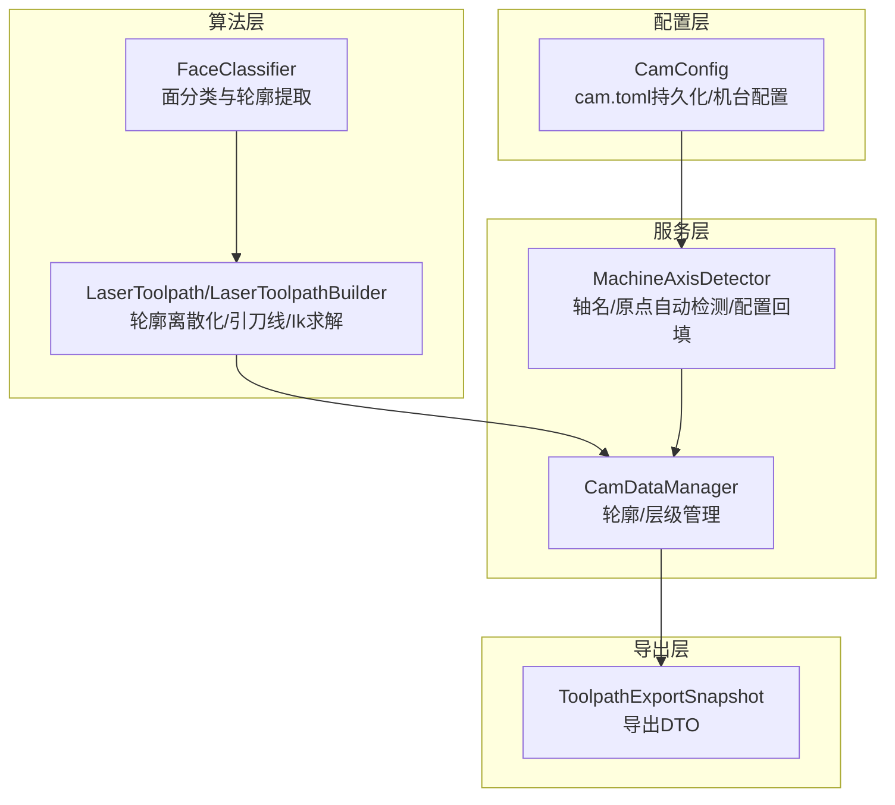
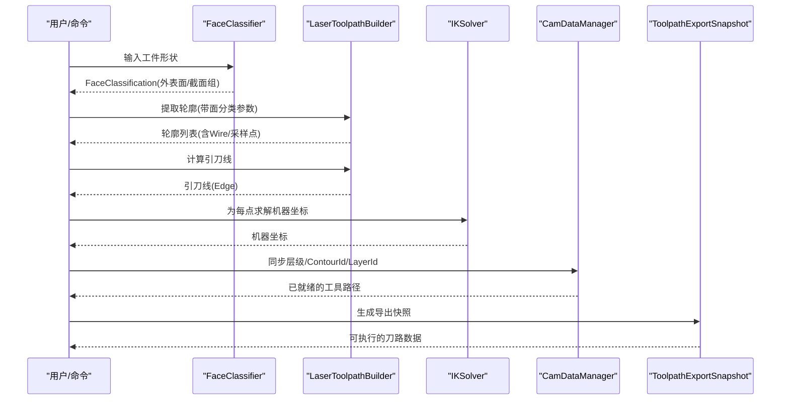
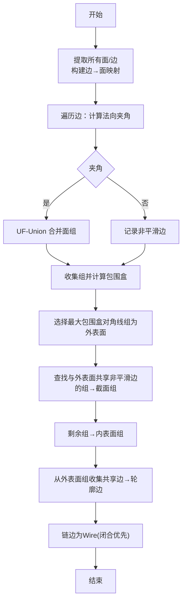
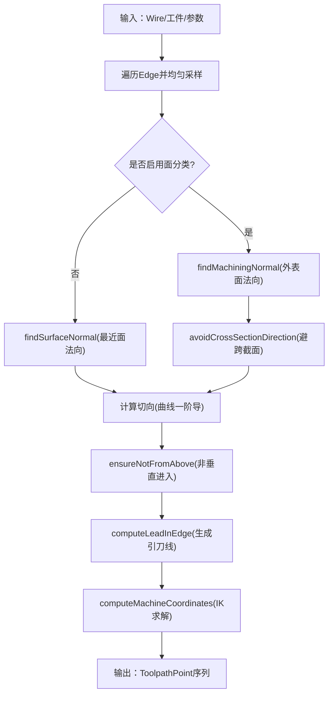
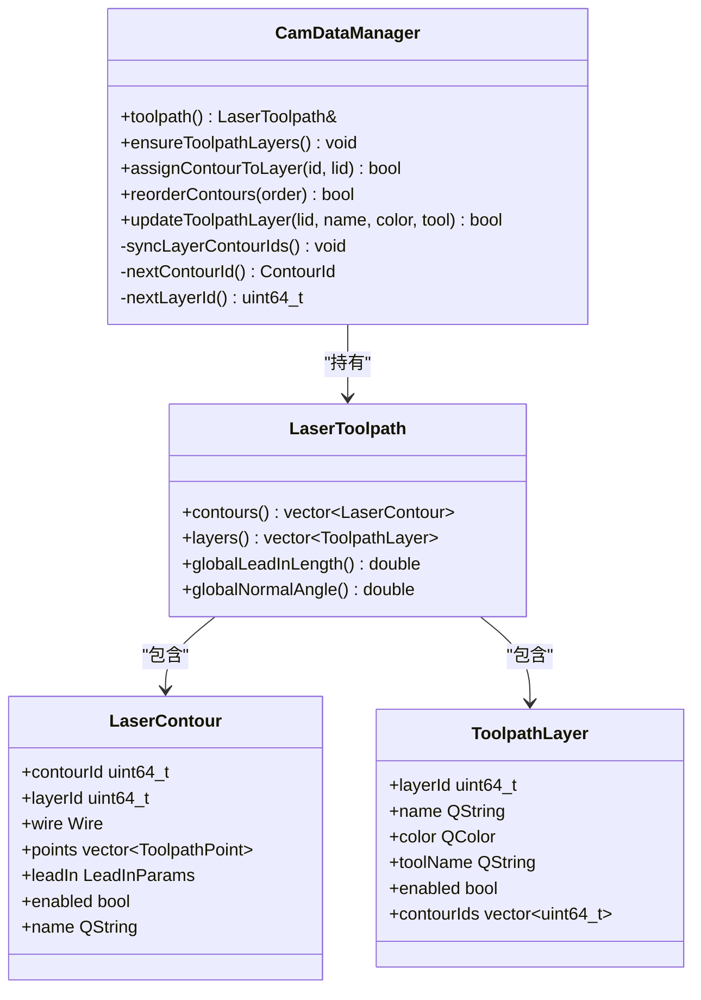
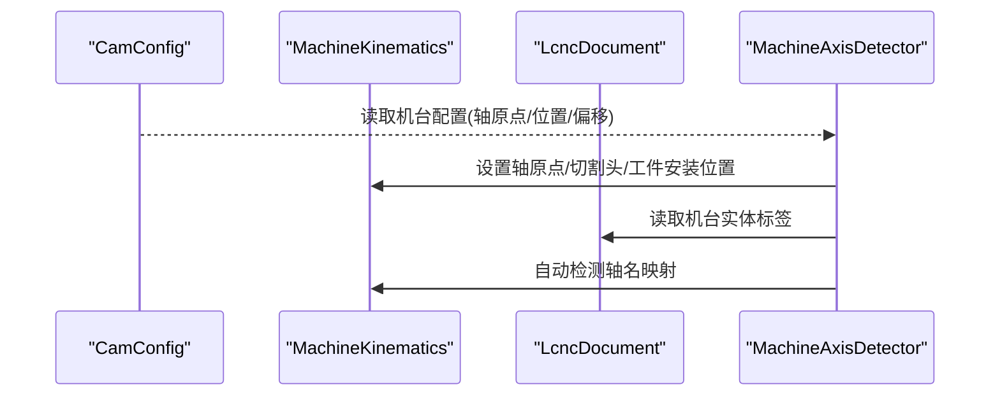
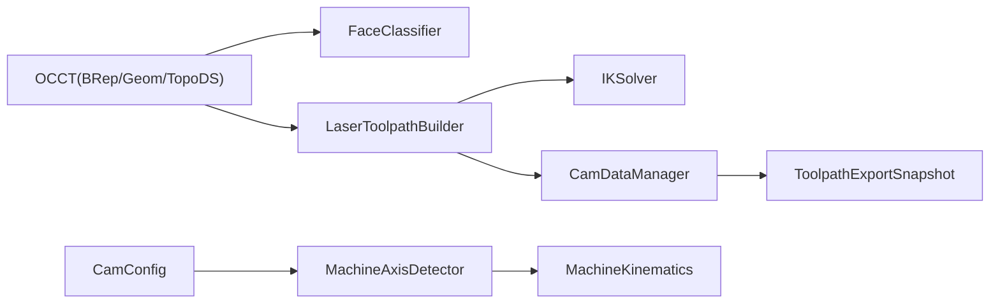

# 刀具路径生成

<cite>
**本文引用的文件**
- [laser_toolpath.cpp](file://src/core/algorithms/cam/laser_toolpath.cpp)
- [laser_toolpath.h](file://src/core/algorithms/cam/laser_toolpath.h)
- [face_classifier.cpp](file://src/core/algorithms/cam/face_classifier.cpp)
- [face_classifier.h](file://src/core/algorithms/cam/face_classifier.h)
- [cam_data_manager.cpp](file://src/modules/cam/services/cam_data_manager.cpp)
- [cam_data_manager.h](file://src/modules/cam/services/cam_data_manager.h)
- [toolpath_export_dto.cpp](file://src/modules/cam/contracts/toolpath_export_dto.cpp)
- [toolpath_export_dto.h](file://src/modules/cam/contracts/toolpath_export_dto.h)
- [cam_config.cpp](file://src/modules/cam/settings/cam_config.cpp)
- [cam_config.h](file://src/modules/cam/settings/cam_config.h)
- [machine_axis_detector.cpp](file://src/modules/cam/services/machine_axis_detector.cpp)
- [machine_axis_detector.h](file://src/modules/cam/services/machine_axis_detector.h)
</cite>

## 目录
1. [简介](#简介)
2. [项目结构](#项目结构)
3. [核心组件](#核心组件)
4. [架构总览](#架构总览)
5. [详细组件分析](#详细组件分析)
6. [依赖关系分析](#依赖关系分析)
7. [性能考虑](#性能考虑)
8. [故障排查指南](#故障排查指南)
9. [结论](#结论)
10. [附录](#附录)

## 简介
本技术文档聚焦于激光CAM模块的刀具路径生成，系统性阐述从几何模型输入到最终可执行刀路数据输出的完整流程。重点包括：
- 面分类与轮廓提取算法（基于平滑连接度的UF-Union分组）
- 刀具轨迹离散化与法向/切向方向计算
- 引刀线（Lead-in）生成与避让策略
- 五轴逆解（IK）与机器坐标转换
- CAM数据管理器对几何、材料与加工参数的组织与持久化
- 导出DTO与过程侧消费接口

文档提供算法实现细节、数据结构设计、性能优化策略以及实际使用场景，帮助开发者快速理解并扩展刀路生成能力。

## 项目结构
CAM模块围绕“算法-服务-配置-导出”四层展开：
- 算法层：面分类、轮廓提取、轨迹离散化、引刀线与IK
- 服务层：CAM数据管理器、轴检测与配置应用
- 配置层：cam.toml持久化与机台配置
- 导出层：面向Process运行时的导出DTO

图示来源
- [face_classifier.cpp:162-292](file://src/core/algorithms/cam/face_classifier.cpp#L162-L292)
- [laser_toolpath.cpp:177-342](file://src/core/algorithms/cam/laser_toolpath.cpp#L177-L342)
- [cam_data_manager.cpp:37-98](file://src/modules/cam/services/cam_data_manager.cpp#L37-L98)
- [machine_axis_detector.cpp:16-28](file://src/modules/cam/services/machine_axis_detector.cpp#L16-L28)
- [toolpath_export_dto.h:55-64](file://src/modules/cam/contracts/toolpath_export_dto.h#L55-L64)

章节来源
- [face_classifier.h:68-92](file://src/core/algorithms/cam/face_classifier.h#L68-L92)
- [laser_toolpath.h:141-207](file://src/core/algorithms/cam/laser_toolpath.h#L141-L207)
- [cam_data_manager.h:19-58](file://src/modules/cam/services/cam_data_manager.h#L19-L58)
- [cam_config.h:29-156](file://src/modules/cam/settings/cam_config.h#L29-L156)
- [toolpath_export_dto.h:11-64](file://src/modules/cam/contracts/toolpath_export_dto.h#L11-L64)

## 核心组件
- 面分类与轮廓提取：通过平滑连接度UF分组识别外表面与截面边界，提取轮廓边并链成闭合或开放线。
- 轨迹离散化与方向计算：沿轮廓边均匀采样，计算表面法向（优先外表面法向+跨截面避让）、切向方向。
- 引刀线生成：确保非垂直进入，结合法向偏角与高度保持生成过渡线。
- 逆解与机器坐标：将世界坐标下的位姿映射到机器空间（含旋转轴）。
- 数据管理与导出：维护轮廓/层级元数据，生成面向Process的导出快照。

章节来源
- [face_classifier.cpp:162-292](file://src/core/algorithms/cam/face_classifier.cpp#L162-L292)
- [laser_toolpath.cpp:348-436](file://src/core/algorithms/cam/laser_toolpath.cpp#L348-L436)
- [laser_toolpath.cpp:562-621](file://src/core/algorithms/cam/laser_toolpath.cpp#L562-L621)
- [laser_toolpath.cpp:627-640](file://src/core/algorithms/cam/laser_toolpath.cpp#L627-L640)
- [cam_data_manager.cpp:37-98](file://src/modules/cam/services/cam_data_manager.cpp#L37-L98)
- [toolpath_export_dto.h:55-64](file://src/modules/cam/contracts/toolpath_export_dto.h#L55-L64)

## 架构总览
刀路生成主流程如下：
1) 几何输入：OCC TopoDS_Shape（工件）
2) 面分类：识别外表面与截面组，提取轮廓边界边
3) 轮廓链：将边界边链成Wire（闭合优先）
4) 轨迹离散：沿Wire均匀采样，计算法向/切向
5) 引刀线：生成从非垂直方向进入的过渡线
6) 逆解：IK求解得到机器坐标
7) 数据管理：分配层级、同步ContourId/LayerId
8) 导出：生成Process可消费的ToolpathExportSnapshot

图示来源
- [face_classifier.cpp:298-345](file://src/core/algorithms/cam/face_classifier.cpp#L298-L345)
- [laser_toolpath.cpp:177-342](file://src/core/algorithms/cam/laser_toolpath.cpp#L177-L342)
- [laser_toolpath.cpp:562-621](file://src/core/algorithms/cam/laser_toolpath.cpp#L562-L621)
- [laser_toolpath.cpp:627-640](file://src/core/algorithms/cam/laser_toolpath.cpp#L627-L640)
- [cam_data_manager.cpp:37-98](file://src/modules/cam/services/cam_data_manager.cpp#L37-L98)
- [toolpath_export_dto.cpp:5-21](file://src/modules/cam/contracts/toolpath_export_dto.cpp#L5-L21)

## 详细组件分析

### 组件A：面分类与轮廓提取（FaceClassifier）
- 算法要点
  - 基于相邻面法向夹角阈值判断“平滑连接”，使用UF-Union将相邻面合并为连通组
  - 最大包围盒对角线最长的组标记为外表面（Outer）
  - 与外表面共享非平滑边的组标记为截面（CrossSection）
  - 其余组标记为内表面（Inner）
  - 从外表面组与截面组共享的边界边集中提取轮廓边，再链成Wire
- 关键数据结构
  - FaceGroup：包含面集、包围盒、类型
  - FaceClassification：所有组及外表面索引
- 复杂度
  - 分类阶段：O(F+E)，F为面数，E为边数
  - 链接阶段：O(E log E)，主要受排序与邻接查找影响

图示来源
- [face_classifier.cpp:162-292](file://src/core/algorithms/cam/face_classifier.cpp#L162-L292)
- [face_classifier.cpp:298-345](file://src/core/algorithms/cam/face_classifier.cpp#L298-L345)
- [face_classifier.cpp:351-450](file://src/core/algorithms/cam/face_classifier.cpp#L351-L450)

章节来源
- [face_classifier.h:14-47](file://src/core/algorithms/cam/face_classifier.h#L14-L47)
- [face_classifier.cpp:162-292](file://src/core/algorithms/cam/face_classifier.cpp#L162-L292)
- [face_classifier.cpp:298-345](file://src/core/algorithms/cam/face_classifier.cpp#L298-L345)
- [face_classifier.cpp:351-450](file://src/core/algorithms/cam/face_classifier.cpp#L351-L450)

### 组件B：轮廓离散化与法向/切向计算（LaserToolpathBuilder）
- 轮廓离散化
  - 沿Wire的每条Edge进行均匀弦长采样（Chordal Deflection）
  - 丢弃退化Edge
- 法向计算
  - 传统模式：在工件上寻找最近面，计算表面法向
  - 面分类模式：优先外表面法向，同时避免与跨截面法向过于平行的方向，必要时投影到径向以规避内部表面
- 切向计算
  - 由BRepAdaptor_Curve一阶导数获得切向方向
- 引刀线生成
  - 保证进入方向不垂直于Z（±Z方向），必要时投影到XY平面并倾斜至阈值角度
  - 支持法向偏角（Normal Angle）在加工平面内旋转
- 逆解与机器坐标
  - 将世界坐标系下的位置与法向变换到机器坐标系，调用IK求解

图示来源
- [laser_toolpath.cpp:348-436](file://src/core/algorithms/cam/laser_toolpath.cpp#L348-L436)
- [laser_toolpath.cpp:442-481](file://src/core/algorithms/cam/laser_toolpath.cpp#L442-L481)
- [laser_toolpath.cpp:529-560](file://src/core/algorithms/cam/laser_toolpath.cpp#L529-L560)
- [laser_toolpath.cpp:562-621](file://src/core/algorithms/cam/laser_toolpath.cpp#L562-L621)
- [laser_toolpath.cpp:627-640](file://src/core/algorithms/cam/laser_toolpath.cpp#L627-L640)

章节来源
- [laser_toolpath.h:25-76](file://src/core/algorithms/cam/laser_toolpath.h#L25-L76)
- [laser_toolpath.h:141-207](file://src/core/algorithms/cam/laser_toolpath.h#L141-L207)
- [laser_toolpath.cpp:348-436](file://src/core/algorithms/cam/laser_toolpath.cpp#L348-L436)
- [laser_toolpath.cpp:442-481](file://src/core/algorithms/cam/laser_toolpath.cpp#L442-L481)
- [laser_toolpath.cpp:529-560](file://src/core/algorithms/cam/laser_toolpath.cpp#L529-L560)
- [laser_toolpath.cpp:562-621](file://src/core/algorithms/cam/laser_toolpath.cpp#L562-L621)
- [laser_toolpath.cpp:627-640](file://src/core/algorithms/cam/laser_toolpath.cpp#L627-L640)

### 组件C：CAM数据管理器（CamDataManager）
- 职责
  - 维护LaserToolpath（轮廓/层级/全局参数）
  - 分配并同步ContourId/LayerId
  - 自动生成层级（按sourceInfo或类型），并支持重排、启用/禁用、命名与颜色修改
- 关键流程
  - ensureToolpathLayers：根据轮廓的sourceInfo或类型生成层级，分配颜色与LayerId
  - syncLayerContourIds：反向同步各层级包含的轮廓Id列表
  - reorderContours/reorderContoursById：保持运行时稳定Id的同时重排轮廓顺序

图示来源
- [cam_data_manager.h:19-58](file://src/modules/cam/services/cam_data_manager.h#L19-L58)
- [laser_toolpath.h:91-121](file://src/core/algorithms/cam/laser_toolpath.h#L91-L121)
- [laser_toolpath.h:61-86](file://src/core/algorithms/cam/laser_toolpath.h#L61-L86)

章节来源
- [cam_data_manager.cpp:37-98](file://src/modules/cam/services/cam_data_manager.cpp#L37-L98)
- [cam_data_manager.cpp:217-239](file://src/modules/cam/services/cam_data_manager.cpp#L217-L239)
- [laser_toolpath.h:61-86](file://src/core/algorithms/cam/laser_toolpath.h#L61-L86)

### 组件D：配置与轴检测（CamConfig/MachineAxisDetector）
- CamConfig
  - 持久化cam.toml，包含全局参数与机台配置
  - toolpath节：引刀长度、法向偏角、采样弦长、平滑角、是否启用面分类、显示法向、法向采样步长
  - machineProfile节：轴原点、切割头模型/物理位置、工件安装位置、AC角度偏移、物理AC中心
- MachineAxisDetector
  - 自动检测轴名与轴原点（基于挂载形体包围盒中心）
  - 应用已存储机台配置到Kinematics

图示来源
- [cam_config.cpp:193-302](file://src/modules/cam/settings/cam_config.cpp#L193-L302)
- [machine_axis_detector.cpp:16-28](file://src/modules/cam/services/machine_axis_detector.cpp#L16-L28)
- [machine_axis_detector.cpp:30-72](file://src/modules/cam/services/machine_axis_detector.cpp#L30-L72)
- [machine_axis_detector.cpp:74-102](file://src/modules/cam/services/machine_axis_detector.cpp#L74-L102)

章节来源
- [cam_config.h:29-156](file://src/modules/cam/settings/cam_config.h#L29-L156)
- [cam_config.cpp:193-302](file://src/modules/cam/settings/cam_config.cpp#L193-L302)
- [machine_axis_detector.h:21-44](file://src/modules/cam/services/machine_axis_detector.h#L21-L44)
- [machine_axis_detector.cpp:16-28](file://src/modules/cam/services/machine_axis_detector.cpp#L16-L28)
- [machine_axis_detector.cpp:30-72](file://src/modules/cam/services/machine_axis_detector.cpp#L30-L72)
- [machine_axis_detector.cpp:74-102](file://src/modules/cam/services/machine_axis_detector.cpp#L74-L102)

### 组件E：导出DTO（ToolpathExportSnapshot）
- 作用：面向Process运行时的不可变快照，包含每条轮廓的元数据与点云
- 关键字段
  - contours：轮廓元信息（启用状态、点数、名称、工具名、工件入口等）
  - pointsByContourId：按轮廓Id组织的点数组（含机器坐标）
  - revision/description：版本与描述
- 辅助方法
  - hasEnabledContours：是否存在启用且有数据的轮廓
  - totalPointCount：统计总点数

章节来源
- [toolpath_export_dto.h:14-64](file://src/modules/cam/contracts/toolpath_export_dto.h#L14-L64)
- [toolpath_export_dto.cpp:5-21](file://src/modules/cam/contracts/toolpath_export_dto.cpp#L5-L21)

## 依赖关系分析
- 算法层依赖OCCT（TopoDS/BRep/Geom）进行几何操作
- 面分类依赖UF-Union与拓扑映射，复杂度与面/边数量线性相关
- 轨迹离散化依赖BRepAdaptor_Curve与GCPnts_UniformDeflection
- 引刀线与法向避让依赖几何属性查询与向量运算
- 数据管理器依赖Qt容器与哈希表维护层级与Id映射
- 导出DTO为纯数据结构，便于跨模块传递

图示来源
- [face_classifier.cpp:1-25](file://src/core/algorithms/cam/face_classifier.cpp#L1-L25)
- [laser_toolpath.cpp:1-39](file://src/core/algorithms/cam/laser_toolpath.cpp#L1-L39)
- [cam_data_manager.cpp:1-7](file://src/modules/cam/services/cam_data_manager.cpp#L1-L7)
- [toolpath_export_dto.h:1-8](file://src/modules/cam/contracts/toolpath_export_dto.h#L1-L8)
- [cam_config.cpp:1-12](file://src/modules/cam/settings/cam_config.cpp#L1-L12)
- [machine_axis_detector.cpp:1-7](file://src/modules/cam/services/machine_axis_detector.cpp#L1-L7)

章节来源
- [face_classifier.cpp:1-25](file://src/core/algorithms/cam/face_classifier.cpp#L1-L25)
- [laser_toolpath.cpp:1-39](file://src/core/algorithms/cam/laser_toolpath.cpp#L1-L39)
- [cam_data_manager.cpp:1-7](file://src/modules/cam/services/cam_data_manager.cpp#L1-L7)
- [toolpath_export_dto.h:1-8](file://src/modules/cam/contracts/toolpath_export_dto.h#L1-L8)
- [cam_config.cpp:1-12](file://src/modules/cam/settings/cam_config.cpp#L1-L12)
- [machine_axis_detector.cpp:1-7](file://src/modules/cam/services/machine_axis_detector.cpp#L1-L7)

## 性能考虑
- 面分类
  - 使用UF-Union降低连通分量查找复杂度，整体O(F+E)
  - 非平滑边记录用于后续截面组识别，避免重复扫描
- 轮廓离散化
  - 采用统一弦长采样，采样密度由deflection控制
  - 对退化Edge跳过，减少无效计算
- 法向计算
  - 面分类模式优先外表面法向，减少跨表面法向冲突
  - 避跨截面方向通过投影与点积判定，避免昂贵的几何相交
- 引刀线
  - 仅在需要时生成，避免对空轮廓的额外开销
- 数据管理
  - 层级与Id同步采用一次遍历完成，避免频繁查找
- 导出
  - DTO为只读快照，避免拷贝与锁竞争

## 故障排查指南
- 面分类结果为空
  - 检查smoothAngle阈值是否过大导致无平滑边
  - 确认工件存在外表面与跨截面组
- 轮廓离散化点数过少
  - 降低deflection或检查Edge退化情况
- 法向方向异常
  - 检查faceOrientation与法向翻转逻辑
  - 面分类失败时回退到findSurfaceNormal
- 引刀线无效
  - 确认entryPoint与contour.points匹配
  - 检查normalAngle与阈值角度ensureNotFromAbove
- IK失败
  - 检查wpcTransform与kinematics配置
  - 确认点位在可达范围内
- 层级错乱或Id不一致
  - 调用ensureToolpathLayers与syncLayerContourIds
  - 使用reorderContoursById保持运行时稳定Id

章节来源
- [face_classifier.cpp:243-291](file://src/core/algorithms/cam/face_classifier.cpp#L243-L291)
- [laser_toolpath.cpp:348-436](file://src/core/algorithms/cam/laser_toolpath.cpp#L348-L436)
- [laser_toolpath.cpp:529-560](file://src/core/algorithms/cam/laser_toolpath.cpp#L529-L560)
- [laser_toolpath.cpp:627-640](file://src/core/algorithms/cam/laser_toolpath.cpp#L627-L640)
- [cam_data_manager.cpp:37-98](file://src/modules/cam/services/cam_data_manager.cpp#L37-L98)
- [cam_data_manager.cpp:227-239](file://src/modules/cam/services/cam_data_manager.cpp#L227-L239)

## 结论
本模块通过“面分类+轮廓链+轨迹离散+引刀线+IK”的流水线式设计，实现了从复杂几何到可执行刀路的高效转换。配合CAM数据管理器与配置体系，能够稳定地组织加工参数与层级信息，并以DTO形式交付给Process执行层。建议在实际工程中：
- 根据工件特征调整smoothAngle与deflection
- 合理设置引刀长度与法向偏角，兼顾效率与安全性
- 使用层级管理提升可视化与后处理灵活性
- 通过cam.toml与机台配置实现多机台一致性

## 附录
- 使用场景
  - 管道/型材激光切割：利用面分类识别外表面与截面，自动生成闭合轮廓
  - 复杂曲面轮廓：通过均匀弦长采样与法向避让，避免内部结构干扰
  - 五轴联动：结合IK求解与轴原点配置，确保路径可达
- 关键参数
  - 平滑角阈值：控制面连接连续性
  - 弦长采样：控制轨迹密度与计算成本
  - 引刀长度/法向偏角：控制切入安全与路径平滑
  - 是否启用面分类：在简单几何与复杂几何间权衡精度与性能