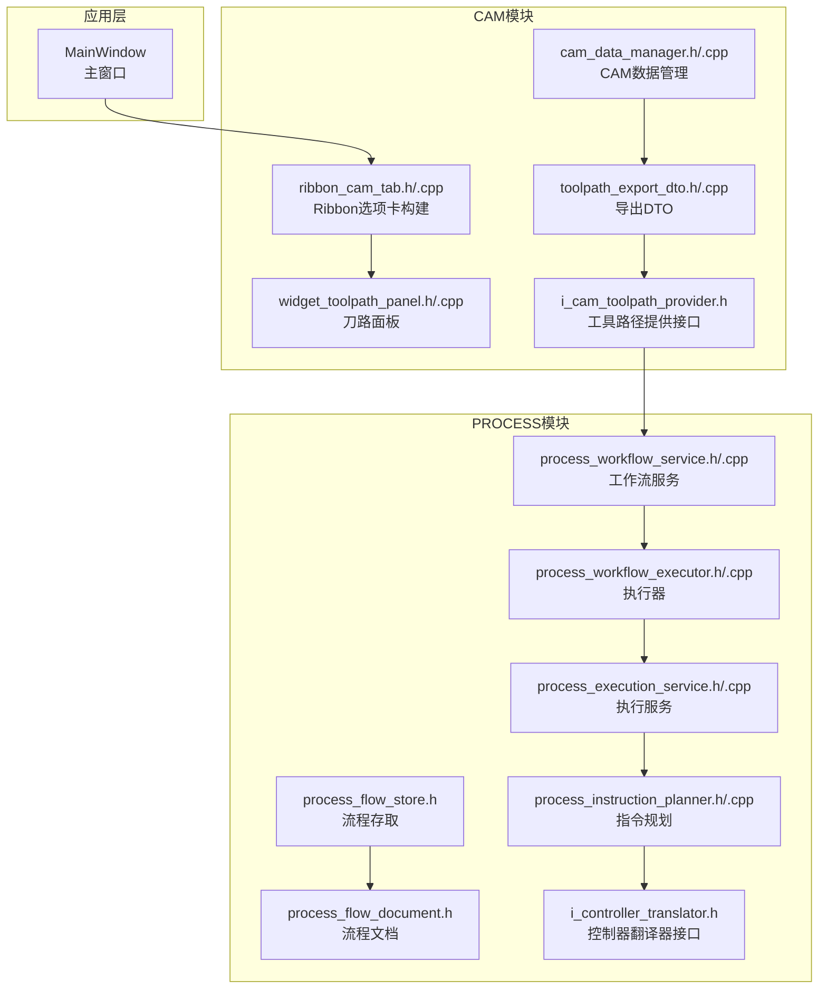
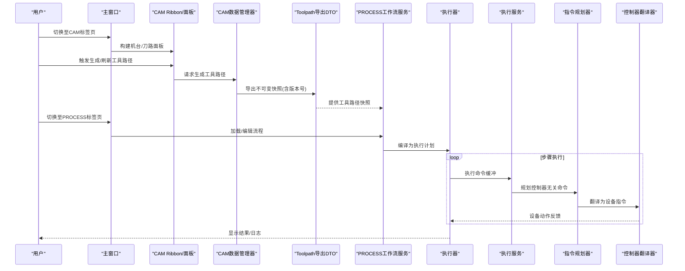
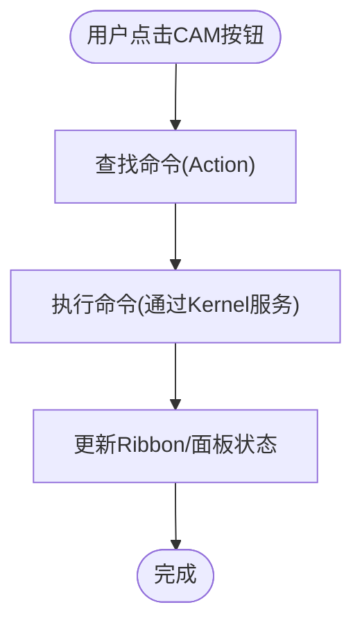
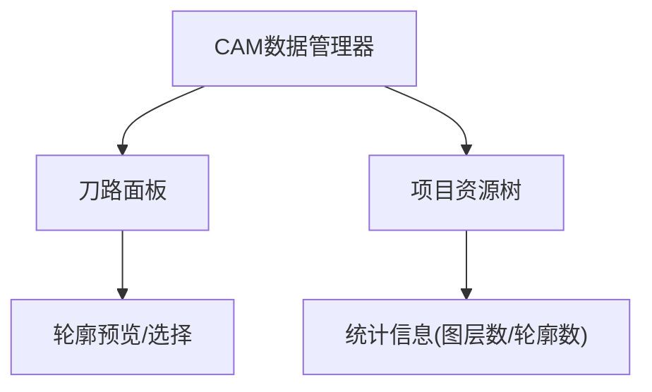
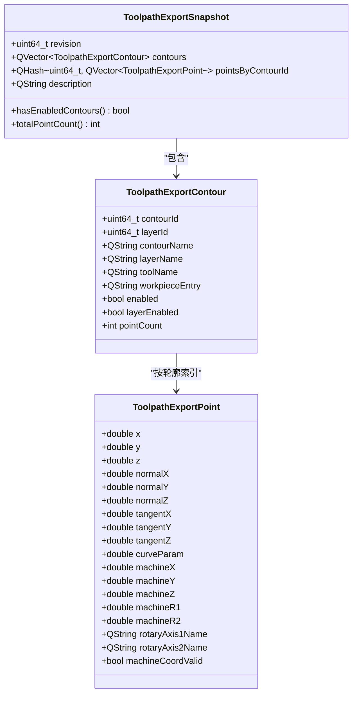
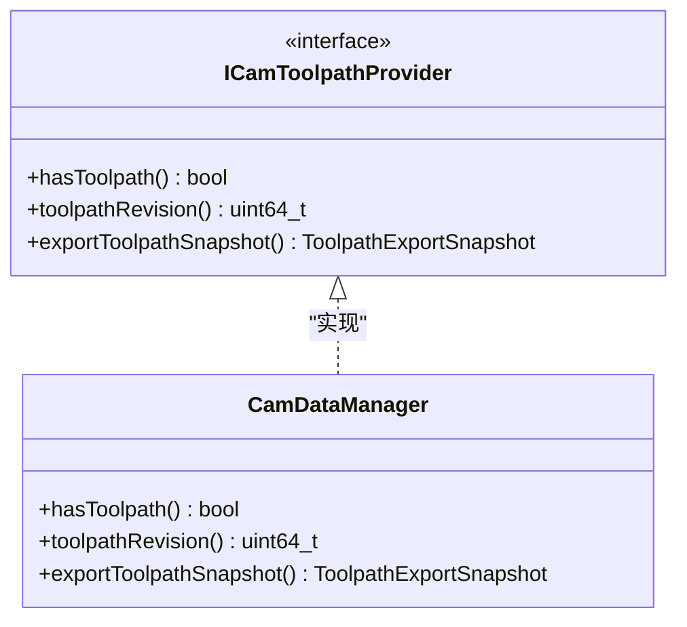
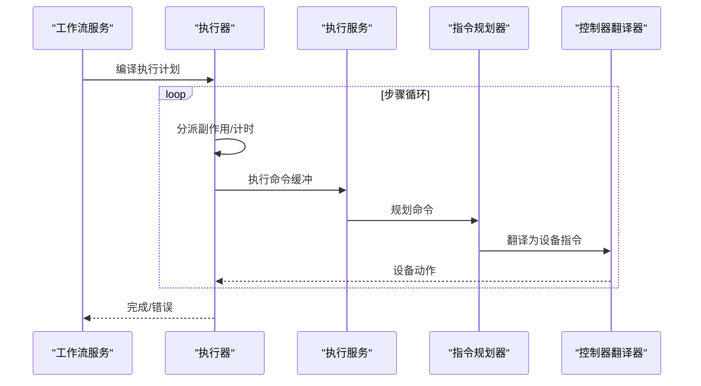

# 工作流集成与调度

<cite>
**本文档引用的文件**
- [src/modules/cam/ui/ribbon_cam_tab.h](file://src/modules/cam/ui/ribbon_cam_tab.h)
- [src/modules/cam/ui/ribbon_cam_tab.cpp](file://src/modules/cam/ui/ribbon_cam_tab.cpp)
- [src/modules/cam/ui/widget_toolpath_panel.cpp](file://src/modules/cam/ui/widget_toolpath_panel.cpp)
- [src/modules/cam/ui/widget_toolpath_panel.h](file://src/modules/cam/ui/widget_toolpath_panel.h)
- [src/modules/cam/contracts/toolpath_export_dto.h](file://src/modules/cam/contracts/toolpath_export_dto.h)
- [src/modules/cam/contracts/toolpath_export_dto.cpp](file://src/modules/cam/contracts/toolpath_export_dto.cpp)
- [src/modules/cam/i_cam_toolpath_provider.h](file://src/modules/cam/i_cam_toolpath_provider.h)
- [src/modules/cam/services/cam_data_manager.cpp](file://src/modules/cam/services/cam_data_manager.cpp)
- [src/modules/cam/services/cam_data_manager.h](file://src/modules/cam/services/cam_data_manager.h)
- [src/modules/process/workflow/process_flow_document.h](file://src/modules/process/workflow/process_flow_document.h)
- [src/modules/process/workflow/process_flow_store.h](file://src/modules/process/workflow/process_flow_store.h)
- [src/modules/process/workflow/process_flow_store.cpp](file://src/modules/process/workflow/process_flow_store.cpp)
- [src/modules/process/workflow/process_workflow_service.cpp](file://src/modules/process/workflow/process_workflow_service.cpp)
- [src/modules/process/workflow/process_workflow_service.h](file://src/modules/process/workflow/process_workflow_service.h)
- [src/modules/process/execution/process_workflow_executor.cpp](file://src/modules/process/execution/process_workflow_executor.cpp)
- [src/modules/process/execution/process_execution_service.cpp](file://src/modules/process/execution/process_execution_service.cpp)
- [src/modules/process/execution/process_execution_service.h](file://src/modules/process/execution/process_execution_service.h)
- [src/modules/process/instructions/process_instruction_planner.cpp](file://src/modules/process/instructions/process_instruction_planner.cpp)
- [src/modules/process/instructions/process_instruction_planner.h](file://src/modules/process/instructions/process_instruction_planner.h)
- [src/modules/process/instructions/i_controller_translator.h](file://src/modules/process/instructions/i_controller_translator.h)
- [src/app/main_window.cpp](file://src/app/main_window.cpp)
- [src/app/project_explorer_model.cpp](file://src/app/project_explorer_model.cpp)
- [process模块框架.md](file://process模块框架.md)
</cite>

## 目录
1. [简介](#简介)
2. [项目结构](#项目结构)
3. [核心组件](#核心组件)
4. [架构总览](#架构总览)
5. [详细组件分析](#详细组件分析)
6. [依赖关系分析](#依赖关系分析)
7. [性能考虑](#性能考虑)
8. [故障排查指南](#故障排查指南)
9. [结论](#结论)
10. [附录](#附录)

## 简介
本文件聚焦于CAM模块的工作流集成与调度能力，阐述其与CAD模块的协同方式、数据传递与状态同步机制，以及通过Ribbon界面提供的用户交互体验。文档覆盖从用户操作到系统响应的完整工作流，包括UI组件实现、事件处理与数据绑定策略，并给出最佳实践与性能优化建议，帮助开发者构建高效稳定的CAM工作流程。

## 项目结构
CAM模块位于src/modules/cam目录下，主要由UI层、服务层、数据契约层组成；同时与process模块协作完成从刀路到指令的全流程执行。Ribbon界面在主窗口中按模块组织，CAM标签页负责机台控制、刀路生成与G代码导出等操作。

图表来源
- [src/app/main_window.cpp:1148-1229](file://src/app/main_window.cpp#L1148-L1229)
- [src/modules/cam/ui/ribbon_cam_tab.h:1-32](file://src/modules/cam/ui/ribbon_cam_tab.h#L1-L32)
- [src/modules/cam/ui/widget_toolpath_panel.cpp](file://src/modules/cam/ui/widget_toolpath_panel.cpp)
- [src/modules/cam/contracts/toolpath_export_dto.h:1-66](file://src/modules/cam/contracts/toolpath_export_dto.h#L1-L66)
- [src/modules/cam/i_cam_toolpath_provider.h:1-21](file://src/modules/cam/i_cam_toolpath_provider.h#L1-L21)
- [src/modules/cam/services/cam_data_manager.cpp](file://src/modules/cam/services/cam_data_manager.cpp)
- [src/modules/process/workflow/process_flow_document.h](file://src/modules/process/workflow/process_flow_document.h)
- [src/modules/process/workflow/process_flow_store.h:1-31](file://src/modules/process/workflow/process_flow_store.h#L1-L31)
- [src/modules/process/workflow/process_workflow_service.h](file://src/modules/process/workflow/process_workflow_service.h)
- [src/modules/process/execution/process_workflow_executor.cpp:125-297](file://src/modules/process/execution/process_workflow_executor.cpp#L125-L297)
- [src/modules/process/execution/process_execution_service.h:1-33](file://src/modules/process/execution/process_execution_service.h#L1-L33)
- [src/modules/process/instructions/process_instruction_planner.h](file://src/modules/process/instructions/process_instruction_planner.h)
- [src/modules/process/instructions/i_controller_translator.h](file://src/modules/process/instructions/i_controller_translator.h)

章节来源
- [src/app/main_window.cpp:1148-1229](file://src/app/main_window.cpp#L1148-L1229)
- [src/modules/cam/ui/ribbon_cam_tab.h:1-32](file://src/modules/cam/ui/ribbon_cam_tab.h#L1-L32)

## 核心组件
- CAM工具路径提供接口与导出DTO：定义了CAM向PROCESS模块输出的不可变快照格式，包含轮廓元数据与采样点集合，确保PROCESS侧无需依赖OCC几何。
- CAM数据管理器：维护CAM文档状态、工具路径生成与更新，并提供版本号以支持增量同步。
- Ribbon CAM选项卡：封装“机台/刀路/G代码”三面板，承载用户操作入口。
- 刀路面板：展示CAM数据树、图层与轮廓信息，支持选择与预览。
- PROCESS工作流：从流程文档到执行计划，再到指令翻译与设备执行的完整链路。

章节来源
- [src/modules/cam/i_cam_toolpath_provider.h:1-21](file://src/modules/cam/i_cam_toolpath_provider.h#L1-L21)
- [src/modules/cam/contracts/toolpath_export_dto.h:1-66](file://src/modules/cam/contracts/toolpath_export_dto.h#L1-L66)
- [src/modules/cam/services/cam_data_manager.cpp](file://src/modules/cam/services/cam_data_manager.cpp)
- [src/modules/cam/ui/ribbon_cam_tab.h:1-32](file://src/modules/cam/ui/ribbon_cam_tab.h#L1-L32)
- [src/modules/cam/ui/widget_toolpath_panel.cpp](file://src/modules/cam/ui/widget_toolpath_panel.cpp)

## 架构总览
CAM与PROCESS之间的集成采用“快照+工作流”的解耦架构：
- CAM生成不可变工具路径快照（ToolpathExportSnapshot），包含轮廓与点云，携带版本号用于变更检测。
- PROCESS侧通过工作流服务将流程树编译为可执行计划，执行器按步骤推进，期间通过指令规划器转换为控制器无关命令，再由翻译器映射到具体设备指令。
- 主窗口Ribbon按模块组织，CAM标签页提供机台控制与刀路操作，PROCESS标签页提供流程编辑与运行控制。

图表来源
- [src/app/main_window.cpp:1148-1229](file://src/app/main_window.cpp#L1148-L1229)
- [src/modules/cam/services/cam_data_manager.cpp](file://src/modules/cam/services/cam_data_manager.cpp)
- [src/modules/cam/contracts/toolpath_export_dto.h:1-66](file://src/modules/cam/contracts/toolpath_export_dto.h#L1-L66)
- [src/modules/process/workflow/process_workflow_service.h](file://src/modules/process/workflow/process_workflow_service.h)
- [src/modules/process/execution/process_workflow_executor.cpp:125-297](file://src/modules/process/execution/process_workflow_executor.cpp#L125-L297)
- [src/modules/process/execution/process_execution_service.h:1-33](file://src/modules/process/execution/process_execution_service.h#L1-L33)
- [src/modules/process/instructions/process_instruction_planner.h](file://src/modules/process/instructions/process_instruction_planner.h)
- [src/modules/process/instructions/i_controller_translator.h](file://src/modules/process/instructions/i_controller_translator.h)

## 详细组件分析

### CAM Ribbon与UI交互
- Ribbon选项卡构建：注册并布局“机台/刀路/G代码”面板，将命令注入CommandContainer，供主窗口统一调度。
- 用户交互：通过按钮触发CAM命令，如生成工具路径、导出G代码等；面板根据CAM数据状态动态更新。

图表来源
- [src/modules/cam/ui/ribbon_cam_tab.h:1-32](file://src/modules/cam/ui/ribbon_cam_tab.h#L1-L32)
- [src/app/main_window.cpp:1148-1229](file://src/app/main_window.cpp#L1148-L1229)

章节来源
- [src/modules/cam/ui/ribbon_cam_tab.h:1-32](file://src/modules/cam/ui/ribbon_cam_tab.h#L1-L32)
- [src/modules/cam/ui/ribbon_cam_tab.cpp](file://src/modules/cam/ui/ribbon_cam_tab.cpp)
- [src/app/main_window.cpp:1148-1229](file://src/app/main_window.cpp#L1148-L1229)

### 刀路面板与项目树集成
- 刀路面板展示CAM数据根节点、图层与轮廓，支持选择与预览。
- 项目资源树中CAM节点显示图层数量与轮廓总数，未生成时提示“未生成”。

图表来源
- [src/app/project_explorer_model.cpp:299-333](file://src/app/project_explorer_model.cpp#L299-L333)
- [src/modules/cam/ui/widget_toolpath_panel.cpp](file://src/modules/cam/ui/widget_toolpath_panel.cpp)

章节来源
- [src/app/project_explorer_model.cpp:299-333](file://src/app/project_explorer_model.cpp#L299-L333)
- [src/modules/cam/ui/widget_toolpath_panel.cpp](file://src/modules/cam/ui/widget_toolpath_panel.cpp)

### 工具路径导出与版本管理
- 导出DTO包含轮廓元数据与按轮廓索引的点云集合，支持查询是否包含启用轮廓与总点数。
- 版本号用于增量同步：当CAM工具路径更新时，版本号递增，PROCESS侧据此决定是否重新拉取快照。

图表来源
- [src/modules/cam/contracts/toolpath_export_dto.h:1-66](file://src/modules/cam/contracts/toolpath_export_dto.h#L1-L66)
- [src/modules/cam/contracts/toolpath_export_dto.cpp:1-22](file://src/modules/cam/contracts/toolpath_export_dto.cpp#L1-L22)

章节来源
- [src/modules/cam/contracts/toolpath_export_dto.h:1-66](file://src/modules/cam/contracts/toolpath_export_dto.h#L1-L66)
- [src/modules/cam/contracts/toolpath_export_dto.cpp:1-22](file://src/modules/cam/contracts/toolpath_export_dto.cpp#L1-L22)

### CAM数据管理器与提供接口
- 提供接口定义：hasToolpath、toolpathRevision、exportToolpathSnapshot，确保PROCESS侧以只读快照形式消费CAM数据。
- 数据管理器负责CAM文档状态维护与工具路径生成，保证数据一致性与版本控制。

图表来源
- [src/modules/cam/i_cam_toolpath_provider.h:1-21](file://src/modules/cam/i_cam_toolpath_provider.h#L1-L21)
- [src/modules/cam/services/cam_data_manager.cpp](file://src/modules/cam/services/cam_data_manager.cpp)

章节来源
- [src/modules/cam/i_cam_toolpath_provider.h:1-21](file://src/modules/cam/i_cam_toolpath_provider.h#L1-L21)
- [src/modules/cam/services/cam_data_manager.cpp](file://src/modules/cam/services/cam_data_manager.cpp)

### PROCESS工作流与执行
- 工作流服务：将流程文档编译为执行计划，支持节点状态重置与运行态推进。
- 执行器：按步骤执行，处理副作用（如数字量输出），并发出节点状态变化与完成信号。
- 执行服务：简化版执行器，用于干跑验证命令缓冲。
- 指令规划与翻译：将控制器无关命令转为具体设备指令，屏蔽不同控制器差异。

图表来源
- [src/modules/process/workflow/process_workflow_service.h](file://src/modules/process/workflow/process_workflow_service.h)
- [src/modules/process/execution/process_workflow_executor.cpp:125-297](file://src/modules/process/execution/process_workflow_executor.cpp#L125-L297)
- [src/modules/process/execution/process_execution_service.h:1-33](file://src/modules/process/execution/process_execution_service.h#L1-L33)
- [src/modules/process/instructions/process_instruction_planner.h](file://src/modules/process/instructions/process_instruction_planner.h)
- [src/modules/process/instructions/i_controller_translator.h](file://src/modules/process/instructions/i_controller_translator.h)

章节来源
- [src/modules/process/workflow/process_workflow_service.cpp](file://src/modules/process/workflow/process_workflow_service.cpp)
- [src/modules/process/execution/process_workflow_executor.cpp:125-297](file://src/modules/process/execution/process_workflow_executor.cpp#L125-L297)
- [src/modules/process/execution/process_execution_service.cpp](file://src/modules/process/execution/process_execution_service.cpp)
- [src/modules/process/instructions/process_instruction_planner.cpp](file://src/modules/process/instructions/process_instruction_planner.cpp)
- [src/modules/process/instructions/i_controller_translator.h](file://src/modules/process/instructions/i_controller_translator.h)

### TOML工作流存取
- 支持从文件加载/保存流程文档，兼容旧版树形文件；内部以TOML结构存储，包含模式版本字段。
- 便于流程的持久化与跨版本迁移。

章节来源
- [src/modules/process/workflow/process_flow_store.h:1-31](file://src/modules/process/workflow/process_flow_store.h#L1-L31)
- [src/modules/process/workflow/process_flow_store.cpp](file://src/modules/process/workflow/process_flow_store.cpp)

## 依赖关系分析
- UI层依赖服务层：Ribbon与面板通过CommandContainer与Kernel服务交互，避免直接耦合具体实现。
- CAM与PROCESS通过不可变快照解耦：CAM仅提供只读快照，PROCESS独立编译与执行。
- 工作流服务与执行器：前者负责计划编译，后者负责步骤推进与状态通知。
- 指令层：规划器与翻译器分离，便于扩展不同控制器。

图表来源
- [src/app/main_window.cpp:1148-1229](file://src/app/main_window.cpp#L1148-L1229)
- [src/modules/cam/services/cam_data_manager.cpp](file://src/modules/cam/services/cam_data_manager.cpp)
- [src/modules/cam/contracts/toolpath_export_dto.h:1-66](file://src/modules/cam/contracts/toolpath_export_dto.h#L1-L66)
- [src/modules/process/workflow/process_workflow_service.h](file://src/modules/process/workflow/process_workflow_service.h)
- [src/modules/process/execution/process_workflow_executor.cpp:125-297](file://src/modules/process/execution/process_workflow_executor.cpp#L125-L297)
- [src/modules/process/execution/process_execution_service.h:1-33](file://src/modules/process/execution/process_execution_service.h#L1-L33)
- [src/modules/process/instructions/process_instruction_planner.h](file://src/modules/process/instructions/process_instruction_planner.h)
- [src/modules/process/instructions/i_controller_translator.h](file://src/modules/process/instructions/i_controller_translator.h)

## 性能考虑
- 快照不可变性：PROCESS侧对CAM快照只读访问，避免并发写导致的锁竞争与数据不一致。
- 版本号增量同步：仅在CAM工具路径版本变化时重新拉取快照，减少不必要的数据传输与解析。
- 执行器计时与副作用：通过定时器与副作用分发，降低阻塞风险，提升交互流畅度。
- 指令规划与翻译：将控制器无关命令与具体设备指令分离，便于缓存与批处理优化。
- UI更新粒度：Ribbon与面板按需更新，避免全量刷新造成卡顿。

## 故障排查指南
- 工具路径为空：检查CAM数据管理器是否已生成有效工具路径，确认版本号是否递增。
- 执行器状态异常：关注节点状态信号与完成回调，定位步骤执行失败原因。
- 指令翻译错误：核对控制器配置与翻译器实现，确保命令参数与通道映射正确。
- 流程存取问题：确认TOML文件格式与模式版本，必要时回退到旧版树形文件格式。

章节来源
- [src/modules/cam/services/cam_data_manager.cpp](file://src/modules/cam/services/cam_data_manager.cpp)
- [src/modules/process/execution/process_workflow_executor.cpp:125-297](file://src/modules/process/execution/process_workflow_executor.cpp#L125-L297)
- [src/modules/process/workflow/process_flow_store.h:1-31](file://src/modules/process/workflow/process_flow_store.h#L1-L31)

## 结论
CAM模块通过不可变快照与PROCESS工作流的解耦设计，实现了稳定高效的加工流程集成。Ribbon界面提供直观的操作入口，配合项目树与面板展示，使用户能够顺畅地完成从建模到执行的全流程。遵循版本控制、只读快照与控制器无关命令的设计原则，有助于构建可扩展、可维护且高性能的CAM工作流体系。

## 附录
- CAM与PROCESS协作参考框架说明：包含工具路径服务职责、指令层两步法、工作流编辑态与运行态划分等要点。

章节来源
- [process模块框架.md:260-297](file://process模块框架.md#L260-L297)