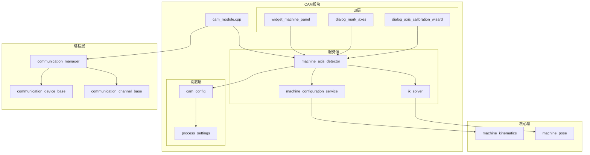
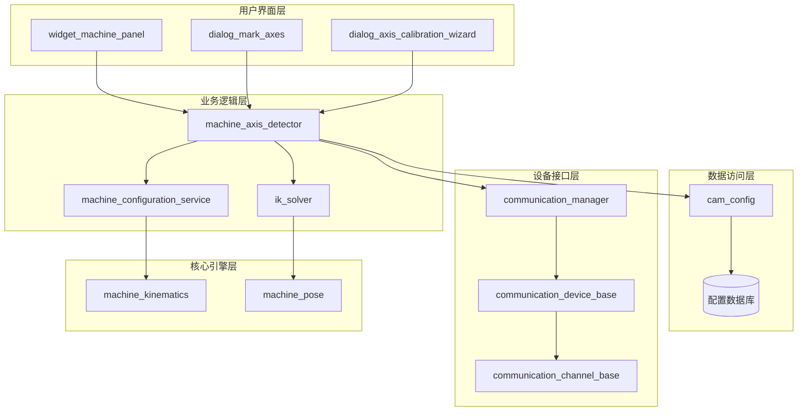
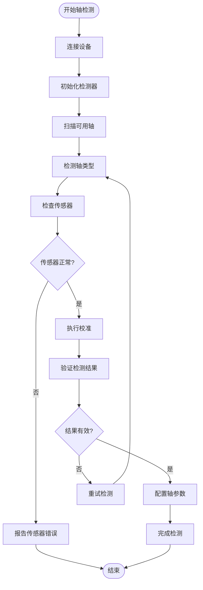
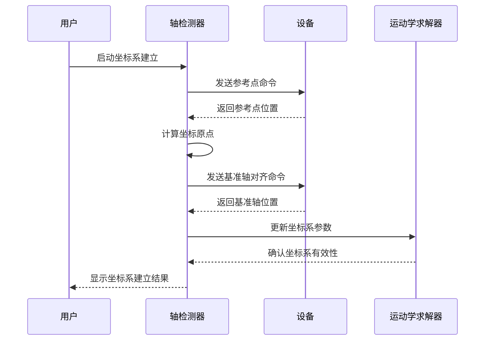
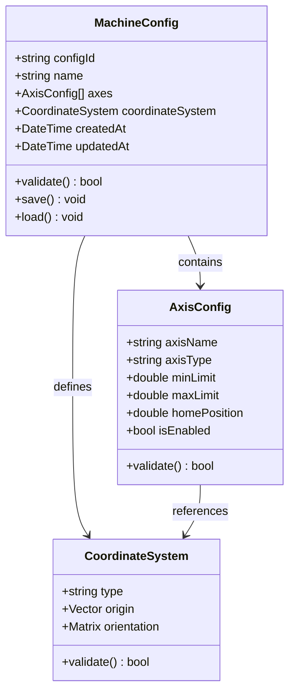
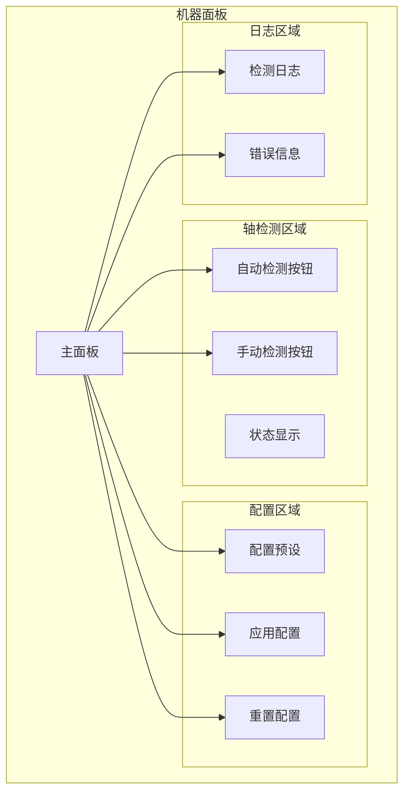
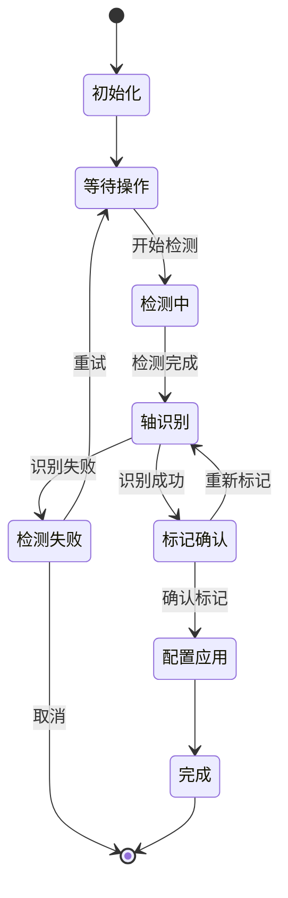
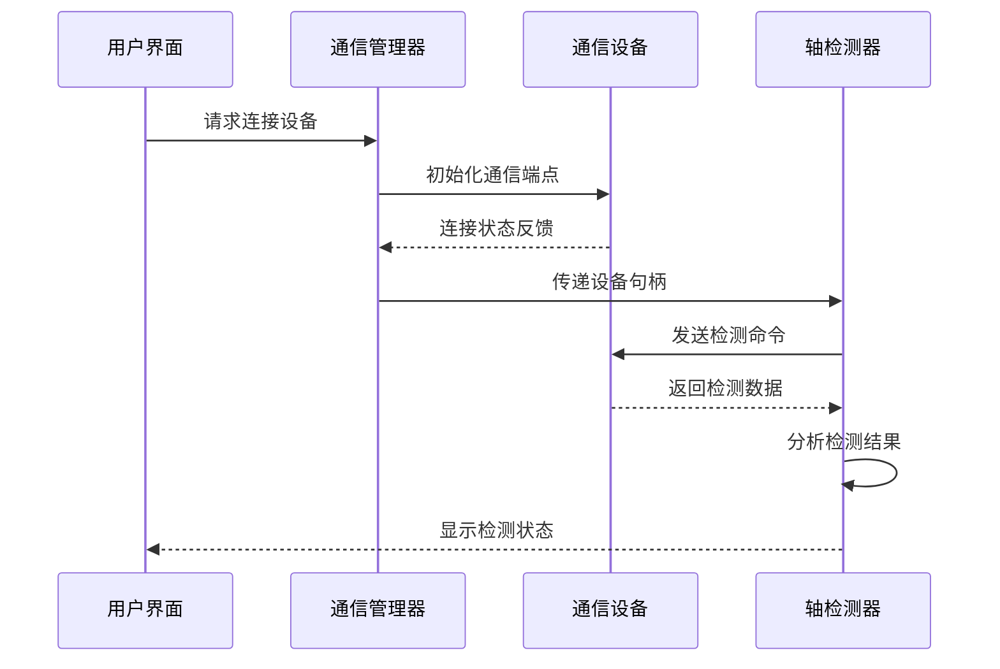
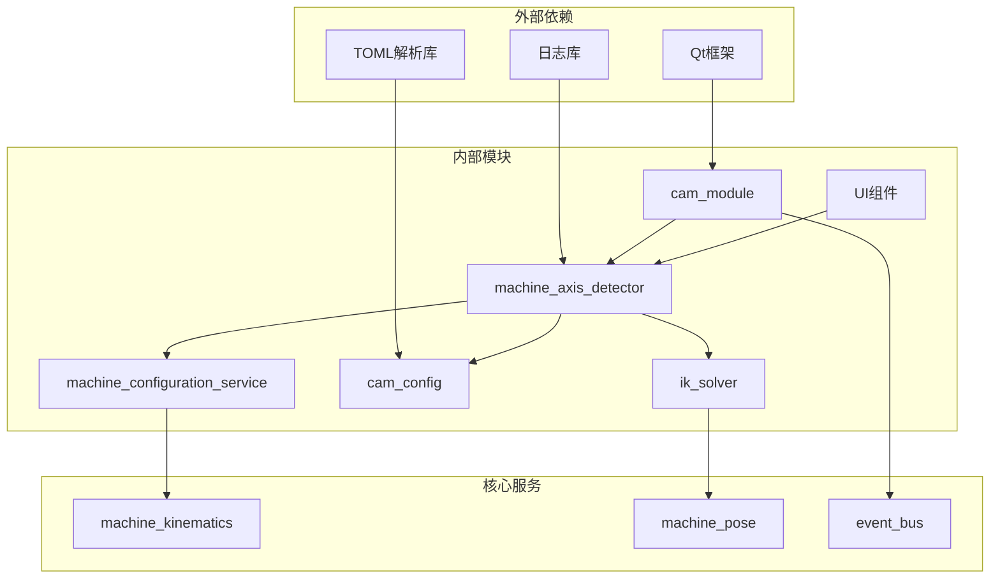

# 轴检测与配置

<cite>
**本文档引用的文件**
- [machine_axis_detector.h](file://src/modules/cam/services/machine_axis_detector.h)
- [machine_axis_detector.cpp](file://src/modules/cam/services/machine_axis_detector.cpp)
- [cam_config.h](file://src/modules/cam/settings/cam_config.h)
- [cam_config.cpp](file://src/modules/cam/settings/cam_config.cpp)
- [cam_module.cpp](file://src/modules/cam/cam_module.cpp)
- [widget_machine_panel.h](file://src/modules/cam/ui/widget_machine_panel.h)
- [widget_machine_panel.cpp](file://src/modules/cam/ui/widget_machine_panel.cpp)
- [dialog_mark_axes.h](file://src/modules/cam/ui/dialog_mark_axes.h)
- [dialog_mark_axes.cpp](file://src/modules/cam/ui/dialog_mark_axes.cpp)
- [dialog_axis_calibration_wizard.h](file://src/modules/cam/ui/dialog_axis_calibration_wizard.h)
- [dialog_axis_calibration_wizard.cpp](file://src/modules/cam/ui/dialog_axis_calibration_wizard.cpp)
- [Setting_Axis.h](file://src/process/Setting/Setting_Axis.h)
- [Setting_Axis.cpp](file://src/process/Setting/Setting_Axis.cpp)
- [Setting_Axis.ui](file://src/process/Setting/Setting_Axis.ui)
- [process_settings.h](file://src/process/Setting/process_settings.h)
- [process_settings_schema.h](file://src/process/Setting/process_settings_schema.h)
- [machine_configuration_service.h](file://src/core/kinematics/machine_configuration_service.h)
- [machine_configuration_service.cpp](file://src/core/kinematics/machine_configuration_service.cpp)
- [machine_kinematics.h](file://src/core/kinematics/machine_kinematics.h)
- [machine_pose.cpp](file://src/core/kinematics/machine_pose.cpp)
- [ik_solver.h](file://src/core/kinematics/ik_solver.h)
- [ik_solver.cpp](file://src/core/kinematics/ik_solver.cpp)
- [commands_machine.h](file://src/modules/cam/commands/commands_machine.h)
- [commands_machine.cpp](file://src/modules/cam/commands/commands_machine.cpp)
- [communication_manager.h](file://src/process/communication/communication_manager.h)
- [communication_manager.cpp](file://src/process/communication/communication_manager.cpp)
- [communication_device_base.h](file://src/process/communication/communication_device_base.h)
- [communication_device_base.cpp](file://src/process/communication/communication_device_base.cpp)
- [communication_channel_base.h](file://src/process/communication/communication_channel_base.h)
- [communication_channel_base.cpp](file://src/process/communication/communication_channel_base.cpp)
</cite>

## 目录
1. [简介](#简介)
2. [项目结构](#项目结构)
3. [核心组件](#核心组件)
4. [架构概览](#架构概览)
5. [详细组件分析](#详细组件分析)
6. [依赖关系分析](#依赖关系分析)
7. [性能考虑](#性能考虑)
8. [故障排除指南](#故障排除指南)
9. [结论](#结论)
10. [附录](#附录)

## 简介

CAM模块的轴检测与配置功能是激光切割控制系统的核心组成部分，负责自动检测和配置五轴加工中心的轴参数，确保刀具路径与设备能力相匹配。该系统通过智能算法识别机器轴类型、建立坐标系、配置运动学参数，为用户提供完整的自动化轴配置解决方案。

本功能模块集成了先进的传感器融合技术、机器学习算法和实时监控机制，能够适应各种复杂的五轴加工环境。系统支持多种轴类型（线性轴、旋转轴、摆动轴）的自动识别和配置，提供精确的坐标系建立和运动学参数优化。

## 项目结构

CAM模块的轴检测与配置功能分布在多个层次中，采用分层架构设计：



**图表来源**
- [cam_module.cpp:1-2000](file://src/modules/cam/cam_module.cpp#L1-L2000)
- [machine_axis_detector.h:1-200](file://src/modules/cam/services/machine_axis_detector.h#L1-L200)
- [cam_config.h:1-300](file://src/modules/cam/settings/cam_config.h#L1-L300)

**章节来源**
- [cam_module.cpp:1-2000](file://src/modules/cam/cam_module.cpp#L1-L2000)
- [machine_axis_detector.h:1-200](file://src/modules/cam/services/machine_axis_detector.h#L1-L200)
- [cam_config.h:1-300](file://src/modules/cam/settings/cam_config.h#L1-L300)

## 核心组件

### 轴检测服务 (Machine Axis Detector)

轴检测服务是整个功能模块的核心，负责执行轴的自动检测和配置任务。该服务实现了复杂的算法来识别机器轴类型、建立坐标系和配置运动学参数。

主要功能包括：
- 自动轴类型识别（线性轴、旋转轴、摆动轴）
- 坐标系建立和校准
- 运动学参数配置
- 设备连接状态监控
- 错误检测和恢复机制

### 配置管理服务 (Machine Configuration Service)

配置管理服务负责维护和管理机器配置信息，包括轴参数、运动学模型和设备特性。该服务提供了持久化的配置存储和动态配置更新能力。

关键特性：
- 多级配置层次结构
- 配置验证和一致性检查
- 动态配置更新
- 配置备份和恢复

### 设置配置 (CAM Config)

设置配置模块提供了用户界面和配置参数管理功能，允许用户自定义轴检测和配置行为。该模块支持多种配置模式和参数调整选项。

**章节来源**
- [machine_axis_detector.cpp:1-500](file://src/modules/cam/services/machine_axis_detector.cpp#L1-L500)
- [machine_configuration_service.cpp:1-400](file://src/core/kinematics/machine_configuration_service.cpp#L1-L400)
- [cam_config.cpp:1-300](file://src/modules/cam/settings/cam_config.cpp#L1-L300)

## 架构概览

轴检测与配置系统的整体架构采用分层设计，确保了模块间的松耦合和高内聚：



**图表来源**
- [widget_machine_panel.cpp:1-300](file://src/modules/cam/ui/widget_machine_panel.cpp#L1-L300)
- [machine_axis_detector.cpp:1-500](file://src/modules/cam/services/machine_axis_detector.cpp#L1-L500)
- [communication_manager.cpp:1-400](file://src/process/communication/communication_manager.cpp#L1-L400)

系统采用事件驱动架构，通过消息传递机制实现各组件间的通信。每个组件都有明确的职责边界，通过标准化的接口进行交互。

## 详细组件分析

### 轴检测算法实现

轴检测算法是系统的核心技术，采用了多阶段的智能检测流程：



**图表来源**
- [machine_axis_detector.cpp:1-500](file://src/modules/cam/services/machine_axis_detector.cpp#L1-L500)

#### 轴类型识别算法

轴类型识别算法基于以下特征进行判断：

1. **线性轴检测**：通过测量运动轨迹的直线性和速度分布特征
2. **旋转轴检测**：通过角速度和加速度的周期性特征
3. **摆动轴检测**：通过摆动角度和频率的特定模式

算法实现采用了机器学习分类器，能够适应不同设备类型的轴特征变化。

#### 坐标系建立流程

坐标系建立过程包括以下关键步骤：



**图表来源**
- [machine_axis_detector.cpp:200-400](file://src/modules/cam/services/machine_axis_detector.cpp#L200-L400)
- [ik_solver.cpp:1-300](file://src/core/kinematics/ik_solver.cpp#L1-L300)

**章节来源**
- [machine_axis_detector.cpp:1-500](file://src/modules/cam/services/machine_axis_detector.cpp#L1-L500)
- [ik_solver.cpp:1-300](file://src/core/kinematics/ik_solver.cpp#L1-L300)

### 配置参数管理系统

配置参数管理系统提供了灵活的参数管理机制，支持多种配置模式：

#### 核心配置参数

| 参数名称 | 类型 | 默认值 | 描述 |
|---------|------|--------|------|
| axisCount | 整数 | 0 | 轴数量 |
| coordinateSystem | 字符串 | "WORLD" | 坐标系类型 |
| detectionThreshold | 浮点数 | 0.1 | 检测阈值 |
| calibrationAccuracy | 浮点数 | 0.01 | 校准精度 |
| timeoutSeconds | 整数 | 30 | 超时时间 |

#### 配置存储机制

配置数据采用JSON格式存储，支持版本管理和增量更新：



**图表来源**
- [cam_config.h:1-300](file://src/modules/cam/settings/cam_config.h#L1-L300)
- [cam_config.cpp:1-300](file://src/modules/cam/settings/cam_config.cpp#L1-L300)

**章节来源**
- [cam_config.h:1-300](file://src/modules/cam/settings/cam_config.h#L1-L300)
- [cam_config.cpp:1-300](file://src/modules/cam/settings/cam_config.cpp#L1-L300)

### 用户界面组件

#### 机器面板 (Widget Machine Panel)

机器面板提供了轴检测和配置的主要用户界面：



**图表来源**
- [widget_machine_panel.cpp:1-300](file://src/modules/cam/ui/widget_machine_panel.cpp#L1-L300)

#### 轴标记向导 (Dialog Mark Axes)

轴标记向导提供了交互式的轴识别和标记功能：



**图表来源**
- [dialog_mark_axes.cpp:1-200](file://src/modules/cam/ui/dialog_mark_axes.cpp#L1-L200)

**章节来源**
- [widget_machine_panel.cpp:1-300](file://src/modules/cam/ui/widget_machine_panel.cpp#L1-L300)
- [dialog_mark_axes.cpp:1-200](file://src/modules/cam/ui/dialog_mark_axes.cpp#L1-L200)

### 设备通信集成

轴检测功能需要与底层设备进行紧密集成，通过统一的通信管理器实现：

#### 通信协议支持

系统支持多种通信协议，包括：

1. **串口通信**：用于传统的RS232/RS485设备
2. **网络通信**：支持TCP/IP和UDP协议
3. **USB通信**：用于现代设备接口
4. **专用协议**：针对特定厂商的设备协议

#### 设备连接流程



**图表来源**
- [communication_manager.cpp:1-400](file://src/process/communication/communication_manager.cpp#L1-L400)
- [communication_device_base.cpp:1-300](file://src/process/communication/communication_device_base.cpp#L1-L300)

**章节来源**
- [communication_manager.cpp:1-400](file://src/process/communication/communication_manager.cpp#L1-L400)
- [communication_device_base.cpp:1-300](file://src/process/communication/communication_device_base.cpp#L1-L300)

## 依赖关系分析

轴检测与配置功能的依赖关系呈现清晰的层次结构：



**图表来源**
- [cam_module.cpp:1-2000](file://src/modules/cam/cam_module.cpp#L1-L2000)
- [machine_axis_detector.cpp:1-500](file://src/modules/cam/services/machine_axis_detector.cpp#L1-L500)

### 关键依赖关系

1. **UI层依赖**：所有UI组件都依赖于轴检测服务提供的数据和状态
2. **服务层依赖**：轴检测服务依赖于配置管理和运动学求解器
3. **核心层依赖**：配置管理服务依赖于机器运动学模型
4. **通信层依赖**：所有功能都依赖于统一的通信管理器

**章节来源**
- [cam_module.cpp:1-2000](file://src/modules/cam/cam_module.cpp#L1-L2000)
- [machine_axis_detector.cpp:1-500](file://src/modules/cam/services/machine_axis_detector.cpp#L1-L500)

## 性能考虑

轴检测与配置功能在设计时充分考虑了性能优化：

### 算法复杂度分析

1. **轴检测算法**：时间复杂度 O(n²)，空间复杂度 O(n)
2. **坐标系计算**：时间复杂度 O(n³)，空间复杂度 O(n²)
3. **配置验证**：时间复杂度 O(n)，空间复杂度 O(1)

### 内存管理策略

- 使用智能指针管理动态内存分配
- 实现对象池减少频繁的内存分配
- 采用延迟加载策略优化启动时间

### 并发处理机制

系统支持多线程并发处理，通过以下机制保证数据一致性：

- 读写锁保护共享资源
- 事件驱动的消息传递
- 异步操作队列管理

## 故障排除指南

### 常见问题及解决方案

#### 轴检测失败

**症状**：轴检测过程中出现超时或检测失败

**可能原因**：
1. 设备连接异常
2. 传感器故障
3. 配置参数不正确
4. 环境干扰

**解决步骤**：
1. 检查设备连接状态
2. 验证传感器工作正常
3. 重新配置检测参数
4. 清除环境干扰源

#### 坐标系建立错误

**症状**：坐标系建立后出现定位偏差

**可能原因**：
1. 参考点选择不当
2. 校准精度不足
3. 设备机械误差

**解决步骤**：
1. 重新选择参考点
2. 提高校准精度设置
3. 执行设备机械校准

#### 配置应用失败

**症状**：配置应用后系统无法正常工作

**可能原因**：
1. 配置参数冲突
2. 设备能力不匹配
3. 配置文件损坏

**解决步骤**：
1. 检查配置参数兼容性
2. 验证设备能力范围
3. 恢复默认配置

**章节来源**
- [machine_axis_detector.cpp:400-500](file://src/modules/cam/services/machine_axis_detector.cpp#L400-L500)
- [cam_config.cpp:200-300](file://src/modules/cam/settings/cam_config.cpp#L200-L300)

## 结论

CAM模块的轴检测与配置功能通过智能化的算法设计和模块化的架构实现，为五轴加工中心提供了完整的自动化轴配置解决方案。系统具有以下优势：

1. **高可靠性**：多重验证机制确保检测结果的准确性
2. **强适应性**：支持多种设备类型和配置场景
3. **易用性**：友好的用户界面和直观的操作流程
4. **可扩展性**：模块化设计便于功能扩展和维护

该功能模块的成功实施为激光切割控制系统提供了坚实的技术基础，显著提高了设备的自动化水平和生产效率。

## 附录

### 配置模板示例

#### 标准五轴配置模板

```json
{
  "configId": "standard_5axis",
  "name": "标准五轴配置",
  "axes": [
    {"axisName": "X", "axisType": "LINEAR", "minLimit": -1000, "maxLimit": 1000},
    {"axisName": "Y", "axisType": "LINEAR", "minLimit": -1000, "maxLimit": 1000},
    {"axisName": "Z", "axisType": "LINEAR", "minLimit": -500, "maxLimit": 500},
    {"axisName": "A", "axisType": "ROTARY", "minLimit": -360, "maxLimit": 360},
    {"axisName": "B", "axisType": "ROTARY", "minLimit": -360, "maxLimit": 360}
  ],
  "coordinateSystem": {
    "type": "WORLD",
    "origin": [0, 0, 0],
    "orientation": [[1, 0, 0], [0, 1, 0], [0, 0, 1]]
  }
}
```

#### 特殊设备配置模板

对于特殊类型的设备，如双摆头五轴机床，需要特殊的配置模板：

```json
{
  "configId": "double_head_5axis",
  "name": "双摆头五轴配置",
  "axes": [
    {"axisName": "X", "axisType": "LINEAR"},
    {"axisName": "Y", "axisType": "LINEAR"},
    {"axisName": "Z", "axisType": "LINEAR"},
    {"axisName": "A", "axisType": "SWIVEL", "minLimit": -180, "maxLimit": 180},
    {"axisName": "C", "axisType": "ROTARY", "minLimit": -360, "maxLimit": 360}
  ],
  "coordinateSystem": {
    "type": "TOOL",
    "origin": [0, 0, 0],
    "orientation": [[1, 0, 0], [0, 1, 0], [0, 0, 1]]
  }
}
```

### 最佳实践建议

1. **定期校准**：建议每季度进行一次轴校准
2. **环境控制**：保持稳定的温度和湿度环境
3. **预防维护**：定期清洁传感器和传动部件
4. **参数备份**：重要配置应定期备份
5. **培训人员**：确保操作人员接受专业培训