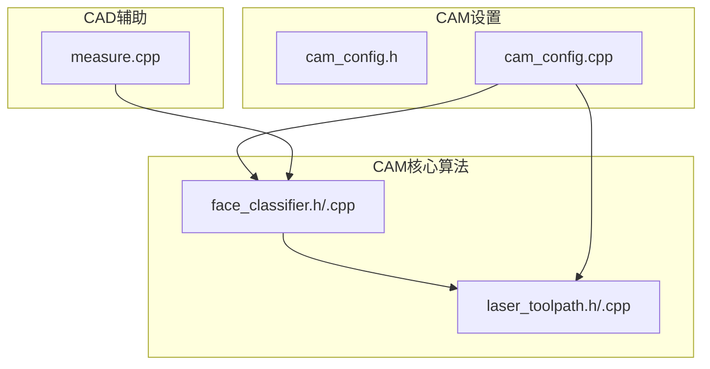
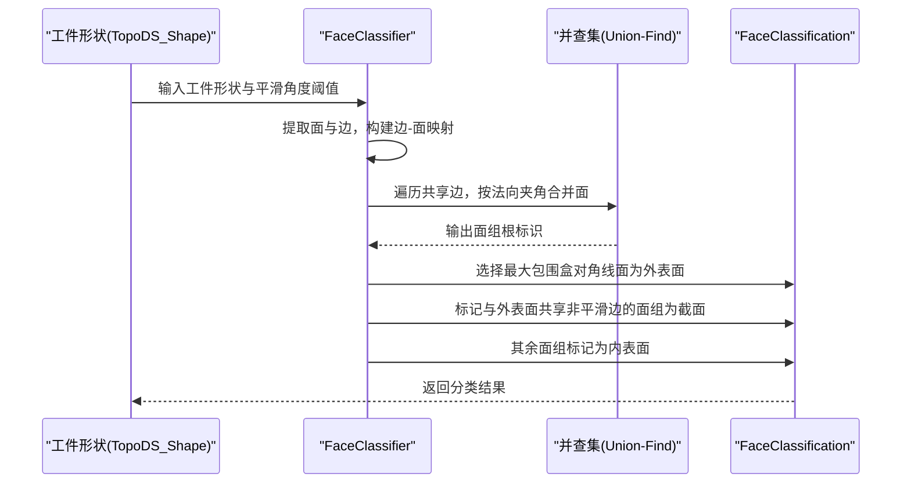
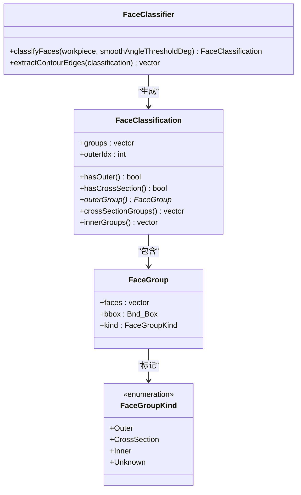
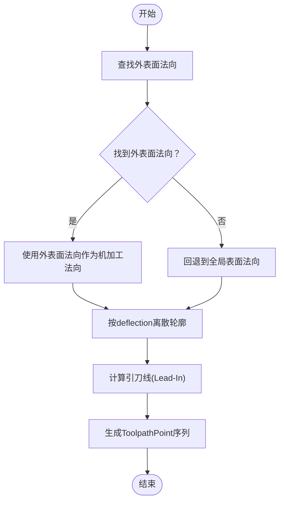
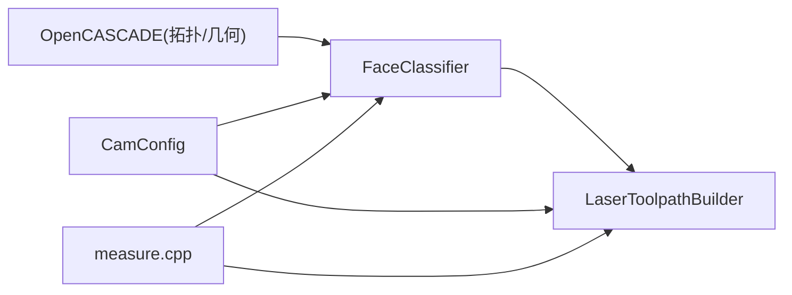
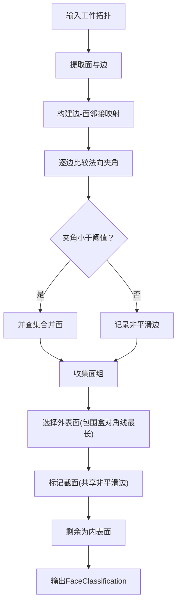

# 面分类与识别

<cite>
**本文引用的文件**
- [face_classifier.h](file://src/core/algorithms/cam/face_classifier.h)
- [face_classifier.cpp](file://src/core/algorithms/cam/face_classifier.cpp)
- [laser_toolpath.h](file://src/core/algorithms/cam/laser_toolpath.h)
- [laser_toolpath.cpp](file://src/core/algorithms/cam/laser_toolpath.cpp)
- [cam_config.h](file://src/modules/cam/settings/cam_config.h)
- [cam_config.cpp](file://src/modules/cam/settings/cam_config.cpp)
- [measure.cpp](file://src/core/algorithms/cad/measure.cpp)
</cite>

## 目录
1. [简介](#简介)
2. [项目结构](#项目结构)
3. [核心组件](#核心组件)
4. [架构总览](#架构总览)
5. [详细组件分析](#详细组件分析)
6. [依赖关系分析](#依赖关系分析)
7. [性能考虑](#性能考虑)
8. [故障排查指南](#故障排查指南)
9. [结论](#结论)
10. [附录](#附录)

## 简介
本文件面向CAM模块中的“面分类与识别”功能，系统性阐述其算法原理、实现机制与工程集成方式。该功能通过对工件拓扑进行平滑连接性分析，将相邻面按几何连续性分组为外表面、截面与内表面三类，并据此指导后续激光切割刀具路径生成，提升路径规划的合理性与加工质量。文档覆盖从几何面检测到分类结果输出的完整工作流程，给出算法实现要点、测试与性能基准建议，以及在不同加工场景下的应用策略与优化方法。

## 项目结构
CAM模块中与面分类直接相关的代码主要位于以下位置：
- 核心算法：src/core/algorithms/cam/face_classifier.{h,cpp}
- 刀具路径与法向计算：src/core/algorithms/cam/laser_toolpath.{h,cpp}
- CAM配置项：src/modules/cam/settings/cam_config.{h,cpp}
- 几何测量工具：src/core/algorithms/cad/measure.cpp

**图表来源**
- [face_classifier.h](file://src/core/algorithms/cam/face_classifier.h)
- [face_classifier.cpp](file://src/core/algorithms/cam/face_classifier.cpp)
- [laser_toolpath.h](file://src/core/algorithms/cam/laser_toolpath.h)
- [laser_toolpath.cpp](file://src/core/algorithms/cam/laser_toolpath.cpp)
- [cam_config.h](file://src/modules/cam/settings/cam_config.h)
- [cam_config.cpp](file://src/modules/cam/settings/cam_config.cpp)
- [measure.cpp](file://src/core/algorithms/cad/measure.cpp)

**章节来源**
- [face_classifier.h](file://src/core/algorithms/cam/face_classifier.h)
- [face_classifier.cpp](file://src/core/algorithms/cam/face_classifier.cpp)
- [laser_toolpath.h](file://src/core/algorithms/cam/laser_toolpath.h)
- [laser_toolpath.cpp](file://src/core/algorithms/cam/laser_toolpath.cpp)
- [cam_config.h](file://src/modules/cam/settings/cam_config.h)
- [cam_config.cpp](file://src/modules/cam/settings/cam_config.cpp)
- [measure.cpp](file://src/core/algorithms/cad/measure.cpp)

## 核心组件
- 面分类器（FaceClassifier）：对工件拓扑进行平滑连接性分析，输出面组分类结果。
- 面分类结果（FaceClassification/FaceGroup）：描述外表面、截面与内表面等组别及其包围盒。
- 刀具路径构建器（LaserToolpathBuilder）：基于面分类结果计算法向、离散轮廓点，生成切削路径。
- CAM配置（CamConfig）：提供平滑角度阈值、是否启用面分类等参数，驱动算法行为。

关键数据结构与职责：
- FaceGroupKind：外表面、截面、内表面、未知。
- FaceGroup：一组平滑连接的面集合及包围盒。
- FaceClassification：所有面组、外表面索引。
- LaserToolpathBuilder：法向查找、轮廓离散化、引刀线计算等。

**章节来源**
- [face_classifier.h](file://src/core/algorithms/cam/face_classifier.h)
- [face_classifier.cpp](file://src/core/algorithms/cam/face_classifier.cpp)
- [laser_toolpath.h](file://src/core/algorithms/cam/laser_toolpath.h)
- [laser_toolpath.cpp](file://src/core/algorithms/cam/laser_toolpath.cpp)
- [cam_config.h](file://src/modules/cam/settings/cam_config.h)
- [cam_config.cpp](file://src/modules/cam/settings/cam_config.cpp)

## 架构总览
面分类与识别在CAM中的整体流程如下：
- 输入：工件拓扑（TopoDS_Shape）
- 步骤：
  1) 提取所有面与边，建立边-面邻接映射；
  2) 对每条共享边比较两个面的法向夹角，低于阈值则视为“平滑”连接；
  3) 使用并查集（Union-Find）合并平滑面，形成面组；
  4) 以包围盒对角线长度最大者为外表面；
  5) 与外表面共享非平滑边的面组为截面；
  6) 其余为内表面；
  7) 基于分类结果提取机加工轮廓边界，离散化为路径点，结合法向计算生成刀具路径。

**图表来源**
- [face_classifier.cpp](file://src/core/algorithms/cam/face_classifier.cpp)

**章节来源**
- [face_classifier.cpp](file://src/core/algorithms/cam/face_classifier.cpp)

## 详细组件分析

### 面分类器（FaceClassifier）
- 功能概述
  - 将工件的所有面按平滑连接性聚类为若干面组；
  - 识别外表面、截面与内表面；
  - 为后续轮廓提取与路径生成提供几何依据。
- 关键算法
  - 边-面邻接映射：使用TopExp与TopTools构建；
  - 平滑判定：沿共享边中点处比较两面法向夹角；
  - 并查集：合并平滑面，形成连通分量；
  - 外表面选择：包围盒对角线最长者；
  - 截面识别：与外表面共享非平滑边的面组；
  - 内表面：未被识别为外表面或截面的其余面组。
- 数据结构
  - FaceGroupKind：枚举三类面组；
  - FaceGroup：包含面列表与包围盒；
  - FaceClassification：保存所有面组与外表面索引。

**图表来源**
- [face_classifier.h](file://src/core/algorithms/cam/face_classifier.h)
- [face_classifier.cpp](file://src/core/algorithms/cam/face_classifier.cpp)

**章节来源**
- [face_classifier.h](file://src/core/algorithms/cam/face_classifier.h)
- [face_classifier.cpp](file://src/core/algorithms/cam/face_classifier.cpp)

### 刀具路径与法向计算（LaserToolpathBuilder）
- 功能概述
  - 在面分类基础上，计算每个轮廓点的法向与切向方向；
  - 支持优先使用外表面法向，保证与截面方向一致；
  - 提供轮廓离散化与引刀线计算能力。
- 关键实现
  - 法向查找：在给定查询点附近寻找最近面并计算法向；
  - 机加工法向：优先取外表面法向，作为切削方向参考；
  - 轮廓离散化：根据曲率与弦高（deflection）采样轮廓曲线；
  - 引刀线：在轮廓起点附近生成过渡线段，避免垂直下刀。

**图表来源**
- [laser_toolpath.cpp](file://src/core/algorithms/cam/laser_toolpath.cpp)

**章节来源**
- [laser_toolpath.h](file://src/core/algorithms/cam/laser_toolpath.h)
- [laser_toolpath.cpp](file://src/core/algorithms/cam/laser_toolpath.cpp)

### 配置与参数（CamConfig）
- 关键参数
  - 平滑角度阈值（smoothAngle）：控制面间法向夹角判断；
  - 是否启用面分类（useFaceClassification）：决定是否使用面分类结果；
  - 法向采样步长（normalSampleStep）、弦高（deflection）等影响离散化精度；
  - 引刀长度与法向角度（leadInLength、normalAngle）等路径参数。
- 作用
  - 通过配置项统一管理算法参数，便于在不同材料与几何条件下调优。

**章节来源**
- [cam_config.h](file://src/modules/cam/settings/cam_config.h)
- [cam_config.cpp](file://src/modules/cam/settings/cam_config.cpp)

### 几何测量与辅助（measure.cpp）
- 作用
  - 提供最小距离、首个面法向、两向量夹角、表面积等几何测量能力；
  - 为面分类与法向计算提供基础几何支持（如首面法向、角度比较）。

**章节来源**
- [measure.cpp](file://src/core/algorithms/cad/measure.cpp)

## 依赖关系分析
- FaceClassifier依赖OpenCASCADE的拓扑与几何工具（TopExp、TopTools、GeomLProp等）进行面与边的遍历、UV参数求解与法向计算；
- LaserToolpathBuilder依赖FaceClassifier提供的外表面与截面信息，结合几何属性进行法向与路径计算；
- CamConfig为两者提供统一的参数入口，确保算法行为可配置；
- measure.cpp提供通用几何测量能力，支撑法向与角度计算。

**图表来源**
- [face_classifier.cpp](file://src/core/algorithms/cam/face_classifier.cpp)
- [laser_toolpath.cpp](file://src/core/algorithms/cam/laser_toolpath.cpp)
- [cam_config.cpp](file://src/modules/cam/settings/cam_config.cpp)
- [measure.cpp](file://src/core/algorithms/cad/measure.cpp)

**章节来源**
- [face_classifier.cpp](file://src/core/algorithms/cam/face_classifier.cpp)
- [laser_toolpath.cpp](file://src/core/algorithms/cam/laser_toolpath.cpp)
- [cam_config.cpp](file://src/modules/cam/settings/cam_config.cpp)
- [measure.cpp](file://src/core/algorithms/cad/measure.cpp)

## 性能考虑
- 时间复杂度
  - 面与边提取：O(F+E)，F为面数，E为边数；
  - 边-面邻接映射：O(E)；
  - 并查集合并：近似O(E·α(F))，α为反阿克曼函数；
  - 外表面选择与截面识别：O(F)；
  - 整体复杂度近似O(F+E)。
- 空间复杂度
  - 邻接映射与UF结构：O(F+E)。
- 优化建议
  - 合理设置平滑角度阈值，避免过度细分导致UF合并次数增加；
  - 对大模型可先进行简化或分区处理，降低边数；
  - 法向计算与UV求解时尽量复用中间结果，减少重复开销；
  - 在路径离散化阶段采用自适应步长，兼顾精度与效率。

[本节为通用性能讨论，不直接分析具体文件]

## 故障排查指南
- 分类结果为空
  - 检查输入形状是否为空或无面；
  - 确认平滑角度阈值是否过大导致无法合并任何面组。
- 外表面未识别
  - 检查包围盒对角线计算逻辑与面组大小；
  - 确认是否存在多个等大的面组导致选择不稳定。
- 截面识别异常
  - 检查非平滑边记录与UF根标识映射；
  - 确认共享非平滑边的面组数量与方向一致性。
- 法向计算错误
  - 检查Surface属性与法向定义状态；
  - 确认面朝向（正/倒置）对法向的影响。
- 参数配置不当
  - 平滑角度过小导致过度细分，过大导致误判；
  - deflection过大影响路径精度，过小增加采样点数。

**章节来源**
- [face_classifier.cpp](file://src/core/algorithms/cam/face_classifier.cpp)
- [laser_toolpath.cpp](file://src/core/algorithms/cam/laser_toolpath.cpp)
- [cam_config.cpp](file://src/modules/cam/settings/cam_config.cpp)

## 结论
面分类与识别功能通过平滑连接性分析，将复杂工件分解为外表面、截面与内表面三类，为后续激光切割路径生成提供了可靠的几何依据。结合CAM配置参数与法向计算模块，可在不同加工场景下实现更合理、更稳定的刀具路径。建议在实际应用中根据材料特性与几何复杂度调整平滑角度阈值与离散化参数，以获得最佳的加工效率与质量。

[本节为总结性内容，不直接分析具体文件]

## 附录

### 工作流程图（从几何面检测到分类结果输出）

**图表来源**
- [face_classifier.cpp](file://src/core/algorithms/cam/face_classifier.cpp)

### 测试与性能基准建议
- 单元测试
  - 构造简单几何（如立方体、圆柱、异形件）验证分类正确性；
  - 验证不同平滑角度阈值下的分类稳定性；
  - 验证法向查找与离散化结果的合理性。
- 性能基准
  - 记录不同复杂度模型的分类耗时与内存占用；
  - 对比开启/关闭面分类对路径生成时间的影响；
  - 评估不同deflection与smoothAngle对路径质量与效率的权衡。

[本节为方法建议，不直接分析具体文件]