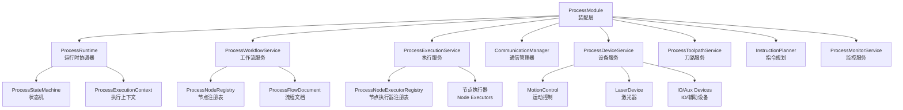
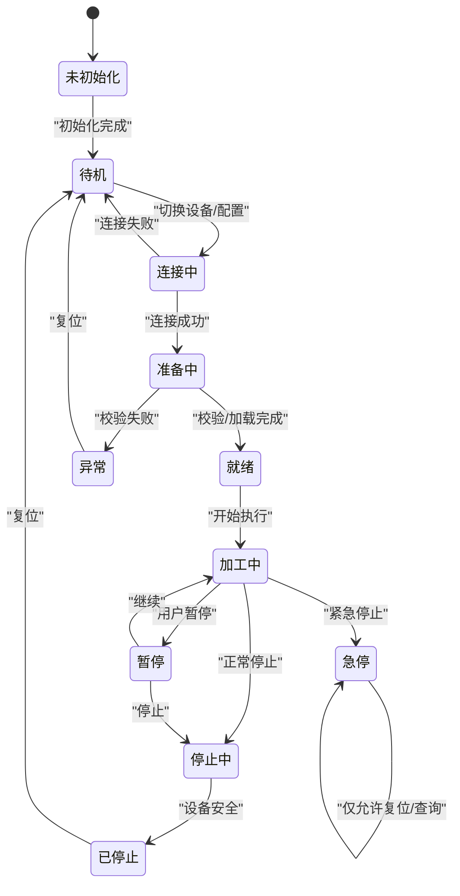
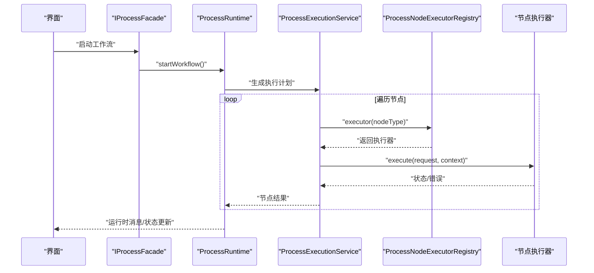
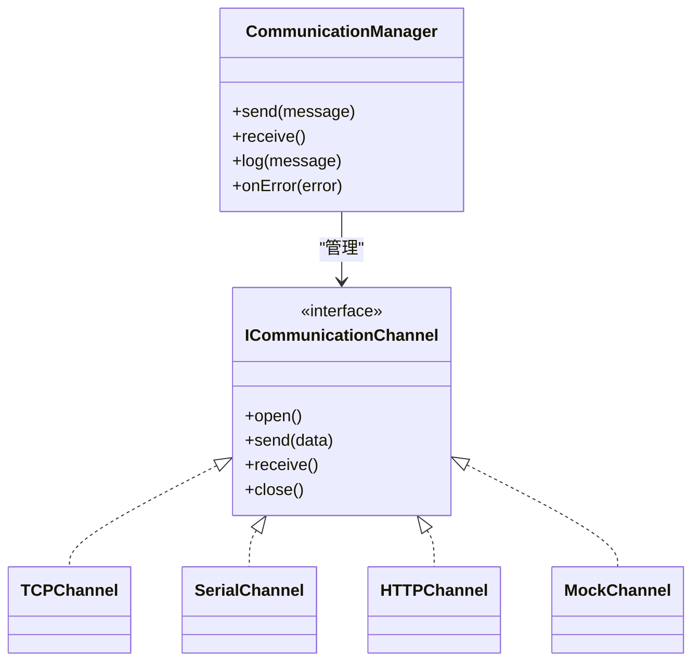
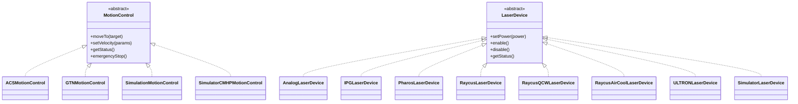
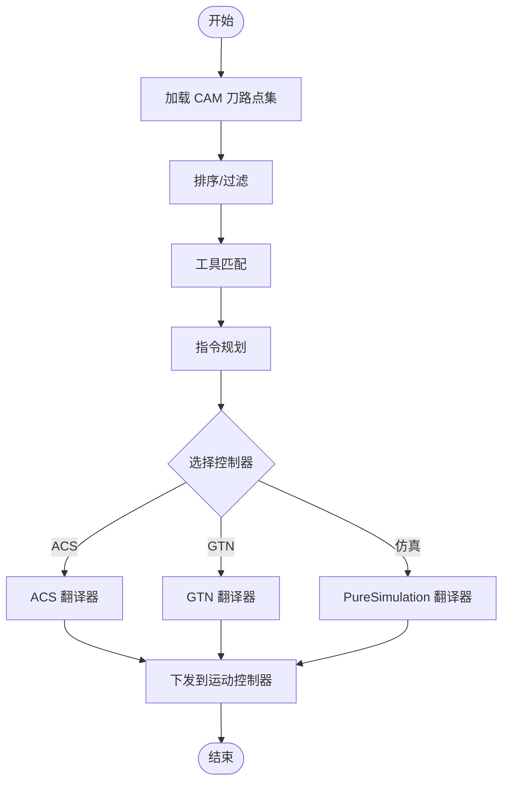
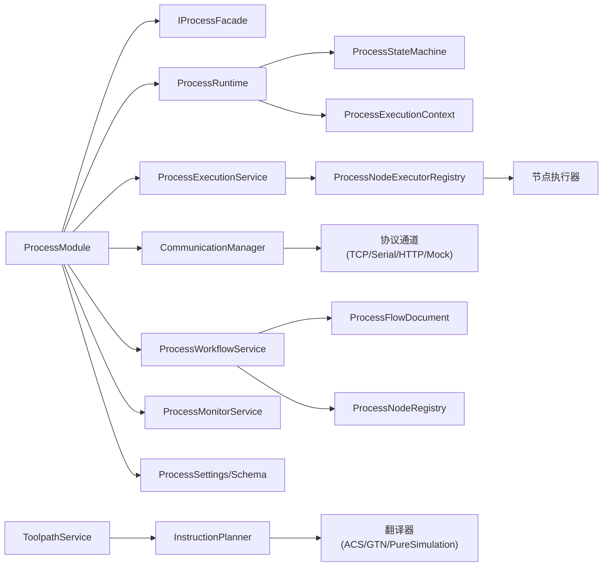

# Process模块

<cite>
**本文引用的文件**
- [process模块框架.md](file://process模块框架.md)
- [process模块重构计划.md](file://process模块重构计划.md)
- [process_module.h](file://src/modules/process/process_module.h)
- [process_module.cpp](file://src/modules/process/process_module.cpp)
- [process_runtime.h](file://src/modules/process/runtime/process_runtime.h)
- [process_runtime.cpp](file://src/modules/process/runtime/process_runtime.cpp)
- [process_state_machine.h](file://src/modules/process/runtime/process_state_machine.h)
- [process_state_machine.cpp](file://src/modules/process/runtime/process_state_machine.cpp)
- [process_execution_context.h](file://src/modules/process/runtime/process_execution_context.h)
- [process_execution_context.cpp](file://src/modules/process/runtime/process_execution_context.cpp)
- [process_workflow_executor.h](file://src/modules/process/execution/process_workflow_executor.h)
- [process_workflow_executor.cpp](file://src/modules/process/execution/process_workflow_executor.cpp)
- [process_execution_service.h](file://src/modules/process/execution/process_execution_service.h)
- [process_execution_service.cpp](file://src/modules/process/execution/process_execution_service.cpp)
- [process_node_executor_registry.h](file://src/modules/process/execution/process_node_executor_registry.h)
- [process_node_executor_registry.cpp](file://src/modules/process/execution/process_node_executor_registry.cpp)
- [i_process_facade.h](file://src/modules/process/i_process_facade.h)
- [communication_manager.h](file://src/modules/process/communication/communication_manager.h)
- [communication_manager.cpp](file://src/modules/process/communication/communication_manager.cpp)
- [communication_channel_base.h](file://src/modules/process/communication/communication_channel_base.h)
- [communication_channel_base.cpp](file://src/modules/process/communication/communication_channel_base.cpp)
- [i_communication_channel.h](file://src/modules/process/communication/i_communication_channel.h)
- [tcp_channel.h](file://src/modules/process/communication/protocols/tcp_channel.h)
- [tcp_channel.cpp](file://src/modules/process/communication/protocols/tcp_channel.cpp)
- [serial_channel.h](file://src/modules/process/communication/protocols/serial_channel.h)
- [serial_channel.cpp](file://src/modules/process/communication/protocols/serial_channel.cpp)
- [http_channel.h](file://src/modules/process/communication/protocols/http_channel.h)
- [http_channel.cpp](file://src/modules/process/communication/protocols/http_channel.cpp)
- [mock_channel.h](file://src/modules/process/communication/protocols/mock_channel.h)
- [mock_channel.cpp](file://src/modules/process/communication/protocols/mock_channel.cpp)
- [motion_control.h](file://src/modules/process/device/MotionControl/motion_control.h)
- [motion_control.cpp](file://src/modules/process/device/MotionControl/motion_control.cpp)
- [acsmotion_control.h](file://src/modules/process/device/MotionControl/acsmotion_control.h)
- [acsmotion_control.cpp](file://src/modules/process/device/MotionControl/acsmotion_control.cpp)
- [gtnmotion_control.h](file://src/modules/process/device/MotionControl/gtnmotion_control.h)
- [gtnmotion_control.cpp](file://src/modules/process/device/MotionControl/gtnmotion_control.cpp)
- [simulatemotion_control.h](file://src/modules/process/device/MotionControl/simulatemotion_control.h)
- [simulatemotion_control.cpp](file://src/modules/process/device/MotionControl/simulatemotion_control.cpp)
- [laser_device.h](file://src/modules/process/device/Laser/laser_device.h)
- [laser_device.cpp](file://src/modules/process/device/Laser/laser_device.cpp)
- [analog_laser_device.h](file://src/modules/process/device/Laser/analog_laser_device.h)
- [analog_laser_device.cpp](file://src/modules/process/device/Laser/analog_laser_device.cpp)
- [ipg_laser_device.h](file://src/modules/process/device/Laser/ipg_laser_device.h)
- [ipg_laser_device.cpp](file://src/modules/process/device/Laser/ipg_laser_device.cpp)
- [pharos_laser_device.h](file://src/modules/process/device/Laser/pharos_laser_device.h)
- [pharos_laser_device.cpp](file://src/modules/process/device/Laser/pharos_laser_device.cpp)
- [raycus_laser_device.h](file://src/modules/process/device/Laser/raycus_laser_device.h)
- [raycus_laser_device.cpp](file://src/modules/process/device/Laser/raycus_laser_device.cpp)
- [ultron_laser_device.h](file://src/modules/process/device/Laser/ultron_laser_device.h)
- [ultron_laser_device.cpp](file://src/modules/process/device/Laser/ultron_laser_device.cpp)
- [simulator_laser_device.h](file://src/modules/process/device/Laser/simulator_laser_device.h)
- [simulator_laser_device.cpp](file://src/modules/process/device/Laser/simulator_laser_device.cpp)
- [process_toolpath_service.h](file://src/modules/process/toolpath/process_toolpath_service.h)
- [process_toolpath_service.cpp](file://src/modules/process/toolpath/process_toolpath_service.cpp)
- [process_toolpath_sorter.h](file://src/modules/process/toolpath/process_toolpath_sorter.h)
- [process_toolpath_sorter.cpp](file://src/modules/process/toolpath/process_toolpath_sorter.cpp)
- [process_tool_matcher.h](file://src/modules/process/toolpath/process_tool_matcher.h)
- [process_tool_matcher.cpp](file://src/modules/process/toolpath/process_tool_matcher.cpp)
- [process_instruction_planner.h](file://src/modules/process/instructions/process_instruction_planner.h)
- [process_instruction_planner.cpp](file://src/modules/process/instructions/process_instruction_planner.cpp)
- [acs_translator.h](file://src/modules/process/instructions/acs_translator.h)
- [acs_translator.cpp](file://src/modules/process/instructions/acs_translator.cpp)
- [gtn_translator.h](file://src/modules/process/instructions/gtn_translator.h)
- [gtn_translator.cpp](file://src/modules/process/instructions/gtn_translator.cpp)
- [pure_simulation_translator.h](file://src/modules/process/instructions/pure_simulation_translator.h)
- [pure_simulation_translator.cpp](file://src/modules/process/instructions/pure_simulation_translator.cpp)
- [i_controller_translator.h](file://src/modules/process/instructions/i_controller_translator.h)
- [process_flow_document.h](file://src/modules/process/workflow/process_flow_document.h)
- [process_flow_document.cpp](file://src/modules/process/workflow/process_flow_document.cpp)
- [process_workflow_service.h](file://src/modules/process/workflow/process_workflow_service.h)
- [process_workflow_service.cpp](file://src/modules/process/workflow/process_workflow_service.cpp)
- [process_node_registry.h](file://src/modules/process/workflow/process_node_registry.h)
- [process_node_registry.cpp](file://src/modules/process/workflow/process_node_registry.cpp)
- [process_node.h](file://src/modules/process/workflow/process_node.h)
- [process_node.cpp](file://src/modules/process/workflow/process_node.cpp)
- [process_monitor_service.h](file://src/modules/process/monitor/process_monitor_service.h)
- [process_monitor_service.cpp](file://src/modules/process/monitor/process_monitor_service.cpp)
- [process_monitor_types.h](file://src/modules/process/monitor/process_monitor_types.h)
- [process_settings.h](file://src/modules/process/settings/process_settings.h)
- [process_settings.cpp](file://src/modules/process/settings/process_settings.cpp)
- [process_settings_schema.h](file://src/modules/process/settings/process_settings_schema.h)
- [process_settings_schema.cpp](file://src/modules/process/settings/process_settings_schema.cpp)
- [commands_process.h](file://src/modules/process/commands/commands_process.h)
- [commands_process.cpp](file://src/modules/process/commands/commands_process.cpp)
- [process_flow_model.h](file://src/modules/process/ui/process_flow_model.h)
- [process_flow_model.cpp](file://src/modules/process/ui/process_flow_model.cpp)
- [process_flow_tree_view.h](file://src/modules/process/ui/process_flow_tree_view.h)
- [process_flow_tree_view.cpp](file://src/modules/process/ui/process_flow_tree_view.cpp)
- [process_node_edit_dialog.h](file://src/modules/process/ui/process_node_edit_dialog.h)
- [process_node_edit_dialog.cpp](file://src/modules/process/ui/process_node_edit_dialog.cpp)
- [widget_laser_control.h](file://src/modules/process/ui/widget_laser_control.h)
- [widget_laser_control.cpp](file://src/modules/process/ui/widget_laser_control.cpp)
- [ribbon_process_tab.h](file://src/modules/process/ui/ribbon_process_tab.h)
- [ribbon_process_tab.cpp](file://src/modules/process/ui/ribbon_process_tab.cpp)
</cite>

## 目录
1. [简介](#简介)
2. [项目结构](#项目结构)
3. [核心组件](#核心组件)
4. [架构总览](#架构总览)
5. [详细组件分析](#详细组件分析)
6. [依赖关系分析](#依赖关系分析)
7. [性能考虑](#性能考虑)
8. [故障排查指南](#故障排查指南)
9. [结论](#结论)
10. [附录](#附录)

## 简介
本文件为 LaserCNC 的 Process 模块技术文档，聚焦设备控制、工艺执行与实时监控系统。文档围绕工作流执行器、执行服务、通信管理器、运动控制器等核心组件展开，解释设备通信协议、运动控制算法、激光功率控制与传感器数据采集机制，并覆盖工艺参数配置、异常处理、状态监控与性能优化策略，同时提供设备集成与工艺调试的实用指南。

## 项目结构
Process 模块位于 src/modules/process 下，采用“功能域+层次化”组织方式，包含运行时、设置、设备、刀路、指令、工作流、执行、通信、监控、UI、命令等子域。模块遵循微内核架构，通过 ProcessModule 作为装配层，对外提供 IProcessFacade 接口，内部以 ProcessRuntime 协调状态机与上下文，驱动各子系统协同工作。

图表来源
- [process_module.h](file://src/modules/process/process_module.h)
- [process_runtime.h](file://src/modules/process/runtime/process_runtime.h)
- [process_state_machine.h](file://src/modules/process/runtime/process_state_machine.h)
- [process_execution_context.h](file://src/modules/process/runtime/process_execution_context.h)
- [process_workflow_service.h](file://src/modules/process/workflow/process_workflow_service.h)
- [process_execution_service.h](file://src/modules/process/execution/process_execution_service.h)
- [process_node_executor_registry.h](file://src/modules/process/execution/process_node_executor_registry.h)
- [process_flow_document.h](file://src/modules/process/workflow/process_flow_document.h)
- [process_node_registry.h](file://src/modules/process/workflow/process_node_registry.h)
- [communication_manager.h](file://src/modules/process/communication/communication_manager.h)
- [motion_control.h](file://src/modules/process/device/MotionControl/motion_control.h)
- [laser_device.h](file://src/modules/process/device/Laser/laser_device.h)
- [process_toolpath_service.h](file://src/modules/process/toolpath/process_toolpath_service.h)
- [process_instruction_planner.h](file://src/modules/process/instructions/process_instruction_planner.h)
- [process_monitor_service.h](file://src/modules/process/monitor/process_monitor_service.h)

章节来源
- [process模块框架.md](file://process模块框架.md)
- [process模块重构计划.md](file://process模块重构计划.md)
- [process_module.h](file://src/modules/process/process_module.h)
- [process_module.cpp](file://src/modules/process/process_module.cpp)

## 核心组件
- 运行时与状态机
  - ProcessRuntime：模块内部协调器，持有状态机与执行上下文，提供启动、暂停、停止、急停等编排接口。
  - ProcessStateMachine：运行状态的唯一事实源，定义待机、准备、加工中、暂停、停止中、异常、急停等状态。
  - ProcessExecutionContext：执行上下文，承载当前运行所需的参数、设备会话、刀路数据等。
- 工作流与执行
  - ProcessWorkflowService：工作流编辑、保存加载、校验与编译入口。
  - ProcessExecutionService：执行命令缓冲与节点执行器，支持暂停/继续/停止/急停的统一取消语义。
  - ProcessNodeExecutorRegistry：按节点类型注册执行器，实现节点副作用的解耦。
- 通信管理器
  - CommunicationManager：统一管理 TCP/串口/HTTP/Mock 通道，提供消息发送、日志与错误上报。
- 设备与控制器
  - MotionControl：抽象运动控制接口，适配 ACS/GTN/仿真等不同控制器。
  - LaserDevice：抽象激光器接口，适配模拟器、IPG、Pharos、Raycus、ULTRON 等品牌。
- 刀路与指令
  - ProcessToolpathService/Sorter/Matcher：刀路排序、过滤与工具匹配。
  - InstructionPlanner 与翻译器：根据控制器类型生成对应指令（ACS/GTN/PureSimulation）。
- 监控与设置
  - ProcessMonitorService：采集与回传运行状态、报警与诊断信息。
  - ProcessSettings/Schema：参数配置与类型化校验，支持单位、范围提示。

章节来源
- [process_runtime.h](file://src/modules/process/runtime/process_runtime.h)
- [process_runtime.cpp](file://src/modules/process/runtime/process_runtime.cpp)
- [process_state_machine.h](file://src/modules/process/runtime/process_state_machine.h)
- [process_state_machine.cpp](file://src/modules/process/runtime/process_state_machine.cpp)
- [process_execution_context.h](file://src/modules/process/runtime/process_execution_context.h)
- [process_execution_context.cpp](file://src/modules/process/runtime/process_execution_context.cpp)
- [process_workflow_service.h](file://src/modules/process/workflow/process_workflow_service.h)
- [process_workflow_service.cpp](file://src/modules/process/workflow/process_workflow_service.cpp)
- [process_execution_service.h](file://src/modules/process/execution/process_execution_service.h)
- [process_execution_service.cpp](file://src/modules/process/execution/process_execution_service.cpp)
- [process_node_executor_registry.h](file://src/modules/process/execution/process_node_executor_registry.h)
- [process_node_executor_registry.cpp](file://src/modules/process/execution/process_node_executor_registry.cpp)
- [communication_manager.h](file://src/modules/process/communication/communication_manager.h)
- [communication_manager.cpp](file://src/modules/process/communication/communication_manager.cpp)
- [motion_control.h](file://src/modules/process/device/MotionControl/motion_control.h)
- [motion_control.cpp](file://src/modules/process/device/MotionControl/motion_control.cpp)
- [laser_device.h](file://src/modules/process/device/Laser/laser_device.h)
- [laser_device.cpp](file://src/modules/process/device/Laser/laser_device.cpp)
- [process_toolpath_service.h](file://src/modules/process/toolpath/process_toolpath_service.h)
- [process_toolpath_service.cpp](file://src/modules/process/toolpath/process_toolpath_service.cpp)
- [process_toolpath_sorter.h](file://src/modules/process/toolpath/process_toolpath_sorter.h)
- [process_toolpath_sorter.cpp](file://src/modules/process/toolpath/process_toolpath_sorter.cpp)
- [process_tool_matcher.h](file://src/modules/process/toolpath/process_tool_matcher.h)
- [process_tool_matcher.cpp](file://src/modules/process/toolpath/process_tool_matcher.cpp)
- [process_instruction_planner.h](file://src/modules/process/instructions/process_instruction_planner.h)
- [process_instruction_planner.cpp](file://src/modules/process/instructions/process_instruction_planner.cpp)
- [acs_translator.h](file://src/modules/process/instructions/acs_translator.h)
- [acs_translator.cpp](file://src/modules/process/instructions/acs_translator.cpp)
- [gtn_translator.h](file://src/modules/process/instructions/gtn_translator.h)
- [gtn_translator.cpp](file://src/modules/process/instructions/gtn_translator.cpp)
- [pure_simulation_translator.h](file://src/modules/process/instructions/pure_simulation_translator.h)
- [pure_simulation_translator.cpp](file://src/modules/process/instructions/pure_simulation_translator.cpp)
- [process_monitor_service.h](file://src/modules/process/monitor/process_monitor_service.h)
- [process_monitor_service.cpp](file://src/modules/process/monitor/process_monitor_service.cpp)
- [process_settings.h](file://src/modules/process/settings/process_settings.h)
- [process_settings.cpp](file://src/modules/process/settings/process_settings.cpp)
- [process_settings_schema.h](file://src/modules/process/settings/process_settings_schema.h)
- [process_settings_schema.cpp](file://src/modules/process/settings/process_settings_schema.cpp)

## 架构总览
Process 模块采用“装配层-运行时-子系统”的分层架构。装配层负责模块生命周期与服务注册；运行时负责状态与上下文；子系统按功能域划分，彼此通过接口解耦协作。

```mermaid
graph TB
subgraph "装配层"
PM["ProcessModule"]
IF["IProcessFacade"]
end
subgraph "运行时"
RT["ProcessRuntime"]
SM["ProcessStateMachine"]
CTX["ProcessExecutionContext"]
end
subgraph "工作流与执行"
WFS["ProcessWorkflowService"]
NES["ProcessNodeExecutorRegistry"]
ES["ProcessExecutionService"]
end
subgraph "设备与控制器"
MCS["MotionControl"]
LDS["LaserDevice"]
IOs["IO/Aux"]
end
subgraph "通信"
CM["CommunicationManager"]
CH_TCP["TCPChannel"]
CH_SERIAL["SerialChannel"]
CH_HTTP["HTTPChannel"]
CH_MOCK["MockChannel"]
end
subgraph "刀路与指令"
TPS["ProcessToolpathService"]
TPSORT["ProcessToolpathSorter"]
TPM["ProcessToolMatch"]
IPL["InstructionPlanner"]
TR_ACS["ACSTranslator"]
TR_GT["GTNTranslator"]
TR_PS["PureSimulationTranslator"]
end
subgraph "监控与设置"
MON["ProcessMonitorService"]
SET["ProcessSettings/Schema"]
end
PM --> RT
PM --> WFS
PM --> ES
PM --> CM
PM --> SET
RT --> SM
RT --> CTX
WFS --> NES
ES --> NES
CM --> CH_TCP
CM --> CH_SERIAL
CM --> CH_HTTP
CM --> CH_MOCK
MCS --> TR_ACS
MCS --> TR_GT
TR_ACS --> IPL
TR_GT --> IPL
TR_PS --> IPL
TPS --> TPSORT
TPS --> TPM
TPM --> IPL
```

图表来源
- [process_module.h](file://src/modules/process/process_module.h)
- [process_runtime.h](file://src/modules/process/runtime/process_runtime.h)
- [process_state_machine.h](file://src/modules/process/runtime/process_state_machine.h)
- [process_execution_context.h](file://src/modules/process/runtime/process_execution_context.h)
- [process_workflow_service.h](file://src/modules/process/workflow/process_workflow_service.h)
- [process_execution_service.h](file://src/modules/process/execution/process_execution_service.h)
- [process_node_executor_registry.h](file://src/modules/process/execution/process_node_executor_registry.h)
- [communication_manager.h](file://src/modules/process/communication/communication_manager.h)
- [tcp_channel.h](file://src/modules/process/communication/protocols/tcp_channel.h)
- [serial_channel.h](file://src/modules/process/communication/protocols/serial_channel.h)
- [http_channel.h](file://src/modules/process/communication/protocols/http_channel.h)
- [mock_channel.h](file://src/modules/process/communication/protocols/mock_channel.h)
- [motion_control.h](file://src/modules/process/device/MotionControl/motion_control.h)
- [laser_device.h](file://src/modules/process/device/Laser/laser_device.h)
- [process_toolpath_service.h](file://src/modules/process/toolpath/process_toolpath_service.h)
- [process_toolpath_sorter.h](file://src/modules/process/toolpath/process_toolpath_sorter.h)
- [process_tool_matcher.h](file://src/modules/process/toolpath/process_tool_matcher.h)
- [process_instruction_planner.h](file://src/modules/process/instructions/process_instruction_planner.h)
- [acs_translator.h](file://src/modules/process/instructions/acs_translator.h)
- [gtn_translator.h](file://src/modules/process/instructions/gtn_translator.h)
- [pure_simulation_translator.h](file://src/modules/process/instructions/pure_simulation_translator.h)
- [process_monitor_service.h](file://src/modules/process/monitor/process_monitor_service.h)
- [process_settings.h](file://src/modules/process/settings/process_settings.h)
- [process_settings_schema.h](file://src/modules/process/settings/process_settings_schema.h)

## 详细组件分析

### 运行时与状态机
- ProcessRuntime
  - 职责：初始化模块、应用外观状态、编排启动/暂停/停止/急停流程；向 UI 发送运行时消息。
  - 关键流程：启动工作流时先进行状态机校验，再读取 CAM 点集、工具匹配、生成执行计划并进入加工态。
- ProcessStateMachine
  - 状态集合：未初始化、待机、连接中、准备中、就绪、加工中、暂停、停止中、已停止、异常、急停。
  - 作用：确保状态转换的原子性与一致性，避免竞态与非法状态。
- ProcessExecutionContext
  - 内容：当前运行参数、设备会话、刀路数据、节点执行上下文等，贯穿整个执行周期。

图表来源
- [process_state_machine.h](file://src/modules/process/runtime/process_state_machine.h)
- [process_state_machine.cpp](file://src/modules/process/runtime/process_state_machine.cpp)
- [process_runtime.h](file://src/modules/process/runtime/process_runtime.h)
- [process_runtime.cpp](file://src/modules/process/runtime/process_runtime.cpp)

章节来源
- [process_runtime.h](file://src/modules/process/runtime/process_runtime.h)
- [process_runtime.cpp](file://src/modules/process/runtime/process_runtime.cpp)
- [process_state_machine.h](file://src/modules/process/runtime/process_state_machine.h)
- [process_state_machine.cpp](file://src/modules/process/runtime/process_state_machine.cpp)
- [process_execution_context.h](file://src/modules/process/runtime/process_execution_context.h)
- [process_execution_context.cpp](file://src/modules/process/runtime/process_execution_context.cpp)

### 工作流执行器与执行服务
- ProcessWorkflowService
  - 职责：工作流文档的编辑、保存、加载、校验与编译；与 ProcessFlowDocument 协同维护流程树。
- ProcessExecutionService
  - 职责：执行命令缓冲与节点执行器；支持暂停/继续/停止/急停的统一取消语义；节点状态通过节点 ID 回写至文档/模型。
- ProcessNodeExecutorRegistry
  - 职责：按节点类型注册执行器，屏蔽 UI 与文档状态，专注节点副作用执行；提供执行器查询与列表。

图表来源
- [process_workflow_service.h](file://src/modules/process/workflow/process_workflow_service.h)
- [process_workflow_service.cpp](file://src/modules/process/workflow/process_workflow_service.cpp)
- [process_execution_service.h](file://src/modules/process/execution/process_execution_service.h)
- [process_execution_service.cpp](file://src/modules/process/execution/process_execution_service.cpp)
- [process_node_executor_registry.h](file://src/modules/process/execution/process_node_executor_registry.h)
- [process_node_executor_registry.cpp](file://src/modules/process/execution/process_node_executor_registry.cpp)

章节来源
- [process_workflow_service.h](file://src/modules/process/workflow/process_workflow_service.h)
- [process_workflow_service.cpp](file://src/modules/process/workflow/process_workflow_service.cpp)
- [process_execution_service.h](file://src/modules/process/execution/process_execution_service.h)
- [process_execution_service.cpp](file://src/modules/process/execution/process_execution_service.cpp)
- [process_node_executor_registry.h](file://src/modules/process/execution/process_node_executor_registry.h)
- [process_node_executor_registry.cpp](file://src/modules/process/execution/process_node_executor_registry.cpp)

### 通信管理器与协议通道
- CommunicationManager
  - 职责：统一管理 TCP/串口/HTTP/Mock 通道；提供消息发送、接收、日志记录与错误上报。
- 协议通道
  - TCPChannel：基于 TCP 的长连接通信，适用于控制器与上位机。
  - SerialChannel：串口通信，用于设备端口直连。
  - HTTPChannel：基于 HTTP 的请求/响应模式，便于远程控制与状态查询。
  - MockChannel：用于测试与仿真，屏蔽真实硬件。

图表来源
- [communication_manager.h](file://src/modules/process/communication/communication_manager.h)
- [communication_manager.cpp](file://src/modules/process/communication/communication_manager.cpp)
- [i_communication_channel.h](file://src/modules/process/communication/i_communication_channel.h)
- [tcp_channel.h](file://src/modules/process/communication/protocols/tcp_channel.h)
- [tcp_channel.cpp](file://src/modules/process/communication/protocols/tcp_channel.cpp)
- [serial_channel.h](file://src/modules/process/communication/protocols/serial_channel.h)
- [serial_channel.cpp](file://src/modules/process/communication/protocols/serial_channel.cpp)
- [http_channel.h](file://src/modules/process/communication/protocols/http_channel.h)
- [http_channel.cpp](file://src/modules/process/communication/protocols/http_channel.cpp)
- [mock_channel.h](file://src/modules/process/communication/protocols/mock_channel.h)
- [mock_channel.cpp](file://src/modules/process/communication/protocols/mock_channel.cpp)

章节来源
- [communication_manager.h](file://src/modules/process/communication/communication_manager.h)
- [communication_manager.cpp](file://src/modules/process/communication/communication_manager.cpp)
- [i_communication_channel.h](file://src/modules/process/communication/i_communication_channel.h)
- [tcp_channel.h](file://src/modules/process/communication/protocols/tcp_channel.h)
- [tcp_channel.cpp](file://src/modules/process/communication/protocols/tcp_channel.cpp)
- [serial_channel.h](file://src/modules/process/communication/protocols/serial_channel.h)
- [serial_channel.cpp](file://src/modules/process/communication/protocols/serial_channel.cpp)
- [http_channel.h](file://src/modules/process/communication/protocols/http_channel.h)
- [http_channel.cpp](file://src/modules/process/communication/protocols/http_channel.cpp)
- [mock_channel.h](file://src/modules/process/communication/protocols/mock_channel.h)
- [mock_channel.cpp](file://src/modules/process/communication/protocols/mock_channel.cpp)

### 运动控制器与激光器设备
- MotionControl
  - 抽象接口：统一运动控制命令与状态查询。
  - 适配器：
    - ACSMotionControl：适配 ACS 控制器。
    - GTNMotionControl：适配 GTN 控制器。
    - SimulationMotionControl/SimulatorCMHP：仿真环境下的运动控制。
- LaserDevice
  - 抽象接口：统一激光功率、开关、保护与诊断。
  - 设备族：
    - AnalogLaserDevice：模拟激光器。
    - IPGLaserDevice：IPG 激光器。
    - PharosLaserDevice：Pharos 激光器。
    - RaycusLaserDevice/RaycusQCWLaserDevice/RaycusAirCoolLaserDevice：Raycus 系列。
    - ULTRONLaserDevice：ULTRON 激光器。
    - SimulatorLaserDevice：仿真激光器。

图表来源
- [motion_control.h](file://src/modules/process/device/MotionControl/motion_control.h)
- [motion_control.cpp](file://src/modules/process/device/MotionControl/motion_control.cpp)
- [acsmotion_control.h](file://src/modules/process/device/MotionControl/acsmotion_control.h)
- [acsmotion_control.cpp](file://src/modules/process/device/MotionControl/acsmotion_control.cpp)
- [gtnmotion_control.h](file://src/modules/process/device/MotionControl/gtnmotion_control.h)
- [gtnmotion_control.cpp](file://src/modules/process/device/MotionControl/gtnmotion_control.cpp)
- [simulatemotion_control.h](file://src/modules/process/device/MotionControl/simulatemotion_control.h)
- [simulatemotion_control.cpp](file://src/modules/process/device/MotionControl/simulatemotion_control.cpp)
- [laser_device.h](file://src/modules/process/device/Laser/laser_device.h)
- [laser_device.cpp](file://src/modules/process/device/Laser/laser_device.cpp)
- [analog_laser_device.h](file://src/modules/process/device/Laser/analog_laser_device.h)
- [analog_laser_device.cpp](file://src/modules/process/device/Laser/analog_laser_device.cpp)
- [ipg_laser_device.h](file://src/modules/process/device/Laser/ipg_laser_device.h)
- [ipg_laser_device.cpp](file://src/modules/process/device/Laser/ipg_laser_device.cpp)
- [pharos_laser_device.h](file://src/modules/process/device/Laser/pharos_laser_device.h)
- [pharos_laser_device.cpp](file://src/modules/process/device/Laser/pharos_laser_device.cpp)
- [raycus_laser_device.h](file://src/modules/process/device/Laser/raycus_laser_device.h)
- [raycus_laser_device.cpp](file://src/modules/process/device/Laser/raycus_laser_device.cpp)
- [ultron_laser_device.h](file://src/modules/process/device/Laser/ultron_laser_device.h)
- [ultron_laser_device.cpp](file://src/modules/process/device/Laser/ultron_laser_device.cpp)
- [simulator_laser_device.h](file://src/modules/process/device/Laser/simulator_laser_device.h)
- [simulator_laser_device.cpp](file://src/modules/process/device/Laser/simulator_laser_device.cpp)

章节来源
- [motion_control.h](file://src/modules/process/device/MotionControl/motion_control.h)
- [motion_control.cpp](file://src/modules/process/device/MotionControl/motion_control.cpp)
- [acsmotion_control.h](file://src/modules/process/device/MotionControl/acsmotion_control.h)
- [acsmotion_control.cpp](file://src/modules/process/device/MotionControl/acsmotion_control.cpp)
- [gtnmotion_control.h](file://src/modules/process/device/MotionControl/gtnmotion_control.h)
- [gtnmotion_control.cpp](file://src/modules/process/device/MotionControl/gtnmotion_control.cpp)
- [simulatemotion_control.h](file://src/modules/process/device/MotionControl/simulatemotion_control.h)
- [simulatemotion_control.cpp](file://src/modules/process/device/MotionControl/simulatemotion_control.cpp)
- [laser_device.h](file://src/modules/process/device/Laser/laser_device.h)
- [laser_device.cpp](file://src/modules/process/device/Laser/laser_device.cpp)
- [analog_laser_device.h](file://src/modules/process/device/Laser/analog_laser_device.h)
- [analog_laser_device.cpp](file://src/modules/process/device/Laser/analog_laser_device.cpp)
- [ipg_laser_device.h](file://src/modules/process/device/Laser/ipg_laser_device.h)
- [ipg_laser_device.cpp](file://src/modules/process/device/Laser/ipg_laser_device.cpp)
- [pharos_laser_device.h](file://src/modules/process/device/Laser/pharos_laser_device.h)
- [pharos_laser_device.cpp](file://src/modules/process/device/Laser/pharos_laser_device.cpp)
- [raycus_laser_device.h](file://src/modules/process/device/Laser/raycus_laser_device.h)
- [raycus_laser_device.cpp](file://src/modules/process/device/Laser/raycus_laser_device.cpp)
- [ultron_laser_device.h](file://src/modules/process/device/Laser/ultron_laser_device.h)
- [ultron_laser_device.cpp](file://src/modules/process/device/Laser/ultron_laser_device.cpp)
- [simulator_laser_device.h](file://src/modules/process/device/Laser/simulator_laser_device.h)
- [simulator_laser_device.cpp](file://src/modules/process/device/Laser/simulator_laser_device.cpp)

### 刀路与指令规划
- ProcessToolpathService/Sorter/Matcher
  - 职责：对 CAM 输出的点集进行排序、过滤与工具匹配，确保执行顺序与设备能力一致。
- InstructionPlanner 与翻译器
  - 职责：根据控制器类型生成对应指令序列；支持 PureSimulation、ACS、GTN 翻译器。
  - 翻译器：
    - PureSimulationTranslator：纯仿真翻译器，用于离线验证。
    - ACSTranslator：ACS 控制器翻译器。
    - GTNTranslator：GTN 控制器翻译器。

图表来源
- [process_toolpath_service.h](file://src/modules/process/toolpath/process_toolpath_service.h)
- [process_toolpath_service.cpp](file://src/modules/process/toolpath/process_toolpath_service.cpp)
- [process_toolpath_sorter.h](file://src/modules/process/toolpath/process_toolpath_sorter.h)
- [process_toolpath_sorter.cpp](file://src/modules/process/toolpath/process_toolpath_sorter.cpp)
- [process_tool_matcher.h](file://src/modules/process/toolpath/process_tool_matcher.h)
- [process_tool_matcher.cpp](file://src/modules/process/toolpath/process_tool_matcher.cpp)
- [process_instruction_planner.h](file://src/modules/process/instructions/process_instruction_planner.h)
- [process_instruction_planner.cpp](file://src/modules/process/instructions/process_instruction_planner.cpp)
- [acs_translator.h](file://src/modules/process/instructions/acs_translator.h)
- [acs_translator.cpp](file://src/modules/process/instructions/acs_translator.cpp)
- [gtn_translator.h](file://src/modules/process/instructions/gtn_translator.h)
- [gtn_translator.cpp](file://src/modules/process/instructions/gtn_translator.cpp)
- [pure_simulation_translator.h](file://src/modules/process/instructions/pure_simulation_translator.h)
- [pure_simulation_translator.cpp](file://src/modules/process/instructions/pure_simulation_translator.cpp)

章节来源
- [process_toolpath_service.h](file://src/modules/process/toolpath/process_toolpath_service.h)
- [process_toolpath_service.cpp](file://src/modules/process/toolpath/process_toolpath_service.cpp)
- [process_toolpath_sorter.h](file://src/modules/process/toolpath/process_toolpath_sorter.h)
- [process_toolpath_sorter.cpp](file://src/modules/process/toolpath/process_toolpath_sorter.cpp)
- [process_tool_matcher.h](file://src/modules/process/toolpath/process_tool_matcher.h)
- [process_tool_matcher.cpp](file://src/modules/process/toolpath/process_tool_matcher.cpp)
- [process_instruction_planner.h](file://src/modules/process/instructions/process_instruction_planner.h)
- [process_instruction_planner.cpp](file://src/modules/process/instructions/process_instruction_planner.cpp)
- [acs_translator.h](file://src/modules/process/instructions/acs_translator.h)
- [acs_translator.cpp](file://src/modules/process/instructions/acs_translator.cpp)
- [gtn_translator.h](file://src/modules/process/instructions/gtn_translator.h)
- [gtn_translator.cpp](file://src/modules/process/instructions/gtn_translator.cpp)
- [pure_simulation_translator.h](file://src/modules/process/instructions/pure_simulation_translator.h)
- [pure_simulation_translator.cpp](file://src/modules/process/instructions/pure_simulation_translator.cpp)

### 监控与设置
- ProcessMonitorService
  - 职责：采集运行状态、报警与诊断信息，统一上报给 UI 与日志系统。
- ProcessSettings/Schema
  - 职责：参数配置与类型化校验，支持单位、范围提示与持久化。

章节来源
- [process_monitor_service.h](file://src/modules/process/monitor/process_monitor_service.h)
- [process_monitor_service.cpp](file://src/modules/process/monitor/process_monitor_service.cpp)
- [process_settings.h](file://src/modules/process/settings/process_settings.h)
- [process_settings.cpp](file://src/modules/process/settings/process_settings.cpp)
- [process_settings_schema.h](file://src/modules/process/settings/process_settings_schema.h)
- [process_settings_schema.cpp](file://src/modules/process/settings/process_settings_schema.cpp)

## 依赖关系分析
- 组件耦合
  - ProcessModule 作为装配层，向上提供 IProcessFacade，向下协调运行时与各子系统。
  - ProcessRuntime 与 ProcessStateMachine 强耦合，但通过 ProcessExecutionContext 解耦其他子系统。
  - 执行服务与节点执行器通过注册表解耦，便于扩展新节点类型。
  - 通信管理器与协议通道通过接口解耦，便于替换与扩展。
- 外部依赖
  - 与 CAM 模块通过 ToolpathExportSnapshot 交互，保持无 OCC 依赖。
  - 与 UI 层通过模型与对话框交互，避免直接访问底层实现。

图表来源
- [process_module.h](file://src/modules/process/process_module.h)
- [process_runtime.h](file://src/modules/process/runtime/process_runtime.h)
- [process_state_machine.h](file://src/modules/process/runtime/process_state_machine.h)
- [process_execution_context.h](file://src/modules/process/runtime/process_execution_context.h)
- [process_execution_service.h](file://src/modules/process/execution/process_execution_service.h)
- [process_node_executor_registry.h](file://src/modules/process/execution/process_node_executor_registry.h)
- [process_workflow_service.h](file://src/modules/process/workflow/process_workflow_service.h)
- [process_flow_document.h](file://src/modules/process/workflow/process_flow_document.h)
- [process_node_registry.h](file://src/modules/process/workflow/process_node_registry.h)
- [communication_manager.h](file://src/modules/process/communication/communication_manager.h)
- [process_toolpath_service.h](file://src/modules/process/toolpath/process_toolpath_service.h)
- [process_instruction_planner.h](file://src/modules/process/instructions/process_instruction_planner.h)
- [acs_translator.h](file://src/modules/process/instructions/acs_translator.h)
- [gtn_translator.h](file://src/modules/process/instructions/gtn_translator.h)
- [pure_simulation_translator.h](file://src/modules/process/instructions/pure_simulation_translator.h)

章节来源
- [process_module.h](file://src/modules/process/process_module.h)
- [process_runtime.h](file://src/modules/process/runtime/process_runtime.h)
- [process_state_machine.h](file://src/modules/process/runtime/process_state_machine.h)
- [process_execution_context.h](file://src/modules/process/runtime/process_execution_context.h)
- [process_execution_service.h](file://src/modules/process/execution/process_execution_service.h)
- [process_node_executor_registry.h](file://src/modules/process/execution/process_node_executor_registry.h)
- [process_workflow_service.h](file://src/modules/process/workflow/process_workflow_service.h)
- [process_flow_document.h](file://src/modules/process/workflow/process_flow_document.h)
- [process_node_registry.h](file://src/modules/process/workflow/process_node_registry.h)
- [communication_manager.h](file://src/modules/process/communication/communication_manager.h)
- [process_toolpath_service.h](file://src/modules/process/toolpath/process_toolpath_service.h)
- [process_instruction_planner.h](file://src/modules/process/instructions/process_instruction_planner.h)
- [acs_translator.h](file://src/modules/process/instructions/acs_translator.h)
- [gtn_translator.h](file://src/modules/process/instructions/gtn_translator.h)
- [pure_simulation_translator.h](file://src/modules/process/instructions/pure_simulation_translator.h)

## 性能考虑
- 执行解耦与异步化
  - 通过节点执行器注册表与执行服务，将节点副作用解耦，减少主线程阻塞。
  - 通信通道采用异步收发与队列缓冲，降低 I/O 阻塞风险。
- 指令规划与批处理
  - InstructionPlanner 将连续运动合并，减少指令数量与控制器开销。
  - 刀路排序与过滤减少无效移动，提升执行效率。
- 状态机与上下文
  - ProcessStateMachine 保证状态转换原子性，避免重复计算与资源争用。
  - ProcessExecutionContext 作为轻量上下文，避免频繁拷贝与深拷贝。
- 监控与诊断
  - ProcessMonitorService 采集关键指标，结合日志系统进行性能分析与瓶颈定位。

## 故障排查指南
- 异常处理
  - 执行服务与节点执行器捕获所有异常，防止异常逃逸线程或 Qt 回调栈；错误通过错误码与消息上报。
- 急停与安全态
  - 急停触发后，立即进入急停状态，强制关闭激光/IO 并停止运动控制器，等待人工复位。
- 通信问题
  - 通过 CommunicationManager 日志定位通道状态、消息格式与超时；必要时切换到 Mock 通道进行隔离测试。
- 设备连接
  - 检查 MotionControl/LaserDevice 的连接状态与握手协议；确认设备固件版本与驱动安装正确。
- 参数校验
  - 使用 ProcessSettings/Schema 的类型化校验，确保单位与范围符合设备要求。

章节来源
- [process_execution_service.h](file://src/modules/process/execution/process_execution_service.h)
- [process_execution_service.cpp](file://src/modules/process/execution/process_execution_service.cpp)
- [process_node_executor_registry.h](file://src/modules/process/execution/process_node_executor_registry.h)
- [process_node_executor_registry.cpp](file://src/modules/process/execution/process_node_executor_registry.cpp)
- [process_state_machine.h](file://src/modules/process/runtime/process_state_machine.h)
- [process_state_machine.cpp](file://src/modules/process/runtime/process_state_machine.cpp)
- [communication_manager.h](file://src/modules/process/communication/communication_manager.h)
- [communication_manager.cpp](file://src/modules/process/communication/communication_manager.cpp)
- [process_settings.h](file://src/modules/process/settings/process_settings.h)
- [process_settings.cpp](file://src/modules/process/settings/process_settings.cpp)
- [process_settings_schema.h](file://src/modules/process/settings/process_settings_schema.h)
- [process_settings_schema.cpp](file://src/modules/process/settings/process_settings_schema.cpp)

## 结论
Process 模块通过清晰的分层与解耦设计，实现了从工作流编辑到执行、从设备控制到实时监控的完整闭环。运行时与状态机确保了执行过程的可控与可观测，执行服务与节点执行器提供了良好的扩展性，通信管理器与多协议通道满足多样化的设备接入需求。配合完善的参数配置、异常处理与性能优化策略，模块能够稳定支撑激光加工的复杂场景。

## 附录
- 设备集成步骤
  - 在设置页选择设备类型与控制器型号，配置通信参数（IP/端口、串口号、波特率等）。
  - 通过 ProcessDeviceService 建立设备会话，验证连接与握手。
  - 在工作流中添加节点并配置参数，使用仿真运行验证逻辑正确性。
- 工艺调试建议
  - 先进行低功率与低速测试，逐步提升至目标参数。
  - 使用 ProcessMonitorService 观察温度、电流、功率等关键指标。
  - 通过 UI 的节点编辑对话框调整参数，实时预览效果。