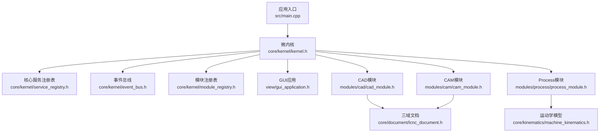
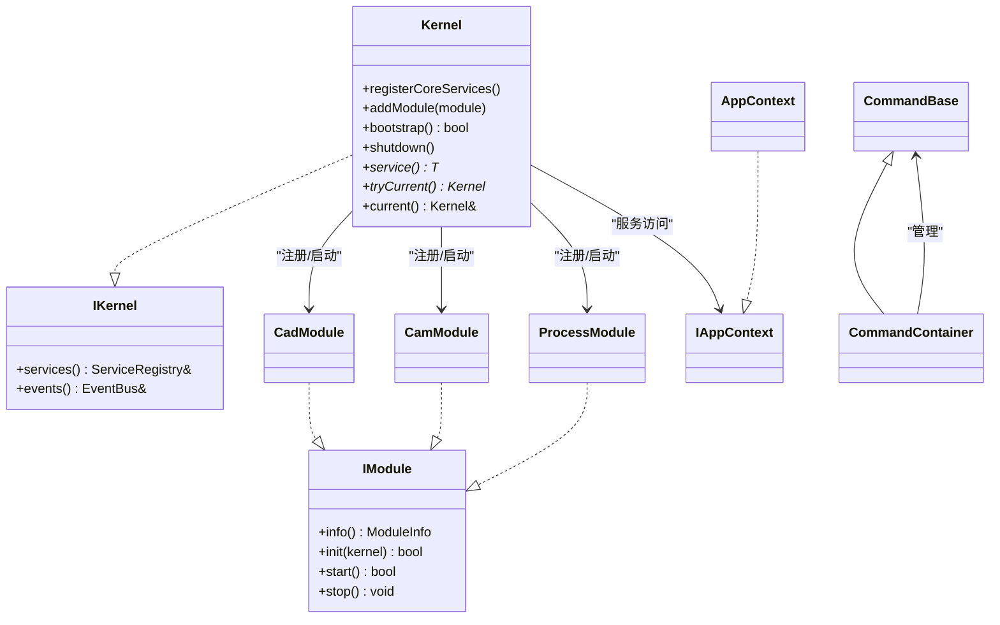
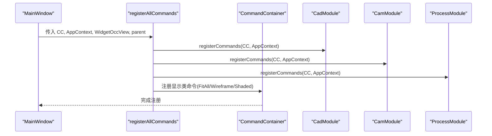
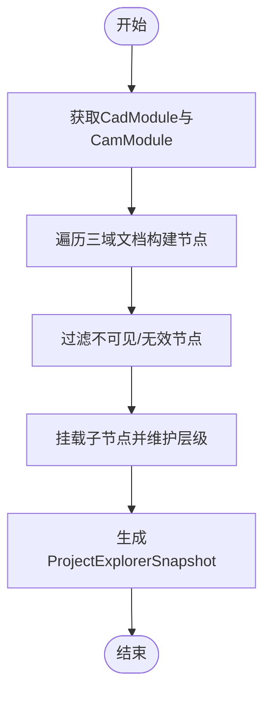
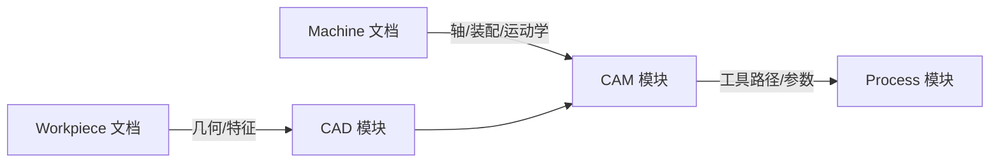
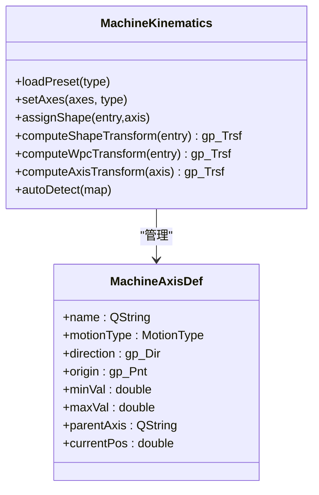
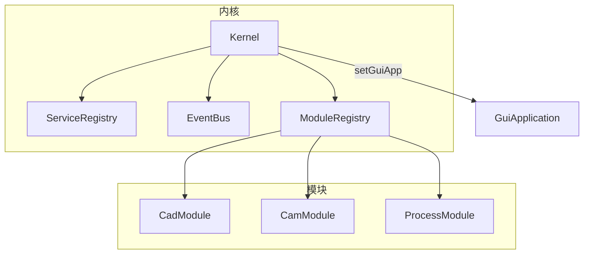

# 代码规范

<cite>
**本文档引用的文件**
- [src/main.cpp](file://src/main.cpp)
- [src/core/kernel/kernel.h](file://src/core/kernel/kernel.h)
- [src/core/kernel/i_kernel.h](file://src/core/kernel/i_kernel.h)
- [src/core/kernel/i_module.h](file://src/core/kernel/i_module.h)
- [src/app/app_context.h](file://src/app/app_context.h)
- [src/app/app_command_context.h](file://src/app/app_command_context.h)
- [src/app/command_registry.h](file://src/app/command_registry.h)
- [src/core/command/commands_api.h](file://src/core/command/commands_api.h)
- [src/app/project_explorer_model.h](file://src/app/project_explorer_model.h)
- [src/core/document/lcnc_document.h](file://src/core/document/lcnc_document.h)
- [src/modules/cad/cad_module.h](file://src/modules/cad/cad_module.h)
- [src/modules/cam/cam_module.h](file://src/modules/cam/cam_module.h)
- [src/modules/process/process_module.h](file://src/modules/process/process_module.h)
- [src/view/gui_application.h](file://src/view/gui_application.h)
- [src/core/kinematics/machine_kinematics.h](file://src/core/kinematics/machine_kinematics.h)
- [src/core/project/project_types.h](file://src/core/project/project_types.h)
</cite>

## 目录
1. [引言](#引言)
2. [项目结构](#项目结构)
3. [核心组件](#核心组件)
4. [架构总览](#架构总览)
5. [详细组件分析](#详细组件分析)
6. [依赖关系分析](#依赖关系分析)
7. [性能考量](#性能考量)
8. [故障排查指南](#故障排查指南)
9. [结论](#结论)
10. [附录](#附录)

## 引言
本文件面向LaserCNC项目的开发者，系统化制定代码规范与架构边界规则，覆盖以下方面：
- 编码标准与命名约定（snake_case、PascalCase、camelCase）
- 头文件组织与include顺序
- 三域文档语义（工件Workpiece、机台Machine、CAM）与模块编排原则
- 算法库设计与命令系统规范
- ProjectExplorer节点管理与树形结构
- 最佳实践与常见问题排查

本规范以现有代码为依据，结合微内核框架、模块化边界与Qt对象模型，形成可落地的工程实践指导。

## 项目结构
LaserCNC采用“微内核 + 业务模块”的分层架构：
- 应用入口与生命周期管理：main.cpp、core/kernel
- 应用上下文与命令系统：app/*、core/command
- 三域文档与几何内核：core/document、core/kinematics、view/*
- 业务模块：modules/cad、modules/cam、modules/process
- 工具与配置：core/settings、3rd、resources

**图表来源**
- [src/main.cpp:33-135](file://src/main.cpp#L33-L135)
- [src/core/kernel/kernel.h:37-146](file://src/core/kernel/kernel.h#L37-L146)
- [src/view/gui_application.h:17-46](file://src/view/gui_application.h#L17-L46)
- [src/modules/cad/cad_module.h:45-306](file://src/modules/cad/cad_module.h#L45-L306)
- [src/modules/cam/cam_module.h:64-421](file://src/modules/cam/cam_module.h#L64-L421)
- [src/modules/process/process_module.h:35-131](file://src/modules/process/process_module.h#L35-L131)
- [src/core/document/lcnc_document.h:28-157](file://src/core/document/lcnc_document.h#L28-L157)
- [src/core/kinematics/machine_kinematics.h:39-106](file://src/core/kinematics/machine_kinematics.h#L39-L106)

**章节来源**
- [src/main.cpp:33-135](file://src/main.cpp#L33-L135)
- [src/core/kernel/kernel.h:18-36](file://src/core/kernel/kernel.h#L18-L36)

## 核心组件
- 微内核Kernel：统一注册核心服务、模块生命周期管理与事件总线；提供静态入口访问全局能力。
- 应用上下文IAppContext/AppContext：封装UI与模块访问的统一入口，避免全局单例。
- 命令系统CommandBase/CommandContainer：命令注册与状态刷新，支持Action驱动。
- 三域文档LcncDocument：基于OCC/XCAF的实体存储与树形结构管理。
- 业务模块：CadModule、CamModule、ProcessModule，分别负责CAD建模、CAM路径与Process执行。

**章节来源**
- [src/core/kernel/kernel.h:37-146](file://src/core/kernel/kernel.h#L37-L146)
- [src/app/app_context.h:17-47](file://src/app/app_context.h#L17-L47)
- [src/core/command/commands_api.h:20-76](file://src/core/command/commands_api.h#L20-L76)
- [src/core/document/lcnc_document.h:28-157](file://src/core/document/lcnc_document.h#L28-L157)
- [src/modules/cad/cad_module.h:45-306](file://src/modules/cad/cad_module.h#L45-L306)
- [src/modules/cam/cam_module.h:64-421](file://src/modules/cam/cam_module.h#L64-L421)
- [src/modules/process/process_module.h:35-131](file://src/modules/process/process_module.h#L35-L131)

## 架构总览
微内核框架强调“模块解耦、依赖可控、生命周期清晰”。模块间通过Kernel的ServiceRegistry与EventBus交互，避免反向依赖。

**图表来源**
- [src/core/kernel/i_kernel.h:26-34](file://src/core/kernel/i_kernel.h#L26-L34)
- [src/core/kernel/kernel.h:37-146](file://src/core/kernel/kernel.h#L37-L146)
- [src/core/kernel/i_module.h:49-73](file://src/core/kernel/i_module.h#L49-L73)
- [src/app/app_context.h:17-47](file://src/app/app_context.h#L17-L47)
- [src/core/command/commands_api.h:20-76](file://src/core/command/commands_api.h#L20-L76)

## 详细组件分析

### 命令系统规范
- 命令基类CommandBase：每个命令拥有一个QAction，包含图标、文本、快捷键；execute为纯虚函数，子类实现具体逻辑。
- 命令容器CommandContainer：按名称注册命令，提供查找与批量状态刷新。
- 命令注册流程：MainWindow创建AppContext与CommandContainer后，调用registerAllCommands集中注册各模块命令，并将显示类命令连接至occView。

**图表来源**
- [src/app/command_registry.h:26-29](file://src/app/command_registry.h#L26-L29)
- [src/core/command/commands_api.h:52-76](file://src/core/command/commands_api.h#L52-L76)

**章节来源**
- [src/core/command/commands_api.h:20-76](file://src/core/command/commands_api.h#L20-L76)
- [src/app/command_registry.h:26-29](file://src/app/command_registry.h#L26-L29)

### ProjectExplorer节点管理
- 节点类型枚举ProjectExplorerNodeKind：覆盖Workpiece、Machine、Toolpath三大域的根节点与子节点。
- 节点数据结构ProjectExplorerNode：包含显示名、条目entry、层级关系、勾选状态、工具提示等。
- 快照结构ProjectExplorerSnapshot：根节点列表，用于UI重建树形结构。
- 构建函数ProjectExplorerModel::build：聚合CadModule与CamModule的数据生成快照。

**图表来源**
- [src/app/project_explorer_model.h:63-72](file://src/app/project_explorer_model.h#L63-L72)

**章节来源**
- [src/app/project_explorer_model.h:18-72](file://src/app/project_explorer_model.h#L18-L72)

### 三域文档语义与模块编排
- 三域文档：Workpiece（工件）、Machine（机台）、Cam（CAM数据）由LcncProjectManager与LcncDocument协同管理。
- 模块依赖：cad ← cam ← process；Kernel通过拓扑排序保证依赖先于被依赖模块初始化。
- 文档实体分类：LcncDocument::EntityKind区分Workpiece/Machine/Auxiliary/Cam，支持树形导入与层次化显示。

**图表来源**
- [src/core/document/lcnc_document.h:33-38](file://src/core/document/lcnc_document.h#L33-L38)
- [src/modules/cad/cad_module.h:121-128](file://src/modules/cad/cad_module.h#L121-L128)
- [src/modules/cam/cam_module.h:109-113](file://src/modules/cam/cam_module.h#L109-L113)
- [src/modules/process/process_module.h:47-50](file://src/modules/process/process_module.h#L47-L50)

**章节来源**
- [src/core/document/lcnc_document.h:28-157](file://src/core/document/lcnc_document.h#L28-L157)
- [src/modules/cad/cad_module.h:121-128](file://src/modules/cad/cad_module.h#L121-L128)
- [src/modules/cam/cam_module.h:109-113](file://src/modules/cam/cam_module.h#L109-L113)
- [src/modules/process/process_module.h:47-50](file://src/modules/process/process_module.h#L47-L50)

### 算法库设计与运动学模型
- MachineKinematics：定义轴类型、运动学轴、装配映射与变换计算；支持自动检测轴分配与工作台安装。
- CAM模块工具路径：LaserToolpath与相关参数（平滑角、面分类、回退步长等）；支持轮廓可见性与图层管理。
- Process模块：运动控制、仿真、IO与流程执行；通过ProcessFlowDocument管理流程图。

**图表来源**
- [src/core/kinematics/machine_kinematics.h:15-106](file://src/core/kinematics/machine_kinematics.h#L15-L106)

**章节来源**
- [src/core/kinematics/machine_kinematics.h:39-106](file://src/core/kinematics/machine_kinematics.h#L39-L106)
- [src/modules/cam/cam_module.h:227-286](file://src/modules/cam/cam_module.h#L227-L286)
- [src/modules/process/process_module.h:86-89](file://src/modules/process/process_module.h#L86-L89)

## 依赖关系分析
- 模块依赖：Kernel在bootstrap阶段进行拓扑排序，确保cad先于cam，cam先于process初始化。
- 反向依赖规避：core不依赖view，GuiApplication由main创建并通过Kernel.setGuiApp注入。
- 服务访问：模块通过IKernel.services()获取其他模块/服务的弱引用，避免强耦合。

**图表来源**
- [src/core/kernel/kernel.h:37-146](file://src/core/kernel/kernel.h#L37-L146)
- [src/view/gui_application.h:17-46](file://src/view/gui_application.h#L17-L46)

**章节来源**
- [src/core/kernel/kernel.h:52-88](file://src/core/kernel/kernel.h#L52-L88)
- [src/main.cpp:85-104](file://src/main.cpp#L85-L104)

## 性能考量
- 局部刷新：CamModule通过pose→cam自更新的定时器合并刷新，限制刷新频率，避免频繁重绘。
- 轴变换链：MachineKinematics按轴链路计算变换，减少重复计算。
- 渲染质量：GuiApplication支持按域应用渲染配置，降低不必要的重绘成本。

**章节来源**
- [src/modules/cam/cam_module.h:411-420](file://src/modules/cam/cam_module.h#L411-L420)
- [src/core/kinematics/machine_kinematics.h:75-82](file://src/core/kinematics/machine_kinematics.h#L75-L82)
- [src/view/gui_application.h:30-35](file://src/view/gui_application.h#L30-L35)

## 故障排查指南
- 启动失败：检查Kernel::bootstrap返回值与日志；确认模块依赖配置正确。
- 命令不可用：通过CommandContainer::updateAllStates刷新；检查IAppContext状态。
- 文档树异常：检查LcncDocument的entityLabels与TreeSnapshot一致性；确认Open/Abort/Commit命令配对。
- 运动学错误：校验MachineKinematics的轴定义与装配映射；确认autoDetect结果与实际装配一致。

**章节来源**
- [src/main.cpp:110-114](file://src/main.cpp#L110-L114)
- [src/core/command/commands_api.h:70-72](file://src/core/command/commands_api.h#L70-L72)
- [src/core/document/lcnc_document.h:79-81](file://src/core/document/lcnc_document.h#L79-L81)
- [src/core/kinematics/machine_kinematics.h:87-91](file://src/core/kinematics/machine_kinematics.h#L87-L91)

## 结论
本规范以微内核为核心，明确模块边界与交互方式，统一命令系统与节点管理，规范三域文档语义与命名约定。遵循上述规则可提升代码一致性、可维护性与扩展性。

## 附录

### 编码标准与命名约定
- 文件命名
  - 头文件：*.h，小写目录+驼峰类名，如src/modules/cad/cad_module.h
  - 实现文件：*.cpp，与头文件同名，如src/modules/cad/cad_module.cpp
- 类与接口
  - 类名：PascalCase，如LcncDocument、CamModule
  - 接口：IClass形式，如IKernel、IModule、IAppContext
- 成员变量与字段
  - 私有成员：m_xxx，如m_initialized、m_guiApp
  - 静态常量：kXxx，如kInvalidDocumentId
- 函数与方法
  - 公共方法：PascalCase，如generateToolpath、setAxisPosition
  - 内部辅助：snake_case，如refreshDisplay、ensureAcCenterCalibrationAvailable
- 命名空间
  - 顶层命名空间：lcnc
  - 模块命名空间：lcnc::cam、lcnc::process等
- 宏与枚举
  - 枚举类：enum class，如ProjectDomain、ProjectDirtyFlag
  - 枚举值：PascalCase，如Workpiece、Machine
- 常量与配置
  - 配置项：snake_case，如smooth_angle、use_face_classification

**章节来源**
- [src/core/document/lcnc_document.h:33-38](file://src/core/document/lcnc_document.h#L33-L38)
- [src/modules/cam/cam_module.h:72-77](file://src/modules/cam/cam_module.h#L72-L77)
- [src/core/project/project_types.h:15-20](file://src/core/project/project_types.h#L15-L20)

### 头文件组织与include顺序
- 优先顺序
  1) Qt核心头文件（如<QObject>、<QString>）
  2) Qt图形/OpenGL头文件（如<QApplication>、<QSurfaceFormat>）
  3) 3rd-party头文件（如OCC、magic_enum、spdlog）
  4) 项目内部头文件（按层级从低到高）
- 示例顺序
  - Qt → 3rd → 项目内部
  - 项目内部按core → view → app → modules分层
- 前向声明
  - 在.h中尽量使用前置声明，减少编译依赖
- 头文件保护
  - 使用#pragma once

**章节来源**
- [src/main.cpp:1-14](file://src/main.cpp#L1-L14)
- [src/core/kernel/kernel.h:8-11](file://src/core/kernel/kernel.h#L8-L11)

### 三域文档与模块编排原则
- Workpiece域
  - 负责几何建模与特征管理，提供实体增删改与草图功能
  - 通过CadModule暴露API，支持预览与工具链
- Machine域
  - 负责机台装配、轴定义与运动学绑定
  - 通过CamModule加载/卸载机台，设置轴原点与限位
- Cam域
  - 生成工具路径、设置参数、显示轮廓与法向
  - 与Process域共享轴定义，支持导出与仿真
- 模块编排
  - 依赖顺序：cad → cam → process
  - 通过Kernel::bootstrap进行拓扑排序与生命周期管理

**章节来源**
- [src/modules/cad/cad_module.h:28-44](file://src/modules/cad/cad_module.h#L28-L44)
- [src/modules/cam/cam_module.h:48-63](file://src/modules/cam/cam_module.h#L48-L63)
- [src/modules/process/process_module.h:28-35](file://src/modules/process/process_module.h#L28-L35)
- [src/main.cpp:106-108](file://src/main.cpp#L106-L108)

### 算法库设计最佳实践
- 数据结构
  - 使用std::unique_ptr/std::shared_ptr管理生命周期，避免裸指针
  - 将可替换组件抽象为接口（如IKernel、IModule），便于测试与扩展
- 参数传递
  - 大对象使用const引用或移动语义，避免不必要的拷贝
- 错误处理
  - 返回布尔值或结果类型，配合日志输出错误信息
- 可观测性
  - 通过EventBus发布状态变化，命令系统统一刷新UI

**章节来源**
- [src/core/kernel/i_kernel.h:10-25](file://src/core/kernel/i_kernel.h#L10-L25)
- [src/core/command/commands_api.h:20-45](file://src/core/command/commands_api.h#L20-L45)

### 命令系统规范最佳实践
- 命令职责单一：每个命令聚焦一个UI动作
- 动作状态：根据上下文动态启用/禁用，通过CommandContainer统一刷新
- 事件驱动：命令执行后触发相关信号，通知UI与其它模块
- 上下文注入：IAppContext提供稳定的模块访问入口，避免硬编码依赖

**章节来源**
- [src/core/command/commands_api.h:12-31](file://src/core/command/commands_api.h#L12-L31)
- [src/app/app_command_context.h:22-50](file://src/app/app_command_context.h#L22-L50)

### ProjectExplorer节点管理最佳实践
- 节点构建
  - 以三域文档为数据源，按节点类型映射到ProjectExplorerNodeKind
  - 维护父子关系与选择/可见性状态
- 快照生成
  - 通过ProjectExplorerModel::build一次性生成roots，避免多次遍历
- UI同步
  - 监听模块信号（如documentModified、selectionChanged）触发重建

**章节来源**
- [src/app/project_explorer_model.h:35-67](file://src/app/project_explorer_model.h#L35-L67)