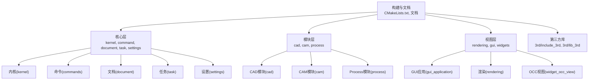
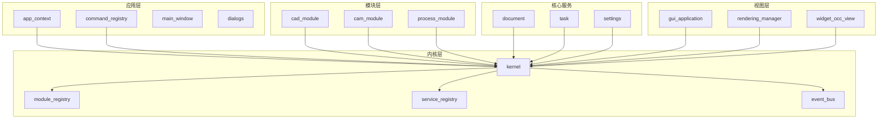
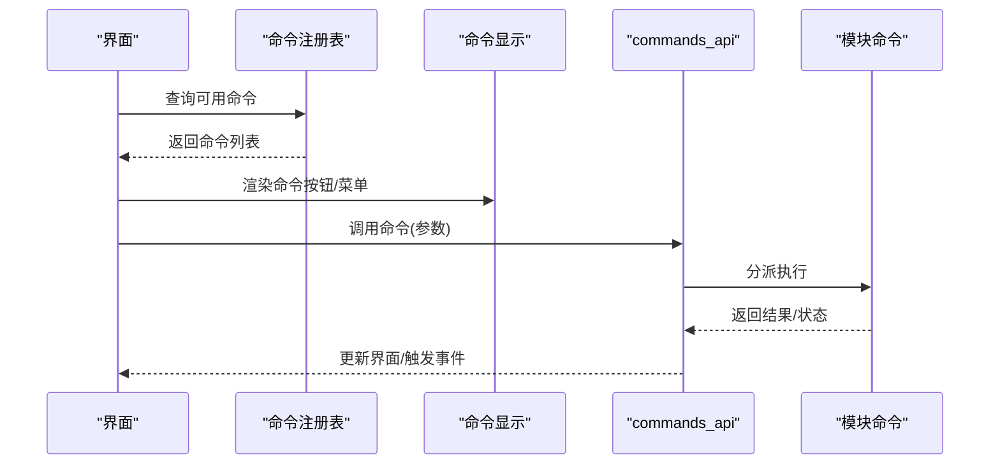
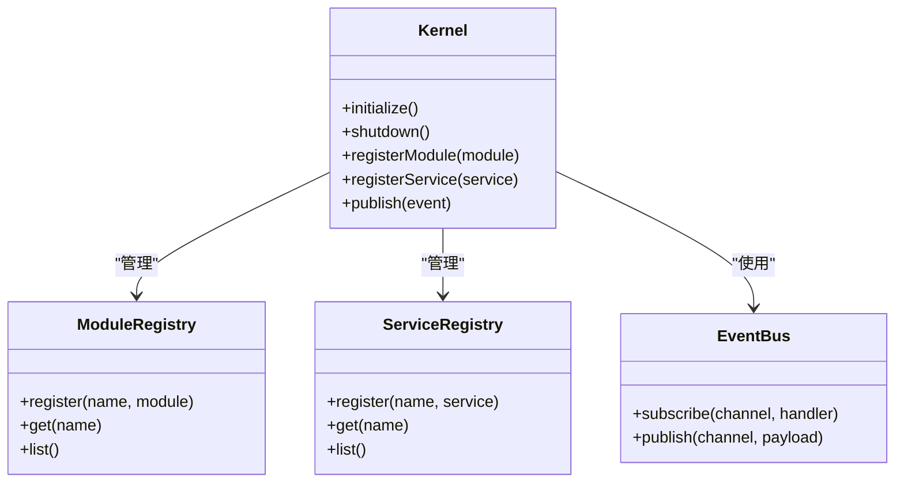
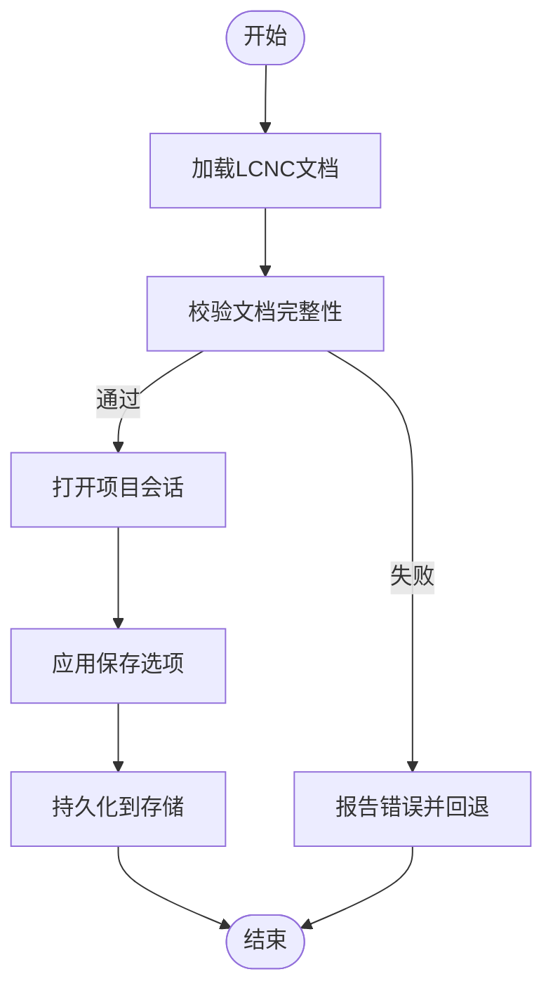
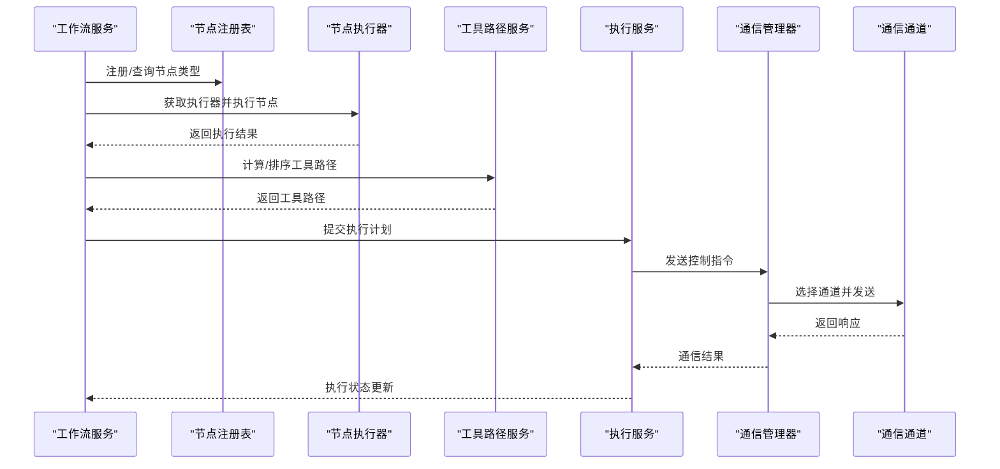
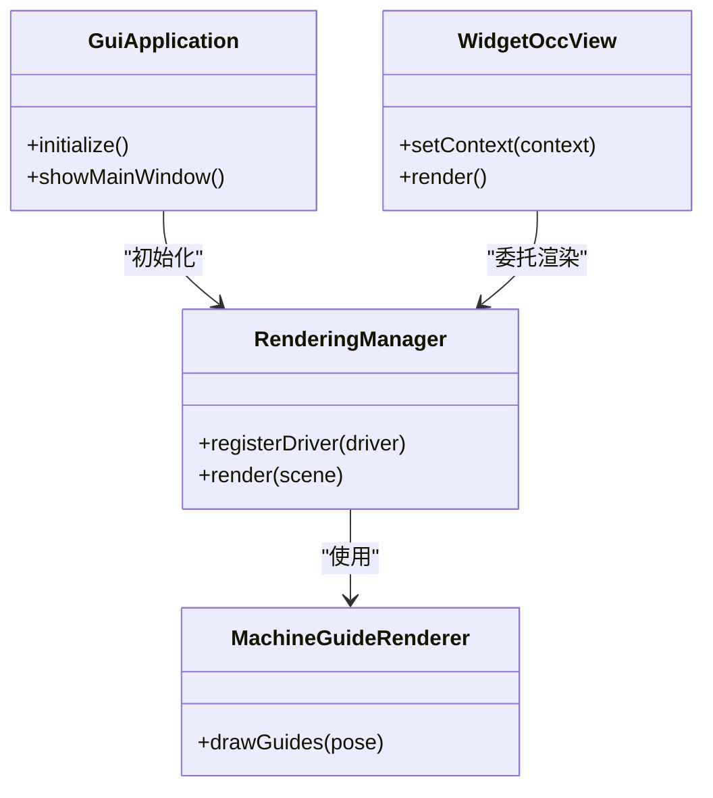
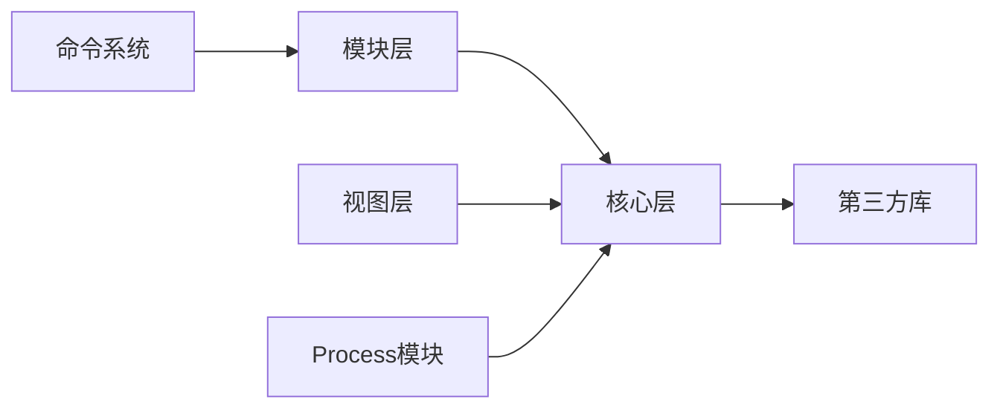

# 开发指南

<cite>
**本文引用的文件**
- [CMakeLists.txt](file://CMakeLists.txt)
- [代码规范.md](file://代码规范.md)
- [微内核框架结构.md](file://微内核框架结构.md)
- [process模块框架.md](file://process模块框架.md)
- [process模块重构计划.md](file://process模块重构计划.md)
- [src/main.cpp](file://src/main.cpp)
- [src/app/app_context.cpp](file://src/app/app_context.cpp)
- [src/app/command_registry.cpp](file://src/app/command_registry.cpp)
- [src/app/command_registry.h](file://src/app/command_registry.h)
- [src/app/commands/commands_display.cpp](file://src/app/commands/commands_display.cpp)
- [src/app/commands/commands_display.h](file://src/app/commands/commands_display.h)
- [src/app/dialog/dialog_options.cpp](file://src/app/dialog/dialog_options.cpp)
- [src/app/dialog/dialog_options.h](file://src/app/dialog/dialog_options.h)
- [src/app/dialog/dialog_task_manager.cpp](file://src/app/dialog/dialog_task_manager.cpp)
- [src/app/dialog/dialog_task_manager.h](file://src/app/dialog/dialog_task_manager.h)
- [src/app/main_window.cpp](file://src/app/main_window.cpp)
- [src/app/main_window.h](file://src/app/main_window.h)
- [src/app/project_explorer_model.cpp](file://src/app/project_explorer_model.cpp)
- [src/app/project_explorer_model.h](file://src/app/project_explorer_model.h)
- [src/app/project_explorer_tree_utils.cpp](file://src/app/project_explorer_tree_utils.cpp)
- [src/app/project_explorer_tree_utils.h](file://src/app/project_explorer_tree_utils.h)
- [src/core/kernel/kernel.cpp](file://src/core/kernel/kernel.cpp)
- [src/core/kernel/kernel.h](file://src/core/kernel/kernel.h)
- [src/core/kernel/module_registry.cpp](file://src/core/kernel/module_registry.cpp)
- [src/core/kernel/module_registry.h](file://src/core/kernel/module_registry.h)
- [src/core/kernel/service_registry.cpp](file://src/core/kernel/service_registry.cpp)
- [src/core/kernel/service_registry.h](file://src/core/kernel/service_registry.h)
- [src/core/kernel/event_bus.cpp](file://src/core/kernel/event_bus.cpp)
- [src/core/kernel/event_bus.h](file://src/core/kernel/event_bus.h)
- [src/core/command/commands_api.cpp](file://src/core/command/commands_api.cpp)
- [src/core/command/commands_api.h](file://src/core/command/commands_api.h)
- [src/core/document/lcnc_document.cpp](file://src/core/document/lcnc_document.cpp)
- [src/core/document/lcnc_document.h](file://src/core/document/lcnc_document.h)
- [src/core/task/task_manager.cpp](file://src/core/task/task_manager.cpp)
- [src/core/task/task_manager.h](file://src/core/task/task_manager.h)
- [src/core/settings/app_settings.cpp](file://src/core/settings/app_settings.cpp)
- [src/core/settings/app_settings.h](file://src/core/settings/app_settings.h)
- [src/modules/cad/cad_module.cpp](file://src/modules/cad/cad_module.cpp)
- [src/modules/cad/cad_module.h](file://src/modules/cad/cad_module.h)
- [src/modules/cam/cam_module.cpp](file://src/modules/cam/cam_module.cpp)
- [src/modules/cam/cam_module.h](file://src/modules/cam/cam_module.h)
- [src/modules/process/process_module.cpp](file://src/modules/process/process_module.cpp)
- [src/modules/process/process_module.h](file://src/modules/process/process_module.h)
- [src/modules/process/commands/commands_process.cpp](file://src/modules/process/commands/commands_process.cpp)
- [src/modules/process/commands/commands_process.h](file://src/modules/process/commands/commands_process.h)
- [src/modules/process/workflow/process_workflow_service.cpp](file://src/modules/process/workflow/process_workflow_service.cpp)
- [src/modules/process/workflow/process_workflow_service.h](file://src/modules/process/workflow/process_workflow_service.h)
- [src/modules/process/workflow/process_node.cpp](file://src/modules/process/workflow/process_node.cpp)
- [src/modules/process/workflow/process_node.h](file://src/modules/process/workflow/process_node.h)
- [src/modules/process/workflow/process_node_registry.cpp](file://src/modules/process/workflow/process_node_registry.cpp)
- [src/modules/process/workflow/process_node_registry.h](file://src/modules/process/workflow/process_node_registry.h)
- [src/modules/process/toolpath/process_toolpath_service.cpp](file://src/modules/process/toolpath/process_toolpath_service.cpp)
- [src/modules/process/toolpath/process_toolpath_service.h](file://src/modules/process/toolpath/process_toolpath_service.h)
- [src/modules/process/execution/process_execution_service.cpp](file://src/modules/process/execution/process_execution_service.cpp)
- [src/modules/process/execution/process_execution_service.h](file://src/modules/process/execution/process_execution_service.h)
- [src/modules/process/communication/communication_manager.cpp](file://src/modules/process/communication/communication_manager.cpp)
- [src/modules/process/communication/communication_manager.h](file://src/modules/process/communication/communication_manager.h)
- [src/modules/process/communication/protocols/serial_channel.cpp](file://src/modules/process/communication/protocols/serial_channel.cpp)
- [src/modules/process/communication/protocols/serial_channel.h](file://src/modules/process/communication/protocols/serial_channel.h)
- [src/modules/process/communication/protocols/tcp_channel.cpp](file://src/modules/process/communication/protocols/tcp_channel.cpp)
- [src/modules/process/communication/protocols/tcp_channel.h](file://src/modules/process/communication/protocols/tcp_channel.h)
- [src/modules/process/communication/protocols/http_channel.cpp](file://src/modules/process/communication/protocols/http_channel.cpp)
- [src/modules/process/communication/protocols/http_channel.h](file://src/modules/process/communication/protocols/http_channel.h)
- [src/view/gui_application.cpp](file://src/view/gui_application.cpp)
- [src/view/gui_application.h](file://src/view/gui_application.h)
- [src/view/widget_occ_view.cpp](file://src/view/widget_occ_view.cpp)
- [src/view/widget_occ_view.h](file://src/view/widget_occ_view.h)
- [src/view/machine_guide_renderer.cpp](file://src/view/machine_guide_renderer.cpp)
- [src/view/machine_guide_renderer.h](file://src/view/machine_guide_renderer.h)
- [src/view/rendering_manager.cpp](file://src/view/rendering_manager.cpp)
- [src/view/rendering_manager.h](file://src/view/rendering_manager.h)
</cite>

## 目录
1. [简介](#简介)
2. [项目结构](#项目结构)
3. [核心组件](#核心组件)
4. [架构总览](#架构总览)
5. [详细组件分析](#详细组件分析)
6. [依赖分析](#依赖分析)
7. [性能考虑](#性能考虑)
8. [故障排查指南](#故障排查指南)
9. [结论](#结论)
10. [附录](#附录)

## 简介
本开发指南面向LaserCNC项目的开发者，系统性阐述项目的开发规范、编码标准、最佳实践与扩展方法。内容覆盖代码结构组织、命名约定、注释规范、测试策略、命令系统扩展、模块开发流程、API设计原则、调试技巧、性能分析与问题排查，并提供新功能开发的完整流程与参考路径。

## 项目结构
LaserCNC采用分层与模块化结合的组织方式：顶层为构建配置与文档；核心层包含内核、命令、文档、任务、设置等基础能力；模块层包含CAD、CAM、Process三大业务域；视图层负责图形渲染与UI交互；第三方库通过3rd目录统一管理。

图表来源
- [CMakeLists.txt](file://CMakeLists.txt)
- [src/core/kernel/kernel.cpp](file://src/core/kernel/kernel.cpp)
- [src/modules/cad/cad_module.cpp](file://src/modules/cad/cad_module.cpp)
- [src/modules/cam/cam_module.cpp](file://src/modules/cam/cam_module.cpp)
- [src/modules/process/process_module.cpp](file://src/modules/process/process_module.cpp)
- [src/view/gui_application.cpp](file://src/view/gui_application.cpp)
- [src/view/rendering_manager.cpp](file://src/view/rendering_manager.cpp)
- [src/view/widget_occ_view.cpp](file://src/view/widget_occ_view.cpp)

章节来源
- [CMakeLists.txt](file://CMakeLists.txt)
- [微内核框架结构.md](file://微内核框架结构.md)

## 核心组件
- 内核与注册中心：提供模块注册、服务注册、事件总线与内核生命周期管理。
- 命令系统：统一的命令注册、显示与API接口，支持跨模块扩展。
- 文档与项目：抽象文档模型与项目管理，支撑多模块协作。
- 任务与设置：任务执行与进度跟踪，应用级设置与配置管理。
- 视图与渲染：基于OCC的图形场景、渲染器与机器引导绘制。

章节来源
- [src/core/kernel/kernel.cpp](file://src/core/kernel/kernel.cpp)
- [src/core/kernel/module_registry.cpp](file://src/core/kernel/module_registry.cpp)
- [src/core/kernel/service_registry.cpp](file://src/core/kernel/service_registry.cpp)
- [src/core/kernel/event_bus.cpp](file://src/core/kernel/event_bus.cpp)
- [src/app/command_registry.cpp](file://src/app/command_registry.cpp)
- [src/app/command_registry.h](file://src/app/command_registry.h)
- [src/core/command/commands_api.cpp](file://src/core/command/commands_api.cpp)
- [src/core/command/commands_api.h](file://src/core/command/commands_api.h)
- [src/core/document/lcnc_document.cpp](file://src/core/document/lcnc_document.cpp)
- [src/core/document/lcnc_document.h](file://src/core/document/lcnc_document.h)
- [src/core/task/task_manager.cpp](file://src/core/task/task_manager.cpp)
- [src/core/task/task_manager.h](file://src/core/task/task_manager.h)
- [src/core/settings/app_settings.cpp](file://src/core/settings/app_settings.cpp)
- [src/core/settings/app_settings.h](file://src/core/settings/app_settings.h)
- [src/view/rendering_manager.cpp](file://src/view/rendering_manager.cpp)
- [src/view/machine_guide_renderer.cpp](file://src/view/machine_guide_renderer.cpp)

## 架构总览
LaserCNC采用“微内核 + 模块化”的架构：内核提供通用基础设施，各业务模块通过注册机制接入；命令系统贯穿应用层与模块层；Process模块进一步细分为工作流、工具路径、执行、通信等子系统；视图层独立于业务逻辑，通过渲染器与事件总线解耦。

图表来源
- [src/core/kernel/kernel.cpp](file://src/core/kernel/kernel.cpp)
- [src/core/kernel/module_registry.cpp](file://src/core/kernel/module_registry.cpp)
- [src/core/kernel/service_registry.cpp](file://src/core/kernel/service_registry.cpp)
- [src/core/kernel/event_bus.cpp](file://src/core/kernel/event_bus.cpp)
- [src/app/app_context.cpp](file://src/app/app_context.cpp)
- [src/app/command_registry.cpp](file://src/app/command_registry.cpp)
- [src/app/main_window.cpp](file://src/app/main_window.cpp)
- [src/modules/cad/cad_module.cpp](file://src/modules/cad/cad_module.cpp)
- [src/modules/cam/cam_module.cpp](file://src/modules/cam/cam_module.cpp)
- [src/modules/process/process_module.cpp](file://src/modules/process/process_module.cpp)
- [src/view/gui_application.cpp](file://src/view/gui_application.cpp)
- [src/view/rendering_manager.cpp](file://src/view/rendering_manager.cpp)
- [src/view/widget_occ_view.cpp](file://src/view/widget_occ_view.cpp)

## 详细组件分析

### 命令系统与扩展
- 命令注册：通过注册表集中管理命令元数据与执行入口，支持动态扩展。
- 显示与API：命令显示组件负责UI呈现，commands_api提供统一调用接口。
- 扩展流程：新增命令需在对应模块中实现命令类，注册到注册表，并在显示层声明展示。

图表来源
- [src/app/command_registry.cpp](file://src/app/command_registry.cpp)
- [src/app/command_registry.h](file://src/app/command_registry.h)
- [src/app/commands/commands_display.cpp](file://src/app/commands/commands_display.cpp)
- [src/app/commands/commands_display.h](file://src/app/commands/commands_display.h)
- [src/core/command/commands_api.cpp](file://src/core/command/commands_api.cpp)
- [src/core/command/commands_api.h](file://src/core/command/commands_api.h)

章节来源
- [src/app/command_registry.cpp](file://src/app/command_registry.cpp)
- [src/app/command_registry.h](file://src/app/command_registry.h)
- [src/app/commands/commands_display.cpp](file://src/app/commands/commands_display.cpp)
- [src/app/commands/commands_display.h](file://src/app/commands/commands_display.h)
- [src/core/command/commands_api.cpp](file://src/core/command/commands_api.cpp)
- [src/core/command/commands_api.h](file://src/core/command/commands_api.h)

### 内核与模块注册
- 内核负责模块与服务的生命周期管理，事件总线提供松耦合通信。
- 模块注册表与服务注册表分别维护模块与服务的注册信息，确保按需加载与依赖解析。

图表来源
- [src/core/kernel/kernel.cpp](file://src/core/kernel/kernel.cpp)
- [src/core/kernel/module_registry.cpp](file://src/core/kernel/module_registry.cpp)
- [src/core/kernel/service_registry.cpp](file://src/core/kernel/service_registry.cpp)
- [src/core/kernel/event_bus.cpp](file://src/core/kernel/event_bus.cpp)

章节来源
- [src/core/kernel/kernel.cpp](file://src/core/kernel/kernel.cpp)
- [src/core/kernel/module_registry.cpp](file://src/core/kernel/module_registry.cpp)
- [src/core/kernel/service_registry.cpp](file://src/core/kernel/service_registry.cpp)
- [src/core/kernel/event_bus.cpp](file://src/core/kernel/event_bus.cpp)

### 文档与项目管理
- 文档模型抽象了工程数据结构，支持序列化与版本兼容。
- 项目管理器负责工程的打开、保存、会话管理与清单处理。

图表来源
- [src/core/document/lcnc_document.cpp](file://src/core/document/lcnc_document.cpp)
- [src/core/document/lcnc_document.h](file://src/core/document/lcnc_document.h)
- [src/core/project/lcnc_project_manager.cpp](file://src/core/project/lcnc_project_manager.cpp)
- [src/core/project/lcnc_project_session.cpp](file://src/core/project/lcnc_project_session.cpp)

章节来源
- [src/core/document/lcnc_document.cpp](file://src/core/document/lcnc_document.cpp)
- [src/core/document/lcnc_document.h](file://src/core/document/lcnc_document.h)
- [src/core/project/lcnc_project_manager.cpp](file://src/core/project/lcnc_project_manager.cpp)
- [src/core/project/lcnc_project_session.cpp](file://src/core/project/lcnc_project_session.cpp)

### Process模块（工作流、工具路径、执行、通信）
- 工作流：节点类型注册、节点执行器注册、工作流服务编排。
- 工具路径：工具匹配、排序与生成服务。
- 执行：执行上下文、状态机与执行服务。
- 通信：通道抽象（串口/TCP/HTTP），设备适配与消息编解码。

图表来源
- [src/modules/process/workflow/process_workflow_service.cpp](file://src/modules/process/workflow/process_workflow_service.cpp)
- [src/modules/process/workflow/process_node.cpp](file://src/modules/process/workflow/process_node.cpp)
- [src/modules/process/workflow/process_node_registry.cpp](file://src/modules/process/workflow/process_node_registry.cpp)
- [src/modules/process/toolpath/process_toolpath_service.cpp](file://src/modules/process/toolpath/process_toolpath_service.cpp)
- [src/modules/process/execution/process_execution_service.cpp](file://src/modules/process/execution/process_execution_service.cpp)
- [src/modules/process/communication/communication_manager.cpp](file://src/modules/process/communication/communication_manager.cpp)
- [src/modules/process/communication/protocols/serial_channel.cpp](file://src/modules/process/communication/protocols/serial_channel.cpp)
- [src/modules/process/communication/protocols/tcp_channel.cpp](file://src/modules/process/communication/protocols/tcp_channel.cpp)
- [src/modules/process/communication/protocols/http_channel.cpp](file://src/modules/process/communication/protocols/http_channel.cpp)

章节来源
- [src/modules/process/workflow/process_workflow_service.cpp](file://src/modules/process/workflow/process_workflow_service.cpp)
- [src/modules/process/workflow/process_node.cpp](file://src/modules/process/workflow/process_node.cpp)
- [src/modules/process/workflow/process_node_registry.cpp](file://src/modules/process/workflow/process_node_registry.cpp)
- [src/modules/process/toolpath/process_toolpath_service.cpp](file://src/modules/process/toolpath/process_toolpath_service.cpp)
- [src/modules/process/execution/process_execution_service.cpp](file://src/modules/process/execution/process_execution_service.cpp)
- [src/modules/process/communication/communication_manager.cpp](file://src/modules/process/communication/communication_manager.cpp)
- [src/modules/process/communication/protocols/serial_channel.cpp](file://src/modules/process/communication/protocols/serial_channel.cpp)
- [src/modules/process/communication/protocols/tcp_channel.cpp](file://src/modules/process/communication/protocols/tcp_channel.cpp)
- [src/modules/process/communication/protocols/http_channel.cpp](file://src/modules/process/communication/protocols/http_channel.cpp)

### 视图与渲染
- GUI应用负责窗口、菜单与主界面初始化。
- 渲染管理器协调图形场景与对象驱动，机器引导渲染器提供运动轨迹与辅助线。
- OCC视图承载三维场景与交互。

图表来源
- [src/view/gui_application.cpp](file://src/view/gui_application.cpp)
- [src/view/rendering_manager.cpp](file://src/view/rendering_manager.cpp)
- [src/view/machine_guide_renderer.cpp](file://src/view/machine_guide_renderer.cpp)
- [src/view/widget_occ_view.cpp](file://src/view/widget_occ_view.cpp)

章节来源
- [src/view/gui_application.cpp](file://src/view/gui_application.cpp)
- [src/view/rendering_manager.cpp](file://src/view/rendering_manager.cpp)
- [src/view/machine_guide_renderer.cpp](file://src/view/machine_guide_renderer.cpp)
- [src/view/widget_occ_view.cpp](file://src/view/widget_occ_view.cpp)

## 依赖分析
- 组件耦合：模块通过内核注册，避免直接相互依赖；命令系统通过注册表与API解耦UI与业务。
- 外部依赖：第三方库集中在3rd目录，构建脚本统一链接；日志使用spdlog，配置使用toml11。
- 可能的循环依赖：模块间通过事件总线与服务注册表间接通信，降低直接循环依赖风险。

图表来源
- [CMakeLists.txt](file://CMakeLists.txt)
- [src/app/command_registry.cpp](file://src/app/command_registry.cpp)
- [src/modules/cad/cad_module.cpp](file://src/modules/cad/cad_module.cpp)
- [src/modules/cam/cam_module.cpp](file://src/modules/cam/cam_module.cpp)
- [src/modules/process/process_module.cpp](file://src/modules/process/process_module.cpp)
- [src/core/kernel/kernel.cpp](file://src/core/kernel/kernel.cpp)

章节来源
- [CMakeLists.txt](file://CMakeLists.txt)

## 性能考虑
- 渲染优化：批量提交绘制请求，延迟刷新，避免频繁重建几何。
- 通信吞吐：串口/TCP/HTTP通道应设置合适的缓冲区与超时策略，避免阻塞主线程。
- 工作流执行：节点执行器应尽量无阻塞，长耗时操作异步化并上报进度。
- 日志级别：生产环境降低日志级别，避免I/O成为瓶颈。

## 故障排查指南
- 命令未显示：检查命令注册是否成功、显示组件是否正确绑定。
- 模块无法加载：确认模块已注册、依赖服务已就绪、事件总线订阅正常。
- 通信异常：验证通道参数、设备连接状态与消息格式；查看通信日志模型。
- 渲染不更新：确认场景变更事件已发布、渲染器已接收并触发重绘。
- 配置读取失败：检查配置文件路径、权限与格式，必要时回退默认值。

章节来源
- [src/app/command_registry.cpp](file://src/app/command_registry.cpp)
- [src/core/kernel/event_bus.cpp](file://src/core/kernel/event_bus.cpp)
- [src/modules/process/communication/communication_manager.cpp](file://src/modules/process/communication/communication_manager.cpp)
- [src/view/rendering_manager.cpp](file://src/view/rendering_manager.cpp)
- [src/core/settings/app_settings.cpp](file://src/core/settings/app_settings.cpp)

## 结论
LaserCNC以微内核为核心，通过模块化与命令系统实现高扩展性与可维护性。遵循本文的开发规范与最佳实践，可高效完成新功能开发与模块扩展，同时保证系统稳定性与性能。

## 附录

### 开发规范与编码标准
- 命名约定：类与模块使用帕斯卡命名；变量与函数使用驼峰命名；常量全大写并以下划线分隔。
- 注释规范：公共API必须有函数签名与行为说明；复杂算法提供步骤说明与边界条件。
- 错误处理：所有外部调用返回值必须检查；异常路径需记录日志并向上抛出或转换为业务错误码。
- 并发安全：共享资源使用互斥锁保护；事件总线处理回调需线程安全。
- 测试策略：单元测试覆盖核心算法与边界；集成测试覆盖命令与模块交互；端到端测试覆盖关键工作流。

章节来源
- [代码规范.md](file://代码规范.md)

### 新功能开发流程
- 需求评审：明确功能目标、输入输出与约束。
- 设计文档：定义API、事件与数据契约，评估对现有模块的影响。
- 模块扩展：在对应模块中添加命令、服务或工具，注册到内核。
- 接口实现：实现命令执行逻辑、工具路径计算或通信协议。
- 单元测试：编写针对核心逻辑的测试用例。
- 集成测试：验证命令与UI联动、事件传播与状态一致性。
- 文档与回归：更新用户文档与变更日志，进行回归测试。

章节来源
- [process模块框架.md](file://process模块框架.md)
- [process模块重构计划.md](file://process模块重构计划.md)

### API设计原则
- 稳定性：对外API保持向后兼容，新增字段采用默认值。
- 一致性：同一类操作的参数与返回格式统一。
- 可观测性：为关键API提供日志与指标，便于追踪与诊断。
- 安全性：输入参数严格校验，敏感操作增加权限校验。

章节来源
- [src/core/command/commands_api.cpp](file://src/core/command/commands_api.cpp)
- [src/core/command/commands_api.h](file://src/core/command/commands_api.h)
- [src/modules/process/workflow/process_workflow_service.cpp](file://src/modules/process/workflow/process_workflow_service.cpp)

### 调试技巧与性能分析
- 日志：使用结构化日志记录关键事件与参数，区分不同模块与级别。
- 断点：在命令入口、事件回调与渲染关键路径设置断点。
- 性能：使用性能分析工具定位热点函数，关注I/O与锁竞争。
- 远程调试：通过TCP/HTTP通道模拟设备，隔离本地调试环境。

章节来源
- [src/core/logging/logger.cpp](file://src/core/logging/logger.cpp)
- [src/modules/process/communication/communication_manager.cpp](file://src/modules/process/communication/communication_manager.cpp)