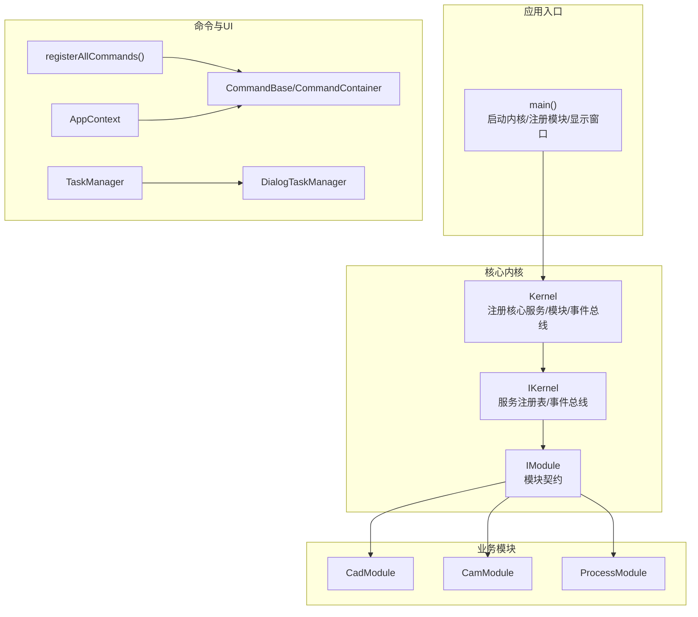
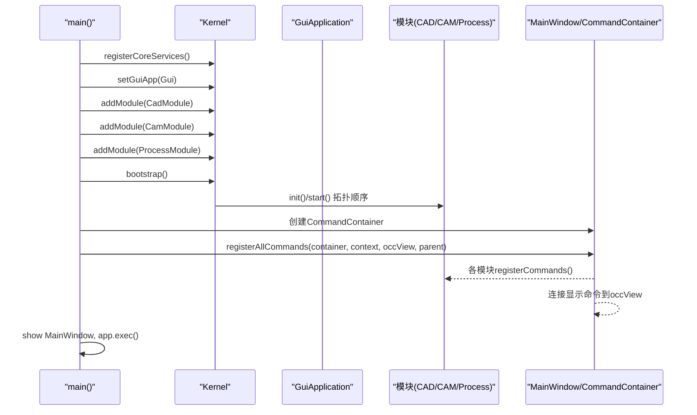
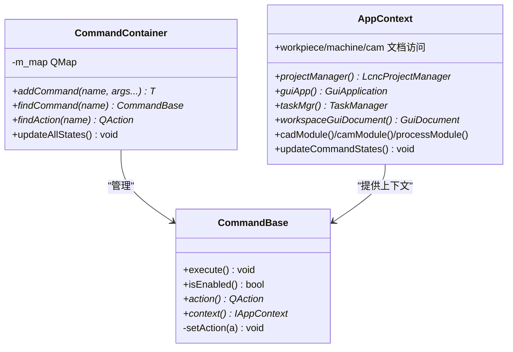
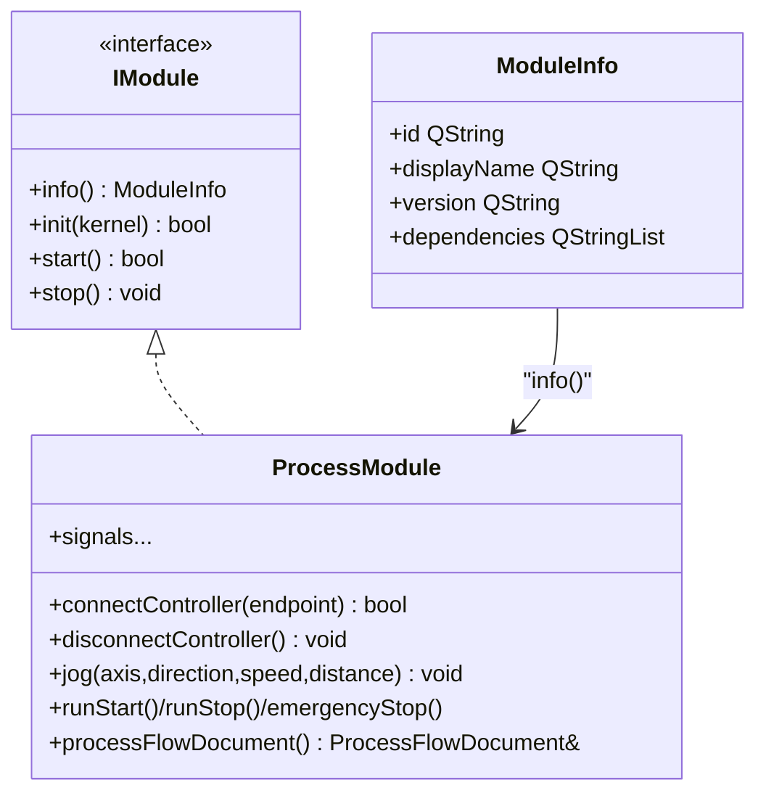
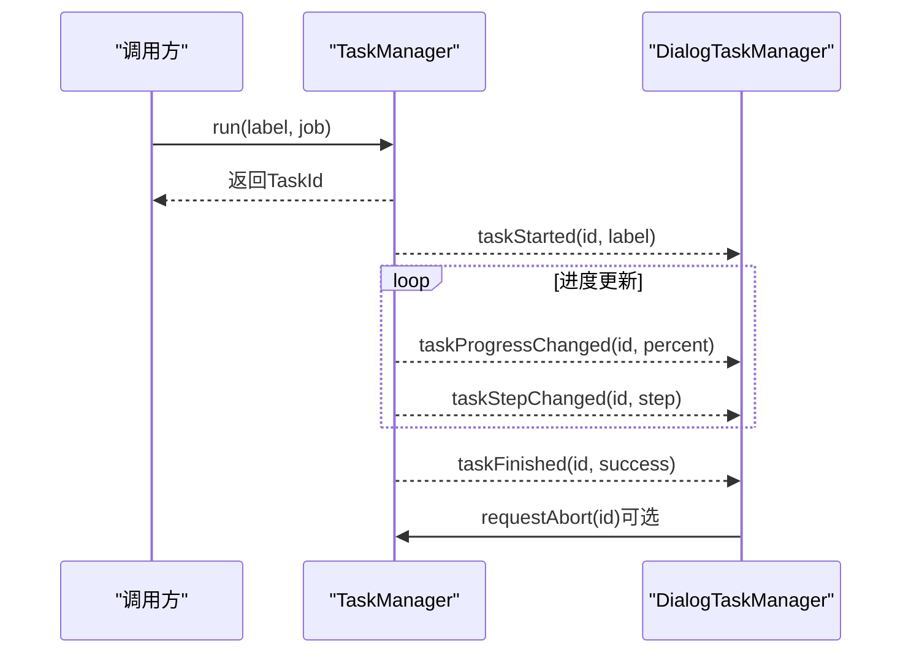
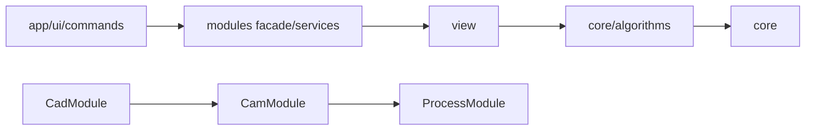

# 开发流程

<cite>
**本文引用的文件**
- [src/main.cpp](file://src/main.cpp)
- [src/core/kernel/kernel.h](file://src/core/kernel/kernel.h)
- [src/core/kernel/i_kernel.h](file://src/core/kernel/i_kernel.h)
- [src/core/kernel/i_module.h](file://src/core/kernel/i_module.h)
- [src/core/command/commands_api.h](file://src/core/command/commands_api.h)
- [src/app/command_registry.h](file://src/app/command_registry.h)
- [src/app/app_context.h](file://src/app/app_context.h)
- [src/modules/cad/cad_module.h](file://src/modules/cad/cad_module.h)
- [src/modules/cam/cam_module.h](file://src/modules/cam/cam_module.h)
- [src/modules/process/process_module.h](file://src/modules/process/process_module.h)
- [src/core/task/task_manager.h](file://src/core/task/task_manager.h)
- [src/app/dialog/dialog_task_manager.h](file://src/app/dialog/dialog_task_manager.h)
- [微内核框架结构.md](file://微内核框架结构.md)
- [代码规范.md](file://代码规范.md)
- [todo.md](file://todo.md)
</cite>

## 目录
1. [简介](#简介)
2. [项目结构](#项目结构)
3. [核心组件](#核心组件)
4. [架构总览](#架构总览)
5. [详细组件分析](#详细组件分析)
6. [依赖分析](#依赖分析)
7. [性能考虑](#性能考虑)
8. [故障排查指南](#故障排查指南)
9. [结论](#结论)
10. [附录](#附录)

## 简介
本指南面向LaserCNC新功能开发，提供从需求分析到上线的全流程方法论，涵盖：
- 需求分析与设计文档编写
- 命令系统扩展与模块开发
- API设计原则与代码规范
- 单元测试与集成测试策略
- 任务管理与进度跟踪
- 代码审查与质量保证

LaserCNC采用微内核架构，主流程在入口文件中完成内核初始化、模块注册与启动，随后由命令系统驱动UI交互与业务执行。

## 项目结构
LaserCNC采用“单项目、三数据域、唯一workspace视图”的微内核组织方式：
- app：应用入口、命令注册、对话框与UI桥接
- core：内核、事件总线、服务注册表、任务管理、日志与设置
- modules：业务模块（CAD/CAM/Process），通过facade/service与内核交互
- view：渲染与显示（本指南关注其职责边界）
- 3rd：第三方库

图表来源
- [src/main.cpp:33-135](file://src/main.cpp#L33-L135)
- [src/core/kernel/kernel.h:37-146](file://src/core/kernel/kernel.h#L37-L146)
- [src/core/kernel/i_kernel.h:26-34](file://src/core/kernel/i_kernel.h#L26-L34)
- [src/core/kernel/i_module.h:49-73](file://src/core/kernel/i_module.h#L49-L73)
- [src/core/command/commands_api.h:20-76](file://src/core/command/commands_api.h#L20-L76)
- [src/app/command_registry.h:26-29](file://src/app/command_registry.h#L26-L29)
- [src/app/app_context.h:17-47](file://src/app/app_context.h#L17-L47)
- [src/core/task/task_manager.h:21-66](file://src/core/task/task_manager.h#L21-L66)
- [src/app/dialog/dialog_task_manager.h:18-44](file://src/app/dialog/dialog_task_manager.h#L18-L44)

章节来源
- [src/main.cpp:33-135](file://src/main.cpp#L33-L135)
- [微内核框架结构.md:1-226](file://微内核框架结构.md#L1-L226)

## 核心组件
- 内核与生命周期
  - Kernel：注册核心服务（设置、项目管理、任务管理）、模块注册与启动、事件总线与服务注册表
  - IKernel/I_Module：模块契约与生命周期（info/init/start/stop）
- 命令系统
  - CommandBase/CommandContainer：命令基类与容器，统一动作封装与查找
  - registerAllCommands：集中注册命令并连接显示命令到视图
  - AppContext：应用上下文，提供文档、模块与视图访问
- 任务管理
  - TaskManager：异步任务执行与进度信号
  - DialogTaskManager：任务面板UI

章节来源
- [src/core/kernel/kernel.h:37-146](file://src/core/kernel/kernel.h#L37-L146)
- [src/core/kernel/i_kernel.h:26-34](file://src/core/kernel/i_kernel.h#L26-L34)
- [src/core/kernel/i_module.h:49-73](file://src/core/kernel/i_module.h#L49-L73)
- [src/core/command/commands_api.h:20-76](file://src/core/command/commands_api.h#L20-L76)
- [src/app/command_registry.h:26-29](file://src/app/command_registry.h#L26-L29)
- [src/app/app_context.h:17-47](file://src/app/app_context.h#L17-L47)
- [src/core/task/task_manager.h:21-66](file://src/core/task/task_manager.h#L21-L66)
- [src/app/dialog/dialog_task_manager.h:18-44](file://src/app/dialog/dialog_task_manager.h#L18-L44)

## 架构总览
LaserCNC的启动与模块依赖如下：
- 启动顺序：main → Logger初始化 → Kernel注册核心服务 → 注入GuiApplication → 注册模块（cad→cam→process）→ bootstrap → MainWindow显示 → app.exec → shutdown
- 模块依赖：cad无依赖，cam依赖cad，process依赖cam
- 命令注册：MainWindow创建CommandContainer，调用registerAllCommands集中注册各模块命令并连接视图

图表来源
- [src/main.cpp:75-120](file://src/main.cpp#L75-L120)
- [src/core/kernel/kernel.h:61-88](file://src/core/kernel/kernel.h#L61-L88)
- [src/app/command_registry.h:26-29](file://src/app/command_registry.h#L26-L29)

章节来源
- [src/main.cpp:75-120](file://src/main.cpp#L75-L120)
- [微内核框架结构.md:192-217](file://微内核框架结构.md#L192-L217)

## 详细组件分析

### 命令系统扩展方法
- 命令基类与容器
  - CommandBase：封装QAction与execute()，支持isEnabled()与状态刷新
  - CommandContainer：按名称索引命令，提供findCommand/findAction/updateAllStates
- 命令注册流程
  - MainWindow创建CommandContainer与AppContext
  - 调用registerAllCommands：依次调用cad/cam/process模块的registerCommands，再注册显示命令并连接到occView
- 设计原则
  - 命令只负责动作装配与触发，业务逻辑通过facade/service完成
  - 命令不直接弹错误对话框，错误通过信号或返回值交由UI处理

图表来源
- [src/core/command/commands_api.h:20-76](file://src/core/command/commands_api.h#L20-L76)
- [src/app/app_context.h:17-47](file://src/app/app_context.h#L17-L47)

章节来源
- [src/core/command/commands_api.h:20-76](file://src/core/command/commands_api.h#L20-L76)
- [src/app/command_registry.h:26-29](file://src/app/command_registry.h#L26-L29)
- [src/app/app_context.h:17-47](file://src/app/app_context.h#L17-L47)

### 模块开发流程（以Process为例）
- 模块契约与生命周期
  - 实现IModule：info()声明id/version/dependencies；init()注册服务/命令/订阅事件；start()发布就绪；stop()清理
  - ProcessModule依赖cam，提供连接控制器、轴控制、运行状态、流程文档等
- Facade设计
  - 通过IProcessFacade暴露统一接口，UI仅通过ProcessModule访问状态与信号
- 依赖与启动顺序
  - Kernel按拓扑排序启动：cad → cam → process

图表来源
- [src/core/kernel/i_module.h:49-73](file://src/core/kernel/i_module.h#L49-L73)
- [src/modules/process/process_module.h:35-131](file://src/modules/process/process_module.h#L35-L131)

章节来源
- [src/core/kernel/i_module.h:49-73](file://src/core/kernel/i_module.h#L49-L73)
- [src/modules/process/process_module.h:35-131](file://src/modules/process/process_module.h#L35-L131)
- [微内核框架结构.md:121-144](file://微内核框架结构.md#L121-L144)

### API设计原则
- 调用方向固定：app/modules/*/ui/commands → modules facade/services → view → core/algorithms → core
- 跨模块调用走facade/service；跨模块通知优先用EventBus或Qt signal
- 禁止反向include：core/view不依赖modules/app
- 命令与UI分离：命令只装配动作，UI负责展示与参数收集
- 三域文档语义：Workpiece/Machine/CAM三域独立，ProjectExplorer只聚合snapshot
- 日志规范：统一LCNC_<LEVEL>宏，按级别记录启动、里程碑、警告、错误、致命

章节来源
- [代码规范.md:7-23](file://代码规范.md#L7-L23)
- [代码规范.md:75-81](file://代码规范.md#L75-L81)
- [代码规范.md:25-40](file://代码规范.md#L25-L40)
- [代码规范.md:96-105](file://代码规范.md#L96-L105)

### 单元测试与集成测试
- 单元测试
  - 核心算法：CAD primitive/boolean/transform、CAM face classifier、toolpath id reorder
  - 项目包：roundtrip测试（新建/导入/保存/打开/校验）
- 集成测试
  - 显示与选择：统计每个domain的AIS数量与选择一致性
  - 运行时smoke：机台加载、工件导入、三域显隐、CAM轮廓、保存/打开、Process tab独立
- 任务与进度
  - TaskManager提供异步任务与进度信号，DialogTaskManager提供可视化面板

章节来源
- [todo.md:69-72](file://todo.md#L69-L72)
- [todo.md:74-85](file://todo.md#L74-L85)
- [src/core/task/task_manager.h:21-66](file://src/core/task/task_manager.h#L21-L66)
- [src/app/dialog/dialog_task_manager.h:18-44](file://src/app/dialog/dialog_task_manager.h#L18-L44)

### 任务管理与进度跟踪
- TaskManager
  - run(label, job)：提交异步任务，返回TaskId
  - requestAbort(id)：请求协作式中断
  - waitForDone(id, timeoutMs)：阻塞等待完成
  - 信号：taskStarted/taskProgressChanged/taskStepChanged/taskFinished
- DialogTaskManager
  - 自动显示/隐藏，支持逐项取消

图表来源
- [src/core/task/task_manager.h:21-66](file://src/core/task/task_manager.h#L21-L66)
- [src/app/dialog/dialog_task_manager.h:18-44](file://src/app/dialog/dialog_task_manager.h#L18-L44)

章节来源
- [src/core/task/task_manager.h:21-66](file://src/core/task/task_manager.h#L21-L66)
- [src/app/dialog/dialog_task_manager.h:18-44](file://src/app/dialog/dialog_task_manager.h#L18-L44)

## 依赖分析
- 分层依赖
  - app/UI/commands → modules facade/services → view → core/algorithms → core
- 模块依赖拓扑
  - cad → cam → process
- 跨模块通信
  - facade/service强契约；事件总线/信号弱耦合

图表来源
- [微内核框架结构.md:30-42](file://微内核框架结构.md#L30-L42)
- [src/modules/cad/cad_module.h:120-128](file://src/modules/cad/cad_module.h#L120-L128)
- [src/modules/cam/cam_module.h:108-113](file://src/modules/cam/cam_module.h#L108-L113)
- [src/modules/process/process_module.h:46-50](file://src/modules/process/process_module.h#L46-L50)

章节来源
- [微内核框架结构.md:30-42](file://微内核框架结构.md#L30-L42)
- [src/modules/cad/cad_module.h:120-128](file://src/modules/cad/cad_module.h#L120-L128)
- [src/modules/cam/cam_module.h:108-113](file://src/modules/cam/cam_module.h#L108-L113)
- [src/modules/process/process_module.h:46-50](file://src/modules/process/process_module.h#L46-L50)

## 性能考虑
- 异步任务与UI解耦：TaskManager基于QtConcurrent，避免阻塞UI
- 局部刷新：GuiDocument支持按域重建，避免全量刷新
- 事件与信号：跨模块通知采用EventBus/信号，降低耦合与同步成本
- 渲染配置：统一从应用设置读取，避免重复计算

## 故障排查指南
- 启动失败
  - 检查模块init/start返回值与异常；查看日志级别LCNC_CRIT
- 任务卡死
  - 确认任务中定期检查TaskProgress的中断标志；使用requestAbort
- 显示异常
  - 确认GuiDocument按域重建；检查display registry计数与AIS数量
- 配置问题
  - 检查AppSettings与模块禁用配置；确认.cad/.cam/.process.toml路径与权限

章节来源
- [src/core/task/task_manager.h:31-38](file://src/core/task/task_manager.h#L31-L38)
- [微内核框架结构.md:192-217](file://微内核框架结构.md#L192-L217)
- [代码规范.md:96-105](file://代码规范.md#L96-L105)

## 结论
LaserCNC的微内核架构提供了清晰的职责边界与可扩展性。新功能开发应遵循：
- 以模块facade/service为中心，命令驱动UI
- 严格遵守分层与反向include限制
- 通过任务系统与进度面板保障用户体验
- 以单元测试与集成测试保障质量
- 通过代码规范与审查流程确保一致性

## 附录

### 新功能开发流程清单
- 需求分析与设计
  - 明确业务目标与边界，输出设计文档
  - 评估对模块/命令/服务的影响
- 命令与API设计
  - 设计命令类与facade接口，遵循代码规范
  - 通过IKernel/services/events进行模块间通信
- 实现与测试
  - 单元测试覆盖核心算法与边界条件
  - 集成测试验证三域显示、保存/打开与运行时smoke
- 任务与进度
  - 使用TaskManager封装耗时操作，提供进度与取消
- 代码审查与质量
  - 通过代码规范检查与审查清单
  - 关注日志级别与错误处理

章节来源
- [代码规范.md:114-129](file://代码规范.md#L114-L129)
- [todo.md:67-73](file://todo.md#L67-L73)