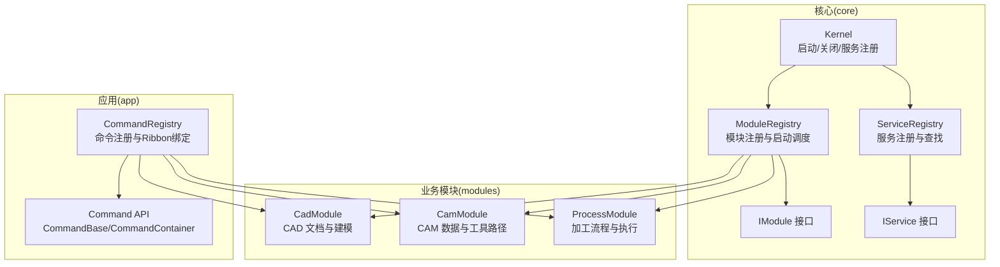
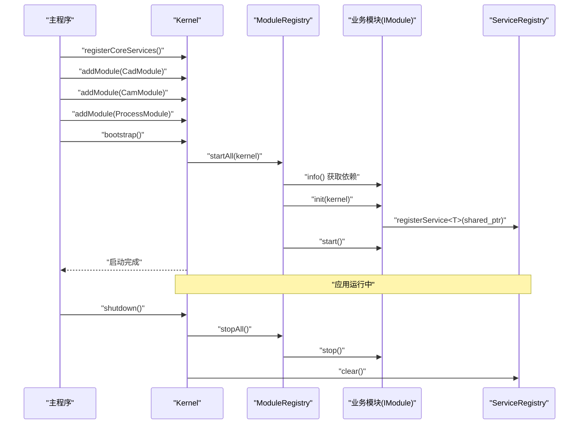
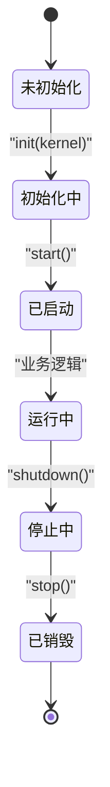
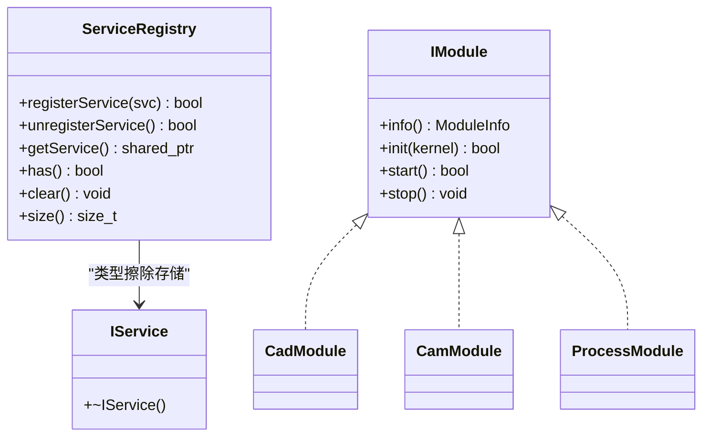
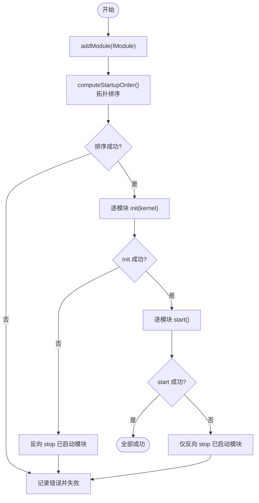
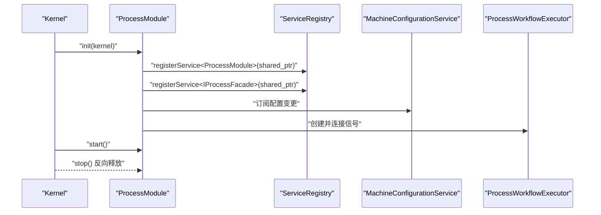
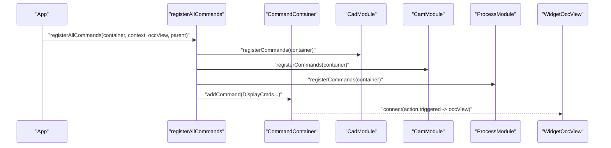
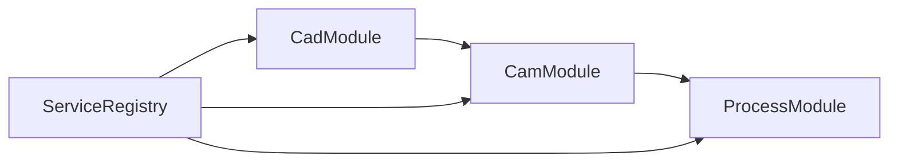

# 扩展开发

<cite>
**本文档引用的文件**
- [i_module.h](file://src/core/kernel/i_module.h)
- [i_service.h](file://src/core/kernel/i_service.h)
- [module_registry.h](file://src/core/kernel/module_registry.h)
- [service_registry.h](file://src/core/kernel/service_registry.h)
- [kernel.h](file://src/core/kernel/kernel.h)
- [kernel.cpp](file://src/core/kernel/kernel.cpp)
- [cad_module.h](file://src/modules/cad/cad_module.h)
- [cad_module.cpp](file://src/modules/cad/cad_module.cpp)
- [cam_module.h](file://src/modules/cam/cam_module.h)
- [cam_module.cpp](file://src/modules/cam/cam_module.cpp)
- [process_module.h](file://src/modules/process/process_module.h)
- [process_module.cpp](file://src/modules/process/process_module.cpp)
- [command_registry.h](file://src/app/command_registry.h)
- [command_registry.cpp](file://src/app/command_registry.cpp)
- [commands_api.h](file://src/core/command/commands_api.h)
</cite>

## 目录
1. [简介](#简介)
2. [项目结构](#项目结构)
3. [核心组件](#核心组件)
4. [架构总览](#架构总览)
5. [详细组件分析](#详细组件分析)
6. [依赖关系分析](#依赖关系分析)
7. [性能考量](#性能考量)
8. [故障排查指南](#故障排查指南)
9. [结论](#结论)
10. [附录](#附录)

## 简介
本指南面向希望在 LaserCNC 微内核平台上开发新功能模块与扩展现有模块的开发者。内容涵盖：
- IModule 接口实现与模块生命周期管理
- IService 服务注册与服务定位
- 模块依赖与启动顺序（拓扑排序）
- 新模块开发的完整示例（初始化、服务注册、UI 集成、数据管理）
- 如何扩展现有模块功能、新增命令与集成第三方库

## 项目结构
LaserCNC 采用微内核架构，核心位于 core/kernel，业务模块位于 modules，应用层命令注册位于 app，视图层位于 view。模块之间通过 Kernel 的 ServiceRegistry 和 ModuleRegistry 解耦。

**图表来源**
- [kernel.h:37-146](file://src/core/kernel/kernel.h#L37-L146)
- [module_registry.h:30-61](file://src/core/kernel/module_registry.h#L30-L61)
- [service_registry.h:26-68](file://src/core/kernel/service_registry.h#L26-L68)
- [i_module.h:49-73](file://src/core/kernel/i_module.h#L49-L73)
- [i_service.h:19-23](file://src/core/kernel/i_service.h#L19-L23)
- [cad_module.h:45-128](file://src/modules/cad/cad_module.h#L45-L128)
- [cam_module.h:64-113](file://src/modules/cam/cam_module.h#L64-L113)
- [process_module.h:35-50](file://src/modules/process/process_module.h#L35-L50)
- [command_registry.h:26-29](file://src/app/command_registry.h#L26-L29)
- [commands_api.h:52-76](file://src/core/command/commands_api.h#L52-L76)

**章节来源**
- [kernel.h:18-36](file://src/core/kernel/kernel.h#L18-L36)
- [module_registry.h:15-28](file://src/core/kernel/module_registry.h#L15-L28)
- [service_registry.h:12-24](file://src/core/kernel/service_registry.h#L12-L24)

## 核心组件
- IModule：模块契约，定义 info/init/start/stop 四个生命周期方法，以及 ModuleInfo 元信息（id、displayName、version、dependencies）。
- IService：服务标记接口，所有跨模块共享能力均以 IService 派生接口形式注册到 ServiceRegistry。
- ModuleRegistry：模块容器与启动调度器，负责拓扑排序、顺序 init/start、反向 stop。
- ServiceRegistry：服务注册表，按类型索引注册/查找服务实例，支持 has()/clear()。
- Kernel：微内核实现，持有 ServiceRegistry、EventBus、ModuleRegistry，提供 registerCoreServices/addModule/bootstrap/shutdown。

**章节来源**
- [i_module.h:10-73](file://src/core/kernel/i_module.h#L10-L73)
- [i_service.h:3-23](file://src/core/kernel/i_service.h#L3-L23)
- [module_registry.h:15-61](file://src/core/kernel/module_registry.h#L15-L61)
- [service_registry.h:12-68](file://src/core/kernel/service_registry.h#L12-L68)
- [kernel.h:18-146](file://src/core/kernel/kernel.h#L18-L146)

## 架构总览
微内核启动流程：
1) Kernel::registerCoreServices 注册核心服务（AppSettings、LcncProjectManager、TaskManager、MachineConfigurationService 等）
2) Kernel::addModule 逐个加入业务模块（CadModule/CamModule/ProcessModule）
3) Kernel::bootstrap 触发 ModuleRegistry::startAll，按 ModuleInfo.dependencies 拓扑排序，依次调用每个模块的 init(kernel) 与 start()
4) 模块在 init 中向 ServiceRegistry 注册自身或服务接口，向 Kernel 订阅事件，向 CommandContainer 注册命令
5) 应用运行；Kernel::shutdown 反向 stop 模块并清空服务

**图表来源**
- [kernel.cpp:51-102](file://src/core/kernel/kernel.cpp#L51-L102)
- [module_registry.h:36-45](file://src/core/kernel/module_registry.h#L36-L45)
- [i_module.h:57-72](file://src/core/kernel/i_module.h#L57-L72)
- [service_registry.h:29-61](file://src/core/kernel/service_registry.h#L29-L61)

## 详细组件分析

### IModule 接口与生命周期
- info()：返回模块元信息，包含 id、displayName、version、dependencies。依赖关系决定启动顺序。
- init(kernel)：模块获得 Kernel 引用，注册服务、命令、订阅事件；不应在此阶段主动操作其他模块服务。
- start()：依赖模块均已 init，可发布“模块就绪”事件、加载默认数据。
- stop()：反向释放，取消订阅、注销服务、释放资源。

**图表来源**
- [i_module.h:31-42](file://src/core/kernel/i_module.h#L31-L42)

**章节来源**
- [i_module.h:28-73](file://src/core/kernel/i_module.h#L28-L73)

### IService 服务注册与定位
- 所有跨模块共享能力以 IService 派生接口注册到 ServiceRegistry
- registerService<T>(shared_ptr)：按类型索引注册，重复注册会覆盖并记录警告
- getService<T>()：按类型查找，未注册返回空指针，调用方需空判断
- has<T>()：判断是否已注册
- clear()：在 Kernel shutdown 时清空

**图表来源**
- [i_service.h:19-23](file://src/core/kernel/i_service.h#L19-L23)
- [service_registry.h:26-68](file://src/core/kernel/service_registry.h#L26-L68)
- [cad_module.h:45-46](file://src/modules/cad/cad_module.h#L45-L46)
- [cam_module.h:64-65](file://src/modules/cam/cam_module.h#L64-L65)
- [process_module.h:35-36](file://src/modules/process/process_module.h#L35-L36)

**章节来源**
- [i_service.h:3-23](file://src/core/kernel/i_service.h#L3-L23)
- [service_registry.h:12-68](file://src/core/kernel/service_registry.h#L12-L68)

### 模块注册与启动调度
- ModuleRegistry::addModule：收集 IModule 实例，所有权由注册表持有
- ModuleRegistry::startAll：按 ModuleInfo::dependencies 做拓扑排序，顺序 init→start；失败时回滚
- find(id)：按 id 查找模块

**图表来源**
- [module_registry.h:36-45](file://src/core/kernel/module_registry.h#L36-L45)
- [module_registry.h:54-55](file://src/core/kernel/module_registry.h#L54-L55)

**章节来源**
- [module_registry.h:15-61](file://src/core/kernel/module_registry.h#L15-L61)

### Kernel 启动与关闭
- registerCoreServices：注册核心服务（AppSettings、LcncProjectManager、TaskManager、MachineConfigurationService），并将其注册到 ServiceRegistry
- addModule：加入业务模块
- bootstrap：触发模块启动
- shutdown：反向 stop 模块并清空服务

**章节来源**
- [kernel.h:52-88](file://src/core/kernel/kernel.h#L52-L88)
- [kernel.cpp:51-102](file://src/core/kernel/kernel.cpp#L51-L102)

### 业务模块示例：ProcessModule
ProcessModule 是一个典型的 IModule 实现，展示了服务注册、依赖监听、工作流执行器集成与命令交互。

- info()：声明模块 id、显示名、版本与依赖（例如依赖 cam 模块）
- init(kernel)：注册自身为服务接口，订阅 MachineConfigurationService 的配置变更，创建并连接 ProcessWorkflowExecutor
- start()：占位实现（实际启动在 init 中完成）
- stop()：清理资源（仿真控制器、工作流执行器）

**图表来源**
- [process_module.cpp:145-200](file://src/modules/process/process_module.cpp#L145-L200)
- [process_module.h:46-50](file://src/modules/process/process_module.h#L46-L50)

**章节来源**
- [process_module.h:28-131](file://src/modules/process/process_module.h#L28-L131)
- [process_module.cpp:145-200](file://src/modules/process/process_module.cpp#L145-L200)

### 命令系统与 UI 集成
- CommandBase/CommandContainer：命令抽象与注册容器，每个命令拥有 QAction，通过名称注册
- registerAllCommands：集中注册 cad/cam/process 的命令，并将显示类命令（FitAll、Wireframe、Shaded 等）连接到 OCC 视图
- RibbonTab：各模块提供 RibbonTab 将命令映射到 UI

**图表来源**
- [command_registry.cpp:55-76](file://src/app/command_registry.cpp#L55-L76)
- [commands_api.h:52-76](file://src/core/command/commands_api.h#L52-L76)

**章节来源**
- [command_registry.h:10-31](file://src/app/command_registry.h#L10-L31)
- [command_registry.cpp:16-76](file://src/app/command_registry.cpp#L16-L76)
- [commands_api.h:11-76](file://src/core/command/commands_api.h#L11-L76)

## 依赖关系分析
- 模块间依赖：ProcessModule 依赖 CamModule；CamModule 依赖 CadModule；CadModule 无依赖
- 依赖关系通过 ModuleInfo::dependencies 声明，ModuleRegistry 在启动时进行拓扑排序
- 服务依赖：模块通过 ServiceRegistry 获取其他模块的服务接口，避免直接 include 业务实现

**图表来源**
- [cad_module.h:121-122](file://src/modules/cad/cad_module.h#L121-L122)
- [cam_module.h:109-110](file://src/modules/cam/cam_module.h#L109-L110)
- [process_module.h:147-152](file://src/modules/process/process_module.h#L147-L152)
- [service_registry.h:26-68](file://src/core/kernel/service_registry.h#L26-L68)

**章节来源**
- [cad_module.h:121-122](file://src/modules/cad/cad_module.h#L121-L122)
- [cam_module.h:109-110](file://src/modules/cam/cam_module.h#L109-L110)
- [process_module.h:147-152](file://src/modules/process/process_module.h#L147-L152)

## 性能考量
- 模块启动顺序：依赖拓扑排序确保 init/start 顺序正确，避免不必要的等待与错误
- 服务注册：ServiceRegistry 为 O(1) 查找，但重复注册会记录警告；建议在模块 init 时一次性注册
- 事件订阅：模块在 init 中订阅事件，避免在 start 中进行重型操作
- UI 响应：命令与 Ribbon 绑定在注册阶段完成，减少运行时开销

## 故障排查指南
- 启动失败：若任一模块 init 返回 false，Kernel 会回滚已启动模块；检查模块依赖声明与 init 实现
- 服务未找到：使用 ServiceRegistry::has<T>() 检查是否存在；确认模块是否在 init 中正确注册
- 命令未显示：确认 registerAllCommands 已调用且命令已在对应模块的 registerCommands 中注册
- 日志：使用 LCNC_DEBUG/LCNC_WARN/LCNC_ERR 输出日志，便于定位问题

**章节来源**
- [module_registry.h:24-28](file://src/core/kernel/module_registry.h#L24-L28)
- [service_registry.h:72-96](file://src/core/kernel/service_registry.h#L72-L96)
- [command_registry.cpp:63-67](file://src/app/command_registry.cpp#L63-L67)

## 结论
通过 IModule 与 IService 的契约设计，LaserCNC 微内核实现了模块间的低耦合与高内聚。遵循模块生命周期、正确声明依赖、在 init 中完成服务与命令注册，即可快速扩展新功能并安全地集成到现有系统中。

## 附录

### 新模块开发步骤清单
- 定义模块类，实现 IModule 与 IService（如需对外暴露能力）
- 在 init(kernel) 中：
  - 注册自身为服务接口（registerService<T>）
  - 订阅所需服务（如 MachineConfigurationService）
  - 注册命令到 CommandContainer
- 在 info() 中声明模块 id、displayName、version、dependencies
- 在 main 中通过 Kernel::addModule 加入模块
- 在 Kernel::bootstrap 后模块进入运行态

**章节来源**
- [i_module.h:57-72](file://src/core/kernel/i_module.h#L57-L72)
- [service_registry.h:29-50](file://src/core/kernel/service_registry.h#L29-L50)
- [kernel.cpp:78-92](file://src/core/kernel/kernel.cpp#L78-L92)

### 扩展现有模块功能
- 在现有模块中新增命令：在模块的 registerCommands 中通过 CommandContainer::addCommand 注册
- 扩展服务接口：新增 IService 派生接口并在 init 中注册
- 修改依赖：在 info() 中调整 dependencies，确保启动顺序正确

**章节来源**
- [command_registry.cpp:69-71](file://src/app/command_registry.cpp#L69-L71)
- [commands_api.h:58-65](file://src/core/command/commands_api.h#L58-L65)

### 集成第三方库
- 将第三方头文件放入 3rd/include_3rd，库文件放入 3rd/lib_3rd
- 在 CMakeLists.txt 中添加 include_directories 与链接库
- 在模块 init 中使用第三方能力，必要时封装为 IService 接口以保持解耦