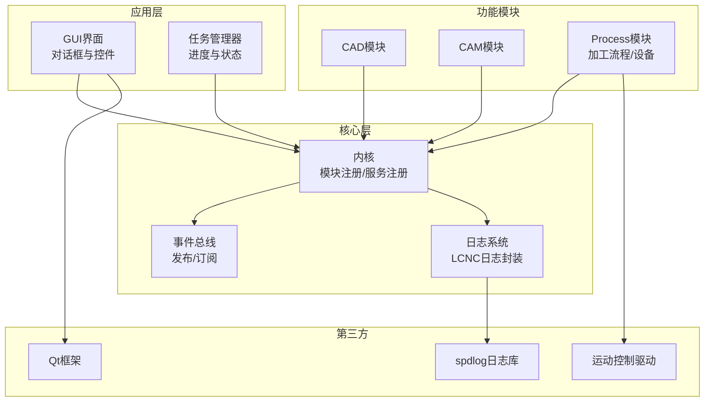
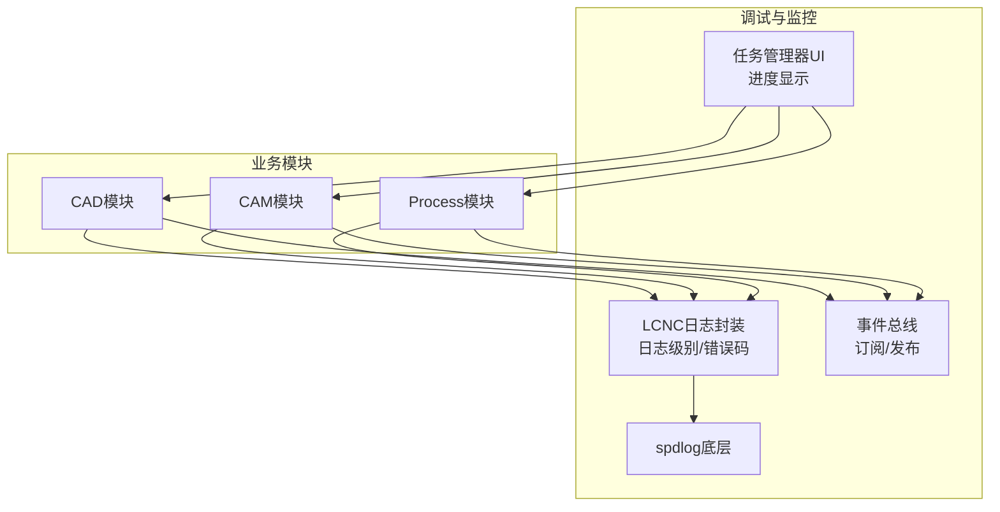
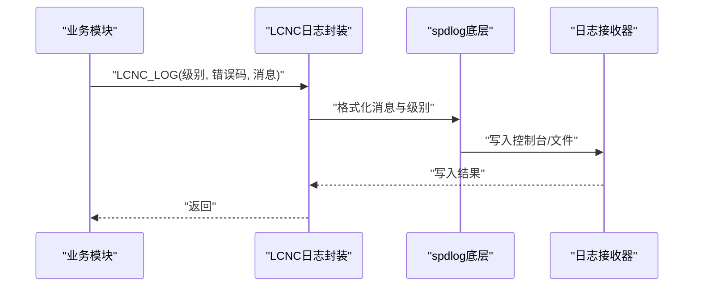
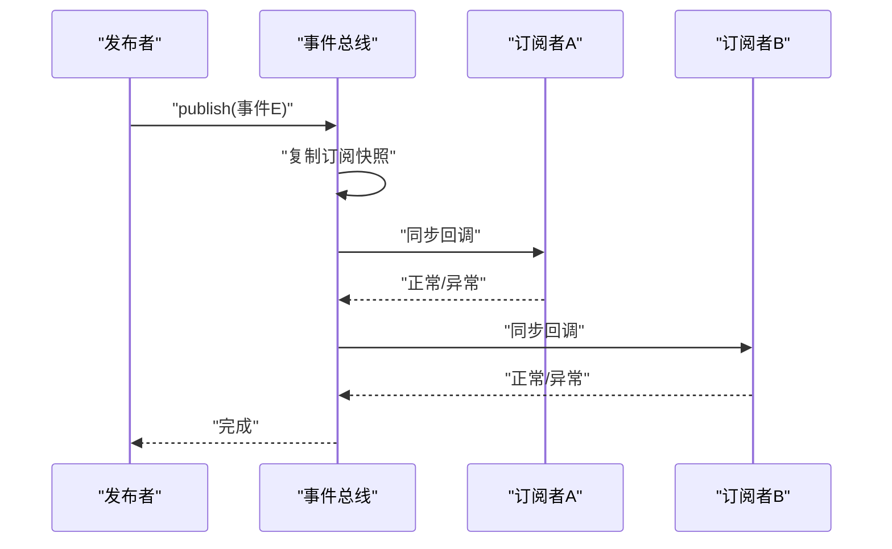
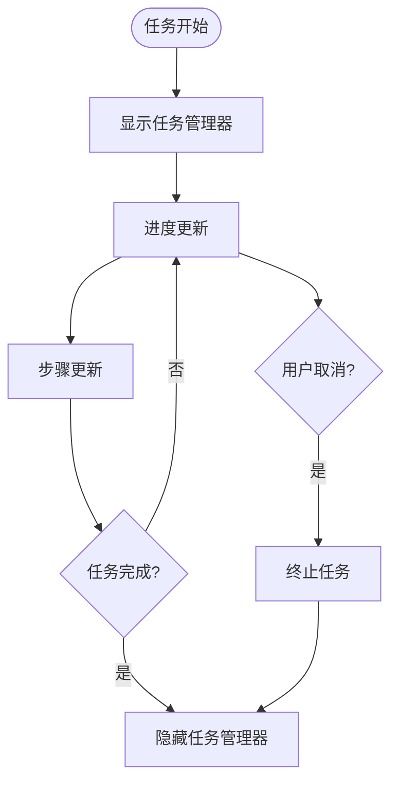
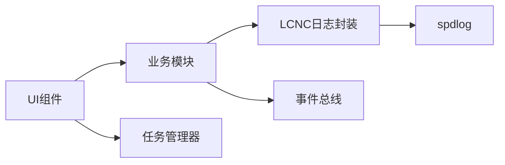

# 调试与故障排除

<cite>
**本文引用的文件**
- [log_codes.h](file://src/core/logging/log_codes.h)
- [logger.h](file://src/core/logging/logger.h)
- [logger.cpp](file://src/core/logging/logger.cpp)
- [event_bus.h](file://src/core/kernel/event_bus.h)
- [event_bus.cpp](file://src/core/kernel/event_bus.cpp)
- [spdlog.h](file://3rd/spdlog/spdlog.h)
- [logger.h](file://3rd/spdlog/logger.h)
- [dialog_task_manager.h](file://src/app/dialog/dialog_task_manager.h)
- [qg_ControlWidget.cpp](file://src/modules/process/ui/legacy/qg_ControlWidget.cpp)
- [dialog_mark_axes.cpp](file://src/modules/cam/ui/dialog_mark_axes.cpp)
- [代码规范.md](file://代码规范.md)
</cite>

## 目录
1. [简介](#简介)
2. [项目结构](#项目结构)
3. [核心组件](#核心组件)
4. [架构概览](#架构概览)
5. [详细组件分析](#详细组件分析)
6. [依赖关系分析](#依赖关系分析)
7. [性能考虑](#性能考虑)
8. [故障排除指南](#故障排除指南)
9. [结论](#结论)
10. [附录](#附录)

## 简介
本指南面向LaserCNC项目的开发者与技术支持人员，提供系统化的调试与故障排除方法。内容涵盖日志系统使用规范、错误码体系、事件总线调试、模块间通信问题排查、UI交互问题解决方案以及性能分析与内存泄漏检测技巧。通过结合项目实际代码实现，帮助快速定位问题根因并提供可操作的修复建议。

## 项目结构
LaserCNC采用微内核架构，核心模块包括：
- 核心层：内核、任务管理、文档模型、设置与配置
- 功能模块：CAD、CAM、Process（加工流程）、设备抽象层
- 视图层：图形渲染、UI组件、对话框
- 第三方库：spdlog日志系统、Qt界面框架、运动控制驱动等

**图表来源**
- [event_bus.h:1-157](file://src/core/kernel/event_bus.h#L1-L157)
- [logger.h:1-50](file://src/core/logging/logger.h#L1-L50)
- [dialog_task_manager.h:1-44](file://src/app/dialog/dialog_task_manager.h#L1-L44)

**章节来源**
- [event_bus.h:1-157](file://src/core/kernel/event_bus.h#L1-L157)
- [logger.h:1-50](file://src/core/logging/logger.h#L1-L50)
- [dialog_task_manager.h:1-44](file://src/app/dialog/dialog_task_manager.h#L1-L44)

## 核心组件
本节聚焦调试与故障排除最相关的三个核心组件：日志系统、事件总线、任务管理器。

- 日志系统（LCNC封装）
  - 提供统一的日志接口，支持不同日志级别与错误码
  - 集成spdlog作为底层实现，便于输出到控制台、文件等
  - 错误码体系用于标识具体问题类别，便于检索与统计

- 事件总线
  - 类型化发布/订阅机制，支持线程安全的事件分发
  - 提供订阅句柄管理与调试信息记录，便于排查订阅/取消订阅问题

- 任务管理器
  - UI浮动对话框展示运行中任务的进度与状态
  - 支持任务开始、进度变更、步骤更新、完成等事件

**章节来源**
- [log_codes.h:1-200](file://src/core/logging/log_codes.h#L1-L200)
- [logger.h:1-50](file://src/core/logging/logger.h#L1-L50)
- [logger.cpp:1-200](file://src/core/logging/logger.cpp#L1-L200)
- [event_bus.h:1-157](file://src/core/kernel/event_bus.h#L1-L157)
- [event_bus.cpp:1-37](file://src/core/kernel/event_bus.cpp#L1-L37)
- [dialog_task_manager.h:1-44](file://src/app/dialog/dialog_task_manager.h#L1-L44)

## 架构概览
下图展示了调试相关组件之间的交互关系，特别是日志、事件总线与UI之间的协作：

**图表来源**
- [logger.h:1-50](file://src/core/logging/logger.h#L1-L50)
- [spdlog.h:176-315](file://3rd/spdlog/spdlog.h#L176-L315)
- [event_bus.h:1-157](file://src/core/kernel/event_bus.h#L1-L157)
- [dialog_task_manager.h:1-44](file://src/app/dialog/dialog_task_manager.h#L1-L44)

## 详细组件分析

### 日志系统与错误码体系
- 日志级别
  - 支持trace、debug、info、warn、error、critical等标准级别
  - 通过编译期宏控制启用级别，便于生产环境关闭低级别日志
- 错误码体系
  - 使用枚举类型定义错误码，覆盖通用、内部意外状态、设备通信等场景
  - 在日志接口中以参数形式传入，便于后续检索与统计
- 使用规范
  - 业务模块统一通过LCNC日志接口输出，避免直接依赖spdlog
  - 关键路径（如事件总线回调异常）必须记录错误码与上下文信息
  - 控制台与文件输出可同时开启，便于离线分析

**图表来源**
- [logger.h:1-50](file://src/core/logging/logger.h#L1-L50)
- [spdlog.h:176-315](file://3rd/spdlog/spdlog.h#L176-L315)

**章节来源**
- [log_codes.h:1-200](file://src/core/logging/log_codes.h#L1-L200)
- [logger.h:1-50](file://src/core/logging/logger.h#L1-L50)
- [logger.cpp:1-200](file://src/core/logging/logger.cpp#L1-L200)
- [spdlog.h:176-315](file://3rd/spdlog/spdlog.h#L176-L315)

### 事件总线调试
- 订阅与发布
  - 订阅返回唯一句柄，用于后续取消订阅
  - 发布时对订阅列表做快照，避免回调期间修改导致迭代器失效
- 异常处理
  - 订阅回调异常会被捕获并记录错误码，防止崩溃传播
- 调试要点
  - 记录订阅/发布事件类型与数量，定位无订阅或重复订阅
  - 在取消订阅时检查句柄有效性，避免悬挂回调
  - UI线程切换：若订阅者需要更新界面，使用队列连接方式异步调用

**图表来源**
- [event_bus.h:118-155](file://src/core/kernel/event_bus.h#L118-L155)

**章节来源**
- [event_bus.h:1-157](file://src/core/kernel/event_bus.h#L1-L157)
- [event_bus.cpp:1-37](file://src/core/kernel/event_bus.cpp#L1-L37)

### 任务管理器UI调试
- 功能特性
  - 自动显示/隐藏：任务开始时显示，全部完成后隐藏
  - 单个任务可取消：Abort按钮触发任务取消
  - 实时进度：标签、进度条、步骤文本实时更新
- 调试建议
  - 通过事件日志确认任务生命周期事件是否正确触发
  - 检查UI线程更新是否使用队列连接，避免阻塞主线程
  - 若出现UI卡顿，优先检查任务回调中的重计算逻辑

**图表来源**
- [dialog_task_manager.h:18-44](file://src/app/dialog/dialog_task_manager.h#L18-L44)

**章节来源**
- [dialog_task_manager.h:1-44](file://src/app/dialog/dialog_task_manager.h#L1-L44)

## 依赖关系分析
- 日志系统依赖
  - LCNC日志封装依赖spdlog，提供统一接口与错误码支持
  - 业务模块仅依赖LCNC日志接口，降低耦合度
- 事件总线依赖
  - 事件总线自身不依赖业务模块，通过类型索引管理订阅
  - 业务模块通过事件总线进行松耦合通信
- UI依赖
  - 任务管理器对话框依赖Qt控件，但与业务逻辑解耦
  - UI更新通过事件驱动，避免直接访问业务数据

**图表来源**
- [logger.h:1-50](file://src/core/logging/logger.h#L1-L50)
- [spdlog.h:176-315](file://3rd/spdlog/spdlog.h#L176-L315)
- [event_bus.h:1-157](file://src/core/kernel/event_bus.h#L1-L157)
- [dialog_task_manager.h:1-44](file://src/app/dialog/dialog_task_manager.h#L1-L44)

**章节来源**
- [logger.h:1-50](file://src/core/logging/logger.h#L1-L50)
- [spdlog.h:176-315](file://3rd/spdlog/spdlog.h#L176-L315)
- [event_bus.h:1-157](file://src/core/kernel/event_bus.h#L1-L157)
- [dialog_task_manager.h:1-44](file://src/app/dialog/dialog_task_manager.h#L1-L44)

## 性能考虑
- 日志级别控制
  - 生产环境建议使用info及以上级别，减少trace/debug开销
  - 对高频事件使用条件判断，避免不必要的字符串拼接
- 事件总线优化
  - 减少大对象拷贝，事件类型应为轻量值类型
  - 避免在回调中执行耗时操作，必要时异步处理
- UI响应性
  - 任务进度更新使用批处理或节流策略
  - 大量UI刷新使用队列连接，避免主线程阻塞

[本节为通用指导，无需特定文件来源]

## 故障排除指南

### 日志系统使用与排错
- 常见问题
  - 日志未输出：检查spdlog初始化与sink配置
  - 错误码无法检索：确认错误码枚举定义与日志接口调用一致性
  - 日志过多影响性能：调整全局日志级别或按模块过滤
- 排查步骤
  - 启用trace级别进行问题复现，收集完整调用链
  - 使用错误码进行聚合分析，定位高频错误类型
  - 检查日志时间戳与线程ID，确认多线程场景下的并发问题

**章节来源**
- [logger.h:1-50](file://src/core/logging/logger.h#L1-L50)
- [spdlog.h:176-315](file://3rd/spdlog/spdlog.h#L176-L315)

### 事件总线调试
- 症状
  - 事件未到达订阅者：检查订阅句柄有效性与取消订阅时机
  - 订阅者异常导致崩溃：确认异常被捕获并记录
  - UI不更新：确认回调在UI线程执行或使用队列连接
- 排查步骤
  - 记录订阅/发布次数与事件类型，验证是否存在重复或遗漏
  - 在订阅者内部增加边界检查与异常日志
  - 使用最小化事件集复现问题，逐步恢复复杂场景

**章节来源**
- [event_bus.h:93-155](file://src/core/kernel/event_bus.h#L93-L155)
- [event_bus.cpp:1-37](file://src/core/kernel/event_bus.cpp#L1-L37)

### 模块间通信问题排查
- Process模块通信
  - 检查通道类型与端点配置，确保协议匹配
  - 查看通信日志模型，定位收发帧序列与错误码
- 设备抽象层
  - 确认设备初始化状态与属性更新
  - 对模拟器与真实设备分别测试，隔离驱动问题

**章节来源**
- [qg_ControlWidget.cpp:29-65](file://src/modules/process/ui/legacy/qg_ControlWidget.cpp#L29-L65)

### UI交互问题
- 任务管理器UI
  - 确认任务事件回调与UI更新的线程一致性
  - 检查对话框显示/隐藏逻辑与任务生命周期匹配
- 轴标记对话框
  - 验证网格布局与控件间距，确保在不同分辨率下正常显示

**章节来源**
- [dialog_task_manager.h:18-44](file://src/app/dialog/dialog_task_manager.h#L18-L44)
- [dialog_mark_axes.cpp:38-66](file://src/modules/cam/ui/dialog_mark_axes.cpp#L38-L66)

### 性能分析与内存泄漏检测
- 性能分析
  - 使用CPU采样工具识别热点函数，结合日志时间戳定位瓶颈
  - 分析事件总线回调耗时，优化高频事件处理
- 内存泄漏检测
  - 使用静态分析工具扫描悬空指针与越界访问
  - 对Qt对象树进行检查，确保父子关系正确
  - 定期运行内存检测工具，关注长时运行场景下的内存增长

[本节为通用指导，无需特定文件来源]

## 结论
通过统一的日志体系、健壮的事件总线与清晰的UI事件驱动，LaserCNC具备良好的可调试性。建议在开发与测试阶段充分利用trace级别日志与错误码体系，在生产环境中合理控制日志级别以平衡可观测性与性能。遇到问题时，遵循“从日志到事件总线再到UI”的排查路径，通常能够快速定位并解决问题。

[本节为总结性内容，无需特定文件来源]

## 附录

### 日志级别与错误码速查
- 日志级别：trace < debug < info < warn < error < critical
- 错误码分类：通用、内部意外状态、设备通信、配置错误等
- 使用建议：为每类问题分配固定错误码，便于自动化检索与统计

**章节来源**
- [log_codes.h:1-200](file://src/core/logging/log_codes.h#L1-L200)
- [logger.h:1-50](file://src/core/logging/logger.h#L1-L50)

### 代码规范与调试相关要点
- 文件职责单一，避免反向include
- 命令与UI分离，复杂逻辑抽到算法/service
- 日志与异常符合规范，便于问题追踪

**章节来源**
- [代码规范.md:121-129](file://代码规范.md#L121-L129)