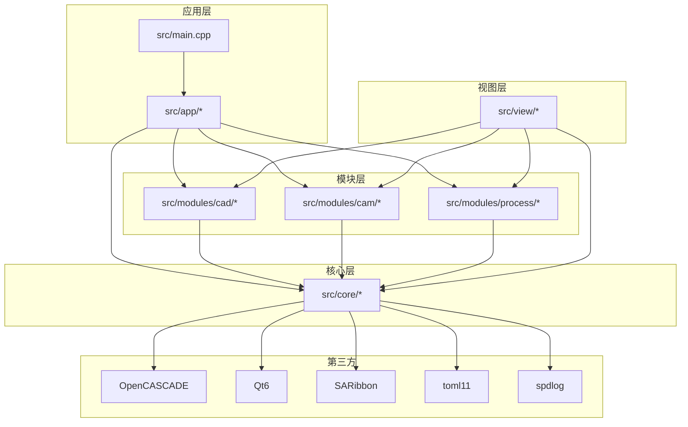
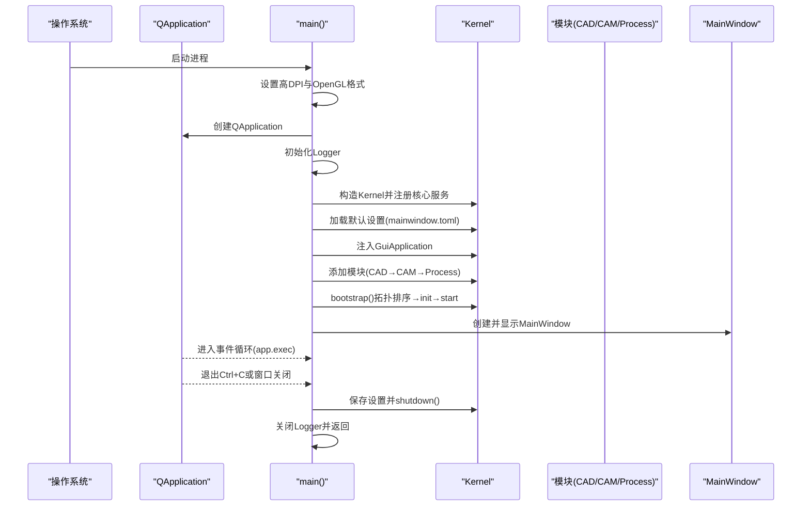
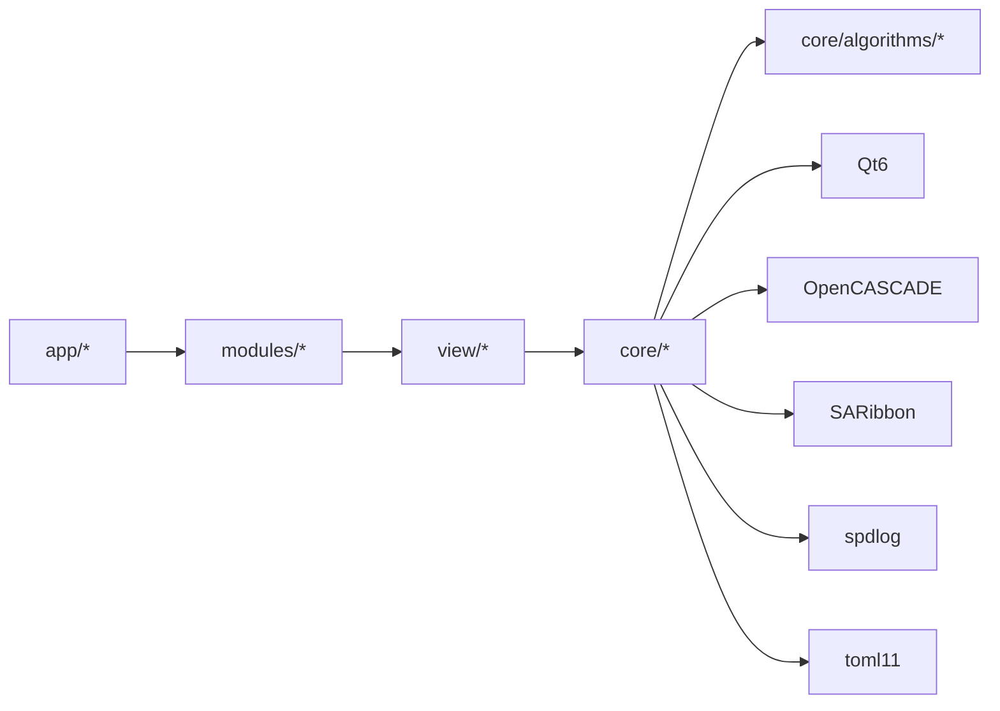

# 快速开始

<cite>
**本文引用的文件**
- [CMakeLists.txt](file://CMakeLists.txt)
- [src/main.cpp](file://src/main.cpp)
- [CLAUDE.md](file://CLAUDE.md)
- [todo.md](file://todo.md)
- [代码规范.md](file://代码规范.md)
- [build\Debug\config\mainwindow.toml](file://build/Debug/config/mainwindow.toml)
- [build\Debug\config\cam.toml](file://build/Debug/config/cam.toml)
- [build\Debug\config\process.toml](file://build/Debug/config/process.toml)
- [build\Debug\config\machine.toml](file://build/Debug/config/machine.toml)
</cite>

## 目录
1. [简介](#简介)
2. [项目结构](#项目结构)
3. [核心组件](#核心组件)
4. [架构总览](#架构总览)
5. [详细组件分析](#详细组件分析)
6. [依赖分析](#依赖分析)
7. [性能考虑](#性能考虑)
8. [故障排除指南](#故障排除指南)
9. [结论](#结论)
10. [附录](#附录)

## 简介
本指南面向首次接触 LaserCNC 的开发者，帮助你在 Windows、Linux、macOS 上快速搭建开发环境、完成编译与运行，并提供最小可行示例与常见问题排查建议。LaserCNC 是一款基于微内核架构的五轴激光加工 CAM 软件，采用 C++17、Qt6、OpenCASCADE 与 SARibbon，支持 CAD/CAM/Process 三大模块协同工作。

## 项目结构
LaserCNC 采用“微内核 + 三层文档 + 单工作区视图”的架构设计，核心目录与职责概览如下：
- src/core：核心基础设施与算法库，严格禁止反向依赖 UI/模块。
- src/view：图形渲染与视图层，负责与 OpenCASCADE/AIS 的交互。
- src/modules：业务域模块（CAD/CAM/Process），通过 Facade/Service 解耦。
- src/app：应用入口与主窗口，负责模块生命周期与设置加载。
- 3rd：第三方库（spdlog、toml11、magic_enum 等）与厂商 SDK 头文件/库。
- resources：资源文件与图标。
- build：构建产物与生成的配置文件（如 mainwindow.toml）。

图表来源
- [CMakeLists.txt:13-345](file://CMakeLists.txt#L13-L345)
- [src/main.cpp:68-114](file://src/main.cpp#L68-L114)

章节来源
- [CMakeLists.txt:1-425](file://CMakeLists.txt#L1-L425)
- [src/main.cpp:1-136](file://src/main.cpp#L1-L136)

## 核心组件
- Kernel：全局入口，负责注册核心服务、模块注册与拓扑启动。
- GuiApplication：图形应用实例，注入到 Kernel，供 CAM 等模块使用。
- MainWindow：主窗口，启动后立即显示。
- 三域文档：Workpiece（工件）、Machine（机台）、CAM（刀路）三份独立 OCC/XCAF 文档，统一在单工作区视图中显示。
- Process 模块：执行/仿真控制，不包含 OCC 类型，通过 CAM 提供的 DTO 消费数据。

章节来源
- [src/main.cpp:68-114](file://src/main.cpp#L68-L114)
- [CLAUDE.md:25-33](file://CLAUDE.md#L25-L33)

## 架构总览
LaserCNC 的启动流程遵循严格的顺序：设置 Qt/OpenGL 表面格式 → 创建 QApplication → 初始化 Logger → 构造 Kernel → 注册核心服务 → 加载设置 → 注入 GuiApplication → 添加模块（按依赖拓扑）→ 启动 Kernel → 显示 MainWindow → 进入事件循环 → 退出时保存设置、关闭 Kernel、关闭日志。

图表来源
- [src/main.cpp:33-135](file://src/main.cpp#L33-L135)
- [CLAUDE.md:56-66](file://CLAUDE.md#L56-L66)

章节来源
- [src/main.cpp:33-135](file://src/main.cpp#L33-L135)
- [CLAUDE.md:56-66](file://CLAUDE.md#L56-L66)

## 详细组件分析

### 开发环境与系统要求
- Windows
  - 编译器：MSVC 2022 x64
  - CMake：3.20+
  - Qt6：6.9.1（MSVC2022_64）
  - OpenCASCADE：7.9.0（含第三方库）
  - SARibbon：安装目录
  - 可选：Qt SerialPort（用于串口通信）
- Linux/macOS
  - CMake：3.20+
  - Qt6：6.9.1（对应平台）
  - OpenCASCADE：7.9.0（含第三方库）
  - SARibbon：安装目录
  - 可选：Qt SerialPort
- 通用依赖
  - C++17 标准
  - 第三方库：spdlog、toml11、magic_enum（随仓库提供）

章节来源
- [CMakeLists.txt:13-38](file://CMakeLists.txt#L13-L38)
- [CLAUDE.md:12-16](file://CLAUDE.md#L12-L16)

### 依赖安装与配置
- Qt6
  - 通过 CMake 变量指定 Qt6 根目录与 CMake 包路径（默认缓存变量 LCNC_QT6_ROOT、Qt6_DIR）。
  - 自动查找必需组件：Core、Gui、Widgets、OpenGL、OpenGLWidgets、Concurrent、Network、UiTools。
  - 可选 SerialPort 组件，若未找到则禁用串口通信。
- OpenCASCADE
  - 通过 LCNC_OCCT_ROOT 与 OpenCASCADE_DIR 指定安装路径。
  - 自动链接所需 OCC 库集合（TKernel、TKMath、TKGeomBase、TKCAF、TKV3d 等）。
  - 自动复制第三方库（OpenVR、FreeImage、FreeType、TBB、Draco、FFmpeg 等）至输出目录。
- SARibbon
  - 通过 LCNC_SARIBBON_ROOT 与 SARibbonBar_DIR 指定安装路径。
  - 构建后自动复制 DLL 至输出目录。
- 可选设备 SDK
  - ACS、GTN、BDAQ、真实激光设备 SDK 默认关闭，可通过 CMake 选项开启。
  - 开启后需要相应头文件与库文件存在，否则报错。

章节来源
- [CMakeLists.txt:13-38](file://CMakeLists.txt#L13-L38)
- [CMakeLists.txt:302-332](file://CMakeLists.txt#L302-L332)
- [CMakeLists.txt:396-420](file://CMakeLists.txt#L396-L420)
- [CMakeLists.txt:40-79](file://CMakeLists.txt#L40-L79)

### 编译配置与构建流程
- 建议使用 VS Code CMake Tools 或命令行方式：
  - 生成：cmake -S . -B build -DCMAKE_BUILD_TYPE=Debug
  - 构建：cmake --build build --config Debug -- /m /nologo（Windows）或 -- -j$(nproc)
- 构建产物
  - 可执行文件：LaserCNC.exe（Windows）
  - 输出目录包含 Qt、OpenCASCADE、SARibbon 运行时 DLL
- 特殊编译选项
  - MSVC：启用 /FS（串行化 PDB 写入），强制包含 windows.h 防止头文件冲突。
  - WIN32：设置入口点 mainCRTStartup，生成 Win32 控制台可执行文件。

章节来源
- [CLAUDE.md:7-18](file://CLAUDE.md#L7-L18)
- [CMakeLists.txt:371-394](file://CMakeLists.txt#L371-L394)

### 首次运行步骤
- 启动
  - 在构建目录下运行生成的可执行文件（如 build/Debug/LaserCNC.exe）。
  - 首次启动会在可执行文件所在目录创建 logs/ 子目录并输出日志。
- 初始界面
  - 主窗口 MainWindow 立即显示，包含 Ribbon 与工程树等界面元素。
- 配置文件
  - 默认配置文件位于 build/Debug/config/ 下，包括：
    - mainwindow.toml：应用与模块开关、界面布局等
    - cam.toml：CAM 相关设置
    - process.toml：Process 执行相关设置
    - machine.toml：机台配置
  - 可根据需要调整模块启用/禁用与设备参数。

章节来源
- [src/main.cpp:48-66](file://src/main.cpp#L48-L66)
- [build/Debug/config/mainwindow.toml](file://build/Debug/config/mainwindow.toml)
- [build/Debug/config/cam.toml](file://build/Debug/config/cam.toml)
- [build/Debug/config/process.toml](file://build/Debug/config/process.toml)
- [build/Debug/config/machine.toml](file://build/Debug/config/machine.toml)

### 最小可行示例
- Windows
  - 使用 VS2022 + CMake 3.20+，确保 Qt6.9.1、OpenCASCADE 7.9.0、SARibbon 安装路径正确。
  - 生成并构建后运行 build/Debug/LaserCNC.exe，观察日志与界面。
- Linux/macOS
  - 安装 Qt6.9.1、OpenCASCADE 7.9.0、SARibbon，使用 CMake 生成并构建。
  - 运行生成的可执行文件，检查日志目录与界面显示。

章节来源
- [CLAUDE.md:12-16](file://CLAUDE.md#L12-L16)
- [CMakeLists.txt:13-38](file://CMakeLists.txt#L13-L38)

## 依赖分析
- 组件耦合与分层
  - 调用方向固定为：app → modules → view → core/algorithms → core，严格禁止反向 include。
  - 跨模块通信通过 Facade/Service 与 EventBus/Qt 信号。
- 外部依赖
  - Qt6：核心 GUI/网络/OpenGL
  - OpenCASCADE：几何建模与可视化
  - SARibbon：Ribbon 界面
  - 第三方库：spdlog（日志）、toml11（配置）、magic_enum（枚举工具）

图表来源
- [CMakeLists.txt:13-345](file://CMakeLists.txt#L13-L345)
- [代码规范.md:7-23](file://代码规范.md#L7-L23)

章节来源
- [代码规范.md:7-23](file://代码规范.md#L7-L23)
- [CMakeLists.txt:13-345](file://CMakeLists.txt#L13-L345)

## 性能考虑
- OpenGL 设置：双缓冲、4x 抗锯齿、深度/模板缓冲，有助于流畅渲染。
- 多线程与异步：Qt6 Concurrent、OpenCASCADE TBB 等可用于加速计算与渲染。
- 日志级别：Release 构建建议使用 INFO/WARN，避免过多 DEBUG 日志影响性能。
- 项目 I/O：.lcnc 工程包采用压缩存储，注意磁盘 I/O 与内存占用。

章节来源
- [src/main.cpp:17-29](file://src/main.cpp#L17-L29)
- [CMakeLists.txt:321-332](file://CMakeLists.txt#L321-L332)

## 故障排除指南
- LNK1168：无法写入可执行文件
  - 原因：上次运行的 LaserCNC.exe 仍在运行。
  - 处理：结束进程后重试构建。
- Qt/OpenGL 初始化失败
  - 原因：缺少合适的 OpenGL 上下文或驱动不支持。
  - 处理：确认系统 OpenGL 支持，降低抗锯齿或深度缓冲后再试。
- Qt6/OCCT/SARibbon 路径错误
  - 原因：LCNC_QT6_ROOT、LCNC_OCCT_ROOT、LCNC_SARIBBON_ROOT 未指向有效安装目录。
  - 处理：在 CMake 配置阶段修正路径或设置为缓存变量。
- SerialPort 组件不可用
  - 现象：提示未找到 Qt6::SerialPort。
  - 处理：安装对应 Qt 组件或关闭 LCNC_WITH_SERIAL_COMM。
- OCC 第三方库缺失
  - 现象：运行时报错缺少 DLL。
  - 处理：确认 OCCT 与第三方库路径正确，构建后自动复制 DLL。
- 模块启动失败
  - 现象：Kernel bootstrap 失败。
  - 处理：检查 mainwindow.toml 中模块开关与依赖关系，确保依赖模块已启用。

章节来源
- [CLAUDE.md:17](file://CLAUDE.md#L17)
- [CMakeLists.txt:13-38](file://CMakeLists.txt#L13-L38)
- [CMakeLists.txt:396-420](file://CMakeLists.txt#L396-L420)

## 结论
通过本指南，你可以在 Windows/Linux/macOS 上完成 LaserCNC 的环境准备、编译与首次运行。建议先在 Debug 模式下验证启动与界面显示，再逐步调整模块与设备配置。遇到问题时，优先检查路径配置、依赖库与日志输出。

## 附录

### 常用命令速查
- 生成：cmake -S . -B build -DCMAKE_BUILD_TYPE=Debug
- 构建：cmake --build build --config Debug -- /m /nologo（Windows）或 -- -j$(nproc)
- 运行：build/Debug/LaserCNC.exe（Windows）或 ./LaserCNC（Linux/macOS）

章节来源
- [CLAUDE.md:7-18](file://CLAUDE.md#L7-L18)