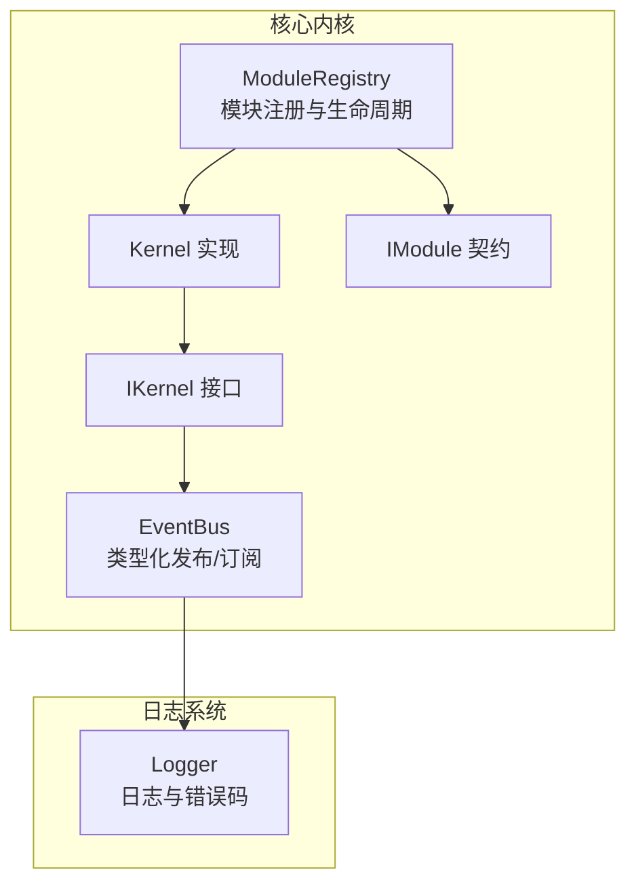
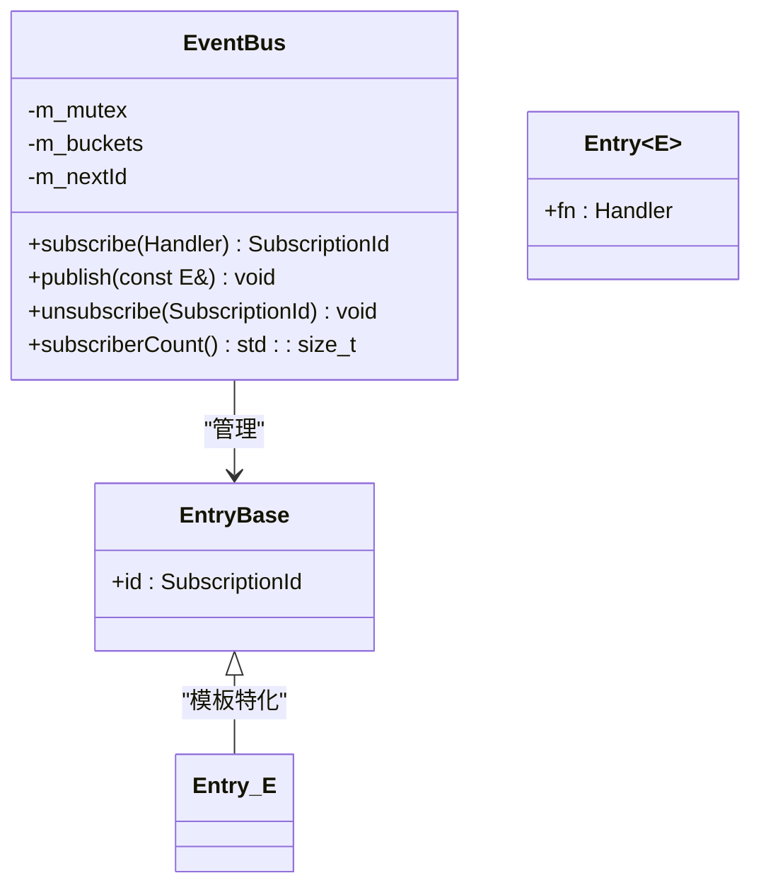
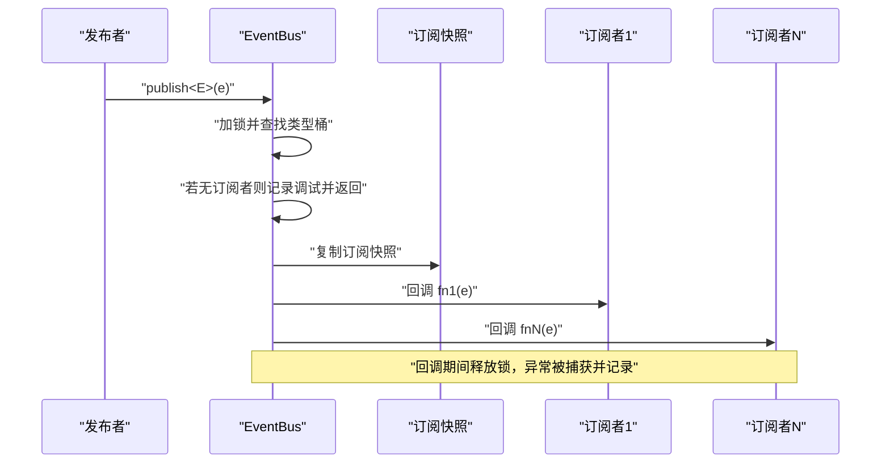
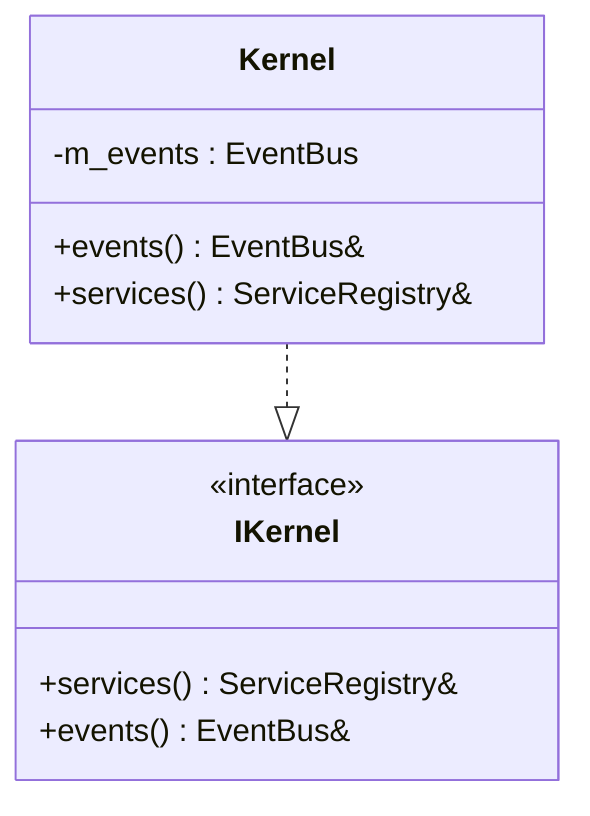
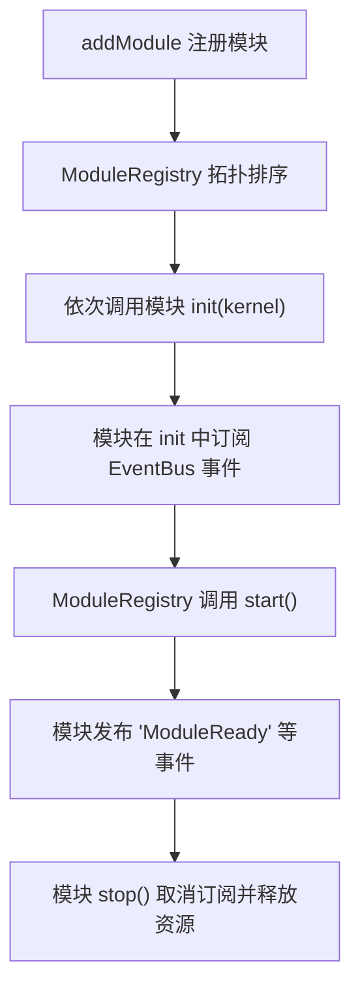
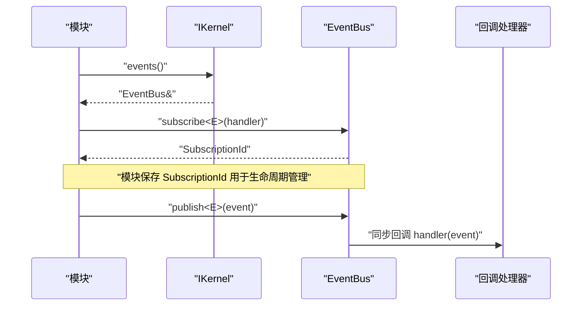
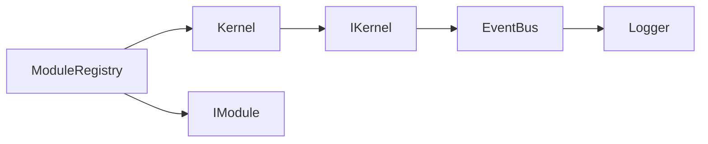

# 事件总线系统

<cite>
**本文档引用的文件**
- [event_bus.h](file://src/core/kernel/event_bus.h)
- [event_bus.cpp](file://src/core/kernel/event_bus.cpp)
- [i_kernel.h](file://src/core/kernel/i_kernel.h)
- [kernel.h](file://src/core/kernel/kernel.h)
- [module_registry.cpp](file://src/core/kernel/module_registry.cpp)
- [i_module.h](file://src/core/kernel/i_module.h)
- [logger.h](file://src/core/logging/logger.h)
</cite>

## 目录
1. [简介](#简介)
2. [项目结构](#项目结构)
3. [核心组件](#核心组件)
4. [架构概览](#架构概览)
5. [详细组件分析](#详细组件分析)
6. [依赖关系分析](#依赖关系分析)
7. [性能考虑](#性能考虑)
8. [故障排查指南](#故障排查指南)
9. [结论](#结论)
10. [附录](#附录)

## 简介
本文件为 LaserCNC 事件总线系统（EventBus）的权威技术文档，面向开发者与架构师，系统阐述发布订阅模式、事件路由机制、异步处理策略、事件类型定义、处理器注册与传播路径、错误处理与性能优化，并提供事件流图、处理器示例与调试技巧。文档同时总结事件驱动架构最佳实践与常见陷阱，帮助团队在复杂多模块场景下构建高内聚、低耦合、可扩展的事件驱动体系。

## 项目结构
EventBus 位于核心内核层，作为微内核框架的一部分，为各功能模块（CAD/CAM/Process 等）提供类型化事件通信能力。其主要文件分布如下：
- 事件总线核心：src/core/kernel/event_bus.{h,cpp}
- 内核接口：src/core/kernel/i_kernel.h
- 内核实现：src/core/kernel/kernel.h
- 模块注册与生命周期：src/core/kernel/module_registry.cpp
- 模块契约：src/core/kernel/i_module.h
- 日志系统：src/core/logging/logger.h

**图表来源**
- [event_bus.h:46-89](file://src/core/kernel/event_bus.h#L46-L89)
- [i_kernel.h:26-34](file://src/core/kernel/i_kernel.h#L26-L34)
- [kernel.h:48](file://src/core/kernel/kernel.h#L48)
- [module_registry.cpp:1-50](file://src/core/kernel/module_registry.cpp#L1-L50)
- [i_module.h:49-75](file://src/core/kernel/i_module.h#L49-L75)
- [logger.h:1-50](file://src/core/logging/logger.h#L1-L50)

**章节来源**
- [event_bus.h:15-45](file://src/core/kernel/event_bus.h#L15-L45)
- [i_kernel.h:10-36](file://src/core/kernel/i_kernel.h#L10-L36)
- [kernel.h:48](file://src/core/kernel/kernel.h#L48)
- [module_registry.cpp:1-50](file://src/core/kernel/module_registry.cpp#L1-L50)
- [i_module.h:28-75](file://src/core/kernel/i_module.h#L28-L75)
- [logger.h:1-50](file://src/core/logging/logger.h#L1-L50)

## 核心组件
- EventBus：类型化发布/订阅总线，支持模板化事件类型与回调函数，提供订阅、发布、取消订阅与订阅计数查询。
- IKernel：微内核对外接口，暴露事件总线与服务注册表。
- Kernel：IKernel 的具体实现，聚合 EventBus 并提供统一访问入口。
- ModuleRegistry：管理模块生命周期，协调模块 init/start/stop 与事件订阅/取消。
- IModule：模块契约，定义模块生命周期与在 init 阶段订阅事件的职责。
- Logger：日志与错误码，用于事件总线的调试与错误记录。

**章节来源**
- [event_bus.h:46-89](file://src/core/kernel/event_bus.h#L46-L89)
- [i_kernel.h:26-34](file://src/core/kernel/i_kernel.h#L26-L34)
- [kernel.h:48](file://src/core/kernel/kernel.h#L48)
- [module_registry.cpp:1-50](file://src/core/kernel/module_registry.cpp#L1-L50)
- [i_module.h:49-75](file://src/core/kernel/i_module.h#L49-L75)
- [logger.h:1-50](file://src/core/logging/logger.h#L1-L50)

## 架构概览
EventBus 采用“类型化发布/订阅”设计，事件类型 E 通过模板参数确定，订阅者以类型安全的方式接收事件。发布流程在调用线程同步执行，回调期间持有互斥锁，避免并发修改；回调结束后释放锁，降低阻塞时间。日志系统贯穿注册、发布、取消订阅与异常捕获，便于调试与问题定位。

**图表来源**
- [event_bus.h:73-89](file://src/core/kernel/event_bus.h#L73-L89)
- [event_bus.h:93-157](file://src/core/kernel/event_bus.h#L93-L157)

**章节来源**
- [event_bus.h:46-89](file://src/core/kernel/event_bus.h#L46-L89)
- [event_bus.cpp:5-37](file://src/core/kernel/event_bus.cpp#L5-L37)

## 详细组件分析

### 事件总线（EventBus）
- 类型化订阅与发布
  - 订阅：模板方法 subscribe<E> 接受类型 E 的回调函数，返回唯一订阅句柄；若回调为空则记录警告并返回无效句柄。
  - 发布：模板方法 publish<E> 对事件类型 E 进行分发，按订阅顺序同步回调；若无订阅者则记录调试信息。
  - 取消订阅：根据订阅句柄从对应类型的桶中查找并移除，未找到则记录调试信息。
  - 订阅计数：遍历所有桶统计当前总订阅数，用于调试与监控。
- 线程安全与性能
  - 注册/发布/取消均使用同一互斥锁保护；发布时复制订阅快照，避免回调中订阅/取消导致的迭代器失效与死锁。
  - 回调执行期间释放锁，降低阻塞时间，提升并发友好性。
- 错误处理
  - 订阅空回调：记录警告日志，返回无效句柄。
  - 发布回调异常：捕获标准异常与未知异常，记录错误日志并继续处理后续订阅者。
- 日志与可观测性
  - 订阅成功、发布开始与结束、取消订阅、订阅计数等关键节点均有日志输出，便于追踪事件传播路径。

**图表来源**
- [event_bus.h:118-155](file://src/core/kernel/event_bus.h#L118-L155)

**章节来源**
- [event_bus.h:93-157](file://src/core/kernel/event_bus.h#L93-L157)
- [event_bus.cpp:5-37](file://src/core/kernel/event_bus.cpp#L5-L37)

### 内核接口与实现（IKernel/Kernel）
- IKernel：对外暴露 events() 与 services()，作为模块访问事件总线与服务注册表的统一入口。
- Kernel：IKernel 的具体实现，聚合 EventBus 并在内核生命周期中提供事件总线访问。

**图表来源**
- [i_kernel.h:26-34](file://src/core/kernel/i_kernel.h#L26-L34)
- [kernel.h:48](file://src/core/kernel/kernel.h#L48)

**章节来源**
- [i_kernel.h:26-34](file://src/core/kernel/i_kernel.h#L26-L34)
- [kernel.h:48](file://src/core/kernel/kernel.h#L48)

### 模块生命周期与事件订阅（ModuleRegistry/IModule）
- IModule：定义模块生命周期（info/init/start/stop），强调在 init 阶段订阅事件，start 阶段发布“模块就绪”事件。
- ModuleRegistry：负责模块拓扑排序与生命周期调度，确保依赖模块先于被依赖模块完成 init。

**图表来源**
- [i_module.h:28-75](file://src/core/kernel/i_module.h#L28-L75)
- [module_registry.cpp:1-50](file://src/core/kernel/module_registry.cpp#L1-L50)

**章节来源**
- [i_module.h:28-75](file://src/core/kernel/i_module.h#L28-L75)
- [module_registry.cpp:1-50](file://src/core/kernel/module_registry.cpp#L1-L50)

### 事件类型定义与处理器注册
- 事件类型：应为“轻量值类型”，拷贝/移动廉价，避免在回调中产生额外开销。
- 处理器注册：在模块 init 阶段通过 kernel.events().subscribe<E>(handler) 订阅事件，返回 SubscriptionId 以便后续取消订阅。
- 传播路径：事件发布后，EventBus 按订阅顺序同步回调所有订阅者；若无订阅者则快速返回。

**图表来源**
- [i_kernel.h:32-33](file://src/core/kernel/i_kernel.h#L32-L33)
- [event_bus.h:56-68](file://src/core/kernel/event_bus.h#L56-L68)
- [event_bus.h:118-155](file://src/core/kernel/event_bus.h#L118-L155)

**章节来源**
- [event_bus.h:24-44](file://src/core/kernel/event_bus.h#L24-L44)
- [i_kernel.h:32-33](file://src/core/kernel/i_kernel.h#L32-L33)
- [event_bus.h:56-68](file://src/core/kernel/event_bus.h#L56-L68)
- [event_bus.h:118-155](file://src/core/kernel/event_bus.h#L118-L155)

### 异步处理策略
- 同步回调：EventBus 的回调在发布线程同步执行，保证事件传播的确定性与顺序一致性。
- UI 线程切换：UI 模块如需切回 GUI 线程，应在订阅者内部使用合适的线程切换机制（例如 Qt 的队列连接方式）。
- 异步建议：若事件处理逻辑耗时较长，建议在订阅者内部将重任务投递至专用线程池或队列，避免阻塞事件总线的回调线程。

**章节来源**
- [event_bus.h:38-44](file://src/core/kernel/event_bus.h#L38-L44)

### 事件优先级与路由机制
- 订阅顺序即传播顺序：EventBus 按订阅插入顺序依次回调订阅者，这天然提供了“先订阅先处理”的顺序语义。
- 路由机制：EventBus 通过 type_index 将事件类型映射到对应的桶（向量），实现按类型路由；发布时对目标类型桶进行快照遍历，确保遍历过程不受订阅/取消影响。

**章节来源**
- [event_bus.h:121-133](file://src/core/kernel/event_bus.h#L121-L133)
- [event_bus.h:86-88](file://src/core/kernel/event_bus.h#L86-L88)

### 错误处理与健壮性
- 空回调处理：订阅空回调时记录警告并返回无效句柄，防止悬挂回调。
- 回调异常捕获：发布回调中捕获标准异常与未知异常，记录错误日志并继续处理后续订阅者，避免单个订阅者的异常影响全局。
- 取消订阅健壮性：按句柄取消订阅时，若未找到对应订阅则记录调试信息，避免误操作。

**章节来源**
- [event_bus.h:96-101](file://src/core/kernel/event_bus.h#L96-L101)
- [event_bus.h:142-154](file://src/core/kernel/event_bus.h#L142-L154)
- [event_bus.cpp:7-23](file://src/core/kernel/event_bus.cpp#L7-L23)

## 依赖关系分析
EventBus 与内核、模块系统、日志系统之间的依赖关系如下：

**图表来源**
- [event_bus.h:11](file://src/core/kernel/event_bus.h#L11)
- [i_kernel.h:5-6](file://src/core/kernel/i_kernel.h#L5-L6)
- [kernel.h:48](file://src/core/kernel/kernel.h#L48)
- [module_registry.cpp:1-50](file://src/core/kernel/module_registry.cpp#L1-L50)
- [i_module.h:8](file://src/core/kernel/i_module.h#L8)

**章节来源**
- [event_bus.h:11](file://src/core/kernel/event_bus.h#L11)
- [i_kernel.h:5-6](file://src/core/kernel/i_kernel.h#L5-L6)
- [kernel.h:48](file://src/core/kernel/kernel.h#L48)
- [module_registry.cpp:1-50](file://src/core/kernel/module_registry.cpp#L1-L50)
- [i_module.h:8](file://src/core/kernel/i_module.h#L8)

## 性能考虑
- 时间复杂度
  - 订阅：O(1)，追加到类型桶尾部。
  - 发布：O(N)，N 为该类型订阅者数量；发布前复制快照，避免迭代器失效。
  - 取消订阅：平均 O(N)，需按句柄查找并删除。
- 空间复杂度
  - 桶结构存储每个事件类型的订阅列表，空间与订阅总数线性相关。
- 优化建议
  - 控制单事件订阅者数量，必要时拆分事件类型或引入事件聚合。
  - 将耗时任务异步化，避免阻塞事件总线回调线程。
  - 使用轻量事件类型，减少拷贝/移动成本。
  - 定期检查 subscriberCount，识别异常增长的订阅源。

**章节来源**
- [event_bus.h:118-155](file://src/core/kernel/event_bus.h#L118-L155)
- [event_bus.cpp:26-35](file://src/core/kernel/event_bus.cpp#L26-L35)

## 故障排查指南
- 症状：事件未到达订阅者
  - 检查事件类型是否匹配，确认订阅与发布的事件类型一致。
  - 使用 subscriberCount() 获取当前订阅数，确认订阅是否生效。
  - 查看日志中“publish had no subscribers”提示，确认是否存在订阅者。
- 症状：回调异常导致后续订阅者未执行
  - 查看日志中“subscriber id=... threw ...”记录，定位异常订阅者并修复。
  - 确保订阅者内部对异常进行本地处理，避免抛出到 EventBus。
- 症状：内存泄漏或悬挂回调
  - 确认模块在 stop() 中调用 unsubscribe(id) 取消订阅。
  - 避免在订阅回调中持有过长生命周期的对象引用，防止循环引用。
- 症状：UI 更新不同步
  - 在订阅者内部使用线程切换机制将 UI 更新切回 GUI 线程。

**章节来源**
- [event_bus.h:125-129](file://src/core/kernel/event_bus.h#L125-L129)
- [event_bus.h:144-152](file://src/core/kernel/event_bus.h#L144-L152)
- [event_bus.cpp:23](file://src/core/kernel/event_bus.cpp#L23)
- [event_bus.h:38-44](file://src/core/kernel/event_bus.h#L38-L44)

## 结论
LaserCNC 的 EventBus 以简洁高效的类型化发布/订阅模型，为多模块协作提供了稳定可靠的事件通道。通过严格的线程安全设计、完善的日志与错误处理机制，以及清晰的模块生命周期契约，系统在保证确定性的同时兼顾了可维护性与可扩展性。遵循本文档的最佳实践与调试技巧，可在复杂工业场景中构建高性能、低耦合的事件驱动架构。

## 附录
- 事件处理器示例（路径参考）
  - 订阅示例：[event_bus.h:28-36](file://src/core/kernel/event_bus.h#L28-L36)
  - 订阅方法：[event_bus.h:56-57](file://src/core/kernel/event_bus.h#L56-L57)
  - 发布方法：[event_bus.h:62-63](file://src/core/kernel/event_bus.h#L62-L63)
  - 取消订阅：[event_bus.cpp:5-24](file://src/core/kernel/event_bus.cpp#L5-L24)
  - 订阅计数：[event_bus.cpp:26-35](file://src/core/kernel/event_bus.cpp#L26-L35)
- 最佳实践清单
  - 使用轻量事件类型，避免昂贵拷贝。
  - 在 init 阶段订阅，在 stop 阶段取消订阅。
  - 将耗时任务异步化，避免阻塞事件总线。
  - 在订阅者内部处理异常，确保不影响其他订阅者。
  - 使用日志与 subscriberCount 进行可观测性监控。
- 常见陷阱
  - 忽略取消订阅导致悬挂回调与内存泄漏。
  - 在回调中直接进行 UI 更新而未切回 GUI 线程。
  - 订阅空回调或传递空函数指针。
  - 期望异步回调却使用同步发布，造成线程阻塞。