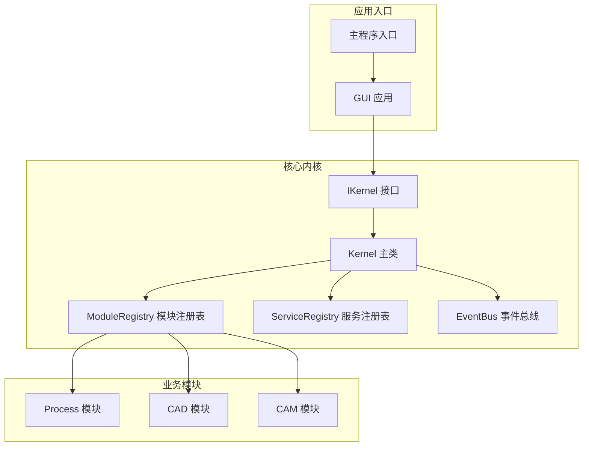
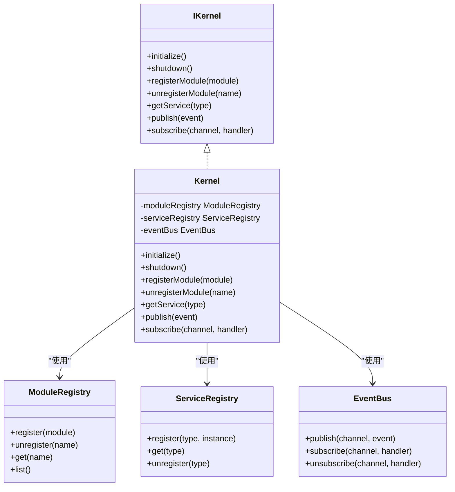
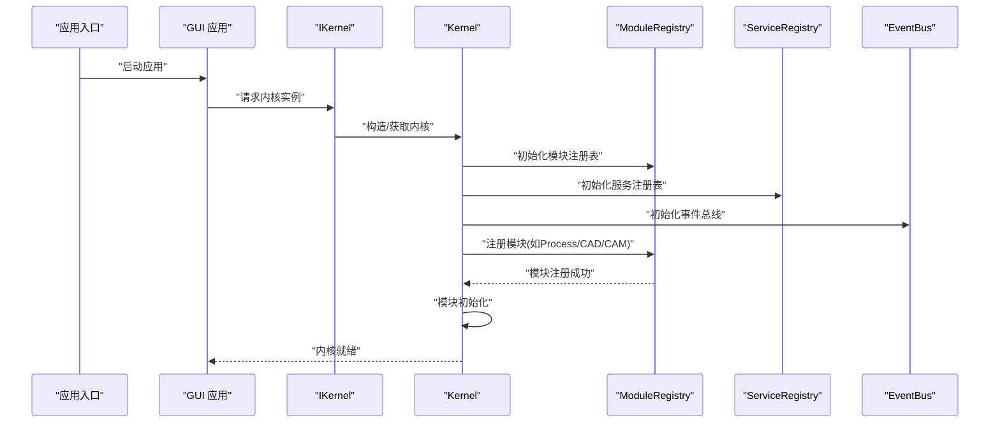
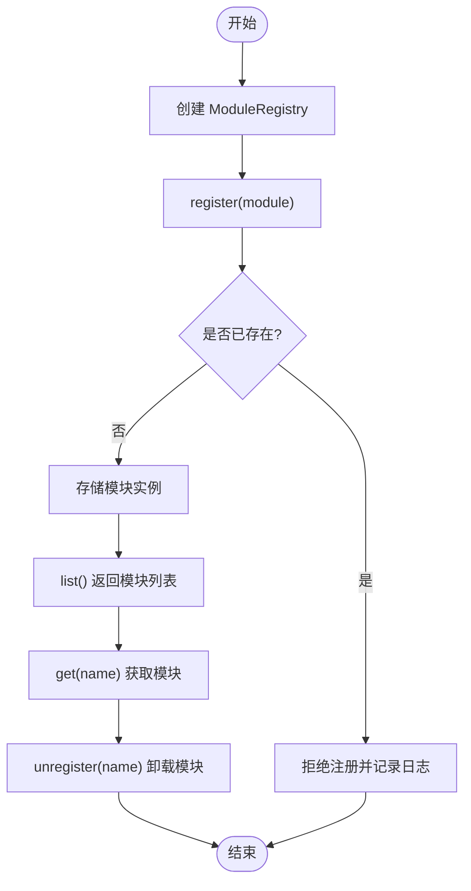
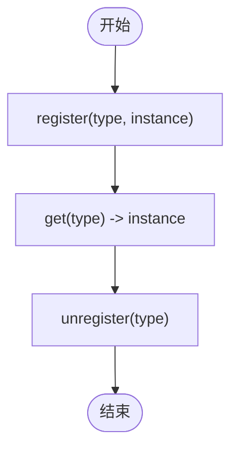
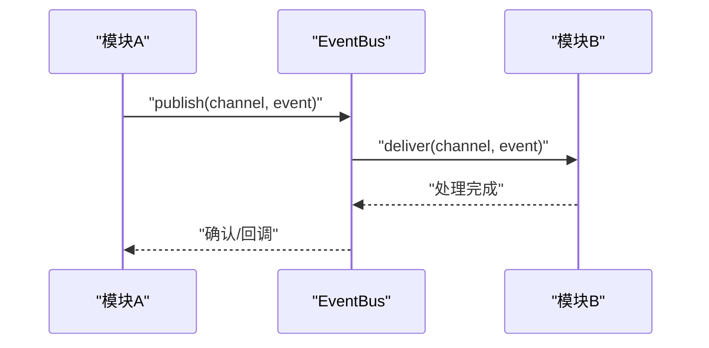
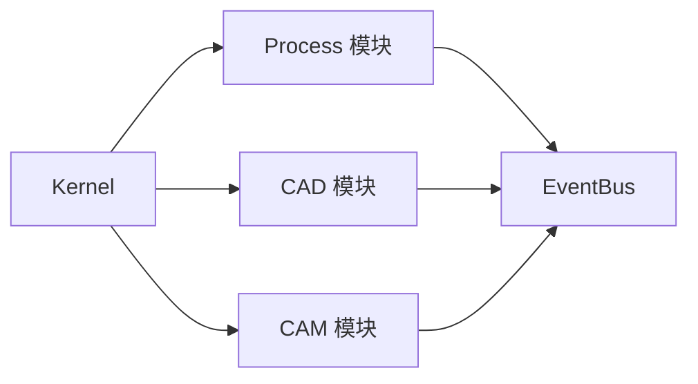
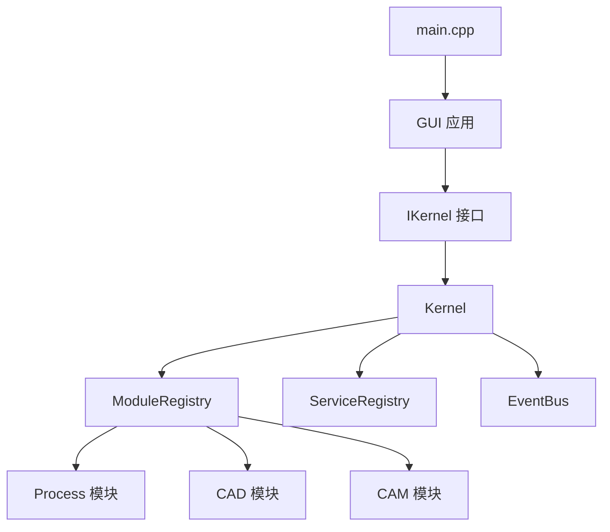

# 微内核架构

<cite>
**本文引用的文件**
- [kernel.h](file://src/core/kernel/kernel.h)
- [kernel.cpp](file://src/core/kernel/kernel.cpp)
- [i_kernel.h](file://src/core/kernel/i_kernel.h)
- [i_module.h](file://src/core/kernel/i_module.h)
- [i_service.h](file://src/core/kernel/i_service.h)
- [module_registry.h](file://src/core/kernel/module_registry.h)
- [module_registry.cpp](file://src/core/kernel/module_registry.cpp)
- [service_registry.h](file://src/core/kernel/service_registry.h)
- [service_registry.cpp](file://src/core/kernel/service_registry.cpp)
- [event_bus.h](file://src/core/kernel/event_bus.h)
- [event_bus.cpp](file://src/core/kernel/event_bus.cpp)
- [main.cpp](file://src/main.cpp)
- [process_module.h](file://src/modules/process/process_module.h)
- [process_module.cpp](file://src/modules/process/process_module.cpp)
- [cad_module.h](file://src/modules/cad/cad_module.h)
- [cad_module.cpp](file://src/modules/cad/cad_module.cpp)
- [cam_module.h](file://src/modules/cam/cam_module.h)
- [cam_module.cpp](file://src/modules/cam/cam_module.cpp)
- [gui_application.h](file://src/view/gui_application.h)
- [gui_application.cpp](file://src/view/gui_application.cpp)
</cite>

## 目录
1. [引言](#引言)
2. [项目结构](#项目结构)
3. [核心组件](#核心组件)
4. [架构总览](#架构总览)
5. [详细组件分析](#详细组件分析)
6. [依赖关系分析](#依赖关系分析)
7. [性能考虑](#性能考虑)
8. [故障排除指南](#故障排除指南)
9. [结论](#结论)
10. [附录](#附录)

## 引言
本文件系统化阐述LaserCNC的微内核架构设计与实现，重点围绕Kernel类的职责、初始化流程与生命周期管理，解释微内核相较传统单体架构在模块隔离、松耦合通信与可扩展性方面的优势，并通过架构图与组件交互示例帮助开发者理解如何基于微内核实现功能模块的独立开发与部署。

## 项目结构
LaserCNC采用分层+特性模块化的组织方式：核心内核位于src/core/kernel，各业务模块（如process、cad、cam）位于src/modules，视图与应用入口位于src/view与src/main.cpp。微内核通过接口抽象（IKernel、IModule、IService）定义边界，注册表负责模块与服务的动态装配，事件总线提供跨模块解耦通信。

图表来源
- [kernel.h](file://src/core/kernel/kernel.h)
- [kernel.cpp](file://src/core/kernel/kernel.cpp)
- [module_registry.h](file://src/core/kernel/module_registry.h)
- [module_registry.cpp](file://src/core/kernel/module_registry.cpp)
- [service_registry.h](file://src/core/kernel/service_registry.h)
- [service_registry.cpp](file://src/core/kernel/service_registry.cpp)
- [event_bus.h](file://src/core/kernel/event_bus.h)
- [event_bus.cpp](file://src/core/kernel/event_bus.cpp)
- [process_module.h](file://src/modules/process/process_module.h)
- [cad_module.h](file://src/modules/cad/cad_module.h)
- [cam_module.h](file://src/modules/cam/cam_module.h)
- [gui_application.h](file://src/view/gui_application.h)
- [gui_application.cpp](file://src/view/gui_application.cpp)
- [main.cpp](file://src/main.cpp)

章节来源
- [kernel.h](file://src/core/kernel/kernel.h)
- [kernel.cpp](file://src/core/kernel/kernel.cpp)
- [module_registry.h](file://src/core/kernel/module_registry.h)
- [module_registry.cpp](file://src/core/kernel/module_registry.cpp)
- [service_registry.h](file://src/core/kernel/service_registry.h)
- [service_registry.cpp](file://src/core/kernel/service_registry.cpp)
- [event_bus.h](file://src/core/kernel/event_bus.h)
- [event_bus.cpp](file://src/core/kernel/event_bus.cpp)
- [process_module.h](file://src/modules/process/process_module.h)
- [cad_module.h](file://src/modules/cad/cad_module.h)
- [cam_module.h](file://src/modules/cam/cam_module.h)
- [gui_application.h](file://src/view/gui_application.h)
- [gui_application.cpp](file://src/view/gui_application.cpp)
- [main.cpp](file://src/main.cpp)

## 核心组件
- Kernel（内核主类）：实现IKernel接口，负责模块与服务的注册、启动、停止与生命周期管理；协调事件总线与注册表协作。
- ModuleRegistry（模块注册表）：维护模块列表，提供模块的动态加载、启动与卸载能力。
- ServiceRegistry（服务注册表）：维护服务实例与类型映射，支持服务发现与依赖注入式获取。
- EventBus（事件总线）：提供发布/订阅机制，实现模块间松耦合通信。
- IKernel/IModule/IService（接口层）：定义内核、模块与服务的统一契约，确保实现与调用解耦。

章节来源
- [kernel.h](file://src/core/kernel/kernel.h)
- [kernel.cpp](file://src/core/kernel/kernel.cpp)
- [i_kernel.h](file://src/core/kernel/i_kernel.h)
- [i_module.h](file://src/core/kernel/i_module.h)
- [i_service.h](file://src/core/kernel/i_service.h)
- [module_registry.h](file://src/core/kernel/module_registry.h)
- [module_registry.cpp](file://src/core/kernel/module_registry.cpp)
- [service_registry.h](file://src/core/kernel/service_registry.h)
- [service_registry.cpp](file://src/core/kernel/service_registry.cpp)
- [event_bus.h](file://src/core/kernel/event_bus.h)
- [event_bus.cpp](file://src/core/kernel/event_bus.cpp)

## 架构总览
微内核架构以Kernel为核心枢纽，通过注册表与事件总线实现模块化与松耦合。应用入口（GUI或主程序）通过IKernel接口与内核交互，内核再驱动各业务模块按需启动与协作。

图表来源
- [i_kernel.h](file://src/core/kernel/i_kernel.h)
- [kernel.h](file://src/core/kernel/kernel.h)
- [kernel.cpp](file://src/core/kernel/kernel.cpp)
- [module_registry.h](file://src/core/kernel/module_registry.h)
- [service_registry.h](file://src/core/kernel/service_registry.h)
- [event_bus.h](file://src/core/kernel/event_bus.h)

## 详细组件分析

### Kernel 类：职责、初始化与生命周期
- 职责
  - 统一的生命周期管理：initialize/shutdown贯穿整个应用运行期。
  - 模块编排：registerModule/unregisterModule配合ModuleRegistry实现模块的动态装配与卸载。
  - 服务发现：getService通过ServiceRegistry按类型获取服务实例。
  - 松耦合通信：publish/subscribe通过EventBus实现跨模块事件传递。
- 初始化流程
  - 创建并初始化ModuleRegistry、ServiceRegistry、EventBus。
  - 遍历已知模块（如process、cad、cam），逐个调用其initialize并注册到ModuleRegistry。
  - 启动阶段完成后再进行服务注册与事件通道建立。
- 生命周期管理
  - shutdown时逆序停止模块，释放服务与事件订阅，确保资源有序回收。

图表来源
- [kernel.cpp](file://src/core/kernel/kernel.cpp)
- [module_registry.cpp](file://src/core/kernel/module_registry.cpp)
- [service_registry.cpp](file://src/core/kernel/service_registry.cpp)
- [event_bus.cpp](file://src/core/kernel/event_bus.cpp)
- [gui_application.cpp](file://src/view/gui_application.cpp)
- [main.cpp](file://src/main.cpp)

章节来源
- [kernel.h](file://src/core/kernel/kernel.h)
- [kernel.cpp](file://src/core/kernel/kernel.cpp)
- [i_kernel.h](file://src/core/kernel/i_kernel.h)

### 模块注册表（ModuleRegistry）
- 职责：维护模块集合，提供注册、注销、查询与枚举能力。
- 设计要点：以模块名作为键，避免重复注册；支持按需启动/停止模块。
- 与Kernel关系：Kernel在初始化时创建并持有ModuleRegistry，模块生命周期由Kernel调度。

图表来源
- [module_registry.h](file://src/core/kernel/module_registry.h)
- [module_registry.cpp](file://src/core/kernel/module_registry.cpp)

章节来源
- [module_registry.h](file://src/core/kernel/module_registry.h)
- [module_registry.cpp](file://src/core/kernel/module_registry.cpp)

### 服务注册表（ServiceRegistry）
- 职责：以类型为键管理服务实例，提供注册、获取与注销。
- 设计要点：类型安全的服务发现；支持单例或多实例策略（可扩展）。
- 与Kernel关系：Kernel通过ServiceRegistry为模块提供服务依赖注入。

图表来源
- [service_registry.h](file://src/core/kernel/service_registry.h)
- [service_registry.cpp](file://src/core/kernel/service_registry.cpp)

章节来源
- [service_registry.h](file://src/core/kernel/service_registry.h)
- [service_registry.cpp](file://src/core/kernel/service_registry.cpp)

### 事件总线（EventBus）
- 职责：发布/订阅模式实现模块间解耦通信。
- 设计要点：频道隔离、订阅去重、异常隔离；支持同步/异步事件（可扩展）。
- 与Kernel关系：Kernel通过EventBus承载模块间消息，避免直接耦合。

图表来源
- [event_bus.h](file://src/core/kernel/event_bus.h)
- [event_bus.cpp](file://src/core/kernel/event_bus.cpp)

章节来源
- [event_bus.h](file://src/core/kernel/event_bus.h)
- [event_bus.cpp](file://src/core/kernel/event_bus.cpp)

### 模块示例：Process/CAD/CAM
- Process模块：包含流程执行、指令规划、设备适配等子系统，通过process_module暴露生命周期与服务。
- CAD模块：建模、草图、布尔运算等，通过cad_module提供工具与文档状态管理。
- CAM模块：刀路生成、机器IO、参考点拾取等，通过cam_module提供加工数据与UI集成。
- 与内核交互：各模块实现IModule接口，在Kernel初始化阶段被注册与启动。

图表来源
- [process_module.h](file://src/modules/process/process_module.h)
- [process_module.cpp](file://src/modules/process/process_module.cpp)
- [cad_module.h](file://src/modules/cad/cad_module.h)
- [cad_module.cpp](file://src/modules/cad/cad_module.cpp)
- [cam_module.h](file://src/modules/cam/cam_module.h)
- [cam_module.cpp](file://src/modules/cam/cam_module.cpp)
- [kernel.cpp](file://src/core/kernel/kernel.cpp)
- [event_bus.h](file://src/core/kernel/event_bus.h)

章节来源
- [process_module.h](file://src/modules/process/process_module.h)
- [process_module.cpp](file://src/modules/process/process_module.cpp)
- [cad_module.h](file://src/modules/cad/cad_module.h)
- [cad_module.cpp](file://src/modules/cad/cad_module.cpp)
- [cam_module.h](file://src/modules/cam/cam_module.h)
- [cam_module.cpp](file://src/modules/cam/cam_module.cpp)

## 依赖关系分析
- 内部依赖
  - Kernel依赖ModuleRegistry、ServiceRegistry、EventBus。
  - 模块依赖Kernel提供的服务发现与事件通信能力。
- 外部依赖
  - 应用入口（GUI Application）通过IKernel接口与内核交互，不直接依赖具体模块实现。
- 解耦效果
  - 模块间通过EventBus解耦；模块对内核通过接口解耦；内核对模块通过注册表解耦。

图表来源
- [main.cpp](file://src/main.cpp)
- [gui_application.h](file://src/view/gui_application.h)
- [gui_application.cpp](file://src/view/gui_application.cpp)
- [i_kernel.h](file://src/core/kernel/i_kernel.h)
- [kernel.h](file://src/core/kernel/kernel.h)
- [kernel.cpp](file://src/core/kernel/kernel.cpp)
- [module_registry.h](file://src/core/kernel/module_registry.h)
- [service_registry.h](file://src/core/kernel/service_registry.h)
- [event_bus.h](file://src/core/kernel/event_bus.h)
- [process_module.h](file://src/modules/process/process_module.h)
- [cad_module.h](file://src/modules/cad/cad_module.h)
- [cam_module.h](file://src/modules/cam/cam_module.h)

章节来源
- [main.cpp](file://src/main.cpp)
- [gui_application.h](file://src/view/gui_application.h)
- [gui_application.cpp](file://src/view/gui_application.cpp)
- [i_kernel.h](file://src/core/kernel/i_kernel.h)
- [kernel.h](file://src/core/kernel/kernel.h)
- [kernel.cpp](file://src/core/kernel/kernel.cpp)
- [module_registry.h](file://src/core/kernel/module_registry.h)
- [service_registry.h](file://src/core/kernel/service_registry.h)
- [event_bus.h](file://src/core/kernel/event_bus.h)
- [process_module.h](file://src/modules/process/process_module.h)
- [cad_module.h](file://src/modules/cad/cad_module.h)
- [cam_module.h](file://src/modules/cam/cam_module.h)

## 性能考虑
- 模块懒加载：仅在需要时初始化模块，降低启动时间与内存占用。
- 事件处理：EventBus应支持异步事件与背压控制，避免热点频道阻塞。
- 注册表缓存：ServiceRegistry可引入类型到实例的快速映射，减少查找开销。
- 线程模型：建议内核与模块采用单线程事件循环或明确的线程边界，避免锁竞争。
- 日志与监控：内核应提供模块生命周期与事件吞吐的可观测性指标。

## 故障排除指南
- 模块无法注册
  - 检查模块是否正确实现IModule接口并在Kernel初始化阶段被注册。
  - 查看ModuleRegistry的注册日志与重复注册提示。
- 服务获取失败
  - 确认服务已在ServiceRegistry中注册且类型匹配。
  - 检查服务生命周期是否早于获取点销毁。
- 事件无响应
  - 确认EventBus订阅关系正确，频道名称一致。
  - 检查事件处理异常导致的订阅失效。
- 内核启动失败
  - 关注Kernel.initialize中的注册顺序与依赖链。
  - 核对模块依赖的服务是否可用。

章节来源
- [kernel.cpp](file://src/core/kernel/kernel.cpp)
- [module_registry.cpp](file://src/core/kernel/module_registry.cpp)
- [service_registry.cpp](file://src/core/kernel/service_registry.cpp)
- [event_bus.cpp](file://src/core/kernel/event_bus.cpp)

## 结论
LaserCNC的微内核架构通过清晰的接口契约、注册表与事件总线，实现了模块的高内聚与低耦合，显著提升了系统的可扩展性与可维护性。Kernel作为中枢，承担了生命周期管理与模块编排职责；ModuleRegistry与ServiceRegistry提供了动态装配与服务发现能力；EventBus则保障了模块间的松耦合通信。相较传统单体架构，微内核在模块隔离、演进速度与部署灵活性方面具备明显优势。

## 附录
- 开发者实践建议
  - 新增模块：实现IModule接口，提供必要的服务注册与事件订阅。
  - 扩展服务：在模块初始化时向ServiceRegistry注册服务实例。
  - 跨模块通信：优先使用EventBus发布/订阅，避免直接依赖。
  - 测试策略：针对Kernel初始化、模块生命周期与事件流编写单元测试与集成测试。