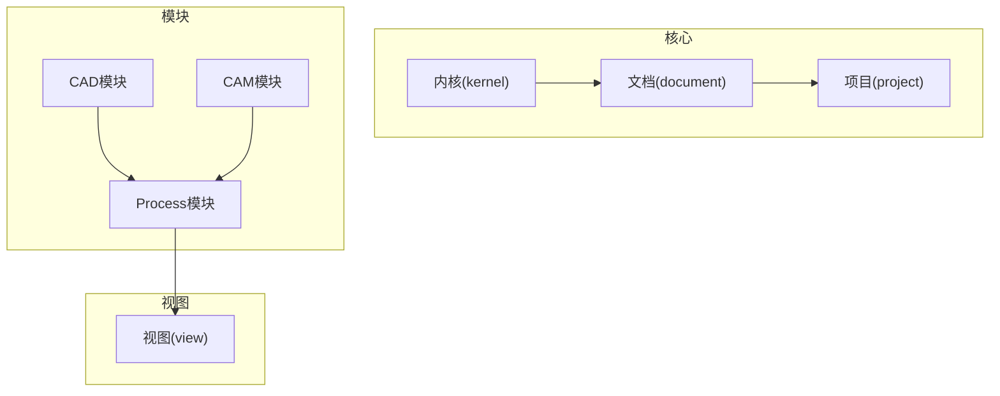
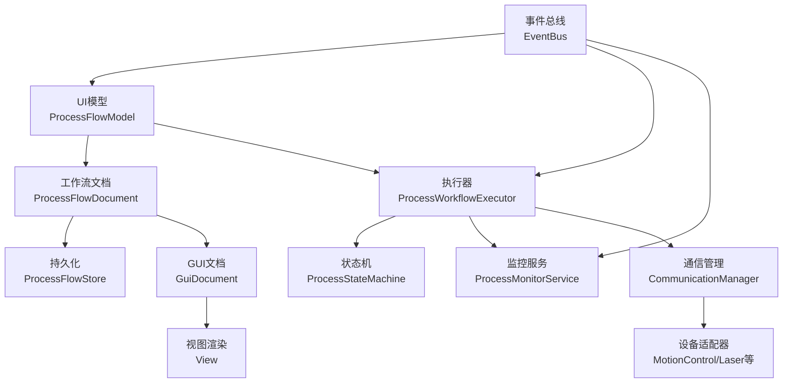
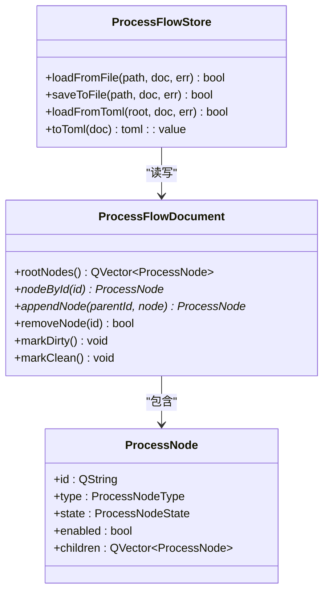
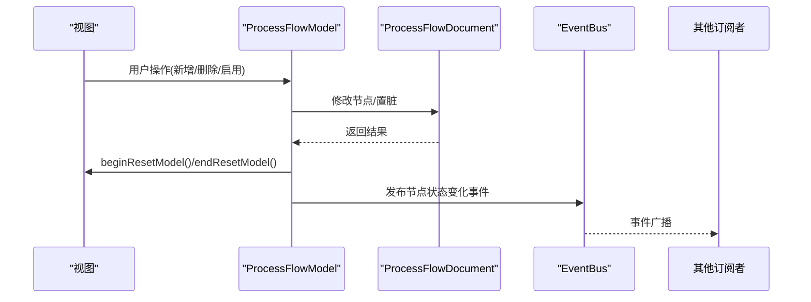
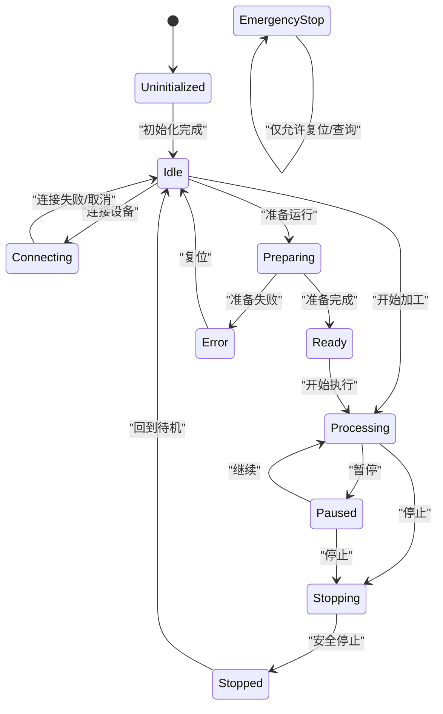
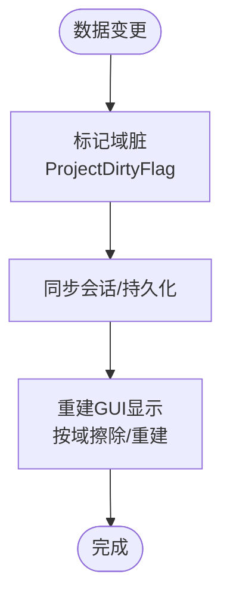
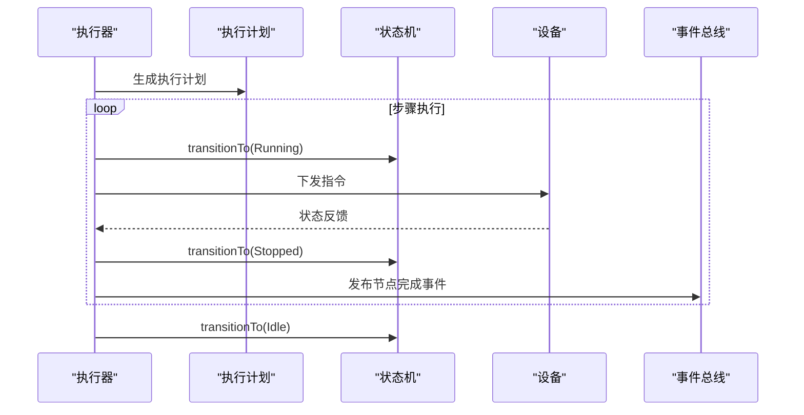
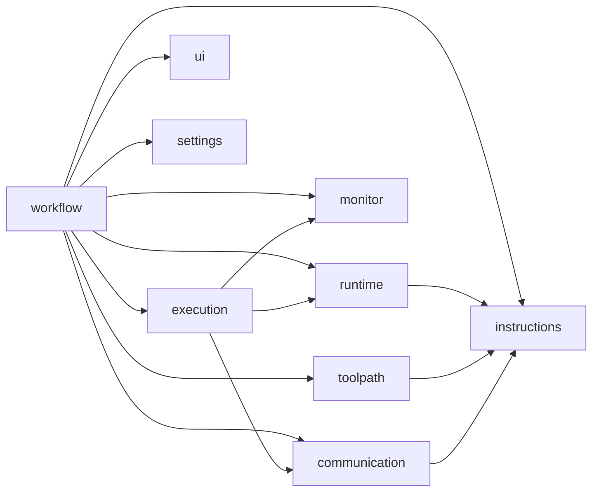

# 数据流设计

<cite>
**本文引用的文件**
- [process_flow_document.h](file://src/modules/process/workflow/process_flow_document.h)
- [process_flow_document.cpp](file://src/modules/process/workflow/process_flow_document.cpp)
- [process_flow_store.h](file://src/modules/process/workflow/process_flow_store.h)
- [process_flow_store.cpp](file://src/modules/process/workflow/process_flow_store.cpp)
- [process_flow_model.h](file://src/modules/process/ui/process_flow_model.h)
- [process_flow_model.cpp](file://src/modules/process/ui/process_flow_model.cpp)
- [process_workflow_executor.cpp](file://src/modules/process/execution/process_workflow_executor.cpp)
- [process_state_machine.h](file://src/modules/process/runtime/process_state_machine.h)
- [process_state_machine.cpp](file://src/modules/process/runtime/process_state_machine.cpp)
- [event_bus.h](file://src/core/kernel/event_bus.h)
- [event_bus.cpp](file://src/core/kernel/event_bus.cpp)
- [lcnc_document.h](file://src/core/document/lcnc_document.h)
- [lcnc_document.cpp](file://src/core/document/lcnc_document.cpp)
- [gui_document.cpp](file://src/view/gui_document.cpp)
- [project_types.h](file://src/core/project/project_types.h)
- [lcnc_project_manager.h](file://src/core/project/lcnc_project_manager.h)
- [lcnc_project_manager.cpp](file://src/core/project/lcnc_project_manager.cpp)
- [process_runtime.h](file://src/modules/process/runtime/process_runtime.h)
- [process_runtime.cpp](file://src/modules/process/runtime/process_runtime.cpp)
- [process_execution_context.h](file://src/modules/process/runtime/process_execution_context.h)
- [process_execution_context.cpp](file://src/modules/process/runtime/process_execution_context.cpp)
- [process_monitor_service.h](file://src/modules/process/monitor/process_monitor_service.h)
- [process_monitor_service.cpp](file://src/modules/process/monitor/process_monitor_service.cpp)
- [process_toolpath_service.h](file://src/modules/process/toolpath/process_toolpath_service.h)
- [process_toolpath_service.cpp](file://src/modules/process/toolpath/process_toolpath_service.cpp)
- [communication_manager.h](file://src/modules/process/communication/communication_manager.h)
- [communication_manager.cpp](file://src/modules/process/communication/communication_manager.cpp)
- [communication_channel_base.h](file://src/modules/process/communication/communication_channel_base.h)
- [communication_channel_base.cpp](file://src/modules/process/communication/communication_channel_base.cpp)
- [process_instruction_planner.h](file://src/modules/process/instructions/process_instruction_planner.h)
- [process_instruction_planner.cpp](file://src/modules/process/instructions/process_instruction_planner.cpp)
- [process_command.h](file://src/modules/process/instructions/process_command.h)
- [process_command.cpp](file://src/modules/process/instructions/process_command.cpp)
- [process_node.h](file://src/modules/process/workflow/process_node.h)
- [process_node.cpp](file://src/modules/process/workflow/process_node.cpp)
- [process_node_registry.h](file://src/modules/process/workflow/process_node_registry.h)
- [process_node_registry.cpp](file://src/modules/process/workflow/process_node_registry.cpp)
- [process_node_type.h](file://src/modules/process/workflow/process_node_type.h)
- [process_flow_store.h](file://src/modules/process/workflow/process_flow_store.h)
- [process_flow_store.cpp](file://src/modules/process/workflow/process_flow_store.cpp)
- [process_flow_model.h](file://src/modules/process/ui/process_flow_model.h)
- [process_flow_model.cpp](file://src/modules/process/ui/process_flow_model.cpp)
- [process_execution_service.h](file://src/modules/process/execution/process_execution_service.h)
- [process_execution_service.cpp](file://src/modules/process/execution/process_execution_service.cpp)
- [process_workflow_executor.h](file://src/modules/process/execution/process_workflow_executor.h)
- [process_workflow_executor.cpp](file://src/modules/process/execution/process_workflow_executor.cpp)
- [process_monitor_types.h](file://src/modules/process/monitor/process_monitor_types.h)
- [process_monitor_types.cpp](file://src/modules/process/monitor/process_monitor_types.cpp)
- [process_tool_matcher.h](file://src/modules/process/toolpath/process_tool_matcher.h)
- [process_tool_matcher.cpp](file://src/modules/process/toolpath/process_tool_matcher.cpp)
- [process_toolpath_sorter.h](file://src/modules/process/toolpath/process_toolpath_sorter.h)
- [process_toolpath_sorter.cpp](file://src/modules/process/toolpath/process_toolpath_sorter.cpp)
- [process_settings.h](file://src/modules/process/settings/process_settings.h)
- [process_settings_schema.h](file://src/modules/process/settings/process_settings_schema.h)
- [process_settings.cpp](file://src/modules/process/settings/process_settings.cpp)
- [process_settings_schema.cpp](file://src/modules/process/settings/process_settings_schema.cpp)
- [process_types.h](file://src/modules/process/legacy/process_types.h)
- [process_types.cpp](file://src/modules/process/legacy/process_types.cpp)
- [process_legacy_adapter.h](file://src/modules/process/legacy/legacy_process_types.h)
- [process_legacy_adapter.cpp](file://src/modules/process/legacy/legacy_process_types.cpp)
- [process_module.h](file://src/modules/process/process_module.h)
- [process_module.cpp](file://src/modules/process/process_module.cpp)
- [process_module_registry.h](file://src/modules/process/process_module_registry.h)
- [process_module_registry.cpp](file://src/modules/process/process_module_registry.cpp)
- [process_module_facade.h](file://src/modules/process/i_process_facade.h)
- [process_module_facade.cpp](file://src/modules/process/i_process_facade.cpp)
- [process_module_facade.h](file://src/modules/process/i_process_facade.h)
- [process_module_facade.cpp](file://src/modules/process/i_process_facade.cpp)
- [process_module_facade.h](file://src/modules/process/i_process_facade.h)
- [process_module_facade.cpp](file://src/modules/process/i_process_facade.cpp)
- [process_module_facade.h](file://src/modules/process/i_process_facade.h)
- [process_module_facade.cpp](file://src/modules/process/i_process_facade.cpp)
- [process_module_facade.h](file://src/modules/process/i_process_facade.h)
- [process_module_facade.cpp](file://src/modules/process/i_process_facade.cpp)
- [process_module_facade.h](file://src/modules/process/i_process_facade.h)
- [process_module_facade.cpp](file://src/modules/process/i_process_facade.cpp)
- [process_module_facade.h](file://src/modules/process/i_process_facade.h)
- [process_module_facade.cpp](file://src/modules/process/i_process_facade.cpp)
- [process_module_facade.h](file://src/modules/process/i_process_facade.h)
- [process_module_facade.cpp](file://src/modules/process/i_process_facade.cpp)
- [process_module_facade.h](file://src/modules/process/i_process_facade.h)
- [process_module_facade.cpp](file://src/modules/process/i_process_facade.cpp)
- [process_module_facade.h](file://src/modules/process/i_process_facade.h)
- [process_module_facade.cpp](file://src/modules/process/i_process_facade.cpp)
- [process_module_facade.h](file://src/modules/process/i_process_facade.h)
- [process_module_facade.cpp](file://src/modules/process/i_process_facade.cpp)
- [process_module_facade.h](file://src/modules/process/i_process_facade.h)
- [process_module_facade.cpp](file://src/modules/process/i_process_facade.cpp)
- [process_module_facade.h](file://src/modules/process/i_process_facade.h)
- [process_module_facade.cpp](file://src/modules/process/i_process_facade.cpp)
- [process_module_facade.h](file://src/modules/process/i_process_facade.h)
- [process_module_facade.cpp](file://src/modules/process/i_process_facade.cpp)
- [process_module_facade.h](file://src/modules/process/i_process_facade.h)
-......（省略部分文件以保持文档简洁）
</cite>

## 目录
1. [引言](#引言)
2. [项目结构](#项目结构)
3. [核心组件](#核心组件)
4. [架构总览](#架构总览)
5. [详细组件分析](#详细组件分析)
6. [依赖关系分析](#依赖关系分析)
7. [性能考虑](#性能考虑)
8. [故障排查指南](#故障排查指南)
9. [结论](#结论)
10. [附录](#附录)

## 引言
本文件面向LaserCNC的“数据流设计”，聚焦于系统中数据的流转路径、状态变更机制与一致性保障策略。文档从文档对象模型(DOM)出发，阐述工作流数据的持久化与加载、UI层的事件驱动更新、运行时状态机与事务式执行、以及设备通信与监控的实时数据流。同时给出状态转换图、数据流图与并发控制示例，并提供数据完整性检查与性能监控方法。

## 项目结构
LaserCNC采用模块化微内核架构，Process模块是数据流与执行的核心，围绕工作流文档、UI模型、执行器、状态机与监控服务构建。核心目录包括：
- 核心内核与文档：kernel、document、project
- CAD/CAM模块：cad、cam
- Process模块：workflow、execution、runtime、monitor、toolpath、communication、settings、instructions
- 视图层：view
- 第三方库：3rd

**章节来源**
- [process_module.h](file://src/modules/process/process_module.h)
- [process_module.cpp](file://src/modules/process/process_module.cpp)

## 核心组件
本节概述与数据流直接相关的关键组件及其职责：
- 工作流文档与存储：ProcessFlowDocument负责树形节点结构与状态；ProcessFlowStore负责TOML序列化/反序列化与兼容性树文件支持。
- UI模型：ProcessFlowModel作为Qt Item Model适配器，将文档暴露给视图并保持节点ID稳定。
- 执行器与状态机：ProcessWorkflowExecutor按计划推进节点状态；ProcessStateMachine提供合法状态转换约束。
- 事件总线：EventBus提供线程安全的发布/订阅机制，支撑跨模块解耦。
- 文档与项目：LcncDocument承载OCC几何与业务数据；Project域划分与脏标记确保增量更新。
- 监控与工具路径：ProcessMonitorService提供运行时监控；ProcessToolpathService负责工具路径生成与排序。

**章节来源**
- [process_flow_document.h](file://src/modules/process/workflow/process_flow_document.h)
- [process_flow_store.h](file://src/modules/process/workflow/process_flow_store.h)
- [process_flow_model.h](file://src/modules/process/ui/process_flow_model.h)
- [process_workflow_executor.h](file://src/modules/process/execution/process_workflow_executor.h)
- [process_state_machine.h](file://src/modules/process/runtime/process_state_machine.h)
- [event_bus.h](file://src/core/kernel/event_bus.h)
- [lcnc_document.h](file://src/core/document/lcnc_document.h)
- [project_types.h](file://src/core/project/project_types.h)
- [process_monitor_service.h](file://src/modules/process/monitor/process_monitor_service.h)
- [process_toolpath_service.h](file://src/modules/process/toolpath/process_toolpath_service.h)

## 架构总览
下图展示从UI到执行器再到设备的端到端数据流，以及事件驱动的更新路径。

**图表来源**
- [process_flow_model.cpp](file://src/modules/process/ui/process_flow_model.cpp)
- [process_flow_document.cpp](file://src/modules/process/workflow/process_flow_document.cpp)
- [process_flow_store.cpp](file://src/modules/process/workflow/process_flow_store.cpp)
- [process_workflow_executor.cpp](file://src/modules/process/execution/process_workflow_executor.cpp)
- [process_state_machine.cpp](file://src/modules/process/runtime/process_state_machine.cpp)
- [process_monitor_service.cpp](file://src/modules/process/monitor/process_monitor_service.cpp)
- [communication_manager.cpp](file://src/modules/process/communication/communication_manager.cpp)
- [gui_document.cpp](file://src/view/gui_document.cpp)
- [event_bus.cpp](file://src/core/kernel/event_bus.cpp)

## 详细组件分析

### 文档对象模型与持久化
- ProcessFlowDocument：维护根节点列表，提供节点查找、插入、删除、置脏/清洁标记等操作。节点包含类型、状态、启用标志、子节点等字段。
- ProcessFlowStore：提供从文件/TOML加载与保存能力，支持schema版本与兼容性树项(items)写入。
- 序列化策略：采用TOML格式，数组节点与兼容树项并存，便于向后兼容。

**图表来源**
- [process_flow_document.h](file://src/modules/process/workflow/process_flow_document.h)
- [process_flow_document.cpp](file://src/modules/process/workflow/process_flow_document.cpp)
- [process_flow_store.h](file://src/modules/process/workflow/process_flow_store.h)
- [process_flow_store.cpp](file://src/modules/process/workflow/process_flow_store.cpp)
- [process_node.h](file://src/modules/process/workflow/process_node.h)
- [process_node.cpp](file://src/modules/process/workflow/process_node.cpp)

**章节来源**
- [process_flow_document.cpp](file://src/modules/process/workflow/process_flow_document.cpp)
- [process_flow_store.cpp](file://src/modules/process/workflow/process_flow_store.cpp)

### UI事件驱动的数据更新
- ProcessFlowModel：作为QAbstractItemModel适配器，提供节点增删改查、启用/禁用切换、数据角色映射等接口；通过beginResetModel/endResetModel触发视图重绘，保持节点ID稳定。
- 事件总线：EventBus提供线程安全订阅/取消订阅与发布，用于跨模块解耦事件传播（如节点状态变化、消息日志）。

**图表来源**
- [process_flow_model.cpp](file://src/modules/process/ui/process_flow_model.cpp)
- [event_bus.cpp](file://src/core/kernel/event_bus.cpp)

**章节来源**
- [process_flow_model.cpp](file://src/modules/process/ui/process_flow_model.cpp)
- [event_bus.h](file://src/core/kernel/event_bus.h)
- [event_bus.cpp](file://src/core/kernel/event_bus.cpp)

### 状态机与事务式执行
- ProcessStateMachine：定义合法状态转换集合，提供canTransitionTo/transitionTo，确保运行时状态的一致性与安全性。
- ProcessWorkflowExecutor：根据执行计划推进节点状态，失败时设置错误状态并发出错误事件；支持暂停/恢复/停止等控制信号。
- ProcessRuntime：编排状态机与上下文，对外暴露初始化、配置变更检查与消息通道。

**图表来源**
- [process_state_machine.h](file://src/modules/process/runtime/process_state_machine.h)
- [process_state_machine.cpp](file://src/modules/process/runtime/process_state_machine.cpp)
- [process_workflow_executor.cpp](file://src/modules/process/execution/process_workflow_executor.cpp)
- [process_runtime.h](file://src/modules/process/runtime/process_runtime.h)
- [process_runtime.cpp](file://src/modules/process/runtime/process_runtime.cpp)

**章节来源**
- [process_state_machine.cpp](file://src/modules/process/runtime/process_state_machine.cpp)
- [process_workflow_executor.cpp](file://src/modules/process/execution/process_workflow_executor.cpp)
- [process_runtime.cpp](file://src/modules/process/runtime/process_runtime.cpp)

### 数据同步机制与缓存策略
- 文档同步：LcncProjectManager维护多域文档（项目、工件、设备、CAM），通过域级脏标记与会话同步，确保增量更新与一致性。
- GUI同步：GuiDocument基于源文档重建显示对象，按域擦除与重建，避免重复渲染。
- 缓存策略：Process模块未见显式缓存实现，建议在工具路径生成与设备状态查询处引入轻量LRU缓存与失效策略，结合脏标记进行增量刷新。

**图表来源**
- [lcnc_project_manager.cpp](file://src/core/project/lcnc_project_manager.cpp)
- [gui_document.cpp](file://src/view/gui_document.cpp)
- [project_types.h](file://src/core/project/project_types.h)

**章节来源**
- [lcnc_project_manager.cpp](file://src/core/project/lcnc_project_manager.cpp)
- [gui_document.cpp](file://src/view/gui_document.cpp)
- [project_types.h](file://src/core/project/project_types.h)

### 事件驱动的数据更新与事务处理
- 事件总线：EventBus提供线程安全的订阅/发布，支持运行时动态扩展事件通道。
- 事务式执行：ProcessWorkflowExecutor在执行步骤间通过定时器推进，失败时设置错误状态并发出错误事件；状态机保证状态转换合法性。
- 回滚机制：模块启动阶段采用逆序停止策略，捕获异常并记录日志，实现基础的回滚语义。

**图表来源**
- [process_workflow_executor.cpp](file://src/modules/process/execution/process_workflow_executor.cpp)
- [process_state_machine.cpp](file://src/modules/process/runtime/process_state_machine.cpp)
- [event_bus.cpp](file://src/core/kernel/event_bus.cpp)

**章节来源**
- [event_bus.cpp](file://src/core/kernel/event_bus.cpp)
- [process_workflow_executor.cpp](file://src/modules/process/execution/process_workflow_executor.cpp)
- [module_registry.cpp](file://src/core/kernel/module_registry.cpp)

### 并发控制示例
- 线程安全：EventBus内部使用互斥锁保护订阅桶，发布时快照订阅列表，避免迭代过程中的修改。
- UI更新：ProcessFlowModel使用beginResetModel/endResetModel成对调用，确保Qt模型通知的原子性。
- 设备事件：DAQ设备事件处理器注册与移除接口，支持缓冲区溢出、时间戳覆盖等异步事件回调。

**章节来源**
- [event_bus.cpp](file://src/core/kernel/event_bus.cpp)
- [process_flow_model.cpp](file://src/modules/process/ui/process_flow_model.cpp)
- [bdaqctrl.h](file://src/modules/process/device/MotionControl/bdaqctrl.h)

## 依赖关系分析
Process模块内部组件之间的依赖关系如下：

**图表来源**
- [process_workflow_executor.h](file://src/modules/process/execution/process_workflow_executor.h)
- [process_state_machine.h](file://src/modules/process/runtime/process_state_machine.h)
- [process_monitor_service.h](file://src/modules/process/monitor/process_monitor_service.h)
- [process_toolpath_service.h](file://src/modules/process/toolpath/process_toolpath_service.h)
- [communication_manager.h](file://src/modules/process/communication/communication_manager.h)
- [process_instruction_planner.h](file://src/modules/process/instructions/process_instruction_planner.h)

**章节来源**
- [process_workflow_executor.h](file://src/modules/process/execution/process_workflow_executor.h)
- [process_state_machine.h](file://src/modules/process/runtime/process_state_machine.h)
- [process_monitor_service.h](file://src/modules/process/monitor/process_monitor_service.h)
- [process_toolpath_service.h](file://src/modules/process/toolpath/process_toolpath_service.h)
- [communication_manager.h](file://src/modules/process/communication/communication_manager.h)
- [process_instruction_planner.h](file://src/modules/process/instructions/process_instruction_planner.h)

## 性能考虑
- 序列化性能：TOML序列化/反序列化开销可控，建议在批量节点操作时合并多次写入，减少磁盘IO。
- UI渲染：使用beginResetModel/endResetModel减少视图重建次数；按域擦除/重建避免全量重绘。
- 执行效率：执行计划生成与节点状态推进应尽量无阻塞；设备事件回调需快速返回，耗时逻辑放入后台线程。
- 内存管理：ProcessNode采用值语义容器，注意深拷贝成本；必要时引入共享指针或移动语义优化。

## 故障排查指南
- 状态机异常：若状态无法转换，检查canTransitionTo返回原因；查看transitionRejected信号与日志。
- 执行失败：关注failCurrentStep触发条件与错误消息；确认设备通信是否正常。
- 事件丢失：检查EventBus订阅/取消订阅流程，确保订阅ID有效且未被重复释放。
- 文档不一致：检查ProcessFlowDocument的markDirty/markClean调用时机；确认持久化前后一致性。

**章节来源**
- [process_state_machine.cpp](file://src/modules/process/runtime/process_state_machine.cpp)
- [process_workflow_executor.cpp](file://src/modules/process/execution/process_workflow_executor.cpp)
- [event_bus.cpp](file://src/core/kernel/event_bus.cpp)

## 结论
LaserCNC的数据流设计以工作流文档为核心，通过UI事件驱动与事件总线实现解耦更新，借助状态机与执行器保障运行时一致性，并以项目域与脏标记实现增量同步。建议在工具路径与设备状态查询处引入缓存与失效策略，在模块启动/停止阶段完善回滚与资源回收，持续提升系统稳定性与性能。

## 附录
- 数据完整性检查清单
  - 序列化前后校验：TOML schema版本与节点完整性校验
  - UI与文档一致性：节点ID稳定、启用/禁用状态与节点状态同步
  - 运行时一致性：状态机转换表验证、执行器节点状态推进
  - 事件完整性：订阅计数、发布快照与异常捕获
- 性能监控指标
  - 序列化耗时、UI重建次数、执行计划生成耗时、设备事件回调延迟
  - 状态机转换频率、错误率与恢复时间