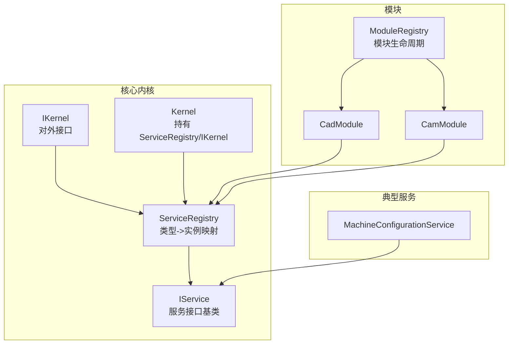
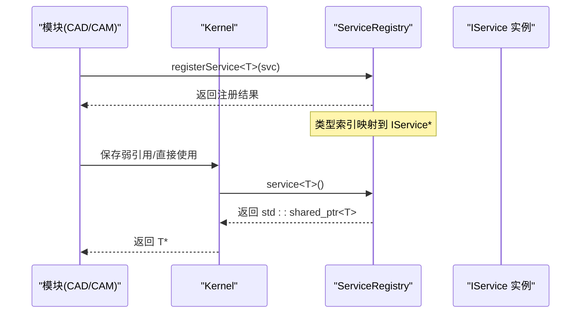
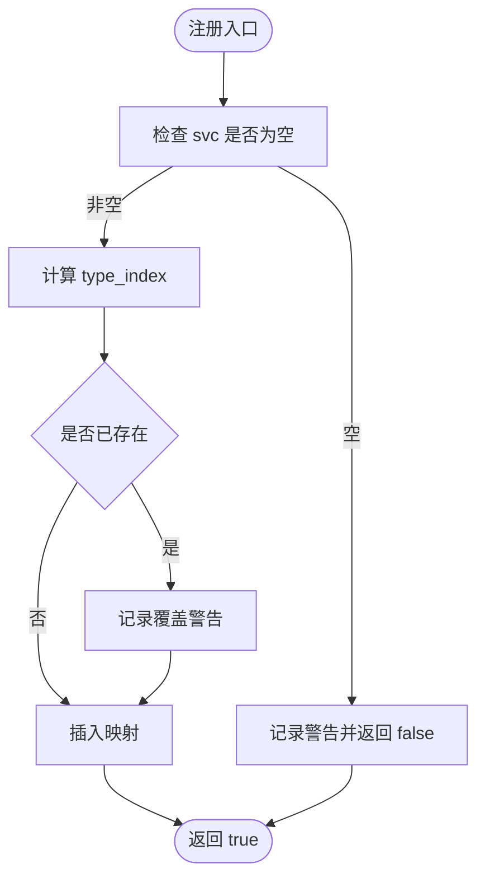
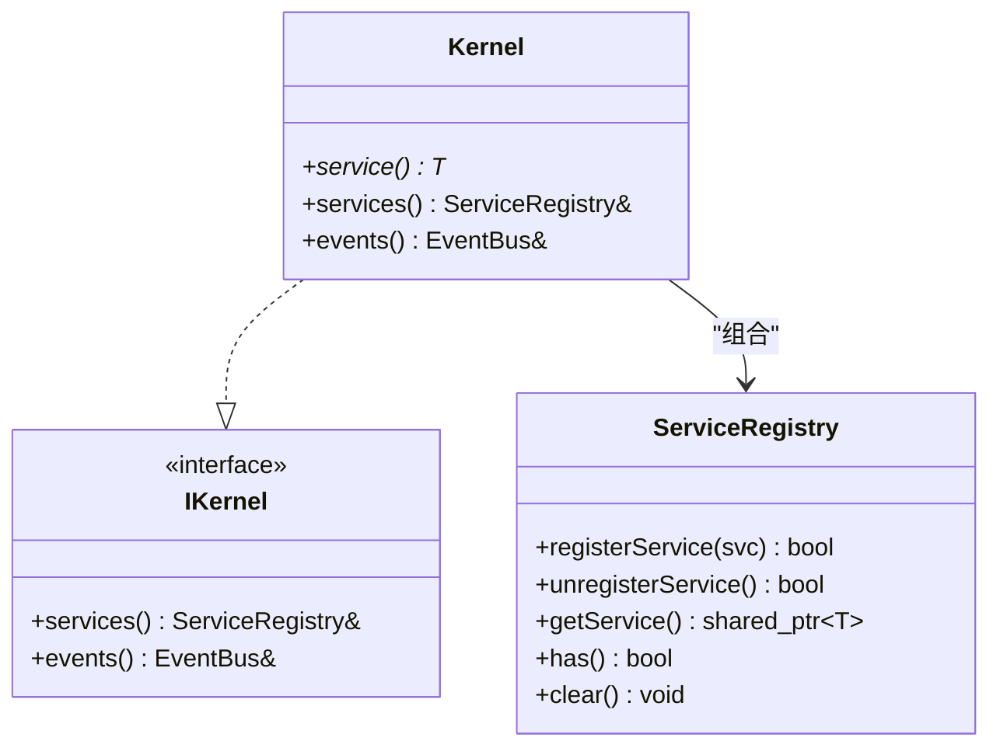
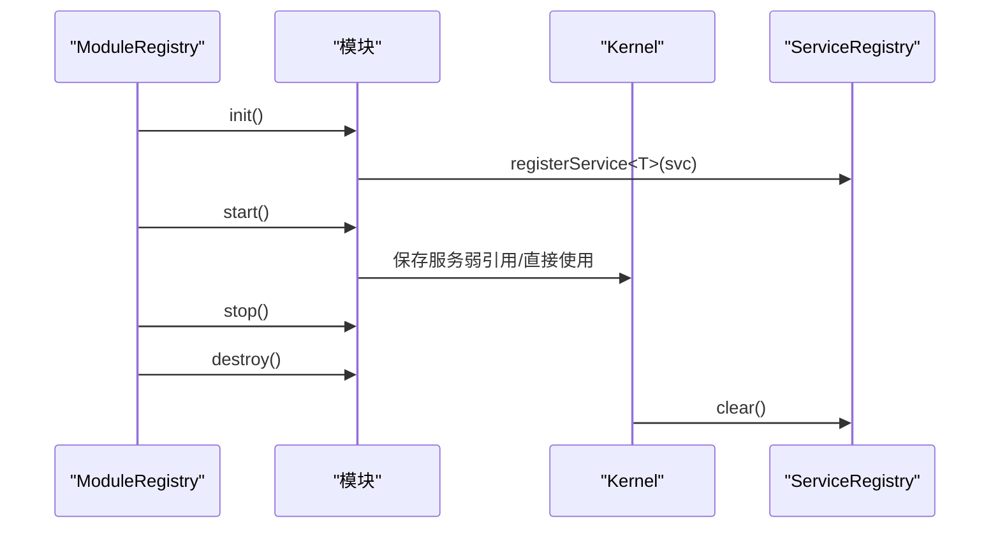
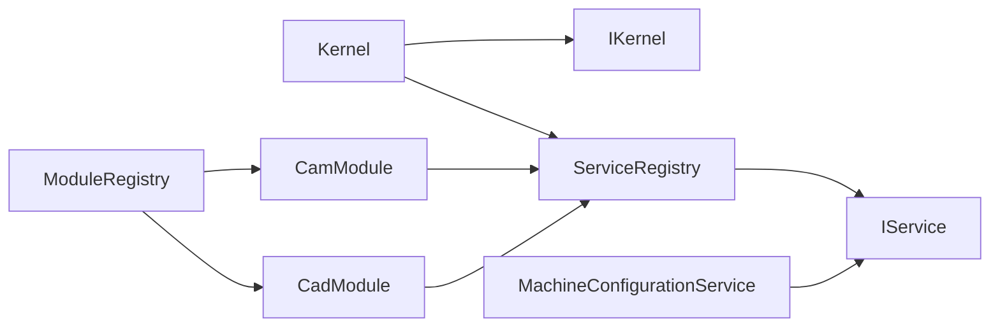

# 服务注册机制

<cite>
**本文引用的文件**
- [service_registry.h](file://src/core/kernel/service_registry.h)
- [service_registry.cpp](file://src/core/kernel/service_registry.cpp)
- [i_service.h](file://src/core/kernel/i_service.h)
- [i_kernel.h](file://src/core/kernel/i_kernel.h)
- [kernel.h](file://src/core/kernel/kernel.h)
- [kernel.cpp](file://src/core/kernel/kernel.cpp)
- [module_registry.cpp](file://src/core/kernel/module_registry.cpp)
- [machine_configuration_service.h](file://src/core/kinematics/machine_configuration_service.h)
- [machine_configuration_service.cpp](file://src/core/kinematics/machine_configuration_service.cpp)
- [cad_module.cpp](file://src/modules/cad/cad_module.cpp)
- [cam_module.cpp](file://src/modules/cam/cam_module.cpp)
- [app_context.cpp](file://src/app/app_context.cpp)
- [main_window.cpp](file://src/app/main_window.cpp)
- [dialog_options.cpp](file://src/app/dialog/dialog_options.cpp)
- [widget_machine_panel.cpp](file://src/modules/cam/ui/widget_machine_panel.cpp)
- [实施进度.md](file://实施进度.md)
</cite>

## 目录
1. [简介](#简介)
2. [项目结构](#项目结构)
3. [核心组件](#核心组件)
4. [架构总览](#架构总览)
5. [详细组件分析](#详细组件分析)
6. [依赖分析](#依赖分析)
7. [性能考虑](#性能考虑)
8. [故障排查指南](#故障排查指南)
9. [结论](#结论)
10. [附录](#附录)

## 简介
本文件系统性阐述 LaserCNC 的服务注册机制，围绕 ServiceRegistry 的设计原理、服务发现与依赖注入模式展开，解释 IService 接口的抽象设计与实现约束，梳理服务注册流程、生命周期管理与服务定位策略。文档同时给出数据结构、查询算法、服务绑定示例与开发指南，并提供性能优化建议。

## 项目结构
围绕服务注册机制的关键文件组织如下：
- 核心注册表与接口：ServiceRegistry、IService、IKernel
- 内核集成：Kernel 持有 ServiceRegistry 并暴露统一访问入口
- 模块注册与生命周期：ModuleRegistry 管理模块 init/start/stop
- 典型服务实现：MachineConfigurationService
- 模块侧注册与使用：CAD/CAM 模块在 init 阶段注册服务；应用层通过 Kernel::service<T>() 获取服务

图表来源
- [kernel.h:119-148](file://src/core/kernel/kernel.h#L119-L148)
- [service_registry.h:26-68](file://src/core/kernel/service_registry.h#L26-L68)
- [i_service.h](file://src/core/kernel/i_service.h)
- [i_kernel.h:26-34](file://src/core/kernel/i_kernel.h#L26-L34)
- [module_registry.cpp:111-210](file://src/core/kernel/module_registry.cpp#L111-L210)

章节来源
- [kernel.h:119-148](file://src/core/kernel/kernel.h#L119-L148)
- [service_registry.h:12-68](file://src/core/kernel/service_registry.h#L12-L68)
- [i_service.h](file://src/core/kernel/i_service.h)
- [i_kernel.h:10-34](file://src/core/kernel/i_kernel.h#L10-L34)
- [module_registry.cpp:111-210](file://src/core/kernel/module_registry.cpp#L111-L210)

## 核心组件
- ServiceRegistry：基于 type_index 的无序映射容器，提供注册、取消注册、查询、存在性判断与清空等操作。模板方法确保类型必须继承自 IService。
- IService：服务接口基类，所有可注册服务均实现该接口。
- IKernel：微内核对外接口，提供服务注册表与事件总线访问。
- Kernel：内核实现，持有 ServiceRegistry、EventBus、ModuleRegistry，并提供便捷的 service<T>() 查询方法。
- ModuleRegistry：模块生命周期管理器，负责模块初始化、启动与停止顺序控制。

章节来源
- [service_registry.h:26-68](file://src/core/kernel/service_registry.h#L26-L68)
- [service_registry.cpp:7-15](file://src/core/kernel/service_registry.cpp#L7-L15)
- [i_service.h](file://src/core/kernel/i_service.h)
- [i_kernel.h:26-34](file://src/core/kernel/i_kernel.h#L26-L34)
- [kernel.h:119-148](file://src/core/kernel/kernel.h#L119-L148)
- [module_registry.cpp:111-210](file://src/core/kernel/module_registry.cpp#L111-L210)

## 架构总览
ServiceRegistry 作为“服务定位器”，采用类型索引进行服务定位，不承担依赖解析与生命周期管理职责。Kernel 将其作为通用服务注册表的唯一出口，模块在 init 阶段注册服务，应用层通过 Kernel::service<T>() 获取服务实例。

图表来源
- [service_registry.h:35-50](file://src/core/kernel/service_registry.h#L35-L50)
- [kernel.h:123-130](file://src/core/kernel/kernel.h#L123-L130)
- [cad_module.cpp:444-447](file://src/modules/cad/cad_module.cpp#L444-L447)
- [cam_module.cpp:224-232](file://src/modules/cam/cam_module.cpp#L224-L232)

## 详细组件分析

### ServiceRegistry 设计与实现
- 数据结构：内部使用 std::unordered_map<std::type_index, std::shared_ptr<IService>> 维护类型到服务实例的映射。
- 注册流程：模板方法 registerService<T>(std::shared_ptr<T>)，静态断言要求 T 继承自 IService；若传入空指针则记录警告并返回 false；重复注册会覆盖旧值并记录警告。
- 查询算法：getService<T>() 使用 type_index 查找，未命中返回空 shared_ptr；has<T>() 判断是否存在。
- 生命周期：clear() 用于关闭阶段清空所有服务，建议在 shutdown 期间确保无模块持有这些服务。
- 线程安全：当前实现假设注册在主线程、查询也以主线程为主；未来如需多线程查询可考虑引入读写锁。

图表来源
- [service_registry.h:72-97](file://src/core/kernel/service_registry.h#L72-L97)

章节来源
- [service_registry.h:26-68](file://src/core/kernel/service_registry.h#L26-L68)
- [service_registry.cpp:7-15](file://src/core/kernel/service_registry.cpp#L7-L15)

### IService 抽象设计与实现模式
- 抽象基类：IService 作为所有服务的共同接口，模块注册的服务必须实现该接口。
- 实现约束：服务实现通常需要满足以下条件：
  - 明确的服务边界与职责划分
  - 与 Kernel 的交互通过 IKernel/services() 完成
  - 生命周期与模块一致，在模块 init/start/stop 阶段正确管理资源
- 典型实现：MachineConfigurationService 同时继承 QObject、IService、TomlConfig，体现服务与 Qt 对象模型及配置系统的结合。

章节来源
- [i_service.h](file://src/core/kernel/i_service.h)
- [machine_configuration_service.h:35-36](file://src/core/kinematics/machine_configuration_service.h#L35-L36)

### Kernel 与服务定位策略
- Kernel 持有 ServiceRegistry 与 EventBus，并通过 service<T>() 提供便捷查询。
- 定位策略：
  - 优先使用 Kernel::current().service<T>() 获取服务
  - 若服务可能不存在，应先调用 has<T>() 或捕获空指针行为
  - 长期持有建议使用 std::weak_ptr 避免循环引用

图表来源
- [kernel.h:119-148](file://src/core/kernel/kernel.h#L119-L148)
- [i_kernel.h:26-34](file://src/core/kernel/i_kernel.h#L26-L34)
- [service_registry.h:26-68](file://src/core/kernel/service_registry.h#L26-L68)

章节来源
- [kernel.h:119-148](file://src/core/kernel/kernel.h#L119-L148)
- [i_kernel.h:26-34](file://src/core/kernel/i_kernel.h#L26-L34)

### 模块注册与服务绑定示例
- 模块注册：在模块 init 阶段调用 kernel.services().registerService<T>(svcPtr)，将服务实例注册到全局注册表。
- 应用层使用：通过 Kernel::current().service<T>() 获取服务指针，进而调用服务方法。
- 示例文件路径：
  - 模块注册：[cad_module.cpp:444-447](file://src/modules/cad/cad_module.cpp#L444-L447), [cam_module.cpp:224-232](file://src/modules/cam/cam_module.cpp#L224-L232)
  - 应用层使用：[app_context.cpp:66-76](file://src/app/app_context.cpp#L66-L76), [main_window.cpp:907-907](file://src/app/main_window.cpp#L907-L907), [dialog_options.cpp:260-260](file://src/app/dialog/dialog_options.cpp#L260-L260), [widget_machine_panel.cpp:323-323](file://src/modules/cam/ui/widget_machine_panel.cpp#L323-L323)

章节来源
- [cad_module.cpp:444-447](file://src/modules/cad/cad_module.cpp#L444-L447)
- [cam_module.cpp:224-232](file://src/modules/cam/cam_module.cpp#L224-L232)
- [app_context.cpp:66-76](file://src/app/app_context.cpp#L66-L76)
- [main_window.cpp:907-907](file://src/app/main_window.cpp#L907-L907)
- [dialog_options.cpp:260-260](file://src/app/dialog/dialog_options.cpp#L260-L260)
- [widget_machine_panel.cpp:323-323](file://src/modules/cam/ui/widget_machine_panel.cpp#L323-L323)

### 生命周期管理
- 模块生命周期：ModuleRegistry 在 startAll 阶段按拓扑顺序执行模块 init/start，失败时进行回滚；stopAll 阶段反序停止模块。
- 服务生命周期：ServiceRegistry 不参与依赖解析与生命周期管理，仅作为容器；Kernel 在 shutdown 期间调用 clear() 清空服务映射。

图表来源
- [module_registry.cpp:111-210](file://src/core/kernel/module_registry.cpp#L111-L210)
- [service_registry.cpp:7-15](file://src/core/kernel/service_registry.cpp#L7-L15)

章节来源
- [module_registry.cpp:111-210](file://src/core/kernel/module_registry.cpp#L111-L210)
- [service_registry.cpp:7-15](file://src/core/kernel/service_registry.cpp#L7-L15)

## 依赖分析
- 组件耦合：
  - ServiceRegistry 与 IService 强耦合（类型约束），与具体服务实现弱耦合（通过 IService* 存储）
  - Kernel 与 ServiceRegistry 强耦合（组合关系），与 IKernel 形成接口-实现分离
  - ModuleRegistry 与模块实现强耦合（生命周期管理），与 ServiceRegistry 间接耦合（模块注册服务）
- 外部依赖：
  - Qt 对象模型（QObject）与信号槽机制在服务实现中广泛使用
  - 日志系统用于注册与查询过程的调试信息输出

图表来源
- [service_registry.h:26-68](file://src/core/kernel/service_registry.h#L26-L68)
- [i_service.h](file://src/core/kernel/i_service.h)
- [kernel.h:119-148](file://src/core/kernel/kernel.h#L119-L148)
- [module_registry.cpp:111-210](file://src/core/kernel/module_registry.cpp#L111-L210)
- [machine_configuration_service.h:35-36](file://src/core/kinematics/machine_configuration_service.h#L35-L36)

章节来源
- [service_registry.h:26-68](file://src/core/kernel/service_registry.h#L26-L68)
- [i_service.h](file://src/core/kernel/i_service.h)
- [kernel.h:119-148](file://src/core/kernel/kernel.h#L119-L148)
- [module_registry.cpp:111-210](file://src/core/kernel/module_registry.cpp#L111-L210)
- [machine_configuration_service.h:35-36](file://src/core/kinematics/machine_configuration_service.h#L35-L36)

## 性能考虑
- 查询复杂度：ServiceRegistry 使用 type_index 作为键，底层为 unordered_map，平均 O(1) 查找；注册/取消注册也为平均 O(1)。
- 内存占用：每个服务实例占用一次映射条目；shared_ptr 引用计数开销较小。
- 线程安全：当前实现未加锁，适合单线程注册/查询场景；如需多线程查询，建议引入读写锁或原子操作。
- 建议：
  - 避免在热路径频繁注册/取消注册服务
  - 使用 has<T>() 预判存在性，减少空指针分支
  - 长期持有服务时使用 weak_ptr，防止内存泄漏

## 故障排查指南
- 注册失败：
  - 空指针：registerService<T>() 对空指针记录警告并返回 false，检查服务构造与共享指针有效性
  - 重复注册：同一类型重复注册会覆盖并记录警告，确认模块 init 流程是否多次注册
- 查询失败：
  - 未注册：getService<T>() 返回空 shared_ptr，调用方需自行判空；可通过 has<T>() 预判
- 关闭阶段：
  - clear() 前确保无模块仍在使用服务；否则可能导致悬挂指针或崩溃

章节来源
- [service_registry.h:72-135](file://src/core/kernel/service_registry.h#L72-L135)
- [service_registry.cpp:7-15](file://src/core/kernel/service_registry.cpp#L7-L15)

## 结论
ServiceRegistry 以最小实现提供类型驱动的服务定位能力，配合 Kernel 的统一入口与 ModuleRegistry 的生命周期管理，形成清晰的服务注册与发现体系。通过 IService 抽象与模块化设计，系统实现了松耦合的服务架构，便于扩展与维护。

## 附录

### 服务开发指南
- 设计服务接口：
  - 明确职责边界，遵循单一职责原则
  - 继承 IService 并在合适时机注册到 ServiceRegistry
- 实现服务：
  - 如需与 Qt 集成，可继承 QObject；如需配置持久化，可继承 TomlConfig
  - 在模块 init 阶段完成服务注册，避免在其他阶段动态注册
- 使用服务：
  - 通过 Kernel::current().service<T>() 获取实例
  - 对可能不存在的服务使用 has<T>() 预判，或在调用前进行空指针检查
  - 长期持有使用 std::weak_ptr，避免循环引用

章节来源
- [i_service.h](file://src/core/kernel/i_service.h)
- [machine_configuration_service.h:35-36](file://src/core/kinematics/machine_configuration_service.h#L35-L36)
- [kernel.h:123-130](file://src/core/kernel/kernel.h#L123-L130)

### 典型服务绑定示例
- 注册服务：
  - CAD 模块：[cad_module.cpp:444-447](file://src/modules/cad/cad_module.cpp#L444-L447)
  - CAM 模块：[cam_module.cpp:224-232](file://src/modules/cam/cam_module.cpp#L224-L232)
- 使用服务：
  - 应用上下文：[app_context.cpp:66-76](file://src/app/app_context.cpp#L66-L76)
  - 主窗口：[main_window.cpp:907-907](file://src/app/main_window.cpp#L907-L907)
  - 选项对话框：[dialog_options.cpp:260-260](file://src/app/dialog/dialog_options.cpp#L260-L260)
  - CAM 控制面板：[widget_machine_panel.cpp:323-323](file://src/modules/cam/ui/widget_machine_panel.cpp#L323-L323)

章节来源
- [cad_module.cpp:444-447](file://src/modules/cad/cad_module.cpp#L444-L447)
- [cam_module.cpp:224-232](file://src/modules/cam/cam_module.cpp#L224-L232)
- [app_context.cpp:66-76](file://src/app/app_context.cpp#L66-L76)
- [main_window.cpp:907-907](file://src/app/main_window.cpp#L907-L907)
- [dialog_options.cpp:260-260](file://src/app/dialog/dialog_options.cpp#L260-L260)
- [widget_machine_panel.cpp:323-323](file://src/modules/cam/ui/widget_machine_panel.cpp#L323-L323)

### 系统级机台构型服务
- MachineConfigurationService 作为系统级构型事实源，启动时加载配置文件并在 CAM/Process 模块间解耦。
- 注册与使用：
  - 注册：在 Kernel::registerCoreServices() 中注册
  - 使用：通过 Kernel::current().service<MachineConfigurationService>() 获取

章节来源
- [machine_configuration_service.h:35-49](file://src/core/kinematics/machine_configuration_service.h#L35-L49)
- [machine_configuration_service.cpp:1-202](file://src/core/kinematics/machine_configuration_service.cpp#L1-L202)
- [kernel.cpp:69-69](file://src/core/kernel/kernel.cpp#L69-L69)
- [实施进度.md:57-66](file://实施进度.md#L57-L66)