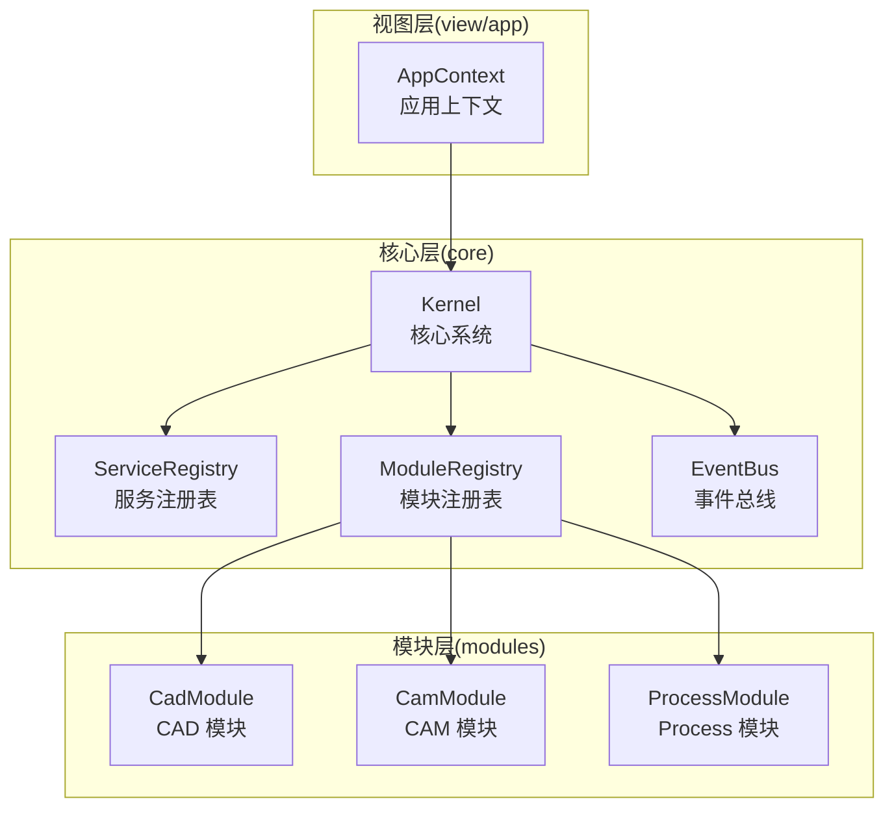
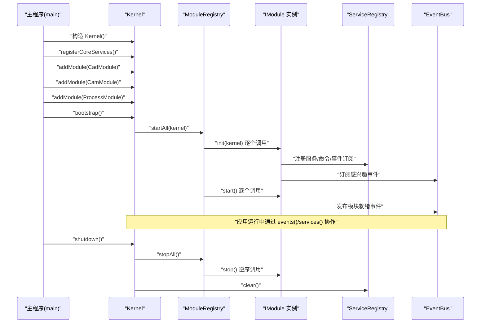
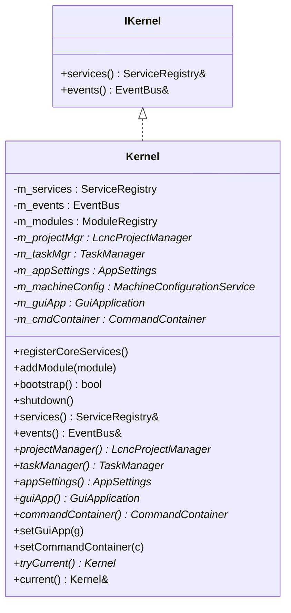
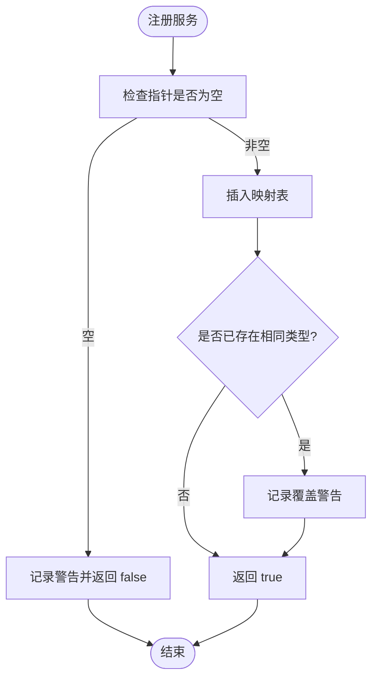
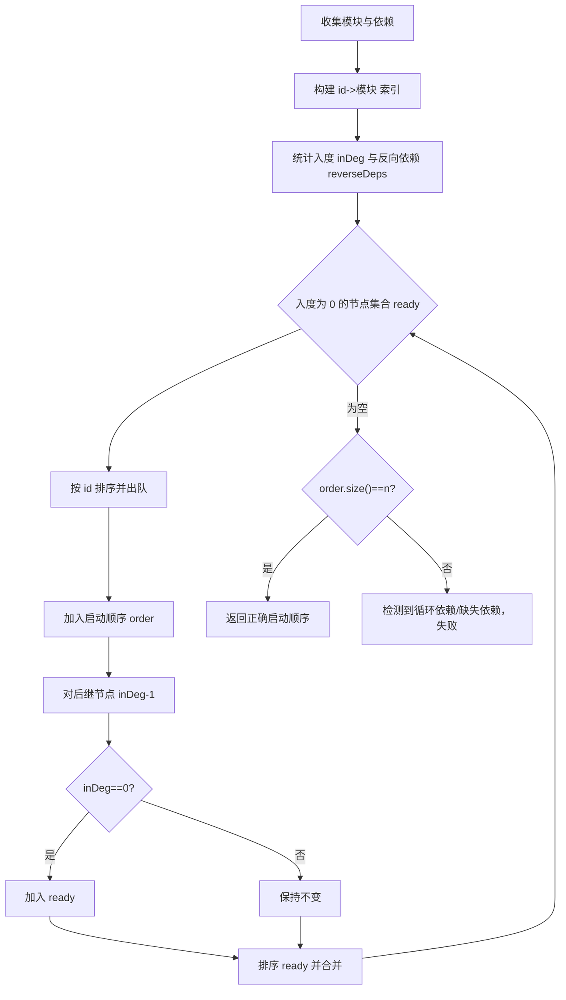
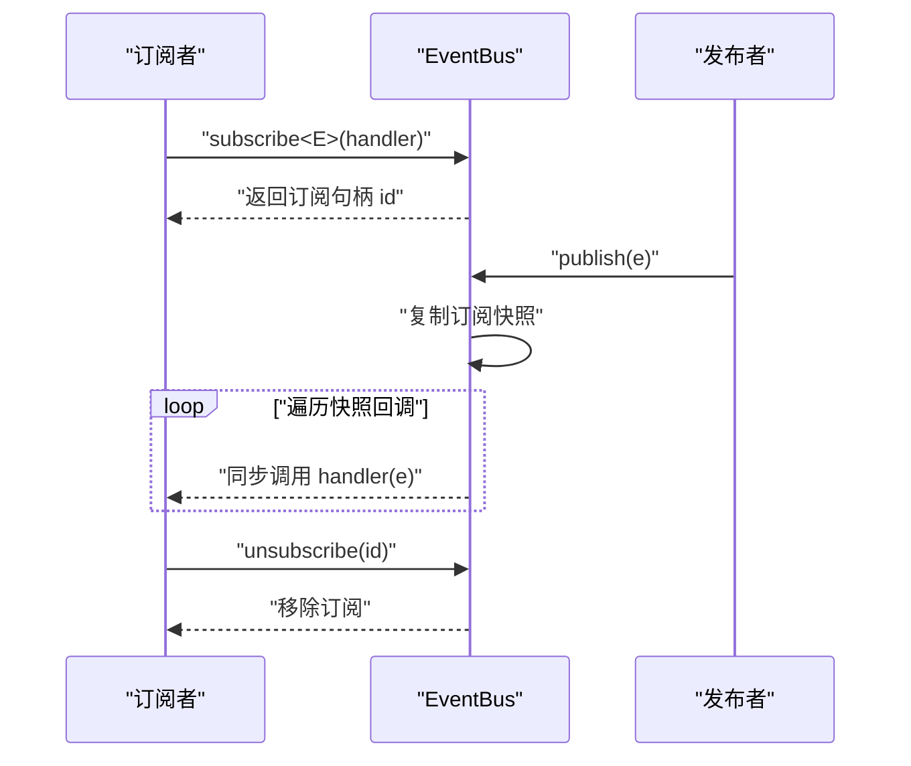
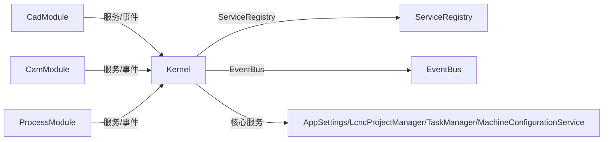
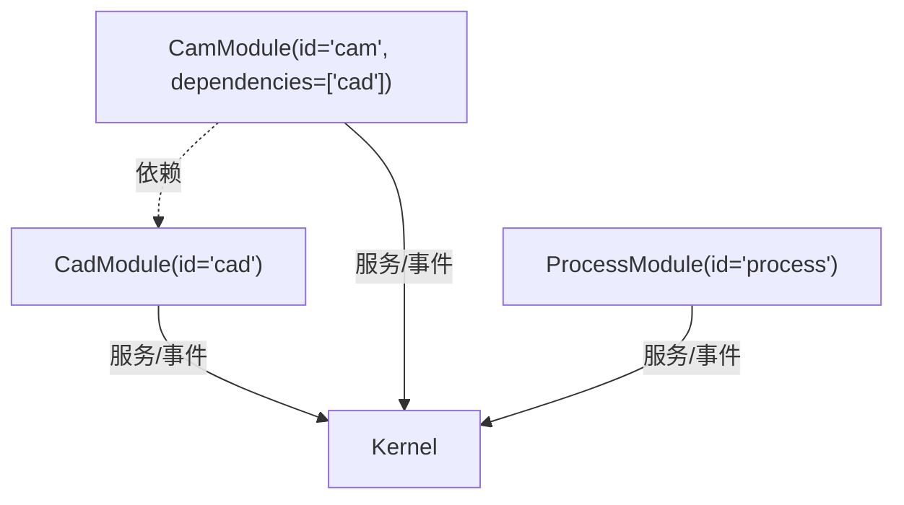

# 架构设计

<cite>
**本文引用的文件**
- [kernel.h](file://src/core/kernel/kernel.h)
- [kernel.cpp](file://src/core/kernel/kernel.cpp)
- [i_kernel.h](file://src/core/kernel/i_kernel.h)
- [i_module.h](file://src/core/kernel/i_module.h)
- [i_service.h](file://src/core/kernel/i_service.h)
- [service_registry.h](file://src/core/kernel/service_registry.h)
- [service_registry.cpp](file://src/core/kernel/service_registry.cpp)
- [module_registry.h](file://src/core/kernel/module_registry.h)
- [module_registry.cpp](file://src/core/kernel/module_registry.cpp)
- [event_bus.h](file://src/core/kernel/event_bus.h)
- [event_bus.cpp](file://src/core/kernel/event_bus.cpp)
- [cad_module.h](file://src/modules/cad/cad_module.h)
- [cam_module.h](file://src/modules/cam/cam_module.h)
- [process_module.h](file://src/modules/process/process_module.h)
- [app_context.h](file://src/app/app_context.h)
</cite>

## 目录
1. [简介](#简介)
2. [项目结构](#项目结构)
3. [核心组件](#核心组件)
4. [架构总览](#架构总览)
5. [详细组件分析](#详细组件分析)
6. [依赖分析](#依赖分析)
7. [性能考虑](#性能考虑)
8. [故障排查指南](#故障排查指南)
9. [结论](#结论)
10. [附录](#附录)

## 简介
本文件为 LaserCNC 的微内核架构设计文档，聚焦 Kernel 核心系统、ServiceRegistry 服务注册表、ModuleRegistry 模块注册表与 EventBus 事件总线的设计理念与实现细节。文档从系统架构、组件职责、数据与控制流、模块间依赖与通信方式、错误处理与回滚策略、性能优化与扩展性设计等方面进行深入剖析，并提供多种可视化图示，帮助开发者快速理解并高效扩展该微内核框架。

## 项目结构
LaserCNC 采用“核心层 + 模块层 + 视图层”的分层组织方式：
- 核心层（core）：提供微内核基础设施，包括 Kernel、ServiceRegistry、ModuleRegistry、EventBus、日志与配置等。
- 模块层（modules）：按领域划分的业务模块，如 CAD、CAM、Process，均实现 IModule 接口并通过 Kernel 生命周期管理。
- 视图层（view/app）：GUI 应用与渲染相关组件，通过 Kernel 获取核心服务与模块能力。

图表来源
- [kernel.h:37-146](file://src/core/kernel/kernel.h#L37-L146)
- [module_registry.h:30-61](file://src/core/kernel/module_registry.h#L30-L61)
- [service_registry.h:26-68](file://src/core/kernel/service_registry.h#L26-L68)
- [event_bus.h:46-89](file://src/core/kernel/event_bus.h#L46-L89)
- [cad_module.h:45-129](file://src/modules/cad/cad_module.h#L45-L129)
- [cam_module.h:64-114](file://src/modules/cam/cam_module.h#L64-L114)
- [process_module.h:35-51](file://src/modules/process/process_module.h#L35-L51)
- [app_context.h:17-47](file://src/app/app_context.h#L17-L47)

章节来源
- [kernel.h:18-36](file://src/core/kernel/kernel.h#L18-L36)
- [module_registry.h:15-29](file://src/core/kernel/module_registry.h#L15-L29)
- [service_registry.h:12-25](file://src/core/kernel/service_registry.h#L12-L25)
- [event_bus.h:24-44](file://src/core/kernel/event_bus.h#L24-L44)

## 核心组件
本节对 Kernel、ServiceRegistry、ModuleRegistry、EventBus 的职责、接口与实现要点进行深入解析。

- Kernel（微内核）
  - 职责：统一持有核心服务与模块容器，提供进程级全局访问入口；负责模块启动/关闭的编排与生命周期管理。
  - 关键能力：服务注册表访问、事件总线访问、核心服务注册、模块添加与启动、反向停止与清理。
  - 全局唯一性：通过静态指针确保进程内仅存在一个 Kernel 实例，提供 tryCurrent/current 访问。
  - 与核心服务的关系：直接拥有 AppSettings、LcncProjectManager、TaskManager、MachineConfigurationService；通过 ServiceRegistry 对外暴露。

- ServiceRegistry（服务注册表）
  - 职责：基于类型索引的轻量服务容器，支持注册、查询、取消注册与清空。
  - 设计原则：不抛异常、无依赖图、主线程为主、未来可扩展多线程查询。
  - 查询模式：getService<T>() 返回空指针时调用方需自行判空。

- ModuleRegistry（模块注册表）
  - 职责：收集 IModule 实例，基于 ModuleInfo 的依赖列表进行拓扑排序，顺序执行 init/start/stop。
  - 失败回滚：init 失败反向 stop 已 init 模块；start 失败仅停止已 start 模块，保留 init 状态便于诊断。
  - 依赖检测：循环依赖与缺失依赖将记录错误并失败。

- EventBus（事件总线）
  - 职责：类型化发布/订阅，支持订阅、发布、取消订阅与订阅者数量统计。
  - 线程模型：注册/发布/取消使用同一互斥锁；回调期间释放锁，避免死锁。
  - 安全性：订阅句柄用于取消订阅，防止悬挂回调；异常捕获并记录。

章节来源
- [kernel.h:37-146](file://src/core/kernel/kernel.h#L37-L146)
- [kernel.cpp:51-102](file://src/core/kernel/kernel.cpp#L51-L102)
- [i_kernel.h:10-34](file://src/core/kernel/i_kernel.h#L10-L34)
- [service_registry.h:12-68](file://src/core/kernel/service_registry.h#L12-L68)
- [service_registry.cpp:7-15](file://src/core/kernel/service_registry.cpp#L7-L15)
- [module_registry.h:15-61](file://src/core/kernel/module_registry.h#L15-L61)
- [module_registry.cpp:33-108](file://src/core/kernel/module_registry.cpp#L33-L108)
- [event_bus.h:15-89](file://src/core/kernel/event_bus.h#L15-L89)
- [event_bus.cpp:5-35](file://src/core/kernel/event_bus.cpp#L5-L35)

## 架构总览
微内核架构以 Kernel 为中心，围绕其构建服务与模块生态。启动流程严格遵循“注册核心服务 → 添加模块 → 拓扑排序启动 → 运行 → 关闭清理”的顺序；模块间通过 ServiceRegistry 与 EventBus 解耦协作，依赖关系由 ModuleInfo 声明并通过 ModuleRegistry 自动拓扑排序。

图表来源
- [kernel.cpp:83-92](file://src/core/kernel/kernel.cpp#L83-L92)
- [module_registry.cpp:110-187](file://src/core/kernel/module_registry.cpp#L110-L187)
- [i_module.h:28-73](file://src/core/kernel/i_module.h#L28-L73)
- [event_bus.h:56-68](file://src/core/kernel/event_bus.h#L56-L68)
- [service_registry.h:35-50](file://src/core/kernel/service_registry.h#L35-L50)

章节来源
- [kernel.cpp:83-102](file://src/core/kernel/kernel.cpp#L83-L102)
- [module_registry.cpp:110-187](file://src/core/kernel/module_registry.cpp#L110-L187)

## 详细组件分析

### Kernel 组件分析
- 设计要点
  - 唯一全局入口：通过静态指针维护当前 Kernel 实例，提供 tryCurrent/current 访问。
  - 生命周期编排：registerCoreServices、addModule、bootstrap、shutdown 形成闭环。
  - 权力边界：仅暴露服务与事件总线访问，核心对象通过强类型 getter 访问，避免散落单例。
  - 依赖注入：模块通过 IKernel 获取服务与事件总线，不持有 Kernel 指针。

图表来源
- [i_kernel.h:26-34](file://src/core/kernel/i_kernel.h#L26-L34)
- [kernel.h:37-146](file://src/core/kernel/kernel.h#L37-L146)

章节来源
- [kernel.h:37-146](file://src/core/kernel/kernel.h#L37-L146)
- [kernel.cpp:16-49](file://src/core/kernel/kernel.cpp#L16-L49)

### ServiceRegistry 组件分析
- 设计要点
  - 类型索引存储：以 std::type_index 为键，统一存储 std::shared_ptr<IService>。
  - 容错策略：注册空指针、重复注册、查询未注册均记录警告并返回空结果。
  - 清理策略：shutdown 时反序清理，避免服务间相互依赖导致的悬挂。

图表来源
- [service_registry.h:72-97](file://src/core/kernel/service_registry.h#L72-L97)
- [service_registry.cpp:7-15](file://src/core/kernel/service_registry.cpp#L7-L15)

章节来源
- [service_registry.h:26-68](file://src/core/kernel/service_registry.h#L26-L68)
- [service_registry.cpp:7-15](file://src/core/kernel/service_registry.cpp#L7-L15)

### ModuleRegistry 组件分析
- 设计要点
  - 拓扑排序：Kahn 算法统计入度，稳定输出避免不确定性；支持反向依赖图构建。
  - 启动阶段：init 阶段逐个调用，失败即回滚已 init 模块；start 阶段失败仅回滚已 start 模块。
  - 依赖校验：缺失依赖、循环依赖均记录错误并终止启动。

图表来源
- [module_registry.cpp:33-108](file://src/core/kernel/module_registry.cpp#L33-L108)

章节来源
- [module_registry.h:15-61](file://src/core/kernel/module_registry.h#L15-L61)
- [module_registry.cpp:110-187](file://src/core/kernel/module_registry.cpp#L110-L187)

### EventBus 组件分析
- 设计要点
  - 类型化订阅：按事件类型 E 存储回调，发布时按订阅顺序同步回调。
  - 线程安全：注册/发布/取消使用同一互斥锁；回调期间释放锁。
  - 订阅管理：返回唯一订阅句柄，支持取消订阅；异常被捕获并记录。

图表来源
- [event_bus.h:56-68](file://src/core/kernel/event_bus.h#L56-L68)
- [event_bus.h:94-116](file://src/core/kernel/event_bus.h#L94-L116)
- [event_bus.h:119-155](file://src/core/kernel/event_bus.h#L119-L155)
- [event_bus.cpp:5-24](file://src/core/kernel/event_bus.cpp#L5-L24)

章节来源
- [event_bus.h:46-89](file://src/core/kernel/event_bus.h#L46-L89)
- [event_bus.cpp:5-35](file://src/core/kernel/event_bus.cpp#L5-L35)

### 模块间依赖与通信
- 依赖声明与拓扑排序
  - 模块通过 ModuleInfo.dependencies 声明依赖；ModuleRegistry 基于 Kahn 算法进行拓扑排序，保证依赖先于被依赖者初始化。
- 通信方式
  - 服务发现：模块通过 IKernel.services() 注册/获取服务，实现松耦合协作。
  - 事件驱动：模块通过 EventBus 订阅/发布领域事件，避免直接耦合。
- 数据流向
  - CAD 模块提供文档与几何操作能力；CAM 模块依赖 CAD 文档生成刀路；Process 模块消费 CAM 刀路并驱动设备。
  - 核心服务（如 AppSettings、LcncProjectManager、TaskManager、MachineConfigurationService）由 Kernel 直接持有并通过 ServiceRegistry 对外暴露。

图表来源
- [i_module.h:10-26](file://src/core/kernel/i_module.h#L10-L26)
- [module_registry.cpp:56-72](file://src/core/kernel/module_registry.cpp#L56-L72)
- [kernel.h:133-135](file://src/core/kernel/kernel.h#L133-L135)
- [kernel.cpp:51-76](file://src/core/kernel/kernel.cpp#L51-L76)

章节来源
- [i_module.h:10-26](file://src/core/kernel/i_module.h#L10-L26)
- [module_registry.cpp:56-72](file://src/core/kernel/module_registry.cpp#L56-L72)
- [kernel.cpp:51-76](file://src/core/kernel/kernel.cpp#L51-L76)

## 依赖分析
- 模块依赖关系
  - CamModule 依赖 CadModule（id="cam" 依赖 ["cad"]）。
  - ProcessModule 依赖 CAD/CAM（通过服务与事件协作）。
- 依赖检测与回滚
  - ModuleRegistry 在启动前进行依赖合法性检查，缺失依赖或循环依赖将导致启动失败并记录错误。
- 服务依赖
  - 服务注册表不维护依赖图，仅提供类型化查找；模块间通过事件总线解耦。

图表来源
- [cad_module.h:121-122](file://src/modules/cad/cad_module.h#L121-L122)
- [cam_module.h:109-110](file://src/modules/cam/cam_module.h#L109-L110)
- [module_registry.cpp:62-71](file://src/core/kernel/module_registry.cpp#L62-L71)

章节来源
- [cad_module.h:121-122](file://src/modules/cad/cad_module.h#L121-L122)
- [cam_module.h:109-110](file://src/modules/cam/cam_module.h#L109-L110)
- [module_registry.cpp:62-71](file://src/core/kernel/module_registry.cpp#L62-L71)

## 性能考虑
- 启动性能
  - 拓扑排序时间复杂度 O(V+E)，模块数量有限，启动开销可控。
  - 初始化与启动分离：init 失败快速回滚，避免部分初始化导致的资源泄漏。
- 服务查找
  - ServiceRegistry 使用 unordered_map + type_index，平均 O(1) 查找；避免动态类型转换成本。
- 事件发布
  - 发布时复制订阅快照，避免回调中订阅/取消导致的迭代器失效；回调期间释放锁，降低锁竞争。
- 线程模型
  - 当前实现假设注册/查询主要在主线程，未来若需多线程查询可引入读写锁提升并发性能。
- 日志与可观测性
  - 各组件均内置日志记录，便于启动/关闭与异常场景的诊断与性能分析。

## 故障排查指南
- 启动失败
  - 检查模块依赖声明是否正确，是否存在循环依赖或缺失依赖。
  - 关注 ModuleRegistry 的错误日志，定位 init/start 抛异常或返回 false 的模块。
- 服务未找到
  - 确认模块是否在 init 阶段正确注册服务；检查类型是否匹配；确认 Kernel::registerCoreServices 是否在 bootstrap 之前调用。
- 事件未触发
  - 确认订阅句柄是否有效；检查订阅回调是否在发布线程同步执行；关注 EventBus 的异常捕获日志。
- 资源泄漏
  - 确保模块在 stop 阶段正确取消订阅、释放资源；避免在模块间传递裸指针导致的生命周期问题。

章节来源
- [module_registry.cpp:127-157](file://src/core/kernel/module_registry.cpp#L127-L157)
- [module_registry.cpp:164-181](file://src/core/kernel/module_registry.cpp#L164-L181)
- [event_bus.cpp:142-154](file://src/core/kernel/event_bus.cpp#L142-L154)
- [service_registry.cpp:7-15](file://src/core/kernel/service_registry.cpp#L7-L15)

## 结论
LaserCNC 的微内核架构通过 Kernel、ServiceRegistry、ModuleRegistry、EventBus 四大支柱，实现了模块化、可扩展、低耦合的系统设计。模块生命周期由 Kernel 统一编排，服务与事件提供松耦合协作通道，依赖关系通过声明式与拓扑排序自动保障。该设计在保证可维护性的同时，兼顾了启动性能与运行稳定性，并为未来的功能扩展与多线程演进提供了清晰的演进路径。

## 附录
- 关键接口与职责速览
  - IKernel：模块在 init 阶段持有的唯一句柄，提供 services()/events() 访问。
  - IModule：模块生命周期契约，包含 info()/init()/start()/stop()。
  - IService：服务接口标记基类，用于统一服务容器管理。
  - AppContext：应用上下文，持有各模块与文档的强类型访问器，便于命令与 UI 使用。

章节来源
- [i_kernel.h:10-34](file://src/core/kernel/i_kernel.h#L10-L34)
- [i_module.h:28-73](file://src/core/kernel/i_module.h#L28-L73)
- [i_service.h:19-25](file://src/core/kernel/i_service.h#L19-L25)
- [app_context.h:17-47](file://src/app/app_context.h#L17-L47)