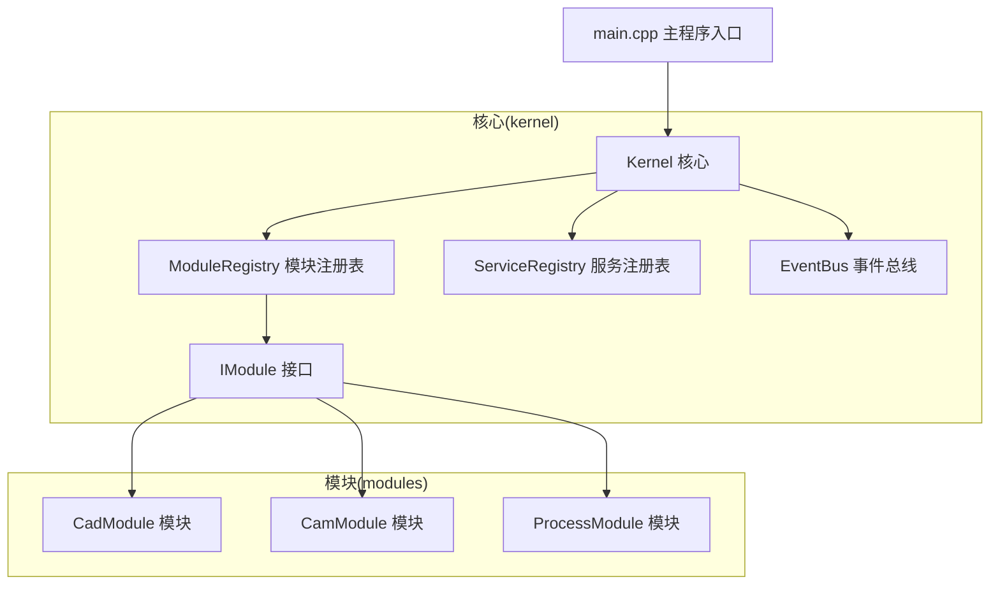
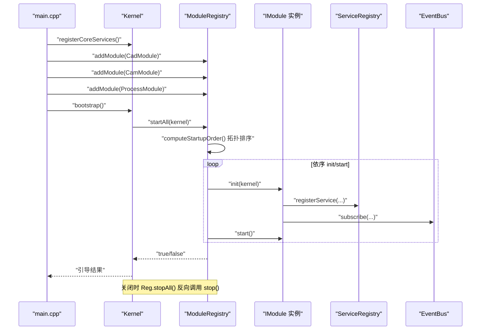
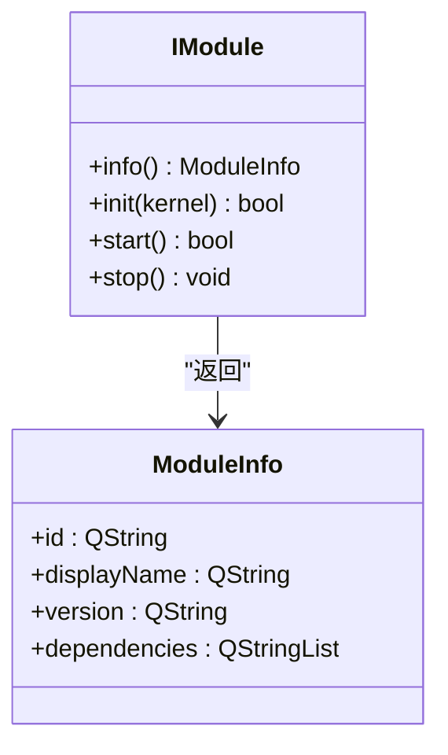
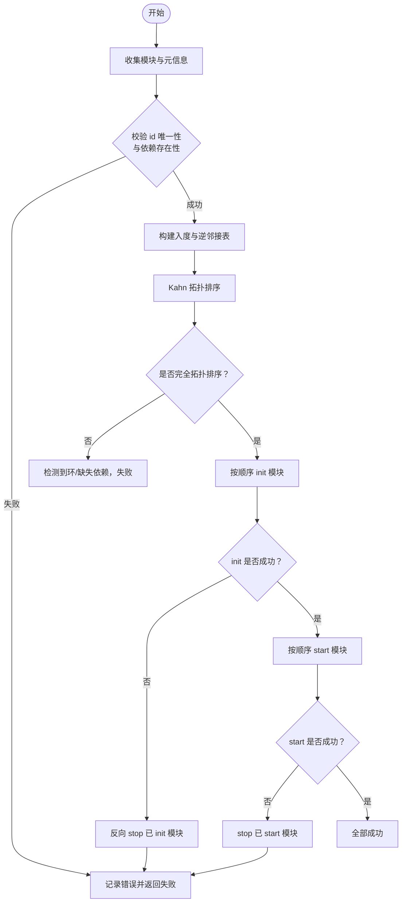
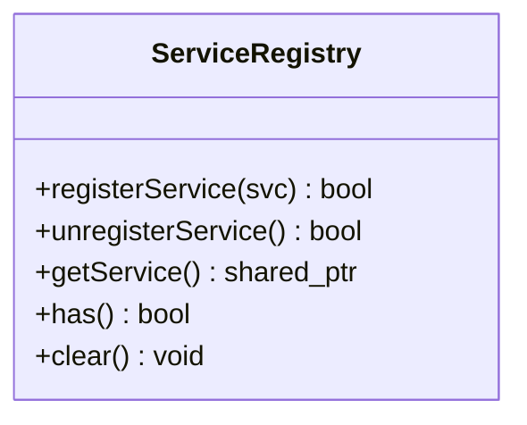
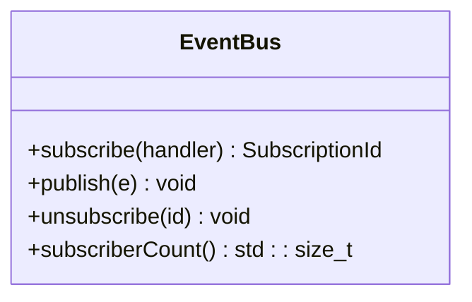
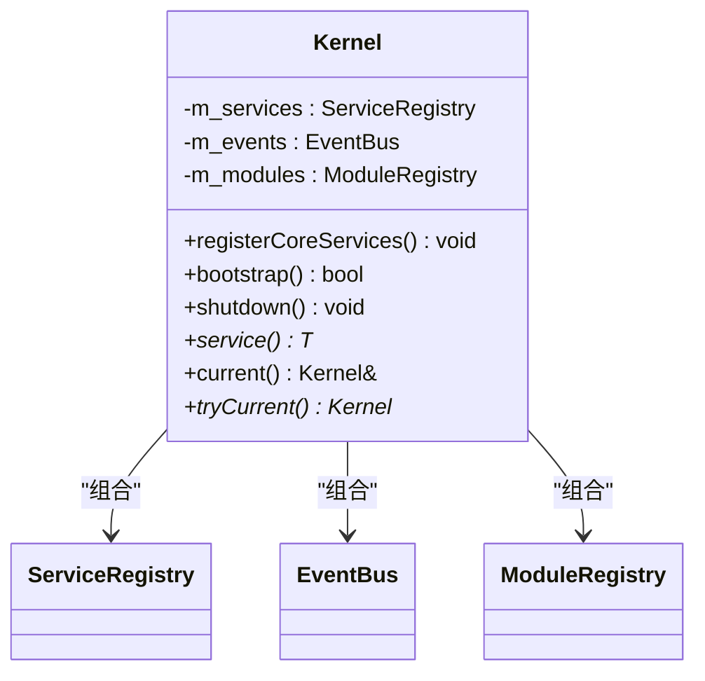
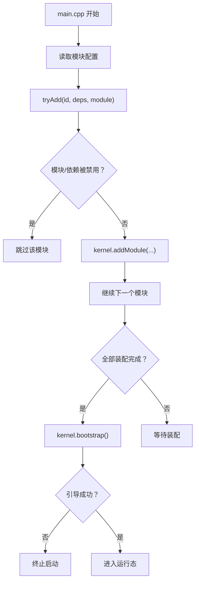

# 模块系统

<cite>
**本文档引用的文件**
- [i_module.h](file://src/core/kernel/i_module.h)
- [module_registry.h](file://src/core/kernel/module_registry.h)
- [module_registry.cpp](file://src/core/kernel/module_registry.cpp)
- [kernel.h](file://src/core/kernel/kernel.h)
- [kernel.cpp](file://src/core/kernel/kernel.cpp)
- [event_bus.h](file://src/core/kernel/event_bus.h)
- [event_bus.cpp](file://src/core/kernel/event_bus.cpp)
- [service_registry.h](file://src/core/kernel/service_registry.h)
- [service_registry.cpp](file://src/core/kernel/service_registry.cpp)
- [main.cpp](file://src/main.cpp)
- [cad_module.h](file://src/modules/cad/cad_module.h)
- [cam_module.h](file://src/modules/cam/cam_module.h)
- [process_module.h](file://src/modules/process/process_module.h)
</cite>

## 目录
1. [简介](#简介)
2. [项目结构](#项目结构)
3. [核心组件](#核心组件)
4. [架构总览](#架构总览)
5. [详细组件分析](#详细组件分析)
6. [依赖分析](#依赖分析)
7. [性能考虑](#性能考虑)
8. [故障排查指南](#故障排查指南)
9. [结论](#结论)
10. [附录](#附录)

## 简介
本文件系统性阐述 LaserCNC 的模块系统设计与实现，重点覆盖：
- 模块注册表的实现机制与启动调度策略
- 模块生命周期管理（注册、初始化、启动、停止）
- 动态加载与配置驱动的启用/禁用策略
- IModule 接口的设计原则与实现要求
- 模块间依赖关系管理、版本兼容性与热插拔可行性
- 模块通信（服务定位器、事件总线）与最佳实践
- 模块开发模板与常见问题解决方案

## 项目结构
LaserCNC 采用微内核架构，核心位于 core/kernel，模块位于 src/modules 下，主程序入口负责装配与引导。

图表来源
- [main.cpp:89-135](file://src/main.cpp#L89-L135)
- [kernel.h:132-148](file://src/core/kernel/kernel.h#L132-L148)
- [module_registry.h:30-63](file://src/core/kernel/module_registry.h#L30-L63)
- [service_registry.h:26-137](file://src/core/kernel/service_registry.h#L26-L137)
- [event_bus.h:46-157](file://src/core/kernel/event_bus.h#L46-L157)
- [i_module.h:49-75](file://src/core/kernel/i_module.h#L49-L75)

章节来源
- [main.cpp:89-135](file://src/main.cpp#L89-L135)
- [kernel.h:132-148](file://src/core/kernel/kernel.h#L132-L148)
- [module_registry.h:30-63](file://src/core/kernel/module_registry.h#L30-L63)
- [service_registry.h:26-137](file://src/core/kernel/service_registry.h#L26-L137)
- [event_bus.h:46-157](file://src/core/kernel/event_bus.h#L46-L157)
- [i_module.h:49-75](file://src/core/kernel/i_module.h#L49-L75)

## 核心组件
- IModule：模块契约，定义生命周期方法与元信息。
- ModuleRegistry：模块容器与启动调度器，负责拓扑排序与启动/停止序列。
- ServiceRegistry：基于类型索引的服务定位器，模块通过 init 将服务注册到内核。
- EventBus：类型化事件总线，模块可在 init/start 阶段订阅/发布事件。
- Kernel：进程级单例，聚合服务注册表、事件总线与模块注册表，协调引导与关闭。
- main.cpp：装配模块、读取配置、触发引导与关闭。

章节来源
- [i_module.h:49-75](file://src/core/kernel/i_module.h#L49-L75)
- [module_registry.h:30-63](file://src/core/kernel/module_registry.h#L30-L63)
- [service_registry.h:26-137](file://src/core/kernel/service_registry.h#L26-L137)
- [event_bus.h:46-157](file://src/core/kernel/event_bus.h#L46-L157)
- [kernel.h:132-148](file://src/core/kernel/kernel.h#L132-L148)
- [kernel.cpp:51-104](file://src/core/kernel/kernel.cpp#L51-L104)
- [main.cpp:89-135](file://src/main.cpp#L89-L135)

## 架构总览
模块系统围绕 Kernel 展开，Kernel 在引导阶段通过 ModuleRegistry 对模块进行拓扑排序与启动，模块在 init 阶段向 ServiceRegistry 注册服务、向 EventBus 订阅事件，start 阶段对外暴露能力。关闭时按相反顺序 stop 并清理服务。

图表来源
- [main.cpp:89-135](file://src/main.cpp#L89-L135)
- [kernel.cpp:51-104](file://src/core/kernel/kernel.cpp#L51-L104)
- [module_registry.cpp:110-188](file://src/core/kernel/module_registry.cpp#L110-L188)
- [service_registry.h:72-97](file://src/core/kernel/service_registry.h#L72-L97)
- [event_bus.h:93-157](file://src/core/kernel/event_bus.h#L93-L157)

## 详细组件分析

### IModule 接口与生命周期
- 元信息 ModuleInfo：包含模块 id、显示名、版本与依赖列表。依赖用于启动时拓扑排序。
- 生命周期：
  - info()：返回元信息，必须为常量、廉价调用。
  - init(kernel)：注册服务、命令与事件订阅；不应依赖其他模块业务。
  - start()：依赖均已完成 init；可发布“模块就绪”事件、加载默认数据。
  - stop()：取消订阅、注销服务、释放资源。
- 设计要点：模块不持有 Kernel 指针；若需跨阶段访问，建议在 init 中保存弱引用或具体服务接口。

图表来源
- [i_module.h:20-26](file://src/core/kernel/i_module.h#L20-L26)
- [i_module.h:49-75](file://src/core/kernel/i_module.h#L49-L75)

章节来源
- [i_module.h:20-26](file://src/core/kernel/i_module.h#L20-L26)
- [i_module.h:49-75](file://src/core/kernel/i_module.h#L49-L75)

### ModuleRegistry：启动调度与回滚
- 职责：收集 IModule 实例、按依赖做拓扑排序、顺序调用 init/start、反向 stop。
- 失败处理：
  - init 失败：对已 init 模块反向 stop，整体失败。
  - start 失败：仅停掉已 start 模块，保留 init 状态便于诊断。
  - 检测到循环依赖或缺失依赖时失败并记录错误。
- 启动顺序稳定性：按模块 id 排序稳定输出，避免哈希无序带来的不确定性。

图表来源
- [module_registry.cpp:33-108](file://src/core/kernel/module_registry.cpp#L33-L108)
- [module_registry.cpp:110-188](file://src/core/kernel/module_registry.cpp#L110-L188)

章节来源
- [module_registry.h:15-29](file://src/core/kernel/module_registry.h#L15-L29)
- [module_registry.cpp:12-23](file://src/core/kernel/module_registry.cpp#L12-L23)
- [module_registry.cpp:33-108](file://src/core/kernel/module_registry.cpp#L33-L108)
- [module_registry.cpp:110-188](file://src/core/kernel/module_registry.cpp#L110-L188)

### ServiceRegistry：服务定位器
- 注册：按类型索引注册服务实例，重复注册会覆盖并告警。
- 查找：按类型获取共享指针，未找到返回空指针。
- 清空：Kernel shutdown 时反序清理，避免服务间相互依赖导致的销毁顺序问题。
- 设计原则：不抛异常、无额外状态、线程模型假设在主线程注册/查询。

图表来源
- [service_registry.h:26-137](file://src/core/kernel/service_registry.h#L26-L137)
- [service_registry.cpp:7-17](file://src/core/kernel/service_registry.cpp#L7-L17)

章节来源
- [service_registry.h:26-137](file://src/core/kernel/service_registry.h#L26-L137)
- [service_registry.cpp:7-17](file://src/core/kernel/service_registry.cpp#L7-L17)

### EventBus：类型化事件总线
- 订阅：按事件类型注册处理器，返回订阅句柄；无效处理器将被拒绝。
- 发布：在发布线程同步回调，按订阅顺序执行；异常被捕获并记录。
- 取消订阅：通过订阅句柄移除；调试可用 subscriberCount 检视订阅数量。
- 线程安全：注册/发布/取消均使用同一互斥锁保护。

图表来源
- [event_bus.h:46-157](file://src/core/kernel/event_bus.h#L46-L157)
- [event_bus.cpp:5-37](file://src/core/kernel/event_bus.cpp#L5-L37)

章节来源
- [event_bus.h:46-157](file://src/core/kernel/event_bus.h#L46-L157)
- [event_bus.cpp:5-37](file://src/core/kernel/event_bus.cpp#L5-L37)

### Kernel：进程级单例与引导
- 职责：注册核心服务、持有 ModuleRegistry/ServiceRegistry/EventBus、提供便捷 service<T>() 查询。
- 引导：registerCoreServices 完成核心对象创建与服务注册；bootstrap 调用 ModuleRegistry.startAll。
- 关闭：stopAll 反向停止模块，clear 清空服务，重置核心资源。

图表来源
- [kernel.h:132-148](file://src/core/kernel/kernel.h#L132-L148)
- [kernel.cpp:51-104](file://src/core/kernel/kernel.cpp#L51-L104)

章节来源
- [kernel.h:132-148](file://src/core/kernel/kernel.h#L132-L148)
- [kernel.cpp:51-104](file://src/core/kernel/kernel.cpp#L51-L104)

### 模块注册流程（main.cpp）
- 读取配置决定模块启用/禁用与依赖校验。
- 将模块实例加入 ModuleRegistry。
- 调用 Kernel.bootstrap 触发引导。
- 引导失败终止启动流程。

图表来源
- [main.cpp:89-135](file://src/main.cpp#L89-L135)

章节来源
- [main.cpp:89-135](file://src/main.cpp#L89-L135)

### 模块通信示例
- 服务依赖：模块在 init 中通过 ServiceRegistry.registerService<T>(svc) 注册服务，其他模块可通过 Kernel::service<T>() 获取。
- 事件通信：模块在 init/start 中通过 EventBus.subscribe 订阅事件，在需要时通过 EventBus.publish 发布事件。
- 最佳实践：事件类型应为轻量值类型；UI 模块如需切换到 GUI 线程，请在订阅者内部使用合适的 Qt 机制。

章节来源
- [service_registry.h:72-97](file://src/core/kernel/service_registry.h#L72-L97)
- [event_bus.h:93-157](file://src/core/kernel/event_bus.h#L93-L157)

## 依赖分析
- 模块依赖：main.cpp 中声明 cad 无依赖，cam 依赖 cad，process 依赖 cam。
- 拓扑排序：ModuleRegistry.computeStartupOrder 使用 Kahn 算法，确保依赖先于被依赖者初始化。
- 版本兼容性：ModuleInfo.version 用于标识模块版本，当前实现未内置版本解析与兼容性检查逻辑，建议在模块间约定版本语义并在 init/start 中进行显式校验。
- 热插拔：当前实现未提供动态卸载模块的能力；模块生命周期在 Kernel 析构前固定，不支持运行时热插拔。

图表来源
- [main.cpp:106-108](file://src/main.cpp#L106-L108)
- [module_registry.cpp:33-108](file://src/core/kernel/module_registry.cpp#L33-L108)

章节来源
- [main.cpp:106-108](file://src/main.cpp#L106-L108)
- [module_registry.cpp:33-108](file://src/core/kernel/module_registry.cpp#L33-L108)

## 性能考虑
- 拓扑排序复杂度：O(V+E)，适合模块规模可控场景。
- 服务查找：基于 type_index 的哈希查找，平均 O(1)。
- 事件发布：回调在发布线程同步执行，订阅数量较多时注意回调耗时。
- 日志与异常：启动过程中的异常与错误会被捕获并记录，避免中断链路，但应尽量在模块内部做好健壮性控制。

## 故障排查指南
- 启动失败（init 失败）：查看对应模块 init 日志，确认依赖是否正确声明且未被禁用；检查服务注册是否成功。
- 启动失败（start 失败）：仅已启动模块被停止，保留 init 状态便于诊断；检查模块间事件与服务依赖。
- 循环依赖/缺失依赖：computeStartupOrder 会检测并记录错误；修正 ModuleInfo.dependencies。
- 事件未到达：确认订阅句柄有效、订阅未被提前取消；检查发布线程与订阅线程上下文。
- 服务未找到：确认模块已在 init 阶段注册服务；检查接口类型与注册类型一致。

章节来源
- [module_registry.cpp:110-188](file://src/core/kernel/module_registry.cpp#L110-L188)
- [event_bus.cpp:5-37](file://src/core/kernel/event_bus.cpp#L5-L37)
- [service_registry.cpp:7-17](file://src/core/kernel/service_registry.cpp#L7-L17)

## 结论
LaserCNC 的模块系统以 IModule 为核心契约，结合 ModuleRegistry 的拓扑调度、ServiceRegistry 的服务定位与 EventBus 的事件通信，形成清晰的生命周期与解耦架构。当前实现强调启动期的强一致性与失败回滚，未内置版本解析与热插拔机制。通过遵循接口设计与生命周期约束，模块可稳定地扩展功能边界。

## 附录

### IModule 接口实现要求清单
- info()：返回常量、廉价调用；包含合法 id、显示名、版本与依赖列表。
- init(kernel)：注册服务、命令与事件订阅；不依赖其他模块业务。
- start()：可发布“模块就绪”事件、加载默认数据。
- stop()：取消订阅、注销服务、释放资源。
- 错误处理：返回 false 或抛出异常将触发回滚。

章节来源
- [i_module.h:49-75](file://src/core/kernel/i_module.h#L49-L75)

### 模块开发模板（步骤）
- 定义模块类并实现 IModule。
- 在模块 init 中：
  - 通过 ServiceRegistry.registerService<T>(svc) 注册服务。
  - 通过 EventBus.subscribe 订阅所需事件。
  - 注册命令（如有）。
- 在模块 start 中：
  - 发布“模块就绪”事件（可选）。
  - 加载默认数据或初始化资源。
- 在模块 stop 中：
  - 取消所有订阅。
  - 注销服务。
- 在 main.cpp 中：
  - 读取配置决定启用/禁用。
  - tryAdd 注册模块与依赖。
  - 调用 kernel.bootstrap()。

章节来源
- [i_module.h:49-75](file://src/core/kernel/i_module.h#L49-L75)
- [service_registry.h:72-97](file://src/core/kernel/service_registry.h#L72-L97)
- [event_bus.h:93-157](file://src/core/kernel/event_bus.h#L93-L157)
- [main.cpp:89-135](file://src/main.cpp#L89-L135)

### 常见问题与解决方案
- 问题：模块启动失败
  - 解决：检查 ModuleInfo.dependencies 是否正确；确认依赖未被禁用；查看 init/start 日志。
- 问题：服务调用返回空指针
  - 解决：确认模块已在 init 阶段注册服务；检查接口类型与注册类型一致。
- 问题：事件未触发
  - 解决：确认订阅句柄有效；检查发布线程与订阅线程上下文；避免在回调中修改订阅列表导致迭代器失效。
- 问题：循环依赖
  - 解决：修正 ModuleInfo.dependencies；确保无环依赖。

章节来源
- [module_registry.cpp:110-188](file://src/core/kernel/module_registry.cpp#L110-L188)
- [service_registry.h:117-137](file://src/core/kernel/service_registry.h#L117-L137)
- [event_bus.h:118-157](file://src/core/kernel/event_bus.h#L118-L157)