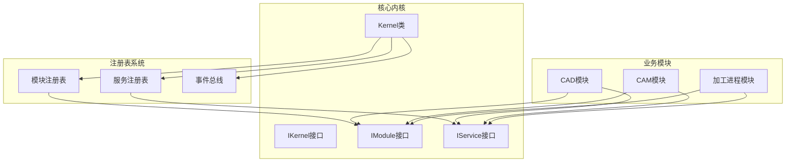
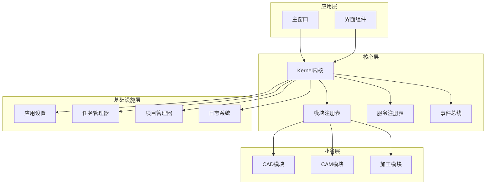
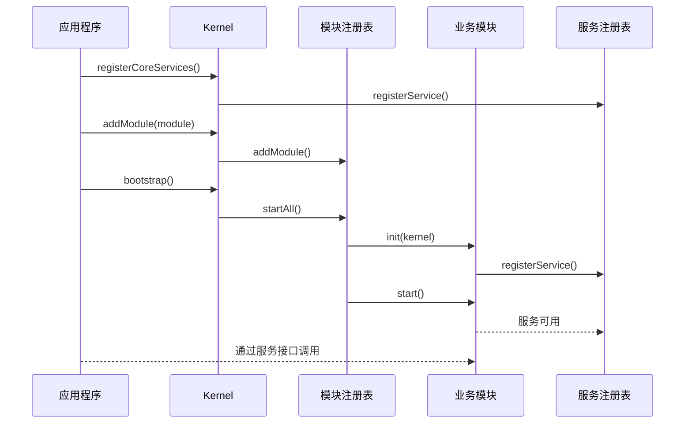
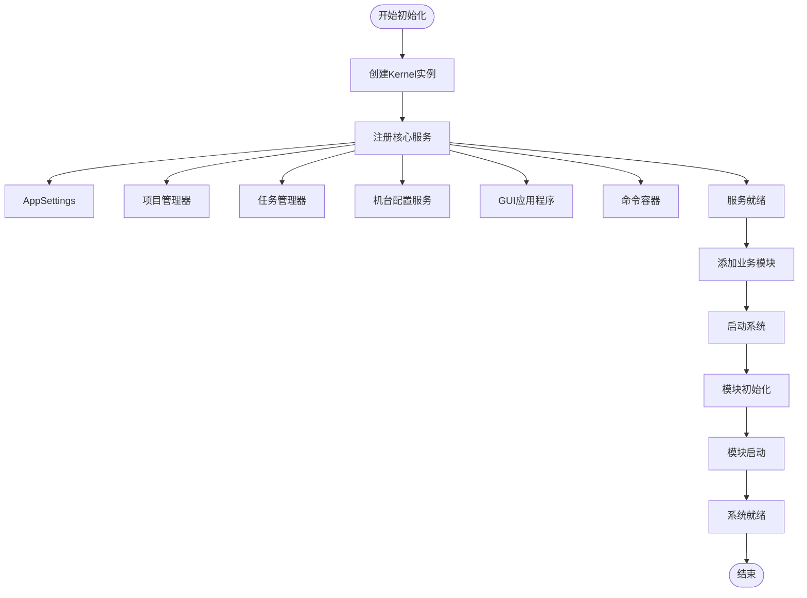
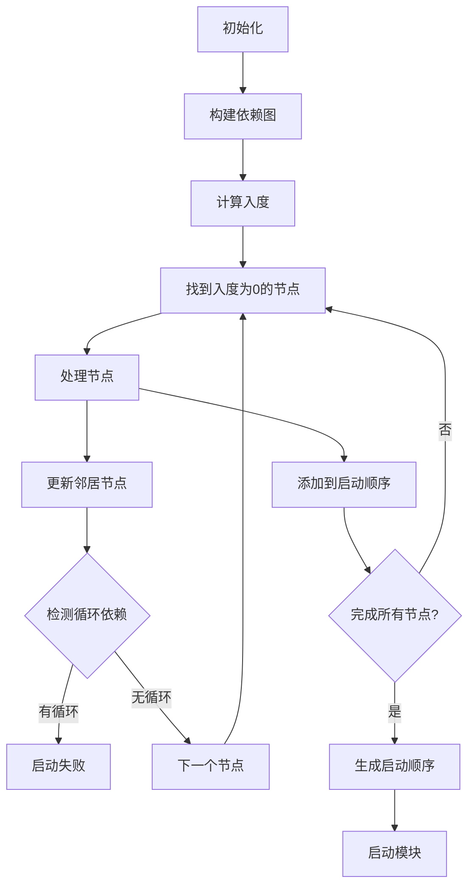
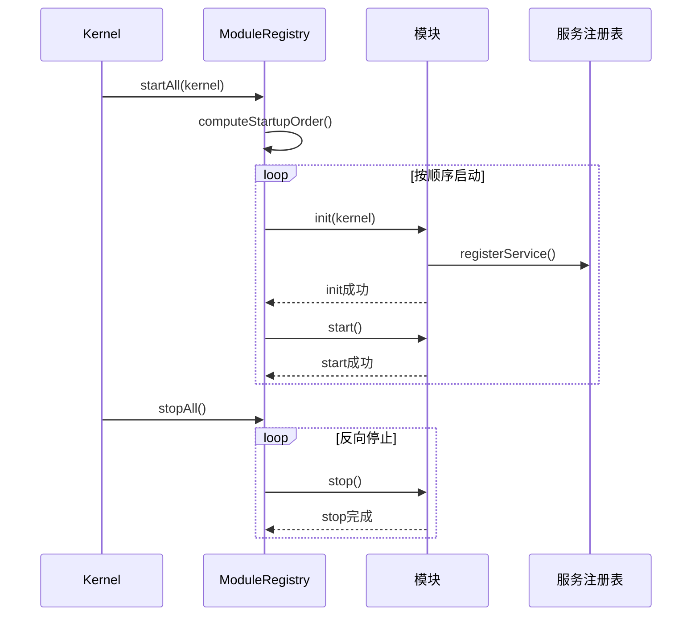
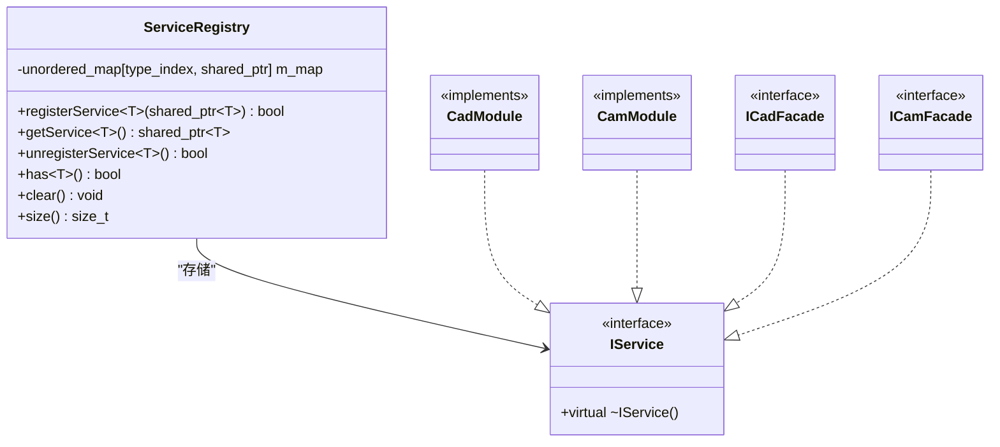
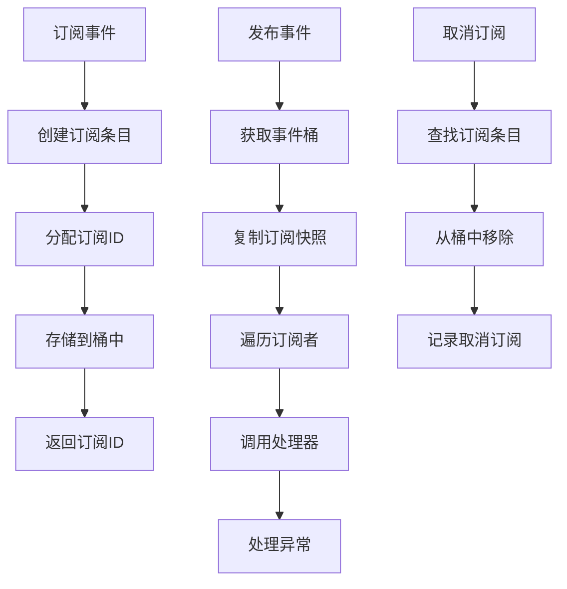
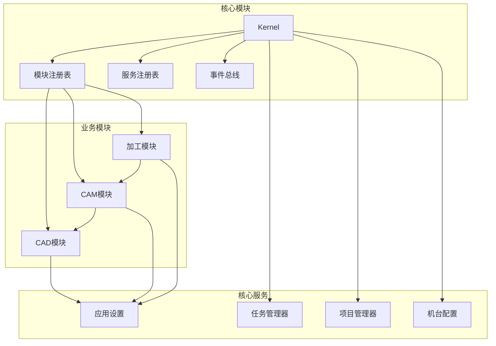

# Kernel核心系统

<cite>
**本文档引用的文件**
- [kernel.h](file://src/core/kernel/kernel.h)
- [kernel.cpp](file://src/core/kernel/kernel.cpp)
- [module_registry.h](file://src/core/kernel/module_registry.h)
- [module_registry.cpp](file://src/core/kernel/module_registry.cpp)
- [service_registry.h](file://src/core/kernel/service_registry.h)
- [service_registry.cpp](file://src/core/kernel/service_registry.cpp)
- [i_kernel.h](file://src/core/kernel/i_kernel.h)
- [i_module.h](file://src/core/kernel/i_module.h)
- [i_service.h](file://src/core/kernel/i_service.h)
- [event_bus.h](file://src/core/kernel/event_bus.h)
- [event_bus.cpp](file://src/core/kernel/event_bus.cpp)
- [cad_module.h](file://src/modules/cad/cad_module.h)
- [cad_module.cpp](file://src/modules/cad/cad_module.cpp)
- [cam_module.h](file://src/modules/cam/cam_module.h)
- [cam_module.cpp](file://src/modules/cam/cam_module.cpp)
- [process_module.h](file://src/modules/process/process_module.h)
- [process_module.cpp](file://src/modules/process/process_module.cpp)
</cite>

## 目录
1. [简介](#简介)
2. [项目结构](#项目结构)
3. [核心组件](#核心组件)
4. [架构概览](#架构概览)
5. [详细组件分析](#详细组件分析)
6. [依赖分析](#依赖分析)
7. [性能考虑](#性能考虑)
8. [故障排除指南](#故障排除指南)
9. [结论](#结论)
10. [附录](#附录)

## 简介

LaserCNC Kernel核心系统是一个微内核架构，为激光切割控制系统提供灵活的模块化基础。该系统采用模块化设计，支持动态加载和卸载业务模块，实现了服务的集中管理和事件驱动的通信机制。

Kernel系统的核心设计理念包括：
- **微内核架构**：最小化的内核，最大化模块化
- **服务导向**：通过ServiceRegistry实现服务的注册和发现
- **事件驱动**：基于EventBus的类型化发布订阅机制
- **生命周期管理**：完整的模块生命周期控制
- **依赖管理**：智能的模块依赖解析和启动顺序

## 项目结构

Kernel核心系统位于`src/core/kernel/`目录下，包含以下关键文件：



**图表来源**
- [kernel.h:37-146](file://src/core/kernel/kernel.h#L37-L146)
- [module_registry.h:30-61](file://src/core/kernel/module_registry.h#L30-L61)
- [service_registry.h:26-68](file://src/core/kernel/service_registry.h#L26-L68)

**章节来源**
- [kernel.h:1-149](file://src/core/kernel/kernel.h#L1-L149)
- [module_registry.h:1-64](file://src/core/kernel/module_registry.h#L1-L64)
- [service_registry.h:1-138](file://src/core/kernel/service_registry.h#L1-L138)

## 核心组件

### Kernel类设计

Kernel是微内核的核心，负责协调整个系统的运行。它实现了IKernel接口，提供了统一的访问入口。

**主要特性**：
- **单例模式**：进程内唯一实例，通过静态方法访问
- **生命周期管理**：完整的模块启动和关闭流程
- **服务聚合**：集中管理核心服务和模块服务
- **事件总线**：提供类型化的事件发布订阅机制

**关键方法**：
- `registerCoreServices()`：注册核心服务
- `addModule()`：添加业务模块
- `bootstrap()`：启动所有模块
- `shutdown()`：关闭所有模块
- `service<T>()`：获取特定类型的服务

### 模块注册表(ModuleRegistry)

ModuleRegistry负责管理所有业务模块，实现了智能的依赖解析和启动顺序控制。

**核心功能**：
- **模块收集**：维护模块列表和启动顺序
- **依赖解析**：使用Kahn算法进行拓扑排序
- **生命周期管理**：统一的init/start/stop流程
- **错误处理**：完善的异常捕获和回滚机制

**启动流程**：
1. 模块添加验证
2. 依赖关系检查
3. 拓扑排序生成启动顺序
4. 逐个模块初始化
5. 逐个模块启动

### 服务注册表(ServiceRegistry)

ServiceRegistry是一个类型安全的服务容器，支持按接口类型进行服务的注册和查找。

**设计特点**：
- **类型擦除**：使用std::type_index进行类型标识
- **共享指针管理**：基于std::shared_ptr的生命周期管理
- **线程安全**：当前实现假设主线程访问
- **无异常设计**：失败时返回空指针而不是抛出异常

**服务管理**：
- `registerService<T>()`：注册服务实例
- `getService<T>()`：获取服务实例
- `unregisterService<T>()`：取消服务注册
- `clear()`：清空所有服务

### 事件总线(EventBus)

EventBus实现了类型化的发布订阅模式，支持线程安全的事件通信。

**核心机制**：
- **类型安全**：编译时类型检查
- **同步回调**：事件发布时同步调用订阅者
- **订阅管理**：返回订阅ID用于取消订阅
- **异常隔离**：订阅者异常不影响其他订阅者

**使用模式**：
```cpp
// 订阅事件
auto id = bus.subscribe<MyEvent>([](const MyEvent& e) {
    // 处理事件
});

// 发布事件
bus.publish(MyEvent{...});

// 取消订阅
bus.unsubscribe(id);
```

**章节来源**
- [kernel.h:37-146](file://src/core/kernel/kernel.h#L37-L146)
- [kernel.cpp:16-104](file://src/core/kernel/kernel.cpp#L16-L104)
- [module_registry.h:30-61](file://src/core/kernel/module_registry.h#L30-L61)
- [module_registry.cpp:12-210](file://src/core/kernel/module_registry.cpp#L12-L210)
- [service_registry.h:26-137](file://src/core/kernel/service_registry.h#L26-L137)
- [service_registry.cpp:7-17](file://src/core/kernel/service_registry.cpp#L7-L17)
- [event_bus.h:46-157](file://src/core/kernel/event_bus.h#L46-L157)
- [event_bus.cpp:5-37](file://src/core/kernel/event_bus.cpp#L5-L37)

## 架构概览

Kernel系统采用分层架构设计，实现了清晰的关注点分离：



**图表来源**
- [kernel.h:12-146](file://src/core/kernel/kernel.h#L12-L146)
- [cad_module.h:28-45](file://src/modules/cad/cad_module.h#L28-L45)
- [cam_module.h:49-64](file://src/modules/cam/cam_module.h#L49-L64)
- [process_module.h:29-35](file://src/modules/process/process_module.h#L29-L35)

### 数据流分析

系统中的数据流遵循以下模式：



**图表来源**
- [kernel.cpp:51-92](file://src/core/kernel/kernel.cpp#L51-L92)
- [module_registry.cpp:110-187](file://src/core/kernel/module_registry.cpp#L110-L187)

## 详细组件分析

### Kernel类深度分析

Kernel类是整个系统的核心协调者，实现了以下关键功能：

#### 初始化流程



**图表来源**
- [kernel.cpp:51-76](file://src/core/kernel/kernel.cpp#L51-L76)

#### 生命周期管理

Kernel确保了严格的生命周期管理：

**启动阶段**：
1. 注册核心服务
2. 添加业务模块
3. 执行模块启动流程
4. 系统进入运行状态

**关闭阶段**：
1. 反向停止模块
2. 清空服务注册表
3. 释放核心资源
4. 销毁Kernel实例

#### 全局访问机制

Kernel提供了统一的全局访问入口：

```cpp
// 获取当前Kernel实例
auto& kernel = Kernel::current();

// 获取核心服务
auto projectMgr = kernel.projectManager();
auto taskMgr = kernel.taskManager();
auto appSettings = kernel.appSettings();

// 获取模块服务
auto cadModule = kernel.service<CadModule>();
auto camModule = kernel.service<CamModule>();
```

**章节来源**
- [kernel.h:16-146](file://src/core/kernel/kernel.h#L16-L146)
- [kernel.cpp:16-104](file://src/core/kernel/kernel.cpp#L16-L104)

### 模块注册表实现

ModuleRegistry实现了复杂的模块生命周期管理：

#### 依赖解析算法

使用Kahn算法进行拓扑排序：



**图表来源**
- [module_registry.cpp:33-108](file://src/core/kernel/module_registry.cpp#L33-L108)

#### 启动和停止流程



**图表来源**
- [module_registry.cpp:110-187](file://src/core/kernel/module_registry.cpp#L110-L187)

**章节来源**
- [module_registry.h:30-61](file://src/core/kernel/module_registry.h#L30-L61)
- [module_registry.cpp:12-210](file://src/core/kernel/module_registry.cpp#L12-L210)

### 服务注册表工作机制

ServiceRegistry提供了类型安全的服务管理：

#### 类型系统设计



**图表来源**
- [service_registry.h:26-137](file://src/core/kernel/service_registry.h#L26-L137)
- [i_service.h:19-25](file://src/core/kernel/i_service.h#L19-L25)

#### 服务生命周期

服务的注册和使用遵循以下模式：

**注册阶段**：
1. 模块在init()中注册服务
2. 服务以shared_ptr形式存储
3. 服务可通过类型安全的方式获取

**使用阶段**：
1. 通过Kernel::service<T>()获取服务
2. 服务接口提供功能调用
3. 服务生命周期由注册表管理

**章节来源**
- [service_registry.h:26-137](file://src/core/kernel/service_registry.h#L26-L137)
- [service_registry.cpp:7-17](file://src/core/kernel/service_registry.cpp#L7-L17)

### 事件总线系统

EventBus实现了线程安全的类型化事件通信：

#### 订阅管理



**图表来源**
- [event_bus.h:93-157](file://src/core/kernel/event_bus.h#L93-L157)
- [event_bus.cpp:5-37](file://src/core/kernel/event_bus.cpp#L5-L37)

#### 线程安全机制

EventBus使用互斥锁确保线程安全：

**并发控制**：
- 所有公共操作使用std::mutex保护
- 发布事件时复制订阅快照，避免迭代器失效
- 订阅和取消订阅操作原子性执行

**性能考虑**：
- 使用type_index进行快速类型查找
- 事件发布时避免持有锁
- 支持大量订阅者的高效管理

**章节来源**
- [event_bus.h:46-157](file://src/core/kernel/event_bus.h#L46-L157)
- [event_bus.cpp:5-37](file://src/core/kernel/event_bus.cpp#L5-L37)

## 依赖分析

### 模块依赖关系

系统中的模块依赖关系如下：



**图表来源**
- [cad_module.h:121-128](file://src/modules/cad/cad_module.h#L121-L128)
- [cam_module.h:109-113](file://src/modules/cam/cam_module.h#L109-L113)
- [process_module.h:145-152](file://src/modules/process/process_module.h#L145-L152)

### 依赖管理策略

系统采用了以下依赖管理策略：

**无循环依赖**：
- 使用拓扑排序检测循环依赖
- 依赖必须在被依赖之前启动
- 支持复杂的依赖层次结构

**延迟初始化**：
- 服务注册在模块init阶段完成
- 模块启动时才真正激活功能
- 支持按需加载和卸载

**接口隔离**：
- 模块间通过接口通信
- 避免直接依赖具体实现
- 支持服务替换和测试

**章节来源**
- [module_registry.cpp:33-108](file://src/core/kernel/module_registry.cpp#L33-L108)
- [cad_module.cpp:439-453](file://src/modules/cad/cad_module.cpp#L439-L453)
- [cam_module.cpp:221-238](file://src/modules/cam/cam_module.cpp#L221-L238)
- [process_module.cpp:155-212](file://src/modules/process/process_module.cpp#L155-L212)

## 性能考虑

### 内存管理

Kernel系统采用了高效的内存管理模式：

**智能指针使用**：
- 服务注册使用std::shared_ptr管理生命周期
- 模块所有权明确，避免内存泄漏
- 支持循环引用的自动处理

**资源优化**：
- 服务注册表使用unordered_map提供O(1)查找
- 事件订阅使用type_index进行快速类型匹配
- 模块启动顺序预计算，避免重复计算

### 并发安全性

**线程安全设计**：
- 服务注册表假设主线程访问
- 事件总线使用互斥锁保护
- 模块生命周期在单线程环境下管理

**性能优化**：
- 事件发布时复制订阅快照，避免迭代器失效
- 模块启动使用批量操作减少系统调用
- 服务查找使用类型索引避免字符串比较

## 故障排除指南

### 常见问题诊断

**模块启动失败**：
1. 检查模块依赖是否正确声明
2. 验证依赖模块是否已正确注册
3. 查看启动日志中的错误信息
4. 确认模块init()返回true

**服务获取失败**：
1. 确认服务已在模块init()中注册
2. 检查服务类型是否正确
3. 验证模块是否已成功启动
4. 查看服务注册表状态

**事件通信问题**：
1. 确认事件类型定义正确
2. 检查订阅者是否正确注册
3. 验证事件发布时机
4. 查看订阅者异常处理

### 调试技巧

**日志分析**：
- 启用详细日志级别查看启动流程
- 监控模块生命周期事件
- 分析服务注册和查找性能

**内存检查**：
- 使用智能指针跟踪对象生命周期
- 检查shared_ptr引用计数
- 监控内存泄漏情况

**章节来源**
- [module_registry.cpp:110-187](file://src/core/kernel/module_registry.cpp#L110-L187)
- [service_registry.cpp:7-17](file://src/core/kernel/service_registry.cpp#L7-L17)
- [event_bus.cpp:5-37](file://src/core/kernel/event_bus.cpp#L5-L37)

## 结论

LaserCNC Kernel核心系统展现了优秀的微内核架构设计，通过模块化和组件化的方法实现了高度的灵活性和可扩展性。系统的关键优势包括：

**架构优势**：
- 清晰的职责分离和接口设计
- 强大的依赖管理和生命周期控制
- 类型安全的服务发现机制
- 灵活的事件驱动通信

**扩展性特点**：
- 支持动态模块加载和卸载
- 简单的模块开发接口
- 完善的错误处理和恢复机制
- 良好的性能和资源管理

**最佳实践**：
- 遵循模块接口设计规范
- 正确声明模块依赖关系
- 使用服务注册表进行服务管理
- 采用事件驱动的模块间通信

该系统为LaserCNC项目提供了坚实的技术基础，支持未来的功能扩展和技术演进。

## 附录

### 扩展Kernel系统的步骤

#### 添加新模块

1. **创建模块类**：
```cpp
class NewModule : public QObject, public lcnc::IModule
{
public:
    lcnc::ModuleInfo info() const override;
    bool init(lcnc::IKernel& kernel) override;
    bool start() override;
    void stop() override;
};
```

2. **实现模块接口**：
```cpp
lcnc::ModuleInfo NewModule::info() const
{
    return {
        QStringLiteral("newmodule"),
        QStringLiteral("新模块"),
        QStringLiteral("1.0.0"),
        { QStringLiteral("cad") }  // 依赖声明
    };
}

bool NewModule::init(lcnc::IKernel& kernel)
{
    // 注册服务
    auto svc = std::shared_ptr<NewModule>(this, [](NewModule*) {});
    kernel.services().registerService<NewModule>(svc);
    return true;
}
```

3. **在主程序中注册**：
```cpp
auto kernel = std::make_unique<Kernel>();
kernel->registerCoreServices();
kernel->addModule(std::make_unique<CadModule>());
kernel->addModule(std::make_unique<NewModule>());
kernel->bootstrap();
```

#### 添加新服务

1. **定义服务接口**：
```cpp
class INewService : public lcnc::IService
{
public:
    virtual void doSomething() = 0;
};
```

2. **实现服务**：
```cpp
class NewServiceImpl : public INewService
{
public:
    void doSomething() override;
};
```

3. **在模块中注册**：
```cpp
auto service = std::make_shared<NewServiceImpl>();
kernel.services().registerService<INewService>(service);
```

#### 使用示例

**获取服务**：
```cpp
auto newModule = Kernel::current().service<NewModule>();
if (newModule) {
    // 使用服务
}
```

**发布事件**：
```cpp
struct NewEvent {
    QString data;
};

Kernel::current().events().publish(NewEvent{"test"});
```

**订阅事件**：
```cpp
auto id = Kernel::current().events().subscribe<NewEvent>(
    [](const NewEvent& e) {
        // 处理事件
    }
);
```

**章节来源**
- [cad_module.h:120-128](file://src/modules/cad/cad_module.h#L120-L128)
- [cam_module.h:108-113](file://src/modules/cam/cam_module.h#L108-L113)
- [process_module.h:144-152](file://src/modules/process/process_module.h#L144-L152)
- [i_module.h:49-75](file://src/core/kernel/i_module.h#L49-L75)
- [i_service.h:19-25](file://src/core/kernel/i_service.h#L19-L25)