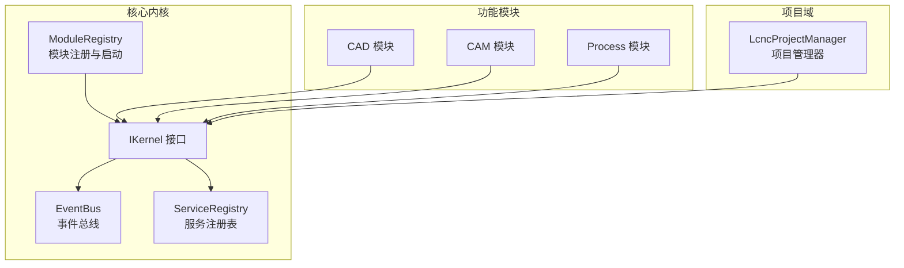
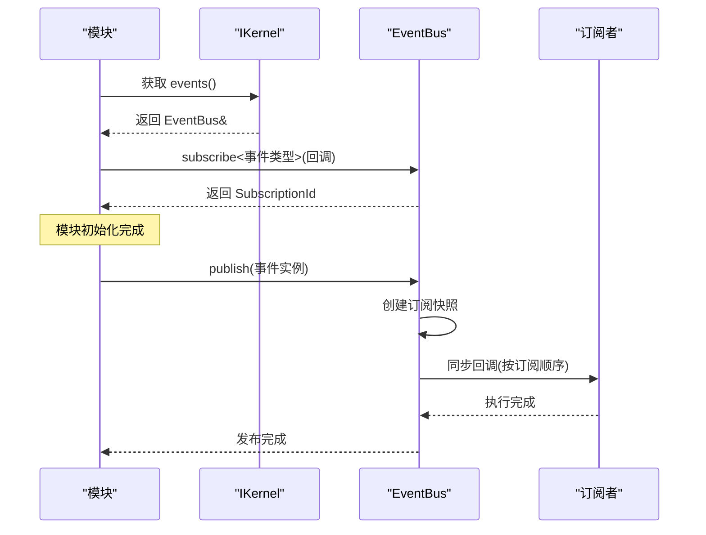
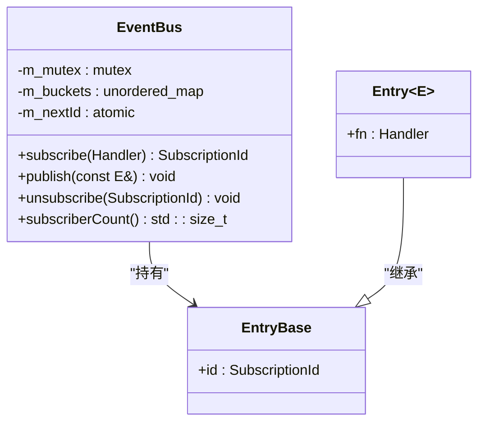
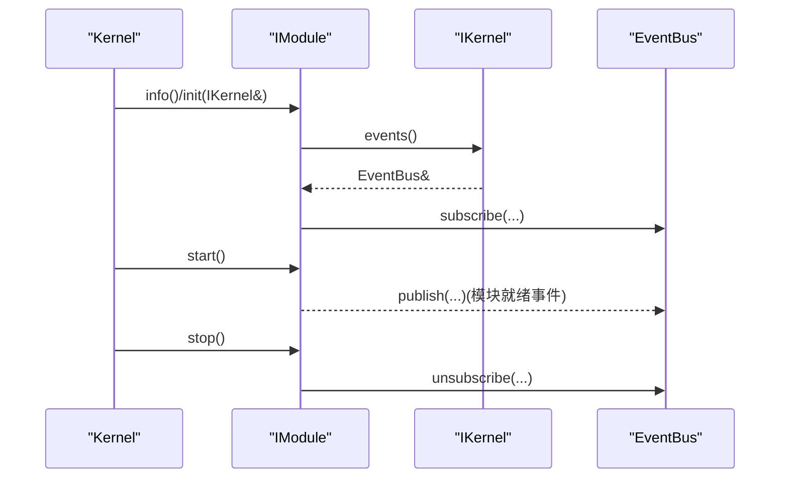
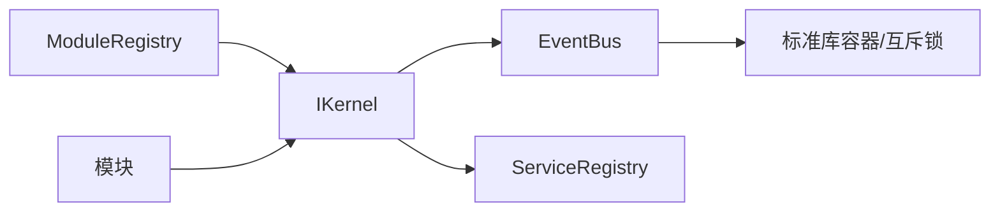

# 事件系统

<cite>
**本文档引用的文件**
- [event_bus.h](file://src/core/kernel/event_bus.h)
- [event_bus.cpp](file://src/core/kernel/event_bus.cpp)
- [i_kernel.h](file://src/core/kernel/i_kernel.h)
- [i_module.h](file://src/core/kernel/i_module.h)
- [module_registry.h](file://src/core/kernel/module_registry.h)
- [service_registry.h](file://src/core/kernel/service_registry.h)
- [service_registry.cpp](file://src/core/kernel/service_registry.cpp)
- [lcnc_project_manager.h](file://src/core/project/lcnc_project_manager.h)
- [lcnc_project_manager.cpp](file://src/core/project/lcnc_project_manager.cpp)
- [cad_module.cpp](file://src/modules/cad/cad_module.cpp)
</cite>

## 目录
1. [简介](#简介)
2. [项目结构](#项目结构)
3. [核心组件](#核心组件)
4. [架构总览](#架构总览)
5. [详细组件分析](#详细组件分析)
6. [依赖关系分析](#依赖关系分析)
7. [性能考量](#性能考量)
8. [故障排查指南](#故障排查指南)
9. [结论](#结论)
10. [附录](#附录)

## 简介
本文件系统性阐述LaserCNC的事件系统设计与实现，重点围绕类型化事件总线EventBus展开，涵盖事件的发布、订阅与路由机制，解释其在微内核架构中的角色与优势。文档同时提供事件定义、注册与使用的完整流程示例，说明如何在LaserCNC中创建自定义事件类型并进行处理；并总结性能优化策略、最佳实践以及避免循环依赖与内存泄漏的关键点。

## 项目结构
事件系统位于核心内核层，作为微内核框架的一部分，为各功能模块提供松耦合的通信通道。关键位置如下：
- 事件总线：src/core/kernel/event_bus.{h,cpp}
- 内核接口：src/core/kernel/i_kernel.h
- 模块接口与注册：src/core/kernel/i_module.h、src/core/kernel/module_registry.h
- 服务注册表：src/core/kernel/service_registry.{h,cpp}
- 项目域事件信号：src/core/project/lcnc_project_manager.{h,cpp}
- 模块使用示例：src/modules/cad/cad_module.cpp

图表来源
- [i_kernel.h:26-34](file://src/core/kernel/i_kernel.h#L26-L34)
- [module_registry.h:30-45](file://src/core/kernel/module_registry.h#L30-L45)
- [service_registry.h:26-68](file://src/core/kernel/service_registry.h#L26-L68)

章节来源
- [i_kernel.h:10-34](file://src/core/kernel/i_kernel.h#L10-L34)
- [module_registry.h:15-45](file://src/core/kernel/module_registry.h#L15-L45)
- [service_registry.h:12-68](file://src/core/kernel/service_registry.h#L12-L68)

## 核心组件
- EventBus：类型化发布/订阅总线，支持线程安全的订阅、发布与取消订阅，采用互斥锁保护并发访问，回调在发布线程同步执行。
- IKernel：微内核对外接口，提供events()访问事件总线与services()访问服务注册表的能力。
- ModuleRegistry：模块容器与启动调度器，负责模块的拓扑排序、init/start/stop生命周期管理。
- ServiceRegistry：服务定位器，按类型索引注册与查找服务实例。
- 项目域事件：LcncProjectManager提供基于Qt信号槽的领域事件（如projectOpened、domainDataChanged），与EventBus互补。

章节来源
- [event_bus.h:46-89](file://src/core/kernel/event_bus.h#L46-L89)
- [i_kernel.h:26-34](file://src/core/kernel/i_kernel.h#L26-L34)
- [module_registry.h:30-45](file://src/core/kernel/module_registry.h#L30-L45)
- [service_registry.h:26-68](file://src/core/kernel/service_registry.h#L26-L68)
- [lcnc_project_manager.h:52-57](file://src/core/project/lcnc_project_manager.h#L52-L57)

## 架构总览
EventBus在LaserCNC中承担“类型化事件”的统一入口，模块通过IKernel.events()获取事件总线实例，按事件类型进行订阅与发布。模块启动顺序由ModuleRegistry控制，确保依赖满足后再进入start阶段发布“就绪”事件。服务注册表ServiceRegistry与EventBus共同构成微内核的基础设施层。

图表来源
- [i_kernel.h:31-33](file://src/core/kernel/i_kernel.h#L31-L33)
- [event_bus.h:56-68](file://src/core/kernel/event_bus.h#L56-L68)
- [event_bus.h:118-155](file://src/core/kernel/event_bus.h#L118-L155)

## 详细组件分析

### EventBus 设计与实现
- 类型化与线程安全
  - 使用type_index作为事件类型键，结合无序映射与桶列表存储订阅项，支持O(1)平均查找与O(1)插入。
  - 互斥锁保护注册、发布、取消订阅全过程；发布过程中释放锁，避免回调期间死锁。
- 订阅与发布
  - subscribe返回唯一SubscriptionId，用于后续取消订阅；空回调会被拒绝并记录警告。
  - publish对目标事件类型生成订阅快照，遍历快照同步回调，捕获异常并记录错误日志。
- 取消订阅与统计
  - unsubscribe按ID从所有桶中查找并删除；未找到ID时记录调试日志。
  - subscriberCount提供全局订阅条目统计，便于调试与监控。

图表来源
- [event_bus.h:73-89](file://src/core/kernel/event_bus.h#L73-L89)
- [event_bus.h:93-155](file://src/core/kernel/event_bus.h#L93-L155)

章节来源
- [event_bus.h:24-44](file://src/core/kernel/event_bus.h#L24-L44)
- [event_bus.h:93-116](file://src/core/kernel/event_bus.h#L93-L116)
- [event_bus.h:118-155](file://src/core/kernel/event_bus.h#L118-L155)
- [event_bus.cpp:5-35](file://src/core/kernel/event_bus.cpp#L5-L35)

### IKernel 与模块生命周期
- IKernel提供events()与services()两个核心能力，模块在init阶段通过IKernel获取事件总线与服务注册表。
- IModule定义了init/start/stop三个阶段，模块不应在start/stop后仍持有IKernel指针，推荐保存弱引用或具体服务接口。

图表来源
- [i_kernel.h:26-34](file://src/core/kernel/i_kernel.h#L26-L34)
- [i_module.h:49-73](file://src/core/kernel/i_module.h#L49-L73)

章节来源
- [i_kernel.h:10-34](file://src/core/kernel/i_kernel.h#L10-L34)
- [i_module.h:37-73](file://src/core/kernel/i_module.h#L37-L73)

### ServiceRegistry 与事件系统的协作
- ServiceRegistry提供服务定位能力，模块可通过services().getService<T>()获取已注册服务实例。
- 与EventBus配合，模块可在start阶段发布“模块就绪”事件，其他模块通过订阅该事件实现解耦联动。

章节来源
- [service_registry.h:26-68](file://src/core/kernel/service_registry.h#L26-L68)
- [service_registry.cpp:7-15](file://src/core/kernel/service_registry.cpp#L7-L15)

### 项目域事件（Qt Signals）
- LcncProjectManager提供projectOpened、domainDataChanged等信号，用于项目状态变更通知。
- 与EventBus互补：Qt信号适合UI与本地模块间的紧耦合通知；EventBus适合跨模块、跨子系统的类型化事件。

章节来源
- [lcnc_project_manager.h:52-57](file://src/core/project/lcnc_project_manager.h#L52-L57)
- [lcnc_project_manager.cpp:66-111](file://src/core/project/lcnc_project_manager.cpp#L66-L111)

### 模块使用示例（CAD模块）
- CAD模块在任务完成后通过Kernel::current().projectManager()通知域变更，并发出operationFailed等事件，体现模块间通过内核接口进行协作的模式。

章节来源
- [cad_module.cpp:644-658](file://src/modules/cad/cad_module.cpp#L644-L658)

## 依赖关系分析
- EventBus依赖于标准库容器与互斥锁，通过type_index区分事件类型，Entry模板承载回调函数。
- IKernel将EventBus与ServiceRegistry暴露给模块，模块通过Kernel接口访问基础设施。
- ModuleRegistry负责模块生命周期与启动顺序，间接影响事件发布的时机与依赖满足情况。

图表来源
- [event_bus.h:3-11](file://src/core/kernel/event_bus.h#L3-L11)
- [i_kernel.h:31-33](file://src/core/kernel/i_kernel.h#L31-L33)
- [module_registry.h:30-45](file://src/core/kernel/module_registry.h#L30-L45)

章节来源
- [event_bus.h:3-11](file://src/core/kernel/event_bus.h#L3-L11)
- [i_kernel.h:31-33](file://src/core/kernel/i_kernel.h#L31-L33)
- [module_registry.h:30-45](file://src/core/kernel/module_registry.h#L30-L45)

## 性能考量
- 订阅快照与锁粒度
  - 发布时复制订阅快照，避免回调期间修改容器导致迭代器失效，同时减少锁持有时间，提升并发性能。
- 回调执行模型
  - 回调在发布线程同步执行，避免跨线程切换开销；若涉及UI更新，订阅者内部应使用队列方式切回GUI线程。
- 容器选择
  - 以type_index为键的无序映射提供平均O(1)查找；桶列表按订阅顺序回调，保证确定性。
- 日志与异常
  - 发布过程捕获异常并记录错误日志，防止单个订阅者的异常影响整体发布流程。

章节来源
- [event_bus.h:118-155](file://src/core/kernel/event_bus.h#L118-L155)
- [event_bus.cpp:26-35](file://src/core/kernel/event_bus.cpp#L26-L35)

## 故障排查指南
- 订阅无效或未触发
  - 确认handler非空且返回有效SubscriptionId；检查事件类型是否匹配；确认模块已在start阶段完成订阅。
- 取消订阅无效
  - 确认SubscriptionId有效且未被重复取消；查看日志中“unsubscribe id not found”提示。
- 发布无订阅者
  - 日志会输出“publish had no subscribers”，检查订阅是否在发布前完成。
- 回调异常
  - 发布过程中捕获异常并记录错误日志，定位具体订阅者ID与事件类型，修复回调逻辑。
- 内存与生命周期
  - 订阅者lambda捕获的对象生命周期由订阅方保证；模块stop阶段应取消所有订阅，避免悬挂回调。

章节来源
- [event_bus.h:96-101](file://src/core/kernel/event_bus.h#L96-L101)
- [event_bus.h:125-129](file://src/core/kernel/event_bus.h#L125-L129)
- [event_bus.h:144-152](file://src/core/kernel/event_bus.h#L144-L152)
- [event_bus.cpp:23](file://src/core/kernel/event_bus.cpp#L23)

## 结论
LaserCNC的事件系统以EventBus为核心，结合IKernel与ModuleRegistry，实现了模块间的松耦合通信与清晰的生命周期管理。通过类型化事件与同步回调模型，系统在保证简单易用的同时兼顾了性能与可靠性。建议在实际开发中遵循“轻量事件值类型、及时取消订阅、异常隔离与日志可观测”的最佳实践，以获得稳定高效的事件驱动架构体验。

## 附录

### 事件定义、注册与使用示例（步骤说明）
- 定义事件类型
  - 使用轻量值类型（拷贝/移动廉价），包含事件所需的数据字段。
- 订阅事件
  - 通过IKernel.events()获取EventBus实例，调用subscribe<事件类型>(回调)注册订阅，保存返回的SubscriptionId。
- 发布事件
  - 调用publish(事件实例)向所有订阅者同步发送事件。
- 取消订阅
  - 在模块stop阶段或不再需要时调用unsubscribe(SubscriptionId)，避免悬挂回调。
- 示例参考路径
  - 事件总线接口与实现：[event_bus.h:46-89](file://src/core/kernel/event_bus.h#L46-L89)、[event_bus.cpp:5-35](file://src/core/kernel/event_bus.cpp#L5-L35)
  - 内核接口与模块生命周期：[i_kernel.h:26-34](file://src/core/kernel/i_kernel.h#L26-L34)、[i_module.h:49-73](file://src/core/kernel/i_module.h#L49-L73)
  - 项目域事件信号：[lcnc_project_manager.h:52-57](file://src/core/project/lcnc_project_manager.h#L52-L57)、[lcnc_project_manager.cpp:66-111](file://src/core/project/lcnc_project_manager.cpp#L66-L111)

章节来源
- [event_bus.h:27-42](file://src/core/kernel/event_bus.h#L27-L42)
- [i_kernel.h:31-33](file://src/core/kernel/i_kernel.h#L31-L33)
- [i_module.h:61-72](file://src/core/kernel/i_module.h#L61-L72)
- [lcnc_project_manager.h:52-57](file://src/core/project/lcnc_project_manager.h#L52-L57)