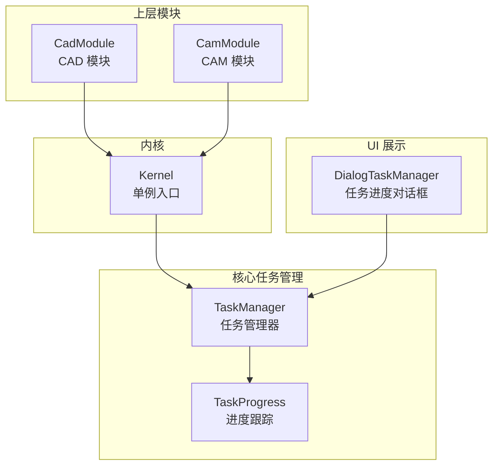
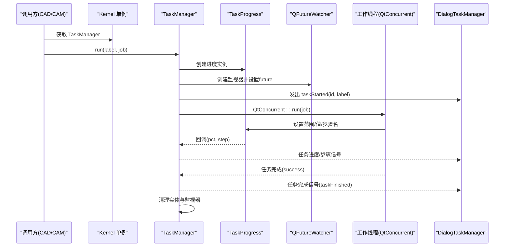
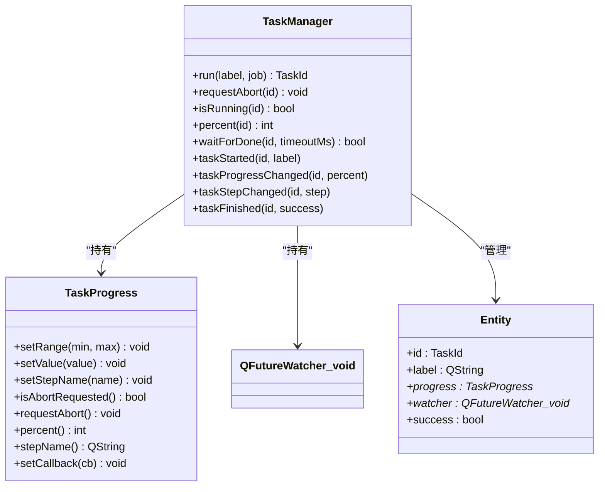
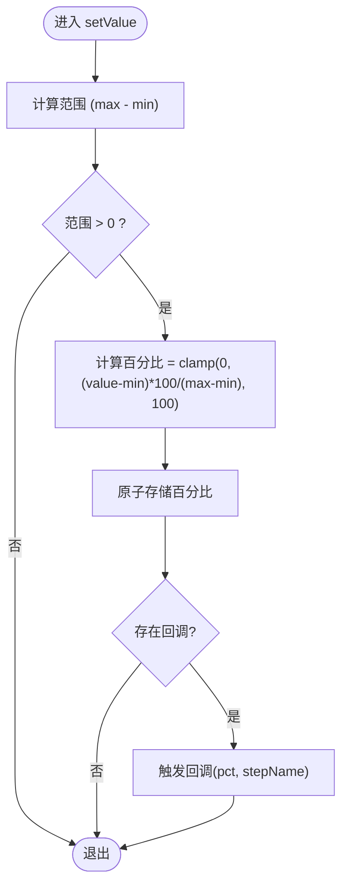
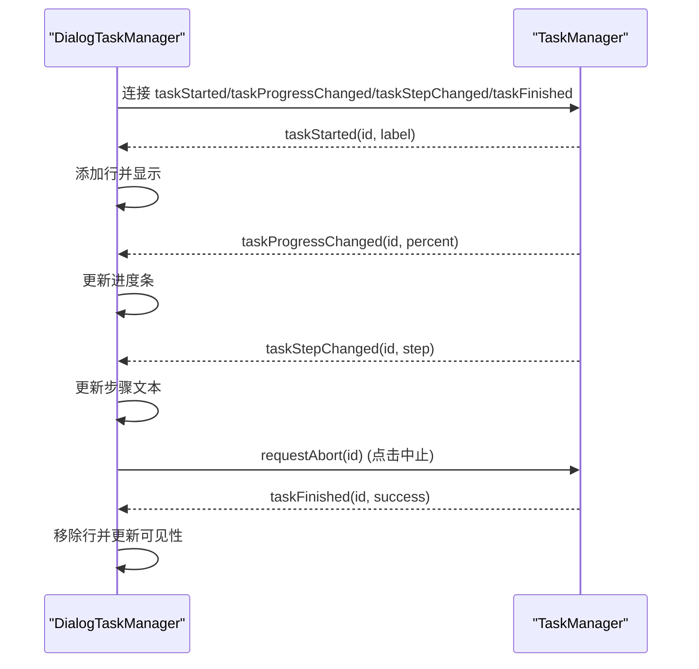
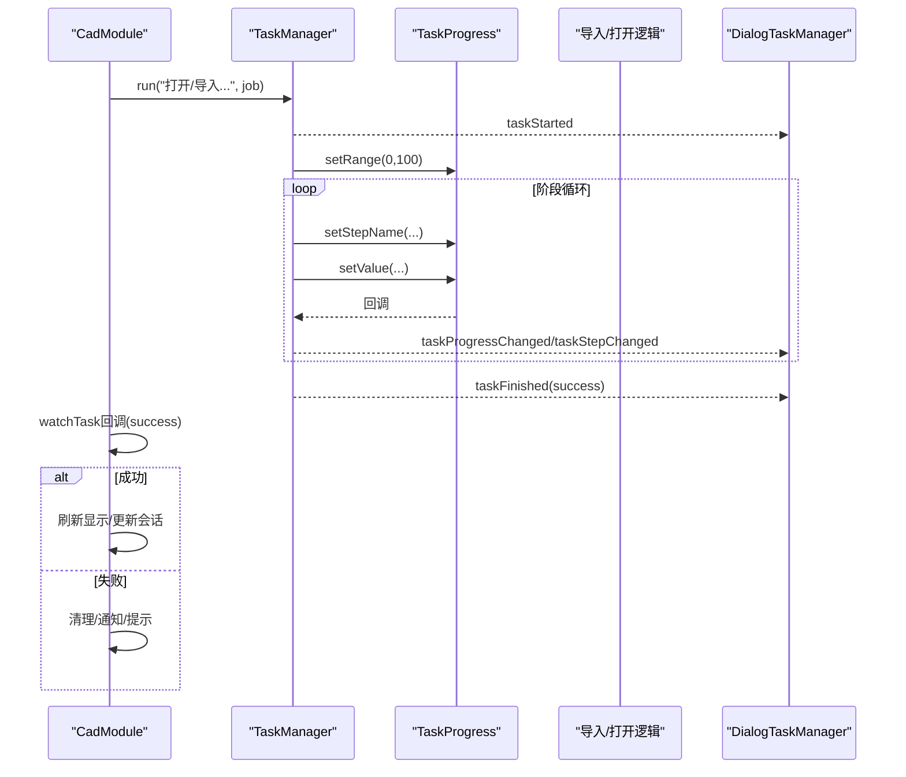
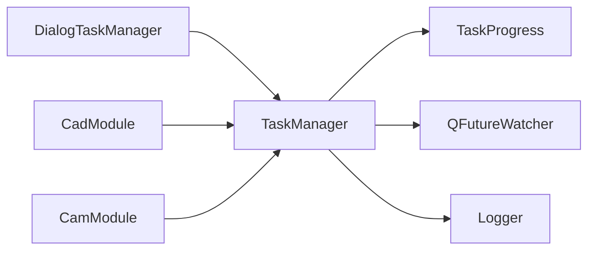

# 任务管理

<cite>
**本文引用的文件**
- [task_manager.h](file://src/core/task/task_manager.h)
- [task_manager.cpp](file://src/core/task/task_manager.cpp)
- [task_progress.h](file://src/core/task/task_progress.h)
- [task_progress.cpp](file://src/core/task/task_progress.cpp)
- [dialog_task_manager.h](file://src/app/dialog/dialog_task_manager.h)
- [dialog_task_manager.cpp](file://src/app/dialog/dialog_task_manager.cpp)
- [cad_module.cpp](file://src/modules/cad/cad_module.cpp)
- [cam_module.cpp](file://src/modules/cam/cam_module.cpp)
- [logger.h](file://src/core/logging/logger.h)
</cite>

## 目录
1. [引言](#引言)
2. [项目结构](#项目结构)
3. [核心组件](#核心组件)
4. [架构总览](#架构总览)
5. [详细组件分析](#详细组件分析)
6. [依赖关系分析](#依赖关系分析)
7. [性能考量](#性能考量)
8. [故障排查指南](#故障排查指南)
9. [结论](#结论)
10. [附录](#附录)

## 引言
本文件系统化阐述LaserCNC中“任务管理”子系统的设计与实现，覆盖任务的创建、调度、执行与监控；任务进度跟踪的实现方式（进度计算、状态更新、用户反馈）；异步任务处理的完整示例（长耗时操作与取消机制）；任务优先级与队列调度策略的扩展建议；任务间依赖关系的实现思路；以及错误处理、重试机制与性能监控、日志记录的最佳实践。

## 项目结构
任务管理子系统位于核心模块core下，包含任务管理器与进度跟踪两个关键类，配套有用于展示任务进度的对话框组件。上层模块（如CAD/CAM）通过Kernel提供的单例访问TaskManager，发起异步任务并监听进度与完成事件。

**图表来源**
- [task_manager.h:21-66](file://src/core/task/task_manager.h#L21-L66)
- [task_progress.h:14-43](file://src/core/task/task_progress.h#L14-L43)
- [dialog_task_manager.h:18-44](file://src/app/dialog/dialog_task_manager.h#L18-L44)
- [cad_module.cpp:571-636](file://src/modules/cad/cad_module.cpp#L571-L636)
- [cam_module.cpp:462-465](file://src/modules/cam/cam_module.cpp#L462-L465)

**章节来源**
- [task_manager.h:1-67](file://src/core/task/task_manager.h#L1-L67)
- [task_progress.h:1-44](file://src/core/task/task_progress.h#L1-L44)
- [dialog_task_manager.h:1-45](file://src/app/dialog/dialog_task_manager.h#L1-L45)

## 核心组件
- TaskManager：负责任务生命周期管理、并发执行、进度信号转发、异常捕获与清理。
- TaskProgress：轻量级进度报告器，支持范围设置、值更新、步骤名变更、取消请求与回调通知。
- DialogTaskManager：浮动对话框，自动显示/隐藏，展示每个任务的标签、进度条、当前步骤与中止按钮。
- 上层模块（CAD/CAM）：通过Kernel访问TaskManager，提交任务并在完成后进行业务处理。

关键职责与接口要点：
- 任务创建：TaskManager::run(label, job) 返回TaskId，内部创建TaskProgress与QFutureWatcher。
- 进度上报：TaskProgress通过setRange/setValue/setStepName更新百分比与步骤名，触发回调。
- 信号桥接：TaskManager将工作线程中的进度回调转为Qt信号，保证UI线程安全。
- 取消机制：UI点击中止或调用requestAbort，任务需周期检查isAbortRequested()以协作退出。
- 完成清理：任务结束时发出taskFinished并回收资源。

**章节来源**
- [task_manager.h:21-66](file://src/core/task/task_manager.h#L21-L66)
- [task_manager.cpp:27-77](file://src/core/task/task_manager.cpp#L27-L77)
- [task_progress.h:14-43](file://src/core/task/task_progress.h#L14-L43)
- [task_progress.cpp:3-25](file://src/core/task/task_progress.cpp#L3-L25)
- [dialog_task_manager.cpp:22-51](file://src/app/dialog/dialog_task_manager.cpp#L22-L51)

## 架构总览
下图展示了从上层模块到任务管理器、再到工作线程与UI的完整流程，以及异常捕获与清理路径。

**图表来源**
- [task_manager.cpp:27-77](file://src/core/task/task_manager.cpp#L27-L77)
- [task_progress.cpp:10-25](file://src/core/task/task_progress.cpp#L10-L25)
- [dialog_task_manager.cpp:22-51](file://src/app/dialog/dialog_task_manager.cpp#L22-L51)

## 详细组件分析

### 组件一：TaskManager 任务管理器
- 设计要点
  - 使用QtConcurrent::run在独立线程执行任务，避免阻塞UI。
  - 通过QFutureWatcher监听完成事件，统一收尾与清理。
  - 将工作线程中的进度回调经由Qt::QueuedConnection转为UI信号，确保线程安全。
  - 对std::exception与未知异常进行捕获并记录日志，标记任务成功标志位。
- 关键方法
  - run：创建实体、绑定进度回调、连接完成信号、启动任务、发出开始信号。
  - requestAbort：向对应任务的TaskProgress发出取消请求。
  - isRunning/percent/waitForDone：查询运行状态、当前进度、等待完成。
  - onTaskFinished：发出完成信号并清理实体与监视器。
- 线程模型
  - 工作线程：执行job，更新TaskProgress。
  - 任务管理器线程：接收回调，转发信号，管理生命周期。
  - UI线程：接收信号，更新界面。

**图表来源**
- [task_manager.h:21-66](file://src/core/task/task_manager.h#L21-L66)
- [task_manager.cpp:54-65](file://src/core/task/task_manager.cpp#L54-L65)
- [task_progress.h:14-43](file://src/core/task/task_progress.h#L14-L43)

**章节来源**
- [task_manager.h:21-66](file://src/core/task/task_manager.h#L21-L66)
- [task_manager.cpp:27-125](file://src/core/task/task_manager.cpp#L27-L125)

### 组件二：TaskProgress 任务进度跟踪
- 设计要点
  - 原子变量保存取消标志、百分比、最小/最大值与当前步骤名。
  - setRange设置范围并重置进度；setValue根据范围计算百分比并触发回调；setStepName更新步骤名并触发回调。
  - 支持外部设置回调，在工作线程中被调用，内部通过invokeMethod确保在TaskManager线程中转发到UI。
- 进度计算
  - 百分比 = clamp(0, (value - min) * 100 / (max - min), 100)。
- 用户反馈
  - 通过TaskManager的信号在UI线程更新进度条与步骤文本。

**图表来源**
- [task_progress.cpp:10-18](file://src/core/task/task_progress.cpp#L10-L18)

**章节来源**
- [task_progress.h:14-43](file://src/core/task/task_progress.h#L14-L43)
- [task_progress.cpp:3-25](file://src/core/task/task_progress.cpp#L3-L25)

### 组件三：DialogTaskManager 任务进度对话框
- 设计要点
  - 自动显示/隐藏：当有任务开始时显示，全部结束后隐藏。
  - 每个任务一行，包含标签、进度条、步骤文本与中止按钮。
  - 连接TaskManager的四个信号，实时更新UI。
  - 中止按钮通过Kernel访问TaskManager并请求取消。
- UI交互
  - 进度条范围0-100，按百分比更新。
  - 步骤文本显示当前阶段名称。

**图表来源**
- [dialog_task_manager.cpp:22-51](file://src/app/dialog/dialog_task_manager.cpp#L22-L51)
- [dialog_task_manager.cpp:82-84](file://src/app/dialog/dialog_task_manager.cpp#L82-L84)

**章节来源**
- [dialog_task_manager.h:18-44](file://src/app/dialog/dialog_task_manager.h#L18-L44)
- [dialog_task_manager.cpp:11-117](file://src/app/dialog/dialog_task_manager.cpp#L11-L117)

### 组件四：上层模块使用示例（CAD/CAM）
- CAD模块示例
  - 打开/导入文件：设置范围、阶段性更新步骤名与进度值，最后完成。
  - 错误处理：捕获异常并设置错误信息，watchTask回调中根据success决定后续动作。
- CAM模块示例
  - 加载机台配置：将IO加载逻辑委托给machine_io::loadMachineFromFile，传入TaskProgress以获得进度与取消能力。
- watchTask模式
  - 通用模式：提交任务后注册watchTask回调，任务完成后根据success执行业务分支（成功/失败）。

**图表来源**
- [cad_module.cpp:571-636](file://src/modules/cad/cad_module.cpp#L571-L636)
- [cad_module.cpp:683-700](file://src/modules/cad/cad_module.cpp#L683-L700)
- [cam_module.cpp:462-465](file://src/modules/cam/cam_module.cpp#L462-L465)

**章节来源**
- [cad_module.cpp:571-636](file://src/modules/cad/cad_module.cpp#L571-L636)
- [cad_module.cpp:683-700](file://src/modules/cad/cad_module.cpp#L683-L700)
- [cam_module.cpp:462-465](file://src/modules/cam/cam_module.cpp#L462-L465)

## 依赖关系分析
- 内部耦合
  - TaskManager依赖TaskProgress与QFutureWatcher，管理任务实体生命周期。
  - DialogTaskManager依赖TaskManager信号，无直接业务逻辑耦合。
- 外部依赖
  - QtConcurrent用于并发执行；Qt信号槽用于跨线程通信。
  - 日志系统用于未处理异常的记录。
- 潜在风险
  - 若任务未定期检查isAbortRequested()，取消可能不及时生效。
  - 进度回调在工作线程触发，必须通过Qt::QueuedConnection确保UI线程安全。

**图表来源**
- [task_manager.cpp:3-6](file://src/core/task/task_manager.cpp#L3-L6)
- [logger.h](file://src/core/logging/logger.h)

**章节来源**
- [task_manager.cpp:3-6](file://src/core/task/task_manager.cpp#L3-L6)
- [logger.h](file://src/core/logging/logger.h)

## 性能考量
- 并发模型
  - 使用QtConcurrent::run避免阻塞UI，适合CPU密集型与IO混合场景。
  - 建议将长耗时任务拆分为多个小步骤，定期更新进度与检查取消，提升响应性。
- 进度更新频率
  - 频繁setValue会带来信号与UI刷新开销，建议批量或阈值更新。
- 资源管理
  - 任务完成后立即清理TaskProgress与watcher，避免内存泄漏。
- 线程切换
  - 回调通过invokeMethod与QueuedConnection转发，减少锁竞争，但注意不要过度频繁触发信号。

## 故障排查指南
- 任务未显示
  - 检查是否正确连接TaskManager的信号到DialogTaskManager。
  - 确认任务确实被run并发出taskStarted。
- 进度不更新
  - 确认任务内调用了setRange与setValue。
  - 检查回调是否被设置（TaskManager内部已设置，确保未被覆盖）。
- 取消无效
  - 确认UI点击中止按钮后调用了requestAbort。
  - 任务需周期检查isAbortRequested()并尽早返回。
- 异常导致任务失败
  - TaskManager捕获std::exception与未知异常，记录日志并标记失败。
  - 建议在任务内部捕获可预期异常并设置错误信息，便于上层处理。

**章节来源**
- [task_manager.cpp:58-72](file://src/core/task/task_manager.cpp#L58-L72)
- [dialog_task_manager.cpp:82-84](file://src/app/dialog/dialog_task_manager.cpp#L82-L84)

## 结论
LaserCNC的任务管理子系统以TaskManager为核心，结合TaskProgress与DialogTaskManager，实现了可靠的异步任务执行、进度跟踪与用户交互。其基于QtConcurrent与信号槽的架构简洁清晰，易于扩展。建议在现有基础上引入优先级队列与依赖管理机制，以满足更复杂的任务编排需求。

## 附录

### 任务优先级与队列调度策略（扩展建议）
- 当前实现
  - 无显式优先级与队列控制，所有任务并行执行。
- 推荐方案
  - 引入任务队列与优先级字段，按优先级排序。
  - 支持“最多N个并发”的限制，空闲时取出高优先级任务执行。
  - 提供任务依赖声明与拓扑排序，确保前置任务完成后才执行下游任务。
- 影响范围
  - TaskManager需要新增队列与调度逻辑。
  - TaskProgress保持不变，继续提供进度与取消能力。

### 任务间依赖关系（实现思路）
- 依赖声明
  - 为每个任务附加依赖列表，形成DAG。
- 执行策略
  - 使用拓扑排序确定执行顺序；同一层级按优先级并发执行。
- 失败处理
  - 任一前置任务失败时，标记下游任务为“不可执行”，并发出相应信号。

### 错误处理与重试机制（最佳实践）
- 错误捕获
  - TaskManager已捕获异常并记录日志，上层应结合watchTask回调进行业务级处理。
- 重试策略
  - 对可恢复错误（如临时IO失败）可在上层模块实现有限次数重试。
  - 重试间隔采用指数退避，避免雪崩效应。
- 取消协作
  - 任务内部定期检查isAbortRequested()，在重试循环中也能及时退出。

### 性能监控与日志记录（最佳实践）
- 性能指标
  - 记录任务开始/结束时间、平均进度更新频率、取消率等。
- 日志级别
  - 未处理异常使用错误级别；任务超时/重试使用警告级别；常规进度使用调试级别。
- 日志聚合
  - 建议将任务日志与UI事件关联，便于问题定位。