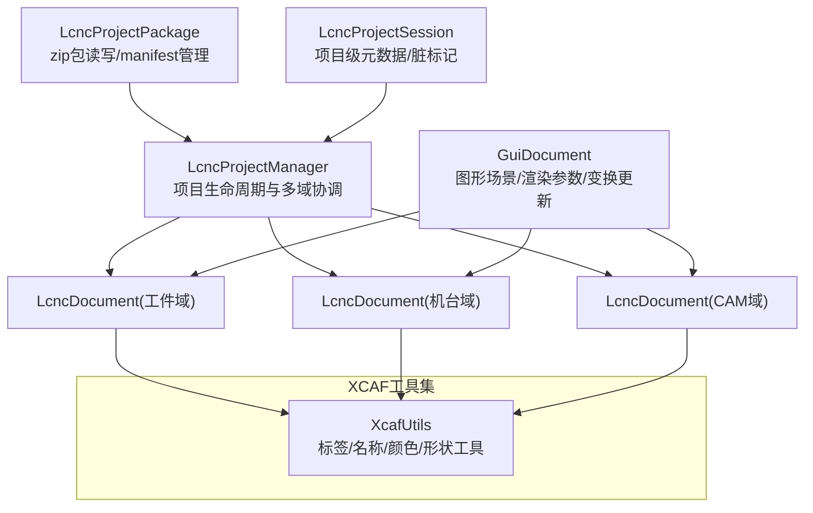
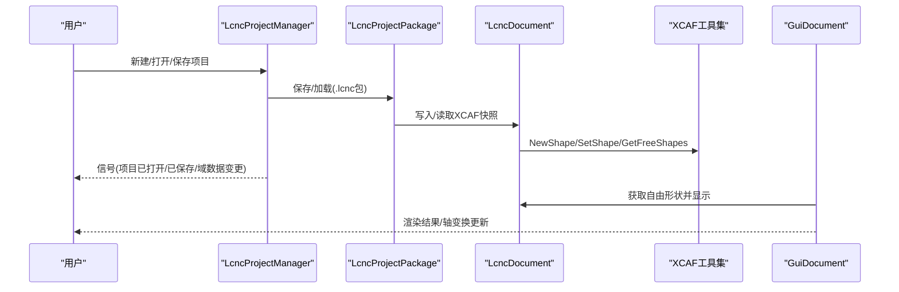
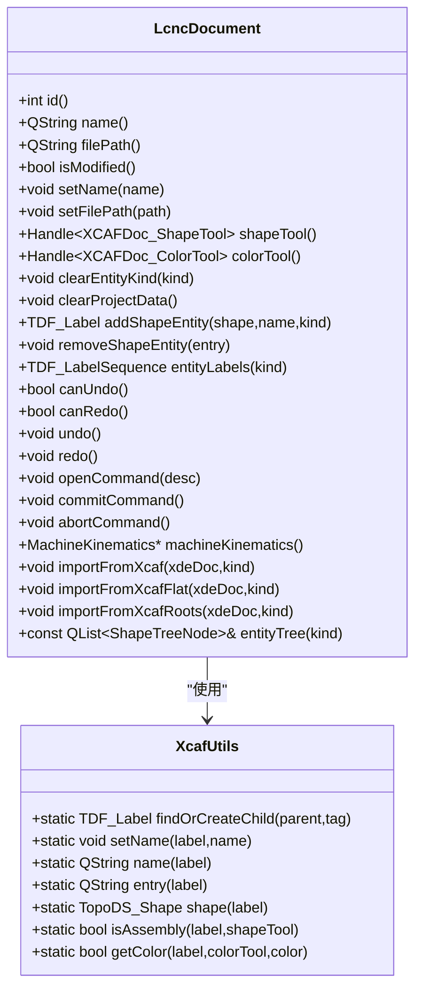
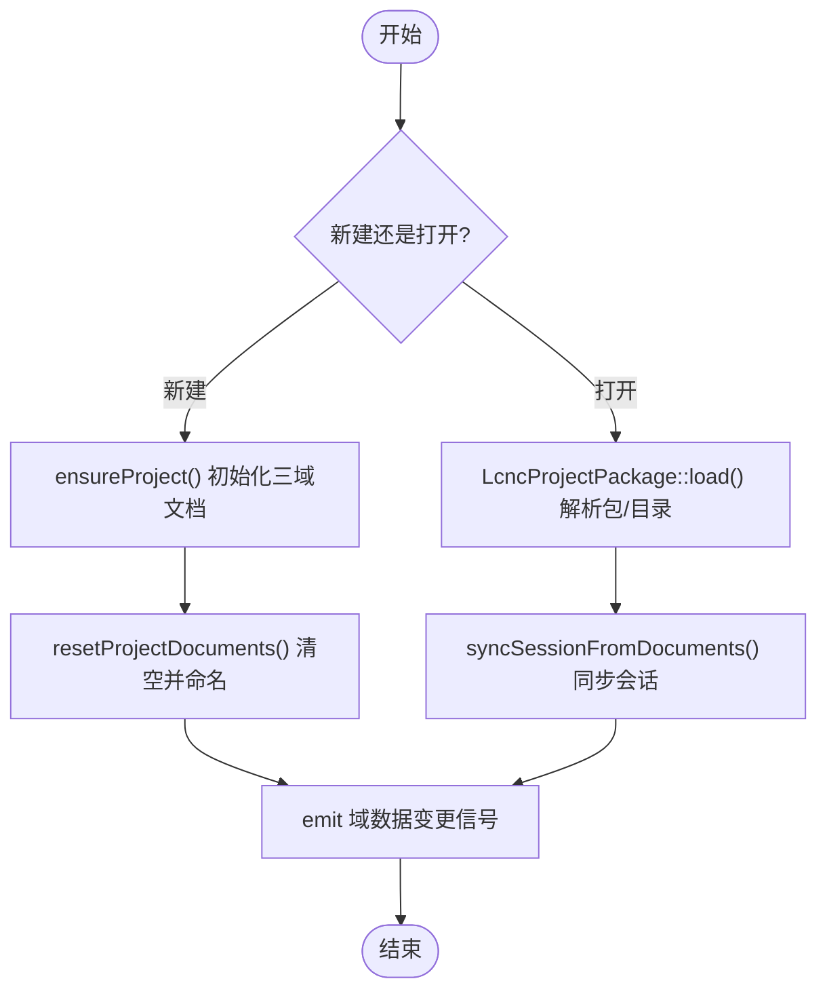
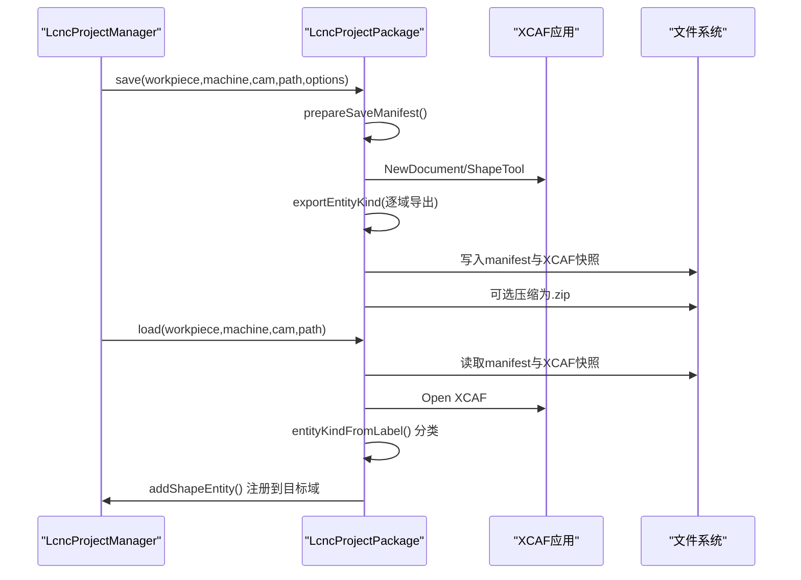
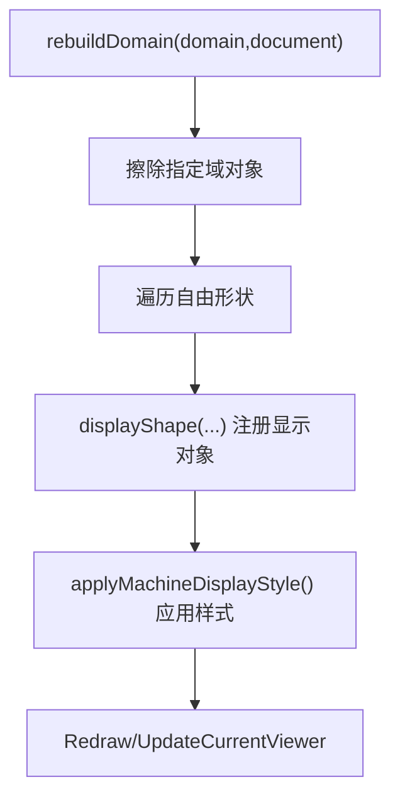
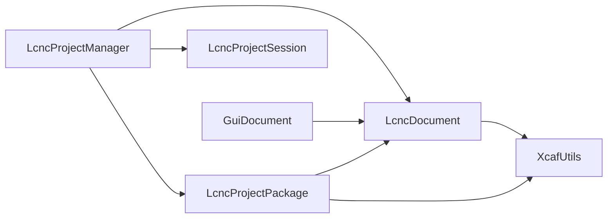

# 文档系统

<cite>
**本文引用的文件**   
- [lcnc_document.h](file://src/core/document/lcnc_document.h)
- [lcnc_document.cpp](file://src/core/document/lcnc_document.cpp)
- [xcaf_utils.h](file://src/core/document/xcaf_utils.h)
- [xcaf_utils.cpp](file://src/core/document/xcaf_utils.cpp)
- [lcnc_project_manager.h](file://src/core/project/lcnc_project_manager.h)
- [lcnc_project_manager.cpp](file://src/core/project/lcnc_project_manager.cpp)
- [lcnc_project_package.h](file://src/core/project/lcnc_project_package.h)
- [lcnc_project_package.cpp](file://src/core/project/lcnc_project_package.cpp)
- [lcnc_project_session.h](file://src/core/project/lcnc_project_session.h)
- [lcnc_project_session.cpp](file://src/core/project/lcnc_project_session.cpp)
- [gui_document.h](file://src/view/gui_document.h)
- [gui_document.cpp](file://src/view/gui_document.cpp)
- [cad_document_registry.h](file://src/modules/cad/document/cad_document_registry.h)
- [cad_document_state.h](file://src/modules/cad/document/cad_document_state.h)
- [cad_document_state.cpp](file://src/modules/cad/document/cad_document_state.cpp)
</cite>

## 目录
1. [引言](#引言)
2. [项目结构](#项目结构)
3. [核心组件](#核心组件)
4. [架构总览](#架构总览)
5. [详细组件分析](#详细组件分析)
6. [依赖分析](#依赖分析)
7. [性能考虑](#性能考虑)
8. [故障排查指南](#故障排查指南)
9. [结论](#结论)
10. [附录：使用示例与最佳实践](#附录使用示例与最佳实践)

## 引言
本文件系统文档面向LaserCNC的文档与数据模型子系统，重点阐述以下内容：
- LcncDocument文档基类的设计理念、继承关系与统一接口
- XCAF工具集的实现与应用（OpenCASCADE XCAF文档格式的读写与转换）
- 文档数据模型（几何数据、属性信息、元数据）的存储结构
- 文档创建、加载、保存与序列化的完整流程示例
- 版本控制与增量更新机制、文档间引用与关联
- 系统扩展性与自定义文档类型实现方法

## 项目结构
文档系统围绕“项目级协调器 + 多域文档 + GUI展示”三层组织：
- 核心层：LcncDocument承载XCAF数据树、实体分类、撤销/重做与导入导出
- 项目层：LcncProjectManager负责项目生命周期、多域文档管理与序列化
- 视图层：GuiDocument负责图形场景与渲染参数管理，桥接文档与可视化

图表来源
- [lcnc_project_manager.cpp:33-42](file://src/core/project/lcnc_project_manager.cpp#L33-L42)
- [lcnc_project_package.cpp:339-371](file://src/core/project/lcnc_project_package.cpp#L339-L371)
- [gui_document.cpp:54-68](file://src/view/gui_document.cpp#L54-L68)
- [xcaf_utils.h:21-52](file://src/core/document/xcaf_utils.h#L21-L52)

章节来源
- [lcnc_project_manager.h:19-71](file://src/core/project/lcnc_project_manager.h#L19-L71)
- [lcnc_project_package.h:24-71](file://src/core/project/lcnc_project_package.h#L24-L71)
- [gui_document.h:35-144](file://src/view/gui_document.h#L35-L144)
- [xcaf_utils.h:21-52](file://src/core/document/xcaf_utils.h#L21-L52)

## 核心组件
- LcncDocument：基于OpenCASCADE TDocStd_Document的XCAF文档容器，提供实体分类、层次导入、撤销/重做与机器运动学绑定
- XcafUtils：对XCAF底层API的薄封装，统一标签、名称、颜色与形状访问
- LcncProjectManager：项目生命周期与多域文档协调者，负责创建、打开、保存与导出
- LcncProjectPackage：.lcnc包的读写与manifest管理，负责XCAF快照的序列化
- LcncProjectSession：项目级元数据与脏标记，维护工作区状态
- GuiDocument：图形场景与渲染参数管理，驱动显示与轴变换更新

章节来源
- [lcnc_document.h:28-158](file://src/core/document/lcnc_document.h#L28-L158)
- [xcaf_utils.h:21-52](file://src/core/document/xcaf_utils.h#L21-L52)
- [lcnc_project_manager.h:19-71](file://src/core/project/lcnc_project_manager.h#L19-L71)
- [lcnc_project_package.h:24-71](file://src/core/project/lcnc_project_package.h#L24-L71)
- [lcnc_project_session.h:47-106](file://src/core/project/lcnc_project_session.h#L47-L106)
- [gui_document.h:35-144](file://src/view/gui_document.h#L35-L144)

## 架构总览
下图展示了从用户操作到持久化与可视化的完整链路。

图表来源
- [lcnc_project_manager.cpp:56-147](file://src/core/project/lcnc_project_manager.cpp#L56-L147)
- [lcnc_project_package.cpp:372-475](file://src/core/project/lcnc_project_package.cpp#L372-L475)
- [lcnc_document.cpp:126-164](file://src/core/document/lcnc_document.cpp#L126-L164)
- [gui_document.cpp:299-367](file://src/view/gui_document.cpp#L299-L367)

## 详细组件分析

### LcncDocument：文档基类与XCAF工具集
- 设计理念
  - 以XCAF为统一几何内核，通过“实体分类”与“层次导入”实现多域统一管理
  - 将撤销/重做与树快照结合，保证命令执行前后层次结构一致
  - 通过MachineKinematics绑定运动学，支持轴变换实时更新
- 关键能力
  - 实体管理：按类别添加/删除实体，枚举顶层实体
  - 层次导入：支持递归装配导入、扁平导入与根节点导入三种模式
  - 撤销/重做：命令栈与树快照栈联动，确保层次结构可恢复
  - 机器运动学：按形状条目计算局部变换，驱动视图轴显示
- XCAF工具集
  - 标签/名称/颜色/形状访问统一由XcafUtils封装，避免直接依赖底层头文件

图表来源
- [lcnc_document.h:28-158](file://src/core/document/lcnc_document.h#L28-L158)
- [xcaf_utils.h:21-52](file://src/core/document/xcaf_utils.h#L21-L52)

章节来源
- [lcnc_document.h:33-158](file://src/core/document/lcnc_document.h#L33-L158)
- [lcnc_document.cpp:45-65](file://src/core/document/lcnc_document.cpp#L45-L65)
- [lcnc_document.cpp:126-202](file://src/core/document/lcnc_document.cpp#L126-L202)
- [lcnc_document.cpp:304-336](file://src/core/document/lcnc_document.cpp#L304-L336)
- [lcnc_document.cpp:340-412](file://src/core/document/lcnc_document.cpp#L340-L412)
- [lcnc_document.cpp:416-439](file://src/core/document/lcnc_document.cpp#L416-L439)
- [lcnc_document.cpp:443-482](file://src/core/document/lcnc_document.cpp#L443-L482)
- [xcaf_utils.h:21-52](file://src/core/document/xcaf_utils.h#L21-L52)
- [xcaf_utils.cpp:13-70](file://src/core/document/xcaf_utils.cpp#L13-L70)

### LcncProjectManager：项目生命周期与多域协调
- 职责
  - 定义并初始化三个域文档（工件/机台/CAM）
  - 提供新建/打开/保存/导入/导出等入口
  - 维护项目级脏标记与域变更通知
- 关键流程
  - 新建：创建默认项目名，重置三域文档，清空脏标记
  - 打开：解析.lcnc包或目录，加载manifest与XCAF快照
  - 保存：根据选项决定包含哪些域，生成manifest与XCAF快照
  - 导入：支持STEP/IGES/STL等格式，批量注册为实体

图表来源
- [lcnc_project_manager.cpp:44-54](file://src/core/project/lcnc_project_manager.cpp#L44-L54)
- [lcnc_project_manager.cpp:56-112](file://src/core/project/lcnc_project_manager.cpp#L56-L112)
- [lcnc_project_manager.cpp:114-147](file://src/core/project/lcnc_project_manager.cpp#L114-L147)
- [lcnc_project_manager.cpp:347-399](file://src/core/project/lcnc_project_manager.cpp#L347-L399)

章节来源
- [lcnc_project_manager.h:19-71](file://src/core/project/lcnc_project_manager.h#L19-L71)
- [lcnc_project_manager.cpp:33-42](file://src/core/project/lcnc_project_manager.cpp#L33-L42)
- [lcnc_project_manager.cpp:44-112](file://src/core/project/lcnc_project_manager.cpp#L44-L112)
- [lcnc_project_manager.cpp:114-147](file://src/core/project/lcnc_project_manager.cpp#L114-L147)
- [lcnc_project_manager.cpp:149-171](file://src/core/project/lcnc_project_manager.cpp#L149-L171)
- [lcnc_project_manager.cpp:173-196](file://src/core/project/lcnc_project_manager.cpp#L173-L196)
- [lcnc_project_manager.cpp:198-230](file://src/core/project/lcnc_project_manager.cpp#L198-L230)
- [lcnc_project_manager.cpp:347-399](file://src/core/project/lcnc_project_manager.cpp#L347-L399)

### LcncProjectPackage：.lcnc包读写与XCAF快照
- 功能
  - 识别.lcnc包/目录/project.toml路径
  - 生成/校验manifest，保存/加载XCAF快照
  - 支持Windows平台的PowerShell压缩/解压后端
- 流程
  - 保存：准备manifest → 导出各域实体到XCAF → 写入manifest → 可选打包为zip
  - 加载：解析manifest → 读取XCAF快照 → 按实体类别分发到对应域文档

图表来源
- [lcnc_project_package.cpp:178-207](file://src/core/project/lcnc_project_package.cpp#L178-L207)
- [lcnc_project_package.cpp:243-262](file://src/core/project/lcnc_project_package.cpp#L243-L262)
- [lcnc_project_package.cpp:264-294](file://src/core/project/lcnc_project_package.cpp#L264-L294)
- [lcnc_project_package.cpp:296-335](file://src/core/project/lcnc_project_package.cpp#L296-L335)
- [lcnc_project_package.cpp:372-475](file://src/core/project/lcnc_project_package.cpp#L372-L475)
- [lcnc_project_package.cpp:485-556](file://src/core/project/lcnc_project_package.cpp#L485-L556)

章节来源
- [lcnc_project_package.h:24-71](file://src/core/project/lcnc_project_package.h#L24-L71)
- [lcnc_project_package.cpp:339-371](file://src/core/project/lcnc_project_package.cpp#L339-L371)
- [lcnc_project_package.cpp:372-475](file://src/core/project/lcnc_project_package.cpp#L372-L475)
- [lcnc_project_package.cpp:485-556](file://src/core/project/lcnc_project_package.cpp#L485-L556)

### GuiDocument：图形场景与渲染
- 职责
  - 维护GraphicsScene/V3d_View/AIS_InteractiveContext
  - 显示/重建/擦除形状，选择与轴变换更新
  - 应用渲染配置，按文档与域设置样式
- 关键点
  - 仅重建非gizmo的显示对象，避免误删ViewCube/Trihedron
  - 通过RenderingManager统一渲染参数与材质

图表来源
- [gui_document.cpp:311-367](file://src/view/gui_document.cpp#L311-L367)
- [gui_document.cpp:399-419](file://src/view/gui_document.cpp#L399-L419)

章节来源
- [gui_document.h:35-144](file://src/view/gui_document.h#L35-L144)
- [gui_document.cpp:54-68](file://src/view/gui_document.cpp#L54-L68)
- [gui_document.cpp:299-367](file://src/view/gui_document.cpp#L299-L367)
- [gui_document.cpp:399-419](file://src/view/gui_document.cpp#L399-L419)

### CAD文档状态与扩展性
- CadDocumentRegistry/CadDocumentState
  - 为CAD域提供每文档的状态缓存（草图管理、选择上下文、展示标志）
  - 通过DocumentId索引，便于在多文档环境中复用CAD功能
- 自定义文档类型建议
  - 基于LcncDocument扩展新域（如Tooling），复用XCAF与撤销/重做
  - 使用XcafUtils统一标签/名称/颜色访问
  - 在LcncProjectManager中注册新域文档与序列化逻辑

章节来源
- [cad_document_registry.h:12-35](file://src/modules/cad/document/cad_document_registry.h#L12-L35)
- [cad_document_state.h:16-47](file://src/modules/cad/document/cad_document_state.h#L16-L47)
- [cad_document_state.cpp:5-11](file://src/modules/cad/document/cad_document_state.cpp#L5-L11)

## 依赖分析
- 组件耦合
  - LcncProjectManager持有三域LcncDocument指针，负责生命周期与脏标记
  - LcncProjectPackage独立于文档实例，仅处理manifest与XCAF快照
  - GuiDocument依赖LcncDocument与RenderingManager，不持有文档所有权
  - XcafUtils作为纯工具类，被文档与包读写广泛使用
- 外部依赖
  - OpenCASCADE XCAF/STEP/IGES/STL读写
  - Windows PowerShell用于zip压缩/解压（平台特定）

图表来源
- [lcnc_project_manager.cpp:33-42](file://src/core/project/lcnc_project_manager.cpp#L33-L42)
- [lcnc_project_package.cpp:339-371](file://src/core/project/lcnc_project_package.cpp#L339-L371)
- [gui_document.cpp:54-68](file://src/view/gui_document.cpp#L54-L68)
- [xcaf_utils.h:21-52](file://src/core/document/xcaf_utils.h#L21-L52)

章节来源
- [lcnc_project_manager.h:19-71](file://src/core/project/lcnc_project_manager.h#L19-L71)
- [lcnc_project_package.h:24-71](file://src/core/project/lcnc_project_package.h#L24-L71)
- [gui_document.h:35-144](file://src/view/gui_document.h#L35-L144)
- [xcaf_utils.h:21-52](file://src/core/document/xcaf_utils.h#L21-L52)

## 性能考虑
- 撤销/重做栈大小
  - LcncDocument设置Undo上限，避免过深命令栈导致内存与稳定性问题
- 导入策略
  - 对机台模型采用扁平导入，减少装配层级与后续重建成本
  - 对根节点导入，避免过度分解，保留复合形状
- 渲染参数
  - GuiDocument通过RenderingManager集中配置，避免重复设置开销
- 平台压缩
  - Windows平台使用PowerShell进行zip操作，避免额外依赖；其他平台需自行实现

## 故障排查指南
- 打开/保存失败
  - 检查manifest有效性与XCAF快照存在性
  - 确认PowerShell后端可用（Windows）
- 导入几何失败
  - 确认文件格式支持（STEP/IGES/STL）
  - 检查文件是否存在且可读
- 显示异常
  - 确认GuiDocument未误擦除gizmo对象
  - 检查RenderingManager配置是否生效
- 运动学变换异常
  - 确认MachineKinematics已绑定至LcncDocument
  - 检查形状条目与轴映射是否正确

章节来源
- [lcnc_project_package.cpp:495-556](file://src/core/project/lcnc_project_package.cpp#L495-L556)
- [lcnc_project_manager.cpp:347-399](file://src/core/project/lcnc_project_manager.cpp#L347-L399)
- [gui_document.cpp:594-662](file://src/view/gui_document.cpp#L594-L662)

## 结论
LaserCNC文档系统以XCAF为核心，通过LcncDocument统一管理几何与层次结构，配合LcncProjectManager实现项目生命周期与多域协调，GuiDocument提供高效渲染与交互。XcafUtils封装底层细节，提升可维护性。.lcnc包机制与manifest确保版本与元数据可控，支持增量更新与跨平台部署。该架构具备良好的扩展性，便于新增域文档与自定义功能。

## 附录：使用示例与最佳实践
- 创建新项目
  - 调用LcncProjectManager::newProject()，随后通过domainDocumentById()获取各域文档
- 打开现有项目
  - LcncProjectManager::openProject()自动解析.lcnc或目录，加载manifest与XCAF快照
- 保存项目
  - LcncProjectManager::saveProject()根据选项决定包含域与缓存，生成manifest与XCAF快照
- 导入几何文件
  - LcncProjectManager::importWorkpieceModel()支持STEP/IGES/STL，批量注册为实体
- 导出域为STEP
  - LcncProjectManager::exportDomainAsStep()将指定域的自由形状导出为STEP
- 更新显示与轴变换
  - GuiDocument::rebuildDomain()重建指定域显示
  - GuiDocument::updateAxisTransforms()/updateMachineWorkspaceTransforms()应用运动学变换
- 最佳实践
  - 使用EntityKind区分实体类别，便于UI树构建与过滤
  - 在执行复杂修改前调用openCommand/commitCommand/abortCommand，确保撤销一致性
  - 对机台模型优先使用扁平导入，减少装配层级
  - 通过LcncProjectSession维护项目级元数据与脏标记，避免分散状态

章节来源
- [lcnc_project_manager.cpp:56-112](file://src/core/project/lcnc_project_manager.cpp#L56-L112)
- [lcnc_project_manager.cpp:114-147](file://src/core/project/lcnc_project_manager.cpp#L114-L147)
- [lcnc_project_manager.cpp:149-171](file://src/core/project/lcnc_project_manager.cpp#L149-L171)
- [lcnc_project_manager.cpp:173-196](file://src/core/project/lcnc_project_manager.cpp#L173-L196)
- [gui_document.cpp:299-367](file://src/view/gui_document.cpp#L299-L367)
- [gui_document.cpp:495-581](file://src/view/gui_document.cpp#L495-L581)