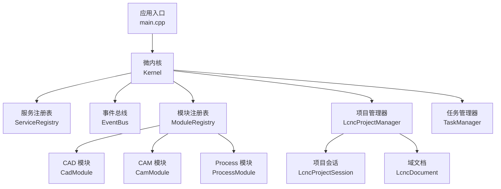
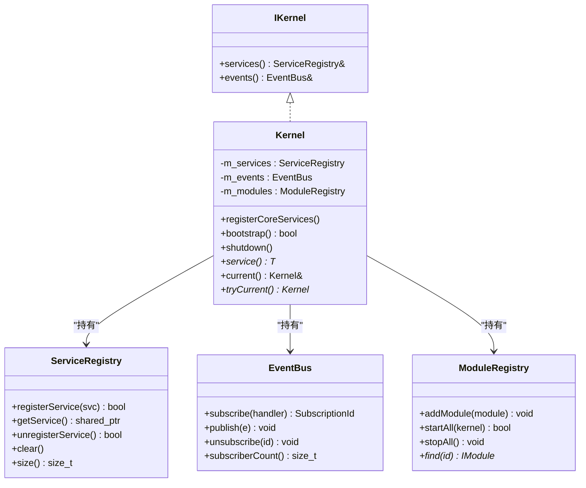
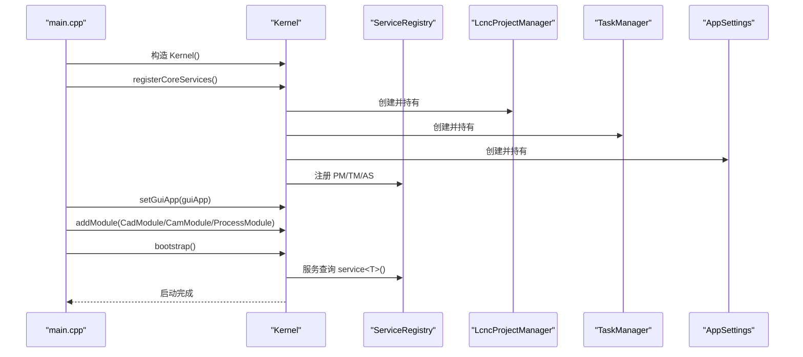
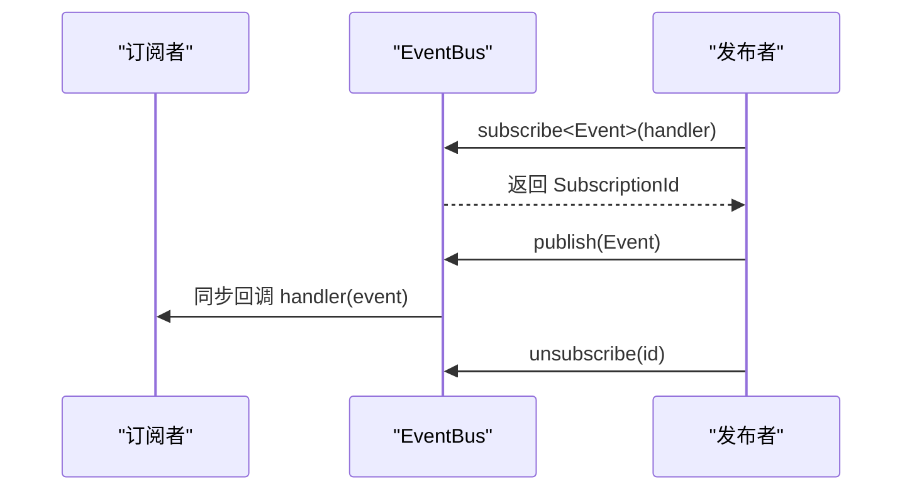
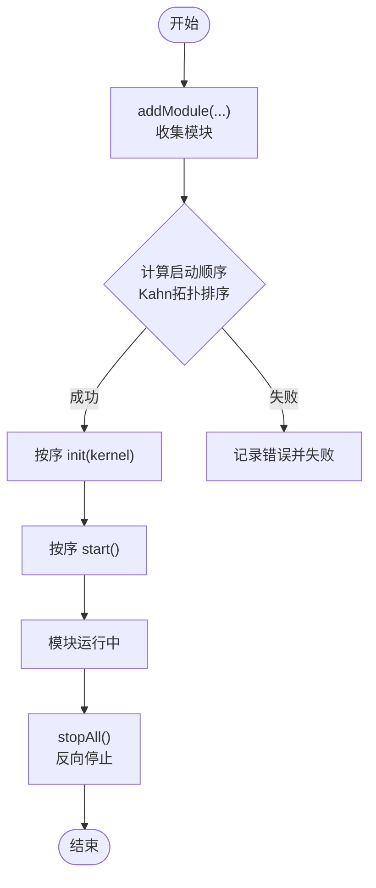
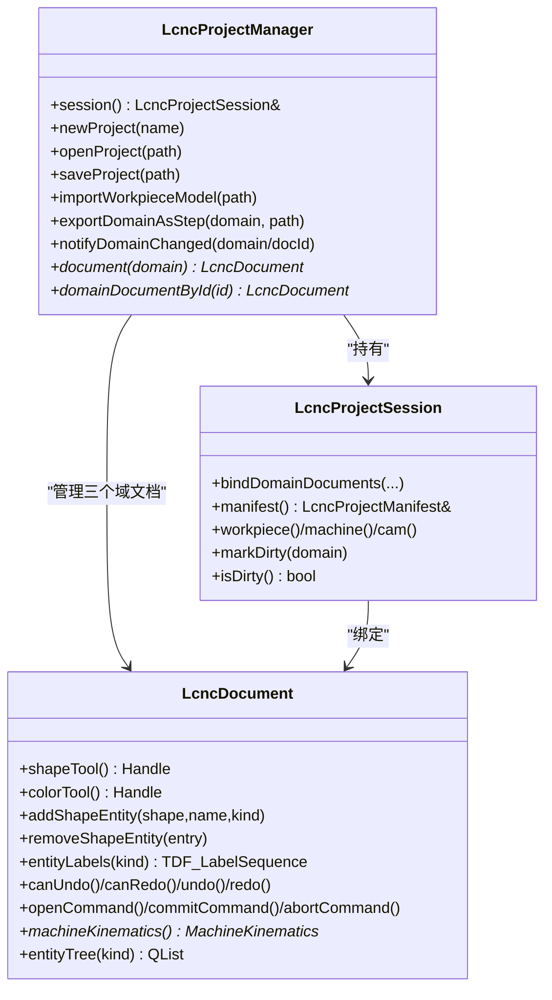
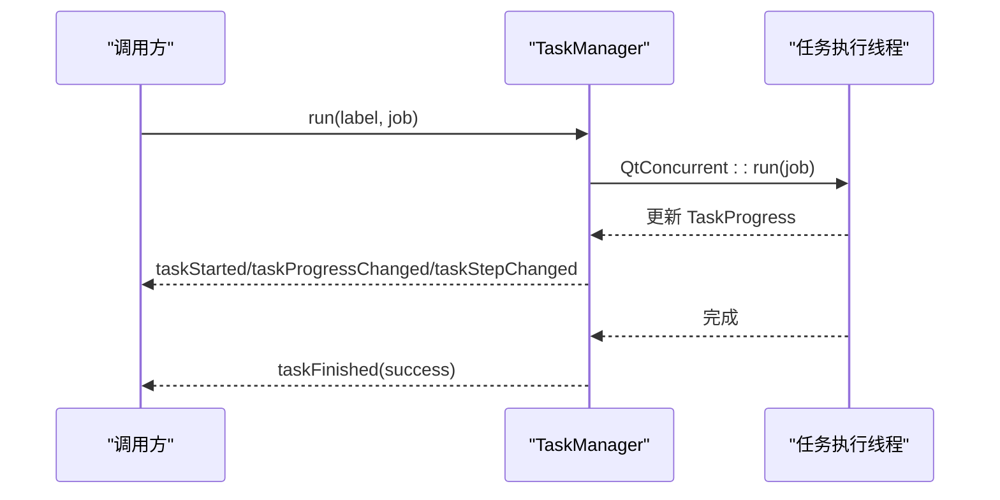
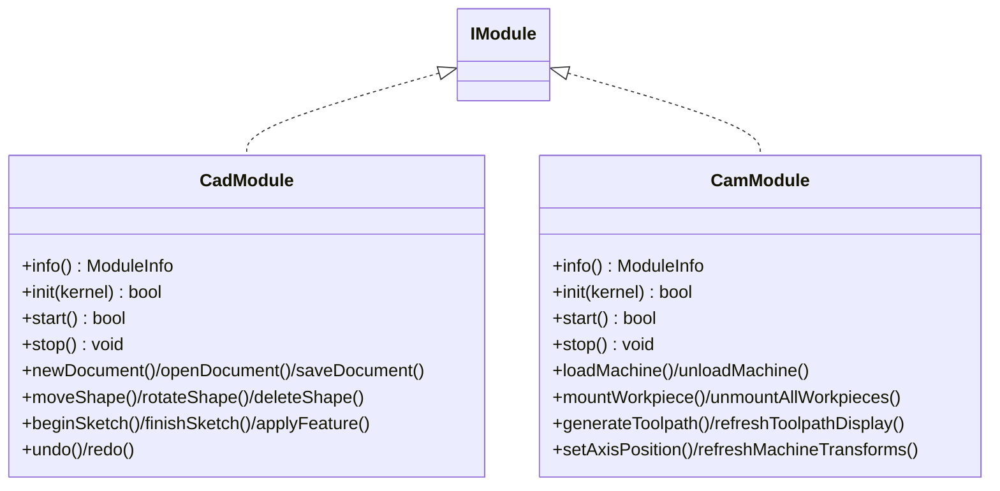
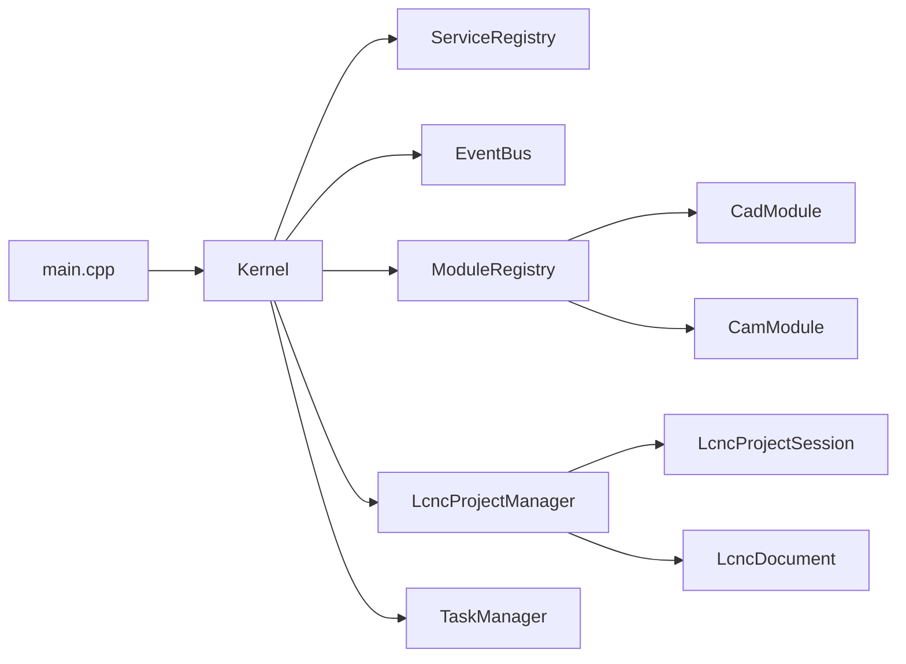

# 核心框架

<cite>
**本文档引用的文件**
- [main.cpp](file://src/main.cpp)
- [kernel.h](file://src/core/kernel/kernel.h)
- [i_kernel.h](file://src/core/kernel/i_kernel.h)
- [service_registry.h](file://src/core/kernel/service_registry.h)
- [module_registry.h](file://src/core/kernel/module_registry.h)
- [event_bus.h](file://src/core/kernel/event_bus.h)
- [i_service.h](file://src/core/kernel/i_service.h)
- [i_module.h](file://src/core/kernel/i_module.h)
- [lcnc_project_manager.h](file://src/core/project/lcnc_project_manager.h)
- [lcnc_project_session.h](file://src/core/project/lcnc_project_session.h)
- [lcnc_document.h](file://src/core/document/lcnc_document.h)
- [task_manager.h](file://src/core/task/task_manager.h)
- [app_context.h](file://src/app/app_context.h)
- [cad_module.h](file://src/modules/cad/cad_module.h)
- [cam_module.h](file://src/modules/cam/cam_module.h)
</cite>

## 目录
1. [简介](#简介)
2. [项目结构](#项目结构)
3. [核心组件](#核心组件)
4. [架构总览](#架构总览)
5. [详细组件分析](#详细组件分析)
6. [依赖关系分析](#依赖关系分析)
7. [性能考量](#性能考量)
8. [故障排查指南](#故障排查指南)
9. [结论](#结论)
10. [附录](#附录)

## 简介
本文件面向LaserCNC核心框架，系统性阐述微内核Kernel、项目管理LcncProjectManager、任务管理TaskManager等关键组件的设计与实现，解释服务注册与发现、事件总线发布订阅机制、模块生命周期与拓扑排序、项目多文档架构与数据同步、任务调度与状态管理，并给出扩展与新增服务组件的实践路径。

## 项目结构
LaserCNC采用“微内核 + 插件模块”的分层架构：
- 应用入口负责初始化日志、创建Kernel、注册核心服务、注入GUI应用、按配置加载模块并启动。
- 核心层提供Kernel、ServiceRegistry、EventBus、ModuleRegistry等基础设施。
- 业务层以模块形式组织：CAD、CAM、Process等，均实现IModule契约，可按依赖拓扑启动。
- 项目域通过LcncProjectManager协调三个OCC/XCAF域文档（工件、机台、CAM），并维护项目会话状态。

图表来源
- [main.cpp:68-114](file://src/main.cpp#L68-L114)
- [kernel.h:37-146](file://src/core/kernel/kernel.h#L37-L146)
- [module_registry.h:30-61](file://src/core/kernel/module_registry.h#L30-L61)
- [cad_module.h:45-128](file://src/modules/cad/cad_module.h#L45-L128)
- [cam_module.h:64-113](file://src/modules/cam/cam_module.h#L64-L113)

章节来源
- [main.cpp:33-135](file://src/main.cpp#L33-L135)
- [kernel.h:18-106](file://src/core/kernel/kernel.h#L18-L106)

## 核心组件
- Kernel：微内核主体，聚合服务注册表、事件总线、模块注册表，提供核心服务的强类型访问器与全局实例获取。
- ServiceRegistry：基于类型索引的轻量服务容器，支持注册、查询、注销与清理。
- EventBus：线程安全的类型化发布/订阅总线，支持订阅、发布、取消订阅。
- ModuleRegistry：模块容器与启动调度器，负责拓扑排序、启动/停止序列与失败回滚。
- LcncProjectManager：单项目生命周期与多域数据协调器，管理三个域文档与会话状态。
- LcncProjectSession：项目级身份与源数据，绑定域文档并维护脏标记。
- LcncDocument：OCC/XCAF后端的实体存储，封装形状工具、撤销/重做、导入树等。
- TaskManager：异步任务管理器，基于QtConcurrent与信号槽进行进度上报与完成通知。

章节来源
- [kernel.h:37-146](file://src/core/kernel/kernel.h#L37-L146)
- [service_registry.h:26-68](file://src/core/kernel/service_registry.h#L26-L68)
- [event_bus.h:46-89](file://src/core/kernel/event_bus.h#L46-L89)
- [module_registry.h:30-61](file://src/core/kernel/module_registry.h#L30-L61)
- [lcnc_project_manager.h:19-71](file://src/core/project/lcnc_project_manager.h#L19-L71)
- [lcnc_project_session.h:47-101](file://src/core/project/lcnc_project_session.h#L47-L101)
- [lcnc_document.h:28-155](file://src/core/document/lcnc_document.h#L28-L155)
- [task_manager.h:21-66](file://src/core/task/task_manager.h#L21-L66)

## 架构总览
微内核通过Kernel统一承载服务与事件，模块通过IModule契约参与生命周期管理。模块间依赖通过ModuleInfo声明，由ModuleRegistry进行Kahn拓扑排序，确保依赖先于被依赖模块初始化。

图表来源
- [i_kernel.h:26-34](file://src/core/kernel/i_kernel.h#L26-L34)
- [kernel.h:37-146](file://src/core/kernel/kernel.h#L37-L146)
- [service_registry.h:26-68](file://src/core/kernel/service_registry.h#L26-L68)
- [event_bus.h:46-89](file://src/core/kernel/event_bus.h#L46-L89)
- [module_registry.h:30-61](file://src/core/kernel/module_registry.h#L30-L61)

## 详细组件分析

### Kernel与核心服务注册
- Kernel在registerCoreServices阶段创建并持有核心服务实例（项目管理器、任务管理器、应用设置、机器配置等），并通过强类型getter暴露给上层。
- 通过Kernel::current()/tryCurrent()提供进程级全局访问入口，替代传统单例。
- 服务注册通过ServiceRegistry按类型索引存储，支持重复注册覆盖并记录警告日志。

图表来源
- [main.cpp:75-114](file://src/main.cpp#L75-L114)
- [kernel.h:52-106](file://src/core/kernel/kernel.h#L52-L106)
- [service_registry.h:35-56](file://src/core/kernel/service_registry.h#L35-L56)

章节来源
- [kernel.h:52-106](file://src/core/kernel/kernel.h#L52-L106)
- [service_registry.h:35-56](file://src/core/kernel/service_registry.h#L35-L56)

### 事件总线：发布/订阅与消息传递
- EventBus提供类型化订阅与发布，回调在发布线程同步执行，订阅句柄用于取消订阅。
- 设计强调事件类型为轻量值类型，避免昂贵拷贝；订阅者内部可通过队列方式切换到UI线程。
- 发布时复制订阅快照，避免回调期间订阅/取消导致的迭代器失效；异常被捕获并记录。

图表来源
- [event_bus.h:94-116](file://src/core/kernel/event_bus.h#L94-L116)
- [event_bus.h:119-155](file://src/core/kernel/event_bus.h#L119-L155)

章节来源
- [event_bus.h:46-89](file://src/core/kernel/event_bus.h#L46-L89)

### 模块系统：生命周期与拓扑排序
- IModule定义模块元信息与生命周期：info/init/start/stop。
- ModuleRegistry负责收集模块、计算启动顺序（Kahn拓扑排序）、顺序执行init/start、反向stop并释放。
- 失败策略：init失败回滚已init模块；start失败仅停止已start模块，保留init状态便于诊断。

图表来源
- [module_registry.h:30-61](file://src/core/kernel/module_registry.h#L30-L61)
- [i_module.h:20-48](file://src/core/kernel/i_module.h#L20-L48)

章节来源
- [module_registry.h:30-61](file://src/core/kernel/module_registry.h#L30-L61)
- [i_module.h:28-73](file://src/core/kernel/i_module.h#L28-L73)

### 项目管理：多文档架构与数据同步
- LcncProjectManager管理单项目生命周期，持有三个域文档（工件/机台/CAM），并维护会话状态与脏标记。
- LcncProjectSession绑定域文档，保存项目名称、路径、清单、保存选项与各域状态，提供脏标志管理。
- LcncDocument基于OCC/XCAF，提供形状工具、撤销/重做、命令事务、导入树等能力，支持按类别枚举实体与层级树快照。

图表来源
- [lcnc_project_manager.h:19-71](file://src/core/project/lcnc_project_manager.h#L19-L71)
- [lcnc_project_session.h:47-101](file://src/core/project/lcnc_project_session.h#L47-L101)
- [lcnc_document.h:28-155](file://src/core/document/lcnc_document.h#L28-L155)

章节来源
- [lcnc_project_manager.h:19-71](file://src/core/project/lcnc_project_manager.h#L19-L71)
- [lcnc_project_session.h:47-101](file://src/core/project/lcnc_project_session.h#L47-L101)
- [lcnc_document.h:28-155](file://src/core/document/lcnc_document.h#L28-L155)

### 任务管理：调度与状态
- TaskManager以QtConcurrent::run执行异步任务，通过TaskProgress与信号槽向UI线程汇报进度与步骤。
- 支持请求中止、等待完成、查询状态与百分比，任务生命周期内通过watcher与progress对象管理。

图表来源
- [task_manager.h:21-66](file://src/core/task/task_manager.h#L21-L66)

章节来源
- [task_manager.h:21-66](file://src/core/task/task_manager.h#L21-L66)

### 模块集成：CAD/CAM工作流
- CadModule作为文档与建模操作的门面，实现IModule与ICadFacade，负责文档生命周期、选择/可见性、建模操作、草图与特征建模、撤销/重做等。
- CamModule依赖CadModule，管理机台模型、轴配置、工件装夹、刀路生成与显示、姿态刷新与局部刷新合并等。

图表来源
- [cad_module.h:45-128](file://src/modules/cad/cad_module.h#L45-L128)
- [cam_module.h:64-113](file://src/modules/cam/cam_module.h#L64-L113)
- [i_module.h:49-73](file://src/core/kernel/i_module.h#L49-L73)

章节来源
- [cad_module.h:45-306](file://src/modules/cad/cad_module.h#L45-L306)
- [cam_module.h:64-421](file://src/modules/cam/cam_module.h#L64-L421)

## 依赖关系分析
- 应用入口依赖Kernel与各模块头文件，按配置决定是否启用模块。
- Kernel依赖ServiceRegistry、EventBus、ModuleRegistry与核心服务。
- 模块依赖通过ModuleInfo.dependencies声明，ModuleRegistry在启动前进行拓扑排序。
- 项目管理器依赖域文档与会话，任务管理器为独立服务，模块通过Kernel.services()访问。

图表来源
- [main.cpp:106-108](file://src/main.cpp#L106-L108)
- [kernel.h:37-146](file://src/core/kernel/kernel.h#L37-L146)
- [module_registry.h:30-61](file://src/core/kernel/module_registry.h#L30-L61)
- [cad_module.h:120-128](file://src/modules/cad/cad_module.h#L120-L128)
- [cam_module.h:108-113](file://src/modules/cam/cam_module.h#L108-L113)

章节来源
- [main.cpp:75-114](file://src/main.cpp#L75-L114)
- [kernel.h:37-146](file://src/core/kernel/kernel.h#L37-L146)

## 性能考量
- 服务注册与查询：ServiceRegistry基于unordered_map，按type_index查找，平均O(1)，注册阶段建议在主线程进行。
- 事件总线：发布时复制订阅快照，避免迭代器失效；回调在发布线程同步执行，订阅者内部可使用队列切换到UI线程。
- 模块启动：拓扑排序一次完成，启动/停止按序进行，失败回滚减少资源泄漏。
- 任务管理：基于QtConcurrent，非阻塞UI；TaskProgress与信号槽确保UI线程更新。
- 文档与几何：LcncDocument封装OCC工具与命令事务，撤销/重做栈与树快照减少重复计算。

## 故障排查指南
- 启动失败
  - 检查模块依赖配置与禁用列表，确认依赖模块未被禁用。
  - 查看Kernel::bootstrap返回值与日志，定位init/start失败模块。
- 服务未找到
  - 确认服务已在init阶段通过Kernel::services().registerService注册。
  - 使用Kernel::service<T>()进行查询并进行空指针检查。
- 事件未触发
  - 确认订阅句柄有效且未被取消；检查订阅回调是否抛出异常。
  - 确认发布事件类型与订阅类型一致。
- 任务未完成
  - 检查TaskManager::run返回的任务ID；使用waitForDone或监听taskFinished信号。
  - 确保任务内部定期检查TaskProgress::isAbortRequested()以响应中止请求。
- 项目数据不同步
  - 检查LcncProjectManager::notifyDomainChanged调用与LcncProjectSession脏标记更新。
  - 确认LcncDocument命令事务正确提交或中止，撤销/重做栈与树快照一致性。

章节来源
- [kernel.h:52-88](file://src/core/kernel/kernel.h#L52-L88)
- [service_registry.h:72-97](file://src/core/kernel/service_registry.h#L72-L97)
- [event_bus.h:94-116](file://src/core/kernel/event_bus.h#L94-L116)
- [task_manager.h:29-38](file://src/core/task/task_manager.h#L29-L38)
- [lcnc_project_manager.h:37-38](file://src/core/project/lcnc_project_manager.h#L37-L38)

## 结论
LaserCNC核心框架以微内核为核心，通过Kernel统一承载服务与事件，结合ServiceRegistry与EventBus实现松耦合的组件协作；ModuleRegistry保障模块按依赖拓扑有序启动与停止；项目管理器与多域文档体系支撑复杂几何与工艺流程的数据一致性；任务管理器提供非阻塞的异步执行与进度反馈。该设计既满足可扩展性与可维护性，又兼顾性能与可靠性。

## 附录

### 扩展与新增服务组件实践
- 新增服务接口
  - 定义IService派生接口，声明纯虚方法与必要信号。
  - 在模块init阶段通过Kernel::services().registerService注册服务实例。
- 新增模块
  - 实现IModule：info/init/start/stop，声明ModuleInfo.dependencies。
  - 在main中按依赖顺序addModule，或根据配置动态启用。
- 使用模式
  - 通过Kernel::current()获取全局实例，使用service<T>()查询服务。
  - 使用EventBus::subscribe/publish进行类型化通信。
  - 通过TaskManager::run执行耗时任务，监听进度与完成信号。

章节来源
- [i_service.h:19-23](file://src/core/kernel/i_service.h#L19-L23)
- [i_module.h:28-73](file://src/core/kernel/i_module.h#L28-L73)
- [kernel.h:123-130](file://src/core/kernel/kernel.h#L123-L130)
- [event_bus.h:56-68](file://src/core/kernel/event_bus.h#L56-L68)
- [task_manager.h:29-38](file://src/core/task/task_manager.h#L29-L38)