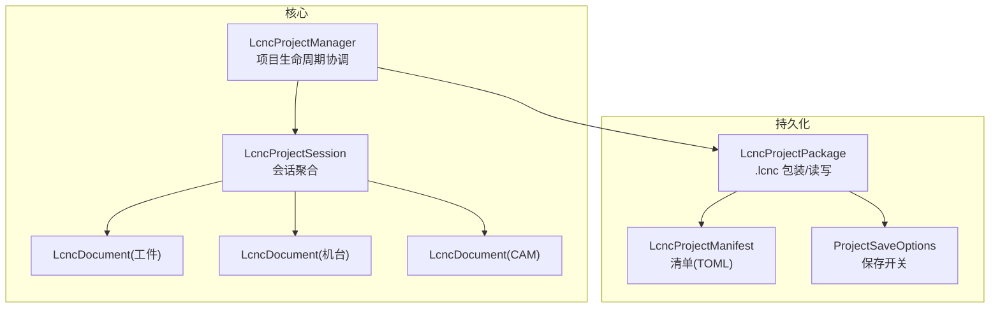
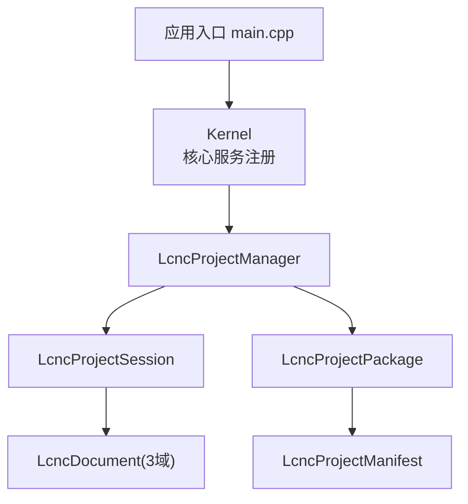
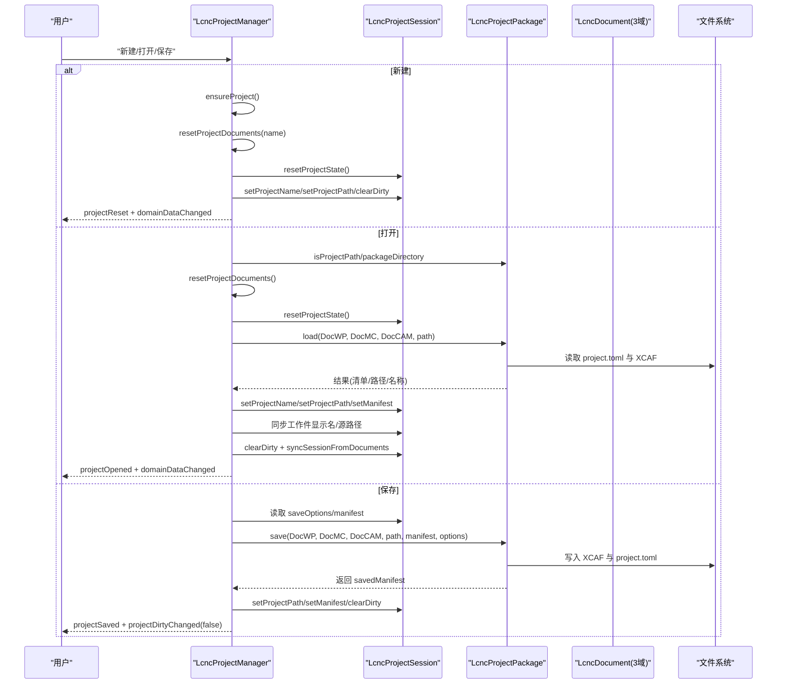
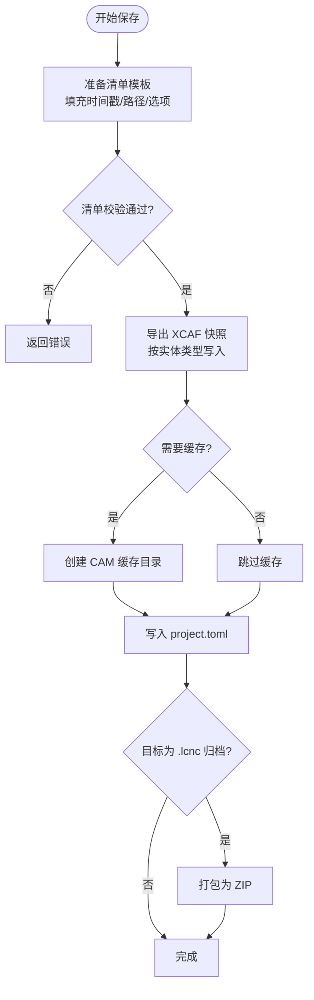
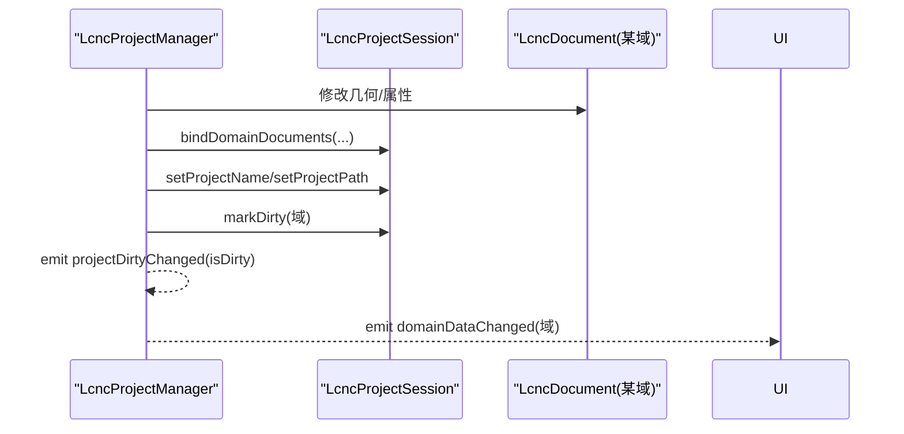
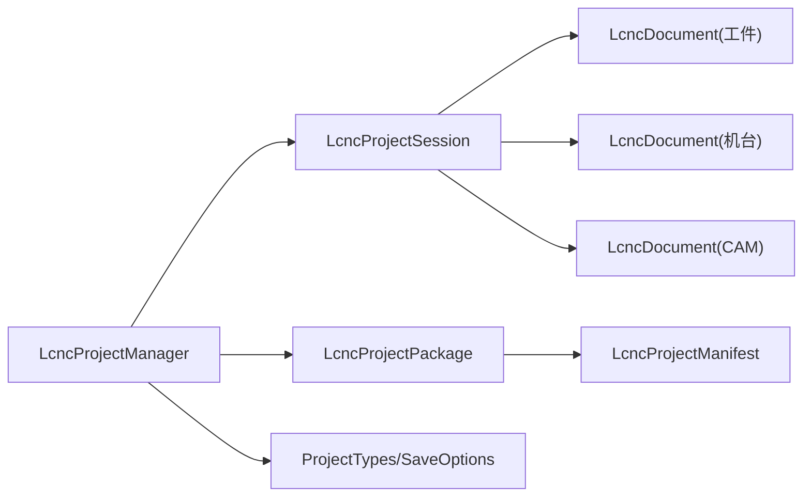
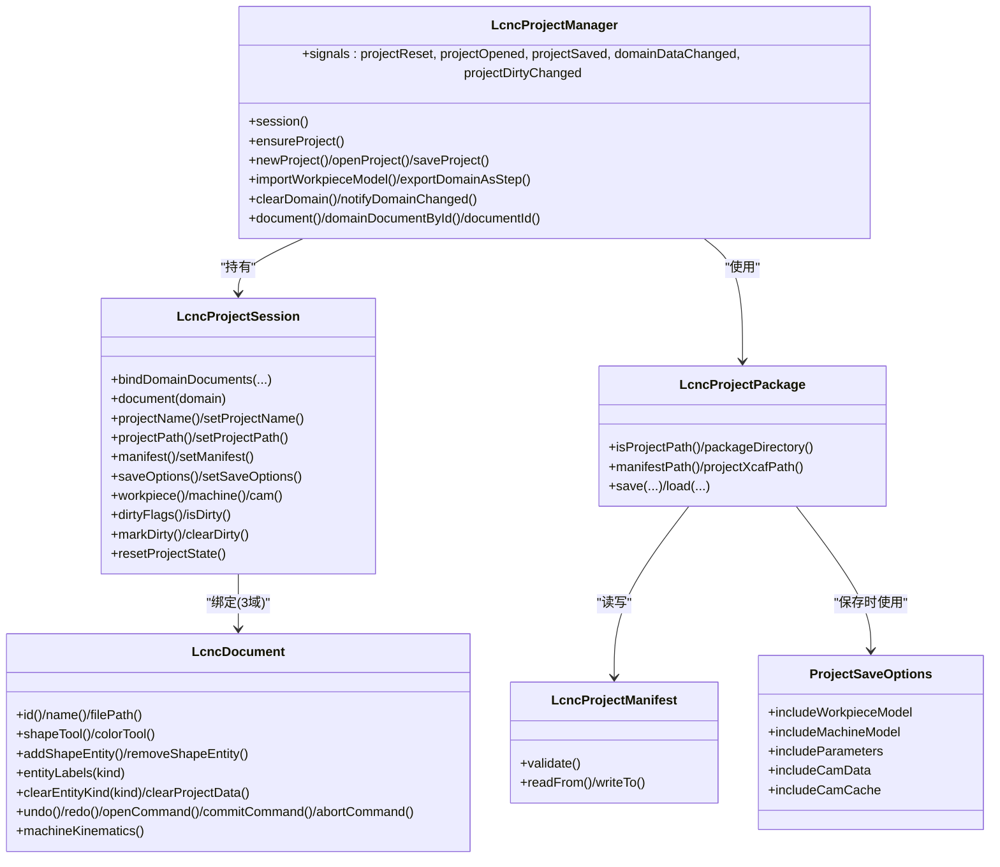
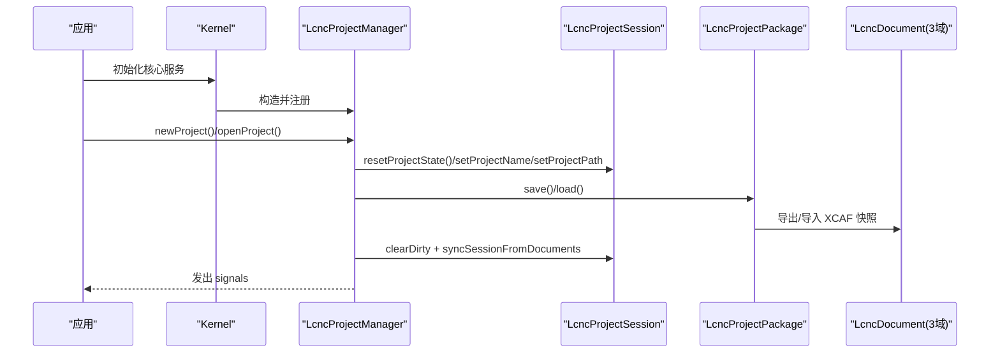

# 项目会话

<cite>
**本文引用的文件**
- [lcnc_project_session.h](file://src/core/project/lcnc_project_session.h)
- [lcnc_project_session.cpp](file://src/core/project/lcnc_project_session.cpp)
- [lcnc_project_manager.h](file://src/core/project/lcnc_project_manager.h)
- [lcnc_project_manager.cpp](file://src/core/project/lcnc_project_manager.cpp)
- [lcnc_project_manifest.h](file://src/core/project/lcnc_project_manifest.h)
- [lcnc_project_manifest.cpp](file://src/core/project/lcnc_project_manifest.cpp)
- [project_save_options.h](file://src/core/project/project_save_options.h)
- [project_types.h](file://src/core/project/project_types.h)
- [lcnc_project_package.h](file://src/core/project/lcnc_project_package.h)
- [lcnc_project_package.cpp](file://src/core/project/lcnc_project_package.cpp)
- [lcnc_document.h](file://src/core/document/lcnc_document.h)
- [lcnc_document.cpp](file://src/core/document/lcnc_document.cpp)
- [kernel.h](file://src/core/kernel/kernel.h)
- [kernel.cpp](file://src/core/kernel/kernel.cpp)
- [main.cpp](file://src/main.cpp)
</cite>

## 目录
1. [引言](#引言)
2. [项目结构](#项目结构)
3. [核心组件](#核心组件)
4. [架构总览](#架构总览)
5. [组件详解](#组件详解)
6. [依赖关系分析](#依赖关系分析)
7. [性能考量](#性能考量)
8. [故障排除指南](#故障排除指南)
9. [结论](#结论)
10. [附录](#附录)

## 引言
本文件系统性阐述 LaserCNC 项目中“LcncProjectSession”项目会话系统的设计理念、实现架构与运行机制。重点覆盖以下主题：
- 会话生命周期管理：从创建、打开、保存到重置的完整流程。
- 会话数据持久化：基于 .lcnc 包装格式的序列化与反序列化，以及清单（manifest）的读写。
- 会话恢复与断点续传：通过 XCAF 快照与清单校验实现可靠恢复。
- 会话与项目状态同步：会话与域文档之间的双向同步与脏标记传播。
- 配置与自定义：保存选项、清单字段与资源路径的可配置性。
- 安全与权限：当前实现未暴露显式权限控制，建议在上层模块或应用设置中补充。
- 调试与排错：日志记录、错误码与常见问题定位方法。

## 项目结构
围绕项目会话的关键文件组织如下：
- 会话与管理器：LcncProjectSession、LcncProjectManager
- 文档与域：LcncDocument（XCAF 承载）
- 包装与清单：LcncProjectPackage、LcncProjectManifest
- 类型与标志：ProjectDomain、ProjectDirtyFlag、ProjectSaveOptions
- 核心内核：Kernel 注册与生命周期入口

图表来源
- [lcnc_project_manager.h:19-71](file://src/core/project/lcnc_project_manager.h#L19-L71)
- [lcnc_project_session.h:47-101](file://src/core/project/lcnc_project_session.h#L47-L101)
- [lcnc_project_package.h:24-70](file://src/core/project/lcnc_project_package.h#L24-L70)
- [lcnc_project_manifest.h:13-36](file://src/core/project/lcnc_project_manifest.h#L13-L36)
- [project_save_options.h:8-14](file://src/core/project/project_save_options.h#L8-L14)

章节来源
- [lcnc_project_manager.h:19-71](file://src/core/project/lcnc_project_manager.h#L19-L71)
- [lcnc_project_session.h:47-101](file://src/core/project/lcnc_project_session.h#L47-L101)
- [lcnc_project_package.h:24-70](file://src/core/project/lcnc_project_package.h#L24-L70)
- [lcnc_project_manifest.h:13-36](file://src/core/project/lcnc_project_manifest.h#L13-L36)
- [project_save_options.h:8-14](file://src/core/project/project_save_options.h#L8-L14)

## 核心组件
- LcncProjectSession：会话聚合器，持有三个域文档指针、项目元数据、保存选项、各域状态与脏标记。负责将域文档与会话状态进行绑定与同步。
- LcncProjectManager：单项目生命周期与数据域协调者，负责新建、打开、保存、导入导出、清理域等操作，并在变更时触发信号与脏标记传播。
- LcncDocument：基于 XCAF 的实体存储容器，按实体类型分组（工件、机台、CAM、辅助），提供增删改查、撤销/重做、树形层次维护等能力。
- LcncProjectPackage：.lcnc 包装的读写器，负责 ZIP 归档/解压、清单路径解析、XCAF 快照导出/导入。
- LcncProjectManifest：项目清单（TOML），描述 schema、版本、资源路径、保存选项等。
- ProjectSaveOptions：保存时的开关项，控制是否包含工件模型、机台模型、参数、CAM 数据与缓存。
- ProjectDomain/ProjectDirtyFlag：域枚举与脏区域标志，用于细粒度脏标记与增量通知。

章节来源
- [lcnc_project_session.h:47-101](file://src/core/project/lcnc_project_session.h#L47-L101)
- [lcnc_project_manager.h:19-71](file://src/core/project/lcnc_project_manager.h#L19-L71)
- [lcnc_document.h:28-157](file://src/core/document/lcnc_document.h#L28-L157)
- [lcnc_project_package.h:24-70](file://src/core/project/lcnc_project_package.h#L24-L70)
- [lcnc_project_manifest.h:13-36](file://src/core/project/lcnc_project_manifest.h#L13-L36)
- [project_save_options.h:8-14](file://src/core/project/project_save_options.h#L8-L14)
- [project_types.h:15-39](file://src/core/project/project_types.h#L15-L39)

## 架构总览
下图展示会话系统在整体应用中的位置与交互：

图表来源
- [main.cpp:68-90](file://src/main.cpp#L68-L90)
- [kernel.h:92-98](file://src/core/kernel/kernel.h#L92-L98)
- [kernel.cpp:51-71](file://src/core/kernel/kernel.cpp#L51-L71)
- [lcnc_project_manager.h:19-71](file://src/core/project/lcnc_project_manager.h#L19-L71)
- [lcnc_project_package.h:24-70](file://src/core/project/lcnc_project_package.h#L24-L70)
- [lcnc_project_manifest.h:13-36](file://src/core/project/lcnc_project_manifest.h#L13-L36)

## 组件详解

### 会话生命周期与状态管理
- 创建与初始化：构造时确保三域文档存在，并将会话脏标记清零。
- 新建项目：生成默认名称，重置域文档与会话状态，清零脏标记，发出重置与域变更信号。
- 打开项目：校验路径为 .lcnc 或包含清单，解包/解压，读取清单，导入 XCAF 快照，同步会话与脏标记，发出打开与域变更信号。
- 保存项目：根据会话中的清单模板与保存选项生成最终清单，导出 XCAF 快照，写入清单与可选缓存，更新会话路径与清单，清零脏标记，发出保存与脏标记变化信号。
- 导入工件模型：支持 STEP/IGES/STL，清空对应域实体并导入新几何，更新会话工件显示名与源路径，发出域变更信号。
- 清理域：按域清空实体与会话状态，发出域变更信号。
- 导出域为 STEP：遍历域内自由形状并写出。

图表来源
- [lcnc_project_manager.cpp:56-147](file://src/core/project/lcnc_project_manager.cpp#L56-L147)
- [lcnc_project_package.cpp:372-475](file://src/core/project/lcnc_project_package.cpp#L372-L475)
- [lcnc_project_session.cpp:55-65](file://src/core/project/lcnc_project_session.cpp#L55-L65)

章节来源
- [lcnc_project_manager.cpp:56-147](file://src/core/project/lcnc_project_manager.cpp#L56-L147)
- [lcnc_project_manager.cpp:149-223](file://src/core/project/lcnc_project_manager.cpp#L149-L223)
- [lcnc_project_manager.cpp:332-345](file://src/core/project/lcnc_project_manager.cpp#L332-L345)
- [lcnc_project_manager.cpp:401-416](file://src/core/project/lcnc_project_manager.cpp#L401-L416)

### 会话数据持久化与序列化/反序列化
- 清单（Manifest）：以 TOML 表示，包含 schema、版本、项目/文档名、源文件路径、UTC 时间戳、资源路径（XCAF 与 CAM 缓存目录）、保存选项等。提供校验与读写钩子。
- 包装（Package）：.lcnc 可为归档或目录形式。保存时先写入临时目录，再打包为 ZIP；加载时若为归档则先解压至临时目录。XCAF 快照导出/导入通过 OCC 驱动完成。
- 保存选项：控制是否包含工件/机台/参数/CAM 数据/缓存，影响快照体量与恢复时间。
- 序列化细节：XCAF 快照按实体类型导出到统一的 XCAF 文档，再以二进制格式写入；清单以 TOML 写入 project.toml。

图表来源
- [lcnc_project_package.cpp:178-207](file://src/core/project/lcnc_project_package.cpp#L178-L207)
- [lcnc_project_package.cpp:427-474](file://src/core/project/lcnc_project_package.cpp#L427-L474)
- [lcnc_project_manifest.cpp:25-77](file://src/core/project/lcnc_project_manifest.cpp#L25-L77)

章节来源
- [lcnc_project_manifest.h:13-36](file://src/core/project/lcnc_project_manifest.h#L13-L36)
- [lcnc_project_manifest.cpp:5-79](file://src/core/project/lcnc_project_manifest.cpp#L5-L79)
- [lcnc_project_package.cpp:372-475](file://src/core/project/lcnc_project_package.cpp#L372-L475)

### 会话恢复与断点续传
- 断点续传：.lcnc 包含完整的 XCAF 快照与清单，打开时直接读取 XCAF 并重建几何树，无需从头计算。
- 错误恢复策略：
  - 清单校验失败：拒绝保存/打开，返回明确错误信息。
  - XCAF 缺失：打开时检查 XCAF 路径是否存在，缺失时报错。
  - 平台限制：ZIP 后端在 Windows 使用 PowerShell，其他平台报错提示。
  - 几何导入失败：对不支持的格式返回错误，必要时回滚清理。
- 会话恢复：打开成功后，会话名称、路径、清单、域状态均被同步，脏标记清零，域变更信号触发界面刷新。

章节来源
- [lcnc_project_package.cpp:510-555](file://src/core/project/lcnc_project_package.cpp#L510-L555)
- [lcnc_project_package.cpp:49-93](file://src/core/project/lcnc_project_package.cpp#L49-L93)
- [lcnc_project_manager.cpp:74-112](file://src/core/project/lcnc_project_manager.cpp#L74-L112)

### 会话与项目状态同步
- 会话到文档：manager 在关键节点调用同步函数，将文档名称/路径写回会话。
- 文档到会话：域变更时，manager 将会话与文档状态同步，并按域设置脏标记，发出脏状态变化信号。
- 脏标记传播：每个域独立的脏位，支持增量通知与 UI 提示。

图表来源
- [lcnc_project_manager.cpp:401-416](file://src/core/project/lcnc_project_manager.cpp#L401-L416)
- [lcnc_project_session.cpp:21-43](file://src/core/project/lcnc_project_session.cpp#L21-L43)
- [lcnc_project_session.cpp:45-53](file://src/core/project/lcnc_project_session.cpp#L45-L53)

章节来源
- [lcnc_project_manager.cpp:401-416](file://src/core/project/lcnc_project_manager.cpp#L401-L416)
- [lcnc_project_session.cpp:21-65](file://src/core/project/lcnc_project_session.cpp#L21-L65)

### 会话配置与自定义选项
- 保存选项（ProjectSaveOptions）：可选择是否包含工件模型、机台模型、参数、CAM 数据与缓存。
- 清单字段（LcncProjectManifest）：schema、formatVersion、projectName/documentName、sourceFilePath、createdUtc/savedUtc、resources.projectXcaf、resources.camCacheDirectory、saveOptions。
- 资源路径：XCAF 文件路径与 CAM 缓存目录可通过清单配置，默认值在保存时自动补齐。
- 使用建议：在 UI 层提供保存对话框，允许用户勾选包含项；在 CI/发布流程中固定清单字段以保证兼容性。

章节来源
- [project_save_options.h:8-14](file://src/core/project/project_save_options.h#L8-L14)
- [lcnc_project_manifest.h:13-36](file://src/core/project/lcnc_project_manifest.h#L13-L36)
- [lcnc_project_manifest.cpp:25-77](file://src/core/project/lcnc_project_manifest.cpp#L25-L77)
- [lcnc_project_package.cpp:178-207](file://src/core/project/lcnc_project_package.cpp#L178-L207)

### 会话安全与权限控制
- 当前实现未暴露显式的权限控制接口；安全建议：
  - 在应用设置层引入访问控制（如只读模式、导出白名单）。
  - 对 .lcnc 包进行完整性校验（哈希/签名）并在加载前验证。
  - 对外部导入的几何文件增加格式与来源校验。
  - 在多用户场景下限制并发写入与覆盖行为。

[本节为通用建议，不直接分析具体文件]

### 会话调试与故障排除
- 日志与错误码：包装器与管理器广泛使用日志宏输出错误详情，便于定位问题。
- 常见问题与处理：
  - “无法启动 PowerShell zip 后端”：确认 Windows 平台与执行策略；或改用目录形式的 .lcnc 包。
  - “读取/写入失败”：检查磁盘空间、路径权限与文件占用。
  - “清单无效”：检查 schema 与版本号，确保 project.toml 存在且可读。
  - “缺少 XCAF 数据文件”：确认 project.toml 中的资源路径正确，XCAF 文件存在。
- 排障步骤：
  - 打开失败：先尝试打开目录形式的包，确认清单与 XCAF 文件。
  - 保存失败：检查保存选项与资源目录创建权限。
  - 性能问题：减少 CAM 缓存与大体量几何的包含项。

章节来源
- [lcnc_project_package.cpp:49-93](file://src/core/project/lcnc_project_package.cpp#L49-L93)
- [lcnc_project_package.cpp:510-555](file://src/core/project/lcnc_project_package.cpp#L510-L555)
- [lcnc_project_manager.cpp:114-147](file://src/core/project/lcnc_project_manager.cpp#L114-L147)

## 依赖关系分析
- 组件耦合：
  - LcncProjectManager 依赖 LcncProjectSession、LcncDocument、LcncProjectPackage、LcncProjectManifest。
  - LcncProjectSession 仅持有文档指针与会话元数据，低耦合。
  - LcncDocument 作为 XCAF 容器，被多个域共享，但通过实体类型区分。
- 外部依赖：
  - OCC（XCAF/STEP/IGES/STL）驱动几何读写。
  - Qt 进程与临时目录用于 ZIP 操作（Windows）。
- 循环依赖：未发现循环依赖，职责清晰。

图表来源
- [lcnc_project_manager.h:19-71](file://src/core/project/lcnc_project_manager.h#L19-L71)
- [lcnc_project_session.h:47-101](file://src/core/project/lcnc_project_session.h#L47-L101)
- [lcnc_project_package.h:24-70](file://src/core/project/lcnc_project_package.h#L24-L70)
- [project_types.h:15-39](file://src/core/project/project_types.h#L15-L39)
- [project_save_options.h:8-14](file://src/core/project/project_save_options.h#L8-L14)

章节来源
- [lcnc_project_manager.h:19-71](file://src/core/project/lcnc_project_manager.h#L19-L71)
- [lcnc_project_session.h:47-101](file://src/core/project/lcnc_project_session.h#L47-L101)
- [lcnc_project_package.h:24-70](file://src/core/project/lcnc_project_package.h#L24-L70)
- [project_types.h:15-39](file://src/core/project/project_types.h#L15-L39)
- [project_save_options.h:8-14](file://src/core/project/project_save_options.h#L8-L14)

## 性能考量
- XCAF 快照体积：包含大量几何时，XCAF 文件可能较大，建议在保存时按需启用 CAM 缓存与大体量几何的排除。
- 导入性能：STEP/IGES/STL 导入涉及几何转换，建议在后台线程执行并提供进度反馈。
- ZIP 操作：Windows 下使用 PowerShell，注意进程启动与超时；非 Windows 平台建议直接使用目录形式。
- 脏标记与增量更新：利用域级脏标记减少不必要的 UI 刷新与持久化操作。

[本节提供一般性指导，不直接分析具体文件]

## 故障排除指南
- 打开失败
  - 检查路径是否为 .lcnc 或包含 project.toml。
  - 确认清单有效且 XCAF 资源存在。
- 保存失败
  - 检查保存选项与资源目录创建权限。
  - 确认清单字段完整（schema、版本、XCAF 路径）。
- ZIP 后端问题
  - Windows：确认 PowerShell 可用与执行策略。
  - 其他平台：改用目录形式的 .lcnc 包。
- 几何导入失败
  - 确认文件格式受支持（STEP/IGES/STL）。
  - 检查文件是否存在与可读。

章节来源
- [lcnc_project_package.cpp:49-93](file://src/core/project/lcnc_project_package.cpp#L49-L93)
- [lcnc_project_package.cpp:510-555](file://src/core/project/lcnc_project_package.cpp#L510-L555)
- [lcnc_project_manager.cpp:149-171](file://src/core/project/lcnc_project_manager.cpp#L149-L171)

## 结论
LcncProjectSession 通过“会话聚合 + 域文档绑定 + 清单驱动”的设计，实现了稳定可靠的项目生命周期管理。结合 LcncProjectPackage 的 XCAF 快照与 TOML 清单，系统具备良好的可恢复性与跨平台兼容性。通过域级脏标记与信号机制，会话与项目状态保持一致，UI 能及时响应变更。建议在上层模块补充权限与安全控制，并在大规模几何场景下优化保存选项与导入流程。

[本节为总结性内容，不直接分析具体文件]

## 附录

### 关键类关系图

图表来源
- [lcnc_project_session.h:47-101](file://src/core/project/lcnc_project_session.h#L47-L101)
- [lcnc_project_manager.h:19-71](file://src/core/project/lcnc_project_manager.h#L19-L71)
- [lcnc_document.h:28-157](file://src/core/document/lcnc_document.h#L28-L157)
- [lcnc_project_package.h:24-70](file://src/core/project/lcnc_project_package.h#L24-L70)
- [lcnc_project_manifest.h:13-36](file://src/core/project/lcnc_project_manifest.h#L13-L36)
- [project_save_options.h:8-14](file://src/core/project/project_save_options.h#L8-L14)

### 生命周期时序图（新建/打开/保存）

图表来源
- [kernel.cpp:51-71](file://src/core/kernel/kernel.cpp#L51-L71)
- [lcnc_project_manager.cpp:56-147](file://src/core/project/lcnc_project_manager.cpp#L56-L147)
- [lcnc_project_package.cpp:372-475](file://src/core/project/lcnc_project_package.cpp#L372-L475)