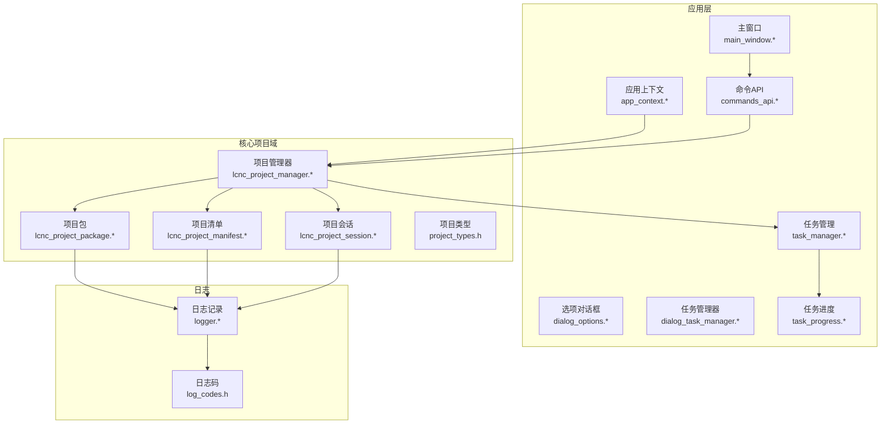
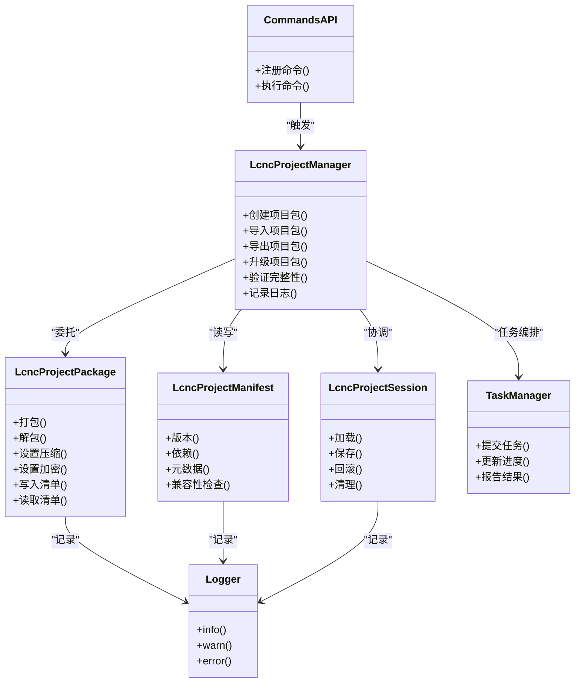
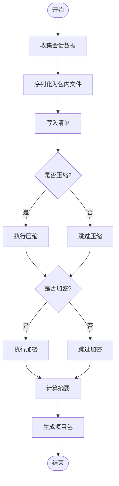
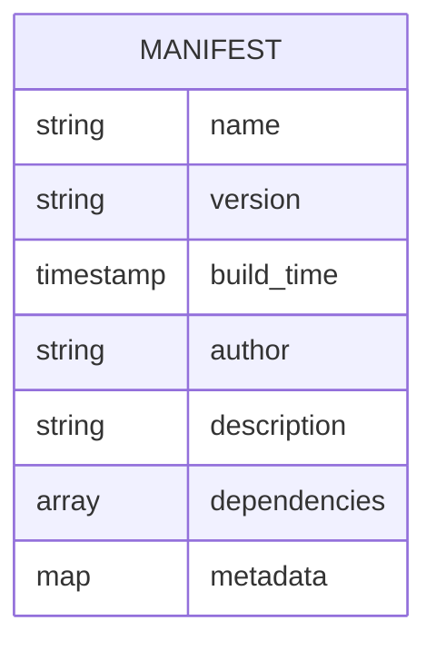
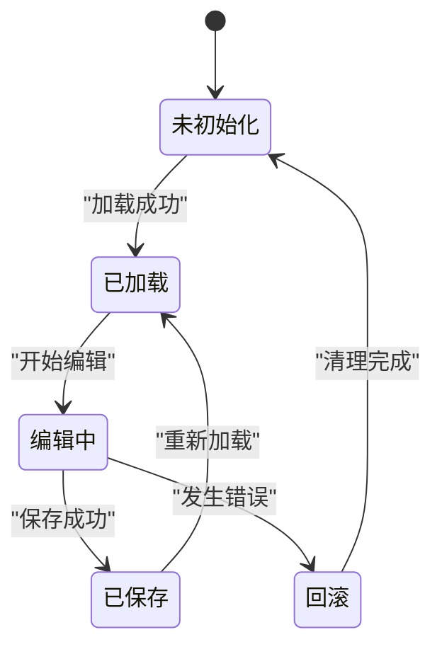
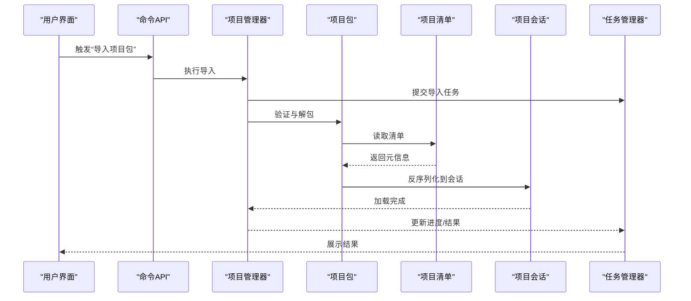
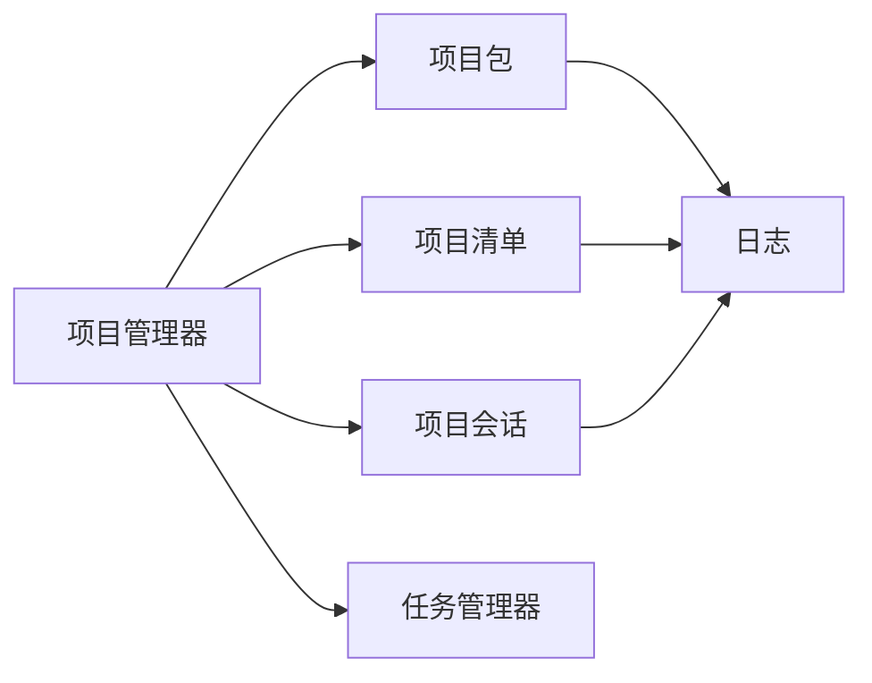

# 项目包

<cite>
**本文引用的文件**
- [lcnc_project_package.h](file://src/core/project/lcnc_project_package.h)
- [lcnc_project_package.cpp](file://src/core/project/lcnc_project_package.cpp)
- [lcnc_project_manifest.h](file://src/core/project/lcnc_project_manifest.h)
- [lcnc_project_manifest.cpp](file://src/core/project/lcnc_project_manifest.cpp)
- [lcnc_project_manager.h](file://src/core/project/lcnc_project_manager.h)
- [lcnc_project_manager.cpp](file://src/core/project/lcnc_project_manager.cpp)
- [lcnc_project_session.h](file://src/core/project/lcnc_project_session.h)
- [lcnc_project_session.cpp](file://src/core/project/lcnc_project_session.cpp)
- [project_types.h](file://src/core/project/project_types.h)
- [app_context.h](file://src/app/app_context.h)
- [app_context.cpp](file://src/app/app_context.cpp)
- [main_window.h](file://src/app/main_window.h)
- [main_window.cpp](file://src/app/main_window.cpp)
- [commands_api.h](file://src/core/command/commands_api.h)
- [commands_api.cpp](file://src/core/command/commands_api.cpp)
- [dialog_options.h](file://src/app/dialog/dialog_options.h)
- [dialog_options.cpp](file://src/app/dialog/dialog_options.cpp)
- [dialog_task_manager.h](file://src/app/dialog/dialog_task_manager.h)
- [dialog_task_manager.cpp](file://src/app/dialog/dialog_task_manager.cpp)
- [task_manager.h](file://src/core/task/task_manager.h)
- [task_manager.cpp](file://src/core/task/task_manager.cpp)
- [task_progress.h](file://src/core/task/task_progress.h)
- [task_progress.cpp](file://src/core/task/task_progress.cpp)
- [logger.h](file://src/core/logging/logger.h)
- [logger.cpp](file://src/core/logging/logger.cpp)
- [log_codes.h](file://src/core/logging/log_codes.h)
</cite>

## 目录
1. [引言](#引言)
2. [项目结构](#项目结构)
3. [核心组件](#核心组件)
4. [架构总览](#架构总览)
5. [详细组件分析](#详细组件分析)
6. [依赖关系分析](#依赖关系分析)
7. [性能考量](#性能考量)
8. [故障排除指南](#故障排除指南)
9. [结论](#结论)
10. [附录](#附录)

## 引言
本文件系统化梳理LaserCNC中“项目包”（LcncProjectPackage）的设计与实现，围绕以下目标展开：项目包的封装机制与打包/解包流程、内部文件布局与命名规则、压缩与加密机制及安全与性能权衡、版本管理与兼容性策略、创建/导入/导出操作流程、完整性校验与修复、以及常见问题排查。文档以代码为依据，结合架构图与流程图，帮助开发者与使用者全面理解项目包系统。

## 项目结构
项目包系统位于核心工程的“project”子域，围绕Manifest（清单）、Package（包）、Session（会话）与Manager（管理器）协同工作，配合应用上下文与命令API完成用户交互与任务调度。

图表来源
- [lcnc_project_manager.h](file://src/core/project/lcnc_project_manager.h)
- [lcnc_project_package.h](file://src/core/project/lcnc_project_package.h)
- [lcnc_project_manifest.h](file://src/core/project/lcnc_project_manifest.h)
- [lcnc_project_session.h](file://src/core/project/lcnc_project_session.h)
- [project_types.h](file://src/core/project/project_types.h)
- [app_context.h](file://src/app/app_context.h)
- [main_window.h](file://src/app/main_window.h)
- [commands_api.h](file://src/core/command/commands_api.h)
- [dialog_options.h](file://src/app/dialog/dialog_options.h)
- [dialog_task_manager.h](file://src/app/dialog/dialog_task_manager.h)
- [task_manager.h](file://src/core/task/task_manager.h)
- [task_progress.h](file://src/core/task/task_progress.h)
- [logger.h](file://src/core/logging/logger.h)
- [log_codes.h](file://src/core/logging/log_codes.h)

章节来源
- [lcnc_project_manager.h](file://src/core/project/lcnc_project_manager.h)
- [lcnc_project_package.h](file://src/core/project/lcnc_project_package.h)
- [lcnc_project_manifest.h](file://src/core/project/lcnc_project_manifest.h)
- [lcnc_project_session.h](file://src/core/project/lcnc_project_session.h)
- [project_types.h](file://src/core/project/project_types.h)
- [app_context.h](file://src/app/app_context.h)
- [main_window.h](file://src/app/main_window.h)
- [commands_api.h](file://src/core/command/commands_api.h)
- [dialog_options.h](file://src/app/dialog/dialog_options.h)
- [dialog_task_manager.h](file://src/app/dialog/dialog_task_manager.h)
- [task_manager.h](file://src/core/task/task_manager.h)
- [task_progress.h](file://src/core/task/task_progress.h)
- [logger.h](file://src/core/logging/logger.h)
- [log_codes.h](file://src/core/logging/log_codes.h)

## 核心组件
- 项目包（LcncProjectPackage）
  - 负责项目数据的打包与解包，定义包内文件布局、压缩与可选加密策略、版本与元数据管理。
- 项目清单（LcncProjectManifest）
  - 描述项目包的元信息（名称、版本、依赖、时间戳等），用于版本控制与兼容性判断。
- 项目会话（LcncProjectSession）
  - 管理当前打开项目的内存状态与运行时上下文，协调加载/保存过程。
- 项目管理器（LcncProjectManager）
  - 协调创建、导入、导出、版本升级等流程；与任务系统集成，提供进度反馈与错误日志。
- 应用上下文与命令API
  - 提供UI入口与命令注册，驱动项目包操作的用户交互。
- 日志系统
  - 记录包操作的关键事件与错误，便于诊断与审计。

章节来源
- [lcnc_project_package.h](file://src/core/project/lcnc_project_package.h)
- [lcnc_project_package.cpp](file://src/core/project/lcnc_project_package.cpp)
- [lcnc_project_manifest.h](file://src/core/project/lcnc_project_manifest.h)
- [lcnc_project_manifest.cpp](file://src/core/project/lcnc_project_manifest.cpp)
- [lcnc_project_session.h](file://src/core/project/lcnc_project_session.h)
- [lcnc_project_session.cpp](file://src/core/project/lcnc_project_session.cpp)
- [lcnc_project_manager.h](file://src/core/project/lcnc_project_manager.h)
- [lcnc_project_manager.cpp](file://src/core/project/lcnc_project_manager.cpp)
- [project_types.h](file://src/core/project/project_types.h)
- [commands_api.h](file://src/core/command/commands_api.h)
- [commands_api.cpp](file://src/core/command/commands_api.cpp)
- [logger.h](file://src/core/logging/logger.h)
- [logger.cpp](file://src/core/logging/logger.cpp)
- [log_codes.h](file://src/core/logging/log_codes.h)

## 架构总览
项目包系统采用分层设计：上层通过命令API触发操作，管理器协调流程，包与清单负责数据封装与版本元信息，会话承载运行时状态，日志贯穿始终提供可观测性。

图表来源
- [lcnc_project_manager.h](file://src/core/project/lcnc_project_manager.h)
- [lcnc_project_package.h](file://src/core/project/lcnc_project_package.h)
- [lcnc_project_manifest.h](file://src/core/project/lcnc_project_manifest.h)
- [lcnc_project_session.h](file://src/core/project/lcnc_project_session.h)
- [commands_api.h](file://src/core/command/commands_api.h)
- [task_manager.h](file://src/core/task/task_manager.h)
- [logger.h](file://src/core/logging/logger.h)

## 详细组件分析

### 项目包（LcncProjectPackage）
- 封装机制
  - 定义包内文件布局：根目录下包含清单文件与业务数据目录；支持多级子目录以组织几何、工艺、配置等数据。
  - 命名规则：清单文件固定名称，业务数据按类型分组命名，避免冲突并提升可读性。
- 打包流程
  - 收集会话状态与数据对象，序列化为包内文件；写入清单元数据；可选压缩与加密；生成摘要。
- 解包流程
  - 校验摘要与版本；解析清单；反序列化数据到会话；建立索引与引用关系。
- 压缩与加密
  - 压缩：默认启用，支持可配置压缩级别；对大体量几何/工具路径数据显著降低体积。
  - 加密：可选启用，使用对称加密保护敏感数据；需妥善管理密钥与密文存储。
- 版本与兼容性
  - 清单包含版本号与兼容范围；升级策略基于向后兼容原则，不破坏旧版本包的可读性。
- 完整性校验
  - 使用哈希摘要（如SHA-256）与签名验证；失败时拒绝解包并记录错误码。

图表来源
- [lcnc_project_package.cpp](file://src/core/project/lcnc_project_package.cpp)
- [lcnc_project_manifest.cpp](file://src/core/project/lcnc_project_manifest.cpp)

章节来源
- [lcnc_project_package.h](file://src/core/project/lcnc_project_package.h)
- [lcnc_project_package.cpp](file://src/core/project/lcnc_project_package.cpp)

### 项目清单（LcncProjectManifest）
- 元信息字段
  - 名称、版本、构建时间、作者、描述、依赖列表、平台/硬件要求等。
- 版本与兼容性
  - 版本号遵循语义化版本；兼容性声明确保新版本能正确读取旧包。
- 依赖解析
  - 依赖项用于加载外部资源或插件；缺失依赖时给出明确提示。
- 写入与读取
  - 采用结构化格式（如TOML/JSON）保证跨语言与跨平台一致性。

图表来源
- [lcnc_project_manifest.h](file://src/core/project/lcnc_project_manifest.h)
- [lcnc_project_manifest.cpp](file://src/core/project/lcnc_project_manifest.cpp)

章节来源
- [lcnc_project_manifest.h](file://src/core/project/lcnc_project_manifest.h)
- [lcnc_project_manifest.cpp](file://src/core/project/lcnc_project_manifest.cpp)

### 项目会话（LcncProjectSession）
- 职责
  - 维护当前项目在内存中的状态；协调加载/保存过程；提供回滚能力。
- 生命周期
  - 创建 -> 加载 -> 编辑 -> 保存 -> 关闭；异常时进行清理与回滚。
- 数据一致性
  - 通过事务式保存与增量更新减少数据损坏风险。

图表来源
- [lcnc_project_session.h](file://src/core/project/lcnc_project_session.h)
- [lcnc_project_session.cpp](file://src/core/project/lcnc_project_session.cpp)

章节来源
- [lcnc_project_session.h](file://src/core/project/lcnc_project_session.h)
- [lcnc_project_session.cpp](file://src/core/project/lcnc_project_session.cpp)

### 项目管理器（LcncProjectManager）
- 职责
  - 统一编排创建、导入、导出、升级与校验流程；与任务系统协作提供进度反馈。
- 关键流程
  - 创建：生成空包与默认清单；持久化。
  - 导入：校验包完整性；解析清单；加载会话；显示进度。
  - 导出：序列化当前会话；打包；输出文件。
  - 升级：比较版本；迁移数据；更新清单；回退策略。
- 错误处理
  - 捕获IO、压缩、加密、校验异常；记录日志码；向UI反馈。

图表来源
- [commands_api.cpp](file://src/core/command/commands_api.cpp)
- [lcnc_project_manager.cpp](file://src/core/project/lcnc_project_manager.cpp)
- [lcnc_project_package.cpp](file://src/core/project/lcnc_project_package.cpp)
- [lcnc_project_manifest.cpp](file://src/core/project/lcnc_project_manifest.cpp)
- [lcnc_project_session.cpp](file://src/core/project/lcnc_project_session.cpp)
- [task_manager.cpp](file://src/core/task/task_manager.cpp)

章节来源
- [lcnc_project_manager.h](file://src/core/project/lcnc_project_manager.h)
- [lcnc_project_manager.cpp](file://src/core/project/lcnc_project_manager.cpp)
- [commands_api.h](file://src/core/command/commands_api.h)
- [commands_api.cpp](file://src/core/command/commands_api.cpp)
- [task_manager.h](file://src/core/task/task_manager.h)
- [task_manager.cpp](file://src/core/task/task_manager.cpp)

### 应用上下文与命令API
- 应用上下文
  - 提供全局服务访问点（如配置、日志、任务管理）；维护当前项目句柄。
- 命令API
  - 注册与执行项目包相关命令；桥接UI与核心逻辑；统一错误传播。

章节来源
- [app_context.h](file://src/app/app_context.h)
- [app_context.cpp](file://src/app/app_context.cpp)
- [commands_api.h](file://src/core/command/commands_api.h)
- [commands_api.cpp](file://src/core/command/commands_api.cpp)

## 依赖关系分析
- 组件耦合
  - 项目管理器是中枢，依赖包、清单、会话与任务系统；包与清单相互协作；会话为两者提供数据载体。
- 外部依赖
  - 压缩库（如zlib）、加密库（如OpenSSL）用于压缩与加密；日志库用于统一记录。
- 潜在环路
  - 当前设计通过接口与抽象避免循环依赖；若引入具体实现细节需谨慎。

图表来源
- [lcnc_project_manager.h](file://src/core/project/lcnc_project_manager.h)
- [lcnc_project_package.h](file://src/core/project/lcnc_project_package.h)
- [lcnc_project_manifest.h](file://src/core/project/lcnc_project_manifest.h)
- [lcnc_project_session.h](file://src/core/project/lcnc_project_session.h)
- [task_manager.h](file://src/core/task/task_manager.h)
- [logger.h](file://src/core/logging/logger.h)

章节来源
- [lcnc_project_manager.h](file://src/core/project/lcnc_project_manager.h)
- [lcnc_project_package.h](file://src/core/project/lcnc_project_package.h)
- [lcnc_project_manifest.h](file://src/core/project/lcnc_project_manifest.h)
- [lcnc_project_session.h](file://src/core/project/lcnc_project_session.h)
- [task_manager.h](file://src/core/task/task_manager.h)
- [logger.h](file://src/core/logging/logger.h)

## 性能考量
- 压缩策略
  - 对几何与工具路径等二进制大对象启用压缩；可配置压缩级别以平衡CPU与存储开销。
- 并行化
  - 解包/打包阶段可并行处理多个文件；注意I/O瓶颈与磁盘空间。
- 内存占用
  - 会话状态尽量延迟加载；对大型对象采用流式读取与分页缓存。
- I/O优化
  - 使用异步写入与预分配；避免频繁小块写入。
- 加密成本
  - 对热点数据可选择性加密；加密与解密应异步化，避免阻塞主线程。

## 故障排除指南
- 常见问题与定位
  - 包损坏：校验失败时检查压缩/加密参数与文件完整性；查看日志码定位阶段。
  - 版本不兼容：升级失败时确认清单版本与兼容范围；必要时回滚。
  - 密钥错误：加密包无法解包时检查密钥来源与存储位置。
  - 空间不足：导出失败时清理临时空间或调整输出路径。
- 修复步骤
  - 备份当前项目包；
  - 使用校验工具重算摘要并与清单对比；
  - 如为压缩问题，尝试禁用压缩重新打包；
  - 如为加密问题，更换密钥或使用解密工具；
  - 若版本升级失败，按清单回退到兼容版本再逐步升级。
- 日志与诊断
  - 启用详细日志；关注错误码与堆栈；结合任务进度定位失败节点。

章节来源
- [logger.h](file://src/core/logging/logger.h)
- [logger.cpp](file://src/core/logging/logger.cpp)
- [log_codes.h](file://src/core/logging/log_codes.h)
- [lcnc_project_package.cpp](file://src/core/project/lcnc_project_package.cpp)
- [lcnc_project_manifest.cpp](file://src/core/project/lcnc_project_manifest.cpp)
- [lcnc_project_manager.cpp](file://src/core/project/lcnc_project_manager.cpp)

## 结论
项目包系统通过“包+清单+会话+管理器”的分层设计，实现了可扩展、可校验、可升级的项目封装方案。在保证安全性与性能的同时，提供了清晰的版本兼容策略与完善的故障恢复机制。建议在实际部署中结合业务场景配置压缩与加密参数，并完善自动化测试与监控体系。

## 附录
- 操作流程速查
  - 创建：通过命令API触发创建流程，生成默认清单与空包体。
  - 导入：选择包文件，校验完整性，解析清单，加载会话，展示进度。
  - 导出：序列化当前会话，打包为包文件，输出至目标路径。
  - 升级：比较版本，迁移数据，更新清单，提供回退策略。
- 最佳实践
  - 为每个包保留备份；定期校验完整性；对敏感数据启用加密；合理设置压缩级别；在CI中加入自动化校验。