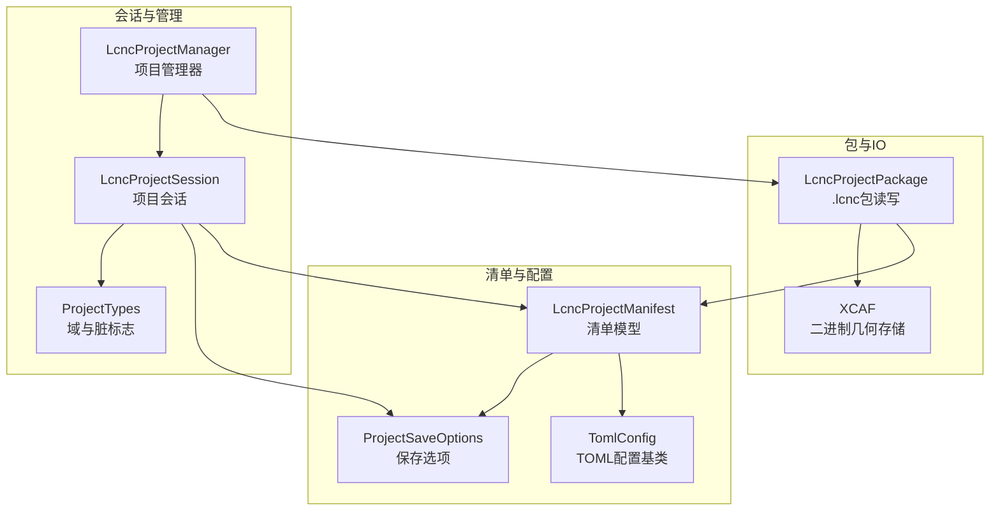
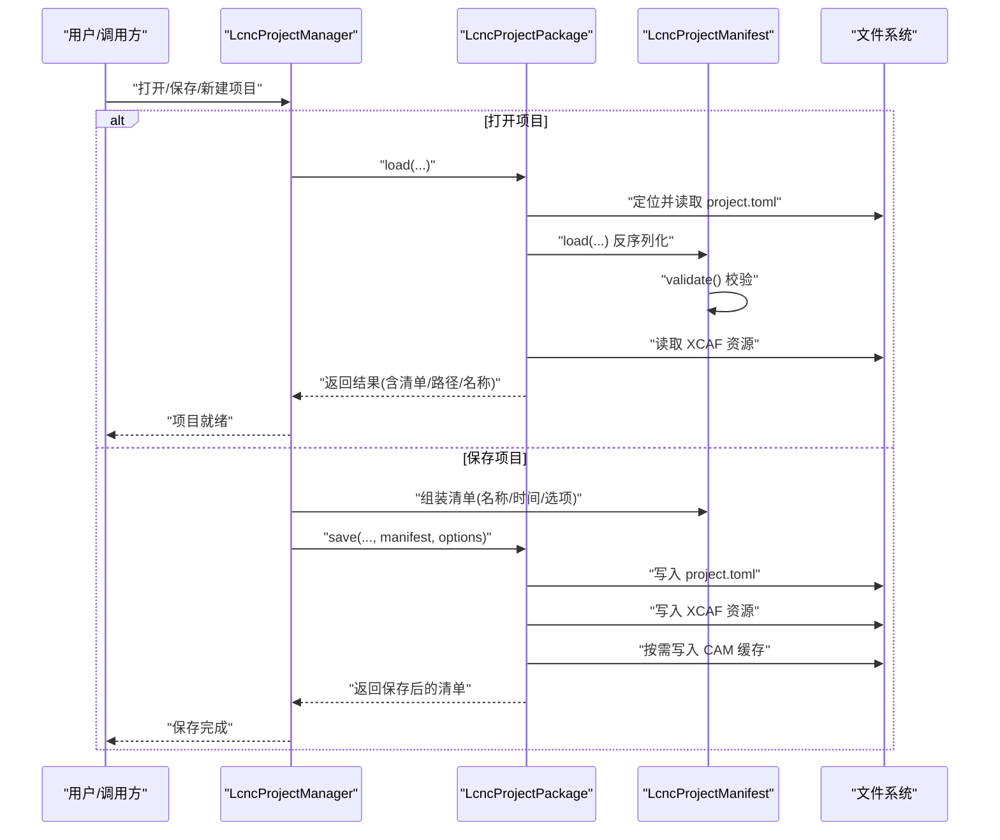
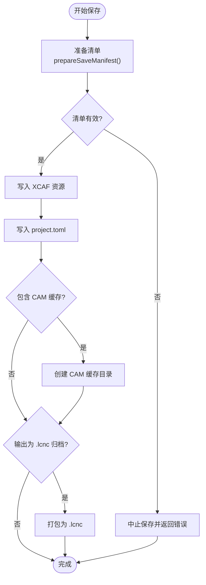
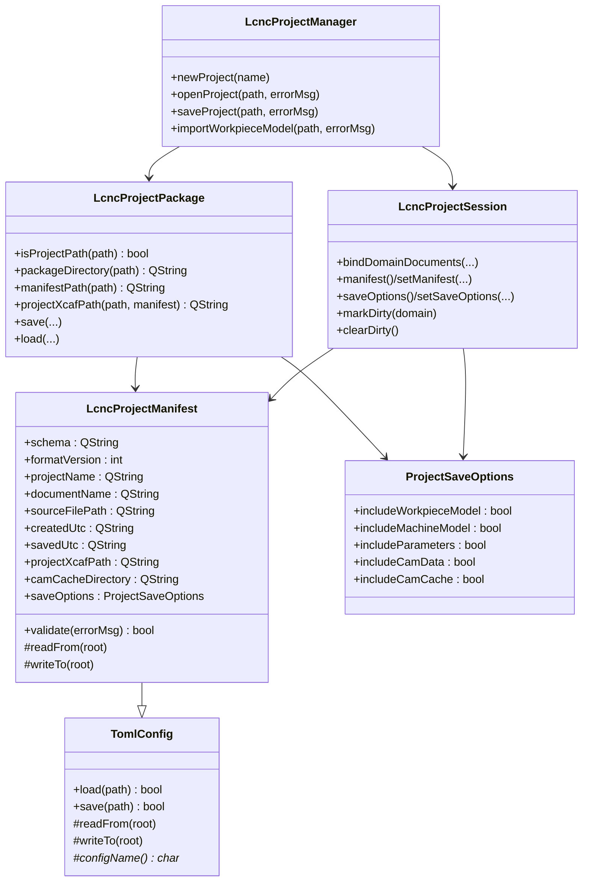

# 项目清单

<cite>
**本文引用的文件**
- [lcnc_project_manifest.h](file://src/core/project/lcnc_project_manifest.h)
- [lcnc_project_manifest.cpp](file://src/core/project/lcnc_project_manifest.cpp)
- [toml_config.h](file://src/core/settings/toml_config.h)
- [toml_config.cpp](file://src/core/settings/toml_config.cpp)
- [lcnc_project_package.h](file://src/core/project/lcnc_project_package.h)
- [lcnc_project_package.cpp](file://src/core/project/lcnc_project_package.cpp)
- [lcnc_project_manager.h](file://src/core/project/lcnc_project_manager.h)
- [lcnc_project_manager.cpp](file://src/core/project/lcnc_project_manager.cpp)
- [lcnc_project_session.h](file://src/core/project/lcnc_project_session.h)
- [lcnc_project_session.cpp](file://src/core/project/lcnc_project_session.cpp)
- [project_save_options.h](file://src/core/project/project_save_options.h)
- [project_types.h](file://src/core/project/project_types.h)
- [LaserCNC.toml](file://build/Debug/config/LaserCNC.toml)
- [cam.toml](file://build/Debug/config/cam.toml)
</cite>

## 目录
1. [简介](#简介)
2. [项目结构](#项目结构)
3. [核心组件](#核心组件)
4. [架构总览](#架构总览)
5. [组件详解](#组件详解)
6. [依赖关系分析](#依赖关系分析)
7. [性能考量](#性能考量)
8. [故障排查指南](#故障排查指南)
9. [结论](#结论)
10. [附录](#附录)

## 简介
本文件系统化阐述 LcncProjectManifest 项目清单（Manifest）系统的设计与实现，涵盖清单文件的结构、字段定义、读取/解析/验证机制、与项目元数据的关系、生成与更新流程、兼容性与错误处理策略，以及安全与完整性保障。目标是帮助开发者快速理解并正确使用 .lcnc 项目的清单文件。

## 项目结构
围绕项目清单的关键文件组织如下：
- 清单模型：LcncProjectManifest 继承自 TomlConfig，负责清单的序列化/反序列化与校验
- 配置基类：TomlConfig 提供通用的 TOML 文件加载/保存能力
- 包读写：LcncProjectPackage 负责 .lcnc 包的打包/解包、清单与资源文件的落盘/读取
- 会话与生命周期：LcncProjectSession 持有项目级元数据；LcncProjectManager 协调打开/保存/导入等操作
- 保存选项：ProjectSaveOptions 控制导出哪些数据段
- 类型定义：ProjectDomain、ProjectDirtyFlag 等用于标识项目域与脏标记

图表来源
- [lcnc_project_manifest.h:13-36](file://src/core/project/lcnc_project_manifest.h#L13-L36)
- [toml_config.h:23-52](file://src/core/settings/toml_config.h#L23-L52)
- [lcnc_project_package.h:24-70](file://src/core/project/lcnc_project_package.h#L24-L70)
- [lcnc_project_session.h:47-101](file://src/core/project/lcnc_project_session.h#L47-L101)
- [lcnc_project_manager.h:19-71](file://src/core/project/lcnc_project_manager.h#L19-L71)
- [project_save_options.h:8-14](file://src/core/project/project_save_options.h#L8-L14)
- [project_types.h:15-31](file://src/core/project/project_types.h#L15-L31)

章节来源
- [lcnc_project_manifest.h:1-38](file://src/core/project/lcnc_project_manifest.h#L1-L38)
- [toml_config.h:1-95](file://src/core/settings/toml_config.h#L1-L95)
- [lcnc_project_package.h:1-72](file://src/core/project/lcnc_project_package.h#L1-L72)
- [lcnc_project_session.h:1-106](file://src/core/project/lcnc_project_session.h#L1-L106)
- [lcnc_project_manager.h:1-74](file://src/core/project/lcnc_project_manager.h#L1-L74)
- [project_save_options.h:1-16](file://src/core/project/project_save_options.h#L1-L16)
- [project_types.h:1-39](file://src/core/project/project_types.h#L1-L39)

## 核心组件
- LcncProjectManifest：定义清单字段、默认值、校验规则，并通过 TomlConfig 完成 TOML 的读写映射
- TomlConfig：提供 load/save 基础能力，统一异常与日志处理
- LcncProjectPackage：封装 .lcnc 包的打包/解包、清单路径推导、XCAF 资源落盘/读取
- LcncProjectSession：持有项目名、路径、清单、保存选项与各域状态，维护脏标记
- LcncProjectManager：对外提供新建/打开/保存/导入等入口，协调清单与包IO
- ProjectSaveOptions：控制工作件、机台、参数、CAM数据与缓存的包含策略

章节来源
- [lcnc_project_manifest.cpp:5-79](file://src/core/project/lcnc_project_manifest.cpp#L5-L79)
- [toml_config.cpp:15-77](file://src/core/settings/toml_config.cpp#L15-L77)
- [lcnc_project_package.cpp:339-558](file://src/core/project/lcnc_project_package.cpp#L339-L558)
- [lcnc_project_session.cpp:21-83](file://src/core/project/lcnc_project_session.cpp#L21-L83)
- [lcnc_project_manager.cpp:74-147](file://src/core/project/lcnc_project_manager.cpp#L74-L147)
- [project_save_options.h:8-14](file://src/core/project/project_save_options.h#L8-L14)

## 架构总览
清单系统贯穿“读取—校验—落盘—打包”的完整链路，确保项目在不同形态（目录/归档）下的一致性与可恢复性。

图表来源
- [lcnc_project_manager.cpp:74-147](file://src/core/project/lcnc_project_manager.cpp#L74-L147)
- [lcnc_project_package.cpp:485-558](file://src/core/project/lcnc_project_package.cpp#L485-L558)
- [lcnc_project_manifest.cpp:5-23](file://src/core/project/lcnc_project_manifest.cpp#L5-L23)

## 组件详解

### 清单模型与字段定义
- 字段概览
  - schema：固定为 "lcnc.project"
  - formatVersion：格式版本号，当前为 1
  - projectName：项目显示名
  - documentName：文档显示名，默认与项目名一致
  - sourceFilePath：工作件源文件路径
  - createdUtc/savedUtc：UTC 时间戳
  - resources.projectXcafPath：XCAF 几何资源相对路径，默认 "project.xbf"
  - resources.camCacheDirectory：CAM 缓存目录，默认 "cam/cache"
  - saveOptions：包含工作件模型、机台模型、参数、CAM数据、CAM缓存的布尔开关

- 默认值与兼容性
  - 若 manifest 中字段缺失或无效，保存前会由 LcncProjectPackage::prepareSaveManifest 进行补齐与规范化
  - formatVersion 必须为正且不超过当前版本，否则拒绝保存

- 读取/写入映射
  - readFrom/writeTo 将内存字段映射到 TOML 表结构，嵌套在 resources/saveOptions 下

- 校验规则
  - schema 必须匹配
  - formatVersion 必须有效
  - projectXcafPath 不可为空

章节来源
- [lcnc_project_manifest.h:18-27](file://src/core/project/lcnc_project_manifest.h#L18-L27)
- [lcnc_project_manifest.cpp:5-23](file://src/core/project/lcnc_project_manifest.cpp#L5-L23)
- [lcnc_project_manifest.cpp:25-51](file://src/core/project/lcnc_project_manifest.cpp#L25-L51)
- [lcnc_project_manifest.cpp:53-77](file://src/core/project/lcnc_project_manifest.cpp#L53-L77)
- [project_save_options.h:8-14](file://src/core/project/project_save_options.h#L8-L14)

### TOML 配置基类（TomlConfig）
- 能力
  - load：若文件不存在则使用默认值；解析异常时记录错误日志并返回失败
  - save：自动创建父目录，序列化后写入磁盘
- 辅助读取函数（容忍缺失/类型不匹配，返回默认值）
  - get_bool/get_int/get_double/get_qstring

章节来源
- [toml_config.h:23-52](file://src/core/settings/toml_config.h#L23-L52)
- [toml_config.h:59-93](file://src/core/settings/toml_config.h#L59-L93)
- [toml_config.cpp:15-77](file://src/core/settings/toml_config.cpp#L15-L77)

### 包读写（LcncProjectPackage）
- 关键职责
  - 判定路径是否为项目路径（.lcnc 归档、目录或 project.toml）
  - 推导清单与资源文件路径
  - 保存：生成清单、写入 XCAF 资源、按需写入 CAM 缓存，必要时打包为 .lcnc
  - 加载：读取清单并校验，读取 XCAF 资源，填充结果结构体
- 保存流程要点
  - 使用 prepareSaveManifest 对清单进行补齐与规范化
  - 根据 saveOptions 决定是否写入机台/CAM数据与缓存
  - 以 ISO-8601 毫秒精度写入 createdUtc/savedUtc
- 加载流程要点
  - 先解包到临时目录再读取
  - 严格校验清单有效性
  - 校验 XCAF 资源存在性

图表来源
- [lcnc_project_package.cpp:178-207](file://src/core/project/lcnc_project_package.cpp#L178-L207)
- [lcnc_project_package.cpp:393-475](file://src/core/project/lcnc_project_package.cpp#L393-L475)

章节来源
- [lcnc_project_package.h:24-70](file://src/core/project/lcnc_project_package.h#L24-L70)
- [lcnc_project_package.cpp:341-371](file://src/core/project/lcnc_project_package.cpp#L341-L371)
- [lcnc_project_package.cpp:393-475](file://src/core/project/lcnc_project_package.cpp#L393-L475)
- [lcnc_project_package.cpp:485-558](file://src/core/project/lcnc_project_package.cpp#L485-L558)

### 会话与管理（LcncProjectSession / LcncProjectManager）
- LcncProjectSession
  - 绑定三个域文档指针，持有项目名/路径、清单、保存选项与各域状态
  - 提供脏标记（ProjectDirtyFlags），区分 Project/Workpiece/Machine/Cam
- LcncProjectManager
  - 新建/打开/保存/导入/导出等入口
  - 在保存时从会话收集清单与选项，调用 LcncProjectPackage::save
  - 在打开时从包读取清单并同步到会话

章节来源
- [lcnc_project_session.h:47-101](file://src/core/project/lcnc_project_session.h#L47-L101)
- [lcnc_project_session.cpp:21-83](file://src/core/project/lcnc_project_session.cpp#L21-L83)
- [lcnc_project_manager.h:19-71](file://src/core/project/lcnc_project_manager.h#L19-L71)
- [lcnc_project_manager.cpp:74-147](file://src/core/project/lcnc_project_manager.cpp#L74-L147)

### 字段与类型定义
- ProjectDomain：Project/Workpiece/Machine/Cam
- ProjectDirtyFlag：脏标记位集合
- ProjectSaveOptions：控制导出的数据段

章节来源
- [project_types.h:15-31](file://src/core/project/project_types.h#L15-L31)
- [project_save_options.h:8-14](file://src/core/project/project_save_options.h#L8-L14)

## 依赖关系分析
- 继承与组合
  - LcncProjectManifest 继承 TomlConfig，复用 TOML IO 能力
  - LcncProjectPackage 依赖 LcncProjectManifest 与 ProjectSaveOptions
  - LcncProjectManager 依赖 LcncProjectPackage 与 LcncProjectSession
  - LcncProjectSession 依赖 LcncProjectManifest、ProjectSaveOptions 与 ProjectTypes
- 外部依赖
  - toml11：TOML 解析/序列化
  - OpenCASCADE XCAF：二进制几何存储与读写
  - 平台脚本：Windows 上使用 PowerShell 进行 zip 打包/解包

图表来源
- [toml_config.h:23-52](file://src/core/settings/toml_config.h#L23-L52)
- [lcnc_project_manifest.h:13-36](file://src/core/project/lcnc_project_manifest.h#L13-L36)
- [lcnc_project_package.h:24-70](file://src/core/project/lcnc_project_package.h#L24-L70)
- [lcnc_project_session.h:47-101](file://src/core/project/lcnc_project_session.h#L47-L101)
- [lcnc_project_manager.h:19-71](file://src/core/project/lcnc_project_manager.h#L19-L71)
- [project_save_options.h:8-14](file://src/core/project/project_save_options.h#L8-L14)

## 性能考量
- 保存阶段
  - XCAF 写入为二进制，体积通常较大；可通过 ProjectSaveOptions 控制包含范围
  - CAM 缓存目录仅在 includeCamCache=true 时创建，避免不必要的磁盘占用
- 打包/解包
  - Windows 使用 PowerShell 压缩/解压，I/O 开销主要受磁盘吞吐影响
- 序列化/反序列化
  - TomlConfig 采用一次性解析/格式化，建议避免频繁小粒度写入

## 故障排查指南
- 常见错误与定位
  - 清单解析失败：检查 project.toml 是否为合法 TOML；查看日志中的解析错误
  - 清单无效：schema 或 formatVersion 不匹配；projectXcafPath 为空
  - XCAF 资源缺失：确认 projectXcafPath 指向的资源文件是否存在
  - 保存失败：检查磁盘权限、目标路径可写性、缓存目录创建权限
  - 平台不支持：当前平台未集成 .lcnc zip 后端（非 Windows）
- 日志与返回值
  - TomlConfig/TomlConfig::load/save 在异常时记录错误日志并返回 false
  - LcncProjectPackage 在关键步骤失败时返回 false 并提供错误信息

章节来源
- [toml_config.cpp:35-45](file://src/core/settings/toml_config.cpp#L35-L45)
- [lcnc_project_manifest.cpp:5-23](file://src/core/project/lcnc_project_manifest.cpp#L5-L23)
- [lcnc_project_package.cpp:95-145](file://src/core/project/lcnc_project_package.cpp#L95-L145)
- [lcnc_project_package.cpp:147-176](file://src/core/project/lcnc_project_package.cpp#L147-L176)
- [lcnc_project_package.cpp:509-558](file://src/core/project/lcnc_project_package.cpp#L509-L558)

## 结论
LcncProjectManifest 通过标准化的 TOML 清单与严格的校验机制，结合 LcncProjectPackage 的包读写能力，实现了 .lcnc 项目的可移植、可恢复与可扩展。借助 LcncProjectSession 与 LcncProjectManager，项目生命周期内的元数据与资源得到一致管理。遵循本文的字段规范、校验规则与最佳实践，可显著降低集成与维护成本。

## 附录

### 清单字段与默认值一览
- schema：固定值 "lcnc.project"
- formatVersion：当前版本 1
- projectName：空字符串（保存前补齐）
- documentName：默认等于 projectName
- sourceFilePath：空字符串
- createdUtc/savedUtc：ISO-8601 毫秒精度时间戳
- resources.projectXcafPath：默认 "project.xbf"
- resources.camCacheDirectory：默认 "cam/cache"
- saveOptions：包含工作件模型/参数/CAM数据为 true，机台模型/CAM缓存默认 false

章节来源
- [lcnc_project_manifest.h:18-27](file://src/core/project/lcnc_project_manifest.h#L18-L27)
- [lcnc_project_manifest.cpp:25-51](file://src/core/project/lcnc_project_manifest.cpp#L25-L51)
- [lcnc_project_manifest.cpp:53-77](file://src/core/project/lcnc_project_manifest.cpp#L53-L77)
- [project_save_options.h:8-14](file://src/core/project/project_save_options.h#L8-L14)

### 生成与更新策略
- 自动生成
  - 保存时由 prepareSaveManifest 自动补齐 schema/formatVersion/projectName/documentName/paths/time
- 手动编辑
  - 可直接修改 project.toml；但需满足 schema 与 formatVersion 规范，且保证 XCAF 资源路径存在
- 版本兼容
  - formatVersion 必须为正且不超过当前版本；否则拒绝保存

章节来源
- [lcnc_project_package.cpp:178-207](file://src/core/project/lcnc_project_package.cpp#L178-L207)
- [lcnc_project_manifest.cpp:5-23](file://src/core/project/lcnc_project_manifest.cpp#L5-L23)

### 安全与完整性检查
- 校验清单有效性：schema、formatVersion、资源路径
- 校验资源存在性：XCAF 资源必须存在
- 平台限制：.lcnc 归档依赖平台脚本后端（当前为 Windows）
- 日志审计：所有失败路径均记录详细错误信息，便于追踪

章节来源
- [lcnc_project_manifest.cpp:5-23](file://src/core/project/lcnc_project_manifest.cpp#L5-L23)
- [lcnc_project_package.cpp:527-542](file://src/core/project/lcnc_project_package.cpp#L527-L542)
- [lcnc_project_package.cpp:49-93](file://src/core/project/lcnc_project_package.cpp#L49-L93)

### 模板与示例
- 示例清单（基于现有配置文件风格）
  - 清单文件名：project.toml
  - 基本结构（示意）
    - schema = "lcnc.project"
    - formatVersion = 1
    - projectName = "你的项目名"
    - documentName = "你的文档名"
    - sourceFilePath = "工作件源文件路径"
    - createdUtc = "2025-01-01T00:00:00.000Z"
    - savedUtc = "2025-01-01T00:00:00.000Z"
    - [resources]
      - projectXcaf = "project.xbf"
      - camCacheDirectory = "cam/cache"
    - [saveOptions]
      - workpieceModel = true
      - machineModel = false
      - parameters = true
      - camData = true
      - camCache = false
  - 说明
    - 以上为结构示意，具体字段请参考“清单字段与默认值一览”
    - 保存时会自动补齐缺失字段并写入 createdUtc/savedUtc

章节来源
- [lcnc_project_manifest.cpp:53-77](file://src/core/project/lcnc_project_manifest.cpp#L53-L77)
- [LaserCNC.toml:1-97](file://build/Debug/config/LaserCNC.toml#L1-L97)
- [cam.toml:1-47](file://build/Debug/config/cam.toml#L1-L47)