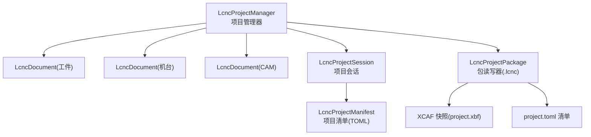
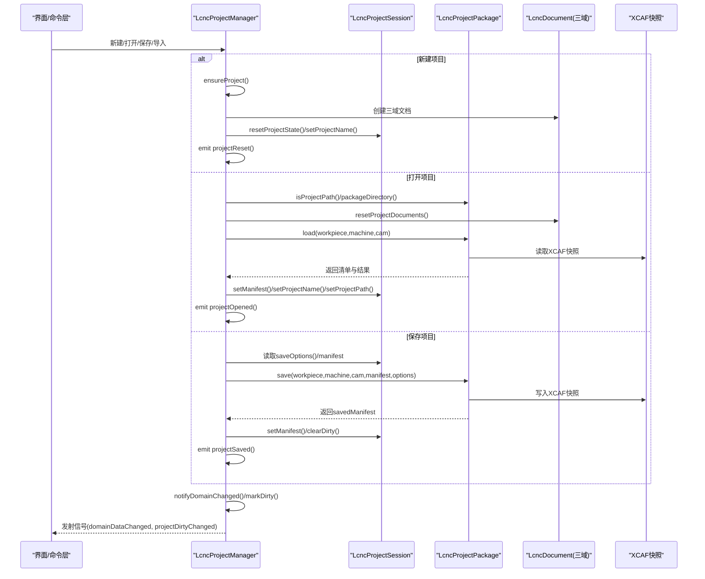
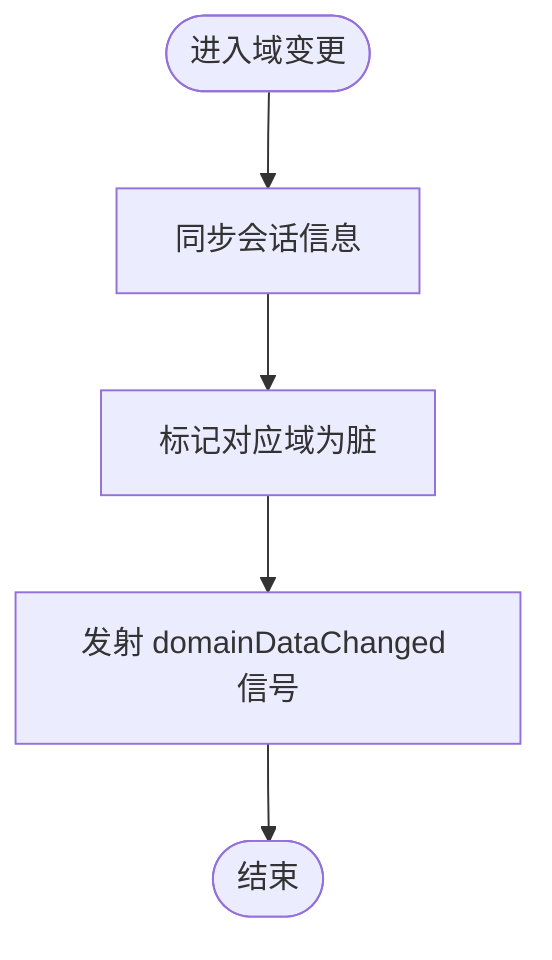
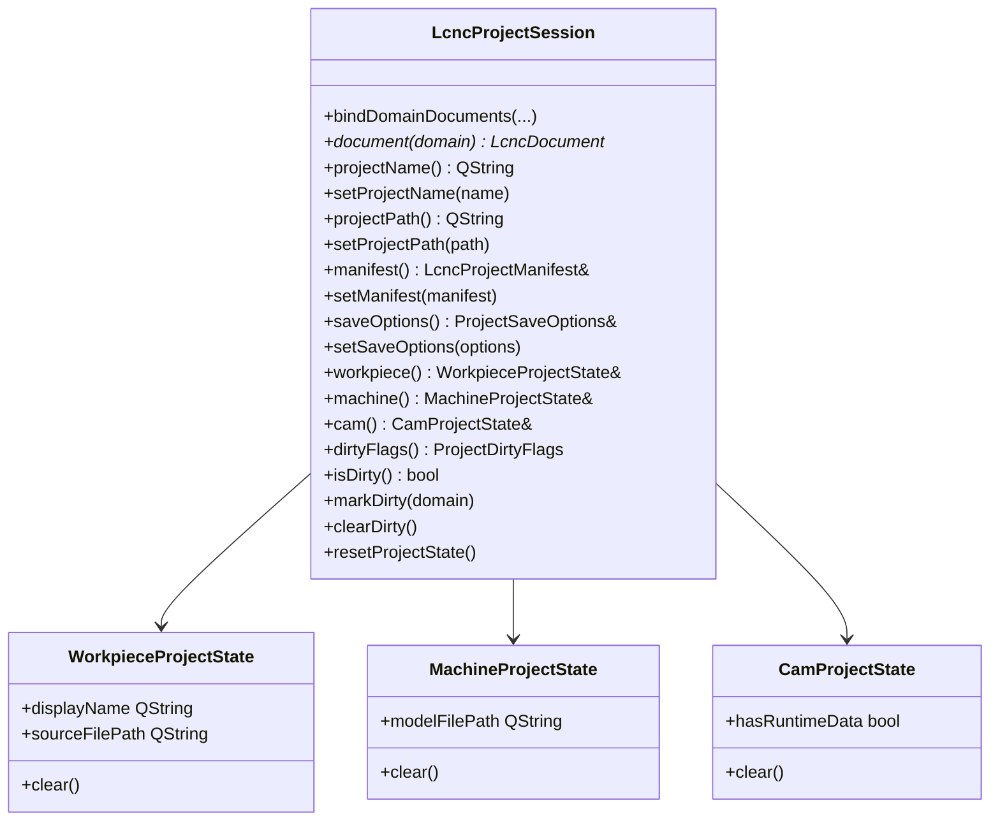
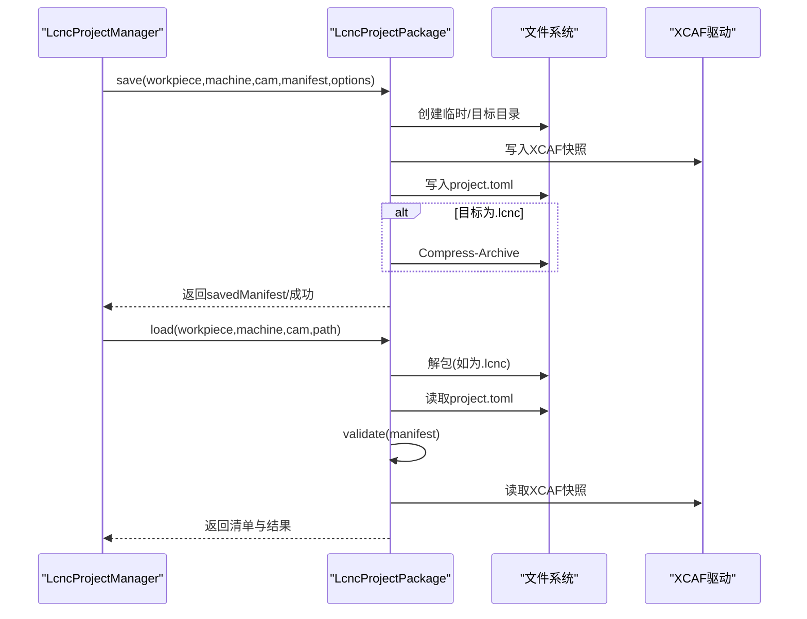
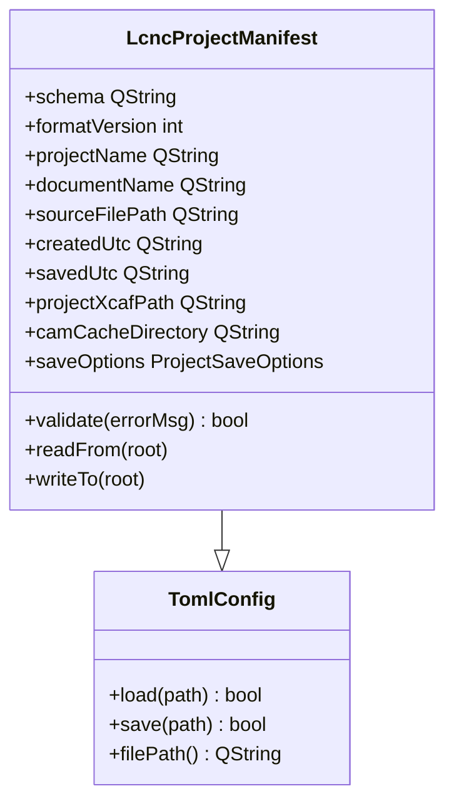
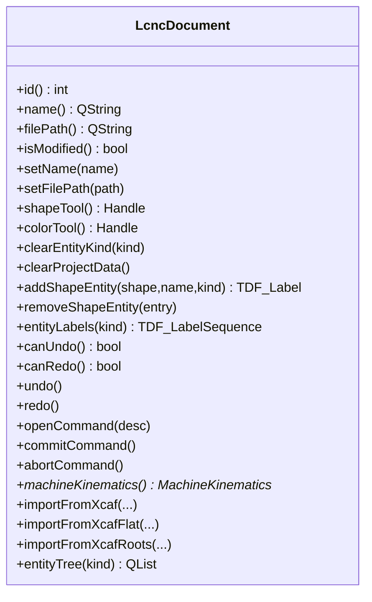
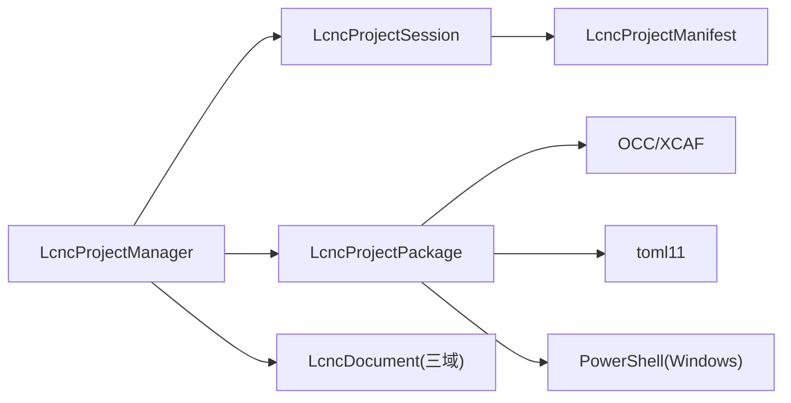

# 项目管理

<cite>
**本文引用的文件**
- [lcnc_project_manager.h](file://src/core/project/lcnc_project_manager.h)
- [lcnc_project_manager.cpp](file://src/core/project/lcnc_project_manager.cpp)
- [lcnc_project_session.h](file://src/core/project/lcnc_project_session.h)
- [lcnc_project_session.cpp](file://src/core/project/lcnc_project_session.cpp)
- [lcnc_project_manifest.h](file://src/core/project/lcnc_project_manifest.h)
- [lcnc_project_manifest.cpp](file://src/core/project/lcnc_project_manifest.cpp)
- [lcnc_project_package.h](file://src/core/project/lcnc_project_package.h)
- [lcnc_project_package.cpp](file://src/core/project/lcnc_project_package.cpp)
- [project_types.h](file://src/core/project/project_types.h)
- [project_save_options.h](file://src/core/project/project_save_options.h)
- [lcnc_document.h](file://src/core/document/lcnc_document.h)
- [lcnc_document.cpp](file://src/core/document/lcnc_document.cpp)
- [toml_config.h](file://src/core/settings/toml_config.h)
- [toml_config.cpp](file://src/core/settings/toml_config.cpp)
</cite>

## 目录
1. [简介](#简介)
2. [项目结构](#项目结构)
3. [核心组件](#核心组件)
4. [架构总览](#架构总览)
5. [详细组件分析](#详细组件分析)
6. [依赖关系分析](#依赖关系分析)
7. [性能考量](#性能考量)
8. [故障排查指南](#故障排查指南)
9. [结论](#结论)
10. [附录](#附录)

## 简介
本文件面向LaserCNC项目的“项目管理系统”，聚焦于LcncProjectManager项目管理器的设计与实现，系统性阐述以下主题：
- 项目生命周期：创建、打开、保存、关闭与重置
- 多文档架构与数据同步：文档状态一致性与脏标记机制
- 项目会话（ProjectSession）管理：用户会话的持久化与恢复
- 项目包结构与元数据：Manifest清单的作用与格式
- 模板系统与默认配置：如何通过保存选项控制包内容

目标是帮助开发者与使用者全面理解LaserCNC项目在单项目域内的组织方式、数据流与一致性保障。

## 项目结构
项目采用“单项目域”设计，围绕一个LcncProjectManager协调三个OCC/XCAF域文档（工件、机台、CAM），并通过LcncProjectSession维护项目级元数据与脏状态。项目包以“.lcnc”归档或目录形式存储，包含XCAF快照与TOML清单。

图示来源
- [lcnc_project_manager.cpp:33-42](file://src/core/project/lcnc_project_manager.cpp#L33-L42)
- [lcnc_project_session.h:47-101](file://src/core/project/lcnc_project_session.h#L47-L101)
- [lcnc_project_manifest.h:13-36](file://src/core/project/lcnc_project_manifest.h#L13-L36)
- [lcnc_project_package.h:24-70](file://src/core/project/lcnc_project_package.h#L24-L70)

章节来源
- [lcnc_project_manager.h:19-71](file://src/core/project/lcnc_project_manager.h#L19-L71)
- [lcnc_project_session.h:47-101](file://src/core/project/lcnc_project_session.h#L47-L101)
- [lcnc_project_package.h:24-70](file://src/core/project/lcnc_project_package.h#L24-L70)

## 核心组件
- LcncProjectManager：单项目域的生命周期与数据域协调者，持有三个域文档，负责创建、打开、保存、导入导出、清理与脏标记传播。
- LcncProjectSession：项目级会话，绑定域文档，维护项目名、路径、清单、保存选项与脏标志。
- LcncProjectPackage：.lcnc包的读写器，负责清单校验、XCAF快照读写、ZIP打包/解包、缓存目录处理。
- LcncProjectManifest：基于TOML的项目清单，描述schema、版本、资源路径、保存选项等。
- LcncDocument：OCC/XCAF域文档容器，提供实体分类、树形层次、撤销/重做与机器运动学模型。
- 保存选项与类型：ProjectSaveOptions定义包内包含的子集；ProjectDomain/DirtyFlag定义域与脏区域。

章节来源
- [lcnc_project_manager.h:19-71](file://src/core/project/lcnc_project_manager.h#L19-L71)
- [lcnc_project_session.h:47-101](file://src/core/project/lcnc_project_session.h#L47-L101)
- [lcnc_project_manifest.h:13-36](file://src/core/project/lcnc_project_manifest.h#L13-L36)
- [lcnc_project_package.h:24-70](file://src/core/project/lcnc_project_package.h#L24-L70)
- [project_types.h:15-39](file://src/core/project/project_types.h#L15-L39)
- [project_save_options.h:8-14](file://src/core/project/project_save_options.h#L8-L14)
- [lcnc_document.h:28-157](file://src/core/document/lcnc_document.h#L28-L157)

## 架构总览
下图展示从UI到底层包读写的端到端调用链，以及数据一致性与脏状态传播路径。

图示来源
- [lcnc_project_manager.cpp:56-147](file://src/core/project/lcnc_project_manager.cpp#L56-L147)
- [lcnc_project_package.cpp:372-475](file://src/core/project/lcnc_project_package.cpp#L372-L475)
- [lcnc_project_session.cpp:55-65](file://src/core/project/lcnc_project_session.cpp#L55-L65)

## 详细组件分析

### LcncProjectManager：项目生命周期与多文档协调
- 生命周期方法
  - 新建：确保域文档存在，重置文档名与路径，清空会话状态，发射重置与脏状态信号。
  - 打开：识别项目路径（.lcnc、目录或清单路径），加载三域XCAF快照，回填清单、名称与路径，同步会话并发射打开完成信号。
  - 保存：根据会话保存选项与清单模板生成新清单，写入XCAF快照与清单，更新会话路径与清单，清除脏标记并发射保存完成信号。
  - 导入/导出：支持从STEP/IGES/STL导入工件模型；支持将域导出为STEP。
  - 清理与变更通知：按域清理实体，同步会话并标记脏区，发出域数据变更信号。
- 多文档同步
  - 通过syncSessionFromDocuments将域文档绑定到会话，并同步项目名与路径。
  - notifyDomainChanged触发会话同步、脏标记与信号发射，确保UI与业务层一致。

图示来源
- [lcnc_project_manager.cpp:401-416](file://src/core/project/lcnc_project_manager.cpp#L401-L416)

章节来源
- [lcnc_project_manager.cpp:44-171](file://src/core/project/lcnc_project_manager.cpp#L44-L171)
- [lcnc_project_manager.cpp:173-237](file://src/core/project/lcnc_project_manager.cpp#L173-L237)
- [lcnc_project_manager.cpp:401-416](file://src/core/project/lcnc_project_manager.cpp#L401-L416)

### LcncProjectSession：项目会话与脏状态
- 绑定域文档：在管理器初始化后将三域文档绑定至会话，供上层查询与操作。
- 项目元数据：维护项目名、路径、清单、保存选项与各域状态（工件来源、机台模型路径、CAM运行时标记）。
- 脏状态：使用ProjectDirtyFlags跟踪Project/Workpiece/Machine/Cam的修改状态，提供clear/mark接口与信号通知。

图示来源
- [lcnc_project_session.h:47-101](file://src/core/project/lcnc_project_session.h#L47-L101)
- [lcnc_project_session.cpp:21-65](file://src/core/project/lcnc_project_session.cpp#L21-L65)

章节来源
- [lcnc_project_session.h:47-101](file://src/core/project/lcnc_project_session.h#L47-L101)
- [lcnc_project_session.cpp:21-82](file://src/core/project/lcnc_project_session.cpp#L21-L82)

### LcncProjectPackage：.lcnc包读写与清单校验
- 路径识别：支持.licnc归档、包目录与清单文件路径三种输入，统一规范化为包目录。
- 保存流程：准备清单模板，校验清单，写入XCAF快照，创建CAM缓存目录（可选），写入清单文件；若目标为.licnc则打包为zip。
- 加载流程：解包（如为归档）、读取并校验清单、读取XCAF快照、填充返回结果（清单、包路径、文档名）。
- 错误处理：对PowerShell后端启动失败、权限问题、IO异常进行日志记录与错误返回。

图示来源
- [lcnc_project_package.cpp:372-475](file://src/core/project/lcnc_project_package.cpp#L372-L475)
- [lcnc_project_package.cpp:485-556](file://src/core/project/lcnc_project_package.cpp#L485-L556)

章节来源
- [lcnc_project_package.h:24-70](file://src/core/project/lcnc_project_package.h#L24-L70)
- [lcnc_project_package.cpp:341-556](file://src/core/project/lcnc_project_package.cpp#L341-L556)

### LcncProjectManifest：清单与默认配置
- 字段：schema、formatVersion、projectName、documentName、sourceFilePath、createdUtc、savedUtc、resources（projectXcaf、camCacheDirectory）、saveOptions。
- 校验：schema必须为“lcnc.project”，版本需在有效范围，必须包含projectXcaf资源路径。
- 序列化：继承自TomlConfig，使用toml_io工具函数读写字段，兼容缺失键与类型不匹配的回退。

图示来源
- [lcnc_project_manifest.h:13-36](file://src/core/project/lcnc_project_manifest.h#L13-L36)
- [lcnc_project_manifest.cpp:5-79](file://src/core/project/lcnc_project_manifest.cpp#L5-L79)
- [toml_config.h:23-52](file://src/core/settings/toml_config.h#L23-L52)
- [toml_config.cpp:15-74](file://src/core/settings/toml_config.cpp#L15-L74)

章节来源
- [lcnc_project_manifest.h:13-36](file://src/core/project/lcnc_project_manifest.h#L13-L36)
- [lcnc_project_manifest.cpp:5-79](file://src/core/project/lcnc_project_manifest.cpp#L5-L79)
- [toml_config.h:23-52](file://src/core/settings/toml_config.h#L23-L52)
- [toml_config.cpp:15-74](file://src/core/settings/toml_config.cpp#L15-L74)

### LcncDocument：域文档与实体树
- 文档职责：承载XCAF数据树、实体分类（工件/机台/CAM/辅助）、撤销/重做、机器运动学模型。
- 实体管理：按类别枚举与清理实体，导入XCAF（递归/平铺/根节点模式），维护层次树快照以配合撤销/重做。
- 命令事务：openCommand/commit/abort在命令开始前快照树状态，确保撤销/重做时树结构一致。

图示来源
- [lcnc_document.h:28-157](file://src/core/document/lcnc_document.h#L28-L157)
- [lcnc_document.cpp:36-504](file://src/core/document/lcnc_document.cpp#L36-L504)

章节来源
- [lcnc_document.h:28-157](file://src/core/document/lcnc_document.h#L28-L157)
- [lcnc_document.cpp:85-202](file://src/core/document/lcnc_document.cpp#L85-L202)
- [lcnc_document.cpp:304-439](file://src/core/document/lcnc_document.cpp#L304-L439)
- [lcnc_document.cpp:450-504](file://src/core/document/lcnc_document.cpp#L450-L504)

### 项目包结构与元数据管理
- 包结构
  - .lcnc归档：内部包含project.toml与XCAF快照（默认project.xbf），可选cam/cache目录。
  - 目录包：直接以目录形式存放，project.toml与XCAF资源在同一目录或由清单指定路径。
- 清单作用
  - 描述schema与版本，声明资源路径（XCAF与CAM缓存目录），记录保存选项与时间戳。
  - 作为读写两端的契约，确保跨版本兼容与一致性。
- 默认配置
  - ProjectSaveOptions提供包含开关，默认包含工件模型与参数，其他可选。

章节来源
- [lcnc_project_package.cpp:341-556](file://src/core/project/lcnc_project_package.cpp#L341-L556)
- [lcnc_project_manifest.cpp:25-77](file://src/core/project/lcnc_project_manifest.cpp#L25-L77)
- [project_save_options.h:8-14](file://src/core/project/project_save_options.h#L8-L14)

### 项目会话的持久化与恢复
- 持久化
  - 保存时将当前清单与保存选项写入project.toml，XCAF快照写入清单指定路径。
- 恢复
  - 打开时读取并校验清单，加载XCAF快照，回填项目名、路径与会话状态。
- 会话绑定
  - 管理器在ensureProject后将三域文档绑定到会话，后续变更通过syncSessionFromDocuments保持一致。

章节来源
- [lcnc_project_manager.cpp:74-112](file://src/core/project/lcnc_project_manager.cpp#L74-L112)
- [lcnc_project_session.cpp:21-43](file://src/core/project/lcnc_project_session.cpp#L21-L43)
- [lcnc_project_package.cpp:485-556](file://src/core/project/lcnc_project_package.cpp#L485-L556)

### 项目创建、打开、保存与关闭流程示例
- 创建
  - 调用newProject，确保域文档存在，重置项目状态，清空脏标记，发射重置与域变更信号。
- 打开
  - 调用openProject，识别路径，加载三域XCAF快照，设置清单与路径，清空脏标记，发射打开完成信号。
- 保存
  - 调用saveProject，准备清单与保存选项，写入XCAF与清单，更新会话，清空脏标记，发射保存完成信号。
- 关闭
  - 可通过清理域文档与重置会话状态实现；管理器提供clearDomain与resetProjectDocuments用于清理。

章节来源
- [lcnc_project_manager.cpp:56-147](file://src/core/project/lcnc_project_manager.cpp#L56-L147)
- [lcnc_project_manager.cpp:198-237](file://src/core/project/lcnc_project_manager.cpp#L198-L237)

## 依赖关系分析
- 组件耦合
  - LcncProjectManager强依赖LcncProjectSession与LcncProjectPackage，弱依赖LcncDocument。
  - LcncProjectSession仅持有域文档指针与项目元数据，低耦合。
  - LcncProjectPackage封装XCAF与文件系统交互，提供稳定接口。
- 外部依赖
  - OCC/XCAF：用于几何与装配数据的存储与读写。
  - toml11：用于清单的序列化与反序列化。
  - 平台后端：Windows使用PowerShell压缩/解压，其他平台暂未集成。

图示来源
- [lcnc_project_manager.cpp:1-20](file://src/core/project/lcnc_project_manager.cpp#L1-L20)
- [lcnc_project_package.cpp:14-24](file://src/core/project/lcnc_project_package.cpp#L14-L24)
- [toml_config.h:4-5](file://src/core/settings/toml_config.h#L4-L5)

章节来源
- [lcnc_project_manager.cpp:1-20](file://src/core/project/lcnc_project_manager.cpp#L1-L20)
- [lcnc_project_package.cpp:14-24](file://src/core/project/lcnc_project_package.cpp#L14-L24)
- [toml_config.h:4-5](file://src/core/settings/toml_config.h#L4-L5)

## 性能考量
- 撤销/重做栈：LcncDocument维护树快照栈，避免每次撤销/重做重建整棵树，减少CPU与内存抖动。
- 导入策略：提供递归、平铺与根节点三种导入模式，按需选择以平衡精度与性能。
- 包写入：.lcnc归档采用临时目录+一次性压缩，避免频繁IO；仅在需要时创建CAM缓存目录。
- 脏标记：按域粒度标记脏区，减少不必要的UI刷新与持久化。

## 故障排查指南
- PowerShell后端不可用（非Windows）
  - 现象：保存/打开归档时报错提示平台未集成。
  - 处理：在Windows平台使用PowerShell，或手动处理目录包。
- 清单校验失败
  - 现象：schema不匹配、版本无效、缺少XCAF资源路径。
  - 处理：修正清单字段或使用默认模板重新生成。
- XCAF读写失败
  - 现象：读取/写入XCAF报错。
  - 处理：检查XCAF驱动注册、文件权限与磁盘空间。
- 几何文件导入失败
  - 现象：STEP/IGES/STL格式不被支持或读取失败。
  - 处理：确认扩展名与文件完整性，转换为受支持格式。

章节来源
- [lcnc_project_package.cpp:49-93](file://src/core/project/lcnc_project_package.cpp#L49-L93)
- [lcnc_project_manifest.cpp:5-23](file://src/core/project/lcnc_project_manifest.cpp#L5-L23)
- [lcnc_project_package.cpp:296-335](file://src/core/project/lcnc_project_package.cpp#L296-L335)
- [lcnc_project_manager.cpp:347-399](file://src/core/project/lcnc_project_manager.cpp#L347-L399)

## 结论
LaserCNC项目管理系统以LcncProjectManager为核心，结合LcncProjectSession与LcncProjectPackage，实现了单项目域内的生命周期管理、多文档同步与一致性保障。通过XCAF与TOML的组合，既保证了几何数据的高效存储，又提供了清晰的元数据契约。建议在实际使用中：
- 使用清单模板与保存选项控制包内容，便于版本演进与兼容。
- 在导入复杂装配时选择合适的XCAF导入模式，兼顾精度与性能。
- 遇到平台限制（如非Windows）时，优先使用目录包或在受支持平台执行归档操作。

## 附录
- 术语
  - 域：Workpiece/Machine/Cam三类数据域。
  - 脏标记：指示Project/Workpiece/Machine/Cam任一域是否已修改。
  - 会话：一次应用运行期内的项目状态聚合。
- 常见问题
  - 如何切换保存选项？在会话中设置ProjectSaveOptions后保存即可生效。
  - 如何恢复被撤销的树结构？LcncDocument自动维护树快照栈，调用undo/redo即可。