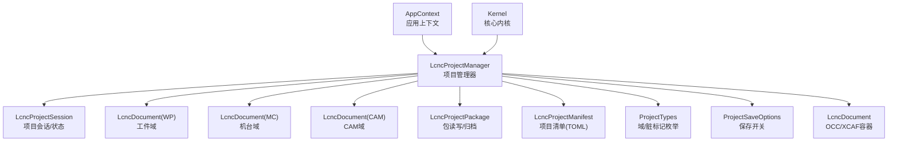
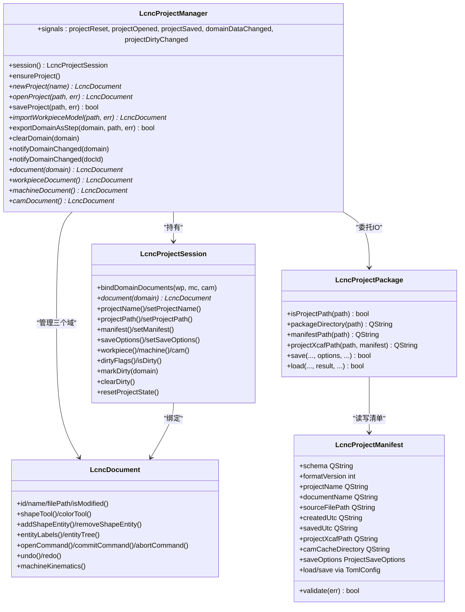
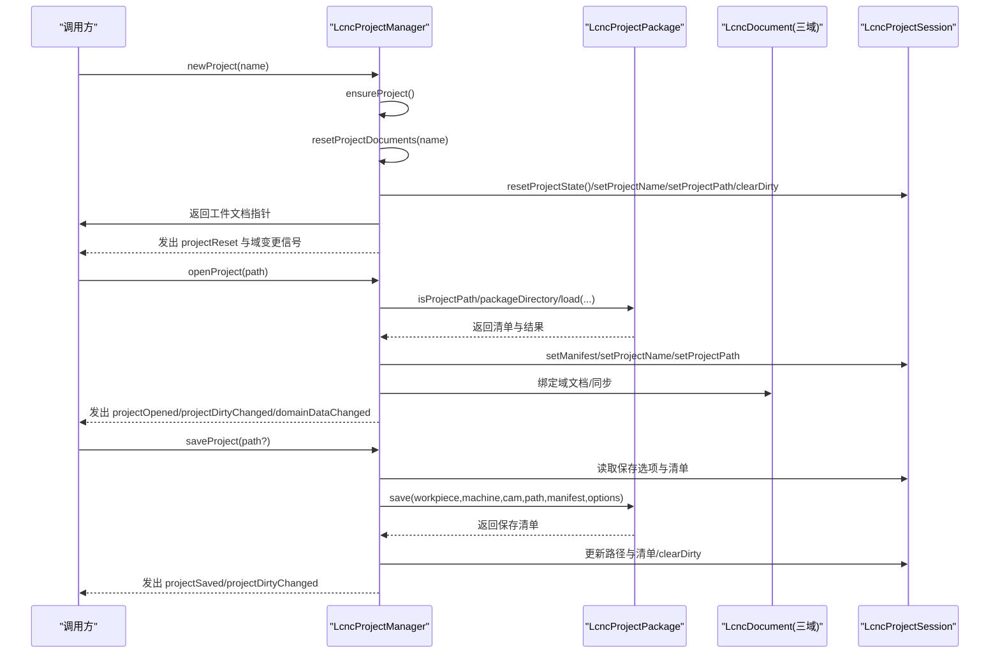
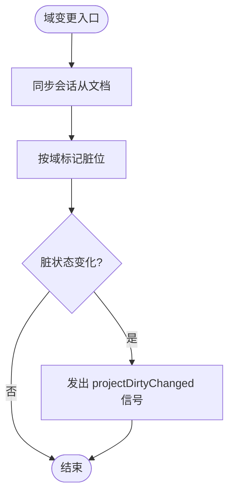
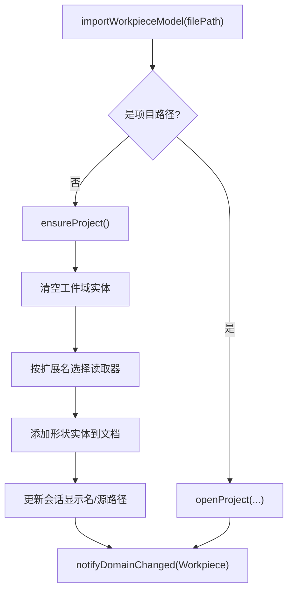
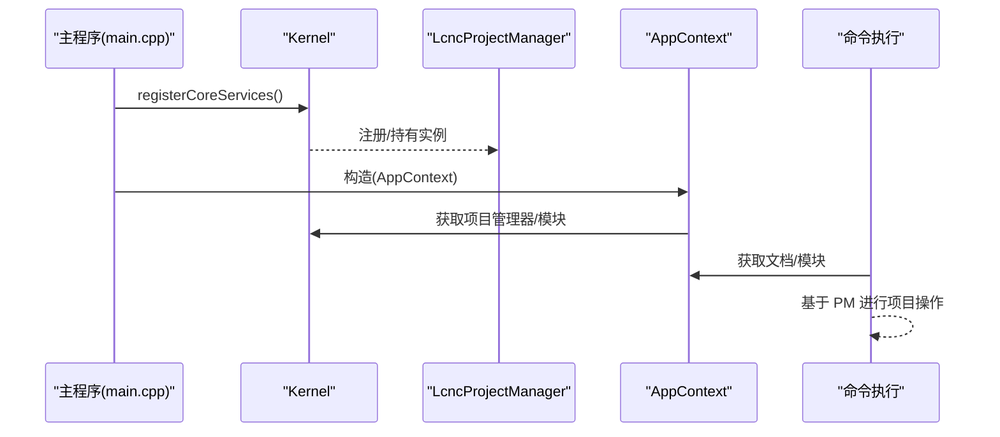
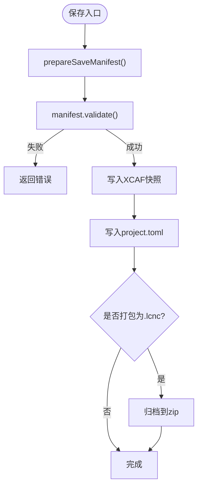
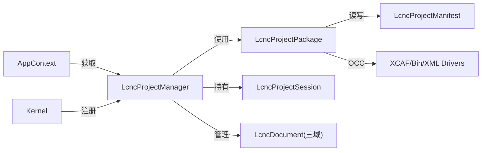

# 项目管理器

<cite>
**本文引用的文件**
- [lcnc_project_manager.h](file://src/core/project/lcnc_project_manager.h)
- [lcnc_project_manager.cpp](file://src/core/project/lcnc_project_manager.cpp)
- [lcnc_project_session.h](file://src/core/project/lcnc_project_session.h)
- [lcnc_project_session.cpp](file://src/core/project/lcnc_project_session.cpp)
- [lcnc_project_package.h](file://src/core/project/lcnc_project_package.h)
- [lcnc_project_package.cpp](file://src/core/project/lcnc_project_package.cpp)
- [lcnc_project_manifest.h](file://src/core/project/lcnc_project_manifest.h)
- [lcnc_project_manifest.cpp](file://src/core/project/lcnc_project_manifest.cpp)
- [project_types.h](file://src/core/project/project_types.h)
- [project_save_options.h](file://src/core/project/project_save_options.h)
- [lcnc_document.h](file://src/core/document/lcnc_document.h)
- [app_context.h](file://src/app/app_context.h)
- [app_context.cpp](file://src/app/app_context.cpp)
- [toml_config.h](file://src/core/settings/toml_config.h)
- [main.cpp](file://src/main.cpp)
</cite>

## 目录
1. [简介](#简介)
2. [项目结构](#项目结构)
3. [核心组件](#核心组件)
4. [架构总览](#架构总览)
5. [详细组件分析](#详细组件分析)
6. [依赖关系分析](#依赖关系分析)
7. [性能考量](#性能考量)
8. [故障排查指南](#故障排查指南)
9. [结论](#结论)
10. [附录](#附录)

## 简介
本文件系统性阐述 LcncProjectManager 项目管理器的设计与实现，覆盖项目生命周期（创建、初始化、打开、保存、导入导出）、状态管理（打开状态、修改状态、错误状态）、与文档系统及各模块的集成方式，并提供配置加载/保存与验证策略、使用示例与最佳实践。

## 项目结构
项目管理器位于核心子系统中，围绕三个 OCC/XCAF 文档域（工件、机台、CAM）进行协调，同时维护项目级元数据与脏标记。其关键文件组织如下：
- 项目管理器主体：LcncProjectManager（头/实现）
- 项目会话与状态：LcncProjectSession（头/实现）
- 项目包读写与归档：LcncProjectPackage（头/实现）
- 项目清单与配置：LcncProjectManifest（头/实现），基于 TomlConfig
- 项目类型与保存选项：project_types.h、project_save_options.h
- 文档容器：LcncDocument（OCC/XCAF 承载）
- 应用上下文集成：AppContext（桥接各模块与项目管理器）

**图表来源**
- [lcnc_project_manager.h:19-71](file://src/core/project/lcnc_project_manager.h#L19-L71)
- [lcnc_project_session.h:47-101](file://src/core/project/lcnc_project_session.h#L47-L101)
- [lcnc_project_package.h:24-70](file://src/core/project/lcnc_project_package.h#L24-L70)
- [lcnc_project_manifest.h:13-36](file://src/core/project/lcnc_project_manifest.h#L13-L36)
- [project_types.h:15-31](file://src/core/project/project_types.h#L15-L31)
- [project_save_options.h:8-14](file://src/core/project/project_save_options.h#L8-L14)
- [lcnc_document.h:28-157](file://src/core/document/lcnc_document.h#L28-L157)
- [app_context.h:17-47](file://src/app/app_context.h#L17-L47)

**章节来源**
- [lcnc_project_manager.h:1-74](file://src/core/project/lcnc_project_manager.h#L1-L74)
- [lcnc_project_manager.cpp:33-42](file://src/core/project/lcnc_project_manager.cpp#L33-L42)
- [lcnc_project_session.h:47-101](file://src/core/project/lcnc_project_session.h#L47-L101)
- [lcnc_project_package.h:24-70](file://src/core/project/lcnc_project_package.h#L24-L70)
- [lcnc_project_manifest.h:13-36](file://src/core/project/lcnc_project_manifest.h#L13-L36)
- [project_types.h:15-31](file://src/core/project/project_types.h#L15-L31)
- [project_save_options.h:8-14](file://src/core/project/project_save_options.h#L8-L14)
- [lcnc_document.h:28-157](file://src/core/document/lcnc_document.h#L28-L157)
- [app_context.h:17-47](file://src/app/app_context.h#L17-L47)

## 核心组件
- LcncProjectManager：单一项目的生命周期与数据域协调者，持有三个持久化 OCC 文档域，负责项目创建、打开、保存、导入几何、导出 STEP、清理域、域变更通知与脏标记传播。
- LcncProjectSession：项目级会话对象，绑定三个域文档，维护项目名称/路径、清单、保存选项与脏标志集合。
- LcncProjectPackage：.lcnc 包的读写与归档器，负责清单解析、XCAF 快照读写、ZIP 归档/解压、缓存目录处理。
- LcncProjectManifest：项目清单（TOML），描述 schema、版本、资源路径、保存选项等，并提供校验。
- LcncDocument：OCC/XCAF 文档容器，承载实体树、颜色、命令栈、撤销重做、机器运动学模型等。
- AppContext：应用上下文，向命令与模块暴露项目管理器与文档句柄，实现跨模块协作。

**章节来源**
- [lcnc_project_manager.h:19-71](file://src/core/project/lcnc_project_manager.h#L19-L71)
- [lcnc_project_session.h:47-101](file://src/core/project/lcnc_project_session.h#L47-L101)
- [lcnc_project_package.h:24-70](file://src/core/project/lcnc_project_package.h#L24-L70)
- [lcnc_project_manifest.h:13-36](file://src/core/project/lcnc_project_manifest.h#L13-L36)
- [lcnc_document.h:28-157](file://src/core/document/lcnc_document.h#L28-L157)
- [app_context.h:17-47](file://src/app/app_context.h#L17-L47)

## 架构总览
项目管理器通过会话对象统一管理三个域文档，所有持久化操作委托给 LcncProjectPackage；清单与保存选项通过 LcncProjectManifest/TomlConfig 提供配置能力；应用上下文在命令执行时提供统一入口。

**图表来源**
- [lcnc_project_manager.h:19-71](file://src/core/project/lcnc_project_manager.h#L19-L71)
- [lcnc_project_session.h:47-101](file://src/core/project/lcnc_project_session.h#L47-L101)
- [lcnc_project_package.h:24-70](file://src/core/project/lcnc_project_package.h#L24-L70)
- [lcnc_project_manifest.h:13-36](file://src/core/project/lcnc_project_manifest.h#L13-L36)
- [lcnc_document.h:28-157](file://src/core/document/lcnc_document.h#L28-L157)

## 详细组件分析

### 项目生命周期管理
- 初始化与确保：构造时注册 OCC 驱动并 ensureProject，确保三个域文档存在且会话同步。
- 新建项目：生成默认项目名，重置域文档，清空脏标记，发出重置与域变更信号。
- 打开项目：校验路径是否为项目路径，解包/定位包目录，加载清单与 XCAF 快照，回填会话元数据，发出打开与脏标记信号。
- 保存项目：根据会话保存选项与清单模板准备清单，写入 XCAF 快照与清单，更新会话路径与清单，发出保存与脏标记信号。

**图表来源**
- [lcnc_project_manager.cpp:56-147](file://src/core/project/lcnc_project_manager.cpp#L56-L147)
- [lcnc_project_package.cpp:485-556](file://src/core/project/lcnc_project_package.cpp#L485-L556)
- [lcnc_project_session.cpp:55-65](file://src/core/project/lcnc_project_session.cpp#L55-L65)

**章节来源**
- [lcnc_project_manager.cpp:56-147](file://src/core/project/lcnc_project_manager.cpp#L56-L147)
- [lcnc_project_package.cpp:380-475](file://src/core/project/lcnc_project_package.cpp#L380-L475)
- [lcnc_project_session.cpp:55-65](file://src/core/project/lcnc_project_session.cpp#L55-L65)

### 项目状态管理机制
- 打开状态：通过会话的 projectName/projectPath 记录当前项目标识；打开/保存后同步更新。
- 修改状态：ProjectDirtyFlag 位掩码跟踪各域修改状态；每次域变更触发 markDirty 并在脏状态变化时发出信号。
- 错误状态：所有 IO/解析/校验均返回布尔值并在 errorMsg 指针中填充错误信息；日志记录失败原因。

**图表来源**
- [lcnc_project_manager.cpp:401-416](file://src/core/project/lcnc_project_manager.cpp#L401-L416)
- [lcnc_project_session.cpp:45-53](file://src/core/project/lcnc_project_session.cpp#L45-L53)

**章节来源**
- [lcnc_project_session.h:80-83](file://src/core/project/lcnc_project_session.h#L80-L83)
- [lcnc_project_session.cpp:45-53](file://src/core/project/lcnc_project_session.cpp#L45-L53)
- [lcnc_project_manager.cpp:410-416](file://src/core/project/lcnc_project_manager.cpp#L410-L416)

### 项目与文档系统的集成
- 域文档绑定：LcncProjectSession.bindDomainDocuments 将三个 LcncDocument 绑定到会话；LcncProjectManager 通过 document()/domainDocumentById() 查询域文档或按 ID 定位。
- 几何导入：importWorkpieceModel 支持 .stp/.step/.igs/.iges/.stl，读取后写入工件域并更新会话源文件信息。
- 导出 STEP：exportDomainAsStep 遍历指定域的自由形状并写入 STEP 文件。
- 清理域：clearDomain 按域清除实体类别并清空会话对应状态，随后发出域变更信号。

**图表来源**
- [lcnc_project_manager.cpp:149-171](file://src/core/project/lcnc_project_manager.cpp#L149-L171)
- [lcnc_project_manager.cpp:347-399](file://src/core/project/lcnc_project_manager.cpp#L347-L399)

**章节来源**
- [lcnc_project_manager.cpp:149-196](file://src/core/project/lcnc_project_manager.cpp#L149-L196)
- [lcnc_project_manager.cpp:326-345](file://src/core/project/lcnc_project_manager.cpp#L326-L345)
- [lcnc_project_manager.cpp:347-399](file://src/core/project/lcnc_project_manager.cpp#L347-L399)

### 与其他模块的交互接口
- 应用上下文：AppContext 暴露 projectManager()、workpiece/machine/cam 文档指针、模块实例等，命令执行时通过 AppContext 获取项目管理器与文档句柄。
- Kernel 注册：主程序在启动阶段注册核心服务（含项目管理器），确保模块初始化前可用。

**图表来源**
- [app_context.cpp:17-85](file://src/app/app_context.cpp#L17-L85)
- [main.cpp:68-90](file://src/main.cpp#L68-L90)

**章节来源**
- [app_context.h:23-34](file://src/app/app_context.h#L23-L34)
- [app_context.cpp:17-85](file://src/app/app_context.cpp#L17-L85)
- [main.cpp:68-90](file://src/main.cpp#L68-L90)

### 项目配置的加载与保存机制
- 清单结构：LcncProjectManifest 继承自 TomlConfig，包含 schema、版本、项目/文档名、源文件路径、时间戳、资源路径与保存选项。
- 校验策略：validate 校验 schema 与版本范围、资源路径完整性，不符合则返回错误。
- 保存流程：prepareSaveManifest 填充默认值与时间戳，写入 XCAF 快照与清单，可选创建 CAM 缓存目录，必要时打包为 .lcnc。
- 打开流程：读取清单并校验，定位 XCAF 路径，加载快照，填充结果结构体。

**图表来源**
- [lcnc_project_package.cpp:178-207](file://src/core/project/lcnc_project_package.cpp#L178-L207)
- [lcnc_project_manifest.cpp:5-23](file://src/core/project/lcnc_project_manifest.cpp#L5-L23)
- [lcnc_project_package.cpp:393-475](file://src/core/project/lcnc_project_package.cpp#L393-L475)

**章节来源**
- [lcnc_project_manifest.h:13-36](file://src/core/project/lcnc_project_manifest.h#L13-L36)
- [lcnc_project_manifest.cpp:5-79](file://src/core/project/lcnc_project_manifest.cpp#L5-L79)
- [toml_config.h:23-52](file://src/core/settings/toml_config.h#L23-L52)
- [lcnc_project_package.cpp:393-475](file://src/core/project/lcnc_project_package.cpp#L393-L475)

## 依赖关系分析
- 组件耦合：LcncProjectManager 高内聚地封装了项目生命周期与域协调，仅通过 LcncProjectPackage 进行持久化 IO，降低与具体存储格式的耦合。
- 外部依赖：OCC/XCAF（Bin/XML 驱动）、Qt（QTemporaryDir、QProcess、QFileInfo）、TOML 解析库。
- 潜在循环：无直接循环依赖；AppContext 通过 Kernel 获取项目管理器，避免反向依赖 core/view。

**图表来源**
- [lcnc_project_manager.cpp:36-41](file://src/core/project/lcnc_project_manager.cpp#L36-L41)
- [lcnc_project_package.cpp:214-219](file://src/core/project/lcnc_project_package.cpp#L214-L219)
- [app_context.cpp:17-19](file://src/app/app_context.cpp#L17-L19)

**章节来源**
- [lcnc_project_manager.cpp:36-41](file://src/core/project/lcnc_project_manager.cpp#L36-L41)
- [lcnc_project_package.cpp:214-219](file://src/core/project/lcnc_project_package.cpp#L214-L219)
- [app_context.cpp:17-19](file://src/app/app_context.cpp#L17-L19)

## 性能考量
- XCAF 快照读写：批量导出/导入实体时建议合并命令与减少标签遍历次数，避免频繁触发 UI 刷新。
- ZIP 归档：Windows 下通过 PowerShell 命令进行压缩/解压，注意临时目录权限与磁盘空间；大文件场景建议异步执行并提供进度反馈。
- 脏标记：合理使用 notifyDomainChanged 与 markDirty，避免过度发出信号导致 UI 抖动。
- 几何导入：对大型 STL/STEP/IGES 文件，建议在后台线程执行并分块处理，导入完成后一次性通知域变更。

## 故障排查指南
- 打开失败：检查 isProjectPath 是否正确识别路径；确认清单存在且 validate 成功；确认 XCAF 资源路径存在。
- 保存失败：检查 manifest.validate；确认目标路径可写；若打包 .lcnc，检查 PowerShell 可用性与临时目录权限。
- 导入失败：确认文件扩展名受支持；检查文件是否存在且可读；查看错误信息中的具体失败原因。
- 脏状态异常：确认每次域变更都调用了 notifyDomainChanged；检查 markDirty 与 clearDirty 的配对使用。

**章节来源**
- [lcnc_project_package.cpp:49-93](file://src/core/project/lcnc_project_package.cpp#L49-L93)
- [lcnc_project_package.cpp:527-542](file://src/core/project/lcnc_project_package.cpp#L527-L542)
- [lcnc_project_manifest.cpp:5-23](file://src/core/project/lcnc_project_manifest.cpp#L5-L23)
- [lcnc_project_manager.cpp:347-399](file://src/core/project/lcnc_project_manager.cpp#L347-L399)

## 结论
LcncProjectManager 以会话为中心，结合 LcncProjectPackage 的清单与归档能力，实现了稳定可靠的项目生命周期管理。通过清晰的域划分、完善的脏状态追踪与严格的配置校验，项目管理器在复杂 CAD/CAM 工作流中提供了坚实的数据基础与一致的用户体验。

## 附录

### 使用示例与最佳实践
- 新建项目：调用 newProject，随后在工作流中对工件域进行编辑；需要保存时调用 saveProject。
- 打开项目：调用 openProject，处理返回的错误信息；打开后立即可读取会话与文档。
- 导入工件模型：优先使用 importWorkpieceModel，自动处理几何读取与会话更新。
- 导出 STEP：针对特定域调用 exportDomainAsStep，确保域文档已填充有效形状。
- 最佳实践：
  - 在命令执行前后保持一致的文档状态，避免跨模块竞态。
  - 对大文件导入/导出采用异步策略并提供用户反馈。
  - 定期校验清单有效性，防止版本不兼容导致的加载失败。

### 关键 API 一览
- 项目操作：newProject、openProject、saveProject
- 域操作：document、workpieceDocument、machineDocument、camDocument、domainDocumentById
- 域变更：notifyDomainChanged、clearDomain、exportDomainAsStep
- 会话与状态：session、isDirty、markDirty、clearDirty、resetProjectState

**章节来源**
- [lcnc_project_manager.h:30-50](file://src/core/project/lcnc_project_manager.h#L30-L50)
- [lcnc_project_session.h:59-83](file://src/core/project/lcnc_project_session.h#L59-L83)