# GUI应用程序框架

<cite>
**本文档引用的文件**
- [gui_application.h](file://src/view/gui_application.h)
- [gui_application.cpp](file://src/view/gui_application.cpp)
- [gui_document.h](file://src/view/gui_document.h)
- [gui_document.cpp](file://src/view/gui_document.cpp)
- [rendering_manager.h](file://src/view/rendering_manager.h)
- [rendering_manager.cpp](file://src/view/rendering_manager.cpp)
- [widget_occ_view.h](file://src/view/widget_occ_view.h)
- [widget_occ_view.cpp](file://src/view/widget_occ_view.cpp)
- [main_window.h](file://src/app/main_window.h)
- [main_window.cpp](file://src/app/main_window.cpp)
- [app_context.h](file://src/app/app_context.h)
- [commands_api.h](file://src/core/command/commands_api.h)
</cite>

## 目录
1. [简介](#简介)
2. [项目结构](#项目结构)
3. [核心组件](#核心组件)
4. [架构概览](#架构概览)
5. [详细组件分析](#详细组件分析)
6. [依赖关系分析](#依赖关系分析)
7. [性能考虑](#性能考虑)
8. [故障排除指南](#故障排除指南)
9. [结论](#结论)
10. [扩展指南](#扩展指南)

## 简介

LaserCNC GUI应用程序框架是一个基于OpenCASCADE技术的核心图形用户界面系统，专为激光切割和CAM（计算机辅助制造）应用设计。该框架采用微内核架构，通过模块化设计实现了高度可扩展的GUI系统。

框架的核心设计理念包括：
- **单例模式应用**：确保全局唯一性，避免重复实例化
- **工作空间文档管理**：统一管理所有项目域的共享工作空间
- **渲染设置应用**：灵活的渲染参数管理和实时应用机制
- **显示模式控制**：支持多种显示模式和边界绘制选项
- **事件驱动架构**：基于Qt信号槽的事件处理机制

## 项目结构

LaserCNC GUI应用程序框架采用清晰的分层架构，主要分为以下几个层次：

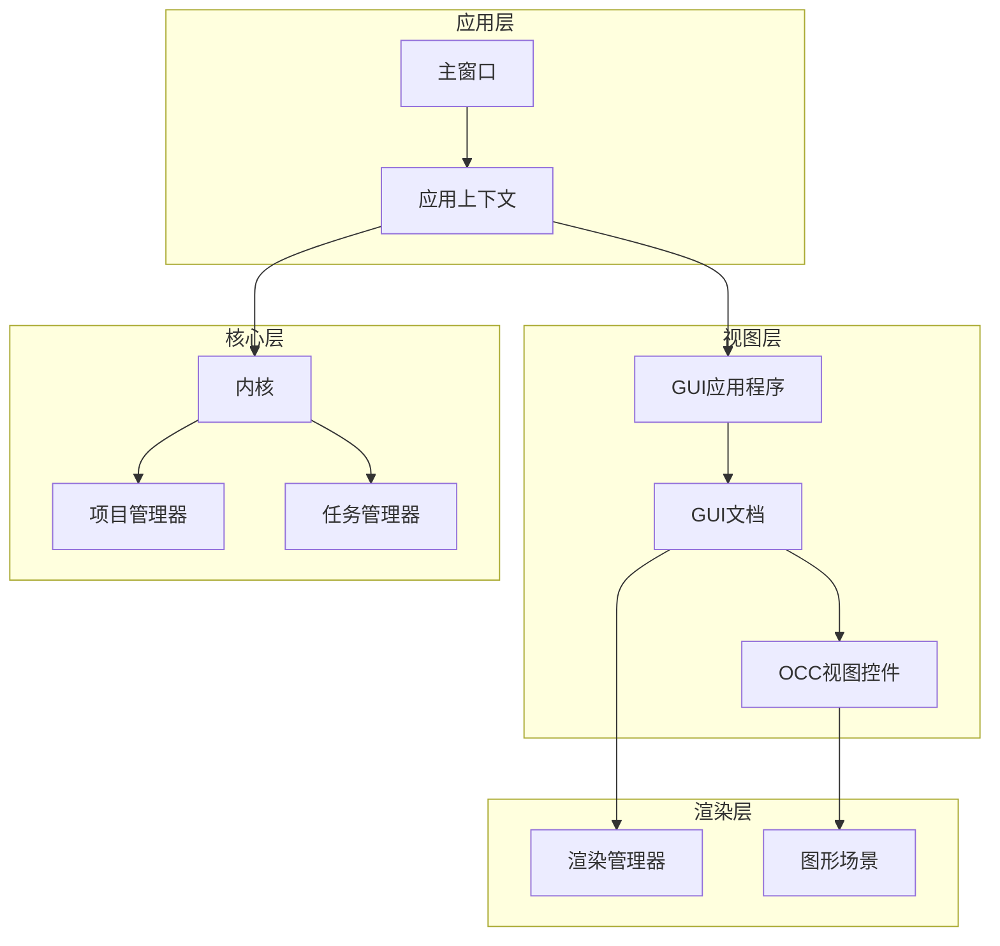

**图表来源**
- [main_window.h:41-147](file://src/app/main_window.h#L41-L147)
- [gui_application.h:17-46](file://src/view/gui_application.h#L17-L46)
- [gui_document.h:35-144](file://src/view/gui_document.h#L35-L144)

**章节来源**
- [main_window.h:1-147](file://src/app/main_window.h#L1-L147)
- [gui_application.h:1-47](file://src/view/gui_application.h#L1-L47)
- [gui_document.h:1-144](file://src/view/gui_document.h#L1-L144)

## 核心组件

### GuiApplication类设计

GuiApplication类是整个GUI应用程序框架的核心，实现了单例模式并管理着共享的工作空间文档。

#### 设计特点

1. **单例模式实现**：通过静态指针确保全局唯一实例
2. **工作空间管理**：维护单一可见的GuiDocument实例
3. **渲染设置协调**：统一管理CAD和CAM视图的渲染参数
4. **显示模式控制**：提供统一的显示模式和边界绘制控制

#### 关键功能

- `workspaceGuiDocument()`: 返回当前工作空间的GUI文档
- `setCurrentDisplayMode()`: 设置全局显示模式和边界绘制
- `requestApplyRenderingSettings()`: 异步应用渲染设置

**章节来源**
- [gui_application.h:17-46](file://src/view/gui_application.h#L17-L46)
- [gui_application.cpp:16-89](file://src/view/gui_application.cpp#L16-L89)

### GuiDocument类架构

GuiDocument类是GUI层的包装器，负责管理共享工作空间的视图和显示对象。

#### 主要职责

1. **文档生命周期管理**：创建、激活和销毁GUI文档
2. **视图状态管理**：维护每个文档的V3d_View和AIS_InteractiveContext
3. **显示对象管理**：注册、显示和移除AIS_Shape对象
4. **变换更新**：计算和应用机器轴变换

#### 核心数据结构

- `DisplayKey`: 唯一标识显示对象的键值
- `DisplayObject`: 显示对象的完整描述
- `m_displayObjects`: 显示对象映射表

**章节来源**
- [gui_document.h:35-144](file://src/view/gui_document.h#L35-L144)
- [gui_document.cpp:54-663](file://src/view/gui_document.cpp#L54-L663)

### RenderingManager类设计

RenderingManager类专门负责单个GuiDocument的渲染参数管理。

#### 渲染脏标记系统

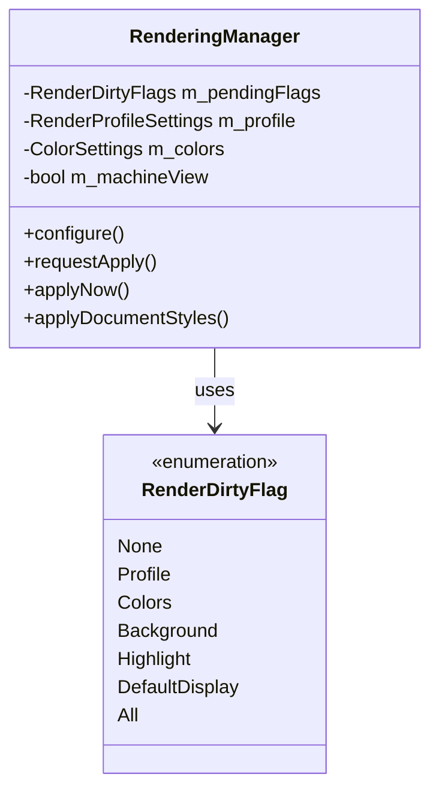

**图表来源**
- [rendering_manager.h:20-28](file://src/view/rendering_manager.h#L20-L28)
- [rendering_manager.h:38-96](file://src/view/rendering_manager.h#L38-L96)

#### 应用程序初始化流程

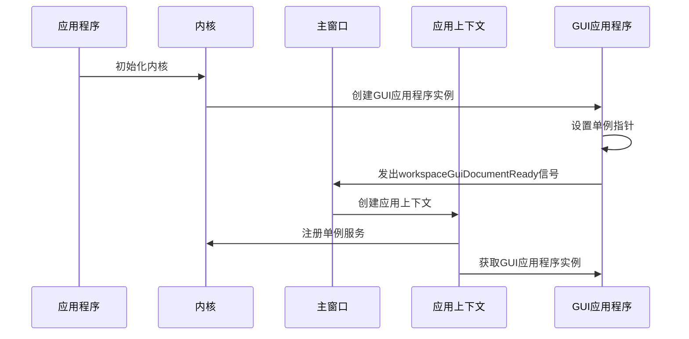

**图表来源**
- [gui_application.cpp:16-30](file://src/view/gui_application.cpp#L16-L30)
- [main_window.cpp:205-230](file://src/app/main_window.cpp#L205-L230)

**章节来源**
- [rendering_manager.h:15-101](file://src/view/rendering_manager.h#L15-L101)
- [rendering_manager.cpp:136-453](file://src/view/rendering_manager.cpp#L136-L453)

## 架构概览

LaserCNC GUI应用程序框架采用了模块化的微内核架构，实现了清晰的关注点分离。

### 整体架构设计

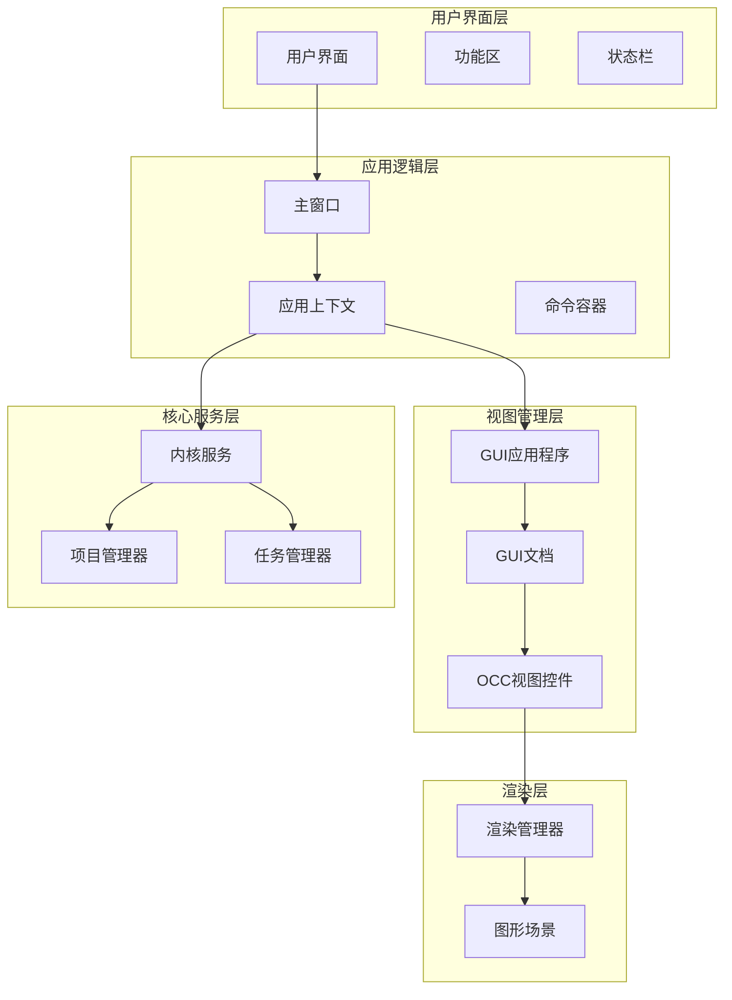

**图表来源**
- [main_window.h:26-40](file://src/app/main_window.h#L26-L40)
- [app_context.h:12-17](file://src/app/app_context.h#L12-L17)

### 事件处理机制

框架采用基于Qt的事件驱动架构，实现了完整的事件处理链路：

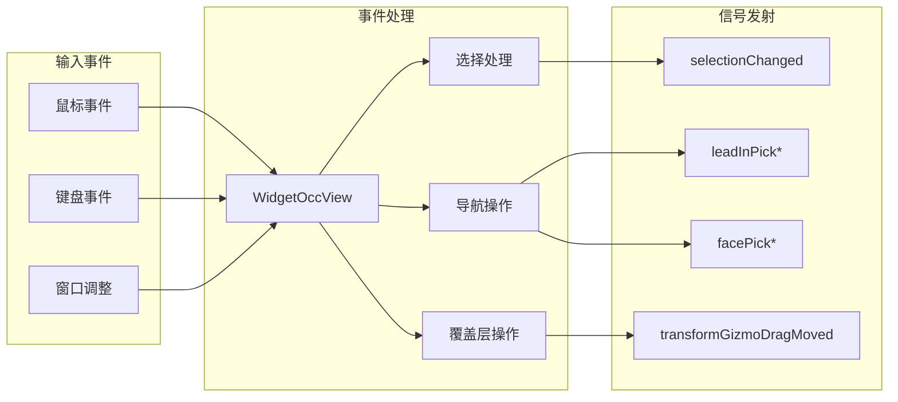

**图表来源**
- [widget_occ_view.h:97-111](file://src/view/widget_occ_view.h#L97-L111)
- [widget_occ_view.cpp:534-863](file://src/view/widget_occ_view.cpp#L534-L863)

**章节来源**
- [widget_occ_view.h:1-182](file://src/view/widget_occ_view.h#L1-L182)
- [widget_occ_view.cpp:1-890](file://src/view/widget_occ_view.cpp#L1-L890)

## 详细组件分析

### GuiApplication组件深度分析

#### 单例模式实现

GuiApplication采用了经典的单例模式实现，确保应用程序中只有一个实例存在：

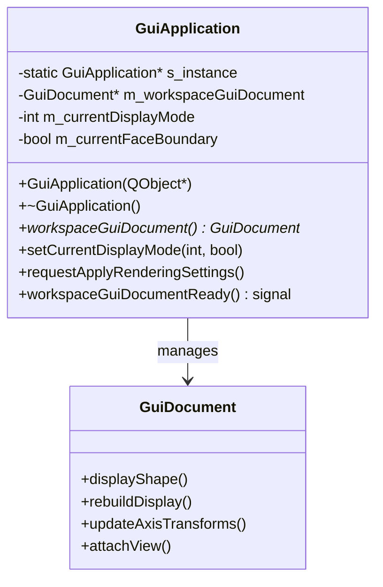

**图表来源**
- [gui_application.h:17-46](file://src/view/gui_application.h#L17-L46)
- [gui_document.h:35-98](file://src/view/gui_document.h#L35-L98)

#### 显示模式控制机制

GuiApplication提供了统一的显示模式控制接口：

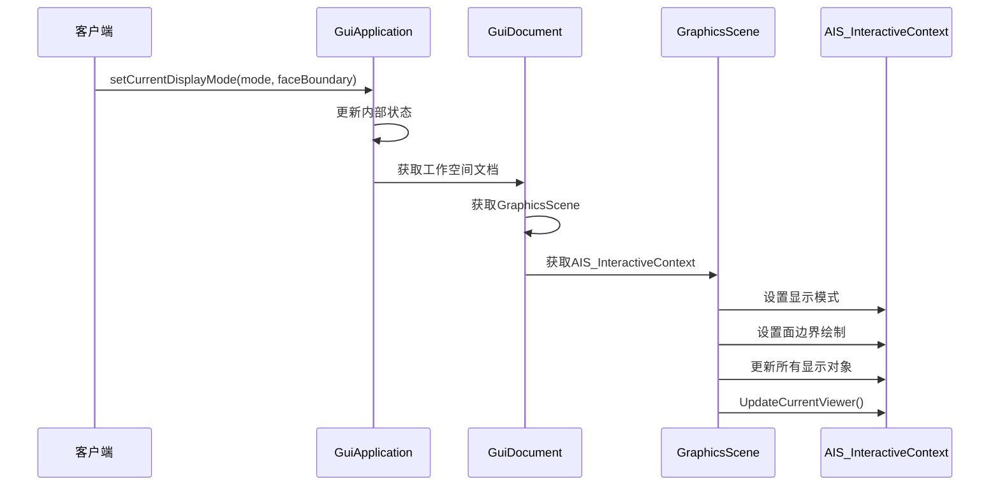

**图表来源**
- [gui_application.cpp:32-64](file://src/view/gui_application.cpp#L32-L64)

**章节来源**
- [gui_application.cpp:16-89](file://src/view/gui_application.cpp#L16-L89)

### GuiDocument组件详细分析

#### 文档生命周期管理

GuiDocument实现了完整的文档生命周期管理，包括创建、激活、更新和销毁：

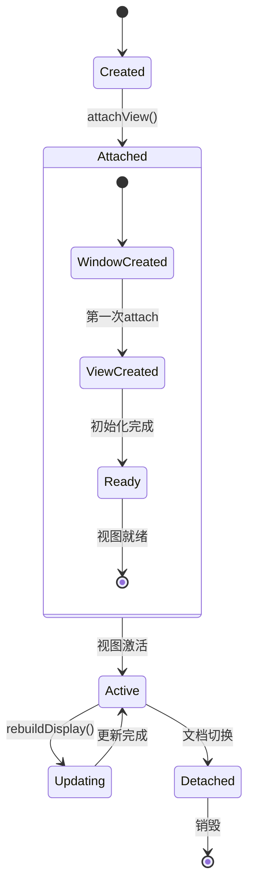

**图表来源**
- [gui_document.cpp:80-129](file://src/view/gui_document.cpp#L80-L129)

#### 显示对象管理系统

GuiDocument使用复杂的键值系统来管理显示对象：

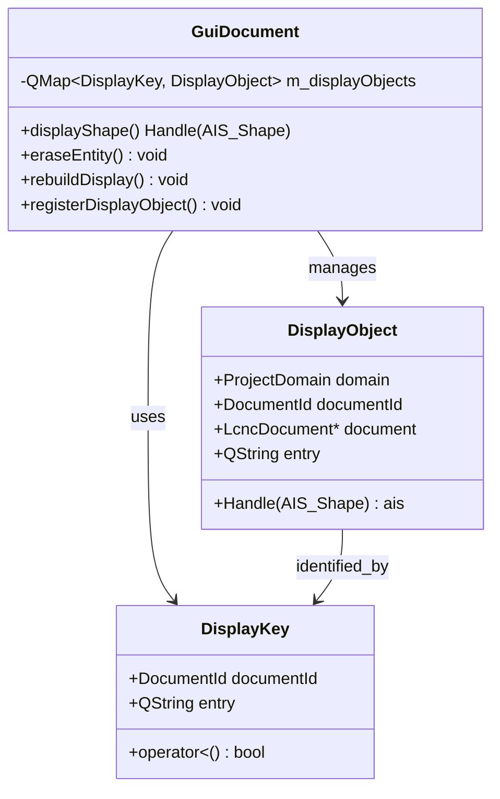

**图表来源**
- [gui_document.h:100-131](file://src/view/gui_document.h#L100-L131)

**章节来源**
- [gui_document.cpp:221-420](file://src/view/gui_document.cpp#L221-L420)

### RenderingManager组件深入分析

#### 渲染参数应用机制

RenderingManager采用了延迟应用和批量处理的优化策略：

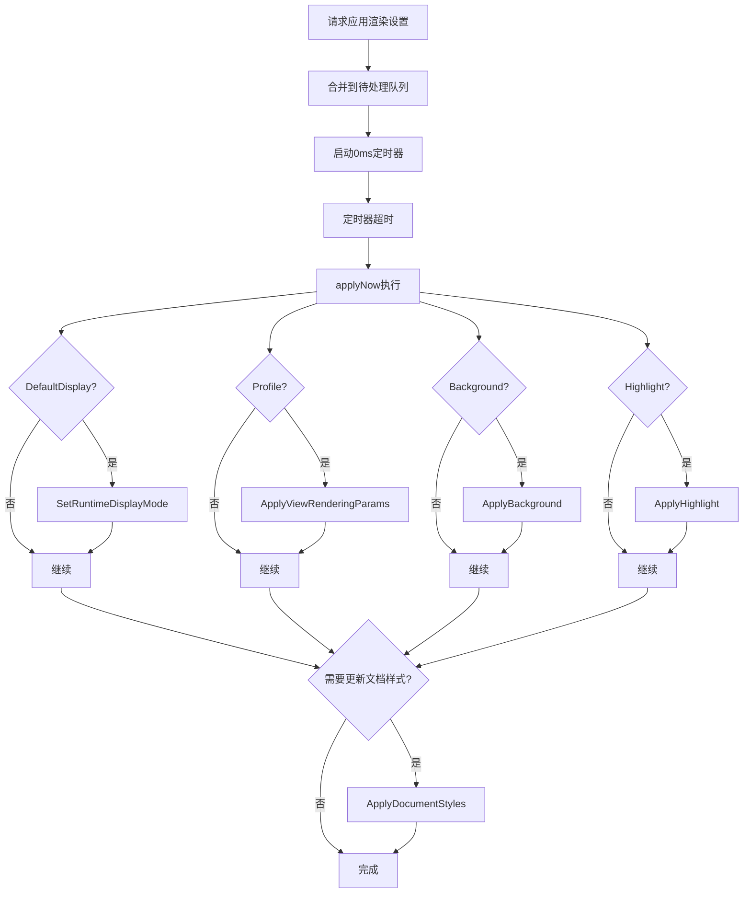

**图表来源**
- [rendering_manager.cpp:166-197](file://src/view/rendering_manager.cpp#L166-L197)

#### 材质和颜色系统

RenderingManager实现了复杂的材质和颜色管理系统：

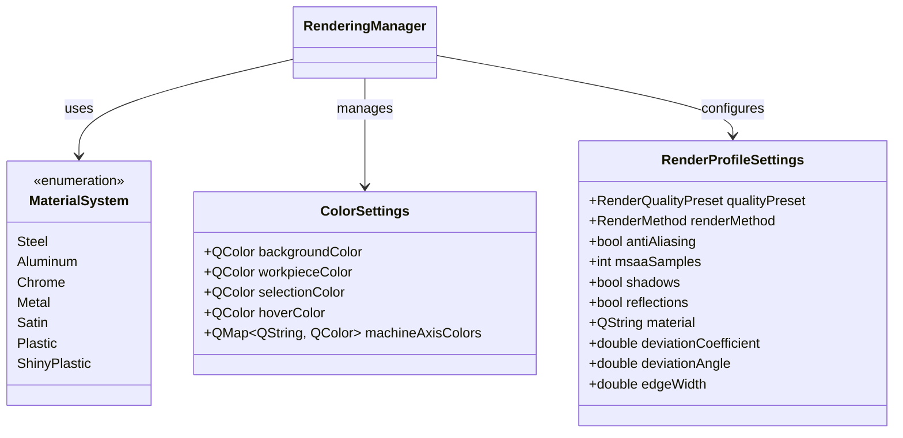

**图表来源**
- [rendering_manager.h:72-74](file://src/view/rendering_manager.h#L72-L74)

**章节来源**
- [rendering_manager.cpp:72-453](file://src/view/rendering_manager.cpp#L72-L453)

### WidgetOccView组件分析

#### 视图交互机制

WidgetOccView实现了丰富的3D视图交互功能：

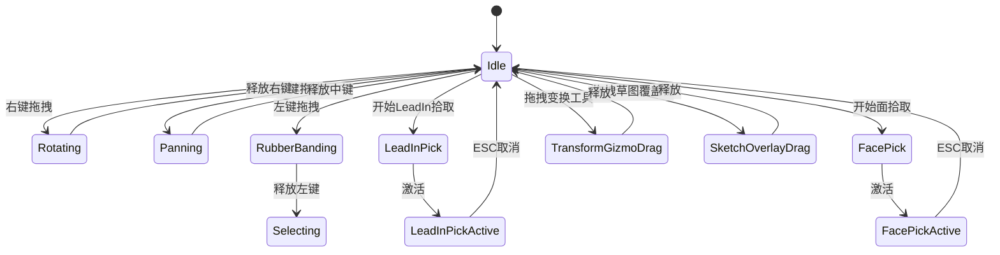

**图表来源**
- [widget_occ_view.cpp:534-863](file://src/view/widget_occ_view.cpp#L534-L863)

#### 事件处理流程

WidgetOccView的事件处理遵循Qt的标准事件处理机制：

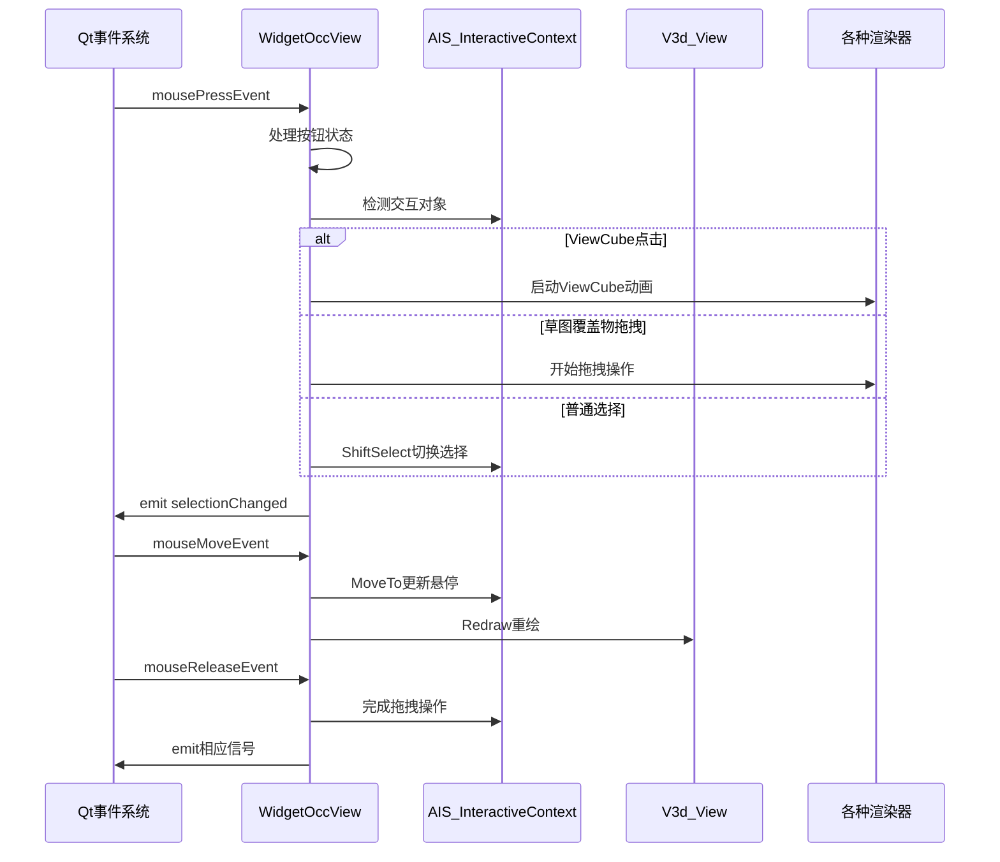

**图表来源**
- [widget_occ_view.cpp:534-863](file://src/view/widget_occ_view.cpp#L534-L863)

**章节来源**
- [widget_occ_view.cpp:1-890](file://src/view/widget_occ_view.cpp#L1-L890)

## 依赖关系分析

### 组件耦合度分析

LaserCNC GUI应用程序框架在设计上实现了良好的低耦合高内聚：

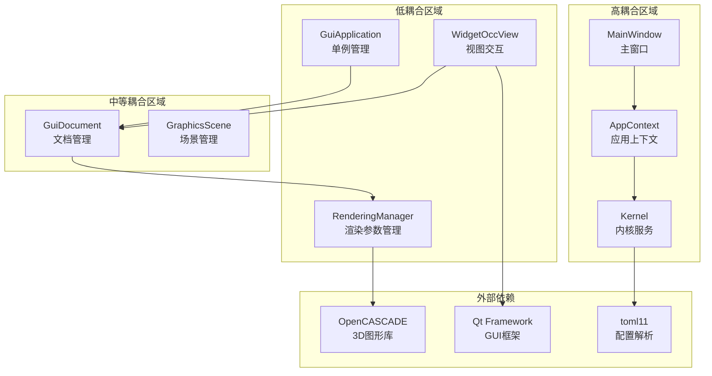

**图表来源**
- [gui_application.h:1-47](file://src/view/gui_application.h#L1-L47)
- [gui_document.h:1-144](file://src/view/gui_document.h#L1-L144)
- [rendering_manager.h:1-101](file://src/view/rendering_manager.h#L1-L101)

### 关键依赖关系

1. **GuiApplication ↔ GuiDocument**: 一对多关系，管理单一工作空间
2. **GuiDocument ↔ RenderingManager**: 一对一关系，每个文档独立管理渲染
3. **WidgetOccView ↔ GuiDocument**: 一对一关系，每个视图对应一个文档
4. **AppContext ↔ Kernel**: 依赖注入关系，提供服务访问接口

**章节来源**
- [gui_application.cpp:16-30](file://src/view/gui_application.cpp#L16-L30)
- [gui_document.cpp:54-68](file://src/view/gui_document.cpp#L54-L68)
- [app_context.h:17-47](file://src/app/app_context.h#L17-L47)

## 性能考虑

### 渲染性能优化

框架采用了多项性能优化策略：

1. **延迟应用机制**：使用0ms定时器合并多次渲染设置应用
2. **增量更新**：仅更新被标记为脏的渲染参数
3. **批量处理**：一次性应用所有相关的渲染设置
4. **智能缓存**：避免重复计算和不必要的重绘

### 内存管理策略

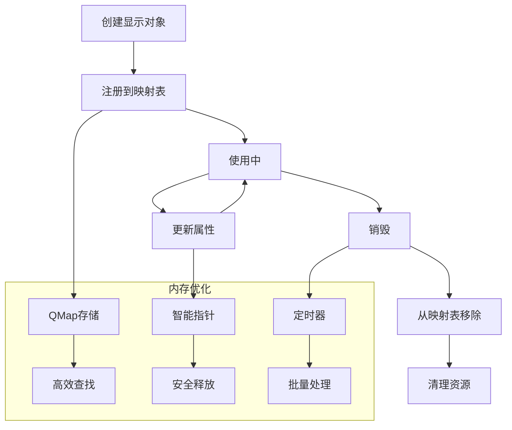

### 并发处理机制

框架通过以下机制确保线程安全：

1. **单线程UI原则**：所有GUI操作都在主线程执行
2. **信号槽机制**：Qt提供的线程安全信号槽
3. **延迟应用**：避免在事件处理过程中进行昂贵操作
4. **状态同步**：通过状态标志确保操作顺序

## 故障排除指南

### 常见问题诊断

#### 视图不显示或空白

**可能原因**：
1. V3d_View未正确创建
2. OpenGL上下文未正确初始化
3. 渲染参数配置错误

**解决方案**：
1. 检查`attachView()`调用是否成功
2. 验证OpenGL上下文状态
3. 确认渲染参数有效性

#### 选择功能异常

**可能原因**：
1. AIS_InteractiveContext未正确设置
2. 选择模式配置错误
3. 显示对象未正确注册

**解决方案**：
1. 检查`setEntitySelectionMode()`调用
2. 验证显示对象注册状态
3. 确认选择过滤器配置

#### 渲染性能问题

**可能原因**：
1. 渲染设置频繁变化
2. 大量显示对象同时更新
3. 不必要的重绘操作

**解决方案**：
1. 使用`requestApply()`批量应用设置
2. 合并相似的渲染操作
3. 优化显示对象数量

**章节来源**
- [gui_document.cpp:80-129](file://src/view/gui_document.cpp#L80-L129)
- [widget_occ_view.cpp:534-863](file://src/view/widget_occ_view.cpp#L534-L863)
- [rendering_manager.cpp:166-197](file://src/view/rendering_manager.cpp#L166-L197)

## 结论

LaserCNC GUI应用程序框架是一个设计精良、架构清晰的现代GUI系统。其核心优势包括：

1. **模块化设计**：清晰的分层架构便于维护和扩展
2. **高性能实现**：采用多种优化策略确保流畅的用户体验
3. **事件驱动**：基于Qt的事件系统提供响应式的用户交互
4. **可扩展性**：良好的接口设计支持功能扩展和定制

该框架为激光切割和CAM应用提供了坚实的技术基础，通过合理的架构设计和性能优化，能够满足复杂工业应用的需求。

## 扩展指南

### 添加新的视图组件

要向GUI框架添加新的视图组件，可以遵循以下步骤：

#### 步骤1：创建视图类

```cpp
// 新的视图类定义
class NewViewWidget : public QWidget
{
    Q_OBJECT
    
public:
    explicit NewViewWidget(QWidget* parent = nullptr);
    ~NewViewWidget() override;
    
    void attachDocument(GuiDocument* doc);
    void detachDocument();
    
signals:
    void documentAttached();
    void documentDetached();
    
private:
    GuiDocument* m_attachedDocument{nullptr};
    // 其他成员变量...
};
```

#### 步骤2：集成到现有架构

1. **继承QWidget基类**：确保与Qt框架兼容
2. **实现文档绑定**：参考WidgetOccView的文档绑定模式
3. **处理事件**：实现必要的Qt事件处理函数
4. **信号连接**：与现有信号系统集成

#### 步骤3：注册到应用上下文

```cpp
// 在AppContext中添加新组件访问接口
class AppContext : public QObject, public IAppContext
{
    // ... 其他接口
    
    NewViewWidget* newView() const override;
    
private:
    NewViewWidget* m_newView{nullptr};
};
```

#### 步骤4：在主窗口中集成

```cpp
// 在MainWindow中添加新视图
class MainWindow : public SARibbonMainWindow
{
    // ... 其他成员
    
private:
    NewViewWidget* m_newView{nullptr};
    
    void createNewView();
    void setupNewViewConnections();
};
```

### 扩展渲染功能

#### 添加新的渲染参数

1. **定义新的渲染参数枚举**：
```cpp
enum class NewRenderParameter {
    AmbientOcclusion,
    DepthOfField,
    BloomEffect
};
```

2. **更新RenderDirtyFlag**：
```cpp
enum class RenderDirtyFlag {
    // ... 现有标志
    NewParameter = 0x20
};
```

3. **实现参数应用逻辑**：
```cpp
void RenderingManager::applyNewParameter()
{
    // 实现新参数的应用逻辑
}
```

#### 自定义材质系统

```cpp
class CustomMaterialSystem
{
public:
    static Graphic3d_NameOfMaterial getMaterialByName(const QString& name);
    static void loadCustomMaterials(const QString& filePath);
    static QStringList getAllAvailableMaterials();
};
```

### 添加新的交互模式

#### 实现自定义选择模式

```cpp
class CustomSelectionHandler
{
public:
    enum class SelectionMode {
        Single,
        Multi,
        Group,
        Filtered
    };
    
    void setSelectionMode(SelectionMode mode);
    void handleSelection(const QPoint& position);
    void applySelectionFilter(const QString& filterType);
};
```

#### 集成到WidgetOccView

```cpp
void WidgetOccView::handleCustomInteraction(QMouseEvent* event)
{
    if (m_customSelectionMode) {
        m_customSelectionHandler->handleSelection(event->pos());
    }
}
```

通过遵循这些扩展指南，开发者可以轻松地向LaserCNC GUI应用程序框架添加新的功能和组件，同时保持架构的一致性和稳定性。