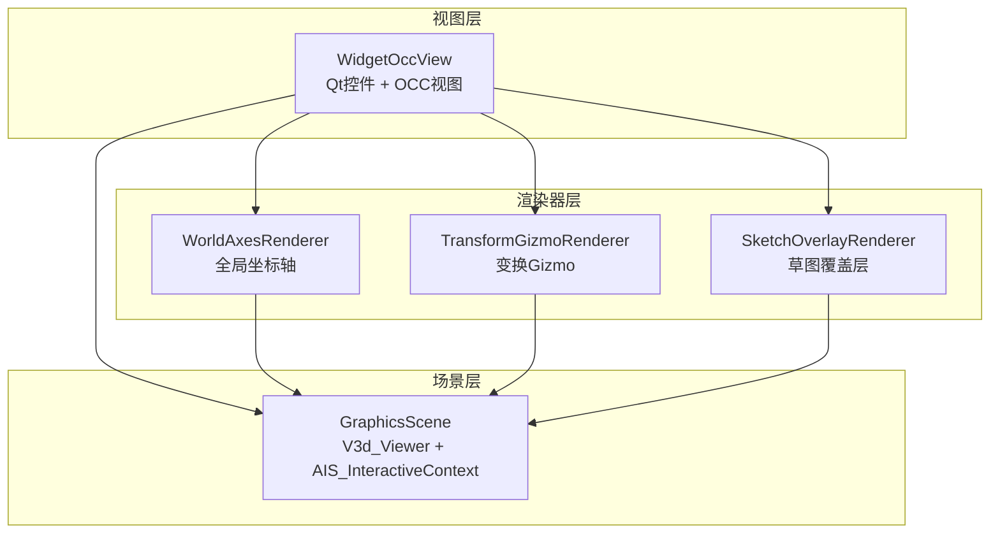
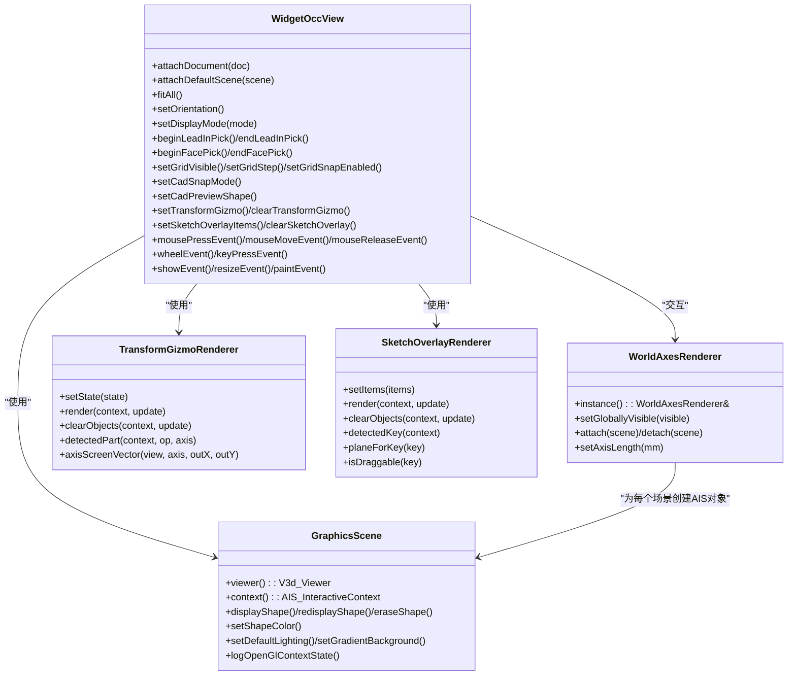
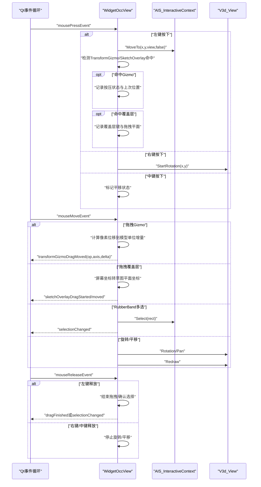
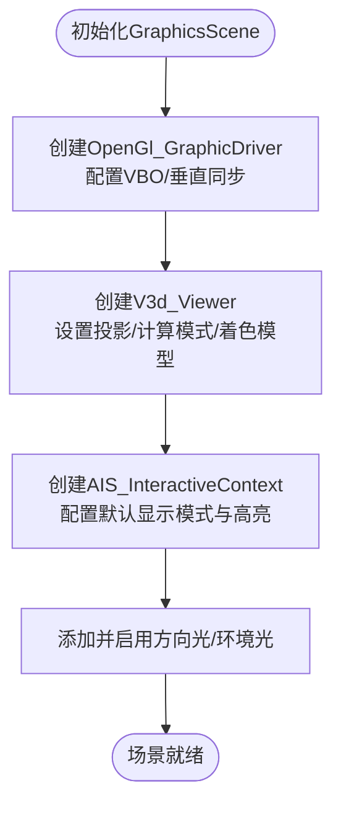
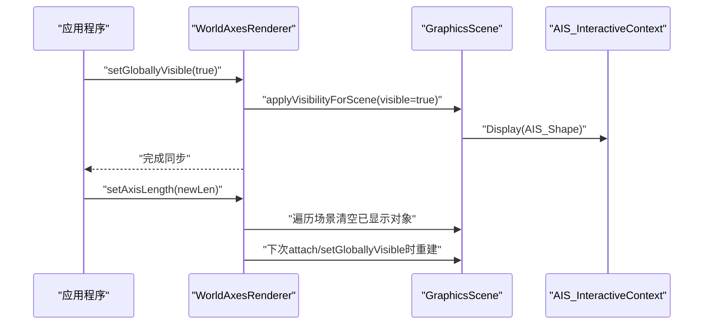
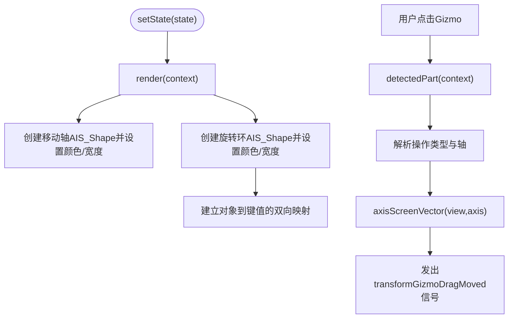
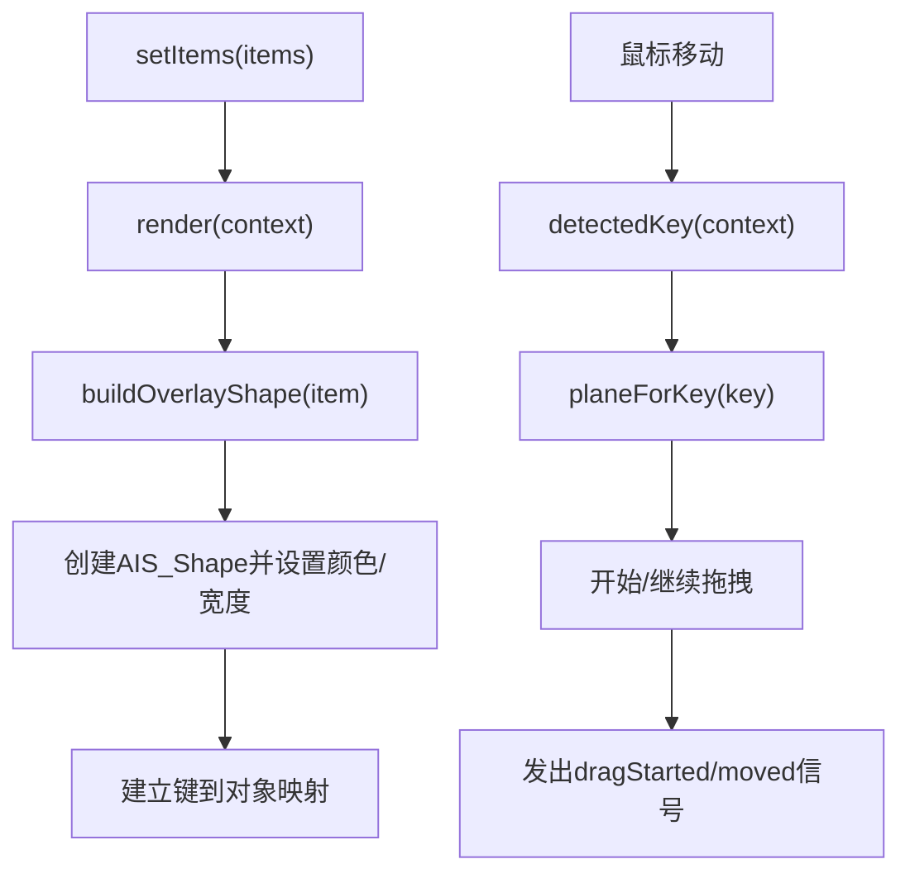
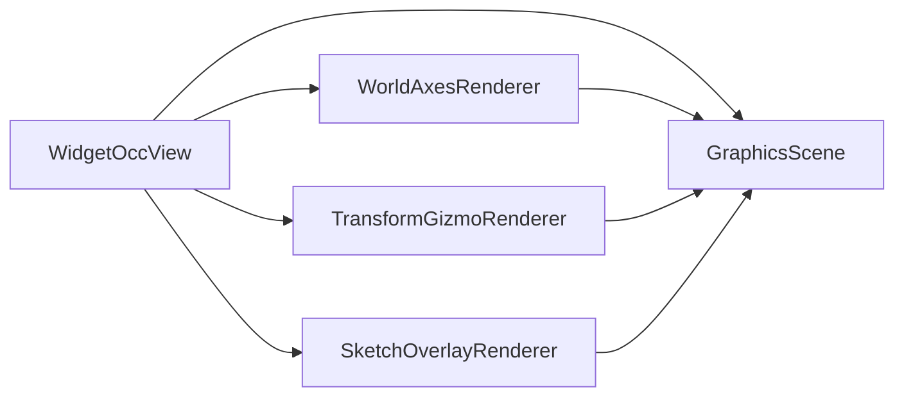

# OCC视图组件

<cite>
**本文引用的文件**
- [widget_occ_view.h](file://src/view/widget_occ_view.h)
- [widget_occ_view.cpp](file://src/view/widget_occ_view.cpp)
- [world_axes_renderer.h](file://src/view/world_axes_renderer.h)
- [world_axes_renderer.cpp](file://src/view/world_axes_renderer.cpp)
- [graphics_scene.h](file://src/view/graphics_scene.h)
- [graphics_scene.cpp](file://src/view/graphics_scene.cpp)
- [transform_gizmo_renderer.h](file://src/view/transform_gizmo_renderer.h)
- [transform_gizmo_renderer.cpp](file://src/view/transform_gizmo_renderer.cpp)
- [sketch_overlay_renderer.h](file://src/view/sketch_overlay_renderer.h)
- [sketch_overlay_renderer.cpp](file://src/view/sketch_overlay_renderer.cpp)
</cite>

## 目录
1. [简介](#简介)
2. [项目结构](#项目结构)
3. [核心组件](#核心组件)
4. [架构总览](#架构总览)
5. [详细组件分析](#详细组件分析)
6. [依赖关系分析](#依赖关系分析)
7. [性能考量](#性能考量)
8. [故障排查指南](#故障排查指南)
9. [结论](#结论)
10. [附录](#附录)

## 简介
本文件系统化梳理LaserCNC项目中的OCC视图组件，重点围绕WidgetOccView类与WorldAxesRenderer的实现机制展开，涵盖以下主题：
- WidgetOccView对OpenCASCADE TQWidget的封装方式、视图渲染管线与事件驱动的用户交互处理
- WorldAxesRenderer世界坐标轴渲染器的单例设计、跨场景挂载与可见性同步机制
- 3D视图的导航控制（旋转、平移、缩放、拟合）、变换 Gizmo 与草图覆盖层的交互流程
- 视图更新机制、重绘优化策略与多视图同步的技术细节
- 自定义视图组件的开发指南与性能调优建议

## 项目结构
OCC视图相关代码位于src/view目录，采用“场景-视图-控件”分层组织：
- GraphicsScene：封装V3d_Viewer与AIS_InteractiveContext，统一管理形状显示、高亮与背景等
- WidgetOccView：继承自QWidget，承载Aspect_NeutralWindow并与V3d_View绑定，处理鼠标/键盘事件与渲染
- WorldAxesRenderer：全局单例，持久化显示世界坐标轴，支持多场景挂载与可见性同步
- TransformGizmoRenderer：轻量级变换Gizmo渲染器，提供移动/旋转部件的拾取与投影
- SketchOverlayRenderer：将草图覆盖项渲染为可拾取的AIS对象，支持拖拽与平面投影

图表来源
- [widget_occ_view.h:37-182](file://src/view/widget_occ_view.h#L37-L182)
- [graphics_scene.h:12-66](file://src/view/graphics_scene.h#L12-L66)
- [world_axes_renderer.h:31-90](file://src/view/world_axes_renderer.h#L31-L90)
- [transform_gizmo_renderer.h:25-56](file://src/view/transform_gizmo_renderer.h#L25-L56)
- [sketch_overlay_renderer.h:28-61](file://src/view/sketch_overlay_renderer.h#L28-L61)

章节来源
- [widget_occ_view.h:37-182](file://src/view/widget_occ_view.h#L37-L182)
- [graphics_scene.h:12-66](file://src/view/graphics_scene.h#L12-L66)
- [world_axes_renderer.h:31-90](file://src/view/world_axes_renderer.h#L31-L90)
- [transform_gizmo_renderer.h:25-56](file://src/view/transform_gizmo_renderer.h#L25-L56)
- [sketch_overlay_renderer.h:28-61](file://src/view/sketch_overlay_renderer.h#L28-L61)

## 核心组件
- WidgetOccView：负责TQWidget封装、视图激活与切换、事件处理、RubberBand多选、变换Gizmo与草图覆盖层交互、网格与预览对象管理、以及与GraphicsScene的协作
- GraphicsScene：封装OCC渲染场景，提供形状显示/重显/擦除、颜色设置、光照与背景配置、OpenGL驱动参数化
- WorldAxesRenderer：全局单例，维护共享的TopoDS_Shape与每场景独立的AIS对象，支持长度调整、可见性同步与自动清理
- TransformGizmoRenderer：渲染移动/旋转部件，提供拾取检测与屏幕向量投影
- SketchOverlayRenderer：将草图覆盖项转换为AIS对象，支持拖拽、平面投影与颜色/宽度设置

章节来源
- [widget_occ_view.cpp:30-800](file://src/view/widget_occ_view.cpp#L30-L800)
- [graphics_scene.cpp:49-236](file://src/view/graphics_scene.cpp#L49-L236)
- [world_axes_renderer.cpp:35-274](file://src/view/world_axes_renderer.cpp#L35-L274)
- [transform_gizmo_renderer.cpp:93-194](file://src/view/transform_gizmo_renderer.cpp#L93-L194)
- [sketch_overlay_renderer.cpp:108-195](file://src/view/sketch_overlay_renderer.cpp#L108-L195)

## 架构总览
WidgetOccView作为视图控件，通过ensureOccWindow创建Aspect_NeutralWindow，并在首次显示时绑定GuiDocument或GraphicsScene对应的V3d_View。GraphicsScene持有V3d_Viewer与AIS_InteractiveContext，统一管理形状与高亮样式。WorldAxesRenderer以单例形式为多个场景提供共享的坐标轴几何与AIS对象，TransformGizmoRenderer与SketchOverlayRenderer则分别提供变换交互与草图覆盖层。

图表来源
- [widget_occ_view.h:37-182](file://src/view/widget_occ_view.h#L37-L182)
- [graphics_scene.h:12-66](file://src/view/graphics_scene.h#L12-L66)
- [world_axes_renderer.h:31-90](file://src/view/world_axes_renderer.h#L31-L90)
- [transform_gizmo_renderer.h:25-56](file://src/view/transform_gizmo_renderer.h#L25-L56)
- [sketch_overlay_renderer.h:28-61](file://src/view/sketch_overlay_renderer.h#L28-L61)

## 详细组件分析

### WidgetOccView：TQWidget封装与事件驱动的视图控件
- TQWidget封装
  - 通过setAttribute启用原生窗口、无系统背景、直接绘制到屏幕，提升渲染效率
  - ensureOccWindow在控件首次显示时创建Aspect_NeutralWindow并绑定winId，随后将V3d_View与AIS_InteractiveContext绑定到该窗口
  - resizeEvent中更新窗口尺寸并触发MustBeResized与Redraw
- 视图激活与切换
  - attachDocument/attachDefaultScene分别用于文档场景与默认场景的视图绑定
  - activateView完成视图/上下文切换、网格同步、Gizmo与覆盖层渲染、以及重绘
- 交互处理
  - 鼠标左键：短点击进行切换选择；长按拖拽进入RubberBand多选；可检测TransformGizmo与SketchOverlay的按下与拖拽
  - 右键：启动旋转；中键：平移；滚轮：缩放；双击左键：拟合所有
  - 键盘：Esc取消引线/面拾取
- 辅助功能
  - LeadInPick/FacePick：用于CAD建模工具的拾取模式，支持确认/取消信号
  - 网格：动态构建XY/YZ/ZX平面网格，支持可见性、步进与捕捉
  - 预览：临时AIS_Shape用于预览未提交的建模操作
  - 信号：selectionChanged、pick相关信号、SketchOverlay拖拽信号、TransformGizmo拖拽信号

图表来源
- [widget_occ_view.cpp:534-787](file://src/view/widget_occ_view.cpp#L534-L787)
- [widget_occ_view.cpp:789-800](file://src/view/widget_occ_view.cpp#L789-L800)

章节来源
- [widget_occ_view.h:37-182](file://src/view/widget_occ_view.h#L37-L182)
- [widget_occ_view.cpp:30-800](file://src/view/widget_occ_view.cpp#L30-L800)

### GraphicsScene：OCC渲染场景封装
- 初始化与驱动配置
  - 创建OpenGl_GraphicDriver并配置VBO、垂直同步等参数
  - 初始化V3d_Viewer，设置默认投影、计算模式、着色模型
  - 创建AIS_InteractiveContext并配置默认显示模式与高亮样式（选中/悬停）
- 形状管理
  - displayShape/redisplayShape/eraseShape/eraseAll提供统一接口
  - setShapeColor支持按对象设置颜色
- 背景与光照
  - setDefaultLighting添加方向光与环境光并启用
  - setGradientBackground注释说明背景在视图层设置
- OpenGL诊断
  - logOpenGlContextState输出OpenGL上下文能力与VBO状态

图表来源
- [graphics_scene.cpp:57-110](file://src/view/graphics_scene.cpp#L57-L110)

章节来源
- [graphics_scene.h:12-66](file://src/view/graphics_scene.h#L12-L66)
- [graphics_scene.cpp:49-236](file://src/view/graphics_scene.cpp#L49-L236)

### WorldAxesRenderer：全局世界坐标轴渲染器
- 单例与生命周期
  - instance返回进程内唯一实例，父对象绑定到QApplication，随应用退出自动释放
- 多场景挂载
  - attach/detach安全地为不同GraphicsScene创建独立AIS对象，监听destroyed自动清理
- 可见性与重建
  - setGloballyVisible同步所有场景的显示/隐藏
  - setAxisLength触发全局重建，清空已显示对象并在下次显示时重建
- 几何与样式
  - rebuildShapes基于轴长构建X/Y/Z轴线与原点球，颜色与线宽固定
  - ensureSceneObjects为每个场景独立创建AIS_Shape实例，避免跨上下文共享冲突

图表来源
- [world_axes_renderer.cpp:95-107](file://src/view/world_axes_renderer.cpp#L95-L107)
- [world_axes_renderer.cpp:129-131](file://src/view/world_axes_renderer.cpp#L129-L131)
- [world_axes_renderer.cpp:167-190](file://src/view/world_axes_renderer.cpp#L167-L190)

章节来源
- [world_axes_renderer.h:31-90](file://src/view/world_axes_renderer.h#L31-L90)
- [world_axes_renderer.cpp:35-274](file://src/view/world_axes_renderer.cpp#L35-L274)

### TransformGizmoRenderer：变换Gizmo渲染与交互
- 状态与渲染
  - setState设置中心点、大小与可见性；render在给定上下文中创建移动轴与旋转环对象并建立键值映射
- 拾取检测
  - detectedPart根据AIS_InteractiveContext的DetectedOwner解析出操作类型与轴索引
- 屏幕投影
  - axisScreenVector将世界空间轴投影到屏幕，返回屏幕向量用于计算拖拽增量

图表来源
- [transform_gizmo_renderer.cpp:93-127](file://src/view/transform_gizmo_renderer.cpp#L93-L127)
- [transform_gizmo_renderer.cpp:150-167](file://src/view/transform_gizmo_renderer.cpp#L150-L167)
- [transform_gizmo_renderer.cpp:169-191](file://src/view/transform_gizmo_renderer.cpp#L169-L191)

章节来源
- [transform_gizmo_renderer.h:15-56](file://src/view/transform_gizmo_renderer.h#L15-L56)
- [transform_gizmo_renderer.cpp:93-194](file://src/view/transform_gizmo_renderer.cpp#L93-L194)

### SketchOverlayRenderer：草图覆盖层渲染与拖拽
- 数据模型
  - SketchOverlayItem包含键、类型、所在平面、参数、可见性、可拖拽性与颜色
- 渲染与拾取
  - render将覆盖项转换为TopoDS_Shape并创建AIS_Shape，建立键到对象的映射
  - detectedKey根据AIS_InteractiveContext的DetectedOwner返回当前命中的键
- 平面投影与拖拽
  - planeForKey与isDraggable提供拖拽约束
  - WidgetOccView在拖拽时通过screenToSketchPlane将屏幕坐标投影到草图平面，计算相对位移

图表来源
- [sketch_overlay_renderer.cpp:108-138](file://src/view/sketch_overlay_renderer.cpp#L108-L138)
- [sketch_overlay_renderer.cpp:161-175](file://src/view/sketch_overlay_renderer.cpp#L161-L175)
- [widget_occ_view.cpp:369-421](file://src/view/widget_occ_view.cpp#L369-L421)

章节来源
- [sketch_overlay_renderer.h:16-61](file://src/view/sketch_overlay_renderer.h#L16-L61)
- [sketch_overlay_renderer.cpp:108-195](file://src/view/sketch_overlay_renderer.cpp#L108-L195)
- [widget_occ_view.cpp:369-421](file://src/view/widget_occ_view.cpp#L369-L421)

## 依赖关系分析
- 组件耦合
  - WidgetOccView强依赖GraphicsScene提供的上下文与Viewer；弱依赖WorldAxesRenderer、TransformGizmoRenderer、SketchOverlayRenderer
  - WorldAxesRenderer与GraphicsScene之间为“场景到对象”的一对多映射，通过键值映射避免重复创建
  - TransformGizmoRenderer/SketchOverlayRenderer均通过AIS_InteractiveContext进行显示/擦除，彼此独立
- 外部依赖
  - OpenCASCADE：V3d_View/AIS_InteractiveContext/V3d_Viewer/AIS_Shape等
  - Qt：QWidget事件系统、信号槽、定时器与属性设置
- 潜在风险
  - 多视图共享同一GraphicsScene时，需确保事件处理与状态复位逻辑正确
  - OCC对象生命周期管理，避免跨上下文共享导致的异常

图表来源
- [widget_occ_view.h:37-182](file://src/view/widget_occ_view.h#L37-L182)
- [graphics_scene.h:12-66](file://src/view/graphics_scene.h#L12-L66)
- [world_axes_renderer.h:31-90](file://src/view/world_axes_renderer.h#L31-L90)
- [transform_gizmo_renderer.h:25-56](file://src/view/transform_gizmo_renderer.h#L25-L56)
- [sketch_overlay_renderer.h:28-61](file://src/view/sketch_overlay_renderer.h#L28-L61)

章节来源
- [widget_occ_view.cpp:446-505](file://src/view/widget_occ_view.cpp#L446-L505)
- [graphics_scene.cpp:57-110](file://src/view/graphics_scene.cpp#L57-L110)

## 性能考量
- 渲染与重绘
  - paintEvent直接调用V3d_View::Redraw，避免额外绘制开销
  - resizeEvent中先SetSize再MustBeResized，减少不必要的重建
  - RubberBand多选仅在阈值超过后创建并更新矩形，降低频繁重绘
- 上下文与驱动
  - GraphicsScene初始化时启用VBO与垂直同步，提升OpenGL渲染性能
  - logOpenGlContextState用于诊断VBO是否生效，便于性能调优
- 选择与高亮
  - 高亮样式使用Prs3d_Drawer，避免强制切换显示模式带来的闪烁
- 建议
  - 控制一次性显示的对象数量，必要时使用批量更新与延迟刷新
  - 对于高频拖拽（如Gizmo/覆盖层），可考虑节流或减少Redraw频率
  - 在多视图场景下，尽量复用GraphicsScene与共享几何，减少内存占用

章节来源
- [widget_occ_view.cpp:529-532](file://src/view/widget_occ_view.cpp#L529-L532)
- [widget_occ_view.cpp:773-779](file://src/view/widget_occ_view.cpp#L773-L779)
- [graphics_scene.cpp:17-47](file://src/view/graphics_scene.cpp#L17-L47)
- [graphics_scene.cpp:133-174](file://src/view/graphics_scene.cpp#L133-L174)

## 故障排查指南
- OCC上下文未初始化
  - 现象：日志提示OpenGL上下文未初始化或驱动非OpenGl_GraphicDriver
  - 排查：确认WidgetOccView已显示且ensureOccWindow成功映射；检查logOpenGlContextState输出
- OCC异常抛出
  - 现象：Standard_Failure/std::exception
  - 排查：关注WorldAxesRenderer在detach/applyVisibilityForScene中的异常捕获与日志
- 视图不刷新
  - 现象：交互后无重绘
  - 排查：确认调用UpdateCurrentViewer与Redraw；检查paintEvent路径
- 拖拽无效
  - 现象：TransformGizmo/覆盖层拖拽无响应
  - 排查：检查detectedPart与detectedKey是否正确解析；screenToSketchPlane投影是否成功

章节来源
- [graphics_scene.cpp:133-174](file://src/view/graphics_scene.cpp#L133-L174)
- [world_axes_renderer.cpp:150-162](file://src/view/world_axes_renderer.cpp#L150-L162)
- [widget_occ_view.cpp:529-532](file://src/view/widget_occ_view.cpp#L529-L532)
- [widget_occ_view.cpp:369-421](file://src/view/widget_occ_view.cpp#L369-L421)

## 结论
本组件体系以WidgetOccView为核心，结合GraphicsScene统一渲染与高亮，辅以WorldAxesRenderer、TransformGizmoRenderer与SketchOverlayRenderer，实现了稳定的3D视图交互与可视化扩展。通过事件驱动与轻量渲染器分离，既保证了交互流畅性，又便于功能扩展与性能优化。建议在多视图与大规模模型场景下，进一步优化批量更新与资源复用策略。

## 附录
- 自定义视图组件开发要点
  - 继承QWidget并启用原生窗口属性，确保与OCC窗口句柄正确绑定
  - 在showEvent中完成OCC窗口映射与视图绑定，避免早期绑定失败
  - 使用GraphicsScene统一管理形状与高亮样式，避免重复创建AIS对象
  - 如需交互元素（如Gizmo/覆盖层），参考TransformGizmoRenderer/SketchOverlayRenderer的键值映射与拾取检测模式
- 性能调优清单
  - 启用VBO与垂直同步，观察日志确认VBO生效
  - 控制一次性显示对象数量，使用批量更新与延迟刷新
  - 避免在高频事件中频繁调用Redraw，必要时合并更新
  - 对多视图共享场景，确保状态复位与清理逻辑正确