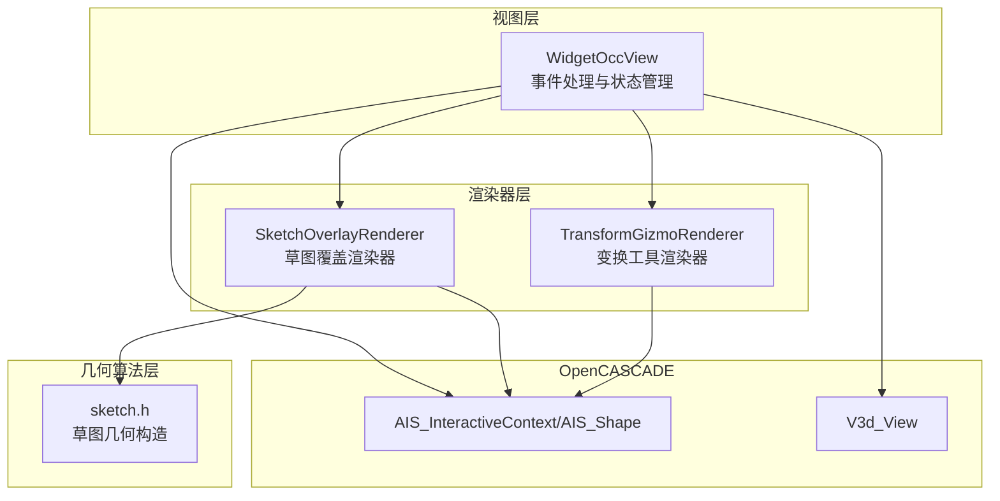
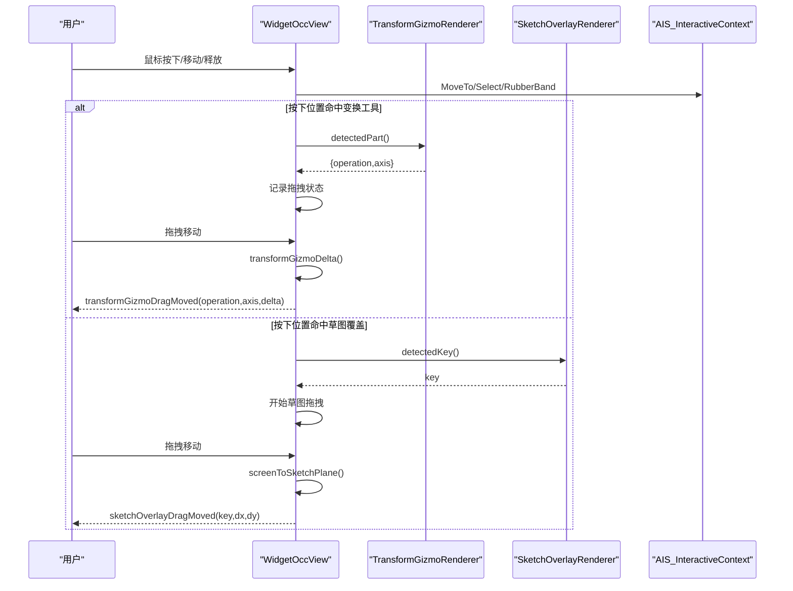
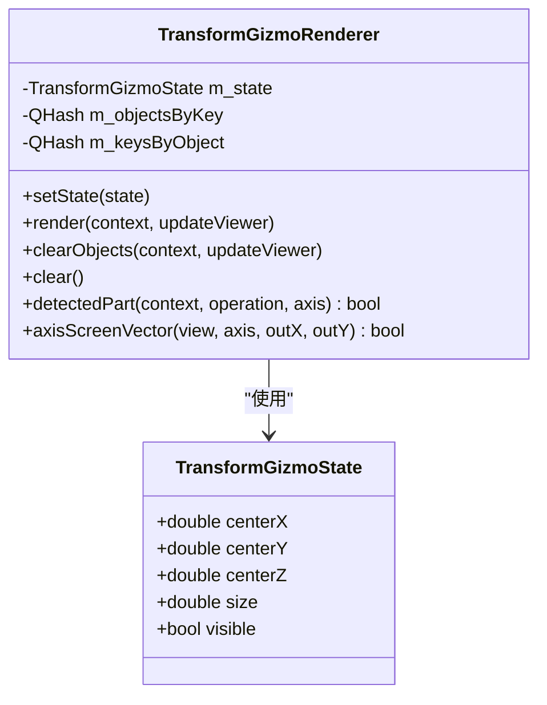
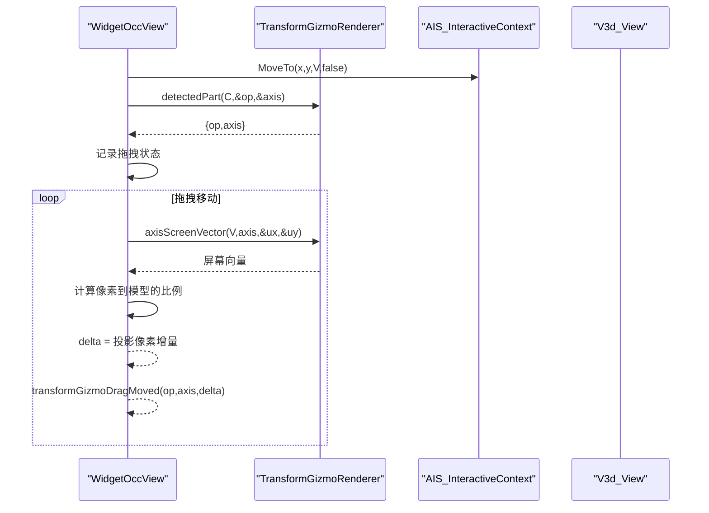
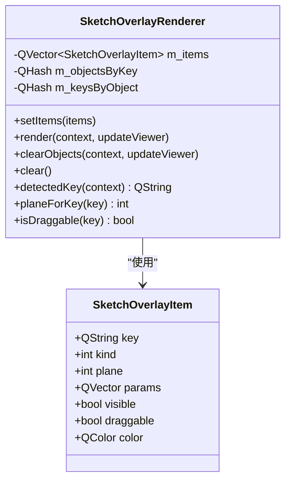
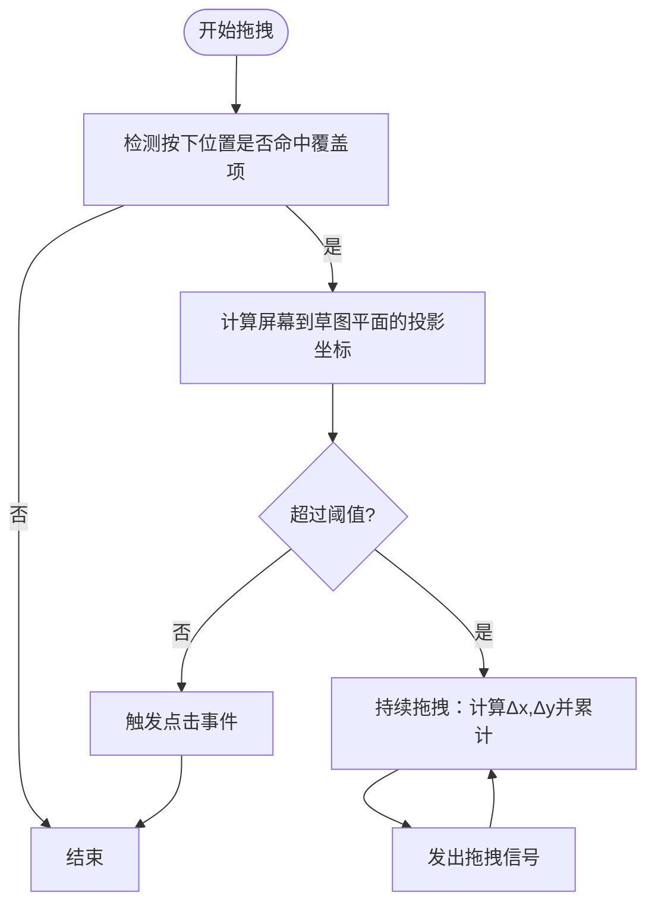
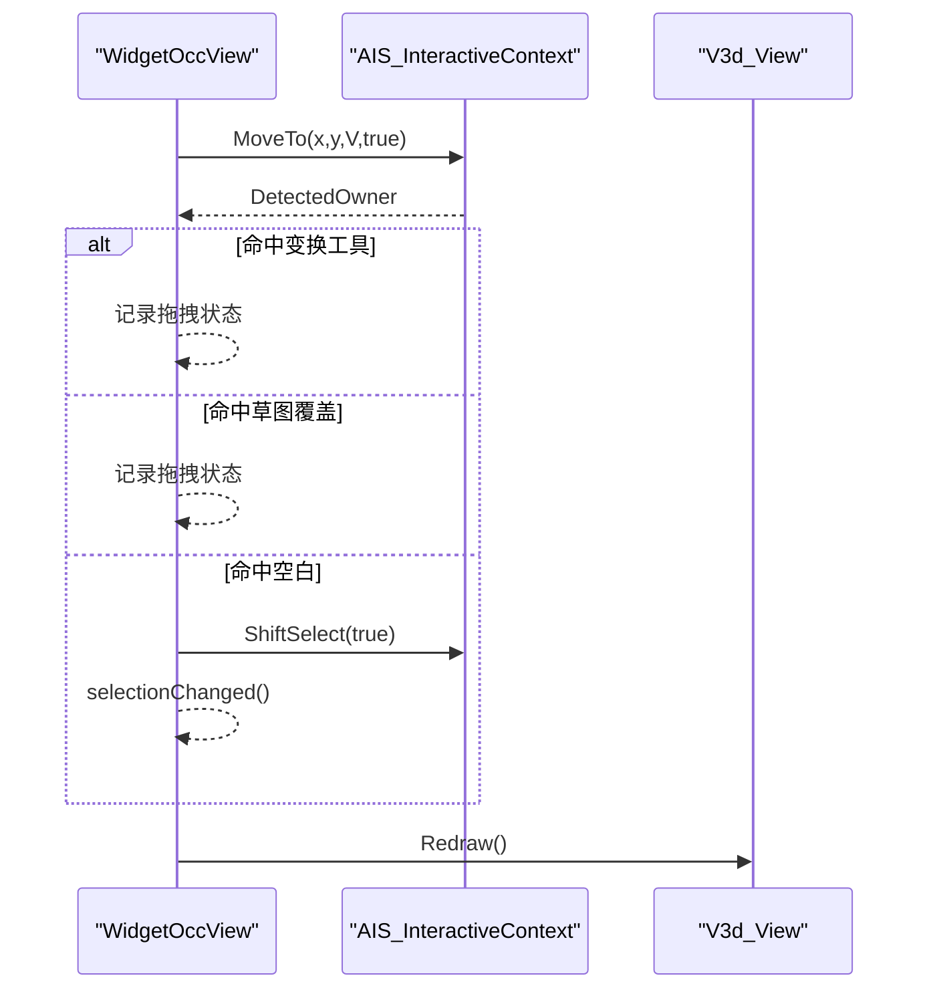
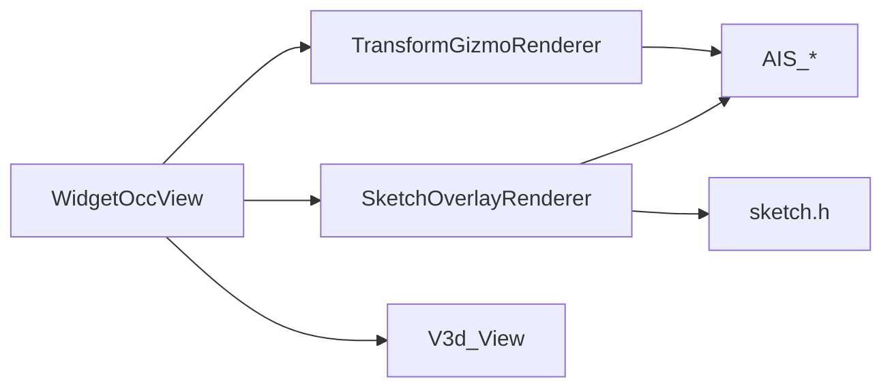

# 交互控件系统

<cite>
**本文档引用的文件**
- [transform_gizmo_renderer.h](file://src/view/transform_gizmo_renderer.h)
- [transform_gizmo_renderer.cpp](file://src/view/transform_gizmo_renderer.cpp)
- [sketch_overlay_renderer.h](file://src/view/sketch_overlay_renderer.h)
- [sketch_overlay_renderer.cpp](file://src/view/sketch_overlay_renderer.cpp)
- [widget_occ_view.h](file://src/view/widget_occ_view.h)
- [widget_occ_view.cpp](file://src/view/widget_occ_view.cpp)
- [sketch.h](file://src/core/algorithms/cad/sketch.h)
</cite>

## 目录
1. [简介](#简介)
2. [项目结构](#项目结构)
3. [核心组件](#核心组件)
4. [架构概览](#架构概览)
5. [详细组件分析](#详细组件分析)
6. [依赖关系分析](#依赖关系分析)
7. [性能考量](#性能考量)
8. [故障排除指南](#故障排除指南)
9. [结论](#结论)
10. [附录](#附录)

## 简介
本文件面向LaserCNC的交互控件系统，重点解析两个关键渲染器：TransformGizmoRenderer（变换工具渲染器）与SketchOverlayRenderer（草图覆盖渲染器）。内容涵盖：
- 变换工具渲染器的实现机制：平移、旋转、缩放的可视化表示与交互识别
- 草图覆盖渲染器的功能：将草图元素以可选择的临时几何体形式叠加到视图中，并提供拖拽反馈
- 事件处理、状态管理与视觉反馈的实现原理
- 自定义交互控件的开发指南、用户体验优化与跨平台兼容性建议

## 项目结构
交互控件系统主要由以下模块组成：
- 视图层：WidgetOccView负责承载OpenCASCADE视图、处理鼠标/键盘事件、协调渲染器
- 渲染器层：TransformGizmoRenderer与SketchOverlayRenderer分别负责变换工具与草图覆盖的绘制与检测
- 几何算法层：core/algorithms/cad/sketch.h提供草图元素的几何构造支持

**图表来源**
- [widget_occ_view.h:37-182](file://src/view/widget_occ_view.h#L37-L182)
- [transform_gizmo_renderer.h:25-56](file://src/view/transform_gizmo_renderer.h#L25-L56)
- [sketch_overlay_renderer.h:28-61](file://src/view/sketch_overlay_renderer.h#L28-L61)
- [sketch.h:9-81](file://src/core/algorithms/cad/sketch.h#L9-L81)

**章节来源**
- [widget_occ_view.h:19-95](file://src/view/widget_occ_view.h#L19-L95)
- [transform_gizmo_renderer.h:15-56](file://src/view/transform_gizmo_renderer.h#L15-L56)
- [sketch_overlay_renderer.h:16-61](file://src/view/sketch_overlay_renderer.h#L16-L61)

## 核心组件
- TransformGizmoRenderer：在视图坐标系中渲染可选择的移动/旋转变换工具，支持检测当前选中的操作类型与轴向，并提供屏幕方向投影用于拖拽计算
- SketchOverlayRenderer：将草图覆盖项渲染为可选择的临时几何体，支持检测点击目标、判断拖拽能力与所属平面
- WidgetOccView：事件总线，负责鼠标/键盘输入分发、状态切换、RubberBand多选、网格对齐、变换工具与草图覆盖的生命周期管理

**章节来源**
- [transform_gizmo_renderer.h:24-56](file://src/view/transform_gizmo_renderer.h#L24-L56)
- [sketch_overlay_renderer.h:27-61](file://src/view/sketch_overlay_renderer.h#L27-L61)
- [widget_occ_view.h:79-111](file://src/view/widget_occ_view.h#L79-L111)

## 架构概览
交互控件系统采用“视图协调 + 渲染器分离”的模式：
- WidgetOccView持有AIS上下文与视图句柄，统一管理渲染器的显示/清除与事件回调
- TransformGizmoRenderer与SketchOverlayRenderer各自维护轻量状态与对象映射表，确保渲染与检测解耦
- 通过OpenCASCADE的AIS_Shape与AIS_InteractiveContext实现可选择的几何对象与拾取检测

**图表来源**
- [widget_occ_view.cpp:534-771](file://src/view/widget_occ_view.cpp#L534-L771)
- [transform_gizmo_renderer.cpp:150-167](file://src/view/transform_gizmo_renderer.cpp#L150-L167)
- [sketch_overlay_renderer.cpp:161-175](file://src/view/sketch_overlay_renderer.cpp#L161-L175)

## 详细组件分析

### TransformGizmoRenderer（变换工具渲染器）
TransformGizmoRenderer负责在视图中渲染一个可选择的变换工具，包含三根轴向的移动线段与三个圆环（代表绕轴旋转），并提供检测与屏幕投影能力。

- 数据结构与职责
  - TransformGizmoState：保存中心点坐标、尺寸与可见性
  - 内部映射：按键到AIS_Shape对象、对象到键的双向映射，便于检测与清理
- 渲染流程
  - 清理旧对象 -> 若可见则按轴循环生成移动线段与旋转圆环 -> 设置颜色/线宽 -> 注册映射 -> 更新查看器
- 检测机制
  - 通过AIS_InteractiveContext的DetectedOwner反推AIS_InteractiveObject，再查映射得到键，解析出operation与axis
- 屏幕投影
  - 将世界坐标轴向投影到屏幕，返回屏幕向量用于拖拽增量计算

**图表来源**
- [transform_gizmo_renderer.h:16-53](file://src/view/transform_gizmo_renderer.h#L16-L53)

**章节来源**
- [transform_gizmo_renderer.h:15-56](file://src/view/transform_gizmo_renderer.h#L15-L56)
- [transform_gizmo_renderer.cpp:93-127](file://src/view/transform_gizmo_renderer.cpp#L93-L127)
- [transform_gizmo_renderer.cpp:150-191](file://src/view/transform_gizmo_renderer.cpp#L150-L191)

#### 变换工具拖拽序列

**图表来源**
- [widget_occ_view.cpp:86-107](file://src/view/widget_occ_view.cpp#L86-L107)
- [transform_gizmo_renderer.cpp:169-191](file://src/view/transform_gizmo_renderer.cpp#L169-L191)

### SketchOverlayRenderer（草图覆盖渲染器）
SketchOverlayRenderer将草图覆盖项渲染为可选择的临时几何体，支持点击检测、拖拽启动与平面信息查询。

- 数据结构与职责
  - SketchOverlayItem：包含键、类型、所在平面、参数数组、可见性、可拖拽性与颜色
  - 内部映射：键到AIS_Shape、对象到键，用于检测与清理
- 渲染流程
  - 清理旧对象 -> 过滤可见项 -> 依据类型构建形状（点、线、圆弧、圆、矩形、多边形）-> 显示并设置颜色/线宽 -> 建立映射 -> 更新查看器
- 检测与平面/拖拽能力
  - detectedKey：从AIS_InteractiveContext的DetectedOwner反推键
  - planeForKey：根据键查找所属平面
  - isDraggable：根据键判断是否允许拖拽

**图表来源**
- [sketch_overlay_renderer.h:17-59](file://src/view/sketch_overlay_renderer.h#L17-L59)

**章节来源**
- [sketch_overlay_renderer.h:16-61](file://src/view/sketch_overlay_renderer.h#L16-L61)
- [sketch_overlay_renderer.cpp:108-138](file://src/view/sketch_overlay_renderer.cpp#L108-L138)
- [sketch_overlay_renderer.cpp:161-193](file://src/view/sketch_overlay_renderer.cpp#L161-L193)
- [sketch.h:36-81](file://src/core/algorithms/cad/sketch.h#L36-L81)

#### 草图覆盖拖拽流程

**图表来源**
- [widget_occ_view.cpp:692-718](file://src/view/widget_occ_view.cpp#L692-L718)
- [widget_occ_view.cpp:369-421](file://src/view/widget_occ_view.cpp#L369-L421)

### WidgetOccView（事件协调器）
WidgetOccView作为视图容器，负责：
- 文档/视图激活与切换，保持相机状态
- 鼠标事件分发：左键选择/拖拽、右键旋转、中键平移、滚轮缩放、双击整屏
- RubberBand多选框显示与选择结果
- 变换工具与草图覆盖的显示/清除与状态重置
- 键盘快捷键：ESC清空选择、F整屏、数字键定向

**图表来源**
- [widget_occ_view.cpp:830-862](file://src/view/widget_occ_view.cpp#L830-L862)

**章节来源**
- [widget_occ_view.h:19-182](file://src/view/widget_occ_view.h#L19-L182)
- [widget_occ_view.cpp:507-826](file://src/view/widget_occ_view.cpp#L507-L826)

## 依赖关系分析
- TransformGizmoRenderer依赖OpenCASCADE的AIS_InteractiveContext/AIS_Shape/V3d_View进行几何绘制与检测
- SketchOverlayRenderer依赖core/algorithms/cad/sketch.h提供的草图几何构造函数
- WidgetOccView同时依赖两个渲染器，并通过信号与槽向外暴露交互事件

**图表来源**
- [widget_occ_view.h:11-12](file://src/view/widget_occ_view.h#L11-L12)
- [transform_gizmo_renderer.cpp:5-18](file://src/view/transform_gizmo_renderer.cpp#L5-L18)
- [sketch_overlay_renderer.cpp:3-15](file://src/view/sketch_overlay_renderer.cpp#L3-L15)

**章节来源**
- [widget_occ_view.h:11-12](file://src/view/widget_occ_view.h#L11-L12)
- [transform_gizmo_renderer.cpp:5-18](file://src/view/transform_gizmo_renderer.cpp#L5-L18)
- [sketch_overlay_renderer.cpp:3-15](file://src/view/sketch_overlay_renderer.cpp#L3-L15)

## 性能考量
- 批量更新：渲染与清理时尽量避免逐项刷新，使用updateViewer参数控制一次性刷新
- 对象复用：通过按键映射减少重复创建AIS_Shape，清理时统一擦除
- 拖拽计算：变换工具的像素到模型比例通过视图转换因子计算，避免频繁开销
- 选择检测：仅在需要时调用MoveTo并启用hover高亮，减少不必要的拾取计算

## 故障排除指南
- 变换工具不显示
  - 检查状态visible与context是否为空
  - 确认render后调用了UpdateCurrentViewer与Redraw
- 拖拽无响应
  - 确认detectedPart返回了有效operation与axis
  - 检查axisScreenVector是否成功投影到屏幕向量
- 草图覆盖点击无效
  - 确认setItems已调用且items可见
  - 检查detectedKey是否能正确反推键
- 拖拽平面不正确
  - 确认screenToSketchPlane的planeKind与实际一致
  - 检查网格吸附对坐标的影响

**章节来源**
- [transform_gizmo_renderer.cpp:98-127](file://src/view/transform_gizmo_renderer.cpp#L98-L127)
- [sketch_overlay_renderer.cpp:113-138](file://src/view/sketch_overlay_renderer.cpp#L113-L138)
- [widget_occ_view.cpp:534-585](file://src/view/widget_occ_view.cpp#L534-L585)
- [widget_occ_view.cpp:657-771](file://src/view/widget_occ_view.cpp#L657-L771)

## 结论
交互控件系统通过清晰的职责划分与事件驱动机制，实现了变换工具与草图覆盖的高效渲染与交互。TransformGizmoRenderer与SketchOverlayRenderer分别承担可视化与检测，WidgetOccView统一协调事件与状态，形成高内聚、低耦合的架构。遵循本文的开发指南与优化建议，可在保证跨平台兼容性的前提下进一步提升用户体验。

## 附录

### 自定义交互控件开发指南
- 设计数据模型：定义轻量状态结构，便于渲染器独立管理
- 渲染策略：优先使用AIS_Shape，批量显示/隐藏，减少刷新次数
- 检测机制：建立对象到键的映射，利用AIS_InteractiveContext的DetectedOwner进行反推
- 事件处理：在WidgetOccView中集中处理鼠标/键盘事件，按需发射信号
- 用户体验：提供hover高亮、RubberBand多选、网格吸附等辅助功能

### 跨平台兼容性建议
- 使用Qt属性与事件接口，避免直接依赖平台特定窗口句柄
- 在显示事件后延迟初始化OCC窗口，确保HWND可用
- 统一颜色与线宽设置，避免不同平台渲染差异过大
- 控制刷新频率，避免在高DPI或慢设备上出现卡顿