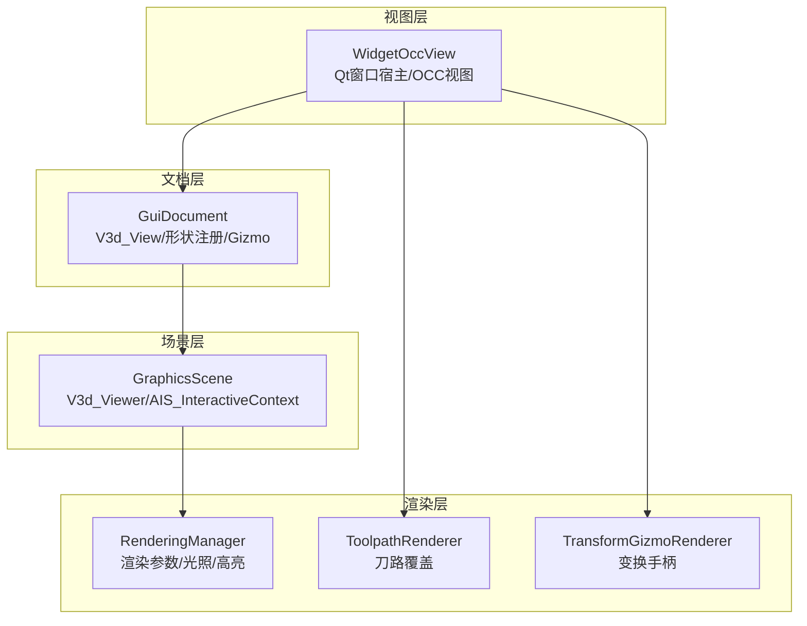
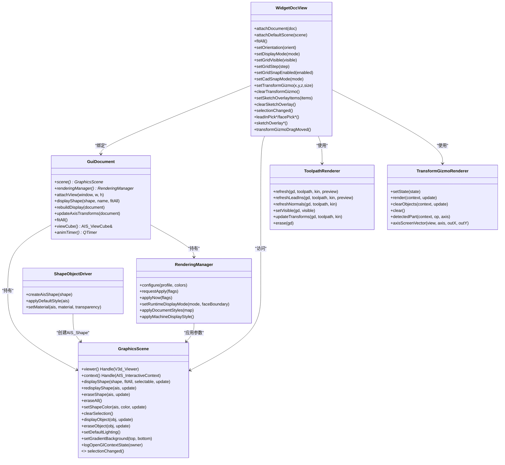
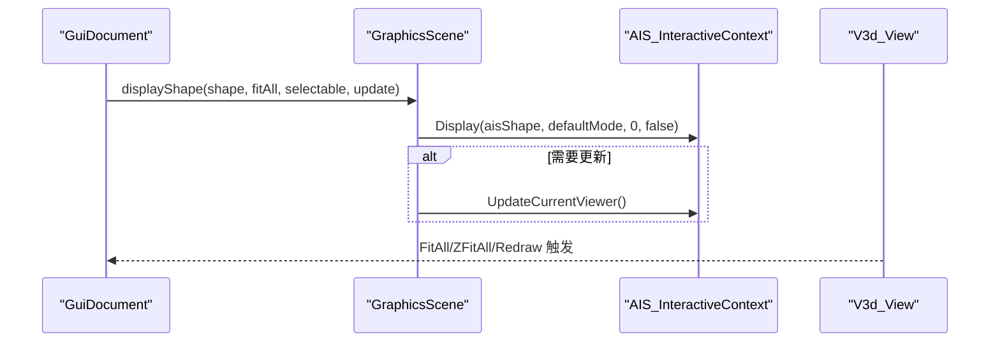
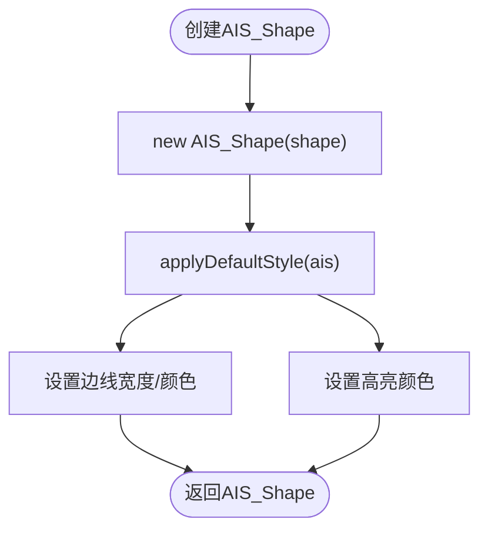
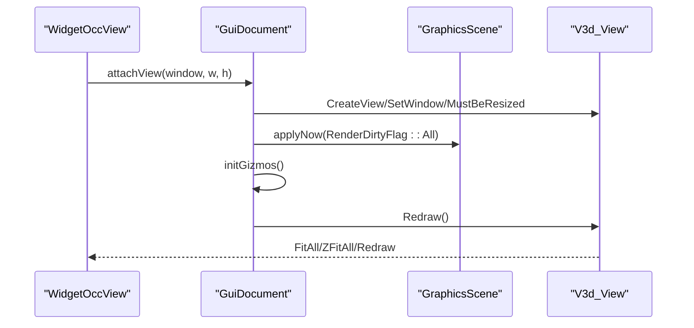
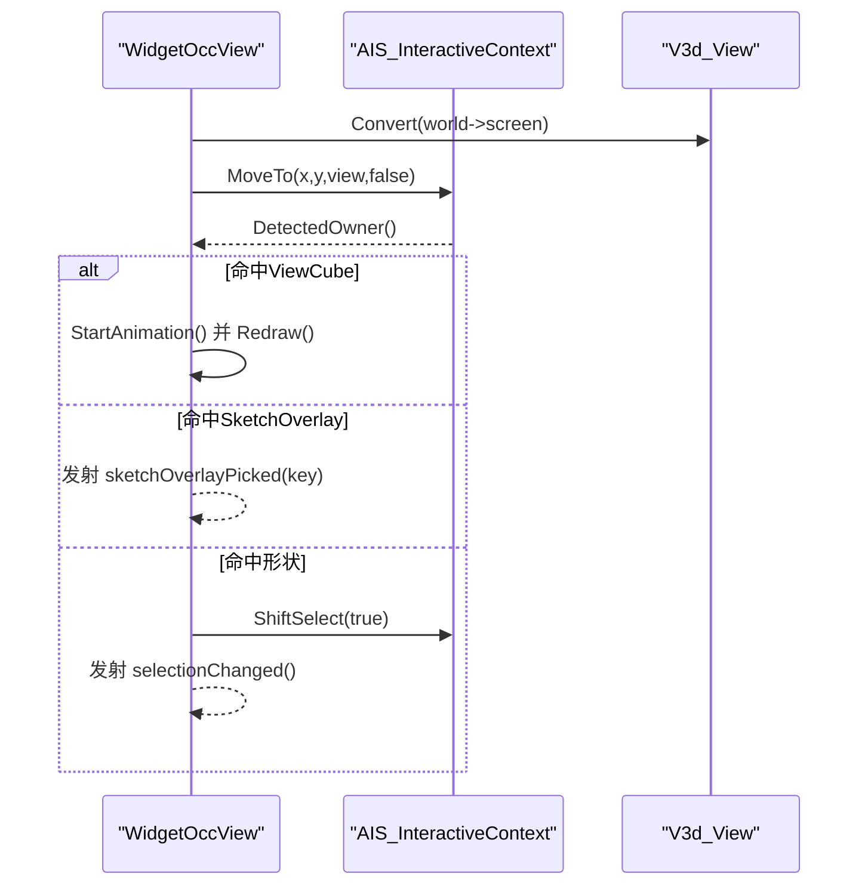
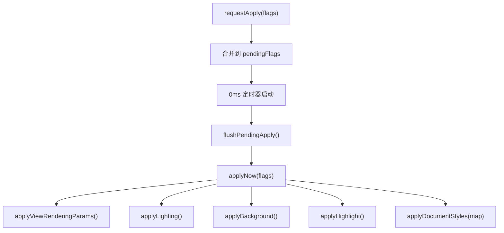
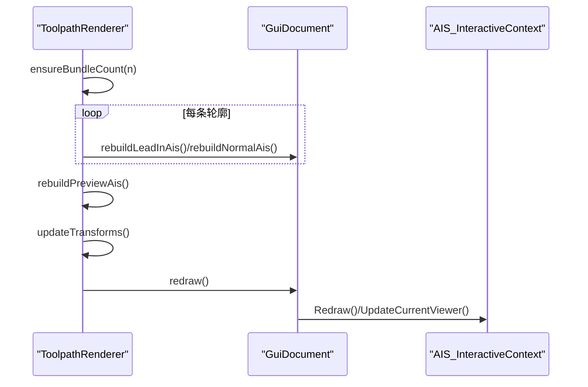
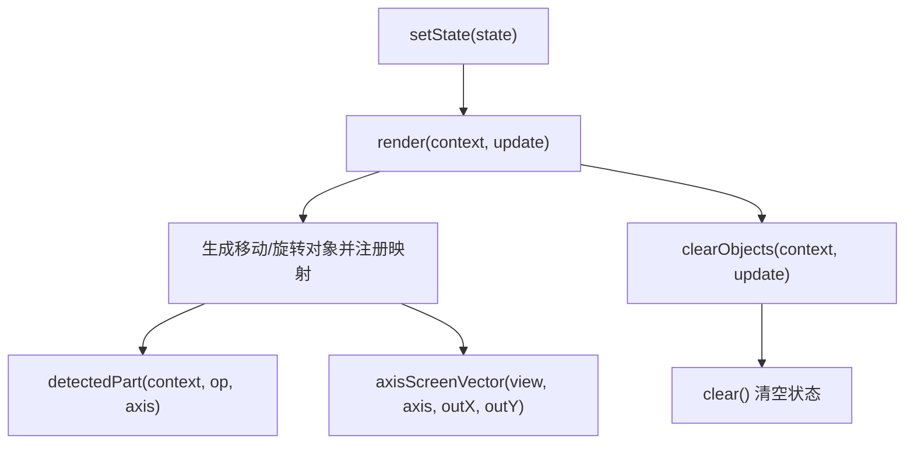
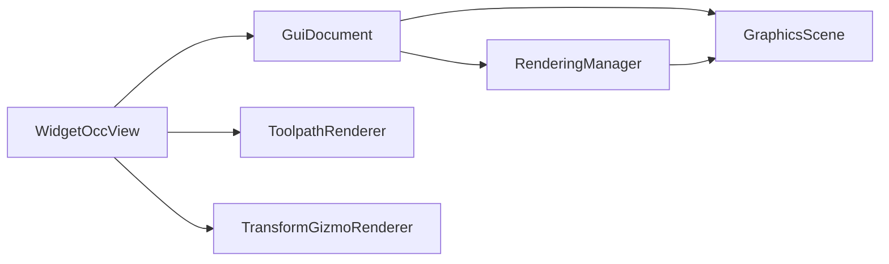

# 图形场景管理

<cite>
**本文引用的文件**
- [graphics_scene.h](file://src/view/graphics_scene.h)
- [graphics_scene.cpp](file://src/view/graphics_scene.cpp)
- [shape_object_driver.h](file://src/view/shape_object_driver.h)
- [shape_object_driver.cpp](file://src/view/shape_object_driver.cpp)
- [widget_occ_view.h](file://src/view/widget_occ_view.h)
- [widget_occ_view.cpp](file://src/view/widget_occ_view.cpp)
- [gui_document.h](file://src/view/gui_document.h)
- [gui_document.cpp](file://src/view/gui_document.cpp)
- [rendering_manager.h](file://src/view/rendering_manager.h)
- [rendering_manager.cpp](file://src/view/rendering_manager.cpp)
- [toolpath_renderer.h](file://src/view/toolpath_renderer.h)
- [toolpath_renderer.cpp](file://src/view/toolpath_renderer.cpp)
- [transform_gizmo_renderer.h](file://src/view/transform_gizmo_renderer.h)
- [transform_gizmo_renderer.cpp](file://src/view/transform_gizmo_renderer.cpp)
</cite>

## 目录
1. [简介](#简介)
2. [项目结构](#项目结构)
3. [核心组件](#核心组件)
4. [架构总览](#架构总览)
5. [详细组件分析](#详细组件分析)
6. [依赖分析](#依赖分析)
7. [性能考虑](#性能考虑)
8. [故障排查指南](#故障排查指南)
9. [结论](#结论)
10. [附录](#附录)

## 简介
本文件系统化阐述LaserCNC图形场景管理子系统的设计与实现，重点围绕以下目标展开：
- GraphicsScene类的架构设计与职责边界：场景对象管理、事件处理机制、渲染协调。
- ShapeObjectDriver的作用与几何对象驱动机制，以及与OpenCASCADE数据结构的映射关系。
- 场景坐标系统、视图变换与选择机制的实现细节。
- 场景扩展的最佳实践、性能优化技巧与常见问题的解决方案。

## 项目结构
图形场景管理位于src/view目录，采用“场景-文档-视图-渲染器”的分层组织：
- 场景层：GraphicsScene封装OCC的V3d_Viewer与AIS_InteractiveContext，统一管理形状显示、高亮与背景。
- 文档层：GuiDocument持有GraphicsScene与V3d_View，负责形状注册、域级重建、轴变换更新与Gizmo管理。
- 视图层：WidgetOccView承载Qt窗口，桥接OCC视图与GUI交互，实现导航、选择与覆盖渲染。
- 渲染层：RenderingManager集中管理渲染参数、光照、背景与高亮样式，支持增量刷新。
- 渲染器：ToolpathRenderer、TransformGizmoRenderer等提供特定领域的可视化覆盖。

图表来源
- [widget_occ_view.h:37-182](file://src/view/widget_occ_view.h#L37-L182)
- [graphics_scene.h:19-66](file://src/view/graphics_scene.h#L19-L66)
- [gui_document.h:35-144](file://src/view/gui_document.h#L35-L144)
- [rendering_manager.h:38-101](file://src/view/rendering_manager.h#L38-L101)
- [toolpath_renderer.h:22-111](file://src/view/toolpath_renderer.h#L22-L111)
- [transform_gizmo_renderer.h:25-55](file://src/view/transform_gizmo_renderer.h#L25-L55)

章节来源
- [widget_occ_view.h:19-182](file://src/view/widget_occ_view.h#L19-L182)
- [graphics_scene.h:12-66](file://src/view/graphics_scene.h#L12-L66)
- [gui_document.h:25-144](file://src/view/gui_document.h#L25-L144)
- [rendering_manager.h:17-101](file://src/view/rendering_manager.h#L17-L101)
- [toolpath_renderer.h:14-111](file://src/view/toolpath_renderer.h#L14-L111)
- [transform_gizmo_renderer.h:15-55](file://src/view/transform_gizmo_renderer.h#L15-L55)

## 核心组件
- GraphicsScene：封装OCC Viewer与InteractiveContext，提供形状显示/重显/删除、颜色设置、默认光照与渐变背景、OpenGL上下文诊断等能力。
- ShapeObjectDriver：薄层辅助类，负责从原始TopoDS_Shape创建AIS_Shape并应用默认外观（边线、高亮、材质与透明度）。
- GuiDocument：文档级容器，持有GraphicsScene与V3d_View，维护形状注册表、域重建、轴变换与Gizmo（ViewCube/Trihedron）。
- WidgetOccView：Qt窗口部件，承载OCC视图，实现鼠标/键盘交互、RubberBand多选、导航操作与覆盖渲染（Sketch/TransformGizmo）。
- RenderingManager：渲染参数管理器，支持增量刷新dirty flags，批量应用渲染配置、光照与高亮样式。
- ToolpathRenderer/TransformGizmoRenderer：领域专用渲染器，分别负责刀路覆盖与变换手柄的生成与更新。

章节来源
- [graphics_scene.h:19-66](file://src/view/graphics_scene.h#L19-L66)
- [graphics_scene.cpp:49-236](file://src/view/graphics_scene.cpp#L49-L236)
- [shape_object_driver.h:15-29](file://src/view/shape_object_driver.h#L15-L29)
- [shape_object_driver.cpp:10-41](file://src/view/shape_object_driver.cpp#L10-L41)
- [gui_document.h:35-144](file://src/view/gui_document.h#L35-L144)
- [gui_document.cpp:54-200](file://src/view/gui_document.cpp#L54-L200)
- [widget_occ_view.h:37-182](file://src/view/widget_occ_view.h#L37-L182)
- [widget_occ_view.cpp:30-200](file://src/view/widget_occ_view.cpp#L30-L200)
- [rendering_manager.h:38-101](file://src/view/rendering_manager.h#L38-L101)
- [rendering_manager.cpp:136-453](file://src/view/rendering_manager.cpp#L136-L453)
- [toolpath_renderer.h:22-111](file://src/view/toolpath_renderer.h#L22-L111)
- [toolpath_renderer.cpp:36-200](file://src/view/toolpath_renderer.cpp#L36-L200)
- [transform_gizmo_renderer.h:25-55](file://src/view/transform_gizmo_renderer.h#L25-L55)
- [transform_gizmo_renderer.cpp:93-193](file://src/view/transform_gizmo_renderer.cpp#L93-L193)

## 架构总览
图形场景管理遵循“场景-文档-视图-渲染器”分层，核心交互如下：
- GuiDocument持有GraphicsScene与V3d_View，负责形状注册与重建。
- WidgetOccView绑定GuiDocument的V3d_View，处理用户输入与渲染更新。
- RenderingManager集中管理渲染参数与高亮样式，通过0ms定时器合并应用，避免UI阻塞。
- ShapeObjectDriver统一创建与配置AIS_Shape外观，确保一致性。
- ToolpathRenderer/TransformGizmoRenderer作为覆盖层，按需生成与更新特定可视化元素。

图表来源
- [graphics_scene.h:19-66](file://src/view/graphics_scene.h#L19-L66)
- [gui_document.h:35-144](file://src/view/gui_document.h#L35-L144)
- [widget_occ_view.h:37-182](file://src/view/widget_occ_view.h#L37-L182)
- [rendering_manager.h:38-101](file://src/view/rendering_manager.h#L38-L101)
- [shape_object_driver.h:15-29](file://src/view/shape_object_driver.h#L15-L29)
- [toolpath_renderer.h:22-111](file://src/view/toolpath_renderer.h#L22-L111)
- [transform_gizmo_renderer.h:25-55](file://src/view/transform_gizmo_renderer.h#L25-L55)

## 详细组件分析

### GraphicsScene：场景核心
- 职责
  - 初始化OCC图形驱动与Viewer，配置默认投影、着色模型与背景。
  - 管理AIS_InteractiveContext，提供形状显示/重显/删除、颜色设置与选择清理。
  - 提供默认光照与背景设置接口，记录OpenGL上下文诊断信息。
- 关键点
  - 通过InteractiveContext的Display/Redisplay/Erase管线控制形状生命周期。
  - 高亮样式与悬停样式分离，避免与用户显示模式冲突。
  - 背景渐变在视图层设置，避免OCCT版本差异导致的兼容性问题。

图表来源
- [graphics_scene.cpp:177-190](file://src/view/graphics_scene.cpp#L177-L190)
- [gui_document.cpp:80-148](file://src/view/gui_document.cpp#L80-L148)

章节来源
- [graphics_scene.h:26-66](file://src/view/graphics_scene.h#L26-L66)
- [graphics_scene.cpp:49-236](file://src/view/graphics_scene.cpp#L49-L236)

### ShapeObjectDriver：几何对象驱动机制
- 职责
  - 从TopoDS_Shape创建AIS_Shape并应用默认外观（边线宽度、颜色、高亮色）。
  - 支持材质与透明度设置，便于后续渲染器统一风格。
- 数据结构与复杂度
  - 复杂度为O(1)，主要为属性设置与AIS_Shape构造。
- 与OpenCASCADE映射
  - AIS_Shape包装TopoDS_Shape，Prs3d_Drawer控制边线与着色外观。
  - Material/Transparency通过Graphic3d_MaterialAspect与SetMaterial/Transparency设置。

图表来源
- [shape_object_driver.cpp:10-41](file://src/view/shape_object_driver.cpp#L10-L41)

章节来源
- [shape_object_driver.h:9-29](file://src/view/shape_object_driver.h#L9-L29)
- [shape_object_driver.cpp:10-41](file://src/view/shape_object_driver.cpp#L10-L41)

### GuiDocument：文档级场景管理
- 职责
  - 维护GraphicsScene与V3d_View，创建Gizmo（ViewCube/Trihedron）。
  - 管理形状注册表，支持按域重建、按标签擦除与整体重建。
  - 应用轴变换（机器/工件）与运行时显示模式，确保FitAll与首次渲染正确性。
- 关键流程
  - 首次attachView时先应用渲染参数，再初始化Gizmo并执行Redraw。
  - rebuildDisplay按域重组形状，applyMachineDisplayStyle批量应用样式。

图表来源
- [gui_document.cpp:80-129](file://src/view/gui_document.cpp#L80-L129)

章节来源
- [gui_document.h:35-144](file://src/view/gui_document.h#L35-L144)
- [gui_document.cpp:54-200](file://src/view/gui_document.cpp#L54-L200)

### WidgetOccView：视图交互与选择
- 职责
  - 承载OCC视图，响应鼠标/键盘事件，实现导航（旋转/平移/缩放/拟合）、RubberBand多选与Sketch覆盖。
  - 管理TransformGizmo与SketchOverlay的拖拽状态，发射信号供上层处理。
- 选择机制
  - MoveTo定位后通过DetectedOwner判断是否命中ViewCube或SketchOverlay。
  - ShiftSelect实现叠加/取消选择；ESC清空选择。
- 坐标系统与视图变换
  - 通过V3d_View的Convert进行世界坐标与屏幕坐标的转换。
  - TransformGizmoRenderer提供轴向屏幕向量计算，用于拖拽增量换算。

图表来源
- [widget_occ_view.cpp:830-863](file://src/view/widget_occ_view.cpp#L830-L863)
- [transform_gizmo_renderer.cpp:169-193](file://src/view/transform_gizmo_renderer.cpp#L169-L193)

章节来源
- [widget_occ_view.h:19-182](file://src/view/widget_occ_view.h#L19-L182)
- [widget_occ_view.cpp:30-200](file://src/view/widget_occ_view.cpp#L30-L200)

### RenderingManager：渲染参数与样式管理
- 职责
  - 接收RenderDirtyFlags，通过0ms定时器合并应用，避免频繁遍历模型。
  - 应用渲染参数（方法、抗锯齿、阴影、LOD、材质）、背景与高亮样式。
  - 批量更新文档中AIS_Shape的颜色、材质与偏差参数，区分机台/工件/其他实体。
- 性能策略
  - 使用QTimer单次触发与合并pending flags，减少UI阻塞。
  - 仅对已显示对象应用运行时显示模式，避免全量重算。

图表来源
- [rendering_manager.cpp:166-198](file://src/view/rendering_manager.cpp#L166-L198)
- [rendering_manager.cpp:440-453](file://src/view/rendering_manager.cpp#L440-L453)

章节来源
- [rendering_manager.h:17-101](file://src/view/rendering_manager.h#L17-L101)
- [rendering_manager.cpp:136-453](file://src/view/rendering_manager.cpp#L136-L453)

### ToolpathRenderer：刀路覆盖渲染
- 职责
  - 基于LaserToolpath生成引入线、法线与轮廓覆盖AIS，支持按轮廓增量刷新与可见性切换。
  - 将工件局部变换应用于覆盖AIS，保证与工件运动同步。
- 关键点
  - rebuildLeadInAis/rebuildNormalAis按轮廓索引生成对应AIS。
  - updateTransforms通过applyLocalTransform与RecomputePrsOnly高效更新。

图表来源
- [toolpath_renderer.cpp:47-68](file://src/view/toolpath_renderer.cpp#L47-L68)
- [toolpath_renderer.cpp:139-169](file://src/view/toolpath_renderer.cpp#L139-L169)

章节来源
- [toolpath_renderer.h:22-111](file://src/view/toolpath_renderer.h#L22-L111)
- [toolpath_renderer.cpp:36-200](file://src/view/toolpath_renderer.cpp#L36-L200)

### TransformGizmoRenderer：变换手柄渲染
- 职责
  - 渲染可选择的移动/旋转手柄，支持检测点击部件（operation,axis）与屏幕向量投影。
  - 通过setState/render/clear管理状态与对象映射，避免重复创建。
- 与WidgetOccView协作
  - WidgetOccView在拖拽时计算像素位移，TransformGizmoRenderer将其投影到模型空间增量。

图表来源
- [transform_gizmo_renderer.h:25-55](file://src/view/transform_gizmo_renderer.h#L25-L55)
- [transform_gizmo_renderer.cpp:93-193](file://src/view/transform_gizmo_renderer.cpp#L93-L193)

章节来源
- [transform_gizmo_renderer.h:15-55](file://src/view/transform_gizmo_renderer.h#L15-L55)
- [transform_gizmo_renderer.cpp:48-193](file://src/view/transform_gizmo_renderer.cpp#L48-L193)

## 依赖分析
- 组件耦合
  - GuiDocument强依赖GraphicsScene与RenderingManager，弱依赖WidgetOccView（通过信号交互）。
  - WidgetOccView依赖GuiDocument提供的V3d_View与InteractiveContext，同时依赖ToolpathRenderer/TransformGizmoRenderer。
  - RenderingManager依赖GuiDocument中的AIS映射与XCAF工具，以区分机台/工件实体。
- 外部依赖
  - OpenCASCADE：V3d_Viewer/AIS_InteractiveContext/V3d_View等。
  - Qt：QTimer、事件循环与信号槽机制。
- 潜在环依赖
  - 未发现直接环依赖；交互通过信号与回调解耦。

图表来源
- [widget_occ_view.h:37-182](file://src/view/widget_occ_view.h#L37-L182)
- [gui_document.h:35-144](file://src/view/gui_document.h#L35-L144)
- [graphics_scene.h:19-66](file://src/view/graphics_scene.h#L19-L66)
- [rendering_manager.h:38-101](file://src/view/rendering_manager.h#L38-L101)
- [toolpath_renderer.h:22-111](file://src/view/toolpath_renderer.h#L22-L111)
- [transform_gizmo_renderer.h:25-55](file://src/view/transform_gizmo_renderer.h#L25-L55)

章节来源
- [widget_occ_view.h:37-182](file://src/view/widget_occ_view.h#L37-L182)
- [gui_document.h:35-144](file://src/view/gui_document.h#L35-L144)
- [graphics_scene.h:19-66](file://src/view/graphics_scene.h#L19-L66)
- [rendering_manager.h:38-101](file://src/view/rendering_manager.h#L38-L101)
- [toolpath_renderer.h:22-111](file://src/view/toolpath_renderer.h#L22-L111)
- [transform_gizmo_renderer.h:25-55](file://src/view/transform_gizmo_renderer.h#L25-L55)

## 性能考虑
- 渲染参数合并
  - 使用0ms QTimer合并dirty flags，避免频繁遍历模型与同步重绘。
- 显示模式与边界线
  - 通过RuntimeDisplayMode与FaceBoundaryDraw控制全局显示风格，减少逐对象设置。
- OpenGL驱动优化
  - 启用VBO与垂直同步，记录OpenGL上下文状态以便诊断性能问题。
- 覆盖渲染
  - ToolpathRenderer与TransformGizmoRenderer仅在需要时重建，支持按轮廓增量刷新。
- 首次渲染顺序
  - 先应用渲染参数再首次Redraw，确保FitAll能正确获取包围盒。

章节来源
- [rendering_manager.cpp:166-198](file://src/view/rendering_manager.cpp#L166-L198)
- [rendering_manager.cpp:275-308](file://src/view/rendering_manager.cpp#L275-L308)
- [graphics_scene.cpp:17-47](file://src/view/graphics_scene.cpp#L17-L47)
- [gui_document.cpp:98-114](file://src/view/gui_document.cpp#L98-L114)

## 故障排查指南
- OpenGL上下文未就绪
  - 使用logOpenGlContextState输出驱动选项与VBO状态，确认上下文有效性。
- 首次Attach模型不可见
  - 确保先调用RenderingManager::applyNow并初始化Gizmo后再Redraw。
- 选择异常
  - 检查ShiftSelect与RubberBand逻辑，确认MoveTo与DetectedOwner路径。
- 背景渐变无效
  - 背景渐变在视图层设置，避免OCCT版本差异影响。

章节来源
- [graphics_scene.cpp:133-174](file://src/view/graphics_scene.cpp#L133-L174)
- [gui_document.cpp:98-114](file://src/view/gui_document.cpp#L98-L114)
- [widget_occ_view.cpp:636-650](file://src/view/widget_occ_view.cpp#L636-L650)

## 结论
本图形场景管理子系统通过清晰的分层与职责划分，实现了从场景初始化、形状管理、交互选择到渲染参数与覆盖渲染的完整闭环。GraphicsScene与GuiDocument承担核心场景与文档管理职责，WidgetOccView提供直观的用户交互入口，RenderingManager以增量刷新保障性能，ShapeObjectDriver与专用渲染器确保视觉一致性与扩展性。遵循本文最佳实践与优化建议，可在保证交互流畅的同时，获得稳定可靠的渲染表现。

## 附录
- 场景扩展最佳实践
  - 新增渲染器时，遵循“按需生成、增量刷新、统一更新”的原则，避免全量重建。
  - 使用ShapeObjectDriver统一外观，确保与现有风格一致。
  - 通过RenderingManager集中管理样式与参数，避免分散设置。
- 常见问题速查
  - 首次渲染黑屏：检查是否先应用渲染参数并初始化Gizmo。
  - 选择无响应：确认MoveTo与DetectedOwner链路与RubberBand状态。
  - 性能抖动：启用VBO与垂直同步，合并dirty flags，避免频繁UpdateCurrentViewer。