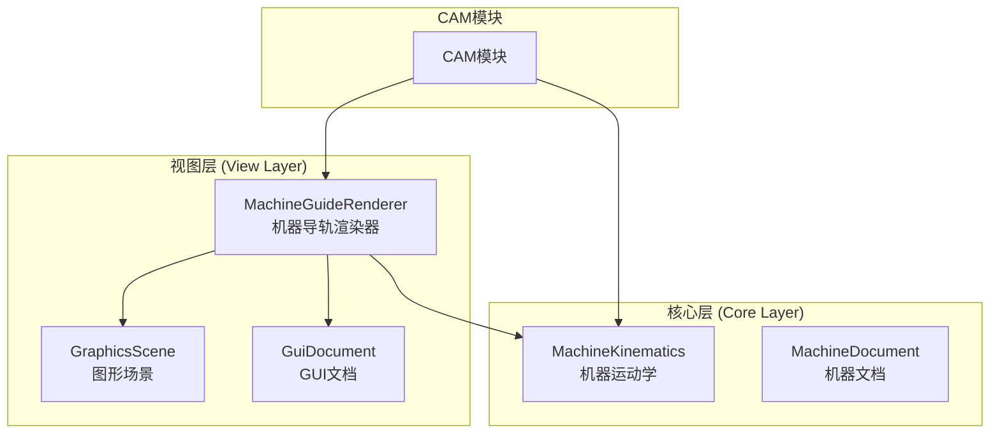
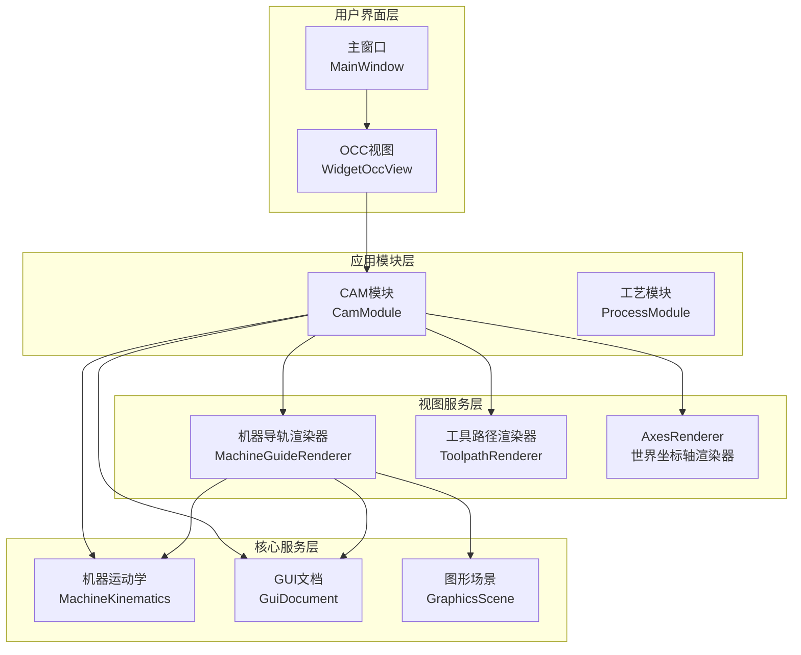
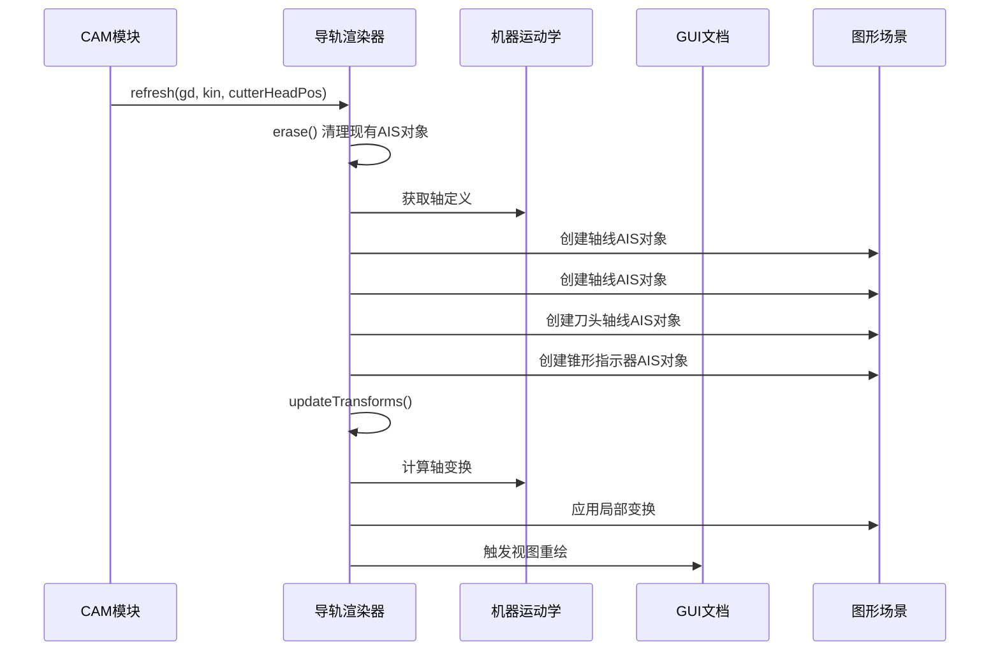
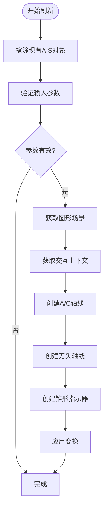
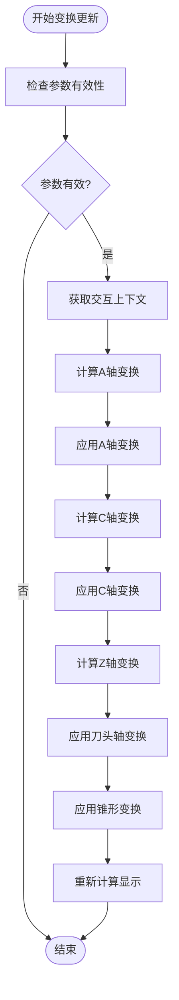
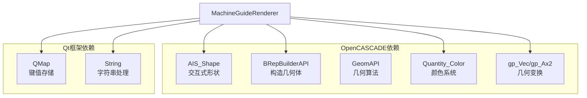
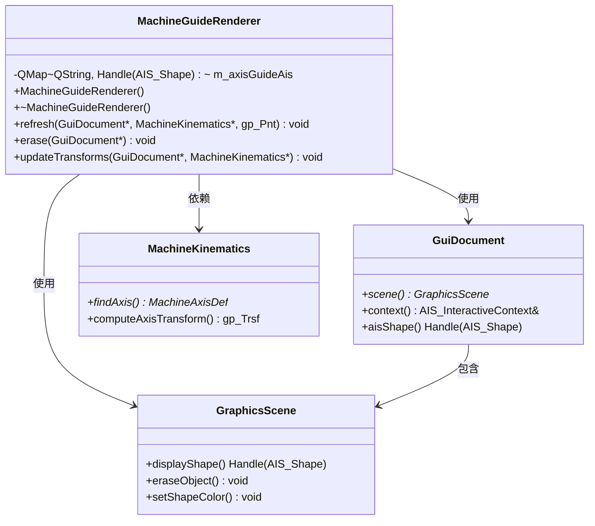

# 机器导轨渲染器

<cite>
**本文档引用的文件**
- [machine_guide_renderer.h](file://src/view/machine_guide_renderer.h)
- [machine_guide_renderer.cpp](file://src/view/machine_guide_renderer.cpp)
- [cam_module.h](file://src/modules/cam/cam_module.h)
- [cam_module.cpp](file://src/modules/cam/cam_module.cpp)
- [gui_document.h](file://src/view/gui_document.h)
- [gui_document.cpp](file://src/view/gui_document.cpp)
- [graphics_scene.h](file://src/view/graphics_scene.h)
- [graphics_scene.cpp](file://src/view/graphics_scene.cpp)
- [machine_kinematics.h](file://src/core/kinematics/machine_kinematics.h)
- [machine_kinematics.cpp](file://src/core/kinematics/machine_kinematics.cpp)
</cite>

## 目录
1. [简介](#简介)
2. [项目结构](#项目结构)
3. [核心组件](#核心组件)
4. [架构概览](#架构概览)
5. [详细组件分析](#详细组件分析)
6. [依赖关系分析](#依赖关系分析)
7. [性能考虑](#性能考虑)
8. [故障排除指南](#故障排除指南)
9. [结论](#结论)

## 简介

机器导轨渲染器（MachineGuideRenderer）是LaserCNC系统中的一个专门渲染组件，负责在三维视图中显示机器导轨的几何辅助信息。该组件主要提供以下功能：

- **A/C旋转轴指示线**：显示A轴和C轴的旋转轴线，用于指示旋转轴的方向和位置
- **刀头辅助线**：显示刀头的轴向指示线，帮助用户理解刀头的位置关系
- **锥形指示器**：在刀头位置显示锥形指示器，提供更直观的视觉反馈
- **实时变换更新**：根据机器的实时状态动态更新导轨显示

该渲染器采用轻量级设计，专注于提供机器导轨的可视化辅助功能，不参与实际的几何建模或路径计算。

## 项目结构

机器导轨渲染器位于系统的视图层（View Layer），与核心的CAM模块紧密集成。其在项目中的组织结构如下：

**图表来源**
- [machine_guide_renderer.h:1-40](file://src/view/machine_guide_renderer.h#L1-L40)
- [machine_guide_renderer.cpp:1-113](file://src/view/machine_guide_renderer.cpp#L1-L113)

**章节来源**
- [machine_guide_renderer.h:1-40](file://src/view/machine_guide_renderer.h#L1-L40)
- [machine_guide_renderer.cpp:1-113](file://src/view/machine_guide_renderer.cpp#L1-L113)

## 核心组件

### MachineGuideRenderer类

MachineGuideRenderer是一个专门的渲染器类，负责管理机器导轨相关的AIS对象。其核心特性包括：

#### 主要职责
- **几何建模**：创建A/C旋转轴线、刀头轴线和锥形指示器
- **颜色管理**：为不同类型的导轨元素设置相应的颜色
- **变换控制**：根据机器状态实时更新导轨显示位置
- **生命周期管理**：负责AIS对象的创建、更新和销毁

#### 关键数据结构
- **m_axisGuideAis**: 存储所有导轨相关的AIS形状对象
- **轴线定义**: 支持A轴和C轴的旋转轴线显示
- **刀头几何**: 包括轴向线段和锥形指示器

**章节来源**
- [machine_guide_renderer.h:18-37](file://src/view/machine_guide_renderer.h#L18-L37)
- [machine_guide_renderer.cpp:16-17](file://src/view/machine_guide_renderer.cpp#L16-L17)

## 架构概览

机器导轨渲染器在整个LaserCNC系统中的架构位置如下：

**图表来源**
- [cam_module.h:377](file://src/modules/cam/cam_module.h#L377)
- [machine_guide_renderer.cpp:30-90](file://src/view/machine_guide_renderer.cpp#L30-L90)

### 数据流架构

机器导轨渲染器的数据流遵循以下模式：

**图表来源**
- [machine_guide_renderer.cpp:30-90](file://src/view/machine_guide_renderer.cpp#L30-L90)
- [machine_guide_renderer.cpp:92-110](file://src/view/machine_guide_renderer.cpp#L92-L110)

## 详细组件分析

### 几何建模实现

机器导轨渲染器使用OpenCASCADE技术栈进行几何建模，具体实现包括：

#### 轴线几何创建
- **A轴和C轴线段**：使用BRepBuilderAPI_MakeEdge创建直线段
- **线段长度**：固定长度50mm，沿轴向对称分布
- **线段宽度**：设置为3.0像素，确保清晰可见

#### 刀头几何创建
- **刀头轴线**：从刀头尖端向上延伸80mm
- **锥形指示器**：在刀头位置创建高度18mm、半径5mm的圆锥
- **颜色配置**：采用蓝色系，区分于轴线的橙色和紫色

#### 变换矩阵计算
- **轴变换**：通过MachineKinematics::computeAxisTransform获取
- **局部变换**：使用SetLocalTransformation应用到AIS对象
- **批量更新**：支持单个轴或整体变换的更新

**章节来源**
- [machine_guide_renderer.cpp:40-87](file://src/view/machine_guide_renderer.cpp#L40-L87)
- [machine_guide_renderer.cpp:92-110](file://src/view/machine_guide_renderer.cpp#L92-L110)

### 渲染算法详解

#### 刷新流程算法

**图表来源**
- [machine_guide_renderer.cpp:19-90](file://src/view/machine_guide_renderer.cpp#L19-L90)

#### 变换更新算法

**图表来源**
- [machine_guide_renderer.cpp:92-110](file://src/view/machine_guide_renderer.cpp#L92-L110)

### 视觉效果优化

#### 颜色管理系统
- **A轴颜色**：橙色（RGB: 0.95, 0.55, 0.10）
- **C轴颜色**：紫色（RGB: 0.90, 0.20, 0.90）
- **刀头轴线**：蓝色（RGB: 0.20, 0.45, 0.95）
- **锥形指示器**：浅蓝色（RGB: 0.15, 0.55, 0.95）

#### 线宽配置
- **轴线宽度**：3.0像素，确保在各种缩放级别下都清晰可见
- **刀头轴线**：2.5像素，略细于轴线以突出层次感

#### 性能优化策略
- **就地变换**：使用SetLocalTransformation避免重建几何
- **批量更新**：一次计算多个变换后统一应用
- **条件渲染**：仅在必要时创建和更新AIS对象

**章节来源**
- [machine_guide_renderer.cpp:40-46](file://src/view/machine_guide_renderer.cpp#L40-L46)
- [machine_guide_renderer.cpp:74-75](file://src/view/machine_guide_renderer.cpp#L74-L75)

### 与运动控制系统的集成

#### 数据来源
- **MachineKinematics**：提供轴定义和变换计算
- **GuiDocument**：管理AIS对象的生命周期
- **MachinePose**：提供当前机器状态

#### 集成接口
- **refresh()方法**：完整的几何重建和初始化
- **updateTransforms()方法**：增量的变换更新
- **erase()方法**：清理和资源释放

#### 实时状态更新机制
- **事件驱动**：响应机器状态变化事件
- **定时更新**：定期同步最新的机器位置
- **选择性更新**：支持按轴粒度的精细化更新

**章节来源**
- [machine_guide_renderer.h:24-33](file://src/view/machine_guide_renderer.h#L24-L33)
- [cam_module.cpp:2740-2772](file://src/modules/cam/cam_module.cpp#L2740-L2772)

## 依赖关系分析

### 外部依赖

机器导轨渲染器依赖于以下外部库和组件：

**图表来源**
- [machine_guide_renderer.cpp:3-12](file://src/view/machine_guide_renderer.cpp#L3-L12)

### 内部依赖关系

**图表来源**
- [machine_guide_renderer.h:18-37](file://src/view/machine_guide_renderer.h#L18-L37)
- [gui_document.h](file://src/view/gui_document.h)
- [graphics_scene.h](file://src/view/graphics_scene.h)
- [machine_kinematics.h](file://src/core/kinematics/machine_kinematics.h)

**章节来源**
- [machine_guide_renderer.h:3-9](file://src/view/machine_guide_renderer.h#L3-L9)
- [machine_guide_renderer.cpp:3-5](file://src/view/machine_guide_renderer.cpp#L3-L5)

## 性能考虑

### 性能特征分析

#### 内存使用
- **AIS对象管理**：每个导轨元素对应一个AIS_Shape对象
- **几何缓存**：使用就地变换避免重复几何创建
- **内存回收**：通过erase()方法及时释放资源

#### 渲染性能
- **批量操作**：一次计算多个变换后统一应用
- **增量更新**：updateTransforms()比refresh()更高效
- **条件渲染**：仅在必要时创建新的AIS对象

#### 优化策略
- **变换复用**：避免重复计算相同的变换矩阵
- **延迟创建**：在首次需要时才创建AIS对象
- **批量重绘**：减少视图重绘的频率

### 性能调优建议

#### 配置优化
- **线宽调整**：根据屏幕分辨率调整线宽设置
- **颜色对比度**：确保颜色在不同背景下都有良好对比度
- **几何精度**：平衡视觉质量和计算开销

#### 运行时优化
- **脏区域更新**：利用dirtyAxes参数实现精确的更新范围
- **帧率控制**：限制更新频率避免过度消耗CPU资源
- **内存监控**：定期检查AIS对象数量防止内存泄漏

## 故障排除指南

### 常见问题及解决方案

#### 导轨不显示
**症状**：机器导轨在视图中完全不可见
**可能原因**：
- GuiDocument或GraphicsScene为空
- MachineKinematics未正确初始化
- AIS对象创建失败

**解决步骤**：
1. 检查GuiDocument的有效性
2. 验证MachineKinematics的状态
3. 确认AIS对象创建是否成功
4. 检查交互上下文的激活状态

#### 导轨位置错误
**症状**：导轨显示位置与实际机器位置不符
**可能原因**：
- 变换矩阵计算错误
- 坐标系转换问题
- 更新时机不当

**解决步骤**：
1. 验证MachineKinematics的变换计算
2. 检查坐标系定义
3. 确认updateTransforms()的调用时机
4. 验证SetLocalTransformation的应用

#### 性能问题
**症状**：视图更新缓慢或卡顿
**可能原因**：
- 频繁的完整刷新
- 大量AIS对象未正确清理
- 变换计算过于复杂

**解决步骤**：
1. 使用updateTransforms()替代refresh()
2. 确保及时调用erase()清理资源
3. 优化变换计算逻辑
4. 检查是否有不必要的视图重绘

### 调试技巧

#### 日志记录
- 在关键函数入口添加调试日志
- 记录AIS对象的创建和销毁
- 监控变换矩阵的计算结果

#### 状态检查
- 验证所有指针的有效性
- 检查AIS对象的Null状态
- 监控内存使用情况

#### 性能分析
- 测量refresh()和updateTransforms()的执行时间
- 分析AIS对象的数量增长
- 监控视图重绘频率

**章节来源**
- [machine_guide_renderer.cpp:19-28](file://src/view/machine_guide_renderer.cpp#L19-L28)
- [machine_guide_renderer.cpp:92-110](file://src/view/machine_guide_renderer.cpp#L92-L110)

## 结论

机器导轨渲染器作为LaserCNC系统中的重要可视化组件，实现了以下核心价值：

### 技术成就
- **精确的几何建模**：准确反映机器导轨的物理特性
- **高效的渲染算法**：通过就地变换实现高性能更新
- **良好的集成性**：与CAM模块和运动控制系统无缝对接

### 设计优势
- **模块化设计**：独立的渲染器便于维护和扩展
- **轻量级实现**：专注于特定功能，避免功能膨胀
- **性能优化**：采用多种优化策略确保流畅运行

### 应用价值
- **提高操作效率**：直观的视觉反馈帮助操作员更好地理解机器状态
- **降低误操作风险**：清晰的导轨显示减少了操作错误
- **增强用户体验**：专业的可视化效果提升了整体使用体验

该组件为LaserCNC系统的可视化基础提供了坚实的技术支撑，其设计理念和实现方式为类似工业软件的渲染需求提供了有价值的参考。