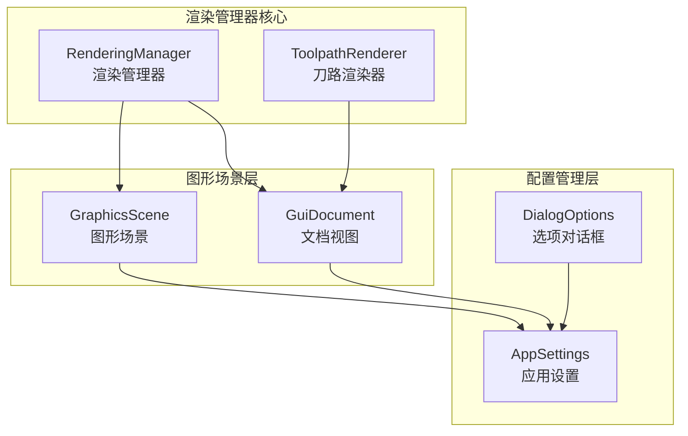
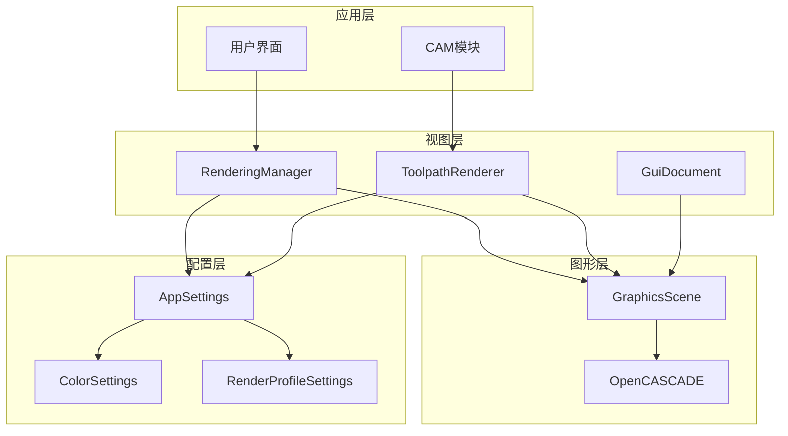
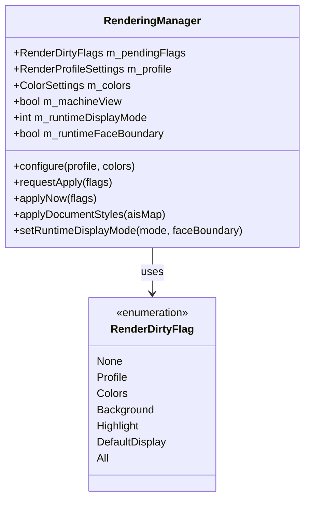
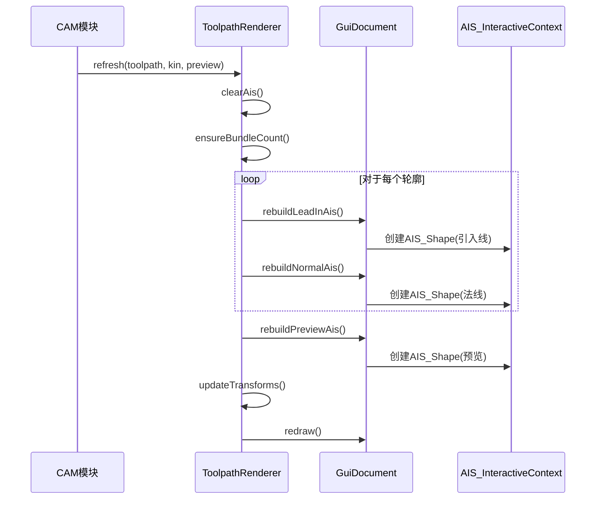
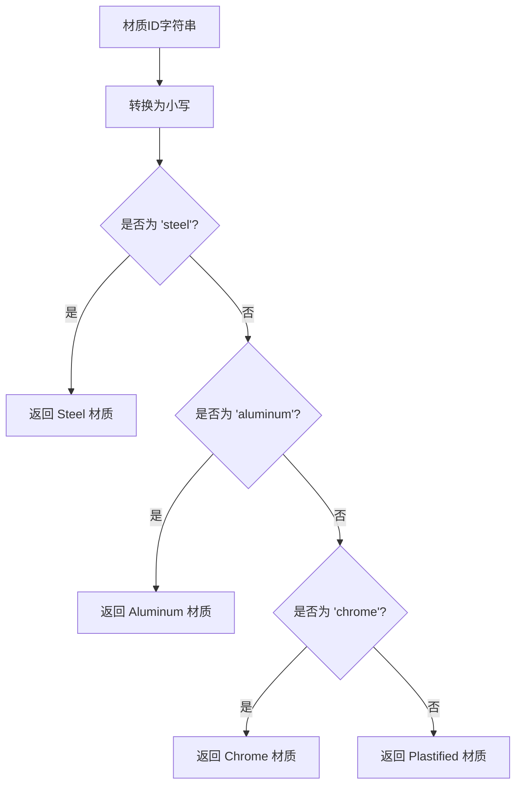
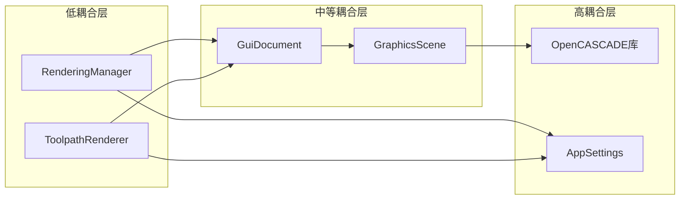
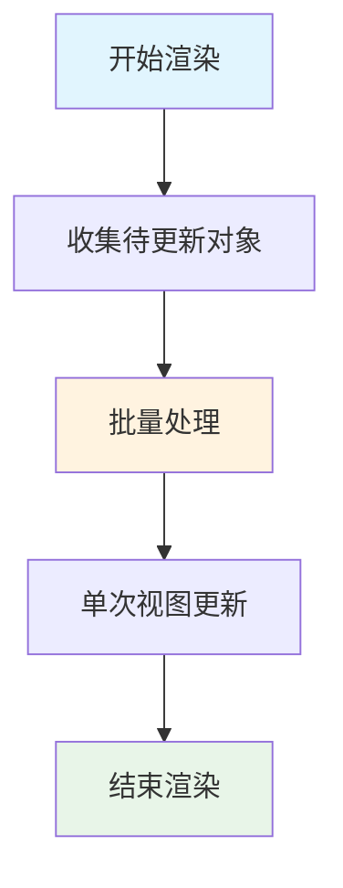

# 渲染管理器

<cite>
**本文档引用的文件**
- [rendering_manager.h](file://src/view/rendering_manager.h)
- [rendering_manager.cpp](file://src/view/rendering_manager.cpp)
- [toolpath_renderer.h](file://src/view/toolpath_renderer.h)
- [toolpath_renderer.cpp](file://src/view/toolpath_renderer.cpp)
- [graphics_scene.h](file://src/view/graphics_scene.h)
- [graphics_scene.cpp](file://src/view/graphics_scene.cpp)
- [gui_document.h](file://src/view/gui_document.h)
- [gui_document.cpp](file://src/view/gui_document.cpp)
- [app_settings.h](file://src/core/settings/app_settings.h)
- [app_settings.cpp](file://src/core/settings/app_settings.cpp)
- [dialog_options.cpp](file://src/app/dialog/dialog_options.cpp)
</cite>

## 目录
1. [简介](#简介)
2. [项目结构](#项目结构)
3. [核心组件](#核心组件)
4. [架构概览](#架构概览)
5. [详细组件分析](#详细组件分析)
6. [依赖关系分析](#依赖关系分析)
7. [性能考虑](#性能考虑)
8. [故障排除指南](#故障排除指南)
9. [结论](#结论)

## 简介
LaserCNC渲染管理器负责管理3D场景的渲染配置、材质管理和着色器控制。系统采用基于OpenCASCADE的图形渲染架构，提供高效的CAD/CAM视图渲染能力。本文档深入解析RenderingManager类的设计架构和渲染管线管理机制，包括渲染配置、材质管理和着色器控制。

## 项目结构
渲染管理器相关的核心文件组织如下：

**图表来源**
- [rendering_manager.h:1-101](file://src/view/rendering_manager.h#L1-L101)
- [toolpath_renderer.h:1-111](file://src/view/toolpath_renderer.h#L1-L111)
- [graphics_scene.h:1-32](file://src/view/graphics_scene.h#L1-L32)

**章节来源**
- [rendering_manager.h:1-101](file://src/view/rendering_manager.h#L1-L101)
- [toolpath_renderer.h:1-111](file://src/view/toolpath_renderer.h#L1-L111)
- [graphics_scene.h:1-32](file://src/view/graphics_scene.h#L1-L32)

## 核心组件
渲染管理系统包含以下核心组件：

### RenderingManager - 渲染管理器
负责管理单个GuiDocument的渲染参数，支持异步应用机制和脏标记系统。

### ToolpathRenderer - 刀路渲染器
专门处理激光切割刀路的可视化渲染，支持引入线、法线和预览功能。

### GraphicsScene - 图形场景
封装OpenCASCADE的V3d_Viewer和AIS_InteractiveContext，提供统一的图形渲染接口。

### 配置系统
包括RenderProfileSettings和ColorSettings，支持多种渲染质量预设和颜色配置。

**章节来源**
- [rendering_manager.cpp:136-146](file://src/view/rendering_manager.cpp#L136-L146)
- [toolpath_renderer.cpp:36-37](file://src/view/toolpath_renderer.cpp#L36-L37)
- [graphics_scene.cpp:49-77](file://src/view/graphics_scene.cpp#L49-L77)

## 架构概览
渲染管理系统采用分层架构设计，确保渲染性能和可维护性：

**图表来源**
- [rendering_manager.cpp:275-308](file://src/view/rendering_manager.cpp#L275-L308)
- [toolpath_renderer.cpp:47-89](file://src/view/toolpath_renderer.cpp#L47-L89)
- [graphics_scene.cpp:57-77](file://src/view/graphics_scene.cpp#L57-L77)

## 详细组件分析

### RenderingManager 设计分析

#### 脏标记系统
渲染管理器使用RenderDirtyFlag枚举实现精确的渲染更新控制：

**图表来源**
- [rendering_manager.h:20-28](file://src/view/rendering_manager.h#L20-L28)
- [rendering_manager.cpp:166-173](file://src/view/rendering_manager.cpp#L166-L173)

#### 渲染参数配置
支持多种渲染质量预设，针对CAD和CAM视图提供不同的默认配置：

| 预设级别 | 渲染方法 | 抗锯齿 | 阴影 | 反射 | 视锥裁剪 |
|---------|---------|--------|------|------|----------|
| Low | 光栅化 | 关闭 | 关闭 | 关闭 | 开启 |
| Medium | 光栅化 | 开启 | 关闭 | 关闭 | 开启 |
| High | 光栅化/光线追踪 | 开启 | 开启 | 开启 | 开启 |

**章节来源**
- [rendering_manager.cpp:90-133](file://src/view/rendering_manager.cpp#L90-L133)
- [app_settings.cpp:85-131](file://src/core/settings/app_settings.cpp#L85-L131)

### ToolpathRenderer 实现原理

#### 刀路渲染策略
ToolpathRenderer采用分层渲染策略，支持三种主要渲染模式：

**图表来源**
- [toolpath_renderer.cpp:47-89](file://src/view/toolpath_renderer.cpp#L47-L89)
- [toolpath_renderer.cpp:275-303](file://src/view/toolpath_renderer.cpp#L275-L303)

#### 几何对象绘制策略
渲染器为不同类型的对象使用不同的颜色和样式：

| 对象类型 | 颜色 | 线宽 | 显示模式 |
|---------|------|------|----------|
| 引入线 | 红色(0.9, 0.15, 0.15) | 2.0 | 线框 |
| 法线 | 橙黄色(0.95, 0.55, 0.10) | 1.8 | 线框 |
| 预览引入线 | 黄色(0.95, 0.8, 0.1) | 2.5 | 线框 |

**章节来源**
- [toolpath_renderer.cpp:296-303](file://src/view/toolpath_renderer.cpp#L296-L303)
- [toolpath_renderer.cpp:350-357](file://src/view/toolpath_renderer.cpp#L350-L357)
- [toolpath_renderer.cpp:387-395](file://src/view/toolpath_renderer.cpp#L387-L395)

### 材质管理和着色器控制

#### 材质映射系统
支持多种标准材料类型，自动映射到OpenCASCADE内置材质：

**图表来源**
- [rendering_manager.cpp:72-83](file://src/view/rendering_manager.cpp#L72-L83)

#### 光照系统
实现多光源环境光照，支持动态调节：

| 光源类型 | 方向 | 颜色 | 数量 |
|---------|------|------|------|
| 关键光 | XposYnegZpos | (0.72, 0.72, 0.72) | 1 |
| 填充光 | XnegYposZpos, XposYposZneg, XnegYnegZneg | (0.38, 0.38, 0.38) | 3 |
| 环境光 | 自适应 | [0.45, 0.85]范围 | 1 |

**章节来源**
- [rendering_manager.cpp:356-393](file://src/view/rendering_manager.cpp#L356-L393)

## 依赖关系分析

### 组件耦合度分析
渲染管理系统采用松耦合设计，各组件职责明确：

**图表来源**
- [rendering_manager.cpp:11-37](file://src/view/rendering_manager.cpp#L11-L37)
- [toolpath_renderer.cpp:1-15](file://src/view/toolpath_renderer.cpp#L1-L15)

### 外部依赖关系
系统主要依赖OpenCASCADE CAD几何库，提供完整的3D图形渲染能力：

- **V3d_View**: 3D视图管理
- **AIS_InteractiveContext**: 交互式对象管理
- **Graphic3d_RenderingParams**: 渲染参数控制
- **Prs3d_Drawer**: 显示属性配置

**章节来源**
- [rendering_manager.cpp:11-32](file://src/view/rendering_manager.cpp#L11-L32)

## 性能考虑

### 渲染性能优化技术

#### 批量渲染优化
渲染管理器采用批量更新策略，避免频繁的UI刷新：

#### 异步应用机制
使用0ms QTimer实现渲染参数的异步应用，避免UI阻塞：

| 特性 | 描述 | 性能影响 |
|------|------|----------|
| 异步处理 | 0ms定时器延迟执行 | 避免同步阻塞 |
| 合并更新 | 脏标记合并 | 减少重复渲染 |
| 分批应用 | 分离不同类型的更新 | 提高响应性 |

**章节来源**
- [rendering_manager.cpp:166-173](file://src/view/rendering_manager.cpp#L166-L173)
- [rendering_manager.cpp:440-450](file://src/view/rendering_manager.cpp#L440-L450)

### LOD（细节层次）管理
系统支持基于移动状态的LOD切换：

| 状态 | LOD级别 | 特性 |
|------|---------|------|
| 静止 | 高LOD | 完整几何细节 |
| 移动中 | 低LOD | 简化几何表示 |
| 模拟运行 | 低LOD | 关闭重效果 |

**章节来源**
- [app_settings.cpp:182-183](file://src/core/settings/app_settings.cpp#L182-L183)

## 故障排除指南

### 常见渲染问题及解决方案

#### 视图初始化问题
**症状**: 新建视图时模型不可见
**原因**: 渲染参数未正确应用
**解决方案**: 确保在视图附件时调用`applyNow(RenderDirtyFlag::All)`

#### 材质应用失败
**症状**: 对象材质未正确显示
**原因**: 材质ID映射错误
**解决方案**: 检查材质ID字符串大小写和有效性

#### 刀路渲染异常
**症状**: 刀路线条显示不正确
**原因**: Transform应用失败
**解决方案**: 验证机器坐标变换计算

**章节来源**
- [gui_document.cpp:98-110](file://src/view/gui_document.cpp#L98-L110)
- [toolpath_renderer.cpp:139-169](file://src/view/toolpath_renderer.cpp#L139-L169)

## 结论
LaserCNC渲染管理系统通过精心设计的架构实现了高性能的3D图形渲染。RenderingManager提供了灵活的渲染配置管理，ToolpathRenderer专注于CAM特定的刀路可视化，整体系统支持多种渲染质量预设和实时性能优化。该系统为LaserCNC的CAD/CAM工作流提供了可靠的图形渲染基础。