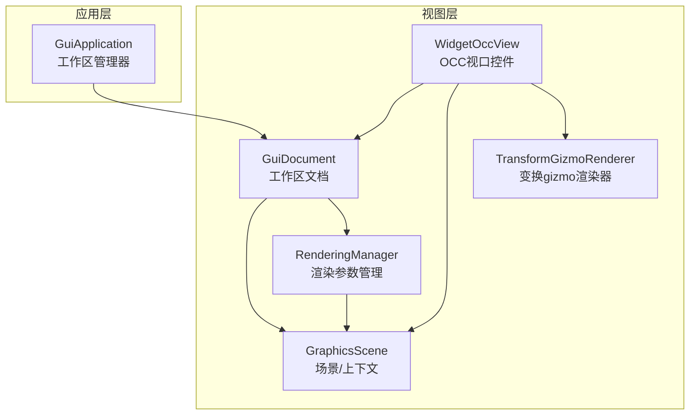
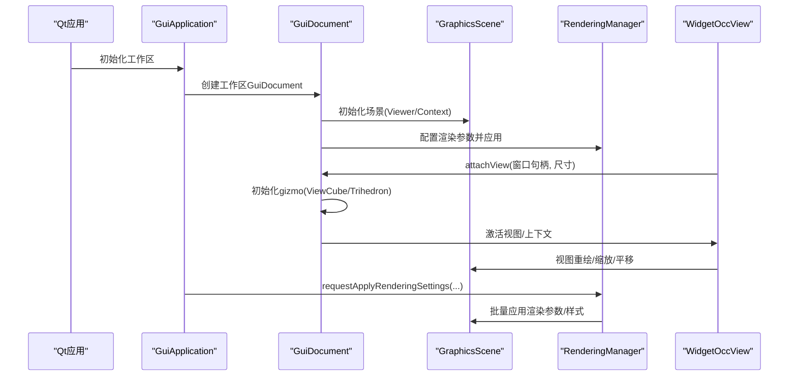
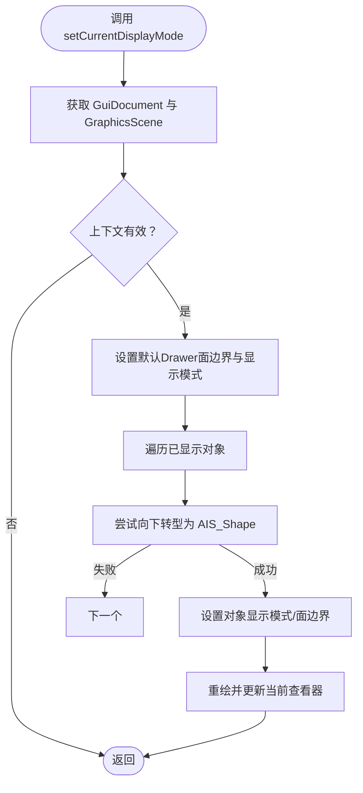
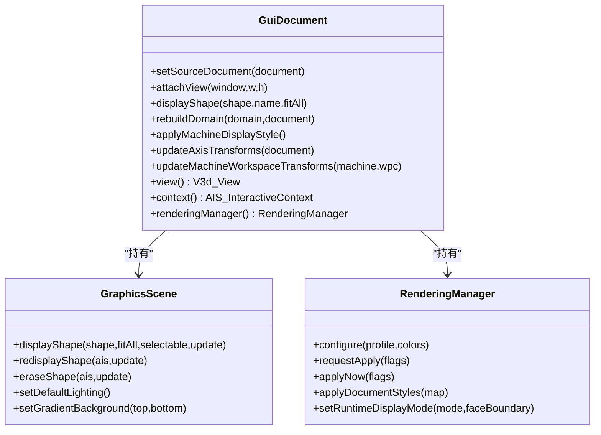
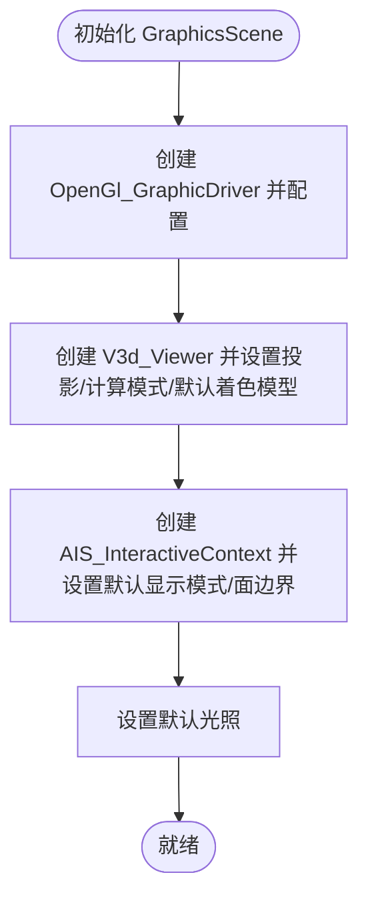
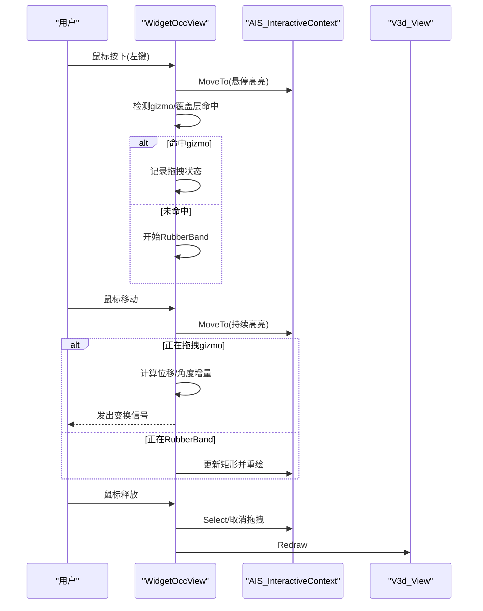
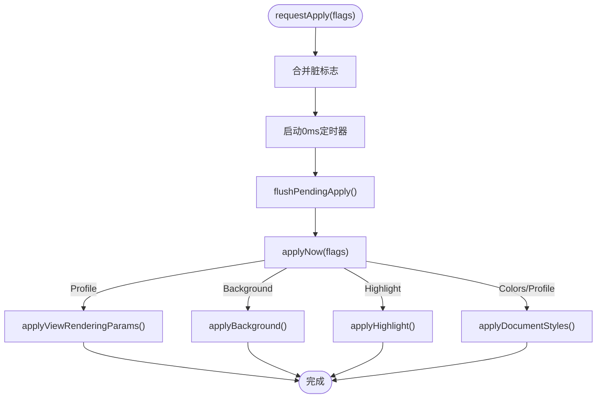
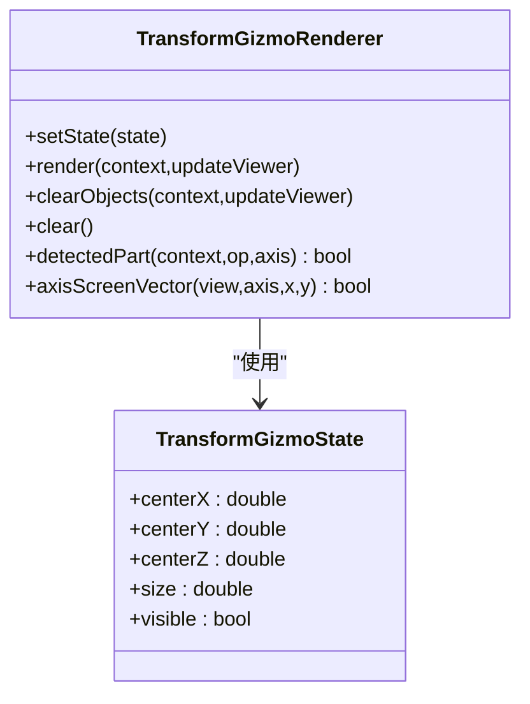
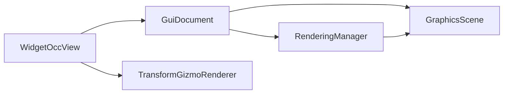

# 视图系统

<cite>
**本文引用的文件**
- [src/view/gui_application.cpp](file://src/view/gui_application.cpp)
- [src/view/gui_application.h](file://src/view/gui_application.h)
- [src/view/widget_occ_view.cpp](file://src/view/widget_occ_view.cpp)
- [src/view/widget_occ_view.h](file://src/view/widget_occ_view.h)
- [src/view/rendering_manager.cpp](file://src/view/rendering_manager.cpp)
- [src/view/rendering_manager.h](file://src/view/rendering_manager.h)
- [src/view/graphics_scene.cpp](file://src/view/graphics_scene.cpp)
- [src/view/graphics_scene.h](file://src/view/graphics_scene.h)
- [src/view/gui_document.cpp](file://src/view/gui_document.cpp)
- [src/view/gui_document.h](file://src/view/gui_document.h)
- [src/view/transform_gizmo_renderer.cpp](file://src/view/transform_gizmo_renderer.cpp)
- [src/view/transform_gizmo_renderer.h](file://src/view/transform_gizmo_renderer.h)
</cite>

## 目录
1. [简介](#简介)
2. [项目结构](#项目结构)
3. [核心组件](#核心组件)
4. [架构总览](#架构总览)
5. [详细组件分析](#详细组件分析)
6. [依赖关系分析](#依赖关系分析)
7. [性能考量](#性能考量)
8. [故障排查指南](#故障排查指南)
9. [结论](#结论)
10. [附录](#附录)

## 简介
本文件系统性阐述LaserCNC的视图系统，围绕基于Qt与OpenCASCADE（OCC）构建的图形界面与可视化子系统展开。重点覆盖：
- GUI应用程序框架与工作区管理
- 图形场景管理与OCC视图组件
- 渲染管理器与渲染管线配置
- 3D图形渲染、用户交互、变换控件与机器导轨显示
- 视图组件扩展方法、自定义渲染器开发指南与性能优化策略

目标读者包括需要理解或扩展视图系统的开发者与高级用户。

## 项目结构
视图系统位于src/view目录，采用“文档级视图 + 场景共享”的设计模式：
- GuiDocument：封装单个工作区文档的视图、上下文与gizmo（坐标轴、视图立方体）
- GraphicsScene：封装V3d_Viewer与AIS_InteractiveContext，统一形状显示/高亮/背景/光照
- WidgetOccView：承载OCC视口的Qt控件，处理鼠标/键盘事件与导航
- RenderingManager：集中管理渲染参数（质量、光照、背景、高亮、材质）与批量应用
- TransformGizmoRenderer：可选的变换gizmo渲染器，支持平移/旋转操作反馈
- GuiApplication：顶层工作区管理器，协调渲染设置与显示模式

**图表来源**
- [src/view/widget_occ_view.h:37-182](file://src/view/widget_occ_view.h#L37-L182)
- [src/view/gui_document.h:35-144](file://src/view/gui_document.h#L35-L144)
- [src/view/rendering_manager.h:38-101](file://src/view/rendering_manager.h#L38-L101)
- [src/view/graphics_scene.h:19-66](file://src/view/graphics_scene.h#L19-L66)
- [src/view/transform_gizmo_renderer.h:25-56](file://src/view/transform_gizmo_renderer.h#L25-L56)
- [src/view/gui_application.h:17-47](file://src/view/gui_application.h#L17-L47)

**章节来源**
- [src/view/widget_occ_view.h:19-37](file://src/view/widget_occ_view.h#L19-L37)
- [src/view/gui_document.h:25-35](file://src/view/gui_document.h#L25-L35)
- [src/view/rendering_manager.h:17-38](file://src/view/rendering_manager.h#L17-L38)
- [src/view/graphics_scene.h:12-19](file://src/view/graphics_scene.h#L12-L19)
- [src/view/transform_gizmo_renderer.h:15-25](file://src/view/transform_gizmo_renderer.h#L15-L25)
- [src/view/gui_application.h:10-17](file://src/view/gui_application.h#L10-L17)

## 核心组件
- GuiApplication：提供工作区文档生命周期与渲染设置入口，负责统一设置显示模式与应用渲染配置
- GuiDocument：持有GraphicsScene与RenderingManager，负责视图创建、gizmo初始化、形状注册与轴变换更新
- GraphicsScene：封装V3d_Viewer/AIS_InteractiveContext，提供形状显示/重绘/擦除与默认高亮样式
- WidgetOccView：承载OCC视口，处理导航（旋转/平移/缩放）、选择、RubberBand多选、gizmo拖拽、草图覆盖层与预览
- RenderingManager：集中管理渲染配置（质量预设、抗锯齿、阴影、材质、背光、高亮），支持增量应用与批量样式更新
- TransformGizmoRenderer：渲染可选的变换gizmo（移动轴/旋转环），支持检测与屏幕向量投影

**章节来源**
- [src/view/gui_application.cpp:16-89](file://src/view/gui_application.cpp#L16-L89)
- [src/view/gui_document.cpp:54-130](file://src/view/gui_document.cpp#L54-L130)
- [src/view/graphics_scene.cpp:49-110](file://src/view/graphics_scene.cpp#L49-L110)
- [src/view/widget_occ_view.cpp:30-80](file://src/view/widget_occ_view.cpp#L30-L80)
- [src/view/rendering_manager.cpp:136-198](file://src/view/rendering_manager.cpp#L136-L198)
- [src/view/transform_gizmo_renderer.cpp:93-127](file://src/view/transform_gizmo_renderer.cpp#L93-L127)

## 架构总览
视图系统遵循“文档级视图 + 场景共享”的Mayo风格模式：
- 一个WidgetOccView对应一个Aspect_NeutralWindow（原生窗口句柄）
- 每个GuiDocument拥有独立的V3d_View绑定到同一窗口，切换文档仅切换视图指针，保留相机状态
- GraphicsScene在文档间共享，统一形状显示与高亮样式
- RenderingManager按需批量应用渲染参数，避免UI阻塞

**图表来源**
- [src/view/gui_application.cpp:66-89](file://src/view/gui_application.cpp#L66-L89)
- [src/view/gui_document.cpp:80-129](file://src/view/gui_document.cpp#L80-L129)
- [src/view/graphics_scene.cpp:57-110](file://src/view/graphics_scene.cpp#L57-L110)
- [src/view/rendering_manager.cpp:166-198](file://src/view/rendering_manager.cpp#L166-L198)
- [src/view/widget_occ_view.cpp:446-505](file://src/view/widget_occ_view.cpp#L446-L505)

## 详细组件分析

### GuiApplication：工作区与渲染设置入口
- 职责
  - 维护单一工作区GuiDocument
  - 提供显示模式与面边界绘制设置
  - 接收渲染配置变更，委托RenderingManager应用
- 关键行为
  - setCurrentDisplayMode：统一设置AIS默认显示模式与面边界，并对已显示的AIS_Shape批量生效
  - requestApplyRenderingSettings：根据CAD/CAM视图偏好选择配置，合并脏标志后异步应用

**图表来源**
- [src/view/gui_application.cpp:32-64](file://src/view/gui_application.cpp#L32-L64)

**章节来源**
- [src/view/gui_application.h:17-47](file://src/view/gui_application.h#L17-L47)
- [src/view/gui_application.cpp:16-89](file://src/view/gui_application.cpp#L16-L89)

### GuiDocument：文档级视图与gizmo管理
- 职责
  - 创建/激活视图，初始化gizmo（坐标轴Trihedron、视图立方体ViewCube）
  - 注册/重建/擦除显示对象，维护显示映射
  - 应用机台样式（颜色/材质/偏差系数/面边界宽度/背面剔除）
  - 更新轴变换（机台/工件）并重计算表示
- 关键行为
  - attachView：首次创建V3d_View并应用渲染参数，初始化gizmo，FitAll/ZFitAll
  - applyMachineDisplayStyle：按机台/工件/轴名分类应用颜色与材质
  - updateAxisTransforms/updateMachineWorkspaceTransforms：根据运动学计算局部变换

**图表来源**
- [src/view/gui_document.h:35-144](file://src/view/gui_document.h#L35-L144)
- [src/view/graphics_scene.h:19-66](file://src/view/graphics_scene.h#L19-L66)
- [src/view/rendering_manager.h:38-101](file://src/view/rendering_manager.h#L38-L101)

**章节来源**
- [src/view/gui_document.cpp:54-130](file://src/view/gui_document.cpp#L54-L130)
- [src/view/gui_document.cpp:221-252](file://src/view/gui_document.cpp#L221-L252)
- [src/view/gui_document.cpp:399-419](file://src/view/gui_document.cpp#L399-L419)
- [src/view/gui_document.cpp:495-528](file://src/view/gui_document.cpp#L495-L528)
- [src/view/gui_document.cpp:530-581](file://src/view/gui_document.cpp#L530-L581)

### GraphicsScene：场景与上下文
- 职责
  - 创建并配置V3d_Viewer与AIS_InteractiveContext
  - 默认光照与渐变背景（通过视图层应用）
  - 形状显示/重绘/擦除/全清空/颜色设置/选择清理
- 关键行为
  - displayShape：以上下文默认显示模式添加形状，避免强制着色覆盖用户选择
  - setDefaultLighting：初始化方向光与环境光
  - logOpenGlContextState：诊断OpenGL驱动能力与VBO启用状态

**图表来源**
- [src/view/graphics_scene.cpp:57-110](file://src/view/graphics_scene.cpp#L57-L110)

**章节来源**
- [src/view/graphics_scene.cpp:49-110](file://src/view/graphics_scene.cpp#L49-L110)
- [src/view/graphics_scene.cpp:176-236](file://src/view/graphics_scene.cpp#L176-L236)
- [src/view/graphics_scene.cpp:133-174](file://src/view/graphics_scene.cpp#L133-L174)

### WidgetOccView：OCC视口与交互
- 职责
  - 承载OCC视口，响应Qt事件，执行导航与选择
  - 支持RubberBand多选、网格预览、草图覆盖层、变换gizmo拖拽
  - 提供网格可见性/步长/捕捉、CAD抓点模式、预览形状
- 关键行为
  - mousePressEvent/mouseMoveEvent/mouseReleaseEvent：左键拖拽（RubberBand/拖拽gizmo/拖拽草图覆盖项）、右键旋转、中键平移
  - wheelEvent：缩放
  - 键盘ESC：取消拾取/清除选择
  - activateView：切换视图/上下文并同步gizmo与网格

**图表来源**
- [src/view/widget_occ_view.cpp:534-771](file://src/view/widget_occ_view.cpp#L534-L771)

**章节来源**
- [src/view/widget_occ_view.h:19-96](file://src/view/widget_occ_view.h#L19-L96)
- [src/view/widget_occ_view.cpp:30-80](file://src/view/widget_occ_view.cpp#L30-L80)
- [src/view/widget_occ_view.cpp:219-254](file://src/view/widget_occ_view.cpp#L219-L254)
- [src/view/widget_occ_view.cpp:534-771](file://src/view/widget_occ_view.cpp#L534-L771)

### RenderingManager：渲染参数与样式管理
- 职责
  - 集中管理渲染配置（质量预设、渲染方法、抗锯齿、阴影、反射、采样、偏差、边缘宽度、背面剔除）
  - 应用背景、光照、高亮样式、形状样式（颜色/材质/偏差/面边界/背面剔除）
  - 异步批量应用（0ms定时器合并多次变更）
- 关键行为
  - requestApply/flushPendingApply：合并脏标志并应用
  - applyViewRenderingParams：设置视图渲染参数（MSAA/分辨率缩放/阴影/反射/光线追踪深度/瓦片等）
  - applyLighting：添加方向光与环境光
  - applyBackground：设置渐变背景
  - applyHighlight：配置选中/动态高亮样式
  - applyDocumentStyles：按机台/工件/轴名分类应用颜色与材质

**图表来源**
- [src/view/rendering_manager.cpp:166-198](file://src/view/rendering_manager.cpp#L166-L198)
- [src/view/rendering_manager.cpp:440-450](file://src/view/rendering_manager.cpp#L440-L450)

**章节来源**
- [src/view/rendering_manager.h:17-76](file://src/view/rendering_manager.h#L17-L76)
- [src/view/rendering_manager.cpp:136-198](file://src/view/rendering_manager.cpp#L136-L198)
- [src/view/rendering_manager.cpp:275-308](file://src/view/rendering_manager.cpp#L275-L308)
- [src/view/rendering_manager.cpp:310-320](file://src/view/rendering_manager.cpp#L310-L320)
- [src/view/rendering_manager.cpp:322-354](file://src/view/rendering_manager.cpp#L322-L354)
- [src/view/rendering_manager.cpp:356-393](file://src/view/rendering_manager.cpp#L356-L393)
- [src/view/rendering_manager.cpp:395-438](file://src/view/rendering_manager.cpp#L395-L438)

### TransformGizmoRenderer：变换gizmo渲染器
- 职责
  - 渲染可选的变换gizmo（移动轴/旋转环），支持检测命中与屏幕向量投影
- 关键行为
  - render：按状态创建并显示gizmo对象，建立键值映射
  - detectedPart：根据AIS检测结果反查操作类型与轴
  - axisScreenVector：将世界空间轴投影到屏幕，计算像素向量

**图表来源**
- [src/view/transform_gizmo_renderer.h:25-56](file://src/view/transform_gizmo_renderer.h#L25-L56)

**章节来源**
- [src/view/transform_gizmo_renderer.cpp:93-127](file://src/view/transform_gizmo_renderer.cpp#L93-L127)
- [src/view/transform_gizmo_renderer.cpp:150-167](file://src/view/transform_gizmo_renderer.cpp#L150-L167)
- [src/view/transform_gizmo_renderer.cpp:169-191](file://src/view/transform_gizmo_renderer.cpp#L169-L191)

## 依赖关系分析
- 组件耦合
  - WidgetOccView依赖GuiDocument与GraphicsScene，直接与OCC交互
  - GuiDocument聚合GraphicsScene与RenderingManager，负责gizmo与样式
  - RenderingManager依赖GuiDocument提供的AIS映射与视图上下文
  - TransformGizmoRenderer与WidgetOccView协作，不依赖CAD模块
- 外部依赖
  - Qt：事件系统、定时器、属性
  - OpenCASCADE：V3d_View/Viewer、AIS_InteractiveContext、AIS_Shape、Prs3d_Drawer等

**图表来源**
- [src/view/widget_occ_view.h:37-182](file://src/view/widget_occ_view.h#L37-L182)
- [src/view/gui_document.h:35-144](file://src/view/gui_document.h#L35-L144)
- [src/view/rendering_manager.h:38-101](file://src/view/rendering_manager.h#L38-L101)
- [src/view/graphics_scene.h:19-66](file://src/view/graphics_scene.h#L19-L66)
- [src/view/transform_gizmo_renderer.h:25-56](file://src/view/transform_gizmo_renderer.h#L25-L56)

**章节来源**
- [src/view/widget_occ_view.cpp:1-30](file://src/view/widget_occ_view.cpp#L1-L30)
- [src/view/gui_document.cpp:1-15](file://src/view/gui_document.cpp#L1-L15)
- [src/view/rendering_manager.cpp:1-10](file://src/view/rendering_manager.cpp#L1-L10)
- [src/view/graphics_scene.cpp:1-10](file://src/view/graphics_scene.cpp#L1-L10)
- [src/view/transform_gizmo_renderer.cpp:1-10](file://src/view/transform_gizmo_renderer.cpp#L1-L10)

## 性能考量
- 渲染参数批处理
  - RenderingManager使用0ms定时器合并多次变更，避免频繁遍历大模型导致UI卡顿
- OpenGL驱动与VSync
  - GraphicsScene配置OpenGl_GraphicDriver，启用VBO与垂直同步，记录OpenGL上下文能力
- 视图渲染参数
  - RenderingManager根据质量预设调整MSAA、分辨率缩放、阴影/反射、光线追踪深度与瓦片数
- 选择与高亮
  - 默认高亮样式使用线框/着色组合，减少过度绘制；动态高亮与选中高亮分离，避免混淆
- 导航与重绘
  - WidgetOccView在拖拽/旋转/平移时按需重绘，RubberBand仅在拖拽期间显示，降低开销

**章节来源**
- [src/view/rendering_manager.cpp:136-146](file://src/view/rendering_manager.cpp#L136-L146)
- [src/view/rendering_manager.cpp:275-308](file://src/view/rendering_manager.cpp#L275-L308)
- [src/view/graphics_scene.cpp:17-47](file://src/view/graphics_scene.cpp#L17-L47)
- [src/view/graphics_scene.cpp:133-174](file://src/view/graphics_scene.cpp#L133-L174)
- [src/view/widget_occ_view.cpp:756-771](file://src/view/widget_occ_view.cpp#L756-L771)

## 故障排查指南
- OCC OpenGL上下文未初始化
  - 现象：日志提示OpenGL上下文未初始化或VBO未启用
  - 处理：确保WidgetOccView已显示且完成attachDocument/attachDefaultScene；检查驱动配置
  - 参考
    - [src/view/graphics_scene.cpp:133-174](file://src/view/graphics_scene.cpp#L133-L174)
    - [src/view/widget_occ_view.cpp:509-517](file://src/view/widget_occ_view.cpp#L509-L517)
- 视图无模型或模型不可见
  - 现象：首次attach后模型不可见
  - 处理：先应用渲染参数与运行时显示模式，再触发Redraw；确保FitAll/ZFitAll
  - 参考
    - [src/view/gui_document.cpp:98-114](file://src/view/gui_document.cpp#L98-L114)
- 高亮样式异常
  - 现象：选中/悬停高亮颜色或线宽不正确
  - 处理：检查RenderingManager.applyHighlight与AIS默认Drawer设置
  - 参考
    - [src/view/rendering_manager.cpp:322-354](file://src/view/rendering_manager.cpp#L322-L354)
    - [src/view/graphics_scene.cpp:84-109](file://src/view/graphics_scene.cpp#L84-L109)
- gizmo未显示或无法拖拽
  - 现象：变换gizmo未出现或拖拽无效
  - 处理：确认TransformGizmoRenderer.setState/render调用；检查WidgetOccView鼠标事件路径
  - 参考
    - [src/view/transform_gizmo_renderer.cpp:93-127](file://src/view/transform_gizmo_renderer.cpp#L93-L127)
    - [src/view/widget_occ_view.cpp:552-689](file://src/view/widget_occ_view.cpp#L552-L689)

**章节来源**
- [src/view/graphics_scene.cpp:133-174](file://src/view/graphics_scene.cpp#L133-L174)
- [src/view/gui_document.cpp:98-114](file://src/view/gui_document.cpp#L98-L114)
- [src/view/rendering_manager.cpp:322-354](file://src/view/rendering_manager.cpp#L322-L354)
- [src/view/graphics_scene.cpp:84-109](file://src/view/graphics_scene.cpp#L84-L109)
- [src/view/transform_gizmo_renderer.cpp:93-127](file://src/view/transform_gizmo_renderer.cpp#L93-L127)
- [src/view/widget_occ_view.cpp:552-689](file://src/view/widget_occ_view.cpp#L552-L689)

## 结论
LaserCNC视图系统以GuiDocument为核心，结合GraphicsScene与RenderingManager，实现了文档级视图与场景共享、高质量渲染参数控制与灵活的用户交互。WidgetOccView提供直观的导航与选择体验，TransformGizmoRenderer增强了编辑效率。通过批处理与驱动诊断，系统在功能与性能之间取得平衡，适合进一步扩展与定制。

## 附录

### 视图组件扩展方法
- 新增视图控件
  - 继承QWidget并集成OCC窗口句柄，参考WidgetOccView的ensureOccWindow与attachDocument流程
  - 参考
    - [src/view/widget_occ_view.cpp:46-54](file://src/view/widget_occ_view.cpp#L46-L54)
    - [src/view/widget_occ_view.cpp:446-467](file://src/view/widget_occ_view.cpp#L446-L467)
- 自定义gizmo
  - 使用TransformGizmoRenderer的键值映射机制，或实现独立的渲染器，注意与AIS_InteractiveContext的交互
  - 参考
    - [src/view/transform_gizmo_renderer.cpp:93-127](file://src/view/transform_gizmo_renderer.cpp#L93-L127)
    - [src/view/transform_gizmo_renderer.cpp:150-167](file://src/view/transform_gizmo_renderer.cpp#L150-L167)

### 自定义渲染器开发指南
- 渲染参数
  - 通过RenderingManager::configure传入RenderProfileSettings与ColorSettings，使用requestApply合并应用
  - 参考
    - [src/view/rendering_manager.h:48-55](file://src/view/rendering_manager.h#L48-L55)
    - [src/view/rendering_manager.cpp:166-173](file://src/view/rendering_manager.cpp#L166-L173)
- 样式应用
  - 使用applyDocumentStyles按机台/工件/轴名分类设置颜色与材质，避免逐对象遍历
  - 参考
    - [src/view/rendering_manager.cpp:231-266](file://src/view/rendering_manager.cpp#L231-L266)
    - [src/view/rendering_manager.cpp:395-438](file://src/view/rendering_manager.cpp#L395-L438)

### 性能优化建议
- 合并UI更新
  - 使用RenderingManager的0ms定时器合并多次渲染参数变更
  - 参考
    - [src/view/rendering_manager.cpp:136-146](file://src/view/rendering_manager.cpp#L136-L146)
- 减少重绘
  - RubberBand仅在拖拽期间显示；导航事件按需Redraw
  - 参考
    - [src/view/widget_occ_view.cpp:721-754](file://src/view/widget_occ_view.cpp#L721-L754)
    - [src/view/widget_occ_view.cpp:756-771](file://src/view/widget_occ_view.cpp#L756-L771)
- 驱动能力
  - 启用VBO与垂直同步，关注最大MSAA样本数与核心配置
  - 参考
    - [src/view/graphics_scene.cpp:17-47](file://src/view/graphics_scene.cpp#L17-L47)
    - [src/view/graphics_scene.cpp:155-174](file://src/view/graphics_scene.cpp#L155-L174)