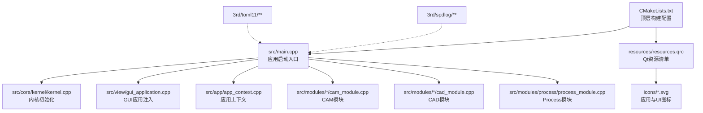
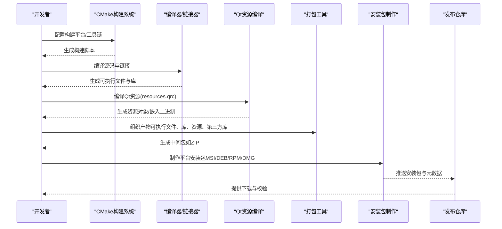
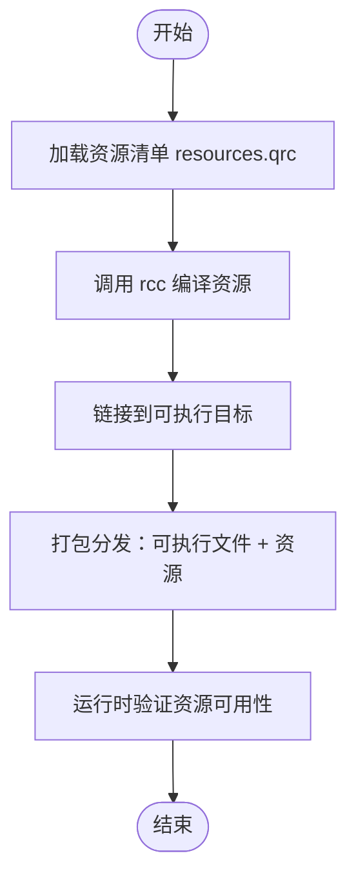
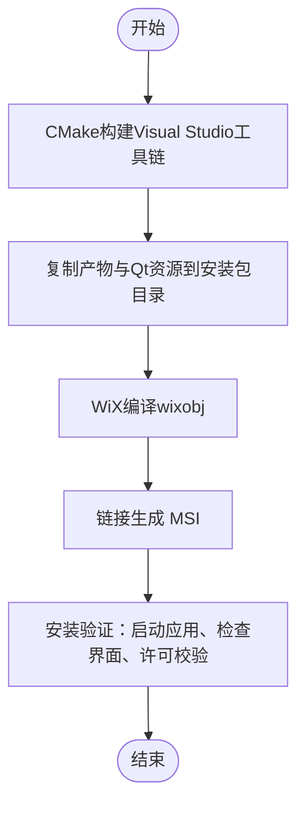
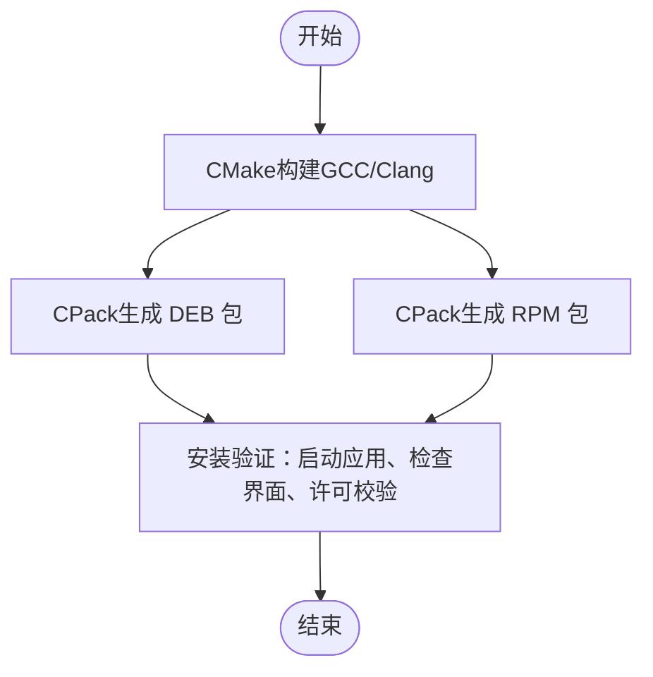
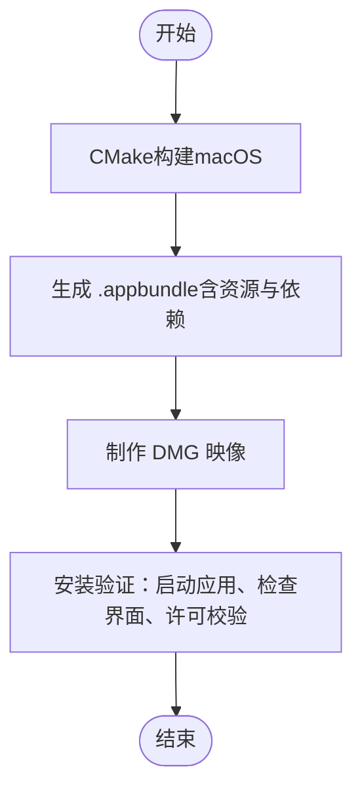
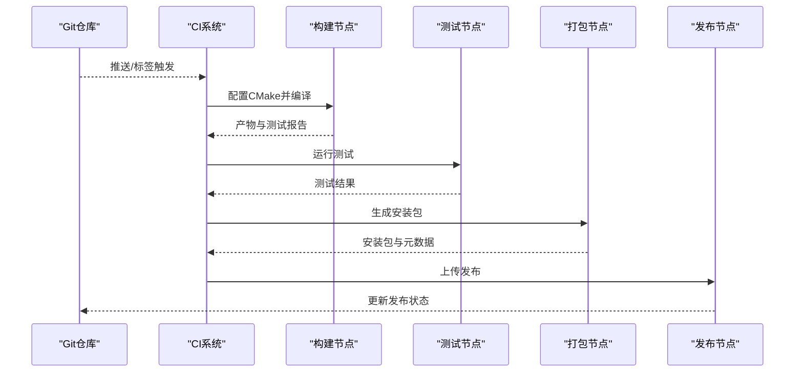
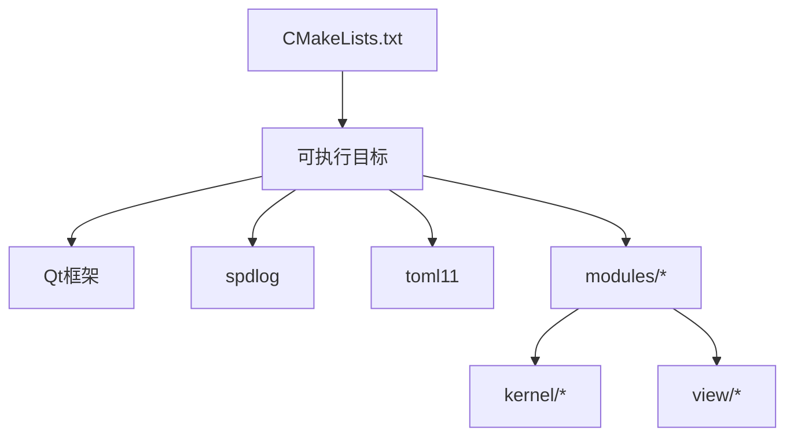

# 打包发布

<cite>
**本文引用的文件**   
- [CMakeLists.txt](file://CMakeLists.txt)
- [resources/resources.qrc](file://resources/resources.qrc)
- [.gitignore](file://.gitignore)
- [src/main.cpp](file://src/main.cpp)
- [src/core/project/lcnc_project_package.cpp](file://src/core/project/lcnc_project_package.cpp)
- [src/core/settings/app_settings.h](file://src/core/settings/app_settings.h)
- [src/modules/process/System/LicenseModule.cpp](file://src/modules/process/System/LicenseModule.cpp)
- [文件结构.md](file://文件结构.md)
- [CLAUDE.md](file://CLAUDE.md)
- [Readme.md](file://Readme.md)
- [3rd/toml11/toml11/spec.hpp](file://3rd/toml11/toml11/spec.hpp)
</cite>

## 目录
1. [简介](#简介)
2. [项目结构](#项目结构)
3. [核心组件](#核心组件)
4. [架构总览](#架构总览)
5. [详细组件分析](#详细组件分析)
6. [依赖分析](#依赖分析)
7. [性能考虑](#性能考虑)
8. [故障排查指南](#故障排查指南)
9. [结论](#结论)
10. [附录](#附录)

## 简介
本文件面向LaserCNC项目的打包与发布，提供跨平台安装包制作、资源文件打包、版本号与发布分支管理、变更日志生成、CI/CD流水线配置与安装包验证等完整指南。内容基于仓库现有构建脚本、资源清单与模块化架构进行提炼，并给出可操作的实践步骤与最佳实践建议。

## 项目结构
LaserCNC采用CMake作为主构建系统，源码按功能域划分模块，资源通过Qt资源系统统一管理。关键路径与职责如下：
- 构建与入口
  - CMakeLists.txt：顶层构建配置与目标定义
  - src/main.cpp：应用启动入口，负责初始化内核、加载设置、注入GUI与模块并启动主窗口
- 资源与图标
  - resources/resources.qrc：Qt资源收集清单，包含应用图标、UI图标与部分旧版设置界面资源
- 模块与功能
  - src/core/*：核心内核、事件总线、服务注册、日志等
  - src/modules/*：CAD/CAM/Process等模块，包含命令、服务、UI与设备适配层
  - src/view/*：图形渲染、视图与交互
- 第三方库
  - 3rd/spdlog：日志库
  - 3rd/toml11：配置解析库
- 其他
  - .gitignore：忽略构建产物与IDE本地文件
  - 文件结构.md、CLAUDE.md、Readme.md：项目文档与说明

图表来源
- [CMakeLists.txt](file://CMakeLists.txt)
- [src/main.cpp](file://src/main.cpp)
- [resources/resources.qrc](file://resources/resources.qrc)

章节来源
- [CMakeLists.txt](file://CMakeLists.txt)
- [src/main.cpp](file://src/main.cpp)
- [resources/resources.qrc](file://resources/resources.qrc)
- [文件结构.md](file://文件结构.md)
- [CLAUDE.md](file://CLAUDE.md)
- [Readme.md](file://Readme.md)

## 核心组件
- 应用启动与模块装配
  - 启动顺序：构造内核 → 注册核心服务 → 加载设置 → 注入GuiApplication → 添加模块 → 内核引导 → 主窗口 → 运行事件循环
  - 参考路径：[启动顺序说明:55-60](file://CLAUDE.md#L55-L60)，[启动入口](file://src/main.cpp)
- Qt资源系统
  - 资源清单集中管理图标与UI资源，便于打包时统一部署
  - 参考路径：[资源清单](file://resources/resources.qrc)，[资源说明:276-282](file://文件结构.md#L276-L282)
- 项目包与归档
  - 提供.lcnc项目包的打包与解包能力，支持Windows PowerShell后端压缩/解压
  - 参考路径：[打包实现:49-145](file://src/core/project/lcnc_project_package.cpp#L49-L145)，[解包实现:477-515](file://src/core/project/lcnc_project_package.cpp#L477-L515)
- 授权与许可
  - Process模块内置许可校验逻辑，确保运行前授权可用
  - 参考路径：[许可模块:175-206](file://src/modules/process/System/LicenseModule.cpp#L175-L206)
- 版本与配置
  - 使用semantic version比较与格式化，配合配置解析库管理版本相关设置
  - 参考路径：[版本比较与格式化:29-82](file://3rd/toml11/toml11/spec.hpp#L29-L82)

章节来源
- [CLAUDE.md:53-60](file://CLAUDE.md#L53-L60)
- [src/main.cpp](file://src/main.cpp)
- [resources/resources.qrc](file://resources/resources.qrc)
- [文件结构.md:276-282](file://文件结构.md#L276-L282)
- [src/core/project/lcnc_project_package.cpp:49-145](file://src/core/project/lcnc_project_package.cpp#L49-L145)
- [src/modules/process/System/LicenseModule.cpp:175-206](file://src/modules/process/System/LicenseModule.cpp#L175-L206)
- [3rd/toml11/toml11/spec.hpp:29-82](file://3rd/toml11/toml11/spec.hpp#L29-L82)

## 架构总览
下图展示从构建到发布的关键流程：CMake生成构建系统 → 编译与链接 → Qt资源编译 → 产物打包 → 安装包制作 → 发布与验证。

## 详细组件分析

### Qt资源打包与部署
- 资源清单
  - resources/resources.qrc集中注册应用图标、UI图标与部分旧版设置界面资源，便于在构建阶段由rcc编译为C++资源对象或嵌入二进制
  - 参考路径：[资源清单:1-75](file://resources/resources.qrc#L1-L75)，[资源说明:276-282](file://文件结构.md#L276-L282)
- 编译与链接
  - CMake通过add_executable与target_link_libraries将Qt资源编译结果链接到目标
  - 参考路径：[目标定义与链接](file://CMakeLists.txt#L276)
- 部署策略
  - 将resources.qrc中声明的资源随应用一起分发；在安装包中确保资源路径与运行时查找一致
  - 参考路径：[资源清单](file://resources/resources.qrc)

图表来源
- [resources/resources.qrc:1-75](file://resources/resources.qrc#L1-L75)
- [CMakeLists.txt](file://CMakeLists.txt#L276)

章节来源
- [resources/resources.qrc:1-75](file://resources/resources.qrc#L1-L75)
- [文件结构.md:276-282](file://文件结构.md#L276-L282)
- [CMakeLists.txt](file://CMakeLists.txt#L276)

### Windows安装包（MSI/WiX）
- 平台特性
  - 项目在Windows上使用PowerShell进行.lcnc包的压缩/解压，打包流程可复用该机制
  - 参考路径：[PowerShell压缩/解压实现:49-93](file://src/core/project/lcnc_project_package.cpp#L49-L93)，[压缩流程:95-145](file://src/core/project/lcnc_project_package.cpp#L95-L145)，[解压流程:147-171](file://src/core/project/lcnc_project_package.cpp#L147-L171)
- 安装包制作
  - 建议使用WiX Toolset生成MSI：定义产品信息、目录结构、文件映射、注册表/快捷方式、卸载项
  - 将CMake构建产物与Qt资源一并纳入，确保第三方库（如Qt运行库）随包分发
- 验证方法
  - 安装后启动应用，检查主窗口与基本功能；验证资源图标与界面显示正常
  - 运行许可模块以确认授权可用

图表来源
- [src/core/project/lcnc_project_package.cpp:49-145](file://src/core/project/lcnc_project_package.cpp#L49-L145)

章节来源
- [src/core/project/lcnc_project_package.cpp:49-145](file://src/core/project/lcnc_project_package.cpp#L49-L145)

### Linux安装包（DEB/RPM）
- DEB（Debian/Ubuntu）
  - 使用CPack与deb模板：定义控制信息、权限、依赖、安装规则
  - 将Qt运行库与第三方库打包到/opt/LaserCNC或/usr/share目录，创建桌面条目与图标
- RPM（RedHat/SUSE）
  - 使用CPack与rpm模板：定义SPEC元数据、文件列表、权限、依赖
  - 在%install阶段复制产物，在%post/%postun中处理图标缓存与MIME类型更新
- 验证方法
  - 安装后启动应用，检查主窗口、资源图标与界面；验证许可模块

图表来源
- [CMakeLists.txt](file://CMakeLists.txt)

章节来源
- [CMakeLists.txt](file://CMakeLists.txt)

### macOS安装包（DMG）
- DMG制作
  - 使用CPack dmg模板或第三方工具（如create-dmg）：将.appbundle放入磁盘映像
  - 在.appbundle中包含可执行文件、Qt框架、资源与第三方库；设置Info.plist与图标
- 验证方法
  - 挂载DMG并安装至/Applications；启动应用验证界面与资源；检查许可模块

图表来源
- [CMakeLists.txt](file://CMakeLists.txt)

章节来源
- [CMakeLists.txt](file://CMakeLists.txt)

### 版本号管理与发布分支
- 版本号策略
  - 使用语义化版本（semantic version），支持比较与格式化输出
  - 参考路径：[版本比较与格式化:29-82](file://3rd/toml11/toml11/spec.hpp#L29-L82)
- 发布分支管理
  - 建议采用Git Flow：develop → release/x.y.z → main（打标签）→ hotfix
  - 在release分支冻结功能，仅允许修复与文档更新
- 变更日志生成
  - 基于Git提交记录与标签，自动生成CHANGELOG，按类别（新增、修复、变更、废弃）整理
  - 参考路径：[变更日志生成建议](file://CLAUDE.md)

章节来源
- [3rd/toml11/toml11/spec.hpp:29-82](file://3rd/toml11/toml11/spec.hpp#L29-L82)
- [CLAUDE.md](file://CLAUDE.md)

### CI/CD流水线配置（示例）
- 触发条件
  - push到develop/release/* → 自动构建与测试
  - 标签推送 → 自动打包与发布
- 关键阶段
  - 构建：选择平台（Windows/Ubuntu/macOS），配置CMake，编译与链接
  - 测试：运行单元测试与集成测试（如存在）
  - 打包：生成平台安装包（MSI/DEB/RPM/DMG）
  - 发布：上传安装包与元数据至发布仓库
- 安全与验证
  - 对安装包进行哈希校验与数字签名
  - 在安装后执行基础功能验证脚本

[本节为概念性流程，不直接对应具体源文件]

### 安装包验证方法
- 功能验证
  - 启动应用，检查主窗口、菜单、工具栏与基本交互
  - 验证资源图标与界面显示正常
- 许可验证
  - 运行许可模块，确保授权有效且未过期
  - 参考路径：[许可校验:175-206](file://src/modules/process/System/LicenseModule.cpp#L175-L206)
- 性能与兼容性
  - 在目标平台上进行压力测试与兼容性验证

章节来源
- [src/modules/process/System/LicenseModule.cpp:175-206](file://src/modules/process/System/LicenseModule.cpp#L175-L206)

## 依赖分析
- 构建与运行时依赖
  - CMake：生成构建系统与目标
  - Qt：GUI、资源系统、国际化与网络
  - 第三方库：spdlog（日志）、toml11（配置）
- 模块耦合
  - 应用启动入口依赖内核与模块注册；各模块相对独立，通过内核与服务注册表协作
- 外部集成点
  - Windows平台使用PowerShell进行归档；Linux/macOS遵循标准打包工具链

图表来源
- [CMakeLists.txt](file://CMakeLists.txt)
- [src/main.cpp](file://src/main.cpp)

章节来源
- [CMakeLists.txt](file://CMakeLists.txt)
- [src/main.cpp](file://src/main.cpp)

## 性能考虑
- 资源加载
  - Qt资源编译为二进制可减少运行时I/O开销；避免在运行时动态加载大体量资源
- 打包体积
  - 合理裁剪第三方库与调试符号；在发布版本移除调试信息
- 安装包大小
  - 使用平台原生压缩算法；对重复资源进行去重

[本节提供通用指导，不直接分析具体源文件]

## 故障排查指南
- 资源无法加载
  - 检查resources.qrc是否包含所需资源；确认安装包中资源路径与运行时查找一致
  - 参考路径：[资源清单:1-75](file://resources/resources.qrc#L1-L75)
- Windows打包失败
  - 确认PowerShell可用且具有执行策略；检查压缩/解压脚本返回值
  - 参考路径：[PowerShell归档实现:49-93](file://src/core/project/lcnc_project_package.cpp#L49-L93)
- 许可校验失败
  - 检查许可文件是否存在与完整性；确认授权模块日志输出
  - 参考路径：[许可校验:175-206](file://src/modules/process/System/LicenseModule.cpp#L175-L206)
- 构建失败
  - 查看CMake配置日志与编译错误；确认Qt与第三方库路径正确
  - 参考路径：[构建入口](file://src/main.cpp)，[构建配置](file://CMakeLists.txt)

章节来源
- [resources/resources.qrc:1-75](file://resources/resources.qrc#L1-L75)
- [src/core/project/lcnc_project_package.cpp:49-93](file://src/core/project/lcnc_project_package.cpp#L49-L93)
- [src/modules/process/System/LicenseModule.cpp:175-206](file://src/modules/process/System/LicenseModule.cpp#L175-L206)
- [src/main.cpp](file://src/main.cpp)
- [CMakeLists.txt](file://CMakeLists.txt)

## 结论
通过CMake统一构建、Qt资源系统集中管理与模块化架构，LaserCNC可在Windows/Linux/macOS上高效产出安装包。结合语义化版本与CI/CD流水线，可实现稳定、可追溯的发布流程。建议在各平台严格验证安装包功能与许可有效性，并建立完善的变更日志与发布分支管理机制。

[本节为总结性内容，不直接分析具体源文件]

## 附录
- 忽略文件
  - .gitignore已排除构建产物与IDE本地文件，避免污染仓库
  - 参考路径：[忽略规则:1-43](file://.gitignore#L1-L43)
- 启动与模块开关
  - 应用启动顺序与模块开关可通过设置进行控制
  - 参考路径：[启动顺序:53-60](file://CLAUDE.md#L53-L60)，[模块开关说明](file://src/core/settings/app_settings.h#L117)

章节来源
- [.gitignore:1-43](file://.gitignore#L1-L43)
- [CLAUDE.md:53-60](file://CLAUDE.md#L53-L60)
- [src/core/settings/app_settings.h](file://src/core/settings/app_settings.h#L117)